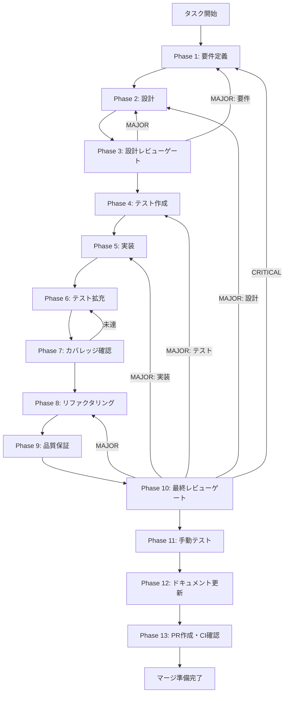

# TASK-SC-07-SKILL-CREATE-WIZARD-LLM-CONNECTION - タスク実行仕様書

## ユーザーからの元の指示

```
SkillCreateWizard の4段階フローに planSkill/executePlan を接続する。
Phase 2 設計でスコープ外とした未タスク（R-2）。
```

## メタ情報

| 項目         | 内容                               |
| ------------ | ---------------------------------- |
| タスクID     | TASK-SC-07                         |
| タスク名     | skill-create-wizard-llm-connection |
| 分類         | enhancement                        |
| 対象機能     | SkillCreateWizard LLM 生成フロー   |
| 優先度       | 中                                 |
| 見積もり規模 | 中規模                             |
| ステータス   | Phase 1-12 完了                    |
| 作成日       | 2026-03-24                         |
| GitHub Issue | #1588                              |

---

## タスク概要

### 目的

SkillCreateWizard の4段階ウィザードフロー（DescribeStep -> ConfigureStep -> GenerateStep -> CompleteStep）に、planSkill / executePlan による LLM 生成ルートを追加する。ユーザーが「LLM で生成」を選択した場合、Preload API 経由で planSkill を呼び出し、GenerateStep で計画結果を表示し、executePlan でスキルを生成する。

### 背景

TASK-SC-06-UI-RUNTIME-CONNECTION で SkillLifecyclePanel への planSkill/executePlan 接続を完了した。SkillCreateWizard（GenerateStep）への接続は独立した別タスクとして分離された（Phase 2 設計 R-2）。SkillLifecyclePanel の実装パターン（Hybrid State Pattern、対称クリア、PlanResult の Single Source of Truth）を SkillCreateWizard に適用する。

### 最終ゴール

- DescribeStep で「LLM で生成」を選択できる UI が追加されている
- 「LLM で生成」選択時、planSkill が呼ばれ GenerateStep で plan 結果（type, estimatedSteps, guidance）が表示される
- plan 承認後、executePlan でスキルが生成され CompleteStep に遷移する
- 既存の「テンプレートから作成」フローは非破壊で動作する
- generationProgress が GenerateStep に表示される

### 成果物一覧

| 種別         | 成果物                                 | 配置先                                                               |
| ------------ | -------------------------------------- | -------------------------------------------------------------------- |
| 機能         | SkillCreateWizard LLM 生成フロー       | `apps/desktop/src/renderer/components/skill/SkillCreateWizard.tsx`   |
| 機能         | GenerateStep plan 結果表示 UI          | `apps/desktop/src/renderer/components/skill/wizard/GenerateStep.tsx` |
| 機能         | DescribeStep 生成モード選択 UI         | `apps/desktop/src/renderer/components/skill/wizard/DescribeStep.tsx` |
| テスト       | SkillCreateWizard LLM テスト           | `apps/desktop/src/renderer/components/skill/__tests__/`              |
| テスト       | GenerateStep / DescribeStep テスト更新 | `apps/desktop/src/renderer/components/skill/wizard/__tests__/`       |
| ドキュメント | Phase 出力成果物                       | `outputs/phase-*/`                                                   |
| PR           | GitHub Pull Request                    | GitHub UI                                                            |

---

## 参照ファイル

| 参照資料                        | パス                                                                                 | 内容                                     |
| ------------------------------- | ------------------------------------------------------------------------------------ | ---------------------------------------- |
| 未タスク指示書                  | `docs/30-workflows/unassigned-task/TASK-SC-07-SKILL-CREATE-WIZARD-LLM-CONNECTION.md` | タスク概要・苦戦箇所                     |
| SkillCreateWizard               | `apps/desktop/src/renderer/components/skill/SkillCreateWizard.tsx`                   | 変更対象（ウィザード統合コンポーネント） |
| GenerateStep                    | `apps/desktop/src/renderer/components/skill/wizard/GenerateStep.tsx`                 | 変更対象（生成中ステップ）               |
| DescribeStep                    | `apps/desktop/src/renderer/components/skill/wizard/DescribeStep.tsx`                 | 変更対象（説明入力ステップ）             |
| SkillLifecyclePanel（参考実装） | `apps/desktop/src/renderer/components/skill/SkillLifecyclePanel.tsx`                 | TASK-SC-06 planSkill/executePlan 実装    |
| Preload API                     | `apps/desktop/src/preload/skill-creator-api.ts`                                      | planSkill/executePlan シグネチャ         |
| agentSlice（PlanResult型）      | `apps/desktop/src/renderer/store/slices/agentSlice.ts`                               | PlanResult Single Source of Truth        |
| store index                     | `apps/desktop/src/renderer/store/index.ts`                                           | hooks export                             |

### システム仕様（aiworkflow-requirements）

> 実装前に必ず以下のシステム仕様を確認し、既存設計との整合性を確保してください。

| 参照資料              | パス                                                                              | 内容                       |
| --------------------- | --------------------------------------------------------------------------------- | -------------------------- |
| UI コンポーネント仕様 | `.claude/skills/aiworkflow-requirements/references/arch-ui-components-core.md`    | wizard コンポーネント設計  |
| 状態管理仕様          | `.claude/skills/aiworkflow-requirements/references/arch-state-management-core.md` | Zustand store 設計         |
| IPC Agent API         | `.claude/skills/aiworkflow-requirements/references/api-ipc-agent-core.md`         | planSkill/executePlan 契約 |

---

## タスク分解サマリー

| ID     | フェーズ | サブタスク名             | 責務                                  | 依存 |
| ------ | -------- | ------------------------ | ------------------------------------- | ---- |
| T-01-1 | Phase 1  | 要件定義・受入条件の確定 | scope/AC を固定                       | -    |
| T-02-1 | Phase 2  | コンポーネント設計       | 変更対象・データフロー・型設計        | T-01 |
| T-03-1 | Phase 3  | 設計レビューゲート       | 設計の妥当性を判定                    | T-02 |
| T-04-1 | Phase 4  | テスト作成（Red）        | LLM フロー用テストケースを作成        | T-03 |
| T-05-1 | Phase 5  | 実装                     | DescribeStep/GenerateStep/Wizard 変更 | T-04 |
| T-06-1 | Phase 6  | テスト拡充               | エラーパス・回帰テスト追加            | T-05 |
| T-07-1 | Phase 7  | カバレッジ確認           | coverage gate 達成を確認              | T-06 |
| T-08-1 | Phase 8  | リファクタリング         | 重複排除・共通化                      | T-07 |
| T-09-1 | Phase 9  | 品質保証                 | lint/type/test 一括検証               | T-08 |
| T-10-1 | Phase 10 | 最終レビューゲート       | AC 照合・blocker 判定                 | T-09 |
| T-11-1 | Phase 11 | 手動テスト               | UI 動作確認・スクリーンショット       | T-10 |
| T-12-1 | Phase 12 | ドキュメント更新         | 実装ガイド・仕様同期・未タスク検出    | T-11 |
| T-13-1 | Phase 13 | PR作成・CI確認           | PR 本文生成・CI 通過確認              | T-12 |

**総サブタスク数**: 13個

---

## 実行フロー図



---

## Phase一覧

| Phase | 名称               | 仕様書                                                       | ステータス |
| ----- | ------------------ | ------------------------------------------------------------ | ---------- |
| 1     | 要件定義           | [phase-1-requirements.md](phase-1-requirements.md)           | 完了       |
| 2     | 設計               | [phase-2-design.md](phase-2-design.md)                       | 完了       |
| 3     | 設計レビューゲート | [phase-3-design-review.md](phase-3-design-review.md)         | 完了       |
| 4     | テスト作成         | [phase-4-test-creation.md](phase-4-test-creation.md)         | 完了       |
| 5     | 実装               | [phase-5-implementation.md](phase-5-implementation.md)       | 完了       |
| 6     | テスト拡充         | [phase-6-test-expansion.md](phase-6-test-expansion.md)       | 完了       |
| 7     | カバレッジ確認     | [phase-7-coverage-check.md](phase-7-coverage-check.md)       | 完了       |
| 8     | リファクタリング   | [phase-8-refactoring.md](phase-8-refactoring.md)             | 完了       |
| 9     | 品質保証           | [phase-9-quality-assurance.md](phase-9-quality-assurance.md) | 完了       |
| 10    | 最終レビューゲート | [phase-10-final-review.md](phase-10-final-review.md)         | 完了       |
| 11    | 手動テスト         | [phase-11-manual-test.md](phase-11-manual-test.md)           | 完了       |
| 12    | ドキュメント更新   | [phase-12-documentation.md](phase-12-documentation.md)       | 完了       |
| 13    | PR作成             | [phase-13-pr-creation.md](phase-13-pr-creation.md)           | 未実施     |

---

## TASK-SC-06 実装知見（必読）

本タスクは TASK-SC-06 と同パターンの接続を行うため、以下の苦戦箇所を**事前に**回避すること。

| 苦戦箇所                            | 問題                                                                                  | 回避策                                                                                            |
| ----------------------------------- | ------------------------------------------------------------------------------------- | ------------------------------------------------------------------------------------------------- |
| executePlan 引数不足（C-1）         | Preload API は `skillSpec: string`（必須）。ローカル型の optional と不整合            | Preload API の実シグネチャ (`skill-creator-api.ts:105-110`) を必ず確認し型を合わせる              |
| PlanResult 型の二重定義（C-4）      | agentSlice の `export interface PlanResult` とコンポーネント内型がシャドウイング      | 型は `agentSlice.ts:34` から import。ローカル型定義を作らない                                     |
| Hybrid State Pattern の非対称クリア | localPlanResult と storePlanResult の二重管理でエラーパスで片方だけクリアされるリスク | handleCancelPlan / handleExecutePlan 両方で `setLocalPlanResult(null)` + `clearGenerationState()` |
| generationProgress 未表示（C-2）    | `setGenerationProgress()` を呼ぶが JSX で未表示                                       | useGenerationProgress の import / 変数宣言 / JSX 表示を必ずセットで追加                           |

### TASK-SC-07 自身の実装知見（実装後追記）

| 苦戦箇所                           | 問題                                                                                                              | 解決策                                                                                                  |
| ---------------------------------- | ----------------------------------------------------------------------------------------------------------------- | ------------------------------------------------------------------------------------------------------- |
| ボタン条件不足（P1）               | GenerateStep で `planResult` が null の間ボタンが一切表示されず、LLM 生成中にキャンセルできないスタック状態が発生 | ボタン表示条件を `planResult \|\| isGenerating \|\| error` に拡張し、全 LLM 状態でキャンセル可能にする  |
| エラー時リカバリー不在（P2）       | LLM 生成エラー後に「最初からやり直す」手段がなく、ユーザーがリロードするしかなかった                              | エラー時に `onCancelPlan` を呼ぶ「最初からやり直す」ボタンを追加                                        |
| useEffect クリーンアップ漏れ（P3） | Wizard アンマウント時に Zustand store の generationState が残留し、再オープン時にスタル state が表示された        | `useEffect(() => { return () => { clearGenerationState(); }; }, [])` でアンマウントクリーンアップを追加 |
| テスト MECE 不足（P4）             | executePlan の失敗パス（失敗レスポンス + 例外スロー）にテストがなく、エラーハンドリングの正当性が未検証だった     | E-3（失敗レスポンス）と E-5（例外スロー）のテストケースを追加                                           |
| セレクタ名仕様ドリフト（P5）       | 仕様書が `useIsGenerating` と記載しているが、実装は TASK-SC-06 で `useIsSkillGenerating` にリネーム済み           | 仕様書（arch-state-management-core.md）のセレクタ名を実装と一致するよう更新                             |

### 制約事項

| 制約                            | 説明                                                                                               | 対応方針                                                                   |
| ------------------------------- | -------------------------------------------------------------------------------------------------- | -------------------------------------------------------------------------- |
| Store 競合リスク                | SkillCreateWizard と SkillLifecyclePanel が同一 agentSlice の generationState を共有する           | 両コンポーネントが同時アクティブにならない UI 設計で回避（Phase 2 確認）   |
| clearGenerationState の影響範囲 | `clearGenerationState()` は agentSlice 全体のリセットであり、他コンポーネントの state もクリアする | Hybrid State Pattern で localPlanResult をバッファとし、store 依存を最小化 |

---

## テストカバレッジ目標

### ユニットテスト

| 指標              | 最低基準 | 推奨基準 |
| ----------------- | -------- | -------- |
| Line Coverage     | 80%      | 90%      |
| Branch Coverage   | 60%      | 70%      |
| Function Coverage | 80%      | 90%      |

---

## Phase完了時の必須アクション

**各Phase完了時に以下を必ず実行すること:**

1. **タスク100%実行**: Phase内で指定された全タスクを完全に実行
2. **成果物確認**: 全ての必須成果物が生成されていることを検証
3. **実行記録**: 実行タスクの結果を記録
4. **artifacts.json更新**: Phase完了ステータスを更新
5. **Phase末端の実行確認**: 各タスクを100%実行し、各タスクを完遂した旨を必ず明記

```bash
# Phase完了時の検証コマンド
node .claude/skills/task-specification-creator/scripts/validate-phase-output.js docs/30-workflows/TASK-SC-07-SKILL-CREATE-WIZARD-LLM-CONNECTION --phase {{PHASE_NUMBER}}
```
