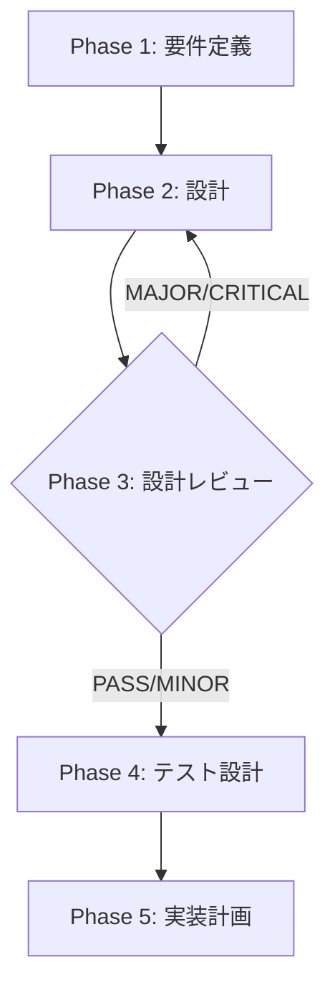

# TASK-SC-FIX-GENERATE-SKILL-MD-001: generate_skill_md.js 引数修正

## メタ情報

| 項目           | 内容                                      |
| -------------- | ----------------------------------------- |
| タスクID       | TASK-SC-FIX-GENERATE-SKILL-MD-001         |
| タスク名       | generate_skill_md.js 引数修正             |
| 分類           | バグ修正                                  |
| 対象機能       | SkillCreatorService（スキル作成サービス） |
| 優先度         | 高                                        |
| 見積もり規模   | 小規模                                    |
| ステータス     | pending                                   |
| 作成日         | 2026-04-14                                |
| 親ワークフロー | skill-creator-workflow-fix-lane           |

---

## 現在の状態

- Phase 1〜5 は pending
- Phase 6〜13 は本仕様書のスコープ外（今回は Phase 1-5 の仕様書のみ作成）

## タスク概要

### 目的

`SkillCreatorService.ts` 内の `generate_skill_md.js` 呼び出しを正しい引数（`--plan` / `--output`）で実行できるよう修正し、
SKILL.md が `## Task一覧` セクションと YAML フロントマターを含む完全な形で生成されることを保証する。

### 背景

`SkillCreatorService.ts:155-158` では `generate_skill_md.js` を `["--path", skillDir]` で呼び出しているが、
当スクリプトの仕様は `--plan <json>` と `--output <path>` が必須引数として定義されている。

このミスマッチにより：

1. `generateResult.success` が常に `false` になる
2. フォールバック `ensureSkillMdExists` のみが実行される
3. フォールバック生成の SKILL.md には `## Task一覧` セクションと YAML フロントマターが不足する
4. スキル仕様書としての完全性が保証されない

### 依存タスク

- **依存**: なし（このタスクは他のタスクのブロッカーとなりうる）

### 最終ゴール

1. `generate_skill_md.js` が `--plan <json>` / `--output <path>` 引数で呼び出され終了コード 0 で完了する
2. 生成 SKILL.md に `## Task一覧` セクションが含まれる
3. 生成 SKILL.md に YAML フロントマターが含まれる
4. スクリプト不在時は `ensureSkillMdExists` フォールバックが正常に機能する
5. tmp json ファイルが finally 節で確実に削除される

---

## 受入条件

| ID   | 条件                                                              |
| ---- | ----------------------------------------------------------------- |
| AC-1 | `generate_skill_md.js` が終了コード 0 で完了する                  |
| AC-2 | 生成 SKILL.md に `## Task一覧` セクションが含まれる               |
| AC-3 | 生成 SKILL.md に YAML フロントマターが含まれる                    |
| AC-4 | スクリプト不在時は `ensureSkillMdExists` フォールバックが機能する |
| AC-5 | tmp json ファイルが finally 節で削除される                        |

---

## 変更対象ファイル

| ファイル                                                                     | 修正内容                                                                               |
| ---------------------------------------------------------------------------- | -------------------------------------------------------------------------------------- |
| `apps/desktop/src/main/services/skill/SkillCreatorService.ts`                | 行 152-165: `--plan` / `--output` 引数でスクリプト呼び出し修正・tmp JSON 生成・cleanup |
| `apps/desktop/src/main/services/skill/__tests__/SkillCreatorService.test.ts` | generate_skill_md.js の引数検証テスト追加・フォールバックテスト更新                    |

---

## 成果物一覧

| Phase | 名称         | 成果物                                   |
| ----- | ------------ | ---------------------------------------- |
| 1     | 要件定義     | `outputs/phase-1/requirements.md`        |
| 2     | 設計         | `outputs/phase-2/design.md`              |
| 3     | 設計レビュー | `outputs/phase-3/review.md`              |
| 4     | テスト設計   | `outputs/phase-4/test-design.md`         |
| 5     | 実装計画     | `outputs/phase-5/implementation-plan.md` |

---

## 参照ファイル

- `apps/desktop/src/main/services/skill/SkillCreatorService.ts`
- `apps/desktop/src/main/services/skill/__tests__/SkillCreatorService.test.ts`
- `docs/30-workflows/skill-creator-workflow-fix-lane/index.md`

---

## タスク分解サマリ（Phase 1-5）



| Phase | 名称         | パターン | 依存    | ゲート | ステータス |
| ----- | ------------ | -------- | ------- | ------ | ---------- |
| 1     | 要件定義     | seq      | -       | -      | pending    |
| 2     | 設計         | seq      | Phase 1 | -      | pending    |
| 3     | 設計レビュー | seq      | Phase 2 | GATE   | pending    |
| 4     | テスト設計   | seq      | Phase 3 | -      | pending    |
| 5     | 実装計画     | seq      | Phase 4 | -      | pending    |

---

## テストカバレッジ目標

| カテゴリ | 対象                                                           | 目標 |
| -------- | -------------------------------------------------------------- | ---- |
| ユニット | `generate_skill_md.js` が `--plan` / `--output` で呼ばれること | 100% |
| ユニット | finally 節での tmp json cleanup                                | 100% |
| ユニット | スクリプト不在時フォールバック動作                             | 100% |
| ユニット | 生成 SKILL.md に `## Task一覧` セクションが含まれること        | 100% |

---

## 出力ファイル構成

```
docs/30-workflows/skill-creator-workflow-fix-lane/TASK-SC-FIX-GENERATE-SKILL-MD-001/
├── index.md
├── artifacts.json
├── phase-1-requirements.md
├── phase-2-design.md
├── phase-3-design-review.md
├── phase-4-test-creation.md
├── phase-5-implementation.md
└── outputs/
    ├── phase-1/
    │   └── requirements.md
    ├── phase-2/
    │   └── design.md
    ├── phase-3/
    │   └── review.md
    ├── phase-4/
    │   └── test-design.md
    └── phase-5/
        └── implementation-plan.md
```
