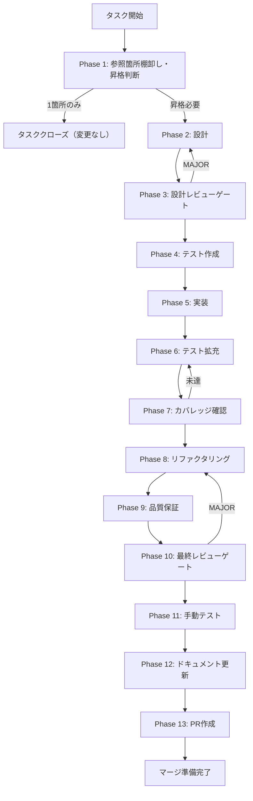

# shared-type-promote - タスク実行仕様書

## ユーザーからの元の指示

GitHub Issue #2182: StructurePlanJsonの@repo/shared/types昇格判断・実施

## メタ情報

| 項目         | 内容                                       |
| ------------ | ------------------------------------------ |
| タスクID     | TASK-SC-SHARED-TYPE-PROMOTE-001            |
| タスク名     | shared-type-promote                        |
| 分類         | リファクタリング                           |
| 対象機能     | SkillCreatorService の型定義管理           |
| 優先度       | LOW                                        |
| 見積もり規模 | 小規模                                     |
| ステータス   | 完了                                       |
| 作成日       | 2026-04-16                                 |
| 依存タスク   | TASK-SC-PLAN-CONNECT-GENERATE-SKILL-MD-001 |

---

## タスク概要

### 目的

`StructurePlanJson` インタフェースの**実装コード参照箇所**を棚卸しし、
1箇所のみならローカル定義のまま即クローズ、2箇所以上なら `@repo/shared/types` へ昇格して Single Source of Truth を確立する。

> 注: 参照箇所数の判定対象は `apps/` と `packages/` の実装コードのみ。`docs/` や `.claude/` 内の言及は補助情報として扱い、カウントしない。

### 背景

`SkillCreatorService.ts` にローカル定義されている `StructurePlanJson` は、現時点では単一定義だが、
今後の参照増加に備えて所有権を先に確定しておく必要がある。
過去に TASK-SC-07 苦戦箇所 C-4（PlanResult 型の二重定義によるシャドウイング）が発生しており、
同様の問題を予防するために型の所有権を事前に確定する。

### 実施結果

- 実装コード参照ファイル数: 1
- 実装コード内ヒット数: 6
- 判断: `StructurePlanJson` はローカル定義維持・クローズ
- 追加実装: なし

### 最終ゴール

- 参照箇所棚卸し結果が本仕様書に記録されていること
- 昇格する場合：`StructurePlanJson` が `packages/shared/src/types/skillCreator.ts` で Single Source of Truth として定義され、`packages/shared/src/types/index.ts` / `packages/shared/index.ts` を通じて `@repo/shared/types` から参照できること
- 昇格しない場合：ローカル定義のまま維持し、理由が記録されていること
- TypeScript 型チェック PASS
- 全テスト PASS

### 成果物一覧

| 種別               | 成果物                                      | 配置先                                  |
| ------------------ | ------------------------------------------- | --------------------------------------- |
| 設計               | 参照箇所棚卸し結果・判断記録                | `outputs/phase-1/`                      |
| コード（条件付き） | `packages/shared/src/types/skillCreator.ts` | `packages/shared/src/types/`            |
| コード（条件付き） | `packages/shared/src/types/index.ts`        | `packages/shared/src/types/`            |
| コード（条件付き） | `SkillCreatorService.ts` import修正         | `apps/desktop/src/main/services/skill/` |
| ドキュメント       | 実装ガイド・システム仕様更新サマリー        | `outputs/phase-12/`                     |
| PR                 | GitHub Pull Request（昇格する場合のみ）     | GitHub UI                               |

---

## 参照ファイル

- `apps/desktop/src/main/services/skill/SkillCreatorService.ts` - StructurePlanJson 現行定義箇所
- `packages/shared/src/types/skillCreator.ts` - 昇格先候補の型定義ファイル
- `packages/shared/src/types/index.ts` - `@repo/shared/types` の barrel
- `packages/shared/index.ts` - `@repo/shared` の root barrel
- `.claude/skills/aiworkflow-requirements/references/` - システム仕様・current facts

---

## タスク分解サマリー

| ID     | フェーズ | サブタスク名                         | 責務                             | 依存 |
| ------ | -------- | ------------------------------------ | -------------------------------- | ---- |
| T-01-1 | Phase 1  | 参照箇所棚卸し・昇格判断             | 全参照箇所調査・昇格可否決定     | -    |
| T-02-1 | Phase 2  | 昇格先設計（条件付き）               | shared型定義・import切り替え設計 | T-01 |
| T-03-1 | Phase 3  | 設計レビューゲート                   | Single Source of Truth確認       | T-02 |
| T-04-1 | Phase 4  | 型エクスポートテスト作成（条件付き） | shared型の正しいexport確認テスト | T-03 |
| T-05-1 | Phase 5  | 昇格実装（条件付き）                 | 型移動・import切り替え実装       | T-04 |
| T-06-1 | Phase 6  | テスト拡充（条件付き）               | エッジケースのテスト追加         | T-05 |
| T-07-1 | Phase 7  | カバレッジ確認                       | 型チェック・テスト全PASS確認     | T-06 |
| T-08-1 | Phase 8  | リファクタリング                     | コード整理・import整合           | T-07 |
| T-09-1 | Phase 9  | 品質保証                             | typecheck/lint/test PASS確認     | T-08 |
| T-10-1 | Phase 10 | 最終レビューゲート                   | AC-1〜AC-5充足確認               | T-09 |
| T-11-1 | Phase 11 | 手動テスト                           | 型参照・ビルド確認               | T-10 |
| T-12-1 | Phase 12 | ドキュメント更新                     | 実装ガイド・仕様書更新           | T-11 |
| T-13-1 | Phase 13 | PR作成                               | 変更サマリー・CI確認             | T-12 |

**総サブタスク数**: 13個

---

## 実行フロー図



---

## Phase一覧

| Phase | 名称               | 仕様書                                                       | ステータス |
| ----- | ------------------ | ------------------------------------------------------------ | ---------- |
| 1     | 要件定義           | [phase-1-requirements.md](phase-1-requirements.md)           | completed  |
| 2     | 設計               | [phase-2-design.md](phase-2-design.md)                       | skipped    |
| 3     | 設計レビューゲート | [phase-3-design-review.md](phase-3-design-review.md)         | skipped    |
| 4     | テスト作成         | [phase-4-test-creation.md](phase-4-test-creation.md)         | skipped    |
| 5     | 実装               | [phase-5-implementation.md](phase-5-implementation.md)       | skipped    |
| 6     | テスト拡充         | [phase-6-test-expansion.md](phase-6-test-expansion.md)       | skipped    |
| 7     | カバレッジ確認     | [phase-7-coverage-check.md](phase-7-coverage-check.md)       | skipped    |
| 8     | リファクタリング   | [phase-8-refactoring.md](phase-8-refactoring.md)             | skipped    |
| 9     | 品質保証           | [phase-9-quality-assurance.md](phase-9-quality-assurance.md) | skipped    |
| 10    | 最終レビューゲート | [phase-10-final-review.md](phase-10-final-review.md)         | skipped    |
| 11    | 手動テスト         | [phase-11-manual-test.md](phase-11-manual-test.md)           | skipped    |
| 12    | ドキュメント更新   | [phase-12-documentation.md](phase-12-documentation.md)       | completed  |
| 13    | PR作成             | [phase-13-pr-creation.md](phase-13-pr-creation.md)           | skipped    |

---

## テストカバレッジ目標

### ユニットテスト（昇格実施の場合）

| 指標              | 最低基準 | 推奨基準 |
| ----------------- | -------- | -------- |
| Line Coverage     | 80%      | 90%      |
| Branch Coverage   | 60%      | 70%      |
| Function Coverage | 80%      | 90%      |

---

## Phase完了時の必須アクション

**各Phase完了時に以下を必ず実行すること:**

1. **タスク100%実行**: Phase内で指定された全タスクを完全に実行
2. **成果物確認**: 全ての必須成果物が生成されていることを検証
3. **実行記録**: 実行タスクの結果を記録
4. **artifacts.json更新**: Phase完了ステータスを更新
5. **Phase末端の実行確認**: 各タスクを100%実行し、各タスクを完遂した旨を必ず明記

```bash
# Phase完了時の検証コマンド
node .claude/skills/task-specification-creator/scripts/validate-phase-output.js docs/30-workflows/TASK-SC-SHARED-TYPE-PROMOTE-001 --phase {{PHASE_NUMBER}}

# Phase完了・成果物登録
node .claude/skills/task-specification-creator/scripts/complete-phase.js \
  --workflow docs/30-workflows/TASK-SC-SHARED-TYPE-PROMOTE-001 --phase {{PHASE_NUMBER}} --artifacts "..."
```

---

_このファイルは task-specification-creator によって生成されました。_
_最終更新: 2026-04-16_
