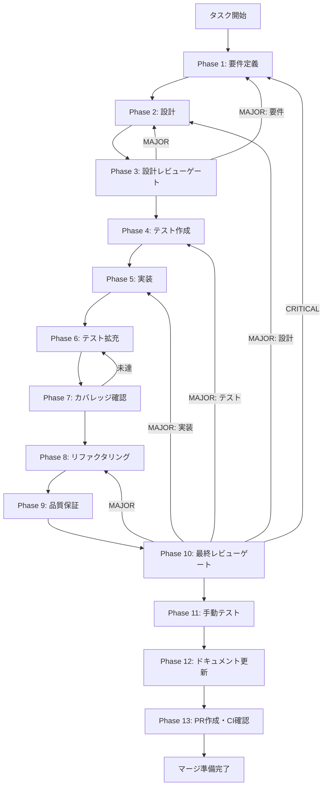

# TASK-SW-FIX-FEEDBACK-001: スキルウィザード current facts 同期・skill準拠検証・docs-only 改善

## メタ情報

| 項目           | 内容                                                               |
| -------------- | ------------------------------------------------------------------ |
| タスクID       | TASK-SW-FIX-FEEDBACK-001                                           |
| タスク名       | スキルウィザード current facts 同期・skill準拠検証・docs-only 改善 |
| 分類           | docs-only / spec_created（current facts と skill 定義の同期）      |
| 対象機能       | SkillLifecyclePanel / CompleteStep / existing tests                |
| 優先度         | 高（`priority:high`）                                              |
| 見積もり規模   | 小規模（`scale:small`）                                            |
| ステータス     | 未実施                                                             |
| 実行タイミング | Wave B（current facts 同期として実行可能）                         |
| 依存タスク     | TASK-SW-FIX-DATAFLOW-001（完了済み）                               |
| 作成日         | 2026-04-13                                                         |
| GitHub Issue   | #2131                                                              |

---

## タスク概要

### 目的

current facts と 2 つの skill 定義の差分を整理し、既存実装が持つ挙動を `SkillLifecyclePanel` / `CompleteStep` / existing tests へ正しく同期する。
本タスクは docs-only を既定とし、code delta が必要になるのは current facts に未反映の parity gap が確認された場合に限る。

### 背景

スキルウィザードには、スキル生成後のフィードバックループに関する複数の論点がある。
現在の branch では、issue 6 / 14 / 20 は current facts として既に解消済みで、issue 8 は follow-up 候補として分離するのが最もエレガントである。

| 問題番号 | 内容                                                                                                                     | 扱い          |
| -------- | ------------------------------------------------------------------------------------------------------------------------ | ------------- |
| 問題6    | LLMモードでの生成完了後に一覧更新が必要かを再確認する論点。current facts では `SkillLifecyclePanel` 側で既に実装済み     | 解消済み      |
| 問題8    | `fetchSkills()` 失敗時の非ブロッキング扱いは、現行 current facts では未採用。別タスク候補として切り出す論点              | follow-up候補 |
| 問題14   | `skillPath = null` のまま Step 3（CompleteStep）に遷移した場合のエラー表示の有無。current facts では既に null ガードあり | 解消済み      |
| 問題20   | `CompleteStep` の成功ヘッダーが `skillPath` 値に応じて条件表示されるかどうか。current facts では既に条件表示あり         | 解消済み      |

### 依存タスク

| タスクID                 | 状態     | 関係                     |
| ------------------------ | -------- | ------------------------ |
| TASK-SW-FIX-DATAFLOW-001 | 完了済み | Wave A（本タスクの前提） |

### 最終ゴール

1. `SkillLifecyclePanel` の current facts と skill 定義の差分を、解消済み / follow-up候補 / 未解決に分けて明文化する
2. `CompleteStep` の current contract を、型・分岐・既存テストの証跡つきで固定する
3. `SkillLifecyclePanel` と `CompleteStep` の既存挙動が skill 定義に準拠していることを current facts として記録する
4. follow-up候補がある場合は、別タスクへ分離する判断基準を明示する

---

## 変更対象ファイル

| ファイル                                                    | 修正内容                                           |
| ----------------------------------------------------------- | -------------------------------------------------- |
| `docs/30-workflows/TASK-SW-FIX-FEEDBACK-001/index.md`       | current facts 同期と scope 再定義                  |
| `docs/30-workflows/TASK-SW-FIX-FEEDBACK-001/phase-*.md`     | 各 Phase の current facts / docs-only 記述へ再構成 |
| `docs/30-workflows/TASK-SW-FIX-FEEDBACK-001/artifacts.json` | Phase 状態と成果物メタデータの同期                 |

---

## 成果物一覧

| Phase | 名称             | 成果物                                                                                                                                                                                                              |
| ----- | ---------------- | ------------------------------------------------------------------------------------------------------------------------------------------------------------------------------------------------------------------- |
| 1     | 要件定義         | `outputs/phase-1/requirements-definition.md`                                                                                                                                                                        |
| 2     | 設計             | `outputs/phase-2/design-document.md`                                                                                                                                                                                |
| 3     | 設計レビュー     | `outputs/phase-3/review-result.md`                                                                                                                                                                                  |
| 4     | テスト作成       | `outputs/phase-4/test-specifications.md`                                                                                                                                                                            |
| 5     | 実装             | `outputs/phase-5/implementation-record.md`                                                                                                                                                                          |
| 6     | テスト拡充       | `outputs/phase-6/extended-test-record.md`                                                                                                                                                                           |
| 7     | カバレッジ確認   | `outputs/phase-7/coverage-report.md`                                                                                                                                                                                |
| 8     | リファクタリング | `outputs/phase-8/refactoring-record.md`                                                                                                                                                                             |
| 9     | 品質保証         | `outputs/phase-9/quality-report.md`                                                                                                                                                                                 |
| 10    | 最終レビュー     | `outputs/phase-10/final-review-result.md`                                                                                                                                                                           |
| 11    | 手動テスト       | `outputs/phase-11/manual-test-result.md`                                                                                                                                                                            |
| 12    | ドキュメント更新 | `outputs/phase-12/implementation-guide.md` / `system-spec-update-summary.md` / `documentation-changelog.md` / `unassigned-task-detection.md` / `skill-feedback-report.md` / `phase12-task-spec-compliance-check.md` |
| 13    | PR作成           | `outputs/phase-13/pr-info.md`                                                                                                                                                                                       |

---

## 参照ファイル

本仕様書のコマンド選定は以下を参照：

- `docs/00-requirements/master_system_design.md` - システム要件
- `.claude/skills/aiworkflow-requirements/references/` - システム仕様

### システム仕様（aiworkflow-requirements）

> 実装前に必ず以下のシステム仕様を確認し、既存設計との整合性を確保してください。

| 参照資料              | パス                                                                         | 内容                               |
| --------------------- | ---------------------------------------------------------------------------- | ---------------------------------- |
| UI コンポーネント設計 | `.claude/skills/aiworkflow-requirements/references/arch-ui-components.md`    | Wizard系コンポーネントのアーキ     |
| 状態管理設計          | `.claude/skills/aiworkflow-requirements/references/arch-state-management.md` | スキルウィザードの状態管理パターン |

---

## タスク分解サマリー

| ID     | フェーズ | サブタスク名       | 責務                                        | 依存 |
| ------ | -------- | ------------------ | ------------------------------------------- | ---- |
| T-01-1 | Phase 1  | 要件定義           | current facts 固定・受入条件再定義          | -    |
| T-02-1 | Phase 2  | 設計               | docs-only / follow-up 分岐設計              | T-01 |
| T-03-1 | Phase 3  | 設計レビューゲート | current facts 整合・AC網羅確認              | T-02 |
| T-04-1 | Phase 4  | テスト作成         | 既存テストの evidence matrix 化             | T-03 |
| T-05-1 | Phase 5  | 実装               | code delta 要否判定・no-op 記録             | T-04 |
| T-06-1 | Phase 6  | テスト拡充         | 既存テストの境界ケース棚卸し                | T-05 |
| T-07-1 | Phase 7  | カバレッジ確認     | current facts カバレッジ検証                | T-06 |
| T-08-1 | Phase 8  | リファクタリング   | terminology / narrative 整流化              | T-07 |
| T-09-1 | Phase 9  | 品質保証           | docs validator / current evidence 確認      | T-08 |
| T-10-1 | Phase 10 | 最終レビューゲート | AC-1〜AC-5 の current facts 最終確認        | T-09 |
| T-11-1 | Phase 11 | 手動テスト         | current facts walkthrough / CAPTURE_BLOCKED | T-10 |
| T-12-1 | Phase 12 | ドキュメント更新   | 実装ガイド・仕様更新・未タスク検出          | T-11 |
| T-13-1 | Phase 13 | PR作成             | ユーザー承認後にPR作成                      | T-12 |

**総サブタスク数**: 13個

---

## 実行フロー図

---

## Phase一覧

| Phase | 名称               | 仕様書                                                       | ステータス |
| ----- | ------------------ | ------------------------------------------------------------ | ---------- |
| 1     | 要件定義           | [phase-1-requirements.md](phase-1-requirements.md)           | 未実施     |
| 2     | 設計               | [phase-2-design.md](phase-2-design.md)                       | 未実施     |
| 3     | 設計レビューゲート | [phase-3-design-review.md](phase-3-design-review.md)         | 未実施     |
| 4     | テスト作成         | [phase-4-test-creation.md](phase-4-test-creation.md)         | 未実施     |
| 5     | 実装               | [phase-5-implementation.md](phase-5-implementation.md)       | 未実施     |
| 6     | テスト拡充         | [phase-6-test-expansion.md](phase-6-test-expansion.md)       | 未実施     |
| 7     | カバレッジ確認     | [phase-7-coverage-check.md](phase-7-coverage-check.md)       | 未実施     |
| 8     | リファクタリング   | [phase-8-refactoring.md](phase-8-refactoring.md)             | 未実施     |
| 9     | 品質保証           | [phase-9-quality-assurance.md](phase-9-quality-assurance.md) | 未実施     |
| 10    | 最終レビューゲート | [phase-10-final-review.md](phase-10-final-review.md)         | 未実施     |
| 11    | 手動テスト         | [phase-11-manual-test.md](phase-11-manual-test.md)           | 未実施     |
| 12    | ドキュメント更新   | [phase-12-documentation.md](phase-12-documentation.md)       | 未実施     |
| 13    | PR作成             | [phase-13-pr-creation.md](phase-13-pr-creation.md)           | blocked    |

---

## テストカバレッジ目標

### ユニットテスト

| 指標              | 最低基準 | 推奨基準 |
| ----------------- | -------- | -------- |
| Line Coverage     | 80%      | 90%      |
| Branch Coverage   | 60%      | 70%      |
| Function Coverage | 80%      | 90%      |

---

## テストケーステーブル

| テストID        | 対象ファイル            | 入力条件             | 期待結果                                              | 対応AC |
| --------------- | ----------------------- | -------------------- | ----------------------------------------------------- | ------ |
| TC-FEEDBACK-001 | SkillLifecyclePanel.tsx | LLMモード成功        | `fetchSkills` が1回呼ばれ、`selectSkillByName` が続く | AC-1   |
| TC-FEEDBACK-002 | SkillLifecyclePanel.tsx | `terminal_handoff`   | `fetchSkills` / `selectSkillByName` が呼ばれない      | AC-2   |
| TC-FEEDBACK-004 | CompleteStep.tsx        | `skillPath = null`   | エラーメッセージと retry UI が表示される              | AC-3   |
| TC-FEEDBACK-005 | CompleteStep.tsx        | `skillPath = null`   | 成功ヘッダーが表示されない                            | AC-4   |
| TC-FEEDBACK-006 | CompleteStep.tsx        | `skillPath` が正常値 | 成功ヘッダーと完了画面が表示される                    | AC-5   |

---

## 統合テスト連携（Phase 1〜11で必須）

| Phase | 統合テスト連携アクション                             |
| ----- | ---------------------------------------------------- |
| 1     | current facts と follow-up候補の切り分けを明記       |
| 2     | docs-only / follow-up 分岐と current contract を設計 |
| 3     | 設計と AC-1〜AC-5 の整合レビュー                     |
| 4     | TC-FEEDBACK-001〜005 の evidence matrix 作成         |
| 5     | code delta 要否判定・no-op 記録                      |
| 6     | 既存テストの境界ケース棚卸し                         |
| 7     | current facts のブランチカバレッジ再確認             |
| 8     | terminology / styles 統一                            |
| 9     | docs validator / test evidence 確認                  |
| 10    | AC-1〜AC-5 最終確認                                  |
| 11    | current facts walkthrough / 代替証跡確認             |

---

## Phase完了時の必須アクション

**各Phase完了時に以下を必ず実行すること:**

1. **タスク100%実行**: Phase内で指定された全タスクを完全に実行
2. **成果物確認**: 全ての必須成果物が生成されていることを検証
3. **実行記録**: 実行タスクの結果を記録
4. **artifacts.json更新**: Phase完了ステータスを更新
5. **Phase末端の実行確認**: 各タスクを100%実行し、各タスクを完遂した旨を必ず明記

---

## リスクと対策

| リスク                                                                         | 影響度 | 発生確率 | 対策                                                                |
| ------------------------------------------------------------------------------ | ------ | -------- | ------------------------------------------------------------------- |
| `fetchSkills()` 非ブロッキング化を別タスク化する必要                           | 中     | 中       | 現行 branch では follow-up 候補として分離し、本タスクの AC から外す |
| `CompleteStep.tsx` / `SkillLifecyclePanel.tsx` の current facts と docs のずれ | 中     | 低       | Phase 1〜3 で current contract を固定し、Phase 12 で再同期する      |
| `Phase 13` の user approval 前実行                                             | 高     | 低       | Phase 13 を blocked と明示し、承認が出るまで PR 系操作を禁止する    |
| `CompleteStep.tsx` のUI変更によるスクリーンショットテストへの影響              | 低     | 中       | Phase 11 で CAPTURE_BLOCKED を含む証跡を整理し、必要なら更新する    |
