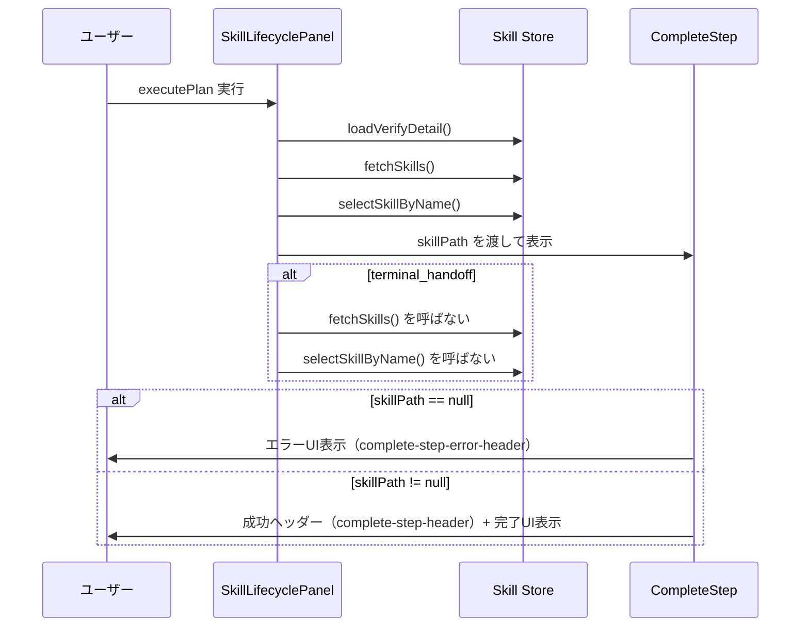

# Phase 2: 設計書

## メタ情報

| 項目       | 内容                     |
| ---------- | ------------------------ |
| Phase      | 2                        |
| Phase名    | 設計                     |
| タスクID   | TASK-SW-FIX-FEEDBACK-001 |
| 作成日     | 2026-04-14               |
| ステータス | completed                |

---

## 1. current contract の設計（Task 1 実行結果）

### SkillLifecyclePanel current flow

`SkillLifecyclePanel.tsx` の `handleExecutePlan` における current contract:

```
executePlan（IPC呼び出し）
  ↓ 成功 (executeResponse.success === true)
loadVerifyDetail(planId)
  ↓
fetchSkills()           ← 1回だけ呼ばれる (AC-1)
  ↓
selectSkillByName(executeResponse.skillName)  ← fetchSkills 後に続く (AC-1)
  ↓
setLocalPlanResult(null) / clearGenerationState()

[別パス: terminal_handoff]
isExecuteTerminalHandoff(executeResponse) === true
  ↓ early return               ← fetchSkills / selectSkillByName は呼ばれない (AC-2)
setHandoffGuidance(...)
loadVerifyDetail(planId)
return
```

### CompleteStep current contract

`CompleteStep.tsx` の null ガードロジック:

```
props.skillPath === null
  ↓ true
エラーUI（complete-step-error-header）を返す   ← AC-3 / AC-4 を保証
  return;

props.skillPath !== null（通常パス）
  ↓
成功ヘッダー（complete-step-header）を描画    ← AC-5 を保証
完了UI / フィードバックUI / ネクストアクションカード を描画
```

### CompleteStepProps current contract

```typescript
export interface CompleteStepProps {
  skillPath?: string | null; // null = 生成失敗ケース（AC-3/AC-4）
  onRetry?: () => void; // オプショナル（null でも安全に動作）
  // ... 他 props（変更対象外）
}
```

---

## 2. docs-only / follow-up 分岐設計（Task 2 実行結果）

### docs-only branch（本タスク）

- current facts と既存テストの証跡を固定する
- code delta は行わない（no-op）
- 対象: AC-1〜AC-5 の current facts 文書化

### follow-up branch（別タスク）

- **issue 8**: `fetchSkills()` の非ブロッキング化
  - 変更対象: `SkillLifecyclePanel.tsx` とその既存テストに限定
  - 変更内容: `await fetchSkills()` を try-catch で non-blocking 化（失敗時でも clearGenerationState を実行）
  - `CompleteStep.tsx` は follow-up の対象外

### 分岐判定基準

| 項目                    | 本タスク (docs-only) | follow-up 候補 |
| ----------------------- | -------------------- | -------------- |
| issue 6 (一覧更新)      | 解消済み（記録のみ） | 不要           |
| issue 8 (non-blocking)  | 対象外               | 別タスクで実施 |
| issue 14 (null guard)   | 解消済み（記録のみ） | 不要           |
| issue 20 (成功ヘッダー) | 解消済み（記録のみ） | 不要           |

---

## 3. CompleteStep null guard 設計（Task 3 実行結果）

### エラーUI の current contract

| 要素                          | 値                                               |
| ----------------------------- | ------------------------------------------------ |
| data-testid                   | `complete-step-error-header`                     |
| role                          | `alert`                                          |
| エラー文言                    | `スキルの生成に失敗しました`                     |
| 補助文言                      | `スキルファイルの作成中にエラーが発生しました。` |
| retry ボタン testid           | `complete-step-retry-button`                     |
| retry ボタン（onRetry未指定） | 安全に描画される（onRetry?.() で null-safe）     |

### 成功ヘッダーの current contract

| 要素           | 値                                                   |
| -------------- | ---------------------------------------------------- |
| data-testid    | `complete-step-header`                               |
| role           | `status`                                             |
| 見出しテキスト | `スキルの骨格を生成しました`                         |
| 表示条件       | `skillPath !== null`（アーリーリターン後の通常パス） |

---

## 4. テストと evidence の対応設計（Task 4 実行結果）

| AC   | 対応する evidence ファイル                    | 対応するテスト名                                                                         |
| ---- | --------------------------------------------- | ---------------------------------------------------------------------------------------- |
| AC-1 | `SkillLifecyclePanel.llm-generation.test.tsx` | U-8: `「実行する」ボタンクリックで executePlan が呼ばれ、完了後にスキル一覧が更新される` |
| AC-2 | `SkillLifecyclePanel.llm-generation.test.tsx` | U-13: `terminal_handoff レスポンス受信時に fetchSkills が呼ばれず早期リターンする`       |
| AC-3 | `CompleteStep.test.tsx`                       | TC-FEEDBACK-004: `skillPath=nullの場合エラーメッセージが表示される`                      |
| AC-4 | `CompleteStep.test.tsx`                       | TC-FEEDBACK-005: `skillPath=nullの場合成功ヘッダーが表示されない`                        |
| AC-5 | `CompleteStep.test.tsx`                       | TC-FEEDBACK-006: `skillPathが正常値の場合成功ヘッダーが表示される`                       |

---

## 5. フロー図（Task 5 実行結果）

### SkillLifecyclePanel current flow



### 設計確定事項

1. current task は docs-only を既定とし、code delta は follow-up 扱いに分離する
2. `SkillLifecyclePanel` を current facts の正本とし、`SkillCreateWizard` は legacy reference に下げる
3. `CompleteStep` は `skillPath === null` のみを失敗扱いとする（空文字は null ではないため success path）
4. 既存テストを evidence として AC-1〜AC-5 に対応付ける

---

## 完了確認

- [x] current facts の current contract が設計に反映されている
- [x] docs-only / follow-up の分岐が明確である
- [x] `CompleteStep` の null guard / success header 設計が確定している
- [x] 既存テストと AC-1〜AC-5 の対応が明確である
- [x] current facts を示すフロー図が作成されている
- [x] 本Phase内の全タスクを100%実行完了
