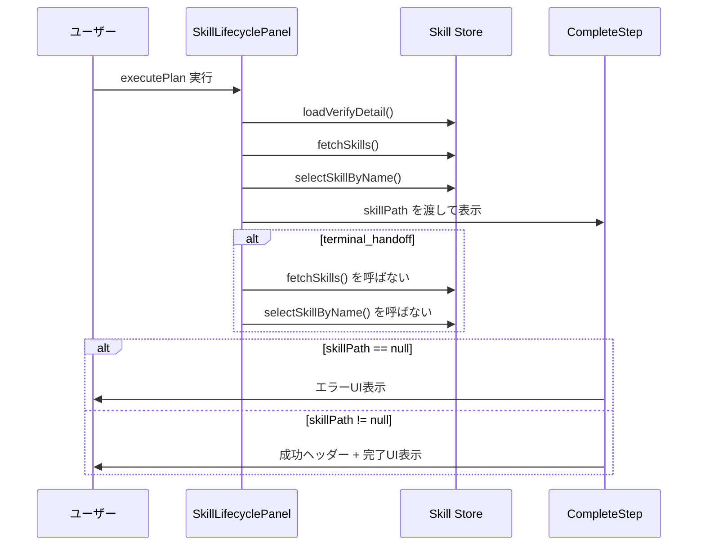

# Phase 2: 設計

## メタ情報

| 項目       | 内容                     |
| ---------- | ------------------------ |
| Phase      | 2                        |
| Phase名    | 設計                     |
| 対象機能   | TASK-SW-FIX-FEEDBACK-001 |
| 前提Phase  | Phase 1: 要件定義        |
| 次Phase    | Phase 3: 設計レビュー    |
| ステータス | pending                  |
| 作成日     | 2026-04-14               |

## 目的

current facts を正本として、docs-only で固定する部分と follow-up 候補を分離する。
この Phase では `SkillLifecyclePanel` / `CompleteStep` の current contract を設計の主語にし、`SkillCreateWizard` は legacy reference として扱う。

## 実行タスク

### Task 1: current contract の設計

`SkillLifecyclePanel` / `CompleteStep` の current facts をそのまま仕様化する。

- `SkillLifecyclePanel` の current flow は `executePlan → loadVerifyDetail → fetchSkills → selectSkillByName`
- `terminal_handoff` は早期リターンし、`fetchSkills` / `selectSkillByName` は呼ばない
- `CompleteStep` は `skillPath === null` のみを失敗ケースとして扱う
- `CompleteStep` の成功ヘッダーは `skillPath !== null` の場合のみ表示される
- `CompleteStepProps` は `skillPath?: string | null` と `onRetry?: () => void` を current contract として記録する

### Task 2: docs-only / follow-up 分岐設計

issue 8 を current task から切り離す設計を確定する。

- docs-only branch:
  - current facts と既存テストの証跡を固定する
  - code delta は行わない
- follow-up branch:
  - `fetchSkills()` の非ブロッキング化を別タスクとして扱う
  - 変更対象は `SkillLifecyclePanel` とその既存テストに限定する
  - `CompleteStep` はこの follow-up では変更しない

### Task 3: CompleteStep null guard 設計

`skillPath = null` のみをエラー UI に分岐させる設計を確定する。

- エラー文言は `スキルの生成に失敗しました`
- 補助文言は `スキルファイルの作成中にエラーが発生しました。`
- retry ボタンは `onRetry` が未指定でも安全に描画される current contract を記録する
- 成功ヘッダーは null guard 後の通常パスでのみ描画される

### Task 4: テストと evidence の対応設計

既存テストを AC の evidence として対応付ける。

| AC   | 対応する evidence                                                      |
| ---- | ---------------------------------------------------------------------- |
| AC-1 | `SkillLifecyclePanel.llm-generation.test.tsx` の success path          |
| AC-2 | `SkillLifecyclePanel.llm-generation.test.tsx` の terminal_handoff path |
| AC-3 | `CompleteStep.test.tsx` の null error UI                               |
| AC-4 | `CompleteStep.test.tsx` の null success header hide                    |
| AC-5 | `CompleteStep.test.tsx` の normal success UI                           |

### Task 5: フロー図作成

current facts と follow-up 分岐を明示するフロー図を作成する。

**設計確定事項**:

1. current task は docs-only を既定とし、code delta は follow-up 扱いに分離する
2. `SkillLifecyclePanel` を current facts の正本とし、`SkillCreateWizard` は legacy reference に下げる
3. `CompleteStep` は `skillPath === null` のみを失敗扱いとする
4. 既存テストを evidence として AC-1〜AC-5 に対応付ける

## 参照資料

| 資料名               | パス                                                                                               | 説明                                         |
| -------------------- | -------------------------------------------------------------------------------------------------- | -------------------------------------------- |
| 要件定義             | `phase-1-requirements.md`                                                                          | AC-1〜AC-5・scope                            |
| current facts        | `apps/desktop/src/renderer/components/skill/SkillLifecyclePanel.tsx`                               | executePlan の現行実装                       |
| current facts        | `apps/desktop/src/renderer/components/skill/wizard/CompleteStep.tsx`                               | null guard / success header / props contract |
| existing tests       | `apps/desktop/src/renderer/components/skill/__tests__/SkillLifecyclePanel.llm-generation.test.tsx` | success / terminal_handoff evidence          |
| existing tests       | `apps/desktop/src/renderer/components/skill/wizard/__tests__/CompleteStep.test.tsx`                | null guard / success UI evidence             |
| UIコンポーネント設計 | `.claude/skills/aiworkflow-requirements/references/arch-ui-components.md`                          | Wizard系コンポーネントのスタイルガイドライン |
| 状態管理設計         | `.claude/skills/aiworkflow-requirements/references/arch-state-management.md`                       | fetchSkills / store の参照                   |

## 統合テスト連携

- `SkillLifecyclePanel` の current flow が AC-1 / AC-2 に対応していることを確認する
- `CompleteStep` の null guard が AC-3 / AC-4 / AC-5 に対応していることを確認する
- follow-up branch が必要な場合のみ、別タスクで code delta とテスト追加を行う

## 成果物

| 成果物 | パス                                 | 説明                                                      |
| ------ | ------------------------------------ | --------------------------------------------------------- |
| 設計書 | `outputs/phase-2/design-document.md` | current contract・docs-only 分岐・evidence 対応・フロー図 |

## 完了条件

- [ ] current facts の current contract が設計に反映されている
- [ ] docs-only / follow-up の分岐が明確である
- [ ] `CompleteStep` の null guard / success header 設計が確定している
- [ ] 既存テストと AC-1〜AC-5 の対応が明確である
- [ ] current facts を示すフロー図が作成されている
- [ ] 本Phase内の全タスクを100%実行完了

## タスク100%実行確認【必須】

- [ ] 本Phase内の全タスクを100%実行完了
- [ ] 各タスクの成果物が生成されている
- [ ] artifacts.json が更新されている
- [ ] Phase末端で各タスクを100%完了し、完了を明記している

## 次Phase

→ [Phase 3: 設計レビュー](./phase-3-design-review.md)
