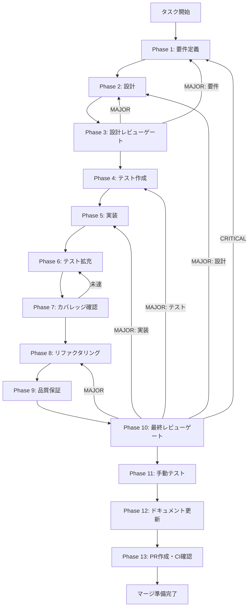

# TASK-UI-SCHEDULE-CRON-UI-VALIDATION-001 - タスク実行仕様書

## ユーザーからの元の指示

```
VisualCronPicker UIコンポーネントにおけるスケジュール設定フォームのUI側バリデーション整理。cronConverter.ts（純粋関数層）のガード処理に加え、UI層での事前バリデーションと状態可視化を強化する。

対象ファイル:
- 修正: apps/desktop/src/renderer/components/schedule/VisualCronPicker.tsx
- テスト追加: apps/desktop/src/__tests__/components/schedule/VisualCronPicker.validation.test.tsx

GitHub Issue: #2109
発見元タスク: TASK-UI-SCHEDULE-CRON-WEEKDAYS-GUARD-001
```

## メタ情報

| 項目         | 内容                                              |
| ------------ | ------------------------------------------------- |
| タスクID     | TASK-UI-SCHEDULE-CRON-UI-VALIDATION-001           |
| タスク名     | VisualCronPicker UIバリデーション整理             |
| 分類         | 改善                                              |
| 対象機能     | スケジュール設定 / VisualCronPickerコンポーネント |
| 優先度       | 中                                                |
| 見積もり規模 | 中規模                                            |
| タスク種別   | VISUAL                                            |
| ステータス   | 完了                                              |
| 作成日       | 2026-04-13                                        |

---

## タスク概要

### 目的

`VisualCronPicker` コンポーネントにおいて、ユーザーが無効な状態で保存できないよう UI層でバリデーションを完結させるとともに、バリデーション状態を呼び出し元へ通知するインターフェースを整備する。

### 背景

TASK-UI-SCHEDULE-CRON-WEEKDAYS-GUARD-001の対応により、`cronConverter.ts`（純粋関数層）では weekly + 空曜日のケースで空文字を返すガード処理が追加された。しかし、ガードが純粋関数層のみに存在しており、UI層での事前バリデーションおよびエラーフィードバックが不完全な状態が残っている。

### スコープ

- 含む: `VisualCronPicker.tsx` へのバリデーション状態管理追加、`onValidationChange?: (isValid: boolean) => void` プロップ追加、monthlyモードでの `dayOfMonth` 範囲バリデーション（1〜31）UIエラー表示、バリデーション状態をカバーするユニットテスト（Vitest / React Testing Library）、Phase 11 スクリーンショット証跡（VISUALタスクのため必須）
- 含まない: `cronConverter.ts` へのmonthlyガード追加（別タスク）、カスタムcron式バリデーション、E2E/Playwrightテスト、デザインシステムの変更

### 最終ゴール

- weekly + 空曜日でエラーメッセージ（`role="alert"`）が表示される
- monthly + 範囲外 `dayOfMonth` でエラーメッセージが表示される
- `onValidationChange` プロップを通じてバリデーション状態が呼び出し元へ通知される
- 既存テスト全件 PASS 継続
- `pnpm --filter @repo/desktop test` が全件 PASS

### 成果物一覧

| 種別         | 成果物                                                       | 配置先                                                                                |
| ------------ | ------------------------------------------------------------ | ------------------------------------------------------------------------------------- |
| 機能修正     | VisualCronPicker.tsx（バリデーション状態管理・プロップ追加） | `apps/desktop/src/renderer/components/schedule/VisualCronPicker.tsx`                  |
| 型定義更新   | VisualCronPickerProps（onValidationChange プロップ）         | 同上                                                                                  |
| テスト       | VisualCronPicker.validation.test.tsx                         | `apps/desktop/src/__tests__/components/schedule/VisualCronPicker.validation.test.tsx` |
| ドキュメント | 各Phase成果物                                                | `docs/30-workflows/TASK-UI-SCHEDULE-CRON-UI-VALIDATION-001/outputs/phase-*/`          |

---

## 参照ファイル

本仕様書のコマンド選定は以下を参照：

- `docs/00-requirements/master_system_design.md` - システム要件
- `.claude/skills/aiworkflow-requirements/references/` - システム仕様
- GitHub Issue #2109 - 関連Issue
- `docs/30-workflows/completed-tasks/TASK-UI-SCHEDULE-CRON-WEEKDAYS-GUARD-001/` - 依存元タスク仕様書

---

## タスク分解サマリー

| ID   | フェーズ | サブタスク名       | 責務                                                               | 依存 |
| ---- | -------- | ------------------ | ------------------------------------------------------------------ | ---- |
| T-01 | Phase 1  | 要件定義           | バリデーション要件・受入基準・プロップ設計の策定                   | -    |
| T-02 | Phase 2  | 設計               | バリデーション状態管理設計・onValidationChangeインターフェース設計 | T-01 |
| T-03 | Phase 3  | 設計レビューゲート | 設計の妥当性確認・後方互換性検証                                   | T-02 |
| T-04 | Phase 4  | テスト作成         | バリデーションケーステスト(RED)作成                                | T-03 |
| T-05 | Phase 5  | 実装               | VisualCronPicker.tsxにバリデーション処理・プロップ追加(GREEN)      | T-04 |
| T-06 | Phase 6  | テスト拡充         | バリデーションテストの網羅性向上（境界値・異常系）                 | T-05 |
| T-07 | Phase 7  | カバレッジ確認     | Line 80%以上達成確認                                               | T-06 |
| T-08 | Phase 8  | リファクタリング   | バリデーションロジックのコード品質改善                             | T-07 |
| T-09 | Phase 9  | 品質保証           | lint/typecheck/全テストPASS確認                                    | T-08 |
| T-10 | Phase 10 | 最終レビューゲート | AC全件充足確認・マージ可否判定                                     | T-09 |
| T-11 | Phase 11 | 手動テスト         | UIコンポーネント修正のためスクリーンショット証跡取得（VISUAL）     | T-10 |
| T-12 | Phase 12 | ドキュメント更新   | 実装ガイド確認・未タスク検出・フィードバック記録                   | T-11 |
| T-13 | Phase 13 | PR作成・CI確認     | PR作成・CI通過・マージ準備                                         | T-12 |

**総サブタスク数**: 13個

---

## 実行フロー図



---

## Phase一覧

| Phase | 名称               | 仕様書                                                       | ステータス |
| ----- | ------------------ | ------------------------------------------------------------ | ---------- |
| 1     | 要件定義           | [phase-1-requirements.md](phase-1-requirements.md)           | 完了       |
| 2     | 設計               | [phase-2-design.md](phase-2-design.md)                       | 完了       |
| 3     | 設計レビューゲート | [phase-3-design-review.md](phase-3-design-review.md)         | 完了       |
| 4     | テスト作成         | [phase-4-test-creation.md](phase-4-test-creation.md)         | 完了       |
| 5     | 実装               | [phase-5-implementation.md](phase-5-implementation.md)       | 完了       |
| 6     | テスト拡充         | [phase-6-test-expansion.md](phase-6-test-expansion.md)       | 完了       |
| 7     | カバレッジ確認     | [phase-7-coverage-check.md](phase-7-coverage-check.md)       | 完了       |
| 8     | リファクタリング   | [phase-8-refactoring.md](phase-8-refactoring.md)             | 完了       |
| 9     | 品質保証           | [phase-9-quality-assurance.md](phase-9-quality-assurance.md) | 完了       |
| 10    | 最終レビューゲート | [phase-10-final-review.md](phase-10-final-review.md)         | 完了       |
| 11    | 手動テスト         | [phase-11-manual-test.md](phase-11-manual-test.md)           | 完了       |
| 12    | ドキュメント更新   | [phase-12-documentation.md](phase-12-documentation.md)       | 完了       |
| 13    | PR作成             | [phase-13-pr-creation.md](phase-13-pr-creation.md)           | 未実施     |

---

## 受入基準 (Acceptance Criteria)

| ID    | 基準                                                                  |
| ----- | --------------------------------------------------------------------- |
| AC-1  | weekly + 空曜日でエラーメッセージ（`role="alert"`）が表示される       |
| AC-2  | weekly + 空曜日で `onValidationChange(false)` が呼ばれる              |
| AC-3  | weekly + 曜日選択時に `onValidationChange(true)` が呼ばれる           |
| AC-4  | monthly + `dayOfMonth < 1` でエラーメッセージが表示される             |
| AC-5  | monthly + `dayOfMonth > 31` でエラーメッセージが表示される            |
| AC-6  | monthly + 無効日付で `onValidationChange(false)` が呼ばれる           |
| AC-7  | monthly + 有効な日付（1〜31）で `onValidationChange(true)` が呼ばれる |
| AC-8  | `onValidationChange` が `undefined` の場合にもエラーなく動作する      |
| AC-9  | `pnpm --filter @repo/desktop test` が全件 PASS                        |
| AC-10 | TypeScript型チェックが PASS                                           |

---

## テストカバレッジ目標

### ユニットテスト

| 指標              | 最低基準 | 推奨基準 |
| ----------------- | -------- | -------- |
| Line Coverage     | 80%      | 90%      |
| Branch Coverage   | 60%      | 70%      |
| Function Coverage | 80%      | 90%      |

### 結合テスト

| 指標                         | 目標 |
| ---------------------------- | ---- |
| APIエンドポイント            | 100% |
| モジュール間インターフェース | 100% |
| 正常系シナリオ               | 100% |
| 異常系シナリオ               | 80%+ |
| 外部連携ポイント             | 100% |

---

## 統合テスト連携（Phase 1〜11で必須）

各Phaseで以下の統合テスト連携アクションを実施すること:

| Phase | 統合テスト連携アクション                                                             |
| ----- | ------------------------------------------------------------------------------------ |
| 1     | バリデーション入出力契約（型・エラーメッセージ仕様・プロップ設計）を要件に明記       |
| 2     | バリデーション状態管理ロジックの設計とonValidationChangeインターフェースを設計に反映 |
| 3     | バリデーション後方互換性・既存テスト影響をレビューゲートで確認                       |
| 4     | weekly空曜日・monthly範囲外各ケースの統合テストシナリオを作成                        |
| 5     | バリデーション実装とテスト支援コード（RTLモック）整備                                |
| 6     | 月次境界値（1, 31, 0, 32）・複合入力ケースの統合テスト拡充                           |
| 7     | 統合テストの再実行とゲート判定（カバレッジ80%以上確認）                              |
| 8     | リファクタ後の統合テスト継続成功を確認                                               |
| 9     | 品質保証で統合テスト結果を確認（lint/typecheck含む）                                 |
| 10    | 最終レビューで統合テスト結果とAC全件充足を確認                                       |
| 11    | VISUALタスクのためUIスクリーンショット証跡を取得・成果物として記録                   |

---

## Phase完了時の必須アクション

**各Phase完了時に以下を必ず実行すること:**

1. **タスク100%実行**: Phase内で指定された全タスクを完全に実行
2. **成果物確認**: 全ての必須成果物が生成されていることを検証
3. **実行記録**: 実行タスクの結果を記録
4. **artifacts.json更新**: Phase完了ステータスを更新
5. **Phase末端の実行確認**: 各タスクを100%実行し、各タスクを完遂した旨を必ず明記

```bash
# Phase完了時の検証コマンド
node .claude/skills/task-specification-creator/scripts/validate-phase-output.js docs/30-workflows/TASK-UI-SCHEDULE-CRON-UI-VALIDATION-001 --phase {{PHASE_NUMBER}}

# Phase完了・成果物登録
node .claude/skills/task-specification-creator/scripts/complete-phase.js \
  --workflow docs/30-workflows/TASK-UI-SCHEDULE-CRON-UI-VALIDATION-001 --phase {{PHASE_NUMBER}} --artifacts "..."
```

---

## 依存関係・発見元タスク

| 種別      | タスクID                                 | ステータス | 説明                                                         |
| --------- | ---------------------------------------- | ---------- | ------------------------------------------------------------ |
| 依存      | TASK-UI-SCHEDULE-CRON-WEEKDAYS-GUARD-001 | 完了済み   | cronConverter.tsのweekly空曜日ガード処理が実装済みであること |
| 推奨依存  | TASK-UI-SCHEDULE-CRON-MONTHLY-GUARD-001  | 推奨       | cronConverter.tsのmonthlyガード追加（別タスク）              |
| 関連Issue | #2109                                    | オープン   | 関連GitHub Issue                                             |
