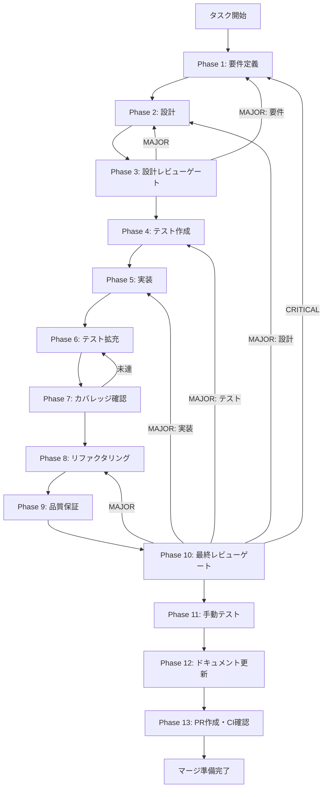

# TASK-UI-SCHEDULE-CRON-WEEKDAYS-GUARD-001 - タスク実行仕様書

## ユーザーからの元の指示

```
cronConverter 空曜日ガード処理追加

visualConfigToCron({ frequency: "weekly", weekdays: [], ... }) が "0 9 * * " のような不正なcron式を出力する。
cronConverter.ts 内でガード処理を追加し、空配列の場合は例外を投げるか安全なフォールバック値を返す。

対象ファイル:
- 修正: apps/desktop/src/renderer/utils/cronConverter.ts
- テスト追加: apps/desktop/src/__tests__/utils/cronConverter.edge.test.ts

GitHub Issue: #2075
発見元タスク: TASK-UI-SCHEDULE-VISUAL-PICKER-001 Phase 12 未タスク検出
```

## メタ情報

| 項目         | 内容                                             |
| ------------ | ------------------------------------------------ |
| タスクID     | TASK-UI-SCHEDULE-CRON-WEEKDAYS-GUARD-001         |
| タスク名     | cronConverter-empty-weekdays-guard               |
| 分類         | バグ修正（防御的プログラミング強化）             |
| 対象機能     | cronConverter ユーティリティ（スケジュール管理） |
| 優先度       | 中                                               |
| 見積もり規模 | 極小規模                                         |
| タスク種別   | docs-only / NON_VISUAL                           |
| ステータス   | 未実施                                           |
| 作成日       | 2026-04-12                                       |

---

## タスク概要

### 目的

`cronConverter.ts` の `visualConfigToCron` 関数において、`weekdays` が空配列 `[]` のときに不正なcron式（例: `"0 9 * * "`）が生成される問題を修正する。
ガード処理を追加することで、入力値の不正状態を早期に検出し、呼び出し元が適切にハンドリングできるようにする。

### 背景

TASK-UI-SCHEDULE-VISUAL-PICKER-001 の Phase 12（ドキュメント更新）において、未タスク検出として発見された。
`frequency: "weekly"` 設定時にユーザーが曜日を一切選択しない状態でも `visualConfigToCron` を呼び出せてしまい、cron フィールドの末尾が空文字となる不正な式が生成される。
不正なcron式はスケジューラーへの登録時にランタイムエラーを引き起こす可能性があり、バグとして修正が必要。

### スコープ

- 含む: 2つのskill定義に対する差分確認、30種の思考法を使った多角的分析、エレガントな改善方針の整理と仕様反映
- 含まない: コミット、push、PR作成

### 最終ゴール

- `visualConfigToCron({ frequency: "weekly", weekdays: [] })` を呼び出した際に空文字 `""` を返し、不正なcron式が生成されない
- 既存の正常ケース（weekdaysに値あり）は全てPASS継続
- `cronConverter.ts` のJSDocにガード処理仕様が記載されている
- 空曜日ケースを検証するエッジケーステストが追加されている

### 成果物一覧

| 種別         | 成果物                                           | 配置先                                                                        |
| ------------ | ------------------------------------------------ | ----------------------------------------------------------------------------- |
| 機能修正     | cronConverter.ts（ガード処理追加）               | `apps/desktop/src/renderer/utils/cronConverter.ts`                            |
| テスト       | cronConverter.edge.test.ts（空曜日エッジケース） | `apps/desktop/src/__tests__/utils/cronConverter.edge.test.ts`                 |
| ドキュメント | 各Phase成果物                                    | `docs/30-workflows/TASK-UI-SCHEDULE-CRON-WEEKDAYS-GUARD-001/outputs/phase-*/` |

---

## 参照ファイル

本仕様書のコマンド選定は以下を参照：

- `docs/00-requirements/master_system_design.md` - システム要件
- `.claude/skills/aiworkflow-requirements/references/` - システム仕様
- GitHub Issue #2075 - バグ報告元Issue
- `docs/30-workflows/completed-tasks/TASK-UI-SCHEDULE-VISUAL-PICKER-001/phase-12-documentation.md` - 発見元タスク仕様書

---

## タスク分解サマリー

| ID   | フェーズ | サブタスク名       | 責務                                             | 依存 |
| ---- | -------- | ------------------ | ------------------------------------------------ | ---- |
| T-01 | Phase 1  | 要件定義           | バグ再現手順・受入基準・ガード戦略の選定         | -    |
| T-02 | Phase 2  | 設計               | 空文字退避方針の設計・型定義確認                 | T-01 |
| T-03 | Phase 3  | 設計レビューゲート | 設計の妥当性確認・後方互換性検証                 | T-02 |
| T-04 | Phase 4  | テスト作成         | 空曜日エッジケーステスト(RED)作成                | T-03 |
| T-05 | Phase 5  | 実装               | cronConverter.tsにガード処理・JSDoc追加(GREEN)   | T-04 |
| T-06 | Phase 6  | テスト拡充         | エッジケーステストの網羅性向上（境界値・異常系） | T-05 |
| T-07 | Phase 7  | カバレッジ確認     | Line 80%以上達成確認                             | T-06 |
| T-08 | Phase 8  | リファクタリング   | ガード処理のコード品質改善                       | T-07 |
| T-09 | Phase 9  | 品質保証           | lint/typecheck/全テストPASS確認                  | T-08 |
| T-10 | Phase 10 | 最終レビューゲート | AC全件充足確認・マージ可否判定                   | T-09 |
| T-11 | Phase 11 | 手動テスト         | 純粋関数修正のため手動確認（NON_VISUAL）         | T-10 |
| T-12 | Phase 12 | ドキュメント更新   | JSDoc確認・未タスク検出・フィードバック記録      | T-11 |
| T-13 | Phase 13 | PR作成・CI確認     | PR作成・CI通過・マージ準備                       | T-12 |

**総サブタスク数**: 13個

---

## 実行フロー図



---

## Phase一覧

| Phase | 名称               | 仕様書                                                       | ステータス |
| ----- | ------------------ | ------------------------------------------------------------ | ---------- |
| 1     | 要件定義           | [phase-1-requirements.md](phase-1-requirements.md)           | 未実施     |
| 2     | 設計               | [phase-2-design.md](phase-2-design.md)                       | 未実施     |
| 3     | 設計レビューゲート | [phase-3-design-review.md](phase-3-design-review.md)         | 未実施     |
| 4     | テスト作成         | [phase-4-test-creation.md](phase-4-test-creation.md)         | 未実施     |
| 5     | 実装               | [phase-5-implementation.md](phase-5-implementation.md)       | 未実施     |
| 6     | テスト拡充         | [phase-6-test-expansion.md](phase-6-test-expansion.md)       | 未実施     |
| 7     | カバレッジ確認     | [phase-7-coverage-check.md](phase-7-coverage-check.md)       | 未実施     |
| 8     | リファクタリング   | [phase-8-refactoring.md](phase-8-refactoring.md)             | 未実施     |
| 9     | 品質保証           | [phase-9-quality-assurance.md](phase-9-quality-assurance.md) | 未実施     |
| 10    | 最終レビューゲート | [phase-10-final-review.md](phase-10-final-review.md)         | 未実施     |
| 11    | 手動テスト         | [phase-11-manual-test.md](phase-11-manual-test.md)           | 未実施     |
| 12    | ドキュメント更新   | [phase-12-documentation.md](phase-12-documentation.md)       | 未実施     |
| 13    | PR作成             | [phase-13-pr-creation.md](phase-13-pr-creation.md)           | 未実施     |

---

## 受入基準 (Acceptance Criteria)

| ID   | 基準                                                                                     |
| ---- | ---------------------------------------------------------------------------------------- |
| AC-1 | `{ frequency: "weekly", weekdays: [] }` で空文字 `""` が返り、不正なcron式が生成されない |
| AC-2 | 正常ケース（weekdaysに値あり）は引き続きPASS                                             |
| AC-3 | 既存テスト全件PASS                                                                       |
| AC-4 | 空曜日ケースの追加テストケースが存在する                                                 |
| AC-5 | `cronConverter.ts` のJSDocにガード処理仕様が記載されている                               |

---

## テストカバレッジ目標

### ユニットテスト

| 指標              | 最低基準 | 推奨基準 |
| ----------------- | -------- | -------- |
| Line Coverage     | 80%      | 90%      |
| Branch Coverage   | 60%      | 70%      |
| Function Coverage | 80%      | 90%      |

### 結合テスト

| 指標                         | 目標 |
| ---------------------------- | ---- |
| APIエンドポイント            | 100% |
| モジュール間インターフェース | 100% |
| 正常系シナリオ               | 100% |
| 異常系シナリオ               | 80%+ |
| 外部連携ポイント             | 100% |

---

## 統合テスト連携（Phase 1〜11で必須）

各Phaseで以下の統合テスト連携アクションを実施すること:

| Phase | 統合テスト連携アクション                                     |
| ----- | ------------------------------------------------------------ |
| 1     | ガード処理の入出力契約（型・空文字退避仕様）を要件に明記     |
| 2     | ガード分岐ロジックの設計と空文字退避方針を設計に反映         |
| 3     | ガード処理の後方互換性・既存テスト影響をレビューゲートで確認 |
| 4     | 空配列・null・undefined各ケースの統合テストシナリオを作成    |
| 5     | ガード処理実装とテスト支援コード（モック不要）整備           |
| 6     | 境界値・複合入力ケースの統合テスト拡充                       |
| 7     | 統合テストの再実行とゲート判定（カバレッジ80%以上確認）      |
| 8     | リファクタ後の統合テスト継続成功を確認                       |
| 9     | 品質保証で統合テスト結果を確認（lint/typecheck含む）         |
| 10    | 最終レビューで統合テスト結果とAC全件充足を確認               |
| 11    | 純粋関数修正のためUI手動確認は省略・cron式出力の端末確認のみ |

---

## Phase完了時の必須アクション

**各Phase完了時に以下を必ず実行すること:**

1. **タスク100%実行**: Phase内で指定された全タスクを完全に実行
2. **成果物確認**: 全ての必須成果物が生成されていることを検証
3. **実行記録**: 実行タスクの結果を記録
4. **artifacts.json更新**: Phase完了ステータスを更新
5. **Phase末端の実行確認**: 各タスクを100%実行し、各タスクを完遂した旨を必ず明記

```bash
# Phase完了時の検証コマンド
node .claude/skills/task-specification-creator/scripts/validate-phase-output.js docs/30-workflows/TASK-UI-SCHEDULE-CRON-WEEKDAYS-GUARD-001 --phase {{PHASE_NUMBER}}

# Phase完了・成果物登録
node .claude/skills/task-specification-creator/scripts/complete-phase.js \
  --workflow docs/30-workflows/TASK-UI-SCHEDULE-CRON-WEEKDAYS-GUARD-001 --phase {{PHASE_NUMBER}} --artifacts "..."
```

---

## 依存関係・発見元タスク

| 種別      | タスクID                           | ステータス | 説明                                                   |
| --------- | ---------------------------------- | ---------- | ------------------------------------------------------ |
| 発見元    | TASK-UI-SCHEDULE-VISUAL-PICKER-001 | 完了済み   | Phase 12完了済み。cronConverter.tsの実装が存在すること |
| 関連Issue | #2075                              | オープン   | バグ報告元GitHub Issue                                 |
