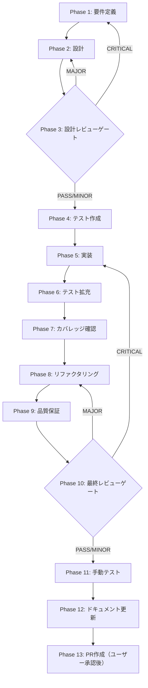

# スケジュール設定入力改善・バリデーション統合 - タスク実行仕様書

## ユーザーからの元の指示

> 今現状のスケジュール設定のクーロン設定は、クーロンの書き方となるような表示でしていますが、このクーロンの書き方は一般的なユーザーは書き方がわからない。書き方を下側に説明を書いてはいるものの、やはりわからないというところがある。ユーザーが直感的に設定できるような時間や日時、曜日などを直感的にポチポチと設定できるような形にして、それをクーロンの形に変換できるようにバックエンドの方で裏側で処理を行って、フロントエンドでもバックエンドでもいいですが、裏側で処理を行ってそれを元に設定するという形にしてほしい。ユーザーが直感的に触れるような仕様にしてほしい。

## 対応課題

- issue #2000: `SkillWizardScheduleConfig` の `cronExpression` / `timezone` バリデーション不足を解消する
- cron 入力の負担軽減: 一般ユーザーが直接 cron 記法を書かずに済む入力体験へ寄せる
- 既存実装の整合: `ConversationRoundStep` と `ScheduleDialog` の入力・検証ロジックを共通化する

## メタ情報

| 項目         | 内容                                                                                    |
| ------------ | --------------------------------------------------------------------------------------- |
| タスクID     | TASK-UI-SCHEDULE-VISUAL-PICKER-001                                                      |
| タスク名     | スケジュール設定入力改善・バリデーション統合                                            |
| 分類         | 改善（UX向上）                                                                          |
| 対象機能     | スキルスケジュール設定UI / スキルウィザード定期実行                                     |
| 優先度       | Medium                                                                                  |
| 見積もり規模 | Medium（フロントエンドUI + 共通バリデーション）                                         |
| ステータス   | Phase 1-12 完了 / Phase 13 保留（ユーザー承認待ち）                                     |
| 作成日       | 2026-04-09                                                                              |
| 関連Issue    | daishiman/AIWorkflowOrchestrator#2000（`skill-wizard-schedule-config-cron-validation`） |
| 前提タスク   | TASK-9G-skill-schedule（Phase 1-12完了済み）                                            |

## タスク概要

### 目的

クロン式（cron expression）の直接入力負担を下げつつ、`SkillWizardScheduleConfig` の `cronExpression` / `timezone` を厳密に検証できるようにする。ユーザーが曜日・時刻・頻度をビジュアルUIで直感的に選択できる `VisualCronPicker` と、スキルウィザードで再利用できる共通バリデーションを実装対象に含める。

### 背景

- 現状の `CronInput` はクロン式の文字列入力（例: `0 9 * * 1-5`）を要求している
- 一般ユーザーにはクロン式の記法が難解で、設定障壁が高い
- プリセットボタンは存在するが、カスタム設定は依然クロン式入力が必要
- TASK-9G でバックエンド（ScheduleStore・SkillScheduler・IPC）は完全実装済み
- `ConversationRoundStep` には cron の初歩的な形式チェックがあるが、timezone の妥当性検証は共通化されていない
- `ScheduleDialog` 側の cron 入力はプリセット中心だが、より直感的な選択 UI への改善余地がある

### 最終ゴール

ユーザーが「毎週月曜と水曜の朝9時」を設定する際に、クロン式を一切知らなくてもポチポチ操作で完了できるUIを提供する。変換後のクロン式 (`0 9 * * 1,3`) は裏側で自動生成され、既存のバックエンドにそのまま渡される。同時に、スキルウィザードでは無効な cronExpression / timezone を即座に検出し、保存前に修正できる。

### スコープ

**含む**:

- `VisualCronPicker` コンポーネントの設計・実装仕様
- `scheduleConfigValidator.ts` などの共通バリデーション設計
- `ScheduleDialog` / `ConversationRoundStep` への適用仕様
- 既存 `CronInput` の置き換えまたは拡張仕様
- 変換結果のプレビュー表示（ユーザーに生成されたクロン式を見せる）

**含まない**:

- バックエンド（ScheduleStore・SkillScheduler）の変更
- IPC チャンネルの変更
- `interval`・`once`・`event` スケジュールタイプの UI 変更（cron タイプのみ対象）
- コードの実装（本タスク仕様書はドキュメントのみ）
- next-run 計算のような意味論的な cron 解析

## 成果物一覧

| 種別                         | 成果物                                | 配置先                                                                   |
| ---------------------------- | ------------------------------------- | ------------------------------------------------------------------------ |
| 仕様書                       | Phase 1-13 タスク仕様書               | `docs/30-workflows/TASK-UI-SCHEDULE-VISUAL-PICKER-001/`                  |
| 実装ガイド（Phase 12）       | implementation-guide.md               | `docs/30-workflows/TASK-UI-SCHEDULE-VISUAL-PICKER-001/outputs/phase-12/` |
| システム仕様更新（Phase 12） | system-spec-update-summary.md         | `docs/30-workflows/TASK-UI-SCHEDULE-VISUAL-PICKER-001/outputs/phase-12/` |
| 未タスク検出（Phase 12）     | unassigned-task-detection.md          | `docs/30-workflows/TASK-UI-SCHEDULE-VISUAL-PICKER-001/outputs/phase-12/` |
| 準拠チェック（Phase 12）     | phase12-task-spec-compliance-check.md | `docs/30-workflows/TASK-UI-SCHEDULE-VISUAL-PICKER-001/outputs/phase-12/` |

## 参照ファイル

| 参照資料           | パス                                                                            | 用途                                                           |
| ------------------ | ------------------------------------------------------------------------------- | -------------------------------------------------------------- |
| マスター設計書     | `docs/00-requirements/master_system_design.md`                                  | システム全体仕様                                               |
| UI/UXガイドライン  | `docs/00-requirements/16-ui-ux-guidelines.md`                                   | デザイン基準                                                   |
| 前提タスク仕様     | `docs/30-workflows/completed-tasks/TASK-9G-skill-schedule/`                     | バックエンド仕様                                               |
| スケジュール型定義 | `packages/shared/src/types/skill-schedule.ts`                                   | 型定義                                                         |
| スキルウィザード型 | `packages/shared/src/types/skillCreator.ts`                                     | `SkillWizardScheduleConfig` / `ConversationRoundStep` の型定義 |
| スキルウィザードUI | `apps/desktop/src/renderer/components/skill/wizard/ConversationRoundStep.tsx`   | issue #2000 の対象                                             |
| スケジュール入力UI | `apps/desktop/src/renderer/views/ScheduleManager/components/ScheduleDialog.tsx` | easy cron input の対象                                         |
| スキル仕様書       | `.claude/skills/task-specification-creator/SKILL.md`                            | フォーマット規定                                               |

## タスク分解サマリー

| ID  | フェーズ | サブタスク名       | 責務                                             | 依存 |
| --- | -------- | ------------------ | ------------------------------------------------ | ---- |
| P01 | Phase 1  | 要件定義           | UX要件・受入基準の確定                           | なし |
| P02 | Phase 2  | 設計               | コンポーネント設計・変換アルゴリズム設計         | P01  |
| P03 | Phase 3  | 設計レビューゲート | Phase 4 進行可否判定                             | P02  |
| P04 | Phase 4  | テスト作成         | cronConverter・コンポーネントのテスト作成（Red） | P03  |
| P05 | Phase 5  | 実装               | VisualCronPicker・cronConverter 実装（Green）    | P04  |
| P06 | Phase 6  | テスト拡充         | 異常系・エッジケース追加                         | P05  |
| P07 | Phase 7  | カバレッジ確認     | 行/分岐カバレッジ計測                            | P06  |
| P08 | Phase 8  | リファクタリング   | コード整理・責務境界の明確化                     | P07  |
| P09 | Phase 9  | 品質保証           | 最終品質チェックリスト実行                       | P08  |
| P10 | Phase 10 | 最終レビューゲート | 出荷準備判定                                     | P09  |
| P11 | Phase 11 | 手動テスト         | ビジュアルUI動作確認（VISUAL）                   | P10  |
| P12 | Phase 12 | ドキュメント更新   | 実装ガイド・システム仕様同期                     | P11  |
| P13 | Phase 13 | PR作成             | ユーザー承認後に実行                             | P12  |

## 実行フロー図



## Phase 一覧

| Phase | 名称               | 仕様書                                                           | ステータス |
| ----- | ------------------ | ---------------------------------------------------------------- | ---------- |
| 1     | 要件定義           | [phase-01-requirements.md](./phase-01-requirements.md)           | 完了       |
| 2     | 設計               | [phase-02-design.md](./phase-02-design.md)                       | 完了       |
| 3     | 設計レビューゲート | [phase-03-design-review.md](./phase-03-design-review.md)         | 完了       |
| 4     | テスト作成         | [phase-04-test-creation.md](./phase-04-test-creation.md)         | 完了       |
| 5     | 実装               | [phase-05-implementation.md](./phase-05-implementation.md)       | 完了       |
| 6     | テスト拡充         | [phase-06-test-extension.md](./phase-06-test-extension.md)       | 完了       |
| 7     | カバレッジ確認     | [phase-07-coverage.md](./phase-07-coverage.md)                   | 完了       |
| 8     | リファクタリング   | [phase-08-refactoring.md](./phase-08-refactoring.md)             | 完了       |
| 9     | 品質保証           | [phase-09-quality-assurance.md](./phase-09-quality-assurance.md) | 完了       |
| 10    | 最終レビューゲート | [phase-10-final-review.md](./phase-10-final-review.md)           | 完了       |
| 11    | 手動テスト         | [phase-11-manual-test.md](./phase-11-manual-test.md)             | 完了       |
| 12    | ドキュメント更新   | [phase-12-documentation.md](./phase-12-documentation.md)         | 完了       |
| 13    | PR作成             | [phase-13-pr-creation.md](./phase-13-pr-creation.md)             | 保留       |

## テストカバレッジ目標

| 種別                 | 対象                         | Line              | Branch | Function |
| -------------------- | ---------------------------- | ----------------- | ------ | -------- |
| ユニットテスト       | `cronConverter.ts`           | 90%+              | 85%+   | 100%     |
| ユニットテスト       | `scheduleConfigValidator.ts` | 95%+              | 90%+   | 100%     |
| ユニットテスト       | `VisualCronPicker`           | 80%+              | 75%+   | 90%+     |
| コンポーネントテスト | `ConversationRoundStep`      | 80%+              | 75%+   | 90%+     |
| 統合テスト           | スケジュール追加フロー       | E2Eシナリオで確認 | -      | -        |

## Phase完了時の必須アクション

各Phaseの実行完了時に以下を確認すること：

1. Phase 内の指定タスクを全件完全実行
2. 必須成果物が全て生成されていることを検証
3. `artifacts.json` の該当Phaseのステータスを `"completed"` に更新
4. 完了条件チェックリストを全てチェック
5. 次Phaseの仕様書を参照し着手準備を確認

## 出力ファイル構成

```
docs/30-workflows/TASK-UI-SCHEDULE-VISUAL-PICKER-001/
├── index.md                          # 本ファイル（メインタスク仕様書）
├── artifacts.json                    # フェーズ進捗管理
├── phase-01-requirements.md          # 要件定義
├── phase-02-design.md                # 設計
├── phase-03-design-review.md         # 設計レビューゲート
├── phase-04-test-creation.md         # テスト作成
├── phase-05-implementation.md        # 実装
├── phase-06-test-extension.md        # テスト拡充
├── phase-07-coverage.md              # カバレッジ確認
├── phase-08-refactoring.md           # リファクタリング
├── phase-09-quality-assurance.md     # 品質保証
├── phase-10-final-review.md          # 最終レビューゲート
├── phase-11-manual-test.md           # 手動テスト
├── phase-12-documentation.md         # ドキュメント更新
├── phase-13-pr-creation.md           # PR作成
└── outputs/
    ├── phase-04/
    │   └── test-spec.md
    ├── phase-05/
    │   └── implementation-summary.md
    ├── phase-11/
    │   ├── manual-test-report.md
    │   ├── manual-test-result.md
    │   ├── screenshot-plan.json
    │   ├── phase11-capture-metadata.json
    │   └── screenshots/
    └── phase-12/
        ├── implementation-guide.md
        ├── system-spec-update-summary.md
        ├── documentation-changelog.md
        ├── unassigned-task-detection.md
        ├── skill-feedback-report.md
        └── phase12-task-spec-compliance-check.md
```
