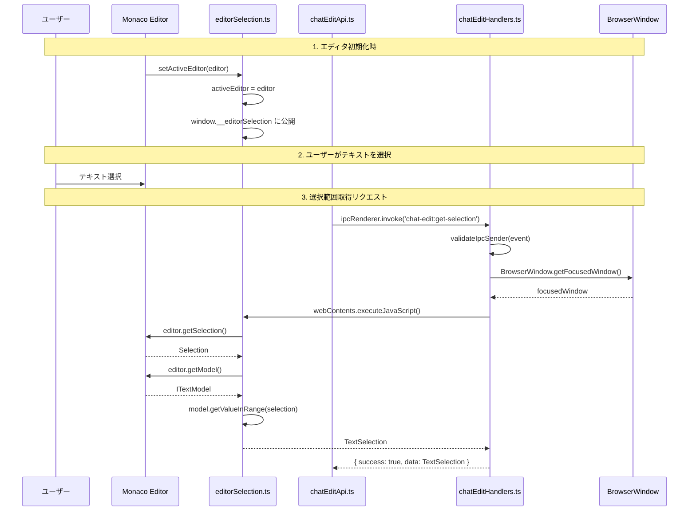
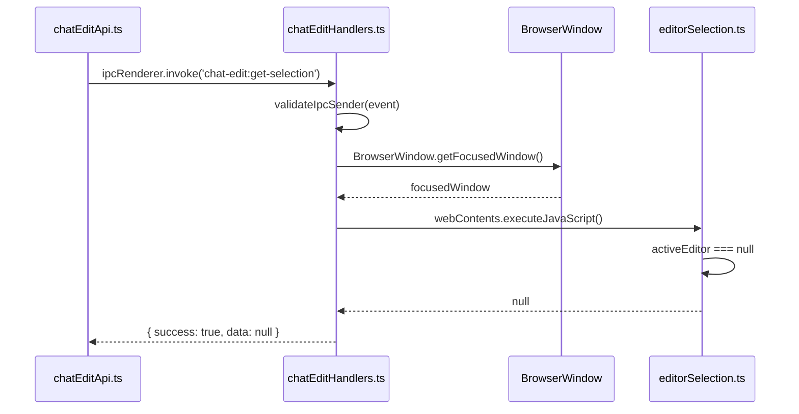
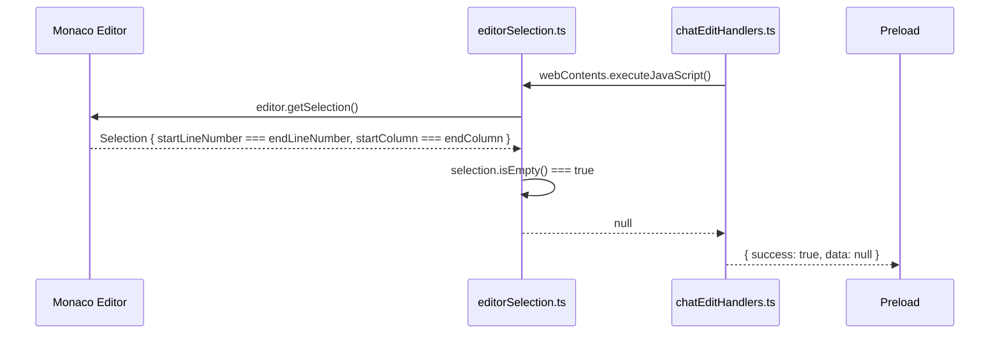
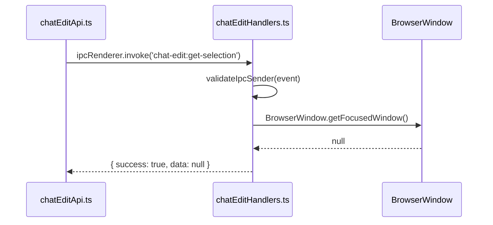
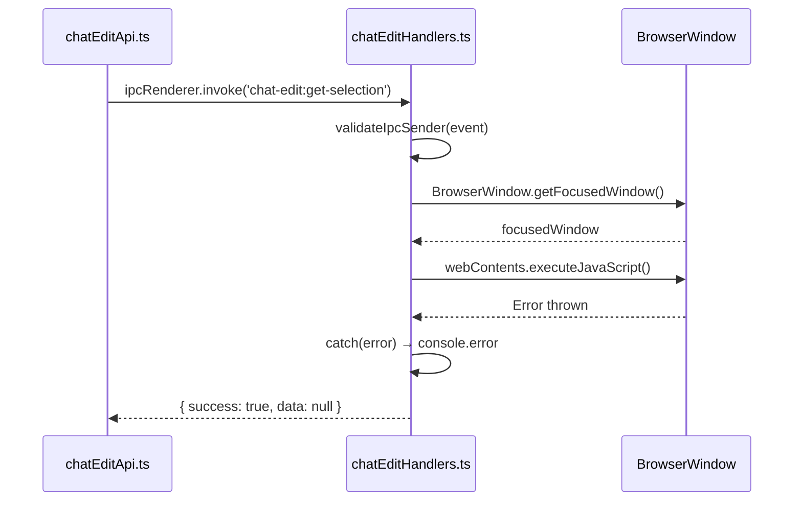

# シーケンス図 - TASK-WCE-MONACO-001

## メタ情報

| 項目   | 値                  |
| ------ | ------------------- |
| Phase  | 2                   |
| 機能名 | TASK-WCE-MONACO-001 |
| 作成日 | 2026-02-03          |
| 更新日 | 2026-02-03          |

## 正常系シーケンス

### 選択範囲取得フロー



### 詳細フロー（文字列形式）

```
1. エディタ初期化時
   Monaco Editor → editorSelection.ts: setActiveEditor(editor)
   editorSelection.ts: activeEditor に保存
   editorSelection.ts: window.__editorSelection に公開

2. ユーザーがテキストを選択
   ユーザー → Monaco Editor: テキストをドラッグ選択

3. 選択範囲取得リクエスト
   呼び出し元 → chatEditApi.ts: getEditorSelection()
   chatEditApi.ts → Main Process: ipcRenderer.invoke('chat-edit:get-selection')

4. Main Process処理
   chatEditHandlers.ts: validateIpcSender(event) で検証
   chatEditHandlers.ts → BrowserWindow: getFocusedWindow()
   BrowserWindow → chatEditHandlers.ts: focusedWindow

5. Renderer側への問い合わせ
   chatEditHandlers.ts → webContents: executeJavaScript(...)
   webContents → editorSelection.ts: getEditorSelection()

6. Monaco API呼び出し
   editorSelection.ts → Monaco: editor.getSelection()
   Monaco → editorSelection.ts: Selection { startLineNumber, endLineNumber, ... }
   editorSelection.ts → Monaco: editor.getModel().getValueInRange(selection)
   Monaco → editorSelection.ts: selectedText

7. レスポンス返却
   editorSelection.ts → chatEditHandlers.ts: TextSelection
   chatEditHandlers.ts → chatEditApi.ts: { success: true, data: TextSelection }
   chatEditApi.ts → 呼び出し元: TextSelection
```

## 異常系シーケンス

### エディタ未初期化



### 選択範囲なし（カーソルのみ）



### BrowserWindow未取得



### executeJavaScript失敗



## 状態遷移

### エディタ状態

```
[未初期化] --setActiveEditor(editor)--> [アクティブ]
[アクティブ] --setActiveEditor(null)--> [未初期化]
[アクティブ] --editor破棄--> [未初期化]
```

### 選択状態

```
[選択なし] --ユーザー選択--> [選択あり]
[選択あり] --ユーザークリック--> [選択なし]
[選択あり] --別位置クリック--> [選択なし]
```
