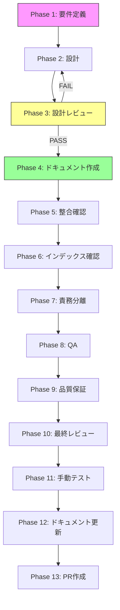

# UNASSIGNED-EVALS-SPEC-QUALITY-INSIGHTS-DOCUMENT-001: qualityInsights 現行定義を2 skillへ整合反映

## メタ情報

| 項目         | 内容                                                |
| ------------ | --------------------------------------------------- |
| タスクID     | UNASSIGNED-EVALS-SPEC-QUALITY-INSIGHTS-DOCUMENT-001 |
| タスク名     | qualityInsights 現行定義を2 skillへ整合反映         |
| 分類         | docs-only（コード変更なし）                         |
| 対象機能     | EVALS.json qualityInsights フィールド仕様           |
| 優先度       | 中                                                  |
| 見積もり規模 | 小規模                                              |
| ステータス   | completed                                           |
| GitHub Issue | #2327（CLOSED）                                     |
| 依存タスク   | なし（独立）                                        |
| タスク種別   | docs-only（コード変更なし）                         |
| 発見元       | TASK-EVALS-CONSUMER-AUDIT-001 Phase 9/12            |
| 作成日       | 2026-04-21                                          |

## 背景・課題

`EVALS.json` の `qualityInsights` セクションは、スキルの品質評価に関わる重要なフィールド群を保持している。本タスクは「未記載の正本を新規追加する」ことではなく、**current facts を確認したうえで 2 skill 間の説明と運用を整合させる** ことを目的とする。2026-04-21 時点では `aiworkflow-requirements` 側に `references/evals-schema-spec.md` が存在し、`qualityInsights` の正本記述はすでに導入済みである。

1. **正本と実データの差分未監査**: `task-specification-creator/EVALS.json` と `aiworkflow-requirements/references/evals-schema-spec.md` の記述粒度・フィールド表現が一致しているか未監査である。
2. **writer/reader/運用責任の閉じ不足**: `qualityInsights` の更新主体・更新タイミング・reader 0 件という既知制約は一部記載済みだが、2 skill を横断した説明の閉じ方が弱い。
3. **validator=0件の扱いが分散**: validator 不在は既知制約として触れられているが、どこまで本タスクで formalize し、どこから後続タスク化するかの境界が曖昧である。
4. **タスク仕様書自体の整合不足**: Phase 名称、参照パス、コマンド例、成果物名にテンプレート逸脱や placeholder が残っている。
5. **他スキル波及方針の判断軸不足**: `int-test-skill` / `github-issue-manager` 等に `qualityInsights` を持たせる基準が current facts ベースで定義されていない。

TASK-EVALS-CONSUMER-AUDIT-001 Phase 9/12 の調査結果として、上記の課題が明確化されたことから、本タスクで正本仕様への追記を実施する。

## 目的・ゴール

`qualityInsights` 現行定義の役割・writer・更新タイミング・運用責任を 2 skill で矛盾なく説明し、以下の状態を実現する。

- `task-specification-creator/EVALS.json` と `evals-schema-spec.md` の current facts が一致して説明されている
- verify_existing の結果として不足追記・表現統一・no-op のどれを行うかが明確である
- validator導入の要否とスコープ境界が仕様に明文化されている
- 他スキルへの展開方針（opt-in/opt-out）が current facts ベースで明文化されている

## スコープ

### 含むもの

- `qualityInsights` 現行定義の棚卸しと差分監査
- 正本仕様への追記・更新・no-op 判定
- 運用責任（手動/自動）の決定と文書化
- validator導入設計案
- 他スキルへの展開方針の策定

### 含まないもの

- `qualityInsights` フィールドを読み書きするコードの変更
- `EVALS.json` スキーマ自体の変更（フィールド追加・削除）
- validator の実装コード（設計案のみ）
- 他スキルへの `qualityInsights` フィールドの実際の追加

## タスク分解サマリー

| Phase | 名称             | 内容                                         | ステータス |
| ----- | ---------------- | -------------------------------------------- | ---------- |
| 1     | 要件定義         | フィールド棚卸し・writer現状調査・AC定義     | completed  |
| 2     | 設計             | フィールド仕様設計・運用責任設計・追記先特定 | completed  |
| 3     | 設計レビュー     | verify_existing判定・レビューゲート          | completed  |
| 4     | ドキュメント作成 | 正本への追記実施                             | completed  |
| 5     | 整合確認         | cross-referenceチェック・内容整合確認        | completed  |
| 6     | インデックス確認 | topic-map / quick-reference 網羅確認         | completed  |
| 7     | 責務分離         | 500行超過確認・semantic filename確認         | completed  |
| 8     | QA               | mirror sync確認・diff-qゼロ確認              | completed  |
| 9     | 品質保証         | 最終品質チェック                             | completed  |
| 10    | 最終レビュー     | 完了基準の最終確認                           | completed  |
| 11    | 手動テスト       | ファイル存在確認・内容整合確認               | completed  |
| 12    | ドキュメント更新 | changelog・implementation-guide作成          | completed  |
| 13    | PR作成           | PR作成・レビュー依頼                         | blocked    |

## フローチャート

## Phase一覧

| Phase | 名称             | 仕様書                                                       | ステータス |
| ----- | ---------------- | ------------------------------------------------------------ | ---------- |
| 1     | 要件定義         | [phase-1-requirements.md](phase-1-requirements.md)           | completed  |
| 2     | 設計             | [phase-2-design.md](phase-2-design.md)                       | completed  |
| 3     | 設計レビュー     | [phase-3-design-review.md](phase-3-design-review.md)         | completed  |
| 4     | テスト作成       | [phase-4-test-creation.md](phase-4-test-creation.md)         | completed  |
| 5     | 実装             | [phase-5-implementation.md](phase-5-implementation.md)       | completed  |
| 6     | テスト拡充       | [phase-6-test-expansion.md](phase-6-test-expansion.md)       | completed  |
| 7     | カバレッジ確認   | [phase-7-coverage-check.md](phase-7-coverage-check.md)       | completed  |
| 8     | リファクタリング | [phase-8-refactoring.md](phase-8-refactoring.md)             | completed  |
| 9     | 品質保証         | [phase-9-quality-assurance.md](phase-9-quality-assurance.md) | completed  |
| 10    | 最終レビュー     | [phase-10-final-review.md](phase-10-final-review.md)         | completed  |
| 11    | 手動テスト       | [phase-11-manual-test.md](phase-11-manual-test.md)           | completed  |
| 12    | ドキュメント更新 | [phase-12-documentation.md](phase-12-documentation.md)       | completed  |
| 13    | PR作成           | [phase-13-pr-creation.md](phase-13-pr-creation.md)           | blocked    |

## テストカバレッジ目標

> **docs-only 向け読み替え注記**: 本タスクはコード実装を伴わないため、通常のカバレッジ指標（行カバレッジ等）は適用されない。以下のdocs-only向け品質指標を適用する。

| 指標                           | 目標                                          |
| ------------------------------ | --------------------------------------------- |
| qualityInsights 現行定義網羅率 | current facts を 100% 説明済み                |
| 正本仕様反映                   | 対象ファイル全件で更新 / no-op 根拠が明記済み |
| cross-reference整合率          | 参照リンクがすべて有効                        |
| mirror同期                     | .claude/ と .agents/ が一致                   |
| validator設計案                | 要否判断と設計案が存在する                    |

## 統合テスト連携（docs-only版）

本タスクはdocs-onlyのため、統合テストコードは生成しない。以下を統合ポイントとして扱う。

| 統合ポイント                | 確認方法                                                                               |
| --------------------------- | -------------------------------------------------------------------------------------- |
| EVALS.json スキーマとの整合 | Phase 1で `task-specification-creator/EVALS.json` と `evals-schema-spec.md` を突合する |
| consumer audit結果との整合  | TASK-EVALS-CONSUMER-AUDIT-001 の current facts を参照する                              |
| dual root同期               | `.claude/` canonical と `.agents/` mirror の両方を確認する                             |
| 他スキルへの波及            | `int-test-skill` / `github-issue-manager` 等を current facts で判定する                |

## Phase完了時の必須アクション

各Phaseが完了したら必ず以下を実施すること。

1. `artifacts.json` の該当PhaseのstatusをPendingからCompletedへ更新する
2. `outputs/phase-N/` 配下に成果物ファイルを作成する
3. 次Phaseの担当者（またはAI）へ引き継ぎコメントを付与する
4. Phase 12完了時は `implementation-guide.md`・`documentation-changelog.md`・`unassigned-task-detection.md`・`skill-feedback-report.md` を作成する
