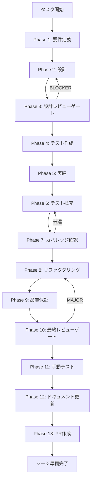

# UT-FIX-IPC-REGISTRATION-COMPLETENESS-CI-001 - タスク実行仕様書

## ユーザーからの元の指示

```
Issue #1973: IPC ハンドラ登録完全性スナップショットテストの CI 追加
TASK-FIX-IPC-SKILL-NAME-001 修正作業中に registerRuntimeSkillCreatorHandlers() 内で
ipcMain.handle() が同一チャネルに対して 2 回実行されていることが発覚。
今後同種の回帰を CI で自動検出できるスナップショットテストを追加する。
```

## メタ情報

| 項目         | 内容                                                                                                   |
| ------------ | ------------------------------------------------------------------------------------------------------ |
| タスクID     | UT-FIX-IPC-REGISTRATION-COMPLETENESS-CI-001                                                            |
| タスク名     | IPC ハンドラ登録完全性スナップショットテストの CI 追加                                                 |
| 分類         | バグ修正・CI 強化                                                                                      |
| 対象機能     | IPC ハンドラ登録（`registerRuntimeSkillCreatorHandlers` 18 チャネル: 16 public runtime + 2 auxiliary） |
| 優先度       | 高                                                                                                     |
| 見積もり規模 | 小規模                                                                                                 |
| ステータス   | completed                                                                                              |
| 発見元       | TASK-FIX-IPC-SKILL-NAME-001 Phase 12 close-out                                                         |
| 作成日       | 2026-04-07                                                                                             |
| Issue番号    | #1973                                                                                                  |

---

## タスク概要

### 目的

`registerRuntimeSkillCreatorHandlers()` 呼び出し後に登録される 18 チャネル（public runtime 16 + auxiliary 2）の一覧をスナップショットとして保存し、**重複登録・欠損を CI で自動検出できる**仕組みを構築する。

### 背景

TASK-FIX-IPC-SKILL-NAME-001（2026-04-06）の修正作業中に、`registerRuntimeSkillCreatorHandlers()` 関数内で `ipcMain.handle()` が同一チャネルに対して 2 回実行されていることが発覚した。これにより後続のハンドラが実際には登録されない状態が継続していた。18 チャネル（16 public runtime + 2 auxiliary）の完全性を CI で固定し、同種の回帰を防ぐ。

この重複登録バグはコードレビューのみに依存していたため、長期間にわたって検出されなかった。今後同種の回帰が発生した場合も、CI が存在しなければ再び見逃される可能性がある。

### 最終ゴール

- `ipcMain` に登録されたチャネル数・名称（18 チャネル）をスナップショットで固定し、差分が生じた場合に CI テストが FAIL する
- 重複登録が発生した場合（同一チャネルが複数回 `handle()` される場合）にもテストが FAIL する
- 既存 CI パイプラインへの統合が確認できる

### 成果物一覧

| 種別         | 成果物                                        | 配置先                                               |
| ------------ | --------------------------------------------- | ---------------------------------------------------- |
| テスト       | `ipcHandlerRegistrationSnapshot.test.ts`      | `apps/desktop/src/main/ipc/__tests__/`               |
| テスト       | `ipcHandlerRegistrationSnapshot.test.ts.snap` | `apps/desktop/src/main/ipc/__tests__/__snapshots__/` |
| ドキュメント | 要件定義書, 設計書, テスト仕様書等            | `outputs/phase-N/`                                   |

---

## 参照ファイル

- `apps/desktop/src/main/ipc/creatorHandlers.ts` - 主対象（`registerRuntimeSkillCreatorHandlers` を含む）
- `docs/30-workflows/unassigned-task/UT-FIX-IPC-REGISTRATION-COMPLETENESS-CI-001.md` - 元の unassigned task 指示書
- `.claude/skills/aiworkflow-requirements/references/` - システム仕様

---

## タスク分解サマリー

| ID     | フェーズ | サブタスク名                  | 責務                                           | 依存 |
| ------ | -------- | ----------------------------- | ---------------------------------------------- | ---- |
| T-01-1 | Phase 1  | 調査・要件定義                | ハンドラ登録関数の一覧化・エッジケース定義     | -    |
| T-02-1 | Phase 2  | テスト設計                    | モック戦略・スナップショット設計・ファイル一覧 | T-01 |
| T-03-1 | Phase 3  | 設計レビューゲート            | Phase 4 進行可否判定・BLOCKER 確認             | T-02 |
| T-04-1 | Phase 4  | テストケース作成（Red 確認）  | テストマトリクス定義・Red 状態確認             | T-03 |
| T-05-1 | Phase 5  | 実装（Green 化）              | スナップショットテスト実装・PASS 確認          | T-04 |
| T-06-1 | Phase 6  | テスト拡充                    | fail path・回帰 guard 追加                     | T-05 |
| T-07-1 | Phase 7  | カバレッジ確認                | 登録関数のカバレッジ実測・記録                 | T-06 |
| T-08-1 | Phase 8  | リファクタリング              | テストコードの重複・ドリフト除去               | T-07 |
| T-09-1 | Phase 9  | 品質検証                      | lint / typecheck / テスト通過確認              | T-08 |
| T-10-1 | Phase 10 | 最終レビューゲート            | 受入基準チェック・BLOCKER 判定                 | T-09 |
| T-11-1 | Phase 11 | 手動テスト（NON_VISUAL 代替） | 自動テスト代替記録                             | T-10 |
| T-12-1 | Phase 12 | ドキュメント更新              | 実装ガイド・未タスク検出・仕様同期             | T-11 |
| T-13-1 | Phase 13 | PR 作成                       | ユーザー承認後に実施                           | T-12 |

**総サブタスク数**: 13個

---

## 実行フロー図



---

## Phase一覧

| Phase | 名称               | 仕様書                                                       | ステータス |
| ----- | ------------------ | ------------------------------------------------------------ | ---------- |
| 1     | 要件定義           | [phase-1-requirements.md](phase-1-requirements.md)           | completed  |
| 2     | 設計               | [phase-2-design.md](phase-2-design.md)                       | completed  |
| 3     | 設計レビューゲート | [phase-3-design-review.md](phase-3-design-review.md)         | completed  |
| 4     | テスト作成         | [phase-4-test-creation.md](phase-4-test-creation.md)         | completed  |
| 5     | 実装               | [phase-5-implementation.md](phase-5-implementation.md)       | completed  |
| 6     | テスト拡充         | [phase-6-test-expansion.md](phase-6-test-expansion.md)       | completed  |
| 7     | カバレッジ確認     | [phase-7-coverage-check.md](phase-7-coverage-check.md)       | completed  |
| 8     | リファクタリング   | [phase-8-refactoring.md](phase-8-refactoring.md)             | completed  |
| 9     | 品質保証           | [phase-9-quality-assurance.md](phase-9-quality-assurance.md) | completed  |
| 10    | 最終レビューゲート | [phase-10-final-review.md](phase-10-final-review.md)         | completed  |
| 11    | 手動テスト         | [phase-11-manual-test.md](phase-11-manual-test.md)           | completed  |
| 12    | ドキュメント更新   | [phase-12-documentation.md](phase-12-documentation.md)       | completed  |
| 13    | PR作成             | [phase-13-pr-creation.md](phase-13-pr-creation.md)           | blocked    |

---

## テストカバレッジ目標

| ファイル                                       | 目標 line カバレッジ | 目標 branch カバレッジ |
| ---------------------------------------------- | -------------------- | ---------------------- |
| `apps/desktop/src/main/ipc/creatorHandlers.ts` | 90% 以上             | 80% 以上               |
| 新規テストファイル本体                         | 100%                 | 100%                   |

---

## Phase完了時の必須アクション

1. **タスク100%実行**: Phase内で指定された全タスクを完全に実行
2. **成果物確認**: 全ての必須成果物が生成されていることを検証
3. **実行記録**: 実行タスクの結果を記録
4. **artifacts.json更新**: Phase完了ステータスを更新
5. **Phase末端の実行確認**: 各タスクを100%実行し、完遂した旨を明記

```bash
# Phase完了処理
node .claude/skills/task-specification-creator/scripts/complete-phase.js \
  --workflow docs/30-workflows/UT-FIX-IPC-REGISTRATION-COMPLETENESS-CI-001 \
  --phase {{N}} --artifacts "outputs/phase-{{N}}/{{FILE}}.md:{{DESCRIPTION}}"
```

---

## 成果物

| Phase | 主要成果物                                                                                                                                                                                         |
| ----- | -------------------------------------------------------------------------------------------------------------------------------------------------------------------------------------------------- |
| 1     | requirements.md（対象関数一覧・受け入れ基準・FR/NFR・エッジケース）                                                                                                                                |
| 2     | テスト設計書（モック方針・アサーション方針）, 変更ファイル一覧                                                                                                                                     |
| 3     | 設計レビュー結果, ゲート判定                                                                                                                                                                       |
| 4     | テストマトリクス, Red 状態確認記録                                                                                                                                                                 |
| 5     | 実装サマリー, スナップショットファイル生成確認                                                                                                                                                     |
| 6     | 拡張テストケース（TC-04, TC-05）, fail path 確認記録                                                                                                                                               |
| 7     | カバレッジレポート, 目標達成確認                                                                                                                                                                   |
| 8     | リファクタ計画, 再テスト結果                                                                                                                                                                       |
| 9     | 品質レポート（typecheck / lint / test PASS）                                                                                                                                                       |
| 10    | 最終レビュー結果, 受入基準チェックリスト                                                                                                                                                           |
| 11    | 手動テスト結果（自動テスト代替記録）                                                                                                                                                               |
| 12    | implementation-guide.md (Part 1・Part 2), system-spec-update-summary.md, documentation-changelog.md, unassigned-task-detection.md, skill-feedback-report.md, phase12-task-spec-compliance-check.md |
| 13    | local-check-result.md, change-summary.md, pr-info.md, pr-creation-result.md                                                                                                                        |

---

## 関連タスク

| タスクID                             | 関係   | 備考                                        |
| ------------------------------------ | ------ | ------------------------------------------- |
| TASK-FIX-IPC-SKILL-NAME-001          | 発見元 | 重複ブロック削除・18 チャネル正常登録の修正 |
| TASK-CREATOR-HANDLERS-AUDIT-001      | 関連   | 全ハンドラ処理時間特性調査（別タスク）      |
| UT-IPC-EXECUTION-CHANNELS-PARITY-001 | 関連   | Renderer 側チャネル突合（別タスク）         |
