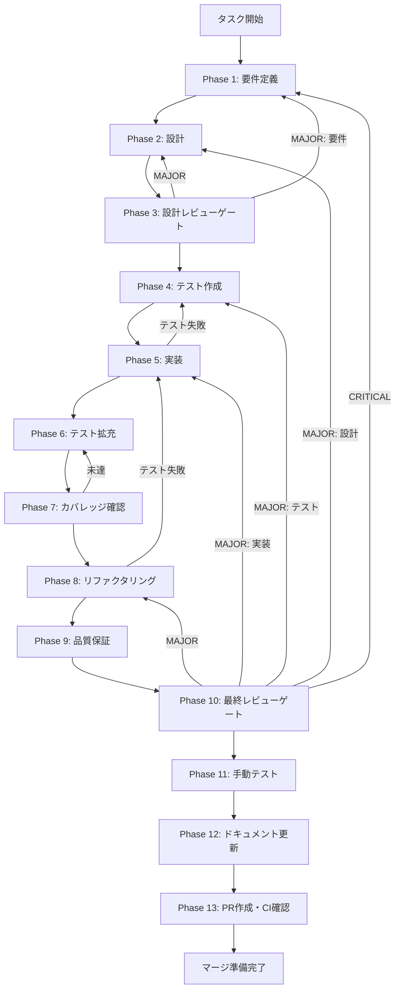

# UT-LLM-MOD-01-005 - タスク実行仕様書

## ユーザーからの元の指示

```
PROVIDER_CONFIGS、inferProviderId、LLMProviderIdSchema の3箇所が独立してプロバイダー/モデル情報を管理しており、
新プロバイダー追加時に3箇所の同時更新が必要な構造を解消する。Single Source of Truth を確立する。
```

## メタ情報

| 項目         | 内容                                                                     |
| ------------ | ------------------------------------------------------------------------ |
| タスクID     | UT-LLM-MOD-01-005                                                        |
| タスク名     | PROVIDER_CONFIGS/inferProviderId/LLMProviderIdSchema 三重管理解消        |
| 分類         | リファクタリング                                                         |
| 対象機能     | LLMプロバイダー管理                                                      |
| 優先度       | 中                                                                       |
| 見積もり規模 | 小規模                                                                   |
| ステータス   | Phase 12 完了（Phase 13 blocked: user approval required）                |
| 作成日       | 2026-03-25                                                               |
| Issue        | [#1524](https://github.com/daishiman/AIWorkflowOrchestrator/issues/1524) |

---

## タスク概要

### 目的

`PROVIDER_CONFIGS`（llm.ts）、`inferProviderId`（llm.ts）、`LLMProviderIdSchema`（provider.ts）の3箇所が独立してプロバイダー/モデル情報を管理している構造を解消し、`PROVIDER_CONFIGS` を Single Source of Truth として確立する。新プロバイダー追加時に1箇所の変更のみで済む構造を実現する。

### 背景

TASK-LLM-MOD-01（30種思考法分析 KJ法テーマA）で発見された構造的問題。将来 `o5` シリーズ等が追加された場合に `inferProviderId` の prefix ルール更新漏れが発生するリスクがあった。契約ドリフト発生源（P44/P45類似パターン）の解消が必要。

### 最終ゴール

- `packages/shared/src/types/llm/schemas/provider-registry.ts` に PROVIDER_CONFIGS を集約
- `LLMProviderIdSchema` と `inferProviderId` が PROVIDER_CONFIGS から自動導出される
- 新プロバイダー追加時は PROVIDER_CONFIGS への1エントリ追加のみ

### 成果物一覧

| 種別         | 成果物                    | 配置先                                                       |
| ------------ | ------------------------- | ------------------------------------------------------------ |
| 機能         | provider-registry.ts      | `packages/shared/src/types/llm/schemas/provider-registry.ts` |
| 機能         | provider.ts（変更）       | `packages/shared/src/types/llm/schemas/provider.ts`          |
| 機能         | llm.ts（変更）            | `apps/desktop/src/main/handlers/llm.ts`                      |
| テスト       | provider-registry.test.ts | `packages/shared/src/types/llm/schemas/__tests__/`           |
| ドキュメント | 実装ガイド                | `outputs/phase-12/implementation-guide.md`                   |
| PR           | GitHub Pull Request       | GitHub UI                                                    |

---

## 参照ファイル

本仕様書のコマンド選定は以下を参照:

- `docs/30-workflows/completed-tasks/unassigned-task/UT-LLM-MOD-01-005.md` - 元の未完了タスク指示書
- `.claude/skills/aiworkflow-requirements/references/` - システム仕様

---

## タスク分解サマリー

| ID     | フェーズ | サブタスク名           | 責務                             | 依存 |
| ------ | -------- | ---------------------- | -------------------------------- | ---- |
| T-01-1 | Phase 1  | 要件定義               | 要件・AC・スコープの確定         | -    |
| T-02-1 | Phase 2  | 設計                   | アーキテクチャ・データフロー設計 | T-01 |
| T-03-1 | Phase 3  | 設計レビューゲート     | 設計の妥当性検証                 | T-02 |
| T-04-1 | Phase 4  | テスト作成（TDD: Red） | SSoT検証テスト作成               | T-03 |
| T-05-1 | Phase 5  | 実装                   | provider-registry.ts 実装        | T-04 |
| T-06-1 | Phase 6  | テスト拡充             | エッジケース・回帰テスト         | T-05 |
| T-07-1 | Phase 7  | カバレッジ確認         | Line 80%+達成確認                | T-06 |
| T-08-1 | Phase 8  | リファクタリング       | コード品質改善                   | T-07 |
| T-09-1 | Phase 9  | 品質保証               | lint/type/test 全PASS            | T-08 |
| T-10-1 | Phase 10 | 最終レビューゲート     | AC全項目最終確認                 | T-09 |
| T-11-1 | Phase 11 | 手動テスト             | NON_VISUAL確認                   | T-10 |
| T-12-1 | Phase 12 | ドキュメント更新       | 実装ガイド・仕様更新             | T-11 |
| T-13-1 | Phase 13 | PR作成                 | PR作成・CI確認                   | T-12 |

**総サブタスク数**: 13個

---

## 実行フロー図



---

## Phase一覧

| Phase | 名称               | 仕様書                                                       | ステータス |
| ----- | ------------------ | ------------------------------------------------------------ | ---------- |
| 1     | 要件定義           | [phase-1-requirements.md](phase-1-requirements.md)           | 完了       |
| 2     | 設計               | [phase-2-design.md](phase-2-design.md)                       | 完了       |
| 3     | 設計レビューゲート | [phase-3-design-review.md](phase-3-design-review.md)         | 完了       |
| 4     | テスト作成         | [phase-4-test-creation.md](phase-4-test-creation.md)         | 完了       |
| 5     | 実装               | [phase-5-implementation.md](phase-5-implementation.md)       | 完了       |
| 6     | テスト拡充         | [phase-6-test-expansion.md](phase-6-test-expansion.md)       | 完了       |
| 7     | カバレッジ確認     | [phase-7-coverage-check.md](phase-7-coverage-check.md)       | 完了       |
| 8     | リファクタリング   | [phase-8-refactoring.md](phase-8-refactoring.md)             | 完了       |
| 9     | 品質保証           | [phase-9-quality-assurance.md](phase-9-quality-assurance.md) | 完了       |
| 10    | 最終レビューゲート | [phase-10-final-review.md](phase-10-final-review.md)         | 完了       |
| 11    | 手動テスト         | [phase-11-manual-test.md](phase-11-manual-test.md)           | 完了       |
| 12    | ドキュメント更新   | [phase-12-documentation.md](phase-12-documentation.md)       | 完了       |
| 13    | PR作成             | [phase-13-pr-creation.md](phase-13-pr-creation.md)           | blocked    |

---

## テストカバレッジ目標

### ユニットテスト

| 指標              | 最低基準 | 推奨基準 |
| ----------------- | -------- | -------- |
| Line Coverage     | 80%      | 90%      |
| Branch Coverage   | 60%      | 70%      |
| Function Coverage | 80%      | 90%      |

---

## 統合テスト連携（Phase 1〜11で必須）

| Phase | 統合テスト連携アクション                            |
| ----- | --------------------------------------------------- |
| 1     | 接続要件（import パス・型互換性）を要件に明記       |
| 2     | 統合ポイント（PROVIDER_CONFIGS→Schema/infer）を設計 |
| 3     | 統合テスト観点のレビューゲートを実施                |
| 4     | SSoT検証テスト・inferProviderId統合テストを作成     |
| 5     | provider-registry.ts 実装と import 接続テスト       |
| 6     | 既存テスト回帰確認・エッジケース追加                |
| 7     | カバレッジ測定・統合テスト再実行                    |
| 8     | リファクタ後のテスト継続成功確認                    |
| 9     | 品質ゲートで全テスト結果確認                        |
| 10    | 最終レビューで統合テスト結果確認                    |
| 11    | 手動確認（型チェック・テスト全PASS・SSoT grep検証） |

---

## Phase完了時の必須アクション

**各Phase完了時に以下を必ず実行すること:**

1. **タスク100%実行**: Phase内で指定された全タスクを完全に実行
2. **成果物確認**: 全ての必須成果物が生成されていることを検証
3. **実行記録**: 実行タスクの結果を記録
4. **artifacts.json更新**: Phase完了ステータスを更新
5. **Phase末端の実行確認**: 各タスクを100%実行し、各タスクを完遂した旨を必ず明記

```bash
# Phase完了時の検証コマンド
node .claude/skills/task-specification-creator/scripts/validate-phase-output.js docs/30-workflows/completed-tasks/UT-LLM-MOD-01-005 --phase {{PHASE_NUMBER}}

# Phase完了マーク
node .claude/skills/task-specification-creator/scripts/complete-phase.js docs/30-workflows/completed-tasks/UT-LLM-MOD-01-005 --phase {{PHASE_NUMBER}}
```
