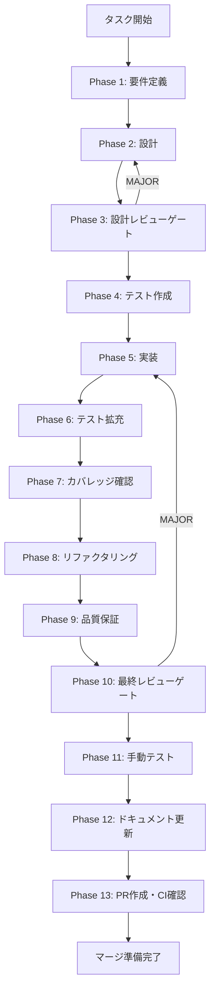

# UT-SC-02-005-preload-execute-type-update - タスク実行仕様書

## ユーザーからの元の指示

```
Preload skill-creator-api.ts の executePlan 戻り値型を
RuntimeSkillCreatorExecuteResponse（terminal_handoff ケースを含む Union 型）に更新する。
Renderer 側で terminal_handoff レスポンスの型ナロイングを追加する。
```

## メタ情報

| 項目         | 内容                                                                     |
| ------------ | ------------------------------------------------------------------------ |
| タスクID     | UT-SC-02-005                                                             |
| タスク名     | Preload skill-creator-api.ts の execute 戻り値型更新                     |
| 分類         | バグ修正                                                                 |
| 対象機能     | Skill Creator - Preload API / Renderer 型安全性                          |
| 優先度       | 中                                                                       |
| 見積もり規模 | 小規模                                                                   |
| ステータス   | 実装完了（PR待ち）                                                       |
| 作成日       | 2026-03-25                                                               |
| 元タスク     | UT-SC-02-002-execute-terminal-handoff                                    |
| GitHub       | [#1515](https://github.com/daishiman/AIWorkflowOrchestrator/issues/1515) |

---

## タスク概要

### 目的

Preload 層の `executePlan` 戻り値型を IPC ハンドラと一致させ、Renderer 側で `terminal_handoff` ケースの型ナロイングを実装することで、IPC 3層の型契約を完全に統一する。

### 背景

UT-SC-02-002 で `RuntimeSkillCreatorFacade.execute()` に `terminal_handoff` 分岐を追加し、IPC ハンドラ（`creatorHandlers.ts`）の戻り値型も `RuntimeSkillCreatorExecuteResponse`（Union 型）に更新された。しかし、Preload 層（`skill-creator-api.ts`）の `executePlan` 戻り値型が旧型 `RuntimeSkillCreatorExecuteResult` のまま追従していない。P44/P45 パターンの典型例。

### 最終ゴール

- Preload API、IPC ハンドラ、Renderer の3層で `RuntimeSkillCreatorExecuteResponse` Union 型が一貫して使用されている
- Renderer 側で `terminal_handoff` レスポンスが型安全にハンドリングされている

### 成果物一覧

| 種別         | 成果物                | 配置先                                                               |
| ------------ | --------------------- | -------------------------------------------------------------------- |
| 機能         | Preload API 型修正    | `apps/desktop/src/preload/skill-creator-api.ts`                      |
| 機能         | Renderer 型ナロイング | `apps/desktop/src/renderer/components/skill/SkillLifecyclePanel.tsx` |
| テスト       | 型変更対応テスト      | `apps/desktop/src/**/*.test.ts`                                      |
| ドキュメント | Phase 1-13 成果物     | `outputs/phase-*/`                                                   |
| PR           | GitHub Pull Request   | GitHub UI                                                            |

---

## 参照ファイル

本仕様書のコマンド選定は以下を参照:

- `docs/30-workflows/completed-tasks/UT-SC-02-005.md` - 未タスク指示書（詳細版）
- `docs/30-workflows/completed-tasks/UT-SC-02-002-execute-terminal-handoff/` - 親タスク成果物
- `.claude/skills/aiworkflow-requirements/references/lessons-learned-ipc-preload-runtime.md` - IPC/Preload 教訓

---

## タスク分解サマリー

| ID     | フェーズ | サブタスク名                           | 責務                                     | 依存 |
| ------ | -------- | -------------------------------------- | ---------------------------------------- | ---- |
| T-01-1 | Phase 1  | 要件抽出・P50チェック                  | 修正対象の現状確認と受け入れ基準の明文化 | -    |
| T-02-1 | Phase 2  | IPC 3層型修正設計                      | 変更内容と影響範囲の設計                 | T-01 |
| T-03-1 | Phase 3  | 設計レビュー                           | plan/improve/execute の型統一性検証      | T-02 |
| T-04-1 | Phase 4  | テストケース作成                       | Union 型対応テスト（RED状態）            | T-03 |
| T-05-1 | Phase 5  | Preload 型修正 + Renderer 型ナロイング | 実装                                     | T-04 |
| T-06-1 | Phase 6  | terminal_handoff 異常系テスト追加      | テスト拡充                               | T-05 |
| T-07-1 | Phase 7  | カバレッジ確認                         | カバレッジ基準達成確認                   | T-06 |
| T-08-1 | Phase 8  | リファクタリング                       | コード品質改善                           | T-07 |
| T-09-1 | Phase 9  | 品質保証                               | lint / typecheck / 品質ゲート            | T-08 |
| T-10-1 | Phase 10 | 最終レビュー                           | AC-1〜AC-4 全項目確認                    | T-09 |
| T-11-1 | Phase 11 | 手動テスト                             | 実環境動作確認                           | T-10 |
| T-12-1 | Phase 12 | ドキュメント更新                       | 仕様書更新・未タスク検出                 | T-11 |
| T-13-1 | Phase 13 | PR作成                                 | ユーザー承認後に実施                     | T-12 |

**総サブタスク数**: 13個

---

## 実行フロー図



---

## Phase一覧

| Phase | 名称               | 仕様書                                                       | ステータス |
| ----- | ------------------ | ------------------------------------------------------------ | ---------- |
| 1     | 要件定義           | [phase-1-requirements.md](phase-1-requirements.md)           | 完了       |
| 2     | 設計               | [phase-2-design.md](phase-2-design.md)                       | 完了       |
| 3     | 設計レビューゲート | [phase-3-design-review.md](phase-3-design-review.md)         | 完了       |
| 4     | テスト作成         | [phase-4-test-creation.md](phase-4-test-creation.md)         | 完了       |
| 5     | 実装               | [phase-5-implementation.md](phase-5-implementation.md)       | 完了       |
| 6     | テスト拡充         | [phase-6-test-expansion.md](phase-6-test-expansion.md)       | 完了       |
| 7     | カバレッジ確認     | [phase-7-coverage-check.md](phase-7-coverage-check.md)       | 完了       |
| 8     | リファクタリング   | [phase-8-refactoring.md](phase-8-refactoring.md)             | 完了       |
| 9     | 品質保証           | [phase-9-quality-assurance.md](phase-9-quality-assurance.md) | 完了       |
| 10    | 最終レビューゲート | [phase-10-final-review.md](phase-10-final-review.md)         | 完了       |
| 11    | 手動テスト         | [phase-11-manual-test.md](phase-11-manual-test.md)           | 完了       |
| 12    | ドキュメント更新   | [phase-12-documentation.md](phase-12-documentation.md)       | 完了       |
| 13    | PR作成             | [phase-13-pr-creation.md](phase-13-pr-creation.md)           | 未実施     |

---

## テストカバレッジ目標

### ユニットテスト

| 指標              | 最低基準 | 推奨基準 |
| ----------------- | -------- | -------- |
| Line Coverage     | 80%      | 90%      |
| Branch Coverage   | 60%      | 70%      |
| Function Coverage | 80%      | 90%      |

---

## Phase完了時の必須アクション

**各Phase完了時に以下を必ず実行すること:**

1. **タスク100%実行**: Phase内で指定された全タスクを完全に実行
2. **成果物確認**: 全ての必須成果物が生成されていることを検証
3. **実行記録**: 実行タスクの結果を記録
4. **artifacts.json更新**: Phase完了ステータスを更新

```bash
# Phase完了時の検証コマンド
node .claude/skills/task-specification-creator/scripts/validate-phase-output.js docs/30-workflows/completed-tasks/UT-SC-02-005-preload-execute-type-update --phase {{PHASE_NUMBER}}

# Phase完了・成果物登録
node .claude/skills/task-specification-creator/scripts/complete-phase.js \
  --workflow docs/30-workflows/completed-tasks/UT-SC-02-005-preload-execute-type-update --phase {{PHASE_NUMBER}} --artifacts "..."
```
