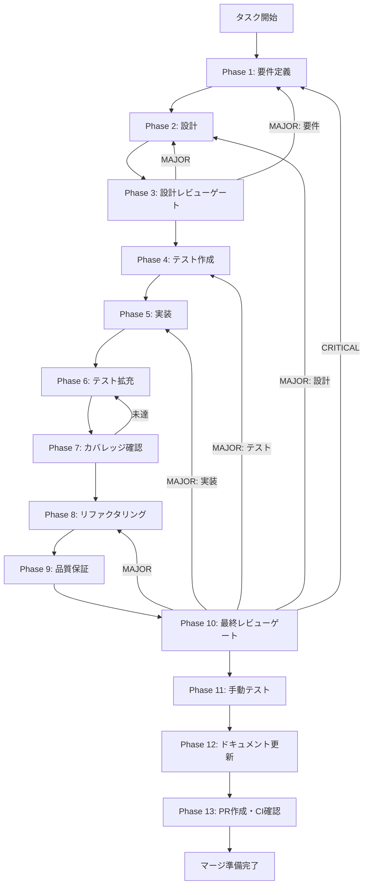

# UT-SKILL-WIZARD-W1-LIFECYCLE-PANEL-TRANSITION-001 - タスク実行仕様書

## ユーザーからの元の指示

```
GitHub Issue #2015:
[UT-SKILL-WIZARD-W1-LIFECYCLE-PANEL-TRANSITION-001] SkillLifecyclePanel.tsx 遷移ボタン化（テキストエリア削除）
```

## メタ情報

| 項目         | 内容                                                               |
| ------------ | ------------------------------------------------------------------ |
| タスクID     | UT-SKILL-WIZARD-W1-LIFECYCLE-PANEL-TRANSITION-001                  |
| タスク名     | skill-lifecycle-panel-wizard-transition                            |
| 分類         | リファクタリング                                                   |
| 対象機能     | SkillLifecyclePanel - ウィザード遷移ボタン化（テキストエリア削除） |
| 優先度       | 中                                                                 |
| 見積もり規模 | 小規模                                                             |
| ステータス   | 完了（Phase 13 blocked）                                           |
| 作成日       | 2026-04-08                                                         |
| GitHub Issue | #2015 (CLOSED)                                                     |

---

## タスク概要

### 目的

`skill-wizard-redesign-lane` の設計確定仕様として、`SkillLifecyclePanel.tsx` のUIをリファクタリングする。  
テキストエリアを廃止し、ウィザード遷移ボタンへ置き換えることで、スキル作成フローを新ウィザード（`SkillCreateWizard`）経由に一本化する。

### 背景

Wave 0（W0-seq-01 / W0-seq-02）が完了済みで、Wave 1 の並列タスクとして独立実行可能。  
既存の自由入力テキストエリア（`skill-lifecycle-request-input` / `skill-lifecycle-execution-input`）は設計廃止となり、  
スキル作成は新ウィザード（`SkillCreateWizard`）経由のみとする。

### 最終ゴール

1. テキストエリア（`skill-lifecycle-request-input` / `skill-lifecycle-execution-input`）の削除
2. ウィザード遷移ボタンの追加（クリックで `SkillCreateWizard` へ遷移開始）
3. 削除した state（`request` / `executionPrompt` 等）がコード上に残っていないこと
4. 既存テストファイル 6 本が更新されて全 PASS
5. Phase 9 QA 基準（`git delete OR export {} stub化かつ live import ゼロ`）を満たす

### スコープ

**含む:**

- `SkillLifecyclePanel.tsx` のテキストエリア削除
- 依存 state・ハンドラの削除または整理
- ウィザード遷移ボタンの追加（`data-testid="skill-lifecycle-open-wizard-button"`）
- 既存テストファイル 6 本の更新
- レイアウト調整

**含まない:**

- `SkillCreateWizard` の新規追加機能
- IPC チャンネルの変更
- 追加のウィザード統合処理

### 成果物一覧

| 種別         | 成果物                                                                                              | 配置先                                                                              |
| ------------ | --------------------------------------------------------------------------------------------------- | ----------------------------------------------------------------------------------- |
| 機能         | SkillLifecyclePanel.tsx（修正済み）                                                                 | `apps/desktop/src/renderer/components/skill/SkillLifecyclePanel.tsx`                |
| テスト       | SkillLifecyclePanel.test.tsx（更新）                                                                | `apps/desktop/src/renderer/components/skill/__tests__/SkillLifecyclePanel.test.tsx` |
| テスト       | 関連テストファイル 5 本（adapter-status/approval/auth-regression/error-persistence/llm-generation） | `apps/desktop/src/renderer/components/skill/__tests__/`                             |
| ドキュメント | Phase成果物一式                                                                                     | `outputs/phase-*/`                                                                  |
| PR           | GitHub Pull Request                                                                                 | GitHub UI                                                                           |

---

## 参照ファイル

| 資料名                  | パス                                                                 | 用途               |
| ----------------------- | -------------------------------------------------------------------- | ------------------ |
| 対象コンポーネント      | `apps/desktop/src/renderer/components/skill/SkillLifecyclePanel.tsx` | 変更対象           |
| テストファイル群        | `apps/desktop/src/renderer/components/skill/__tests__/`              | 更新対象 6 本      |
| aiworkflow-requirements | `.claude/skills/aiworkflow-requirements/references/`                 | システム仕様       |
| UI/UX仕様               | `.claude/skills/aiworkflow-requirements/references/ui-ux-*.md`       | 画面設計・状態管理 |

---

## タスク分解サマリー

| ID     | フェーズ | サブタスク名       | 責務                                                                                         | 依存 |
| ------ | -------- | ------------------ | -------------------------------------------------------------------------------------------- | ---- |
| T-01-1 | Phase 1  | 要件定義           | 削除要素・追加要素・受け入れ基準の確定                                                       | -    |
| T-02-1 | Phase 2  | 設計               | コンポーネント設計・state整理・ボタン配置                                                    | T-01 |
| T-03-1 | Phase 3  | 設計レビューゲート | 設計の矛盾・漏れ・整合性確認                                                                 | T-02 |
| T-04-1 | Phase 4  | テスト作成         | 6本のテストファイル更新・新テストケース作成                                                  | T-03 |
| T-05-1 | Phase 5  | 実装               | テキストエリア削除・ウィザードボタン追加                                                     | T-04 |
| T-06-1 | Phase 6  | テスト拡充         | 回帰テスト・異常系テスト追加                                                                 | T-05 |
| T-07-1 | Phase 7  | カバレッジ確認     | 変更コンポーネントのカバレッジ検証                                                           | T-06 |
| T-08-1 | Phase 8  | リファクタリング   | 不要コード完全除去・命名整理                                                                 | T-07 |
| T-09-1 | Phase 9  | 品質保証           | QA基準確認・Phase9品質ゲート                                                                 | T-08 |
| T-10-1 | Phase 10 | 最終レビューゲート | 受け入れ基準との照合・最終判定                                                               | T-09 |
| T-11-1 | Phase 11 | 手動テスト         | UI/UX変更の手動検証・スクリーンショット取得                                                  | T-10 |
| T-12-1 | Phase 12 | ドキュメント更新   | Task 12-1〜12-6（実装ガイド/仕様更新/更新履歴/未タスク検出/フィードバック/compliance-check） | T-11 |
| T-13-1 | Phase 13 | PR作成             | PR作成・CI確認・タスク完了処理                                                               | T-12 |

**総サブタスク数**: 13 個

---

## 実行フロー図



---

## Phase 一覧

| Phase | 名称               | 仕様書                                                       | ステータス |
| ----- | ------------------ | ------------------------------------------------------------ | ---------- |
| 1     | 要件定義           | [phase-1-requirements.md](phase-1-requirements.md)           | 完了       |
| 2     | 設計               | [phase-2-design.md](phase-2-design.md)                       | 完了       |
| 3     | 設計レビューゲート | [phase-3-design-review.md](phase-3-design-review.md)         | 完了       |
| 4     | テスト作成         | [phase-4-test-creation.md](phase-4-test-creation.md)         | 完了       |
| 5     | 実装               | [phase-5-implementation.md](phase-5-implementation.md)       | 完了       |
| 6     | テスト拡充         | [phase-6-test-expansion.md](phase-6-test-expansion.md)       | 完了       |
| 7     | カバレッジ確認     | [phase-7-coverage-check.md](phase-7-coverage-check.md)       | 完了       |
| 8     | リファクタリング   | [phase-8-refactoring.md](phase-8-refactoring.md)             | 完了       |
| 9     | 品質保証           | [phase-9-quality-assurance.md](phase-9-quality-assurance.md) | 完了       |
| 10    | 最終レビューゲート | [phase-10-final-review.md](phase-10-final-review.md)         | 完了       |
| 11    | 手動テスト         | [phase-11-manual-test.md](phase-11-manual-test.md)           | 完了       |
| 12    | ドキュメント更新   | [phase-12-documentation.md](phase-12-documentation.md)       | 完了       |
| 13    | PR作成             | [phase-13-pr-creation.md](phase-13-pr-creation.md)           | blocked    |

---

## Phase 12 必須タスク（Current Contract）

Phase 12 は以下の **6タスクすべて** を必須とする。

| Task | 名称                                           | 必須成果物                                               |
| ---- | ---------------------------------------------- | -------------------------------------------------------- |
| 12-1 | 実装ガイド作成（Part 1/2）                     | `outputs/phase-12/implementation-guide.md`               |
| 12-2 | システム仕様更新（Step 1-A〜1-G + Step 2判定） | `outputs/phase-12/system-spec-update-summary.md`         |
| 12-3 | ドキュメント更新履歴作成                       | `outputs/phase-12/documentation-changelog.md`            |
| 12-4 | 未タスク検出（0件でも出力必須）                | `outputs/phase-12/unassigned-task-detection.md`          |
| 12-5 | スキルフィードバック（改善なしでも出力必須）   | `outputs/phase-12/skill-feedback-report.md`              |
| 12-6 | Task仕様準拠チェック（root evidence）          | `outputs/phase-12/phase12-task-spec-compliance-check.md` |

## Phase 12 完了ゲート

Phase 12 を完了扱いにする前に、以下を必須確認する。

1. `outputs/phase-12/` に Task 12-1〜12-6 の成果物6件が実在すること。
2. `phase-12-documentation.md` の完了チェックと Task 12-1〜12-6 の実体が同期していること。
3. `task-workflow.md` と `task-workflow-completed.md` / `task-workflow-backlog.md` の ledger parity が root evidence と整合していること。
4. `artifacts.json` と `outputs/artifacts.json` が parity（title / type / status / phase artifact 名）一致であること。
5. `phase12-task-spec-compliance-check.md` が PASS 判定で、validator 実測値と同値であること。

---

## テストカバレッジ目標

### ユニットテスト

| 指標              | 最低基準 | 推奨基準 |
| ----------------- | -------- | -------- |
| Line Coverage     | 80%      | 90%      |
| Branch Coverage   | 60%      | 70%      |
| Function Coverage | 80%      | 90%      |

### 結合テスト

| 指標                       | 目標 |
| -------------------------- | ---- |
| コンポーネントレンダリング | 100% |
| ウィザード遷移ボタン動作   | 100% |
| 正常系シナリオ             | 100% |
| 異常系シナリオ             | 80%+ |

---

## 統合テスト連携（Phase 1〜11 で必須）

| Phase | 統合テスト連携アクション                                       |
| ----- | -------------------------------------------------------------- |
| 1     | 削除対象 UI 要素・追加要素を要件に明記                         |
| 2     | ウィザード遷移インターフェース・ボタン配置設計を反映           |
| 3     | テスト設計観点（data-testid の変更影響）のレビューゲートを実施 |
| 4     | テキストエリア削除・ボタン追加の全テストケース作成             |
| 5     | コンポーネント変更実装とテスト支援コード整備                   |
| 6     | リグレッションテスト拡充（6 本のテストファイル回帰確認）       |
| 7     | 変更コンポーネントの統合テスト再実行とゲート判定               |
| 8     | リファクタ後のテスト継続成功を確認                             |
| 9     | 品質保証でテスト結果を確認（Phase 9 QA 基準チェック）          |
| 10    | 最終レビューでテスト結果と受け入れ基準の照合を確認             |
| 11    | 手動テスト（UI 変更後のウィザードボタン動作確認）              |

---

## Phase 完了時の必須アクション

1. **タスク 100% 実行**: Phase 内で指定された全タスクを完全に実行
2. **成果物確認**: 全ての必須成果物が生成されていることを検証
3. **実行記録**: 実行タスクの結果を記録
4. **artifacts.json 更新**: Phase 完了ステータスを更新
5. **Phase 末端の実行確認**: 各タスクを 100% 実行し、完遂した旨を必ず明記

```bash
# Phase完了時の検証コマンド
node .claude/skills/task-specification-creator/scripts/validate-phase-output.js \
  docs/30-workflows/UT-SKILL-WIZARD-W1-LIFECYCLE-PANEL-TRANSITION-001 --phase {{PHASE_NUMBER}}

# Phase完了・成果物登録
node .claude/skills/task-specification-creator/scripts/complete-phase.js \
  --workflow docs/30-workflows/UT-SKILL-WIZARD-W1-LIFECYCLE-PANEL-TRANSITION-001 \
  --phase {{PHASE_NUMBER}} --artifacts "..."
```

---

## 主な注意事項

- 関連テストファイルが 6 本あり、`textarea` の `data-testid` 参照箇所の全量確認が必須
- `approvedSkillSpec` state は `executePlan` ハンドラとの依存があるため、削除前にフロー全体を確認
- ウィザード遷移ボタンは「UI 配置・スタイリング」と「疎通確認」の両方を本タスクで完了しているため、W2-seq-03a は resolved

---

_作成日: 2026-04-08_
