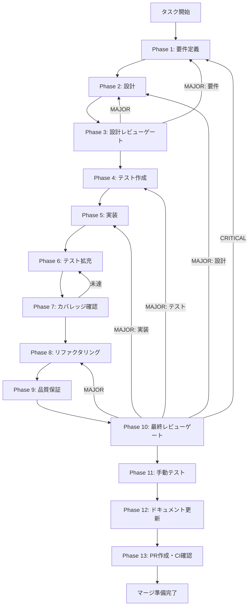

# UT-SKILL-WIZARD-W3-USAGE-TRACKING-001 - タスク実行仕様書

## ユーザーからの元の指示

```
Issue #2018: [UT-SKILL-WIZARD-W3-USAGE-TRACKING-001] スキルウィザード使用率計装（trackEvent / Wave 3）
```

## メタ情報

| 項目         | 内容                                                 |
| ------------ | ---------------------------------------------------- |
| タスクID     | UT-SKILL-WIZARD-W3-USAGE-TRACKING-001                |
| タスク名     | スキルウィザード使用率計装（trackEvent / Wave 3）    |
| 分類         | 新機能実装                                           |
| 対象機能     | スキル作成ウィザード - 使用率トラッキング計装        |
| 優先度       | 中                                                   |
| 見積もり規模 | 中規模                                               |
| ステータス   | phase13_blocked（Phase 13 未実施）                   |
| 作成日       | 2026-04-11                                           |
| タスク分類   | NON_VISUAL（Renderer 内部の計装のみ / 視覚差分なし） |

---

## タスク概要

### 目的

`apps/desktop/src/renderer/utils/trackEvent.ts` に `skill_wizard_*` 系イベントを追加し、
スキル作成ウィザードの使用率を型安全に計装する。
ウィザードの開封率・各ステップ完了率・中断率・ネクストアクション選択傾向を定量計測できるようにする。

### 背景

`skill-wizard-redesign-lane` では Wave 0〜2 にわたってスキル作成ウィザードを全面改善した。
Wave 3 の本タスクは、改善後のウィザードがどのように使用されているかを定量計測するための
計装（instrumentation）を追加する最終ステップである。

現状、ウィザードが開かれた回数・各ステップの完了率・中断率・ネクストアクションの選択傾向など
使用率データが一切収集されていない。このデータがなければ、改善後のウィザード設計の効果を
客観的に評価できず、次のイテレーションへの根拠が得られない。

### 最終ゴール

以下のイベントが型安全に定義・発火され、対応するテストが全AC条件を満たす状態：

| イベント名                   | 発火タイミング                             | ペイロード例                                 |
| ---------------------------- | ------------------------------------------ | -------------------------------------------- |
| `skill_wizard_open`          | ウィザードコンポーネントのマウント時       | `{ source: 'lifecycle_panel' \| 'direct' }`  |
| `skill_wizard_step_complete` | 各ステップの「次へ」完了時                 | `{ step: number, stepName: string }`         |
| `skill_wizard_next_action`   | `CompleteStep` のネクストアクション選択時  | `{ action: 'edit' \| 'execute' \| 'close' }` |
| `skill_wizard_abandon`       | ウィザードのアンマウント時（未完了の場合） | `{ lastStep: number }`                       |

### 前提条件（ブロッカー）

- W2-seq-03a（`SkillCreateWizard.tsx` オーケストレーション実装）が完了していること
- W2-seq-03b（`wizard/index.ts` エクスポート更新）が完了していること
- `trackEvent.ts` が Renderer ユーティリティとして既に存在し、スタブ化パターンが確立されていること

### 成果物一覧

| 種別         | 成果物                                           | 配置先                                                                            |
| ------------ | ------------------------------------------------ | --------------------------------------------------------------------------------- |
| 修正         | trackEvent.ts（skill*wizard*\* 型追加）          | `apps/desktop/src/renderer/utils/trackEvent.ts`                                   |
| 修正         | SkillCreateWizard.tsx（5計装ポイント追加）       | `apps/desktop/src/renderer/components/skill/SkillCreateWizard.tsx`                |
| 修正         | CompleteStep.tsx（ネクストアクション計装）       | `apps/desktop/src/renderer/components/skill/wizard/CompleteStep.tsx`              |
| 新規/修正    | trackEvent.test.ts（スタブ全分岐 100%）          | `apps/desktop/src/renderer/utils/__tests__/trackEvent.test.ts`                    |
| 修正         | SkillCreateWizard.test.tsx（計装確認ケース追加） | `apps/desktop/src/renderer/components/skill/__tests__/SkillCreateWizard.test.tsx` |
| ドキュメント | Phase 12 成果物一式                              | `outputs/phase-12/`                                                               |

---

## 受入条件（AC）

| AC   | 内容                                                                                |
| ---- | ----------------------------------------------------------------------------------- |
| AC-1 | `trackEvent` に `skill_wizard_open` イベントが型安全に定義・呼び出しできる          |
| AC-2 | `trackEvent` に `skill_wizard_step_complete` イベントが型安全に定義・呼び出しできる |
| AC-3 | `trackEvent` に `skill_wizard_next_action` イベントが型安全に定義・呼び出しできる   |
| AC-4 | `trackEvent` に `skill_wizard_abandon` イベントが型安全に定義・呼び出しできる       |
| AC-5 | `SkillCreateWizard.tsx` の 5 つの計装ポイントでイベントが正しく発火する             |
| AC-6 | `CompleteStep.tsx` で `skill_wizard_next_action` が選択時に発火する                 |
| AC-7 | `trackEvent.ts` のスタブの全分岐でテストカバレッジ 100% を達成する                  |
| AC-8 | `SkillCreateWizard.tsx` のテストカバレッジが 90% 以上を維持する                     |
| AC-9 | `CompleteStep.tsx` のテストカバレッジが 90% 以上を維持する                          |

---

## 参照ファイル

- `apps/desktop/src/renderer/utils/trackEvent.ts` - 計装対象ユーティリティ
- `apps/desktop/src/renderer/components/skill/SkillCreateWizard.tsx` - ウィザード本体
- `apps/desktop/src/renderer/components/skill/wizard/` - ウィザードサブコンポーネント
- `docs/30-workflows/skill-wizard-redesign-lane/index.md` - Wave レーン概要
- `.claude/skills/task-specification-creator/SKILL.md` - タスク仕様フォーマット
- `.claude/skills/aiworkflow-requirements/SKILL.md` - システム仕様参照

---

## タスク分解サマリー

| ID     | フェーズ | サブタスク名               | 責務                                                        | 依存 |
| ------ | -------- | -------------------------- | ----------------------------------------------------------- | ---- |
| T-01-1 | Phase 1  | trackEvent.ts 現状調査     | 既存スタブパターン確認・計装ポイント確定・AC 固定           | -    |
| T-02-1 | Phase 2  | skill*wizard*\* 型定義設計 | 型定義追加設計・各計装ポイント責務境界・テスト戦略確定      | T-01 |
| T-03-1 | Phase 3  | 設計レビューゲート         | 型整合性・スタブパターン一貫性・Phase 4 進行可否判定        | T-02 |
| T-04-1 | Phase 4  | TDD Red：テスト作成        | trackEvent.ts / SkillCreateWizard / CompleteStep テスト     | T-03 |
| T-05-1 | Phase 5  | 実装                       | trackEvent.ts 型追加・SkillCreateWizard / CompleteStep 計装 | T-04 |
| T-06-1 | Phase 6  | テスト拡充                 | fail path・ペイロード検証・回帰ガード追加                   | T-05 |
| T-07-1 | Phase 7  | カバレッジ確認             | trackEvent.ts 100%・SkillCreateWizard 90%+ 達成確認         | T-06 |
| T-08-1 | Phase 8  | リファクタリング           | 計装コード重複除去・命名揺れ修正                            | T-07 |
| T-09-1 | Phase 9  | 品質保証                   | typecheck / lint / test 全通過確認                          | T-08 |
| T-10-1 | Phase 10 | 最終レビューゲート         | AC-1〜AC-9 充足確認・W3-seq-04 完了判定                     | T-09 |
| T-11-1 | Phase 11 | 手動テスト（NON_VISUAL）   | Vitest coverage・mock 呼び出しログを主証跡として取得        | T-10 |
| T-12-1 | Phase 12 | ドキュメント更新           | implementation-guide / spec-update / changelog 等 6 成果物  | T-11 |
| T-13-1 | Phase 13 | PR 作成                    | ユーザー明示承認後のみ実施（blocked 維持）                  | T-12 |

**総サブタスク数**: 13個

---

## 実行フロー図



---

## Phase 一覧

| Phase | 名称               | 仕様書                                                       | ステータス |
| ----- | ------------------ | ------------------------------------------------------------ | ---------- |
| 1     | 要件定義           | [phase-1-requirements.md](phase-1-requirements.md)           | completed  |
| 2     | 設計               | [phase-2-design.md](phase-2-design.md)                       | completed  |
| 3     | 設計レビューゲート | [phase-3-design-review.md](phase-3-design-review.md)         | completed  |
| 4     | テスト作成         | [phase-4-test-creation.md](phase-4-test-creation.md)         | completed  |
| 5     | 実装               | [phase-5-implementation.md](phase-5-implementation.md)       | completed  |
| 6     | テスト拡充         | [phase-6-test-expansion.md](phase-6-test-expansion.md)       | completed  |
| 7     | カバレッジ確認     | [phase-7-coverage-check.md](phase-7-coverage-check.md)       | completed  |
| 8     | リファクタリング   | [phase-8-refactoring.md](phase-8-refactoring.md)             | completed  |
| 9     | 品質保証           | [phase-9-quality-assurance.md](phase-9-quality-assurance.md) | completed  |
| 10    | 最終レビューゲート | [phase-10-final-review.md](phase-10-final-review.md)         | completed  |
| 11    | 手動テスト         | [phase-11-manual-test.md](phase-11-manual-test.md)           | completed  |
| 12    | ドキュメント更新   | [phase-12-documentation.md](phase-12-documentation.md)       | completed  |
| 13    | PR 作成            | [phase-13-pr-creation.md](phase-13-pr-creation.md)           | blocked    |

---

## テストカバレッジ目標

| 対象ファイル            | 目標カバレッジ | 種別                 |
| ----------------------- | -------------- | -------------------- |
| `trackEvent.ts`         | 100%（全分岐） | Unit（スタブ全分岐） |
| `SkillCreateWizard.tsx` | 90% 以上       | Unit                 |
| `CompleteStep.tsx`      | 90% 以上       | Unit                 |

---

## Phase 完了時の必須アクション

**各Phase完了時に以下を必ず実行すること:**

1. **タスク 100% 実行**: Phase 内で指定された全タスクを完全に実行
2. **成果物確認**: 全ての必須成果物が生成されていることを検証
3. **実行記録**: 実行タスクの結果を記録
4. **artifacts.json / outputs/artifacts.json 更新**: Phase 完了ステータスを同期更新

```bash
# Phase 完了時の検証コマンド
node .claude/skills/task-specification-creator/scripts/validate-phase-output.js \
  docs/30-workflows/UT-SKILL-WIZARD-W3-USAGE-TRACKING-001 --phase {{PHASE_NUMBER}}

# Phase 完了・成果物登録
node .claude/skills/task-specification-creator/scripts/complete-phase.js \
  --workflow docs/30-workflows/UT-SKILL-WIZARD-W3-USAGE-TRACKING-001 \
  --phase {{PHASE_NUMBER}} --artifacts "..."
```

---

## 注意事項

- Phase 13（PR 作成）はユーザーの明示的な承認があるまで **blocked** 状態を維持する
- コミット・push は禁止（承認後のみ）
- `trackEvent` の新規イベントは `skill_wizard_` プレフィックスで統一する
- NON_VISUAL タスクのため Phase 11 では screenshot を取得せず、自動テスト結果を主証跡とする
