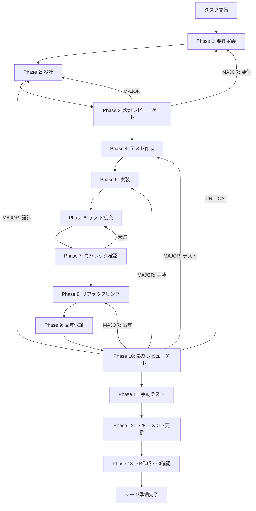

# UT-STORE-HOOKS-TEST-REFACTOR-001 - タスク実行仕様書

## ユーザーからの元の指示

```
Store Hooks テストを renderHook パターンに移行する。
既存の getState() パターンのテストを @testing-library/react の renderHook を使用したパターンに書き換え、
React Hookの実際の動作（参照安定性、再レンダリング）を正しく検証できるようにする。
```

## メタ情報

| 項目         | 内容                                         |
| ------------ | -------------------------------------------- |
| タスクID     | UT-STORE-HOOKS-TEST-REFACTOR-001             |
| タスク名     | Store Hooks テストをrenderHookパターンに移行 |
| 分類         | リファクタリング                             |
| 対象機能     | Zustand Store Hooks テスト                   |
| 優先度       | 中                                           |
| 見積もり規模 | 小規模                                       |
| ステータス   | 未実施                                       |
| 作成日       | 2026-02-12                                   |
| 依存タスク   | UT-STORE-HOOKS-REFACTOR-001（完了）          |
| GitHub Issue | #779                                         |

---

## タスク概要

### 目的

既存のStore HooksテストをrenderHookパターンに移行し、React Hookの実際の動作（subscribe パターン、参照安定性、再レンダリング時の挙動）をテストで正しく検証できるようにする。

### 背景

UT-STORE-HOOKS-REFACTOR-001で53個の個別セレクタHookを作成したが、テストの一部は`useAppStore.getState()`を使用した直接状態検証パターンを使用している。このパターンではReact HookのsubscribeメカニズムやreferentialStability（参照安定性）が検証されない。特に `agentSlice.selectors.test.ts` が `getState()` パターンを使用しており、renderHook パターンへの移行が必要。

**重要な発見事項**:

- `authModeSlice.selectors.test.ts` と `llmSlice.selectors.test.ts` は既に renderHook パターンを使用している
- `agentSlice.selectors.test.ts` のみが `getState()` パターンを使用
- Issue記載のファイル名（`authModeSelectors.test.ts` 等）と実際のファイル名（`authModeSlice.selectors.test.ts` 等）は異なる
- `infiniteLoopPrevention.test.ts` は独立ファイルとして存在せず、各Sliceテスト内で検証されている

### 最終ゴール

- `agentSlice.selectors.test.ts` が renderHook パターンに移行完了
- 全テストファイルで参照安定性テストが実施されている
- 全テストファイルで再レンダリング時の状態変更テストが実施されている
- 既存テストの全PASSが維持されている
- 全23個の個別セレクタHookのexport検証テストが存在する

### 成果物一覧

| 種別         | 成果物                               | 配置先                                                                             |
| ------------ | ------------------------------------ | ---------------------------------------------------------------------------------- |
| テスト       | リファクタリング済みagentSliceテスト | `apps/desktop/src/renderer/store/slices/__tests__/agentSlice.selectors.test.ts`    |
| テスト       | パターン統一確認・必要に応じた拡充   | `apps/desktop/src/renderer/store/slices/__tests__/authModeSlice.selectors.test.ts` |
| テスト       | パターン統一確認・必要に応じた拡充   | `apps/desktop/src/renderer/store/slices/__tests__/llmSlice.selectors.test.ts`      |
| ドキュメント | 実装ガイド                           | `outputs/phase-12/implementation-guide.md`                                         |
| PR           | GitHub Pull Request                  | GitHub UI                                                                          |

---

## 参照ファイル

| 資料                                | パス                                                                               | 説明                                     |
| ----------------------------------- | ---------------------------------------------------------------------------------- | ---------------------------------------- |
| 既知の落とし穴（P31）               | `.claude/rules/06-known-pitfalls.md`                                               | Zustand Store Hooks無限ループ問題        |
| 状態管理ルール                      | `.claude/rules/03-state-management.md`                                             | Zustand設計原則                          |
| agentSliceテスト（主要移行対象）    | `apps/desktop/src/renderer/store/slices/__tests__/agentSlice.selectors.test.ts`    | getState()パターン使用中                 |
| authModeSliceテスト（参照パターン） | `apps/desktop/src/renderer/store/slices/__tests__/authModeSlice.selectors.test.ts` | renderHookパターン使用中（手本）         |
| llmSliceテスト（参照パターン）      | `apps/desktop/src/renderer/store/slices/__tests__/llmSlice.selectors.test.ts`      | renderHookパターン使用中（手本）         |
| Issue仕様                           | `docs/30-workflows/completed-tasks/UT-STORE-HOOKS-REFACTOR-001/unassigned-tasks/`  | 元の未タスク仕様書                       |
| テストカバレッジ基準                | `coverage-standards.md`                                                            | カバレッジ基準                           |
| 過去の教訓                          | `.claude/skills/aiworkflow-requirements/references/lessons-learned.md`             | 1 selector = 1 field原則、テストパターン |
| 状態管理仕様                        | `.claude/skills/aiworkflow-requirements/references/arch-state-management.md`       | 個別セレクタカタログ、設計原則           |
| レビューゲート基準                  | `.claude/skills/task-specification-creator/references/review-gate-criteria.md`     | Phase 3/10の判定基準・戻り先             |
| Phase 11/12ガイド                   | `.claude/skills/task-specification-creator/references/phase-11-12-guide.md`        | 手動テスト・ドキュメント更新手順         |
| カバレッジ基準                      | `.claude/skills/task-specification-creator/references/coverage-standards.md`       | テスト数記録基準含む                     |

---

## タスク分解サマリー

| ID     | フェーズ | サブタスク名                           | 責務                                  | 依存 |
| ------ | -------- | -------------------------------------- | ------------------------------------- | ---- |
| T-01-1 | Phase 1  | 要件抽出・受け入れ基準定義             | 移行対象と検証基準の明確化            | -    |
| T-02-1 | Phase 2  | テストリファクタリング設計             | renderHook移行パターンの設計          | T-01 |
| T-03-1 | Phase 3  | 設計レビュー                           | 移行計画の妥当性検証                  | T-02 |
| T-04-1 | Phase 4  | renderHookテスト作成（Red）            | 新パターンテストの作成                | T-03 |
| T-05-1 | Phase 5  | agentSliceテスト移行実装（Green）      | getState()→renderHookパターン変換     | T-04 |
| T-06-1 | Phase 6  | 参照安定性・再レンダリングテスト拡充   | 全Sliceの参照安定性テスト強化         | T-05 |
| T-07-1 | Phase 7  | カバレッジ確認                         | Line 80%+, Branch 60%+, Function 80%+ | T-06 |
| T-08-1 | Phase 8  | テストコードリファクタリング           | 共通パターン抽出・コード品質改善      | T-07 |
| T-09-1 | Phase 9  | 品質保証（Lint・型チェック・全テスト） | 全品質ゲート通過                      | T-08 |
| T-10-1 | Phase 10 | 最終レビュー                           | 多角的品質検証                        | T-09 |
| T-11-1 | Phase 11 | 手動テスト検証                         | テスト実行・結果確認                  | T-10 |
| T-12-1 | Phase 12 | ドキュメント更新                       | 実装ガイド・システム仕様更新          | T-11 |
| T-13-1 | Phase 13 | PR作成                                 | PR作成・CI確認                        | T-12 |

**総サブタスク数**: 13個

---

## 実行フロー図



---

## Phase一覧

| Phase | 名称               | 仕様書                                                 | ステータス |
| ----- | ------------------ | ------------------------------------------------------ | ---------- |
| 1     | 要件定義           | [phase-1-requirements.md](phase-1-requirements.md)     | 未実施     |
| 2     | 設計               | [phase-2-design.md](phase-2-design.md)                 | 未実施     |
| 3     | 設計レビューゲート | [phase-3-design-review.md](phase-3-design-review.md)   | 未実施     |
| 4     | テスト作成         | [phase-4-test-creation.md](phase-4-test-creation.md)   | 未実施     |
| 5     | 実装               | [phase-5-implementation.md](phase-5-implementation.md) | 未実施     |
| 6     | テスト拡充         | [phase-6-test-expansion.md](phase-6-test-expansion.md) | 未実施     |
| 7     | カバレッジ確認     | [phase-7-coverage-check.md](phase-7-coverage-check.md) | 未実施     |
| 8     | リファクタリング   | [phase-8-refactoring.md](phase-8-refactoring.md)       | 未実施     |
| 9     | 品質保証           | [phase-9-quality.md](phase-9-quality.md)               | 未実施     |
| 10    | 最終レビューゲート | [phase-10-final-review.md](phase-10-final-review.md)   | 未実施     |
| 11    | 手動テスト         | [phase-11-manual-test.md](phase-11-manual-test.md)     | 未実施     |
| 12    | ドキュメント更新   | [phase-12-documentation.md](phase-12-documentation.md) | 未実施     |
| 13    | PR作成             | [phase-13-pr-creation.md](phase-13-pr-creation.md)     | 未実施     |

---

## テストカバレッジ目標

### ユニットテスト

| 指標              | 最低基準 | 推奨基準 |
| ----------------- | -------- | -------- |
| Line Coverage     | 80%      | 90%      |
| Branch Coverage   | 60%      | 70%      |
| Function Coverage | 80%      | 90%      |

---

## 統合テスト連携（Phase 1〜11で必須）

| Phase | 統合テスト連携アクション                     |
| ----- | -------------------------------------------- |
| 1     | renderHookテスト環境の依存関係を要件に明記   |
| 2     | テストユーティリティの共通化設計             |
| 3     | テスト設計のレビュー（パターン統一性の確認） |
| 4     | renderHookテストシナリオを全Sliceで作成      |
| 5     | agentSliceテストのrenderHookパターン移行実装 |
| 6     | 参照安定性・再レンダリングテストの拡充       |
| 7     | 全Sliceテストのカバレッジ再計測              |
| 8     | テストユーティリティのリファクタリング       |
| 9     | 全テスト結果の品質保証                       |
| 10    | 最終レビューでテスト品質を確認               |
| 11    | テスト実行と結果の手動確認                   |

---

## サブタスク管理

Phase実行開始時に、TodoWriteツール（またはTaskCreateツール）で以下のサブタスクを作成すること:

1. 参照資料の確認
2. 実行タスクの実施（各タスクごとに1サブタスク）
3. 統合テスト連携の実施（Phase 1〜11）
4. 成果物の作成・配置
5. 完了条件の検証

**重要**: 各サブタスクは実行完了後すぐにcompletedに更新すること。

---

## Phase完了時の必須アクション

**各Phase完了時に以下を必ず実行すること:**

1. **タスク100%実行**: Phase内で指定された全タスクを完全に実行
2. **成果物確認**: 全ての必須成果物が生成されていることを検証
3. **実行記録**: 実行タスクの結果を記録
4. **artifacts.json更新**: Phase完了ステータスを更新

## タスク100%実行確認【必須】

各Phase完了時に以下を確認する（省略不可）:

1. **サブタスク完了**: Phase内の全てのタスク（タスク1, タスク2, ...）が実行完了していること
2. **成果物存在**: 各タスクの成果物が全て生成されていること
3. **品質基準**: 完了条件の全チェック項目が✅であること
4. **記録**: artifacts.jsonのPhaseステータスを「完了」に更新

> **警告**: 一つでも未完了のタスクがある場合、Phaseを「完了」としない。

```bash
# Phase完了時の検証コマンド
node .claude/skills/task-specification-creator/scripts/validate-phase-output.js docs/30-workflows/UT-STORE-HOOKS-TEST-REFACTOR-001 --phase {{PHASE_NUMBER}}

# Phase完了・成果物登録
node .claude/skills/task-specification-creator/scripts/complete-phase.js \
  --workflow docs/30-workflows/UT-STORE-HOOKS-TEST-REFACTOR-001 --phase {{PHASE_NUMBER}} --artifacts "..."
```
