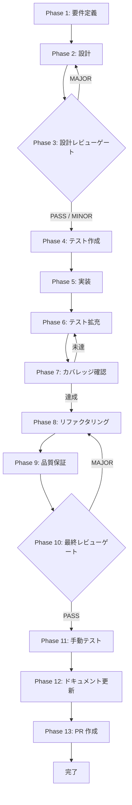

# UT-TASK-SC-LLM-PURPOSE-WIRE-001-UPDATE-MODE - タスク実行仕様書

## メタ情報

| 項目       | 内容                                                 |
| ---------- | ---------------------------------------------------- |
| タスクID   | UT-TASK-SC-LLM-PURPOSE-WIRE-001-UPDATE-MODE          |
| タスク名   | SkillCreatorService update/improve-prompt モード実装 |
| 作成日     | 2026-04-19                                           |
| ステータス | 完了（Phase 12 close-out 済み・Phase 13 blocked）    |
| 総Phase数  | 13                                                   |
| タスク種別 | バグ修正 / NON_VISUAL                                |
| 関連Issue  | #2271                                                |
| 依存タスク | TASK-SC-LLM-PURPOSE-WIRE-001（完了）                 |

---

## タスク概要

`SkillCreatorService.ts` の `runCreateSkill` メソッド内 switch 文において、`case "update":` および `case "improve-prompt":` がそれぞれ専用ワークフローメソッドを呼び出さずに fall-through し、後続の `init_skill.js`（新規作成スクリプト）が誤って実行されるバグを修正する。

修正内容として、`runUpdateWorkflow(options, signal)` と `runImprovePromptWorkflow(options, signal)` の2つのプライベートメソッドを追加し、各 case で適切に呼び出すよう switch 文をリファクタリングする。

---

## 背景

### 問題の根本原因

`apps/desktop/src/main/services/skill/SkillCreatorService.ts` の switch 文（L412〜L420）では：

- `case "update":` — `emitProgress` のみ実行し、専用ワークフローを呼ばずに break
- `case "improve-prompt":` — `emitProgress` のみ実行し、専用ワークフローを呼ばずに break

両 case とも break 後に `init_skill.js` が実行される（L430〜）ため、update/improve-prompt モードで新規スキルディレクトリが誤って作成される。

### 影響範囲

- update モード: 既存スキルを更新するつもりが、新規スキルとして初期化される
- improve-prompt モード: SKILL.md の prompt セクションのみを更新するつもりが、スキル全体が初期化される

---

## 目的

1. `runUpdateWorkflow` プライベートメソッドを実装し、update モードで適切に呼び出す
2. `runImprovePromptWorkflow` プライベートメソッドを実装し、improve-prompt モードで適切に呼び出す
3. 両モードで `init_skill.js` が呼ばれないよう制御フローを修正する
4. 対応するユニットテストを追加し、リグレッションを防止する

---

## スコープ

### IN スコープ

- `SkillCreatorService.ts` への `runUpdateWorkflow` / `runImprovePromptWorkflow` メソッド追加
- switch 文の `case "update":` / `case "improve-prompt":` の修正
- 両モードで `init_skill.js` をスキップする制御フロー実装
- `SkillCreatorService.test.ts` へのテストケース追加

### OUT スコープ

- 他モード（collaborative / orchestrate / create）の変更
- UI/Renderer 層の変更
- IPC 契約の変更
- 新規スキルファイルのフォーマット変更

---

## タスク分類

| 分類       | 内容                     |
| ---------- | ------------------------ |
| 種別       | バグ修正                 |
| 緊急度     | 高                       |
| 影響範囲   | SkillCreatorService のみ |
| 視覚確認   | 不要（NON_VISUAL）       |
| 自動テスト | 必要                     |

---

## Phase 構成

| Phase | 名称                 | 仕様書                                                       | ステータス |
| ----- | -------------------- | ------------------------------------------------------------ | ---------- |
| 1     | 要件定義             | [phase-1-requirements.md](phase-1-requirements.md)           | 完了       |
| 2     | 設計                 | [phase-2-design.md](phase-2-design.md)                       | 完了       |
| 3     | 設計レビューゲート   | [phase-3-design-review.md](phase-3-design-review.md)         | 完了       |
| 4     | テスト作成           | [phase-4-test-creation.md](phase-4-test-creation.md)         | 完了       |
| 5     | 実装                 | [phase-5-implementation.md](phase-5-implementation.md)       | 完了       |
| 6     | テスト拡充           | [phase-6-test-expansion.md](phase-6-test-expansion.md)       | 完了       |
| 7     | テストカバレッジ確認 | [phase-7-coverage-check.md](phase-7-coverage-check.md)       | 完了       |
| 8     | リファクタリング     | [phase-8-refactoring.md](phase-8-refactoring.md)             | 完了       |
| 9     | 品質保証             | [phase-9-quality-assurance.md](phase-9-quality-assurance.md) | 完了       |
| 10    | 最終レビューゲート   | [phase-10-final-review.md](phase-10-final-review.md)         | 完了       |
| 11    | 手動テスト検証       | [phase-11-manual-test.md](phase-11-manual-test.md)           | 完了       |
| 12    | ドキュメント更新     | [phase-12-documentation.md](phase-12-documentation.md)       | 完了       |
| 13    | PR 作成              | [phase-13-pr-creation.md](phase-13-pr-creation.md)           | blocked    |

---

## 実行フロー図



---

## テストカバレッジ目標

| 対象                            | 目標                  | 測定方法                                                 |
| ------------------------------- | --------------------- | -------------------------------------------------------- |
| `runUpdateWorkflow`             | 行カバレッジ 90% 以上 | `pnpm --filter @repo/desktop exec vitest run --coverage` |
| `runImprovePromptWorkflow`      | 行カバレッジ 90% 以上 | 同上                                                     |
| switch 文 update ケース         | 分岐網羅              | 同上                                                     |
| switch 文 improve-prompt ケース | 分岐網羅              | 同上                                                     |
| init_skill.js 非呼び出し確認    | 負のテスト            | モック検証                                               |

---

## Phase 完了時の必須アクション

1. **タスク 100% 実行**: Phase 内で指定された全タスクを完全に実行する
2. **成果物確認**: 全ての必須成果物が生成されていることを検証する
3. **artifacts.json 更新**: `complete-phase.js` で Phase 完了ステータスを更新する

```bash
node .claude/skills/task-specification-creator/scripts/complete-phase.js \
  --workflow docs/30-workflows/UT-TASK-SC-LLM-PURPOSE-WIRE-001-UPDATE-MODE --phase {{N}} \
  --artifacts "outputs/phase-{{N}}/{{FILE}}.md:{{DESCRIPTION}}"
```

---

## 成果物

| Phase | 主要成果物                                             |
| ----- | ------------------------------------------------------ |
| 1     | 要件定義書、受け入れ基準 AC-1〜AC-5                    |
| 2     | 設計書（メソッドシグネチャ・switch 文設計）            |
| 3     | 設計レビュー結果、ゲート判定                           |
| 4     | テスト仕様書、TDD Red 結果                             |
| 5     | 実装サマリー、変更ファイル一覧                         |
| 6     | 拡張テストケース（エラーケース・境界値）               |
| 7     | カバレッジレポート                                     |
| 8     | リファクタリング記録                                   |
| 9     | 品質保証レポート                                       |
| 10    | 最終レビュー結果、出荷準備チェック                     |
| 11    | 手動テスト結果（NON_VISUAL）                           |
| 12    | 実装ガイド、ドキュメント更新履歴、スキルフィードバック |
| 13    | PR 情報、変更サマリー、PR 作成結果                     |

---

_このファイルは task-specification-creator skill によって生成されました。_
_最終更新: 2026-04-19（close-out 再監査反映）_
