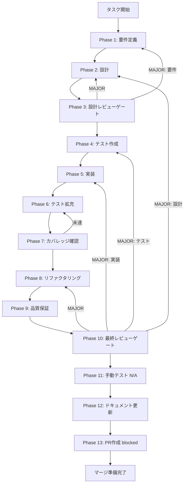

# UT-W2-03A-LLM-GENERATION-TEST-CLEANUP-001 - タスク実行仕様書

## ユーザーからの元の指示

```
Issue #2102: SkillCreateWizard LLM生成フロー describe.skip クリーンアップ
SkillCreateWizard.llm-generation.test.tsx の describe.skip ブロックを整理し、
テストスイートを現行の createSkill ベースフローと整合した状態にする。
```

## メタ情報

| 項目         | 内容                                                                              |
| ------------ | --------------------------------------------------------------------------------- |
| タスクID     | UT-W2-03A-LLM-GENERATION-TEST-CLEANUP-001                                         |
| タスク名     | SkillCreateWizard LLM生成フロー describe.skip クリーンアップ                      |
| 分類         | クリーンアップ / テスト改善                                                       |
| 対象機能     | SkillCreateWizard / LLM生成テスト                                                 |
| 優先度       | 低                                                                                |
| 見積もり規模 | 小規模                                                                            |
| ステータス   | 未実施                                                                            |
| タスク種別   | CLEANUP / NON_VISUAL                                                              |
| GitHub Issue | [#2102](https://github.com/daishiman/AIWorkflowOrchestrator/issues/2102) (CLOSED) |
| 作成日       | 2026-04-16                                                                        |

---

## 現況判定

- `SkillCreateWizard.llm-generation.test.tsx` は current worktree では削除済みで、`git show f92d0433d` でも `D` になっている。
- そのため、このワークフローは「ファイルを直す」だけでなく「削除済み事実を確認し、残存参照を掃除する」ことが主目的になる。
- 対象ファイルがもし再出現していた場合のみ、Phase 4〜8 の再作業パスを使う。

---

## タスク概要

### 目的

`SkillCreateWizard.llm-generation.test.tsx` の削除済み事実を前提に、残存する `describe.skip` / TODO / 参照ドリフトを整理し、
テストスイートとドキュメントを現行の `createSkill` ベースフローと整合した状態にする。

### 背景

W2-seq-03a の実装において、`SkillCreateWizard` から `generationMode`（テンプレート/LLM 切替ラジオボタン）が完全削除された。これに伴い、旧 TASK-SC-07 で実装された `planSkill` / `executePlan` の二段階フローも廃止された。

旧テスト案では、`SkillCreateWizard.llm-generation.test.tsx` に記述されていた 30 件のテストが、存在しない UI 要素（`generationMode` ラジオボタン）を操作しようとしていた。

新フロー（`createSkill` ベース）は `SkillCreateWizard.test.tsx` で既にカバー済みであるため、旧テスト案を再生するよりも、削除済み事実と残存参照の整理に寄せた方が一貫している。

### 最終ゴール

`SkillCreateWizard.llm-generation.test.tsx` が削除済みであることを確認し、`describe.skip` 状態の残存と stale reference を 0 件にして、
テストスイートが現行の `createSkill` ベースフローと整合した状態になっていること。

### 受入条件

| AC   | 内容                                                                                                           |
| ---- | -------------------------------------------------------------------------------------------------------------- |
| AC-1 | `SkillCreateWizard.llm-generation.test.tsx` が削除済み、または `describe.skip` 状態のテストが 0 件になっている |
| AC-2 | 選択肢B を採用した場合、新フロー用エッジケーステストが追加されている。対象ファイルが削除済みなら N/A           |
| AC-3 | `pnpm --filter @repo/desktop test:run` が PASS する                                                            |
| AC-4 | `pnpm --filter @repo/desktop typecheck` が PASS する                                                           |
| AC-5 | TODO コメント（`// TODO(W2-seq-03a)`）が削除されている                                                         |

### 成果物一覧

| 種別           | 成果物                                         | 配置先                                                                                                                               |
| -------------- | ---------------------------------------------- | ------------------------------------------------------------------------------------------------------------------------------------ |
| テスト         | SkillCreateWizard.llm-generation.test.tsx      | `apps/desktop/src/renderer/components/skill/__tests__/SkillCreateWizard.llm-generation.test.tsx`（存在時のみ修正、削除済みなら N/A） |
| テスト（任意） | SkillCreateWizard.test.tsx（エッジケース追加） | `apps/desktop/src/renderer/components/skill/__tests__/SkillCreateWizard.test.tsx`（選択肢B採用時）                                   |
| ドキュメント   | Phase 12 成果物 6件                            | `outputs/phase-12/`                                                                                                                  |
| PR             | GitHub Pull Request                            | GitHub UI（ユーザー承認後）                                                                                                          |

---

## 参照ファイル

| ドキュメント                               | パス                                                                                             |
| ------------------------------------------ | ------------------------------------------------------------------------------------------------ |
| 対象テストファイル（describe.skip 含む）   | `apps/desktop/src/renderer/components/skill/__tests__/SkillCreateWizard.llm-generation.test.tsx` |
| 新フロー用テストファイル（カバー済み）     | `apps/desktop/src/renderer/components/skill/__tests__/SkillCreateWizard.test.tsx`                |
| W2-seq-03a タスク仕様書                    | `docs/30-workflows/completed-tasks/W2-seq-03a-skill-create-wizard-2/`                            |
| 外部連携定数化タスク（関連）               | `docs/30-workflows/unassigned-task/UT-W2-03A-RESOLVE-INTEGRATION-CONST-001.md`                   |
| 類似クリーンアップタスクの参考フォーマット | `docs/30-workflows/completed-tasks/UT-SKILL-WIZARD-W1-DESCRIBE-SKIP-CLEANUP-001.md`              |

---

## タスク分解サマリー

| ID     | フェーズ | サブタスク名                                     | 責務                                               | 依存 |
| ------ | -------- | ------------------------------------------------ | -------------------------------------------------- | ---- |
| T-01-1 | Phase 1  | 削除済み確認・方針決定（A or N/A）               | 現状確認・問題整理・AC固定                         | -    |
| T-02-1 | Phase 2  | 移植テスト選別・新フロー用テスト設計             | F-2/F-3/E-4/W-8b の移植候補設計                    | T-01 |
| T-03-1 | Phase 3  | 設計レビューゲート                               | 方針決定・Phase 4 進行可否確認                     | T-02 |
| T-04-1 | Phase 4  | 新フロー用エッジケーステスト草案作成             | テスト草案・Red 状態確認（対象ファイル存在時のみ） | T-03 |
| T-05-1 | Phase 5  | describe.skip 解除 or ファイル削除・新テスト追加 | 実装（対象ファイルが削除済みなら N/A 記録）        | T-04 |
| T-06-1 | Phase 6  | 追加テストのGreen確認・カバレッジ補完            | テスト拡充                                         | T-05 |
| T-07-1 | Phase 7  | 変更前後カバレッジ変化実測                       | カバレッジ確認（Line 80%+ / Branch 60%+）          | T-06 |
| T-08-1 | Phase 8  | TODO コメント削除・不要インポート除去            | リファクタリング                                   | T-07 |
| T-09-1 | Phase 9  | typecheck / lint / test 全通過確認               | 品質保証                                           | T-08 |
| T-10-1 | Phase 10 | AC-1〜AC-5 充足確認（最終ゲート）                | 最終レビュー                                       | T-09 |
| T-11-1 | Phase 11 | 手動テスト（N/A: CLEANUPタスク）                 | 手動テスト（自動テストで代替）                     | T-10 |
| T-12-1 | Phase 12 | 実装ガイド・ドキュメント更新                     | ドキュメント更新（6成果物）                        | T-11 |
| T-13-1 | Phase 13 | PR作成（ユーザー承認待ち blocked）               | PR作成・CI確認                                     | T-12 |

**総サブタスク数**: 13個

---

## 実行フロー図



---

## Phase一覧

| Phase | 名称               | 仕様書                                                       | ステータス                  |
| ----- | ------------------ | ------------------------------------------------------------ | --------------------------- |
| 1     | 要件定義           | [phase-1-requirements.md](phase-1-requirements.md)           | 未実施                      |
| 2     | 設計               | [phase-2-design.md](phase-2-design.md)                       | 未実施                      |
| 3     | 設計レビューゲート | [phase-3-design-review.md](phase-3-design-review.md)         | 未実施                      |
| 4     | テスト作成         | [phase-4-test-creation.md](phase-4-test-creation.md)         | 未実施                      |
| 5     | 実装               | [phase-5-implementation.md](phase-5-implementation.md)       | 未実施                      |
| 6     | テスト拡充         | [phase-6-test-expansion.md](phase-6-test-expansion.md)       | 未実施                      |
| 7     | カバレッジ確認     | [phase-7-coverage-check.md](phase-7-coverage-check.md)       | 未実施                      |
| 8     | リファクタリング   | [phase-8-refactoring.md](phase-8-refactoring.md)             | 未実施                      |
| 9     | 品質保証           | [phase-9-quality-assurance.md](phase-9-quality-assurance.md) | 未実施                      |
| 10    | 最終レビューゲート | [phase-10-final-review.md](phase-10-final-review.md)         | 未実施                      |
| 11    | 手動テスト         | [phase-11-manual-test.md](phase-11-manual-test.md)           | 未実施（N/A）               |
| 12    | ドキュメント更新   | [phase-12-documentation.md](phase-12-documentation.md)       | 未実施                      |
| 13    | PR作成             | [phase-13-pr-creation.md](phase-13-pr-creation.md)           | blocked（ユーザー承認待ち） |

---

## テストカバレッジ目標

### ユニットテスト

| 指標              | 最低基準 | 推奨基準 |
| ----------------- | -------- | -------- |
| Line Coverage     | 80%      | 90%      |
| Branch Coverage   | 60%      | 70%      |
| Function Coverage | 80%      | 90%      |

---

## Phase完了時の必須アクション

**各Phase完了時に以下を必ず実行すること:**

1. **タスク100%実行**: Phase内で指定された全タスクを完全に実行
2. **成果物確認**: 全ての必須成果物が生成されていることを検証
3. **実行記録**: 実行タスクの結果を記録
4. **artifacts.json更新**: Phase完了ステータスを更新
5. **Phase末端の実行確認**: 各タスクを100%実行し、各タスクを完遂した旨を必ず明記

```bash
# Phase完了処理
node .claude/skills/task-specification-creator/scripts/complete-phase.js \
  --workflow docs/30-workflows/UT-W2-03A-LLM-GENERATION-TEST-CLEANUP-001 \
  --phase {{N}} --artifacts "outputs/phase-{{N}}/{{FILE}}.md:{{DESCRIPTION}}"
```

---

## 成果物

| Phase | 主要成果物                                                                                                                                                                                                                                                                              |
| ----- | --------------------------------------------------------------------------------------------------------------------------------------------------------------------------------------------------------------------------------------------------------------------------------------- |
| 1     | outputs/phase-1/requirements-definition.md, outputs/phase-1/acceptance-criteria.md                                                                                                                                                                                                      |
| 2     | outputs/phase-2/design.md                                                                                                                                                                                                                                                               |
| 3     | outputs/phase-3/gate-decision.md                                                                                                                                                                                                                                                        |
| 4     | apps/desktop/src/renderer/components/skill/**tests**/SkillCreateWizard.llm-generation.test.tsx（草案 / N/A）                                                                                                                                                                            |
| 5     | apps/desktop/src/renderer/components/skill/**tests**/SkillCreateWizard.llm-generation.test.tsx（修正または削除 / N/A）                                                                                                                                                                  |
| 6     | outputs/phase-6/test-expansion-log.md                                                                                                                                                                                                                                                   |
| 7     | outputs/phase-7/coverage-report.md                                                                                                                                                                                                                                                      |
| 8     | outputs/phase-8/refactoring-log.md                                                                                                                                                                                                                                                      |
| 9     | outputs/phase-9/qa-results.md                                                                                                                                                                                                                                                           |
| 10    | outputs/phase-10/final-review.md                                                                                                                                                                                                                                                        |
| 11    | outputs/phase-11/manual-test-result.md（N/A記録）                                                                                                                                                                                                                                       |
| 12    | outputs/phase-12/implementation-guide.md, outputs/phase-12/system-spec-update-summary.md, outputs/phase-12/documentation-changelog.md, outputs/phase-12/unassigned-task-detection.md, outputs/phase-12/skill-feedback-report.md, outputs/phase-12/phase12-task-spec-compliance-check.md |
| 13    | outputs/phase-13/pr-info.md                                                                                                                                                                                                                                                             |

---

_このファイルは 2026-04-16 に手動作成されました。_
