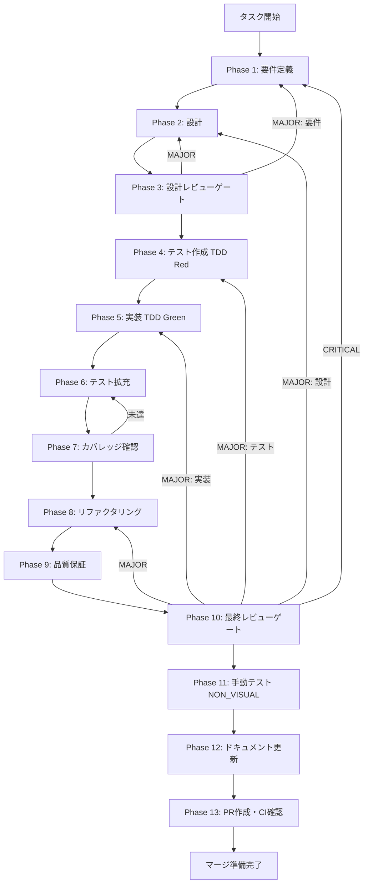

# UT-W3-ANALYTICS-ADAPTER-001 - タスク実行仕様書

## ユーザーからの元の指示

```
GitHub Issue #2058: trackEvent analytics adapter差し替え（本番分析基盤への接続）
W3-seq-04で実装したtrackEventのno-opスタブを実際のanalytics sinkに差し替え、
本番環境でSkillWizardEventsのイベントデータを外部分析基盤へ送信できる状態にする。
```

## メタ情報

| 項目         | 内容                                                                              |
| ------------ | --------------------------------------------------------------------------------- |
| タスクID     | UT-W3-ANALYTICS-ADAPTER-001                                                       |
| タスク名     | trackEvent analytics adapter差し替え（本番分析基盤への接続）                      |
| issue番号    | 2058                                                                              |
| 分類         | 実装                                                                              |
| 対象機能     | renderer-local analytics stub → 本番 analytics sink 接続                          |
| 優先度       | 中                                                                                |
| 見積もり規模 | 中規模                                                                            |
| ステータス   | phase12_completed（Phase 13 blocked）                                             |
| 作成日       | 2026-04-11                                                                        |
| source_phase | W3-seq-04（usage tracking）Phase 12 unassigned-task-detection.md の将来潜在タスク |

---

## タスク概要

### 目的

`apps/desktop/src/renderer/utils/trackEvent.ts` の sink 部分を実際の analytics adapter に差し替え、
本番環境で `SkillWizardEvents` のイベントデータを外部分析基盤へ送信できる状態にする。
呼び出し側（`SkillCreateWizard.tsx`）の変更は最小化または不要とする。

## 実行オーケストレーション

### 並列SubAgent

| Agent              | 責務                                                 | 実行タイミング                       |
| ------------------ | ---------------------------------------------------- | ------------------------------------ |
| skill準拠検証Agent | 2つのskill定義への準拠、4条件、差分一覧の検証        | Phase 1完了後、Phase 2-3で並列       |
| 30思考法分析Agent  | 30種の思考法を全適用し、改善仮説と破棄判断材料を作成 | Phase 1完了後、Phase 2-3で並列       |
| 改善実行Agent      | 統合結果に基づき、最小複雑性で再構成する             | Phase 3統合後、Phase 4-10で直列/並列 |

### 分析方針

- 30種の思考法は7カテゴリすべてにまたがって適用し、各方法の結果を `method -> finding -> action` の形で記録する
- 判断の根拠は `Decision Register` に集約し、Phase 1/2/3/8/10 の個別説明を最小化する
- 既存実装をパッチ修正するより再構成がエレガントな場合は、Phase 3のレビュー結果を根拠に破棄判断へ切り替える
- 独立責務は並列、依存関係ありは直列で進める

### 背景

W3-seq-04 で切り出した `trackEvent` は renderer-local util として残しつつ、
UT-W3-ANALYTICS-ADAPTER-001 で production sink を `analyticsAdapter` / `analytics:send`
経由に差し替えた。
開発環境では `[trackEvent]` プレフィックスの `console.info` 出力を継続し、
本番環境ではイベントデータを Main の `analyticsHandler.ts` へ送る。
`SkillCreateWizard.tsx` の計装ポイントは維持し、オプトアウト判定とキューイングは
adapter 側に閉じる。

実装ガイド（UT-W3-ANALYTICS-ADAPTER-001 Phase 12）には current contract として以下の記載がある:

> dev 環境は `console.info`、prod 環境は `analyticsAdapter` に送る。呼び出し側は変えず、
> オプトアウトとオフラインキューは adapter 側に閉じる。

### 最終ゴール

- 本番環境で5計装ポイント（`skill_wizard_started` 等）のイベントが外部分析基盤へ送信される
- CSP制限に抵触しない実装（IPC経由推奨）
- オフライン時のキューイング対応
- ユーザーオプトアウト設定との連動
- `trackEvent` 公開API シグネチャ不変

### 成果物一覧

| 種別         | 成果物                               | 配置先                                                               |
| ------------ | ------------------------------------ | -------------------------------------------------------------------- |
| 修正         | trackEvent.ts（sink差し替え）        | `apps/desktop/src/renderer/utils/trackEvent.ts`                      |
| 新規         | analyticsAdapter.ts                  | `apps/desktop/src/renderer/utils/analyticsAdapter.ts`                |
| 新規         | analyticsAdapter.test.ts             | `apps/desktop/src/renderer/utils/__tests__/analyticsAdapter.test.ts` |
| 新規/修正    | analyticsHandler.ts（IPC経由の場合） | `apps/desktop/src/main/ipc/analyticsHandler.ts`                      |
| 修正         | CSP設定ファイル                      | `apps/desktop/src/main/` 配下の Electron 設定                        |
| ドキュメント | Phase成果物                          | `outputs/phase-*/`                                                   |
| PR           | GitHub Pull Request                  | GitHub UI                                                            |

---

## 参照ファイル

| 資料                          | パス                                                                                       |
| ----------------------------- | ------------------------------------------------------------------------------------------ |
| trackEvent現状実装            | `apps/desktop/src/renderer/utils/trackEvent.ts`                                            |
| trackEventテスト              | `apps/desktop/src/renderer/utils/__tests__/trackEvent.test.ts`                             |
| SkillCreateWizard（計装済み） | `apps/desktop/src/renderer/components/skill/SkillCreateWizard.tsx`                         |
| W3-seq-04実装ガイド           | `docs/30-workflows/W3-seq-04-usage-tracking/outputs/phase-12/implementation-guide.md`      |
| W3-seq-04未タスク検出         | `docs/30-workflows/W3-seq-04-usage-tracking/outputs/phase-12/unassigned-task-detection.md` |
| Electron Main IPCディレクトリ | `apps/desktop/src/main/ipc/`                                                               |
| 元のunassigned-task仕様書     | `docs/30-workflows/unassigned-task/UT-W3-ANALYTICS-ADAPTER-001.md`                         |

---

## タスク分解サマリー

| ID     | フェーズ | サブタスク名                            | 責務                             | 依存 |
| ------ | -------- | --------------------------------------- | -------------------------------- | ---- |
| T-01-1 | Phase 1  | CSP調査・provider選定・AC確定           | 要件・制約・受入条件固定         | -    |
| T-02-1 | Phase 2  | analyticsAdapter設計・IPC設計           | アーキテクチャ・インターフェース | T-01 |
| T-03-1 | Phase 3  | 設計レビュー・Phase 4進行可否判定       | レビューゲート                   | T-02 |
| T-04-1 | Phase 4  | analyticsAdapter.test.ts作成（Red）     | TDD Red: テスト先行作成          | T-03 |
| T-05-1 | Phase 5  | analyticsAdapter.ts実装・trackEvent差替 | TDD Green: 実装                  | T-04 |
| T-06-1 | Phase 6  | エッジケース・オフラインシナリオ追加    | テスト拡充                       | T-05 |
| T-07-1 | Phase 7  | analyticsAdapter 90%+・trackEvent 100%  | カバレッジ確認                   | T-06 |
| T-08-1 | Phase 8  | アダプターコード重複除去・命名修正      | リファクタリング                 | T-07 |
| T-09-1 | Phase 9  | typecheck/lint/test全通過・CSP確認      | 品質保証                         | T-08 |
| T-10-1 | Phase 10 | AC-1〜AC-9充足確認・CSP最終確認         | 最終レビューゲート               | T-09 |
| T-11-1 | Phase 11 | 送信ログ確認・オフライン→オンライン確認 | 手動テスト（NON_VISUAL）         | T-10 |
| T-12-1 | Phase 12 | 実装ガイド・仕様更新・未タスク・FB      | ドキュメント更新                 | T-11 |
| T-13-1 | Phase 13 | PR作成（ユーザー承認後）                | PR作成・CI確認                   | T-12 |

**総サブタスク数**: 13個

---

## 実行フロー図



---

## Phase一覧

| Phase | 名称               | 仕様書                                                       | ステータス        |
| ----- | ------------------ | ------------------------------------------------------------ | ----------------- |
| 1     | 要件定義           | [phase-1-requirements.md](phase-1-requirements.md)           | completed         |
| 2     | 設計               | [phase-2-design.md](phase-2-design.md)                       | completed         |
| 3     | 設計レビューゲート | [phase-3-design-review.md](phase-3-design-review.md)         | completed         |
| 4     | テスト作成         | [phase-4-test-creation.md](phase-4-test-creation.md)         | completed         |
| 5     | 実装               | [phase-5-implementation.md](phase-5-implementation.md)       | completed         |
| 6     | テスト拡充         | [phase-6-test-expansion.md](phase-6-test-expansion.md)       | completed         |
| 7     | カバレッジ確認     | [phase-7-coverage-check.md](phase-7-coverage-check.md)       | completed         |
| 8     | リファクタリング   | [phase-8-refactoring.md](phase-8-refactoring.md)             | completed         |
| 9     | 品質保証           | [phase-9-quality-assurance.md](phase-9-quality-assurance.md) | completed         |
| 10    | 最終レビューゲート | [phase-10-final-review.md](phase-10-final-review.md)         | completed         |
| 11    | 手動テスト         | [phase-11-manual-test.md](phase-11-manual-test.md)           | completed         |
| 12    | ドキュメント更新   | [phase-12-documentation.md](phase-12-documentation.md)       | phase12_completed |
| 13    | PR作成             | [phase-13-pr-creation.md](phase-13-pr-creation.md)           | blocked           |

---

## テストカバレッジ目標

### ユニットテスト

| 対象ファイル        | Line Coverage | Branch Coverage | Function Coverage |
| ------------------- | ------------- | --------------- | ----------------- |
| analyticsAdapter.ts | 90%+          | 80%+            | 90%+              |
| trackEvent.ts       | 100%          | 100%            | 100%              |
| analyticsHandler.ts | 90%+          | 80%+            | 90%+              |

### 結合テスト

| 指標                          | 目標 |
| ----------------------------- | ---- |
| IPC チャネル（analytics送信） | 100% |
| オフライン→オンライン復帰     | 100% |
| オプトアウト停止確認          | 100% |
| フォールバック（初期化失敗）  | 100% |

---

## Phase完了時の必須アクション

**各Phase完了時に以下を必ず実行すること:**

1. **タスク100%実行**: Phase内で指定された全タスクを完全に実行
2. **成果物確認**: 全ての必須成果物が生成されていることを検証
3. **実行記録**: 実行タスクの結果を記録
4. **artifacts.json更新**: Phase完了ステータスを更新

```bash
# Phase完了時の検証コマンド
node .claude/skills/task-specification-creator/scripts/validate-phase-output.js \
  docs/30-workflows/UT-W3-ANALYTICS-ADAPTER-001 --phase {{PHASE_NUMBER}}

# Phase完了・成果物登録
node .claude/skills/task-specification-creator/scripts/complete-phase.js \
  --workflow docs/30-workflows/UT-W3-ANALYTICS-ADAPTER-001 \
  --phase {{PHASE_NUMBER}} \
  --artifacts "..."
```

---

## 受入条件（AC）サマリー

| AC   | 内容                                                                                             |
| ---- | ------------------------------------------------------------------------------------------------ |
| AC-1 | 本番環境（`NODE_ENV=production`）で `trackEvent` が analytics sink にイベントを送信できる        |
| AC-2 | 選定した analytics provider への接続が CSP 制限に抵触しない                                      |
| AC-3 | オフライン時にイベントがキューに保持され、オンライン復帰後に送信される                           |
| AC-4 | ユーザーのオプトアウト設定が有効な場合、`trackEvent` がイベントを送信しない                      |
| AC-5 | `trackEvent.ts` の公開 API シグネチャ（`trackEvent<K>(eventName, payload): void`）が変更されない |
| AC-6 | `SkillCreateWizard.tsx` の計装ポイントへの変更が不要（または最小）である                         |
| AC-7 | analytics adapter のユニットテストカバレッジが 90% 以上である                                    |
| AC-8 | `pnpm typecheck` / `pnpm lint` / `pnpm test` が全て PASS する                                    |
| AC-9 | analytics provider 初期化失敗時に `trackEvent` が no-op にフォールバックする                     |

---

_作成日: 2026-04-11_
