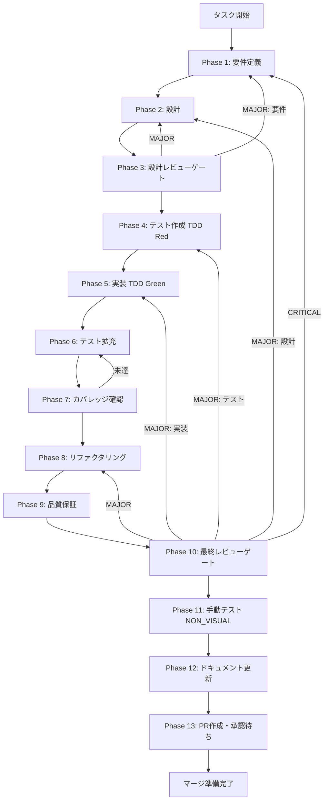

# W2-seq-03a: SkillCreateWizard.tsx 実装（オーケストレーション・Wave 2）

## ユーザーからの元の指示

```
GitHub Issue #2016: [UT-SKILL-WIZARD-W2-SKILL-CREATE-WIZARD-001] SkillCreateWizard.tsx 実装（オーケストレーション・Wave 2）
Issue URL: https://github.com/daishiman/AIWorkflowOrchestrator/issues/2016
```

## メタ情報

| 項目         | 内容                                                                     |
| ------------ | ------------------------------------------------------------------------ |
| タスクID     | UT-SKILL-WIZARD-W2-SKILL-CREATE-WIZARD-001                               |
| タスク名     | SkillCreateWizard.tsx 実装（オーケストレーション・Wave 2）               |
| 分類         | 新機能実装                                                               |
| 対象機能     | スキル作成ウィザード - メインオーケストレーター                          |
| 優先度       | 高                                                                       |
| 見積もり規模 | 大規模                                                                   |
| ステータス   | completed                                                                |
| 作成日       | 2026-04-08                                                               |
| 依存タスク   | W0-seq-01, W0-seq-02, W1-par-02a, W1-par-02b, W1-par-02c                 |
| Issue        | [#2016](https://github.com/daishiman/AIWorkflowOrchestrator/issues/2016) |

---

## タスク概要

### 目的

Wave 1 の全 Step コンポーネントを統合した新設計の `SkillCreateWizard.tsx` を実装し、スキル作成ウィザードの新フローをエンドツーエンドで動作させる。

### 背景

スキル作成ウィザードの全面改善（skill-wizard-redesign-lane）が進行中であり、Wave 0・Wave 1 で以下の成果物が完成済みである。

| 完了タスク | 成果物                                                                                  |
| ---------- | --------------------------------------------------------------------------------------- |
| W0-seq-01  | 共有型定義（`SkillInfoFormData`、`SmartDefaultResult`、`ConversationAnswers` 等）       |
| W0-seq-02  | 推論サービス（`inferSmartDefaults`、`packages/shared/src/services/skillCreator/` 配下） |
| W1-par-02a | `SkillInfoStep.tsx`（Step 0: スキル情報入力）                                           |
| W1-par-02b | `ConversationRoundStep.tsx`（Step 1: 6問固定会話ラリー）                                |
| W1-par-02c | `CompleteStep.tsx`（完了画面: ネクストアクション3カード + 品質フィードバック）          |
| W1-par-02d | `SkillLifecyclePanel.tsx`（遷移ボタン化）                                               |

これらの個別コンポーネントを統合し、ウィザード全体のオーケストレーションを担う `SkillCreateWizard.tsx` を再設計・新規実装する本タスクが Wave 2 の中核となる。

### 最終ゴール

- 3 ステップのウィザードフロー（Step 0 → Step 1 → Step 2）が正常に動作する。
- Step 0 → Step 1 遷移時に `inferSmartDefaults` が呼び出され、結果が Step 1 に渡る。
- NON_VISUAL 計装ポイント 5 つが実装され、テストカバレッジが 90% 以上となる。
- 既存テスト（旧設計）が全 PASS するか、適切に更新・削除される。

### 成果物一覧

| 種別         | 成果物                            | 配置先                                                        |
| ------------ | --------------------------------- | ------------------------------------------------------------- |
| 機能         | `SkillCreateWizard.tsx`（再実装） | `apps/desktop/src/renderer/components/skill/`                 |
| テスト       | `SkillCreateWizard.test.tsx`      | `apps/desktop/src/renderer/components/skill/__tests__/`       |
| ドキュメント | Phase 1-12 各成果物               | `docs/30-workflows/W2-seq-03a-skill-create-wizard-2/outputs/` |

---

## 参照ファイル

- `docs/30-workflows/skill-wizard-redesign-lane/index.md` - レーン概要
- `packages/shared/src/types/skillCreator.ts` - 共有型定義
- `.claude/skills/aiworkflow-requirements/references/` - システム仕様
- `.claude/skills/task-specification-creator/SKILL.md` - Phase 1-13 フォーマット

---

## 前提条件

- Wave 0・Wave 1 のタスクが全て `completed` ステータスであること
- `pnpm vitest run` が全テスト PASS の状態で実行開始すること
- TypeScript エラーがないこと（`pnpm --filter @repo/desktop typecheck`）

---

## 依存タスク

| タスクID   | タスク名                         | 依存種別 | 状態               |
| ---------- | -------------------------------- | -------- | ------------------ |
| W0-seq-01  | 共有型定義                       | 必須先行 | completed（#2002） |
| W0-seq-02  | スマートデフォルト推論サービス   | 必須先行 | completed（#1998） |
| W1-par-02a | SkillInfoStep.tsx                | 必須先行 | Wave 1 完了後      |
| W1-par-02b | ConversationRoundStep.tsx        | 必須先行 | Wave 1 完了後      |
| W1-par-02c | CompleteStep.tsx                 | 必須先行 | Wave 1 完了後      |
| W2-seq-03b | wizard/index.ts エクスポート更新 | 並列可   | Wave 2 同時進行    |

---

## タスク分解サマリー

| ID     | フェーズ | サブタスク名               | 責務                             | 依存 |
| ------ | -------- | -------------------------- | -------------------------------- | ---- |
| T-01-1 | Phase 1  | 要件定義                   | 影響範囲分析・受け入れ基準定義   | -    |
| T-02-1 | Phase 2  | 設計                       | コンポーネント設計・状態管理設計 | T-01 |
| T-03-1 | Phase 3  | 設計レビューゲート         | 設計の矛盾・漏れチェック         | T-02 |
| T-04-1 | Phase 4  | テスト作成（TDD Red）      | Red段階テスト作成                | T-03 |
| T-05-1 | Phase 5  | 実装（TDD Green）          | 最小実装でテストをGreen化        | T-04 |
| T-06-1 | Phase 6  | テスト拡充                 | エッジケーステスト追加           | T-05 |
| T-07-1 | Phase 7  | カバレッジ確認             | 90%以上を達成                    | T-06 |
| T-08-1 | Phase 8  | リファクタリング           | コード品質改善                   | T-07 |
| T-09-1 | Phase 9  | 品質保証                   | 静的解析・型チェック             | T-08 |
| T-10-1 | Phase 10 | 最終レビューゲート         | Phase 1-9成果物統合レビュー      | T-09 |
| T-11-1 | Phase 11 | 手動テスト（NON_VISUAL）   | REPL/CLI証跡取得                 | T-10 |
| T-12-1 | Phase 12 | ドキュメント更新           | canonical 6成果物作成            | T-11 |
| T-13-1 | Phase 13 | PR作成（ユーザー承認待ち） | PR準備・承認待ち                 | T-12 |

**総サブタスク数**: 13個

---

## 実行フロー図



---

## Phase一覧

| Phase | 名称               | 仕様書                                                       | ステータス |
| ----- | ------------------ | ------------------------------------------------------------ | ---------- |
| 1     | 要件定義           | [phase-1-requirements.md](phase-1-requirements.md)           | completed  |
| 2     | 設計               | [phase-2-design.md](phase-2-design.md)                       | completed  |
| 3     | 設計レビューゲート | [phase-3-design-review.md](phase-3-design-review.md)         | completed  |
| 4     | テスト作成         | [phase-4-test-creation.md](phase-4-test-creation.md)         | completed  |
| 5     | 実装               | [phase-5-implementation.md](phase-5-implementation.md)       | completed  |
| 6     | テスト拡充         | [phase-6-test-expansion.md](phase-6-test-expansion.md)       | completed  |
| 7     | カバレッジ確認     | [phase-7-coverage-check.md](phase-7-coverage-check.md)       | completed  |
| 8     | リファクタリング   | [phase-8-refactoring.md](phase-8-refactoring.md)             | completed  |
| 9     | 品質保証           | [phase-9-quality-assurance.md](phase-9-quality-assurance.md) | completed  |
| 10    | 最終レビューゲート | [phase-10-final-review.md](phase-10-final-review.md)         | completed  |
| 11    | 手動テスト         | [phase-11-manual-test.md](phase-11-manual-test.md)           | completed  |
| 12    | ドキュメント更新   | [phase-12-documentation.md](phase-12-documentation.md)       | completed  |
| 13    | PR作成             | [phase-13-pr-creation.md](phase-13-pr-creation.md)           | blocked    |

---

## テストカバレッジ目標

### ユニットテスト

| 指標              | 最低基準 | 推奨基準 |
| ----------------- | -------- | -------- |
| Line Coverage     | 80%      | 90%      |
| Branch Coverage   | 60%      | 80%      |
| Function Coverage | 80%      | 90%      |

---

## 完了条件チェックリスト

### 機能要件

- [x] `SkillCreateWizard.tsx` が 3 ステップ（SkillInfoStep / ConversationRoundStep / CompleteStep）で動作する（AC-01）
- [x] Step 0 → Step 1 遷移時に `inferSmartDefaults` が呼び出される（AC-02）
- [x] `SmartDefaultResult` が `ConversationRoundStep` の Props として渡される（AC-03）
- [x] NON_VISUAL 計装ポイント 5 つが実装される（AC-04）

### 品質要件

- [x] ユニットテストが全 PASS する（AC-05）
- [x] Line Coverage >= 90%（AC-05）
- [x] Branch Coverage >= 80%
- [x] Function Coverage >= 90%
- [x] TypeScript 型チェックエラーなし（AC-06）
- [x] ESLint エラー・警告なし（AC-07）

### ドキュメント要件

- [x] Phase 1-12 の全成果物が存在する
- [x] canonical 6 成果物（`outputs/phase-12/` 配下）が揃っている
- [x] 実装ガイド（`outputs/phase-12/implementation-guide.md`）が最新実装に同期している
- [x] `skill-wizard-redesign-lane/index.md` の W2-seq-03a ステータスが `completed` に更新される
