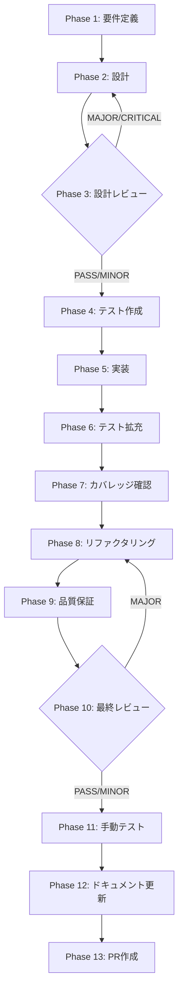

# TASK-SW-FIX-STATE-DETAIL-001: 状態残留・リカバリーパス・競合状態修正

## メタ情報

| 項目           | 内容                                                                                                                           |
| -------------- | ------------------------------------------------------------------------------------------------------------------------------ |
| タスクID       | TASK-SW-FIX-STATE-DETAIL-001                                                                                                   |
| タスク名       | 状態残留・リカバリーパス・競合状態修正                                                                                         |
| 分類           | バグ修正                                                                                                                       |
| 対象機能       | スキルウィザード（Wave C）                                                                                                     |
| 優先度         | 中                                                                                                                             |
| 見積もり規模   | 中規模                                                                                                                         |
| ステータス     | pending                                                                                                                        |
| ウェーブ       | Wave C（Wave B完了後。Phase 1-4/6-13 は並列、Phase 5 は `SkillCreateWizard.tsx` / `ConversationRoundStep.tsx` 共有のため順次） |
| 作成日         | 2026-04-12                                                                                                                     |
| 親ワークフロー | skill-wizard-bugfix-wave                                                                                                       |

---

## 現在の状態

- Phase 10〜12 は completed
- Phase 13 は PR 禁止のため skipped / blocked
- `isTemplateMode` wire-up、`resolveExternalIntegration` 再計算、`generationLockRef` finally 解除は current facts へ反映済み

## タスク概要

### 目的

スキルウィザードの4件の詳細バグ（問題12・13・18・19）を修正する。
リトライ時のinternalAnswers状態残留、templateモードのリカバリーパス欠如、
q5変更時のresolveExternalIntegration未再計算、generationLockRefのキャンセル競合状態を解消する。

### 背景

30種の思考法による多角的検証（2026-04-12）で特定された問題群のうち、
状態管理クラスター（B）に属する詳細バグを修正する。

| 問題番号 | 内容                                                                                        |
| -------- | ------------------------------------------------------------------------------------------- |
| 問題12   | リトライ時にConversationRoundStepのinternalAnswers stateが前回値を保持したまま残留          |
| 問題13   | templateモードのエラー後にキャンセルボタンがなく、Step 0に戻るルートが不明確                |
| 問題18   | q5を後から変更してもresolveExternalIntegrationが再計算されない                              |
| 問題19   | generationLockRefのキャンセル競合状態（ロックが解除されず以降の生成が不能になる潜在的バグ） |

### 依存タスク

- **依存**: TASK-SW-FIX-FEEDBACK-001（Wave B完了後に本タスクを開始可能）
- Wave C内では Phase 1-4/6-13 は `TASK-SW-FIX-UI-001` と並列実行可能。ただし Phase 5 は `SkillCreateWizard.tsx` / `ConversationRoundStep.tsx` の共有編集があるため順次適用する

### 最終ゴール

1. リトライ時にConversationRoundStepのinternalAnswersが空値にリセットされる
2. templateモードのエラー時にキャンセルボタンが表示され、Step 0に戻れる
3. q5変更後にhasExternalIntegrationとexternalToolNameが最新値で再計算される
4. generationLockRefがキャンセル後に正しくfalseに戻り、次の生成操作が可能になる
5. 既存の正常フローに回帰影響がない

---

## 変更対象ファイル

| ファイル                                                                      | 修正内容                                                           |
| ----------------------------------------------------------------------------- | ------------------------------------------------------------------ |
| `apps/desktop/src/renderer/components/skill/wizard/ConversationRoundStep.tsx` | useEffect依存配列にanswers propを追加してinternalAnswersをリセット |
| `apps/desktop/src/renderer/components/skill/wizard/GenerateStep.tsx`          | templateモードエラー時のキャンセルボタン追加                       |
| `apps/desktop/src/renderer/components/skill/SkillCreateWizard.tsx`            | generationLockRef競合修正・resolveExternalIntegration再計算追加    |

---

## 成果物一覧

| Phase | 名称             | 成果物                                        |
| ----- | ---------------- | --------------------------------------------- |
| 1     | 要件定義         | `outputs/phase-1/requirements-definition.md`  |
| 2     | 設計             | `outputs/phase-2/design-document.md`          |
| 3     | 設計レビュー     | `outputs/phase-3/review-result.md`            |
| 4     | テスト作成       | `outputs/phase-4/test-specifications.md`      |
| 5     | 実装             | `outputs/phase-5/implementation-record.md`    |
| 6     | テスト拡充       | `outputs/phase-6/extended-test-record.md`     |
| 7     | カバレッジ確認   | `outputs/phase-7/coverage-report.md`          |
| 8     | リファクタリング | `outputs/phase-8/refactoring-record.md`       |
| 9     | 品質保証         | `outputs/phase-9/quality-report.md`           |
| 10    | 最終レビュー     | `outputs/phase-10/final-review-result.md`     |
| 11    | 手動テスト       | `outputs/phase-11/manual-test-result.md`      |
| 12    | ドキュメント更新 | `outputs/phase-12/implementation-guide.md` 他 |
| 13    | PR作成           | `outputs/phase-13/change-summary.md`          |

---

## 参照ファイル

- `apps/desktop/src/renderer/components/skill/wizard/ConversationRoundStep.tsx`
- `apps/desktop/src/renderer/components/skill/wizard/GenerateStep.tsx`
- `apps/desktop/src/renderer/components/skill/SkillCreateWizard.tsx`
- `packages/shared/src/types/skillCreator.ts`
- `docs/30-workflows/skill-wizard-bugfix-wave/index.md`

---

## タスク分解サマリ（Phase 1-13）



| Phase | 名称             | パターン | 依存     | ゲート | ステータス |
| ----- | ---------------- | -------- | -------- | ------ | ---------- |
| 1     | 要件定義         | seq      | -        | -      | pending    |
| 2     | 設計             | seq      | Phase 1  | -      | pending    |
| 3     | 設計レビュー     | seq      | Phase 2  | GATE   | pending    |
| 4     | テスト作成       | seq      | Phase 3  | -      | pending    |
| 5     | 実装             | seq      | Phase 4  | -      | pending    |
| 6     | テスト拡充       | seq      | Phase 5  | -      | pending    |
| 7     | カバレッジ確認   | seq      | Phase 6  | -      | pending    |
| 8     | リファクタリング | seq      | Phase 7  | -      | pending    |
| 9     | 品質保証         | seq      | Phase 8  | -      | pending    |
| 10    | 最終レビュー     | seq      | Phase 9  | GATE   | completed  |
| 11    | 手動テスト       | seq      | Phase 10 | VISUAL | completed  |
| 12    | ドキュメント更新 | par      | Phase 11 | -      | completed  |
| 13    | PR作成           | seq      | Phase 12 | -      | skipped    |

---

## テストカバレッジ目標

| カテゴリ | 対象                                                | 目標     |
| -------- | --------------------------------------------------- | -------- |
| ユニット | ConversationRoundStep internalAnswers リセット      | 100%     |
| ユニット | GenerateStep キャンセルボタン表示制御               | 100%     |
| ユニット | SkillCreateWizard resolveExternalIntegration 再計算 | 100%     |
| ユニット | generationLockRef finally節リセット                 | 100%     |
| 統合     | リトライ→internalAnswers空値確認の E2E フロー       | 再発防止 |

---

## Phase 完了時アクション

各 Phase 完了時に以下を実行:

```bash
node .claude/skills/task-specification-creator/scripts/complete-phase.js \
  --workflow TASK-SW-FIX-STATE-DETAIL-001 \
  --phase <PHASE_NUMBER>
```

---

## 出力ファイル構成

```
docs/30-workflows/skill-wizard-bugfix-wave/WC-par-03a-fix-state-detail/
├── index.md
├── artifacts.json
├── phase-1-requirements.md
├── phase-2-design.md
├── phase-3-design-review.md
├── phase-4-test-creation.md
├── phase-5-implementation.md
├── phase-6-test-expansion.md
├── phase-7-coverage-check.md
├── phase-8-refactoring.md
├── phase-9-quality-assurance.md
├── phase-10-final-review.md
├── phase-11-manual-test.md
├── phase-12-documentation.md
├── phase-13-pr-creation.md
└── outputs/
    ├── phase-1/ ~ phase-13/
    └── phase-11/screenshots/
```
