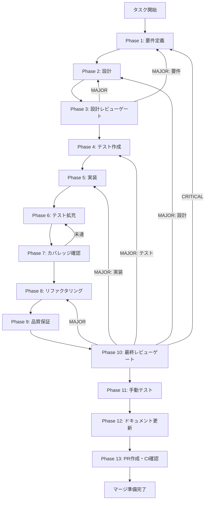

# agent-003-skill-management-backend - タスク実行仕様書

## ユーザーからの元の指示

```
Main ProcessでClaude Codeのスキルを読み込み・解析し、ユーザーが選択したスキルをインポート・管理する機能を実装する。インポート設定は永続化され、アプリ再起動後も維持される。
```

## メタ情報

| 項目         | 内容                   |
| ------------ | ---------------------- |
| タスクID     | AGENT-003              |
| タスク名     | スキル管理バックエンド |
| 分類         | 要件                   |
| 対象機能     | エージェント機能       |
| 優先度       | 高                     |
| 見積もり規模 | 中規模                 |
| ステータス   | 未実施                 |
| 作成日       | 2026-01-11             |
| 発見元       | ユーザー要求           |
| 発見日       | 2026-01-09             |

---

## 依存関係と並行実行

### 依存関係マップ

```
task-agent-01-dashboard-foundation.md (AGENT-001)
    │
    ├──► task-agent-02-skill-management-ui.md (AGENT-002) ※本タスクと並行可能
    │
    └──► task-agent-03-skill-management-backend.md (AGENT-003/本タスク)
              │
              └──► task-agent-04-execution-ui.md (AGENT-004)
                        │
              └──► task-agent-05-claude-code-integration.md (AGENT-005) ※04と並行可能
```

### 本タスクの位置づけ

| 項目                     | 内容                                                          |
| ------------------------ | ------------------------------------------------------------- |
| 直接依存                 | AGENT-001（エージェントダッシュボード基盤）                   |
| 並行実行可能             | AGENT-002（スキル管理UI）※フロントはモックで並行開発可        |
| 本タスク完了後に開始可能 | AGENT-004（エージェント実行UI）, AGENT-005（Claude Code統合） |

---

## タスク概要

### 目的

Main ProcessでClaude Codeのスキルを読み込み・解析し、ユーザーが選択したスキルをインポート・管理するバックエンド機能を実装する。

### 背景

フロントエンドからスキル情報を取得するためのバックエンド（Main Process）実装が必要。`.claude/skills/`ディレクトリ内のスキルを読み込み、SKILL.mdを解析してメタデータを抽出し、IPC経由でRendererに提供する。

**現状の問題点**:

- スキルディレクトリを読み込むMain Process側の実装がない
- SKILL.mdファイルを解析するパーサーがない
- エージェント関連のIPCハンドラーが存在しない
- スキルメタデータのキャッシュ機構がない

### 最終ゴール

- `.claude/skills/`ディレクトリから利用可能なスキル一覧を取得できる
- SKILL.mdを解析してメタデータ（名前、説明、Trigger、Anchor）を抽出できる
- ユーザーが選択したスキルをインポート・削除できる
- インポート設定がローカルストレージに永続化される
- IPC経由でスキル一覧・詳細・インポート管理ができる

### 成果物一覧

| 種別           | 成果物               | 配置先                                                       |
| -------------- | -------------------- | ------------------------------------------------------------ |
| 型定義         | Skill型・IPC型定義   | `packages/shared/src/types/agent.ts`                         |
| スキャナー     | SkillScanner         | `apps/desktop/src/main/services/skill/SkillScanner.ts`       |
| パーサー       | SkillParser          | `apps/desktop/src/main/services/skill/SkillParser.ts`        |
| インポート管理 | SkillImportManager   | `apps/desktop/src/main/services/skill/SkillImportManager.ts` |
| サービス       | SkillService         | `apps/desktop/src/main/services/skill/SkillService.ts`       |
| IPCハンドラー  | agentHandlers        | `apps/desktop/src/main/ipc/agentHandlers.ts`                 |
| チャネル定義   | channels.ts更新      | `apps/desktop/src/preload/channels.ts`                       |
| テスト         | ユニット・統合テスト | `apps/desktop/src/main/services/skill/__tests__/`            |
| ドキュメント   | 各Phase成果物        | `outputs/phase-*/`                                           |
| PR             | GitHub Pull Request  | GitHub UI                                                    |

---

## 参照ファイル

本仕様書の実装は以下を参照:

### システム仕様（aiworkflow-requirements）

| 参照資料               | パス                                                                                | 内容                          |
| ---------------------- | ----------------------------------------------------------------------------------- | ----------------------------- |
| アーキテクチャパターン | `.claude/skills/aiworkflow-requirements/references/architecture-patterns.md`        | Zustand Slice、agentSlice設計 |
| Electronセキュリティ   | `.claude/skills/aiworkflow-requirements/references/security-api-electron.md`        | IPC通信セキュリティ、CSP      |
| ローカルエージェント   | `.claude/skills/aiworkflow-requirements/references/local-agent.md`                  | ファイル監視、パス検証        |
| Skill構造仕様          | `.claude/skills/aiworkflow-requirements/references/claude-code-skills-structure.md` | SKILL.md解析仕様              |

### 関連実装

| 参照資料          | パス                                   | 内容                |
| ----------------- | -------------------------------------- | ------------------- |
| 既存IPCハンドラー | `apps/desktop/src/main/ipc/`           | IPC実装パターン参照 |
| チャネル定義      | `apps/desktop/src/preload/channels.ts` | 既存チャネル構造    |
| 既存スキル一覧    | `.claude/skills/skill-list.md`         | スキル構造の参考    |

---

## タスク分解サマリー

| ID     | フェーズ | サブタスク名       | 責務                           | 依存 |
| ------ | -------- | ------------------ | ------------------------------ | ---- |
| T-01-1 | Phase 1  | 要件定義           | 受け入れ基準・SKILL.md仕様定義 | -    |
| T-02-1 | Phase 2  | 設計               | 型定義・クラス・IPC設計        | T-01 |
| T-03-1 | Phase 3  | 設計レビューゲート | 設計妥当性検証                 | T-02 |
| T-04-1 | Phase 4  | テスト作成         | TDD Red: 失敗テスト作成        | T-03 |
| T-05-1 | Phase 5  | 実装               | TDD Green: 実装                | T-04 |
| T-06-1 | Phase 6  | テスト拡充         | カバレッジ向上                 | T-05 |
| T-07-1 | Phase 7  | カバレッジ確認     | 基準達成検証                   | T-06 |
| T-08-1 | Phase 8  | リファクタリング   | TDD Refactor: 品質改善         | T-07 |
| T-09-1 | Phase 9  | 品質保証           | 静的解析・セキュリティ検証     | T-08 |
| T-10-1 | Phase 10 | 最終レビューゲート | 全体品質検証                   | T-09 |
| T-11-1 | Phase 11 | 手動テスト         | UX・実環境動作確認             | T-10 |
| T-12-1 | Phase 12 | ドキュメント更新   | 実装ガイド・未タスク検出       | T-11 |
| T-13-1 | Phase 13 | PR作成             | /ai:diff-to-pr・CI確認         | T-12 |

**総サブタスク数**: 13個

---

## 実行フロー図



---

## Phase一覧

| Phase | 名称               | 仕様書                                                 | ステータス |
| ----- | ------------------ | ------------------------------------------------------ | ---------- |
| 1     | 要件定義           | [phase-1-requirements.md](phase-1-requirements.md)     | 未実施     |
| 2     | 設計               | [phase-2-design.md](phase-2-design.md)                 | 未実施     |
| 3     | 設計レビューゲート | [phase-3-design-review.md](phase-3-design-review.md)   | 未実施     |
| 4     | テスト作成         | [phase-4-test-creation.md](phase-4-test-creation.md)   | 未実施     |
| 5     | 実装               | [phase-5-implementation.md](phase-5-implementation.md) | 未実施     |
| 6     | テスト拡充         | [phase-6-test-expansion.md](phase-6-test-expansion.md) | 未実施     |
| 7     | カバレッジ確認     | [phase-7-coverage-check.md](phase-7-coverage-check.md) | 未実施     |
| 8     | リファクタリング   | [phase-8-refactoring.md](phase-8-refactoring.md)       | 未実施     |
| 9     | 品質保証           | [phase-9-quality.md](phase-9-quality.md)               | 未実施     |
| 10    | 最終レビューゲート | [phase-10-final-review.md](phase-10-final-review.md)   | 未実施     |
| 11    | 手動テスト         | [phase-11-manual-test.md](phase-11-manual-test.md)     | 未実施     |
| 12    | ドキュメント更新   | [phase-12-documentation.md](phase-12-documentation.md) | 未実施     |
| 13    | PR作成             | [phase-13-pr-creation.md](phase-13-pr-creation.md)     | 未実施     |

---

## テストカバレッジ目標

### ユニットテスト

| 指標              | 最低基準 | 推奨基準 |
| ----------------- | -------- | -------- |
| Line Coverage     | 80%      | 90%      |
| Branch Coverage   | 60%      | 70%      |
| Function Coverage | 80%      | 90%      |

### 結合テスト

| 指標                            | 目標 |
| ------------------------------- | ---- |
| IPCエンドポイント               | 100% |
| モジュール間インターフェース    | 100% |
| 正常系シナリオ                  | 100% |
| 異常系シナリオ                  | 80%+ |
| 外部連携ポイント（ファイルI/O） | 100% |

---

## 統合テスト連携（Phase 1〜11で必須）

各Phaseで以下の統合テスト連携アクションを実施すること:

| Phase | 統合テスト連携アクション                              |
| ----- | ----------------------------------------------------- |
| 1     | IPC接続要件・ファイルI/O要件を要件に明記              |
| 2     | IPC契約・型定義・エラーレスポンス形式を設計に反映     |
| 3     | IPC通信・セキュリティ観点のレビューゲートを実施       |
| 4     | IPC統合テストシナリオを全カテゴリで作成               |
| 5     | Main Process↔Renderer接続の実装とテスト支援コード整備 |
| 6     | IPC統合テストの拡充（全カテゴリのカバレッジ向上）     |
| 7     | IPC統合テストの再実行とゲート判定                     |
| 8     | リファクタ後のIPC統合テスト継続成功を確認             |
| 9     | 品質保証でIPC統合テスト結果を確認                     |
| 10    | 最終レビューでIPC統合テスト結果を確認                 |
| 11    | 手動IPC統合テスト（DevTools経由）を確認               |

---

## Phase完了時の必須アクション

**各Phase完了時に以下を必ず実行すること:**

1. **タスク100%実行**: Phase内で指定された全タスクを完全に実行
2. **成果物確認**: 全ての必須成果物が生成されていることを検証
3. **実行記録**: 実行タスクの結果を記録
4. **artifacts.json更新**: Phase完了ステータスを更新
5. **Phase末端の実行確認**: 各タスクを100%実行し、各タスクを完遂した旨を必ず明記

```bash
# Phase完了時の検証コマンド
node .claude/skills/task-specification-creator/scripts/validate-phase-output.mjs docs/30-workflows/agent-003-skill-management-backend --phase {{PHASE_NUMBER}}

# Phase完了・成果物登録
node .claude/skills/task-specification-creator/scripts/complete-phase.mjs \
  --workflow docs/30-workflows/agent-003-skill-management-backend --phase {{PHASE_NUMBER}} --artifacts "..."
```

---

## リスクと対策

| リスク                       | 影響度 | 発生確率 | 対策                                   |
| ---------------------------- | ------ | -------- | -------------------------------------- |
| SKILL.md形式の不統一         | 中     | 高       | 堅牢なパーサー、fallback値、エラー収集 |
| 大量スキルでのパフォーマンス | 中     | 低       | キャッシュ、遅延読み込み               |
| パストラバーサル攻撃         | 高     | 低       | ベースパス検証、パス正規化             |
| IPCセキュリティ              | 高     | 低       | sender検証、ホワイトリスト             |

---

## 使用方法

Phase 1 から順番に実行してください:

```bash
# Phase 1 から開始
cat docs/30-workflows/agent-003-skill-management-backend/phase-1-requirements.md
```
