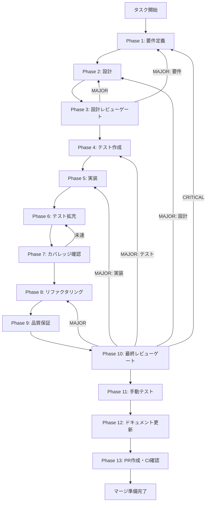

# agent-007-environment-backend - タスク実行仕様書

## ユーザーからの元の指示

```
実行環境管理バックエンド（AGENT-007）の実装
- ContentExtractor（コードブロック抽出）
- ContentSanitizer（セキュリティ処理）
- TempFileManager（一時ファイル管理）
- agentHandlers拡張
- IPCチャネル追加
```

## メタ情報

| 項目         | 内容                     |
| ------------ | ------------------------ |
| タスクID     | AGENT-007                |
| タスク名     | 実行環境管理バックエンド |
| 分類         | 要件                     |
| 対象機能     | エージェント機能         |
| 優先度       | 中                       |
| 見積もり規模 | 中規模                   |
| ステータス   | 未実施                   |
| 作成日       | 2026-01-13               |

---

## 依存関係と並行実行

### 依存関係マップ

```
task-agent-01-dashboard-foundation.md (AGENT-001)
    │
    ├──► task-agent-02-skill-management-ui.md (AGENT-002) ─┐
    │                                                      │
    └──► task-agent-03-skill-management-backend.md ────────┼──► task-agent-04-execution-ui.md
         (AGENT-003) ※02と並行可能                         │    (AGENT-004)
                │                                          │
                └──► task-agent-05-claude-code-integration ┘    ※04と並行可能
                     (AGENT-005) ※04と並行可能
                          │
                          └──► task-agent-06-custom-environment-ui.md (AGENT-006)
                                    │
                                    └──► task-agent-07-environment-backend.md (AGENT-007/本タスク)
                                         ※06と並行可能
```

### 本タスクの位置づけ

| 項目                     | 内容                            |
| ------------------------ | ------------------------------- |
| 直接依存                 | AGENT-005（Claude Code統合）    |
| 並行実行可能             | AGENT-006（カスタム実行環境UI） |
| 本タスク完了後に開始可能 | なし（最終タスク）              |

---

## タスク概要

### 目的

エージェント出力からプレビュー用コンテンツを抽出し、安全にRendererへ転送するバックエンド機能を実装する。

### 背景

カスタム実行環境（HTMLプレビュー等）をサポートするために、エージェント出力からプレビュー用コンテンツを抽出・管理するバックエンド機能が必要。エージェントがHTMLを生成した場合、それを安全にRendererに転送しプレビュー表示できるようにする。

### 問題点・課題

- エージェント出力からHTML/Markdownコンテンツを抽出する機能がない
- コンテンツをサニタイズして安全に転送する仕組みがない
- 一時ファイルとしてコンテンツを保存・管理する機能がない

### 放置した場合の影響

- カスタム実行環境UI（AGENT-006）が完全に機能しない
- HTMLプレビュー等の価値提案が実現できない

### 最終ゴール

- エージェント出力からコードブロック（HTML、Markdown等）を抽出できる
- 抽出したコンテンツをサニタイズして安全に転送できる
- 一時ファイルとしてコンテンツを保存できる
- IPC経由でプレビュー用コンテンツを取得できる

### スコープ

#### 含むもの

- ContentExtractorサービス（コードブロック抽出）
- ContentSanitizerサービス（セキュリティ処理）
- TempFileManagerサービス（一時ファイル管理）
- EnvironmentServiceで統合
- agentHandlers拡張
- IPCチャネル追加

#### 含まないもの

- フロントエンドUI（別タスク: AGENT-006）
- コード実行サンドボックス（将来タスク）

### 成果物一覧

| 種別         | 成果物              | 配置先                                                             |
| ------------ | ------------------- | ------------------------------------------------------------------ |
| 機能         | ContentExtractor    | `apps/desktop/src/main/services/environment/ContentExtractor.ts`   |
| 機能         | ContentSanitizer    | `apps/desktop/src/main/services/environment/ContentSanitizer.ts`   |
| 機能         | TempFileManager     | `apps/desktop/src/main/services/environment/TempFileManager.ts`    |
| 機能         | EnvironmentService  | `apps/desktop/src/main/services/environment/EnvironmentService.ts` |
| 機能         | agentHandlers更新   | `apps/desktop/src/main/ipc/agentHandlers.ts`                       |
| 機能         | IPCチャネル更新     | `apps/desktop/src/preload/channels.ts`                             |
| 型定義       | 型定義追加          | `packages/shared/src/types/agent.ts`                               |
| テスト       | ユニットテスト      | `apps/desktop/src/main/services/environment/__tests__/*.test.ts`   |
| ドキュメント | 各Phase成果物       | `outputs/phase-*/`                                                 |
| PR           | GitHub Pull Request | GitHub UI                                                          |

---

## 参照ファイル

本仕様書のコマンド選定は以下を参照：

### システム仕様（aiworkflow-requirements）

> 実装前に必ず以下のシステム仕様を確認し、既存設計との整合性を確保してください。

| 参照資料           | パス                                                                             | 内容                        |
| ------------------ | -------------------------------------------------------------------------------- | --------------------------- |
| セキュリティ実装   | `.claude/skills/aiworkflow-requirements/references/security-implementation.md`   | XSS対策・入力バリデーション |
| 入力バリデーション | `.claude/skills/aiworkflow-requirements/references/security-input-validation.md` | サニタイズ原則              |
| アーキテクチャ     | `.claude/skills/aiworkflow-requirements/references/architecture-patterns.md`     | スキル管理サービス設計      |
| Electron IPC       | `.claude/skills/aiworkflow-requirements/references/security-api-electron.md`     | Electron IPC設計            |

**仕様検索**: `node .claude/skills/aiworkflow-requirements/scripts/search-spec.mjs "{{KEYWORD}}"`

---

## タスク分解サマリー

| ID     | フェーズ | サブタスク名           | 責務                          | 依存   |
| ------ | -------- | ---------------------- | ----------------------------- | ------ |
| T-01-1 | Phase 1  | 要件抽出               | ユーザー要求から要件を抽出    | -      |
| T-01-2 | Phase 1  | 受け入れ基準作成       | Given-When-Then形式で定義     | T-01-1 |
| T-02-1 | Phase 2  | 型定義設計             | ContentType等の型定義         | T-01   |
| T-02-2 | Phase 2  | サービス設計           | 各サービスのクラス設計        | T-02-1 |
| T-02-3 | Phase 2  | IPC設計                | チャネル・ハンドラ設計        | T-02-2 |
| T-03-1 | Phase 3  | 設計レビュー           | セキュリティ・整合性確認      | T-02   |
| T-04-1 | Phase 4  | ContentExtractorテスト | コードブロック抽出テスト      | T-03   |
| T-04-2 | Phase 4  | ContentSanitizerテスト | サニタイズテスト              | T-03   |
| T-04-3 | Phase 4  | TempFileManagerテスト  | 一時ファイル管理テスト        | T-03   |
| T-04-4 | Phase 4  | 統合テストシナリオ作成 | 統合テスト設計                | T-03   |
| T-05-1 | Phase 5  | ContentExtractor実装   | コードブロック抽出実装        | T-04   |
| T-05-2 | Phase 5  | ContentSanitizer実装   | DOMPurifyによるサニタイズ実装 | T-05-1 |
| T-05-3 | Phase 5  | TempFileManager実装    | 一時ファイル管理実装          | T-05-2 |
| T-05-4 | Phase 5  | EnvironmentService実装 | 統合サービス実装              | T-05-3 |
| T-05-5 | Phase 5  | IPC統合                | agentHandlers・channels更新   | T-05-4 |
| T-06-1 | Phase 6  | テスト拡充             | カバレッジ向上                | T-05   |
| T-07-1 | Phase 7  | カバレッジ確認         | 基準達成確認                  | T-06   |
| T-08-1 | Phase 8  | リファクタリング       | コード品質改善                | T-07   |
| T-09-1 | Phase 9  | 品質保証               | Lint/型チェック/セキュリティ  | T-08   |
| T-10-1 | Phase 10 | 最終レビュー           | 全体品質確認                  | T-09   |
| T-11-1 | Phase 11 | 手動テスト             | 実環境動作確認                | T-10   |
| T-12-1 | Phase 12 | ドキュメント更新       | 実装ガイド・仕様更新          | T-11   |
| T-13-1 | Phase 13 | PR作成                 | コミット・PR・CI確認          | T-12   |

**総サブタスク数**: 23個

---

## 実行フロー図



---

## Phase一覧

| Phase | 名称               | 仕様書                                                 | ステータス |
| ----- | ------------------ | ------------------------------------------------------ | ---------- |
| 1     | 要件定義           | [phase-1-requirements.md](phase-1-requirements.md)     | 未実施     |
| 2     | 設計               | [phase-2-design.md](phase-2-design.md)                 | 未実施     |
| 3     | 設計レビューゲート | [phase-3-design-review.md](phase-3-design-review.md)   | 未実施     |
| 4     | テスト作成         | [phase-4-test-creation.md](phase-4-test-creation.md)   | 未実施     |
| 5     | 実装               | [phase-5-implementation.md](phase-5-implementation.md) | 未実施     |
| 6     | テスト拡充         | [phase-6-test-expansion.md](phase-6-test-expansion.md) | 未実施     |
| 7     | カバレッジ確認     | [phase-7-coverage-check.md](phase-7-coverage-check.md) | 未実施     |
| 8     | リファクタリング   | [phase-8-refactoring.md](phase-8-refactoring.md)       | 未実施     |
| 9     | 品質保証           | [phase-9-quality.md](phase-9-quality.md)               | 未実施     |
| 10    | 最終レビューゲート | [phase-10-final-review.md](phase-10-final-review.md)   | 未実施     |
| 11    | 手動テスト         | [phase-11-manual-test.md](phase-11-manual-test.md)     | 未実施     |
| 12    | ドキュメント更新   | [phase-12-documentation.md](phase-12-documentation.md) | 未実施     |
| 13    | PR作成             | [phase-13-pr-creation.md](phase-13-pr-creation.md)     | 未実施     |

---

## テストカバレッジ目標

### ユニットテスト

| 指標              | 最低基準 | 推奨基準 |
| ----------------- | -------- | -------- |
| Line Coverage     | 80%      | 90%      |
| Branch Coverage   | 60%      | 70%      |
| Function Coverage | 80%      | 90%      |

### 結合テスト

| 指標                         | 目標 |
| ---------------------------- | ---- |
| APIエンドポイント            | 100% |
| モジュール間インターフェース | 100% |
| 正常系シナリオ               | 100% |
| 異常系シナリオ               | 80%+ |
| 外部連携ポイント             | 100% |

---

## 統合テスト連携（Phase 1〜11で必須）

各Phaseで以下の統合テスト連携アクションを実施すること:

| Phase | 統合テスト連携アクション                                    |
| ----- | ----------------------------------------------------------- |
| 1     | 接続要件（IPC/Rendererへの転送/コンテンツ抽出）を要件に明記 |
| 2     | 統合ポイント/契約（IPC・型定義）を設計に反映                |
| 3     | 統合テスト観点のレビューゲートを実施                        |
| 4     | 統合テストシナリオを全カテゴリで作成                        |
| 5     | Main/Renderer接続の実装とテスト支援コード整備               |
| 6     | 統合テストの拡充（全カテゴリのカバレッジ向上）              |
| 7     | 統合テストの再実行とゲート判定                              |
| 8     | リファクタ後の統合テスト継続成功を確認                      |
| 9     | 品質保証で統合テスト結果を確認                              |
| 10    | 最終レビューで統合テスト結果を確認                          |
| 11    | 手動統合テスト（IPC/コンテンツ抽出/サニタイズ）を確認       |

---

## Phase完了時の必須アクション

**各Phase完了時に以下を必ず実行すること:**

1. **タスク100%実行**: Phase内で指定された全タスクを完全に実行
2. **成果物確認**: 全ての必須成果物が生成されていることを検証
3. **実行記録**: 実行タスクの結果を記録
4. **artifacts.json更新**: Phase完了ステータスを更新
5. **Phase末端の実行確認**: 各タスクを100%実行し、各タスクを完遂した旨を必ず明記

```bash
# Phase完了時の検証コマンド
node .claude/skills/task-specification-creator/scripts/validate-phase-output.mjs docs/30-workflows/agent-007-environment-backend --phase {{PHASE_NUMBER}}

# Phase完了・成果物登録
node .claude/skills/task-specification-creator/scripts/complete-phase.mjs \
  --workflow docs/30-workflows/agent-007-environment-backend --phase {{PHASE_NUMBER}} --artifacts "..."
```

---

## リスクと対策

| リスク               | 影響度 | 発生確率 | 対策                               |
| -------------------- | ------ | -------- | ---------------------------------- |
| サニタイズ漏れ       | 高     | 低       | DOMPurify使用、テスト充実          |
| 一時ファイルの肥大化 | 中     | 中       | 定期クリーンアップ、サイズ制限     |
| ファイル残存         | 低     | 中       | アプリ終了時の確実なクリーンアップ |

---

## 参考資料

- [DOMPurify](https://github.com/cure53/DOMPurify)
- [OWASP XSS Prevention](https://cheatsheetseries.owasp.org/cheatsheets/Cross_Site_Scripting_Prevention_Cheat_Sheet.html)
- `apps/desktop/src/main/services/` - 既存サービス参照
