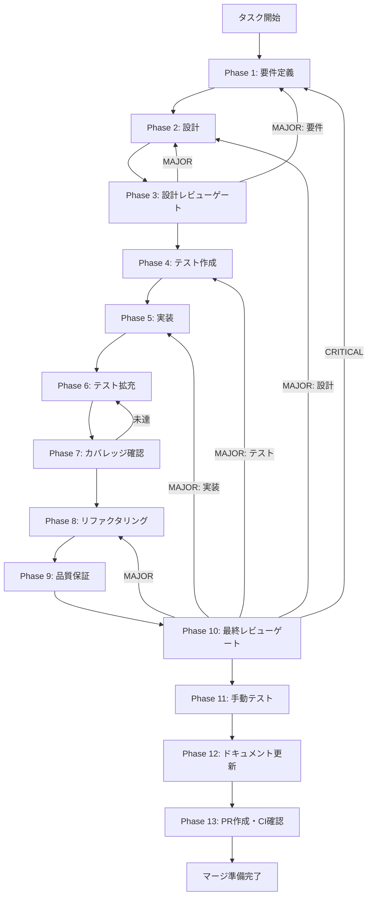

# agent-sdk-session-persistence - タスク実行仕様書

## ユーザーからの元の指示

```
セッション履歴をLocalStorageまたはElectronのストレージに永続化し、
アプリ再起動後も過去のセッションを参照・再開できるようにする。
```

## メタ情報

| 項目         | 内容                                             |
| ------------ | ------------------------------------------------ |
| タスクID     | AGENT-SDK-SESSION-001                            |
| タスク名     | agent-sdk-session-persistence                    |
| 分類         | 改善                                             |
| 対象機能     | AgentSDKPage / セッション管理                    |
| 優先度       | 中                                               |
| 見積もり規模 | 中規模                                           |
| ステータス   | Phase 12完了（PR作成待ち）                       |
| 作成日       | 2026-01-17                                       |
| 発見元       | Phase 11 - 手動テスト（postrelease-sdk-testing） |

---

## タスク概要

### 目的

AgentSDKPageにおけるセッション履歴の永続化機能を実装し、アプリケーション再起動後も過去のセッション情報を保持・復元できるようにする。これにより、ユーザーは継続的なAIアシスタント利用が可能となり、過去の会話コンテキストを参照できるようになる。

### 背景

現在のAgentSDKPageでは、セッション履歴がメモリ上にのみ保持されており、以下の問題がある：

- ページリロード時にセッション一覧が消失する
- 過去の会話コンテキストを参照できない
- 長期間のAIアシスタント利用において利便性が低い
- 競合製品と比較して機能的に劣る

### 最終ゴール

- アプリ再起動後もセッション一覧が復元される
- 過去のセッションを選択して会話を継続できる
- セッション履歴の明示的な削除が可能
- 永続化容量制限が設定可能

### 成果物一覧

| 種別         | 成果物                           | 配置先                                              |
| ------------ | -------------------------------- | --------------------------------------------------- |
| 機能         | SessionPersistenceService        | `apps/desktop/src/main/services/session/`           |
| 機能         | SessionStorage（electron-store） | `apps/desktop/src/main/services/session/`           |
| 型定義       | PersistedSession型               | `packages/shared/src/types/agent.ts`                |
| テスト       | ユニットテスト・統合テスト       | `apps/desktop/src/main/services/session/__tests__/` |
| ドキュメント | 実装ガイド                       | `outputs/phase-12/implementation-guide.md`          |
| PR           | GitHub Pull Request              | GitHub UI                                           |

---

## 参照ファイル

本仕様書のコマンド選定は以下を参照：

- `.claude/skills/aiworkflow-requirements/references/interfaces-agent-sdk.md` - Agent SDKインターフェース仕様
- `docs/30-workflows/completed-tasks/postrelease-sdk-testing/outputs/phase-12/implementation-guide.md` - 既存実装ガイド
- `apps/desktop/src/renderer/pages/AgentSDKPage/index.tsx` - 現在のAgentSDKPage実装

---

## タスク分解サマリー

| ID     | フェーズ | サブタスク名             | 責務                          | 依存 |
| ------ | -------- | ------------------------ | ----------------------------- | ---- |
| T-01-1 | Phase 1  | 永続化要件定義           | 機能要件・非機能要件の明確化  | -    |
| T-02-1 | Phase 2  | 永続化アーキテクチャ設計 | electron-store統合設計        | T-01 |
| T-03-1 | Phase 3  | 設計レビュー             | 設計妥当性の検証              | T-02 |
| T-04-1 | Phase 4  | Redテスト作成            | 永続化サービスのテスト作成    | T-03 |
| T-05-1 | Phase 5  | Green実装                | SessionPersistenceService実装 | T-04 |
| T-06-1 | Phase 6  | テスト拡充               | エッジケース・統合テスト追加  | T-05 |
| T-07-1 | Phase 7  | カバレッジ確認           | 80%+カバレッジ達成            | T-06 |
| T-08-1 | Phase 8  | リファクタリング         | コード品質改善                | T-07 |
| T-09-1 | Phase 9  | 品質保証                 | Lint/Type/Security確認        | T-08 |
| T-10-1 | Phase 10 | 最終レビュー             | 受け入れ基準チェック          | T-09 |
| T-11-1 | Phase 11 | 手動テスト               | アプリ再起動テスト            | T-10 |
| T-12-1 | Phase 12 | ドキュメント更新         | 実装ガイド・API仕様更新       | T-11 |
| T-13-1 | Phase 13 | PR作成                   | `/ai:diff-to-pr`でPR作成      | T-12 |

**総サブタスク数**: 13個

---

## 実行フロー図



---

## Phase一覧

| Phase | 名称               | 仕様書                                                 | ステータス |
| ----- | ------------------ | ------------------------------------------------------ | ---------- |
| 1     | 要件定義           | [phase-1-requirements.md](phase-1-requirements.md)     | ✅ 完了    |
| 2     | 設計               | [phase-2-design.md](phase-2-design.md)                 | ✅ 完了    |
| 3     | 設計レビューゲート | [phase-3-design-review.md](phase-3-design-review.md)   | ✅ 完了    |
| 4     | テスト作成         | [phase-4-test-creation.md](phase-4-test-creation.md)   | ✅ 完了    |
| 5     | 実装               | [phase-5-implementation.md](phase-5-implementation.md) | ✅ 完了    |
| 6     | テスト拡充         | [phase-6-test-expansion.md](phase-6-test-expansion.md) | ✅ 完了    |
| 7     | カバレッジ確認     | [phase-7-coverage-check.md](phase-7-coverage-check.md) | ✅ 完了    |
| 8     | リファクタリング   | [phase-8-refactoring.md](phase-8-refactoring.md)       | ✅ 完了    |
| 9     | 品質保証           | [phase-9-quality.md](phase-9-quality.md)               | ✅ 完了    |
| 10    | 最終レビューゲート | [phase-10-final-review.md](phase-10-final-review.md)   | ✅ 完了    |
| 11    | 手動テスト         | [phase-11-manual-test.md](phase-11-manual-test.md)     | ✅ 完了    |
| 12    | ドキュメント更新   | [phase-12-documentation.md](phase-12-documentation.md) | ✅ 完了    |
| 13    | PR作成             | [phase-13-pr-creation.md](phase-13-pr-creation.md)     | 未実施     |

---

## テストカバレッジ目標

### ユニットテスト

| 指標              | 最低基準 | 推奨基準 |
| ----------------- | -------- | -------- |
| Line Coverage     | 80%      | 90%      |
| Branch Coverage   | 60%      | 70%      |
| Function Coverage | 80%      | 90%      |

### 結合テスト

| 指標                         | 目標 |
| ---------------------------- | ---- |
| APIエンドポイント            | 100% |
| モジュール間インターフェース | 100% |
| 正常系シナリオ               | 100% |
| 異常系シナリオ               | 80%+ |
| 外部連携ポイント             | 100% |

---

## 統合テスト連携（Phase 1〜11で必須）

各Phaseで以下の統合テスト連携アクションを実施すること:

| Phase | 統合テスト連携アクション                               |
| ----- | ------------------------------------------------------ |
| 1     | electron-store接続要件を要件に明記                     |
| 2     | セッション永続化のデータフロー設計                     |
| 3     | 永続化・復元フローのレビュー                           |
| 4     | 永続化→復元の統合テストシナリオ作成                    |
| 5     | Main Process永続化サービスとRenderer Process連携の実装 |
| 6     | アプリ再起動シナリオ・容量制限シナリオのテスト追加     |
| 7     | 統合テストの再実行とゲート判定                         |
| 8     | リファクタ後の統合テスト継続成功を確認                 |
| 9     | 品質保証で統合テスト結果を確認                         |
| 10    | 最終レビューで統合テスト結果を確認                     |
| 11    | 手動統合テスト（アプリ再起動・セッション復元）を確認   |

---

## Phase完了時の必須アクション

**各Phase完了時に以下を必ず実行すること:**

1. **タスク100%実行**: Phase内で指定された全タスクを完全に実行
2. **成果物確認**: 全ての必須成果物が生成されていることを検証
3. **実行記録**: 実行タスクの結果を記録
4. **artifacts.json更新**: Phase完了ステータスを更新
5. **Phase末端の実行確認**: 各タスクを100%実行し、各タスクを完遂した旨を必ず明記

```bash
# Phase完了時の検証コマンド
node .claude/skills/task-specification-creator/scripts/validate-phase-output.js docs/30-workflows/agent-sdk-session-persistence --phase {{PHASE_NUMBER}}

# Phase完了・成果物登録
node .claude/skills/task-specification-creator/scripts/complete-phase.js \
  --workflow docs/30-workflows/agent-sdk-session-persistence --phase {{PHASE_NUMBER}} --artifacts "..."
```
