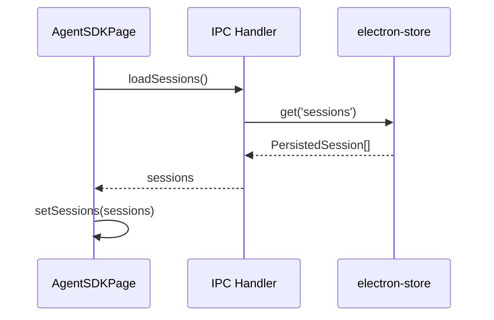
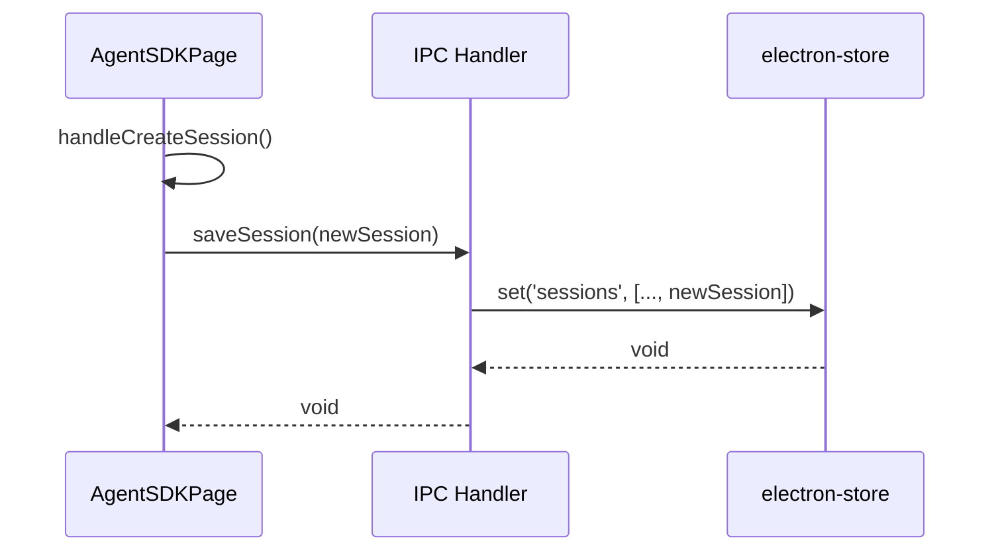
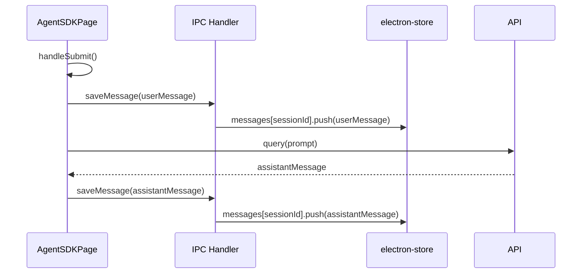

# Phase 1: 機能要件定義

## メタ情報

| 項目       | 内容                          |
| ---------- | ----------------------------- |
| 文書種別   | 機能要件定義書                |
| Phase      | 1                             |
| 作成日     | 2026-01-17                    |
| 機能名     | agent-sdk-session-persistence |
| ステータス | 完了                          |

---

## 1. 概要

AgentSDKPageにおけるセッション履歴の永続化機能を定義する。electron-storeを使用して、アプリケーション再起動後も過去のセッション情報を保持・復元できるようにする。

---

## 2. 現状分析

### 2.1 現在の実装（AgentSDKPage）

| 項目                           | 現状                                    |
| ------------------------------ | --------------------------------------- |
| セッション保存先               | メモリ（React state）                   |
| データ永続化                   | なし                                    |
| 再起動時の動作                 | 全セッションが消失                      |
| セッション管理インターフェース | `Session` 型（id, createdAt, isActive） |

### 2.2 既存の型定義

```typescript
// 現在のSession型（apps/desktop/src/renderer/pages/AgentSDKPage/index.tsx）
interface Session {
  id: string;
  createdAt: Date;
  isActive: boolean;
}

interface Message {
  id: string;
  role: "user" | "assistant";
  content: string;
  timestamp: Date;
}
```

---

## 3. 機能要件

### FR-001: セッション永続化

| 項目       | 内容                                                     |
| ---------- | -------------------------------------------------------- |
| 要件ID     | FR-001                                                   |
| 要件名     | セッション永続化                                         |
| 説明       | セッション作成時に自動的にelectron-storeに永続化する     |
| 優先度     | 必須                                                     |
| 対象データ | セッションID、作成日時、最終アクセス日時、アクティブ状態 |

**詳細:**

- 新規セッション作成時、electron-storeに自動保存
- セッション状態変更（isActive）時に更新
- セッション破棄時にストアから削除

### FR-002: セッション復元

| 項目   | 内容                                             |
| ------ | ------------------------------------------------ |
| 要件ID | FR-002                                           |
| 要件名 | セッション復元                                   |
| 説明   | アプリ起動時に保存されたセッション一覧を復元する |
| 優先度 | 必須                                             |

**詳細:**

- アプリ起動時にelectron-storeからセッション一覧を読み込み
- UIにセッション一覧を表示
- 最後にアクティブだったセッションを自動選択（オプション）

### FR-003: メッセージ履歴の永続化

| 項目       | 内容                                             |
| ---------- | ------------------------------------------------ |
| 要件ID     | FR-003                                           |
| 要件名     | メッセージ履歴永続化                             |
| 説明       | 各セッションのメッセージ履歴を永続化する         |
| 優先度     | 必須                                             |
| 対象データ | メッセージID、ロール、コンテンツ、タイムスタンプ |

**詳細:**

- ユーザーメッセージ送信時に保存
- アシスタント応答完了時に保存
- セッション選択時にメッセージ履歴を読み込み

### FR-004: セッション削除

| 項目   | 内容                                       |
| ------ | ------------------------------------------ |
| 要件ID | FR-004                                     |
| 要件名 | セッション削除                             |
| 説明   | 特定のセッションとその履歴を完全に削除する |
| 優先度 | 必須                                       |

**詳細:**

- UI上の「Destroy Session」ボタンで削除
- セッションメタデータとメッセージ履歴を同時に削除
- 削除後は他のセッションを選択、または未選択状態に

### FR-005: セッション一覧表示

| 項目   | 内容                                     |
| ------ | ---------------------------------------- |
| 要件ID | FR-005                                   |
| 要件名 | セッション一覧表示                       |
| 説明   | 永続化されたセッション一覧をUIに表示する |
| 優先度 | 必須                                     |

**詳細:**

- サイドバーにセッション一覧を表示
- セッションID（短縮表示）と作成日時を表示
- 選択中のセッションをハイライト

### FR-006: 全セッションクリア

| 項目   | 内容                                   |
| ------ | -------------------------------------- |
| 要件ID | FR-006                                 |
| 要件名 | 全セッションクリア                     |
| 説明   | 全ての保存済みセッションを一括削除する |
| 優先度 | 中                                     |

**詳細:**

- 設定画面またはUI上のボタンから実行
- 確認ダイアログを表示
- 全セッションとメッセージ履歴を削除

---

## 4. データモデル

### 4.1 PersistedSession型

```typescript
interface PersistedSession {
  id: string; // UUID
  createdAt: number; // Unix timestamp (ms)
  lastAccessedAt: number; // Unix timestamp (ms)
  isActive: boolean; // アクティブ状態
  messageCount: number; // メッセージ数（サマリー用）
  title?: string; // セッションタイトル（最初のメッセージから自動生成）
}
```

### 4.2 PersistedMessage型

```typescript
interface PersistedMessage {
  id: string; // UUID
  sessionId: string; // 所属セッションID
  role: "user" | "assistant";
  content: string;
  timestamp: number; // Unix timestamp (ms)
}
```

### 4.3 ストレージ構造

```typescript
interface SessionStorageSchema {
  sessions: PersistedSession[]; // セッション一覧
  messages: Record<string, PersistedMessage[]>; // sessionId → messages
  metadata: {
    version: string; // スキーマバージョン
    lastUpdated: number; // 最終更新日時
    totalSize: number; // 概算サイズ（bytes）
  };
}
```

---

## 5. IPC通信要件

### 5.1 新規IPCチャンネル

| チャンネル                     | 方向            | 説明               |
| ------------------------------ | --------------- | ------------------ |
| `session:persist:save`         | Renderer → Main | セッション保存     |
| `session:persist:load`         | Renderer → Main | セッション一覧取得 |
| `session:persist:delete`       | Renderer → Main | セッション削除     |
| `session:persist:loadMessages` | Renderer → Main | メッセージ履歴取得 |
| `session:persist:saveMessage`  | Renderer → Main | メッセージ保存     |
| `session:persist:clearAll`     | Renderer → Main | 全データ削除       |
| `session:persist:getStats`     | Renderer → Main | ストレージ統計取得 |

### 5.2 Preload API拡張

```typescript
interface SessionPersistenceAPI {
  saveSession: (session: PersistedSession) => Promise<void>;
  loadSessions: () => Promise<PersistedSession[]>;
  deleteSession: (sessionId: string) => Promise<void>;
  loadMessages: (sessionId: string) => Promise<PersistedMessage[]>;
  saveMessage: (message: PersistedMessage) => Promise<void>;
  clearAll: () => Promise<void>;
  getStorageStats: () => Promise<{ totalSessions: number; totalSize: number }>;
}
```

---

## 6. electron-store統合要件

### 6.1 ストア設定

```typescript
import Store from "electron-store";

const sessionStore = new Store<SessionStorageSchema>({
  name: "agent-sessions",
  defaults: {
    sessions: [],
    messages: {},
    metadata: {
      version: "1.0.0",
      lastUpdated: 0,
      totalSize: 0,
    },
  },
  schema: {
    // JSONスキーマによるバリデーション
  },
});
```

### 6.2 保存場所

- **macOS**: `~/Library/Application Support/AIWorkflowOrchestrator/agent-sessions.json`
- **Windows**: `%APPDATA%/AIWorkflowOrchestrator/agent-sessions.json`
- **Linux**: `~/.config/AIWorkflowOrchestrator/agent-sessions.json`

---

## 7. UIインタラクション

### 7.1 起動時フロー



### 7.2 セッション作成フロー



### 7.3 メッセージ送信フロー



---

## 8. エラーハンドリング

| エラー種別           | 対応                                 |
| -------------------- | ------------------------------------ |
| ストア読み込み失敗   | 空のセッション一覧で起動、エラー表示 |
| ストア書き込み失敗   | リトライ（3回）、失敗時はエラー表示  |
| 容量上限超過         | LRU削除または警告表示                |
| データ破損           | 破損セッションをスキップ、警告表示   |
| マイグレーション失敗 | フォールバックスキーマで起動         |

---

## 9. 参照仕様

| 参照資料                  | パス                                                                        |
| ------------------------- | --------------------------------------------------------------------------- |
| Agent SDKインターフェース | `.claude/skills/aiworkflow-requirements/references/interfaces-agent-sdk.md` |
| 既存AgentSDKPage実装      | `apps/desktop/src/renderer/pages/AgentSDKPage/index.tsx`                    |

---

## 10. 完了条件

- [x] 機能要件FR-001〜FR-006が定義されている
- [x] データモデル（PersistedSession, PersistedMessage）が定義されている
- [x] IPC通信要件が定義されている
- [x] electron-store統合要件が定義されている
- [x] エラーハンドリング方針が定義されている
