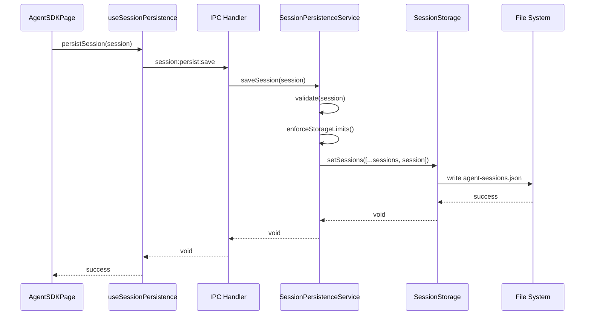
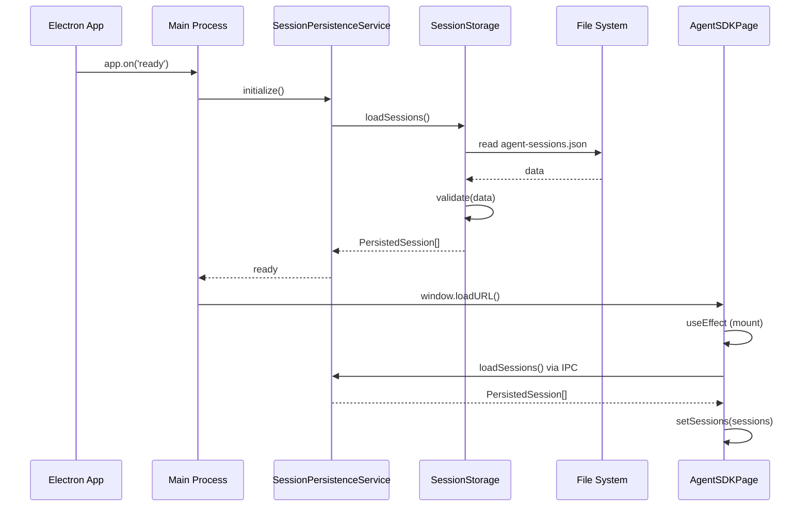
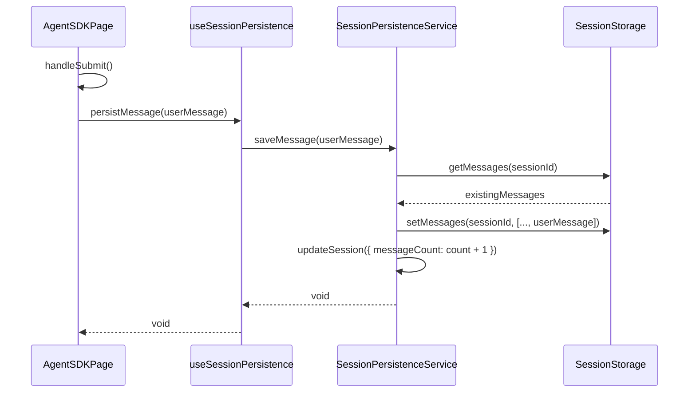

# Phase 2: アーキテクチャ設計書

## メタ情報

| 項目       | 内容                          |
| ---------- | ----------------------------- |
| 文書種別   | アーキテクチャ設計書          |
| Phase      | 2                             |
| 作成日     | 2026-01-17                    |
| 機能名     | agent-sdk-session-persistence |
| ステータス | 完了                          |

---

## 1. 概要

セッション永続化機能の全体アーキテクチャを定義する。Electronのマルチプロセスアーキテクチャに基づき、Main ProcessとRenderer Process間のIPC通信を介してデータを永続化する。

---

## 2. アーキテクチャ概要図

```
┌─────────────────────────────────────────────────────────────────────────┐
│                          Renderer Process                                │
│  ┌───────────────────────────────────────────────────────────────────┐  │
│  │                       AgentSDKPage                                 │  │
│  │  ┌─────────────────────────────────────────────────────────────┐  │  │
│  │  │                    State Management                          │  │  │
│  │  │   sessions: Session[]                                        │  │  │
│  │  │   messages: Message[]                                        │  │  │
│  │  │   currentSessionId: string | null                            │  │  │
│  │  └─────────────────────────────────────────────────────────────┘  │  │
│  │                              │                                     │  │
│  │                              ▼                                     │  │
│  │  ┌─────────────────────────────────────────────────────────────┐  │  │
│  │  │             useSessionPersistence Hook                       │  │  │
│  │  │   - loadPersistedSessions()                                  │  │  │
│  │  │   - persistSession(session)                                  │  │  │
│  │  │   - deletePersistedSession(id)                               │  │  │
│  │  │   - persistMessage(message)                                  │  │  │
│  │  │   - loadMessages(sessionId)                                  │  │  │
│  │  └─────────────────────────────────────────────────────────────┘  │  │
│  └──────────────────────────────┬────────────────────────────────────┘  │
│                                 │ window.sessionPersistenceAPI          │
└─────────────────────────────────┼───────────────────────────────────────┘
                                  │ IPC (contextBridge)
┌─────────────────────────────────┼───────────────────────────────────────┐
│                          Main Process                                    │
│  ┌──────────────────────────────┴────────────────────────────────────┐  │
│  │                   session-persistence-handler.ts                   │  │
│  │   - session:persist:load                                           │  │
│  │   - session:persist:save                                           │  │
│  │   - session:persist:delete                                         │  │
│  │   - session:persist:loadMessages                                   │  │
│  │   - session:persist:saveMessage                                    │  │
│  │   - session:persist:clearAll                                       │  │
│  │   - session:persist:getStats                                       │  │
│  └──────────────────────────────┬────────────────────────────────────┘  │
│                                 │                                        │
│  ┌──────────────────────────────┴────────────────────────────────────┐  │
│  │                   SessionPersistenceService                        │  │
│  │   - saveSessions(sessions)                                         │  │
│  │   - loadSessions(): PersistedSession[]                             │  │
│  │   - saveMessage(sessionId, message)                                │  │
│  │   - loadMessages(sessionId): PersistedMessage[]                    │  │
│  │   - deleteSession(sessionId)                                       │  │
│  │   - clearAll()                                                     │  │
│  │   - getStorageStats()                                              │  │
│  │   - enforceStorageLimits()                                         │  │
│  └──────────────────────────────┬────────────────────────────────────┘  │
│                                 │                                        │
│  ┌──────────────────────────────┴────────────────────────────────────┐  │
│  │                   SessionStorage (electron-store)                  │  │
│  │   - get(key): T                                                    │  │
│  │   - set(key, value): void                                          │  │
│  │   - delete(key): void                                              │  │
│  │   - clear(): void                                                  │  │
│  │   - store: electron-store instance                                 │  │
│  └──────────────────────────────┬────────────────────────────────────┘  │
└─────────────────────────────────┼───────────────────────────────────────┘
                                  │
┌─────────────────────────────────┴───────────────────────────────────────┐
│                          File System                                     │
│   ~/Library/Application Support/AIWorkflowOrchestrator/                 │
│     └── agent-sessions.json                                              │
└─────────────────────────────────────────────────────────────────────────┘
```

---

## 3. コンポーネント設計

### 3.1 SessionPersistenceService

**責務**: セッションとメッセージの永続化ロジックを管理

**配置先**: `apps/desktop/src/main/services/session/SessionPersistenceService.ts`

```typescript
class SessionPersistenceService {
  private storage: SessionStorage;
  private config: SessionPersistenceConfig;

  constructor(config?: Partial<SessionPersistenceConfig>);

  // セッション操作
  saveSession(session: PersistedSession): Promise<void>;
  loadSessions(): Promise<PersistedSession[]>;
  deleteSession(sessionId: string): Promise<void>;
  updateSession(
    sessionId: string,
    updates: Partial<PersistedSession>,
  ): Promise<void>;

  // メッセージ操作
  saveMessage(message: PersistedMessage): Promise<void>;
  loadMessages(sessionId: string): Promise<PersistedMessage[]>;
  deleteMessages(sessionId: string): Promise<void>;

  // ストレージ管理
  clearAll(): Promise<void>;
  getStorageStats(): Promise<StorageStats>;
  enforceStorageLimits(): Promise<CleanupResult>;

  // バックアップ
  createBackup(): Promise<string>;
  listBackups(): Promise<BackupInfo[]>;
}
```

### 3.2 SessionStorage

**責務**: electron-storeのラッパー、低レベルストレージ操作

**配置先**: `apps/desktop/src/main/services/session/SessionStorage.ts`

```typescript
class SessionStorage {
  private store: Store<SessionStorageSchema>;

  constructor();

  // 基本操作
  getSessions(): PersistedSession[];
  setSessions(sessions: PersistedSession[]): void;
  getMessages(sessionId: string): PersistedMessage[];
  setMessages(sessionId: string, messages: PersistedMessage[]): void;

  // メタデータ
  getMetadata(): StorageMetadata;
  updateMetadata(updates: Partial<StorageMetadata>): void;

  // ユーティリティ
  clear(): void;
  getFilePath(): string;
  getFileSize(): number;
}
```

### 3.3 IPC Handler

**責務**: Renderer ProcessからのIPC要求を処理

**配置先**: `apps/desktop/src/main/ipc/session-persistence-handler.ts`

```typescript
export function registerSessionPersistenceHandlers(
  service: SessionPersistenceService,
): void {
  ipcMain.handle("session:persist:load", async () => {
    return await service.loadSessions();
  });

  ipcMain.handle(
    "session:persist:save",
    async (_, session: PersistedSession) => {
      return await service.saveSession(session);
    },
  );

  // ... 他のハンドラー
}
```

### 3.4 Preload API

**責務**: Renderer Processへのセキュアなapi露出

**配置先**: `apps/desktop/src/preload/sessionPersistenceApi.ts`

```typescript
export const sessionPersistenceApi = {
  loadSessions: (): Promise<PersistedSession[]> =>
    ipcRenderer.invoke("session:persist:load"),

  saveSession: (session: PersistedSession): Promise<void> =>
    ipcRenderer.invoke("session:persist:save", session),

  deleteSession: (sessionId: string): Promise<void> =>
    ipcRenderer.invoke("session:persist:delete", sessionId),

  loadMessages: (sessionId: string): Promise<PersistedMessage[]> =>
    ipcRenderer.invoke("session:persist:loadMessages", sessionId),

  saveMessage: (message: PersistedMessage): Promise<void> =>
    ipcRenderer.invoke("session:persist:saveMessage", message),

  clearAll: (): Promise<void> => ipcRenderer.invoke("session:persist:clearAll"),

  getStorageStats: (): Promise<StorageStats> =>
    ipcRenderer.invoke("session:persist:getStats"),
};
```

### 3.5 useSessionPersistence Hook

**責務**: Renderer Processでの永続化機能への統一的なアクセス

**配置先**: `apps/desktop/src/renderer/hooks/useSessionPersistence.ts`

```typescript
export function useSessionPersistence() {
  const [isLoading, setIsLoading] = useState(false);
  const [error, setError] = useState<string | null>(null);

  const loadPersistedSessions = useCallback(async () => {
    setIsLoading(true);
    try {
      return await window.sessionPersistenceAPI.loadSessions();
    } catch (err) {
      setError(err instanceof Error ? err.message : "Failed to load sessions");
      return [];
    } finally {
      setIsLoading(false);
    }
  }, []);

  // ... 他のメソッド

  return {
    isLoading,
    error,
    loadPersistedSessions,
    persistSession,
    deletePersistedSession,
    loadMessages,
    persistMessage,
    clearAllSessions,
    getStorageStats,
  };
}
```

---

## 4. データフロー

### 4.1 セッション保存フロー



### 4.2 セッション復元フロー（起動時）



### 4.3 メッセージ保存フロー



---

## 5. コンポーネント依存関係

```
┌──────────────────┐
│   AgentSDKPage   │
└────────┬─────────┘
         │ uses
         ▼
┌──────────────────────────┐
│  useSessionPersistence   │
└────────┬─────────────────┘
         │ calls
         ▼
┌──────────────────────────┐
│  sessionPersistenceApi   │
│      (Preload)           │
└────────┬─────────────────┘
         │ IPC
         ▼
┌──────────────────────────┐
│  session-persistence-    │
│     handler.ts           │
└────────┬─────────────────┘
         │ delegates
         ▼
┌──────────────────────────┐
│ SessionPersistenceService│
└────────┬─────────────────┘
         │ uses
         ▼
┌──────────────────────────┐
│    SessionStorage        │
└────────┬─────────────────┘
         │ wraps
         ▼
┌──────────────────────────┐
│    electron-store        │
└──────────────────────────┘
```

---

## 6. ディレクトリ構成

```
apps/desktop/
├── src/
│   ├── main/
│   │   ├── services/
│   │   │   └── session/
│   │   │       ├── index.ts
│   │   │       ├── SessionPersistenceService.ts
│   │   │       ├── SessionStorage.ts
│   │   │       ├── types.ts
│   │   │       └── __tests__/
│   │   │           ├── SessionPersistenceService.test.ts
│   │   │           └── SessionStorage.test.ts
│   │   └── ipc/
│   │       └── session-persistence-handler.ts
│   ├── preload/
│   │   ├── index.ts
│   │   └── sessionPersistenceApi.ts
│   └── renderer/
│       ├── hooks/
│       │   └── useSessionPersistence.ts
│       └── pages/
│           └── AgentSDKPage/
│               └── index.tsx (modified)
packages/shared/
└── src/
    └── types/
        └── agent.ts (extended with persistence types)
```

---

## 7. 初期化シーケンス

### 7.1 Main Process 初期化

```typescript
// apps/desktop/src/main/index.ts
import { SessionPersistenceService } from "./services/session";
import { registerSessionPersistenceHandlers } from "./ipc/session-persistence-handler";

app.on("ready", async () => {
  // 1. サービス初期化
  const sessionPersistenceService = new SessionPersistenceService({
    maxSessions: 100,
    maxStorageSize: 50 * 1024 * 1024, // 50MB
  });

  // 2. バックアップ作成（起動時）
  await sessionPersistenceService.createBackup();

  // 3. ストレージ制限の適用
  await sessionPersistenceService.enforceStorageLimits();

  // 4. IPCハンドラー登録
  registerSessionPersistenceHandlers(sessionPersistenceService);

  // 5. ウィンドウ作成
  createWindow();
});
```

### 7.2 Renderer Process 初期化

```typescript
// apps/desktop/src/renderer/pages/AgentSDKPage/index.tsx
useEffect(() => {
  const initializeSessions = async () => {
    try {
      // 永続化されたセッションを読み込み
      const persistedSessions =
        await window.sessionPersistenceAPI.loadSessions();

      // Reactステートに反映
      setSessions(
        persistedSessions.map((ps) => ({
          id: ps.id,
          createdAt: new Date(ps.createdAt),
          isActive: false,
        })),
      );

      // 最後にアクティブだったセッションを復元（オプション）
      const lastActive = persistedSessions.find((s) => s.isActive);
      if (lastActive) {
        setCurrentSessionId(lastActive.id);
        const messages = await window.sessionPersistenceAPI.loadMessages(
          lastActive.id,
        );
        setMessages(
          messages.map((m) => ({
            id: m.id,
            role: m.role,
            content: m.content,
            timestamp: new Date(m.timestamp),
          })),
        );
      }
    } catch (error) {
      console.error("Failed to load persisted sessions:", error);
      setError("セッションの復元に失敗しました");
    }
  };

  initializeSessions();
}, []);
```

---

## 8. エラーハンドリング戦略

| エラー種別     | 対応レイヤー              | 対応方法                 |
| -------------- | ------------------------- | ------------------------ |
| IPC通信エラー  | IPC Handler               | エラーレスポンス返却     |
| バリデーション | SessionPersistenceService | 具体的なエラーメッセージ |
| ストレージ書込 | SessionStorage            | リトライ（3回）+ エラー  |
| ファイル破損   | SessionStorage            | バックアップから復元     |
| 容量超過       | SessionPersistenceService | LRU削除                  |

---

## 9. 完了条件

- [x] 全体アーキテクチャ図が作成されている
- [x] コンポーネント設計が完了している
- [x] データフローが設計されている
- [x] 依存関係が整理されている
- [x] ディレクトリ構成が決定されている
- [x] 初期化シーケンスが設計されている
- [x] エラーハンドリング戦略が定義されている
