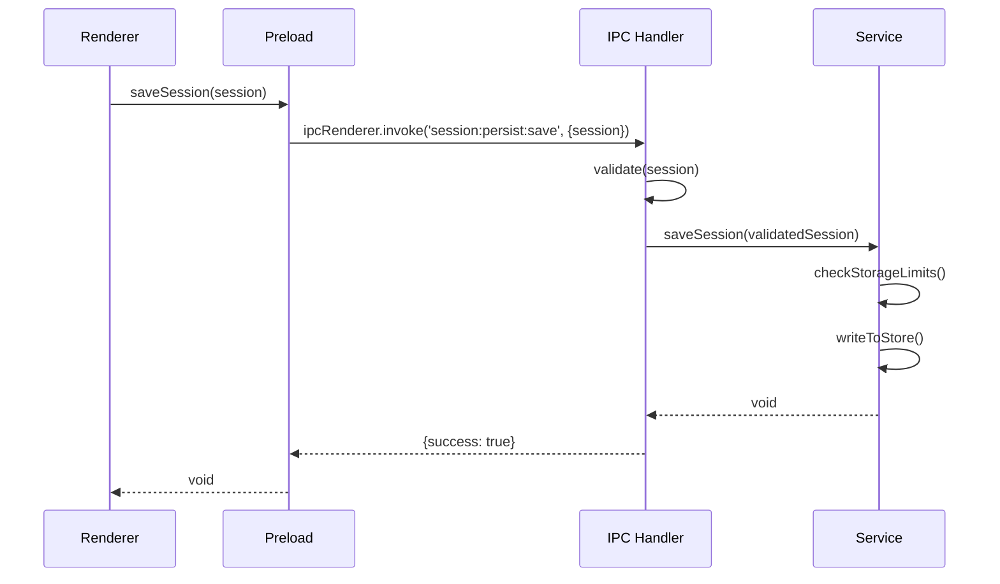
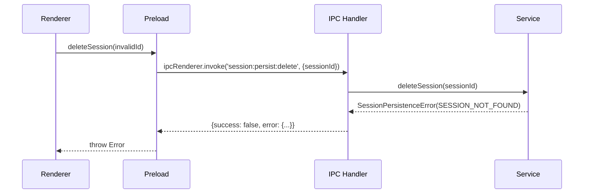

# Phase 2: IPC設計書

## メタ情報

| 項目       | 内容                          |
| ---------- | ----------------------------- |
| 文書種別   | IPC設計書                     |
| Phase      | 2                             |
| 作成日     | 2026-01-17                    |
| 機能名     | agent-sdk-session-persistence |
| ステータス | 完了                          |

---

## 1. 概要

Renderer ProcessとMain Process間のセッション永続化IPCチャンネルを設計する。

---

## 2. IPCチャンネル一覧

| チャンネル                     | 方向            | 説明               | リクエスト型            | レスポンス型         |
| ------------------------------ | --------------- | ------------------ | ----------------------- | -------------------- |
| `session:persist:load`         | Renderer → Main | セッション一覧取得 | `void`                  | `PersistedSession[]` |
| `session:persist:save`         | Renderer → Main | セッション保存     | `PersistedSession`      | `void`               |
| `session:persist:delete`       | Renderer → Main | セッション削除     | `{ sessionId: string }` | `void`               |
| `session:persist:update`       | Renderer → Main | セッション更新     | `SessionUpdateRequest`  | `void`               |
| `session:persist:loadMessages` | Renderer → Main | メッセージ取得     | `{ sessionId: string }` | `PersistedMessage[]` |
| `session:persist:saveMessage`  | Renderer → Main | メッセージ保存     | `PersistedMessage`      | `void`               |
| `session:persist:clearAll`     | Renderer → Main | 全データ削除       | `void`                  | `void`               |
| `session:persist:getStats`     | Renderer → Main | 統計情報取得       | `void`                  | `StorageStats`       |
| `session:persist:cleanup`      | Renderer → Main | LRU削除実行        | `void`                  | `CleanupResult`      |
| `session:persist:export`       | Renderer → Main | エクスポート       | `{ sessionId: string }` | `ExportedSession`    |

---

## 3. リクエスト/レスポンス型定義

### 3.1 セッション操作

#### session:persist:load

```typescript
// リクエスト
// なし

// レスポンス
type LoadSessionsResponse = PersistedSession[];
```

#### session:persist:save

```typescript
// リクエスト
interface SaveSessionRequest {
  session: PersistedSession;
}

// レスポンス
// void (成功時は例外なし)
```

#### session:persist:delete

```typescript
// リクエスト
interface DeleteSessionRequest {
  sessionId: string;
}

// レスポンス
// void
```

#### session:persist:update

```typescript
// リクエスト
interface SessionUpdateRequest {
  sessionId: string;
  updates: Partial<Omit<PersistedSession, "id" | "createdAt">>;
}

// レスポンス
// void
```

### 3.2 メッセージ操作

#### session:persist:loadMessages

```typescript
// リクエスト
interface LoadMessagesRequest {
  sessionId: string;
  options?: {
    limit?: number; // デフォルト: 全件
    offset?: number; // デフォルト: 0
  };
}

// レスポンス
type LoadMessagesResponse = PersistedMessage[];
```

#### session:persist:saveMessage

```typescript
// リクエスト
interface SaveMessageRequest {
  message: PersistedMessage;
}

// レスポンス
// void
```

### 3.3 ストレージ管理

#### session:persist:clearAll

```typescript
// リクエスト
interface ClearAllRequest {
  confirm: boolean; // trueでないと実行されない
}

// レスポンス
// void
```

#### session:persist:getStats

```typescript
// リクエスト
// なし

// レスポンス
interface StorageStats {
  totalSessions: number;
  totalMessages: number;
  usedSize: number;
  maxSize: number;
  usageRatio: number;
  lastUpdated: number;
}
```

#### session:persist:cleanup

```typescript
// リクエスト
interface CleanupRequest {
  targetUsageRatio?: number; // 目標使用率（デフォルト: 0.8）
}

// レスポンス
interface CleanupResult {
  deletedSessions: number;
  deletedMessages: number;
  freedSize: number;
  deletedSessionIds: string[];
}
```

---

## 4. エラーハンドリング

### 4.1 IPCエラー型

```typescript
interface IPCErrorResponse {
  success: false;
  error: {
    code: SessionPersistenceErrorCode;
    message: string;
    details?: unknown;
  };
}

interface IPCSuccessResponse<T> {
  success: true;
  data: T;
}

type IPCResponse<T> = IPCSuccessResponse<T> | IPCErrorResponse;
```

### 4.2 エラーコード

| コード                   | HTTP相当 | 説明                         |
| ------------------------ | -------- | ---------------------------- |
| `VALIDATION_ERROR`       | 400      | リクエストバリデーション失敗 |
| `SESSION_NOT_FOUND`      | 404      | セッションが存在しない       |
| `STORAGE_READ_ERROR`     | 500      | ストレージ読み込み失敗       |
| `STORAGE_WRITE_ERROR`    | 500      | ストレージ書き込み失敗       |
| `STORAGE_LIMIT_EXCEEDED` | 507      | ストレージ容量超過           |
| `INTERNAL_ERROR`         | 500      | 内部エラー                   |

### 4.3 エラーハンドリング実装

```typescript
// Main Process側
ipcMain.handle(
  "session:persist:save",
  async (_, request: SaveSessionRequest): Promise<IPCResponse<void>> => {
    try {
      // バリデーション
      const validated = persistedSessionSchema.safeParse(request.session);
      if (!validated.success) {
        return {
          success: false,
          error: {
            code: "VALIDATION_ERROR",
            message: "Invalid session data",
            details: validated.error.flatten(),
          },
        };
      }

      // 保存処理
      await sessionPersistenceService.saveSession(validated.data);
      return { success: true, data: undefined };
    } catch (error) {
      if (error instanceof SessionPersistenceError) {
        return {
          success: false,
          error: {
            code: error.code,
            message: error.message,
          },
        };
      }
      return {
        success: false,
        error: {
          code: "INTERNAL_ERROR",
          message: "Unexpected error occurred",
        },
      };
    }
  },
);
```

```typescript
// Renderer Process側
export const sessionPersistenceApi = {
  async saveSession(session: PersistedSession): Promise<void> {
    const response = await ipcRenderer.invoke("session:persist:save", {
      session,
    });
    if (!response.success) {
      throw new SessionPersistenceError(
        response.error.message,
        response.error.code,
      );
    }
  },
};
```

---

## 5. Preload API定義

### 5.1 sessionPersistenceApi

```typescript
// apps/desktop/src/preload/sessionPersistenceApi.ts

export interface SessionPersistenceAPI {
  // セッション操作
  loadSessions(): Promise<PersistedSession[]>;
  saveSession(session: PersistedSession): Promise<void>;
  deleteSession(sessionId: string): Promise<void>;
  updateSession(
    sessionId: string,
    updates: Partial<PersistedSession>,
  ): Promise<void>;

  // メッセージ操作
  loadMessages(
    sessionId: string,
    options?: { limit?: number; offset?: number },
  ): Promise<PersistedMessage[]>;
  saveMessage(message: PersistedMessage): Promise<void>;

  // ストレージ管理
  clearAll(confirm: boolean): Promise<void>;
  getStorageStats(): Promise<StorageStats>;
  runCleanup(targetUsageRatio?: number): Promise<CleanupResult>;
}

export const sessionPersistenceApi: SessionPersistenceAPI = {
  loadSessions: async () => {
    const response = await ipcRenderer.invoke("session:persist:load");
    if (!response.success) throw new Error(response.error.message);
    return response.data;
  },

  saveSession: async (session) => {
    const response = await ipcRenderer.invoke("session:persist:save", {
      session,
    });
    if (!response.success) throw new Error(response.error.message);
  },

  deleteSession: async (sessionId) => {
    const response = await ipcRenderer.invoke("session:persist:delete", {
      sessionId,
    });
    if (!response.success) throw new Error(response.error.message);
  },

  updateSession: async (sessionId, updates) => {
    const response = await ipcRenderer.invoke("session:persist:update", {
      sessionId,
      updates,
    });
    if (!response.success) throw new Error(response.error.message);
  },

  loadMessages: async (sessionId, options) => {
    const response = await ipcRenderer.invoke("session:persist:loadMessages", {
      sessionId,
      options,
    });
    if (!response.success) throw new Error(response.error.message);
    return response.data;
  },

  saveMessage: async (message) => {
    const response = await ipcRenderer.invoke("session:persist:saveMessage", {
      message,
    });
    if (!response.success) throw new Error(response.error.message);
  },

  clearAll: async (confirm) => {
    const response = await ipcRenderer.invoke("session:persist:clearAll", {
      confirm,
    });
    if (!response.success) throw new Error(response.error.message);
  },

  getStorageStats: async () => {
    const response = await ipcRenderer.invoke("session:persist:getStats");
    if (!response.success) throw new Error(response.error.message);
    return response.data;
  },

  runCleanup: async (targetUsageRatio) => {
    const response = await ipcRenderer.invoke("session:persist:cleanup", {
      targetUsageRatio,
    });
    if (!response.success) throw new Error(response.error.message);
    return response.data;
  },
};
```

### 5.2 contextBridge登録

```typescript
// apps/desktop/src/preload/index.ts

import { contextBridge } from "electron";
import { sessionPersistenceApi } from "./sessionPersistenceApi";

contextBridge.exposeInMainWorld("sessionPersistenceAPI", sessionPersistenceApi);

// 型宣言
declare global {
  interface Window {
    sessionPersistenceAPI: SessionPersistenceAPI;
  }
}
```

---

## 6. IPC Handler実装

```typescript
// apps/desktop/src/main/ipc/session-persistence-handler.ts

import { ipcMain } from "electron";
import { SessionPersistenceService } from "../services/session";
import {
  persistedSessionSchema,
  persistedMessageSchema,
} from "@repo/shared/agent/validation";

export function registerSessionPersistenceHandlers(
  service: SessionPersistenceService,
): void {
  // セッション一覧取得
  ipcMain.handle("session:persist:load", async () => {
    try {
      const sessions = await service.loadSessions();
      return { success: true, data: sessions };
    } catch (error) {
      return handleError(error);
    }
  });

  // セッション保存
  ipcMain.handle("session:persist:save", async (_, { session }) => {
    try {
      const validated = persistedSessionSchema.parse(session);
      await service.saveSession(validated);
      return { success: true, data: undefined };
    } catch (error) {
      return handleError(error);
    }
  });

  // セッション削除
  ipcMain.handle("session:persist:delete", async (_, { sessionId }) => {
    try {
      await service.deleteSession(sessionId);
      return { success: true, data: undefined };
    } catch (error) {
      return handleError(error);
    }
  });

  // セッション更新
  ipcMain.handle(
    "session:persist:update",
    async (_, { sessionId, updates }) => {
      try {
        await service.updateSession(sessionId, updates);
        return { success: true, data: undefined };
      } catch (error) {
        return handleError(error);
      }
    },
  );

  // メッセージ読み込み
  ipcMain.handle(
    "session:persist:loadMessages",
    async (_, { sessionId, options }) => {
      try {
        const messages = await service.loadMessages(sessionId, options);
        return { success: true, data: messages };
      } catch (error) {
        return handleError(error);
      }
    },
  );

  // メッセージ保存
  ipcMain.handle("session:persist:saveMessage", async (_, { message }) => {
    try {
      const validated = persistedMessageSchema.parse(message);
      await service.saveMessage(validated);
      return { success: true, data: undefined };
    } catch (error) {
      return handleError(error);
    }
  });

  // 全クリア
  ipcMain.handle("session:persist:clearAll", async (_, { confirm }) => {
    try {
      if (!confirm) {
        return {
          success: false,
          error: {
            code: "VALIDATION_ERROR",
            message: "Confirmation required",
          },
        };
      }
      await service.clearAll();
      return { success: true, data: undefined };
    } catch (error) {
      return handleError(error);
    }
  });

  // 統計取得
  ipcMain.handle("session:persist:getStats", async () => {
    try {
      const stats = await service.getStorageStats();
      return { success: true, data: stats };
    } catch (error) {
      return handleError(error);
    }
  });

  // クリーンアップ
  ipcMain.handle("session:persist:cleanup", async (_, { targetUsageRatio }) => {
    try {
      const result = await service.enforceStorageLimits(targetUsageRatio);
      return { success: true, data: result };
    } catch (error) {
      return handleError(error);
    }
  });
}

function handleError(error: unknown): IPCErrorResponse {
  if (error instanceof SessionPersistenceError) {
    return {
      success: false,
      error: {
        code: error.code,
        message: error.message,
      },
    };
  }
  if (error instanceof z.ZodError) {
    return {
      success: false,
      error: {
        code: "VALIDATION_ERROR",
        message: "Validation failed",
        details: error.flatten(),
      },
    };
  }
  console.error("Unexpected error in session persistence handler:", error);
  return {
    success: false,
    error: {
      code: "INTERNAL_ERROR",
      message: "An unexpected error occurred",
    },
  };
}
```

---

## 7. シーケンス図

### 7.1 セッション保存



### 7.2 エラー発生時



---

## 8. 完了条件

- [x] 全IPCチャンネルが定義されている
- [x] リクエスト/レスポンス型が定義されている
- [x] エラーハンドリング方針が設計されている
- [x] Preload API定義が完了している
- [x] IPC Handler実装パターンが設計されている
- [x] シーケンス図が作成されている
