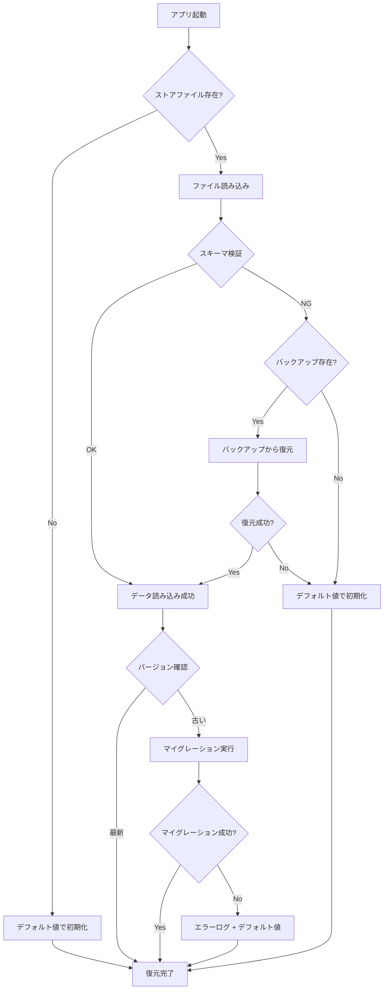

# Phase 2: 永続化設計書

## メタ情報

| 項目       | 内容                          |
| ---------- | ----------------------------- |
| 文書種別   | 永続化設計書                  |
| Phase      | 2                             |
| 作成日     | 2026-01-17                    |
| 機能名     | agent-sdk-session-persistence |
| ステータス | 完了                          |

---

## 1. 概要

electron-storeを使用したセッションデータの永続化の詳細設計を定義する。

---

## 2. electron-store設定

### 2.1 ストア初期化

```typescript
// apps/desktop/src/main/services/session/SessionStorage.ts

import Store from "electron-store";
import { SessionStorageSchema } from "@repo/shared/types/agent";

const SCHEMA_VERSION = "1.0.0";

export class SessionStorage {
  private store: Store<SessionStorageSchema>;

  constructor() {
    this.store = new Store<SessionStorageSchema>({
      name: "agent-sessions",
      defaults: {
        sessions: [],
        messages: {},
        metadata: {
          version: SCHEMA_VERSION,
          lastUpdated: Date.now(),
          totalSize: 0,
        },
      },
      schema: this.getJsonSchema(),
      clearInvalidConfig: false, // 破損時は手動で対応
      migrations: {
        // 将来のマイグレーション用
      },
    });
  }

  private getJsonSchema() {
    return {
      sessions: {
        type: "array",
        items: {
          type: "object",
          properties: {
            id: { type: "string", format: "uuid" },
            createdAt: { type: "number" },
            lastAccessedAt: { type: "number" },
            isActive: { type: "boolean" },
            messageCount: { type: "number" },
            title: { type: "string" },
          },
          required: [
            "id",
            "createdAt",
            "lastAccessedAt",
            "isActive",
            "messageCount",
          ],
        },
      },
      messages: {
        type: "object",
        additionalProperties: {
          type: "array",
          items: {
            type: "object",
            properties: {
              id: { type: "string", format: "uuid" },
              sessionId: { type: "string", format: "uuid" },
              role: { type: "string", enum: ["user", "assistant"] },
              content: { type: "string" },
              timestamp: { type: "number" },
            },
            required: ["id", "sessionId", "role", "content", "timestamp"],
          },
        },
      },
      metadata: {
        type: "object",
        properties: {
          version: { type: "string" },
          lastUpdated: { type: "number" },
          totalSize: { type: "number" },
        },
        required: ["version", "lastUpdated", "totalSize"],
      },
    };
  }
}
```

### 2.2 保存場所

| プラットフォーム | パス                                                                       |
| ---------------- | -------------------------------------------------------------------------- |
| macOS            | `~/Library/Application Support/AIWorkflowOrchestrator/agent-sessions.json` |
| Windows          | `%APPDATA%/AIWorkflowOrchestrator/agent-sessions.json`                     |
| Linux            | `~/.config/AIWorkflowOrchestrator/agent-sessions.json`                     |

---

## 3. データ構造

### 3.1 ストレージ構造

```json
{
  "sessions": [
    {
      "id": "550e8400-e29b-41d4-a716-446655440000",
      "createdAt": 1705500000000,
      "lastAccessedAt": 1705500300000,
      "isActive": true,
      "messageCount": 5,
      "title": "TypeScriptの質問"
    }
  ],
  "messages": {
    "550e8400-e29b-41d4-a716-446655440000": [
      {
        "id": "msg-001",
        "sessionId": "550e8400-e29b-41d4-a716-446655440000",
        "role": "user",
        "content": "TypeScriptの型推論について教えてください",
        "timestamp": 1705500000000
      },
      {
        "id": "msg-002",
        "sessionId": "550e8400-e29b-41d4-a716-446655440000",
        "role": "assistant",
        "content": "TypeScriptの型推論は...",
        "timestamp": 1705500060000
      }
    ]
  },
  "metadata": {
    "version": "1.0.0",
    "lastUpdated": 1705500300000,
    "totalSize": 2048
  }
}
```

### 3.2 サイズ推定

| データ種別       | 平均サイズ | 最大数  | 最大合計サイズ |
| ---------------- | ---------- | ------- | -------------- |
| セッションメタ   | ~200 bytes | 100     | ~20 KB         |
| メッセージ       | ~2 KB      | 100,000 | ~200 MB        |
| メタデータ       | ~100 bytes | 1       | ~100 bytes     |
| **合計（上限）** | -          | -       | **50 MB**      |

---

## 4. LRU削除ポリシー

### 4.1 削除アルゴリズム

```typescript
class SessionPersistenceService {
  async enforceStorageLimits(
    targetUsageRatio: number = 0.8,
  ): Promise<CleanupResult> {
    const stats = await this.getStorageStats();
    const config = this.config;

    // 容量が上限の90%未満なら何もしない
    if (stats.usageRatio < config.lruWarningThreshold) {
      return {
        deletedSessions: 0,
        deletedMessages: 0,
        freedSize: 0,
        deletedSessionIds: [],
      };
    }

    const sessions = await this.loadSessions();

    // lastAccessedAtでソート（古い順）
    const sortedSessions = [...sessions].sort(
      (a, b) => a.lastAccessedAt - b.lastAccessedAt,
    );

    const deletedSessionIds: string[] = [];
    let freedSize = 0;
    let currentUsage = stats.usedSize;
    const targetSize = config.maxStorageSize * targetUsageRatio;

    // 目標サイズまで削除
    for (const session of sortedSessions) {
      if (currentUsage <= targetSize) break;

      // セッションのサイズを推定
      const messages = await this.loadMessages(session.id);
      const sessionSize = this.estimateSize(session, messages);

      // 削除
      await this.deleteSession(session.id);
      deletedSessionIds.push(session.id);
      freedSize += sessionSize;
      currentUsage -= sessionSize;
    }

    return {
      deletedSessions: deletedSessionIds.length,
      deletedMessages: 0, // 削除されたセッションに含まれる
      freedSize,
      deletedSessionIds,
    };
  }

  private estimateSize(
    session: PersistedSession,
    messages: PersistedMessage[],
  ): number {
    // JSONシリアライズ後のサイズを推定
    const sessionSize = JSON.stringify(session).length;
    const messagesSize = JSON.stringify(messages).length;
    return sessionSize + messagesSize;
  }
}
```

### 4.2 削除トリガー

| トリガー       | 条件           | アクション       |
| -------------- | -------------- | ---------------- |
| 保存時チェック | 使用率 >= 90%  | 警告ログ出力     |
| 保存時チェック | 使用率 >= 100% | LRU削除実行      |
| 手動実行       | API呼び出し    | 指定比率まで削除 |
| 起動時チェック | 使用率 >= 90%  | LRU削除実行      |

---

## 5. 起動時復元フロー

### 5.1 フローチャート



### 5.2 実装

```typescript
class SessionStorage {
  async initialize(): Promise<InitializeResult> {
    const result: InitializeResult = {
      success: false,
      migratedFrom: null,
      recoveredFromBackup: false,
      errors: [],
    };

    try {
      // 1. ファイル存在確認
      const filePath = this.store.path;
      if (!fs.existsSync(filePath)) {
        // 新規作成
        this.store.clear();
        result.success = true;
        return result;
      }

      // 2. データ読み込み
      const data = this.store.store;

      // 3. スキーマ検証
      const validated = sessionStorageSchemaSchema.safeParse(data);
      if (!validated.success) {
        // バックアップから復元を試みる
        const recovered = await this.recoverFromBackup();
        if (recovered) {
          result.success = true;
          result.recoveredFromBackup = true;
          return result;
        }
        // 復元失敗、デフォルト値で初期化
        this.store.clear();
        result.errors.push("Schema validation failed, reset to defaults");
        result.success = true;
        return result;
      }

      // 4. バージョン確認 & マイグレーション
      const currentVersion = data.metadata.version;
      if (currentVersion !== SCHEMA_VERSION) {
        await this.migrate(currentVersion, SCHEMA_VERSION);
        result.migratedFrom = currentVersion;
      }

      result.success = true;
      return result;
    } catch (error) {
      result.errors.push(
        error instanceof Error ? error.message : String(error),
      );
      this.store.clear();
      result.success = true; // デフォルト値で動作可能
      return result;
    }
  }
}
```

---

## 6. バックアップ機構

### 6.1 バックアップ設定

```typescript
interface BackupConfig {
  /** バックアップ保持数 */
  retentionCount: number;

  /** バックアップディレクトリ */
  backupDir: string;

  /** バックアップファイル名フォーマット */
  fileNameFormat: string; // e.g., "agent-sessions-backup-{timestamp}.json"
}

const DEFAULT_BACKUP_CONFIG: BackupConfig = {
  retentionCount: 3,
  backupDir: "backups",
  fileNameFormat: "agent-sessions-backup-{timestamp}.json",
};
```

### 6.2 バックアップ実装

```typescript
class SessionPersistenceService {
  async createBackup(): Promise<string> {
    const timestamp = Date.now();
    const fileName = this.config.backupFileNameFormat.replace(
      "{timestamp}",
      String(timestamp),
    );
    const backupPath = path.join(this.getBackupDir(), fileName);

    // 現在のデータをコピー
    const data = this.storage.getAll();
    await fs.promises.writeFile(backupPath, JSON.stringify(data, null, 2));

    // 古いバックアップを削除
    await this.cleanOldBackups();

    return backupPath;
  }

  async listBackups(): Promise<BackupInfo[]> {
    const backupDir = this.getBackupDir();
    const files = await fs.promises.readdir(backupDir);

    const backups: BackupInfo[] = [];
    for (const file of files) {
      if (!file.startsWith("agent-sessions-backup-")) continue;

      const filePath = path.join(backupDir, file);
      const stat = await fs.promises.stat(filePath);

      backups.push({
        filename: file,
        createdAt: stat.mtimeMs,
        size: stat.size,
        path: filePath,
      });
    }

    return backups.sort((a, b) => b.createdAt - a.createdAt);
  }

  private async cleanOldBackups(): Promise<void> {
    const backups = await this.listBackups();
    const toDelete = backups.slice(this.config.backupRetentionCount);

    for (const backup of toDelete) {
      await fs.promises.unlink(backup.path);
    }
  }

  private async recoverFromBackup(): Promise<boolean> {
    const backups = await this.listBackups();
    if (backups.length === 0) return false;

    // 最新のバックアップから復元を試みる
    for (const backup of backups) {
      try {
        const data = await fs.promises.readFile(backup.path, "utf-8");
        const parsed = JSON.parse(data);
        const validated = sessionStorageSchemaSchema.parse(parsed);

        // バリデーション成功、復元
        this.storage.setAll(validated);
        console.log(`Recovered from backup: ${backup.filename}`);
        return true;
      } catch {
        console.warn(`Failed to recover from backup: ${backup.filename}`);
        continue;
      }
    }

    return false;
  }
}
```

---

## 7. マイグレーション

### 7.1 マイグレーション戦略

```typescript
type MigrationFunction = (data: unknown) => unknown;

const migrations: Record<string, MigrationFunction> = {
  "1.0.0_to_1.1.0": (data) => {
    // 例: 新フィールド追加
    const typedData = data as SessionStorageSchema;
    return {
      ...typedData,
      sessions: typedData.sessions.map((s) => ({
        ...s,
        newField: "default",
      })),
      metadata: {
        ...typedData.metadata,
        version: "1.1.0",
      },
    };
  },
};

class SessionStorage {
  async migrate(fromVersion: string, toVersion: string): Promise<void> {
    let currentVersion = fromVersion;
    let data = this.store.store;

    while (currentVersion !== toVersion) {
      const migrationKey = `${currentVersion}_to_${this.getNextVersion(currentVersion)}`;
      const migration = migrations[migrationKey];

      if (!migration) {
        throw new SessionPersistenceError(
          `No migration path from ${currentVersion} to ${toVersion}`,
          "MIGRATION_ERROR",
        );
      }

      data = migration(data) as SessionStorageSchema;
      currentVersion = data.metadata.version;
    }

    this.store.store = data;
  }

  private getNextVersion(current: string): string {
    // semverのマイナーバージョンをインクリメント
    const [major, minor, patch] = current.split(".").map(Number);
    return `${major}.${minor + 1}.${patch}`;
  }
}
```

---

## 8. パフォーマンス最適化

### 8.1 バッファリング

```typescript
class SessionPersistenceService {
  private writeBuffer: Map<string, unknown> = new Map();
  private flushTimeout: NodeJS.Timeout | null = null;
  private readonly FLUSH_INTERVAL = 100; // 100ms

  async saveSession(session: PersistedSession): Promise<void> {
    this.writeBuffer.set(`session:${session.id}`, session);
    this.scheduleFlush();
  }

  async saveMessage(message: PersistedMessage): Promise<void> {
    this.writeBuffer.set(`message:${message.id}`, message);
    this.scheduleFlush();
  }

  private scheduleFlush(): void {
    if (this.flushTimeout) return;

    this.flushTimeout = setTimeout(async () => {
      await this.flush();
      this.flushTimeout = null;
    }, this.FLUSH_INTERVAL);
  }

  private async flush(): Promise<void> {
    if (this.writeBuffer.size === 0) return;

    const sessions = await this.storage.getSessions();
    const messages = await this.storage.getAllMessages();

    for (const [key, value] of this.writeBuffer) {
      if (key.startsWith("session:")) {
        const session = value as PersistedSession;
        const index = sessions.findIndex((s) => s.id === session.id);
        if (index >= 0) {
          sessions[index] = session;
        } else {
          sessions.push(session);
        }
      } else if (key.startsWith("message:")) {
        const message = value as PersistedMessage;
        if (!messages[message.sessionId]) {
          messages[message.sessionId] = [];
        }
        messages[message.sessionId].push(message);
      }
    }

    this.storage.setSessions(sessions);
    for (const [sessionId, msgs] of Object.entries(messages)) {
      this.storage.setMessages(sessionId, msgs);
    }

    this.storage.updateMetadata({ lastUpdated: Date.now() });
    this.writeBuffer.clear();
  }
}
```

### 8.2 遅延読み込み

```typescript
class SessionPersistenceService {
  private messagesCache: Map<string, PersistedMessage[]> = new Map();

  async loadMessages(sessionId: string): Promise<PersistedMessage[]> {
    // キャッシュ確認
    if (this.messagesCache.has(sessionId)) {
      return this.messagesCache.get(sessionId)!;
    }

    // ストレージから読み込み
    const messages = this.storage.getMessages(sessionId);

    // キャッシュに保存
    this.messagesCache.set(sessionId, messages);

    return messages;
  }

  invalidateCache(sessionId?: string): void {
    if (sessionId) {
      this.messagesCache.delete(sessionId);
    } else {
      this.messagesCache.clear();
    }
  }
}
```

---

## 9. 完了条件

- [x] electron-store設定が設計されている
- [x] データ構造が設計されている
- [x] LRU削除ポリシーが設計されている
- [x] 起動時復元フローが設計されている
- [x] バックアップ機構が設計されている
- [x] マイグレーション戦略が設計されている
- [x] パフォーマンス最適化が設計されている
