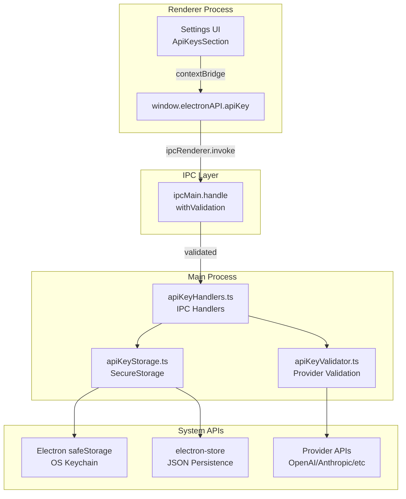
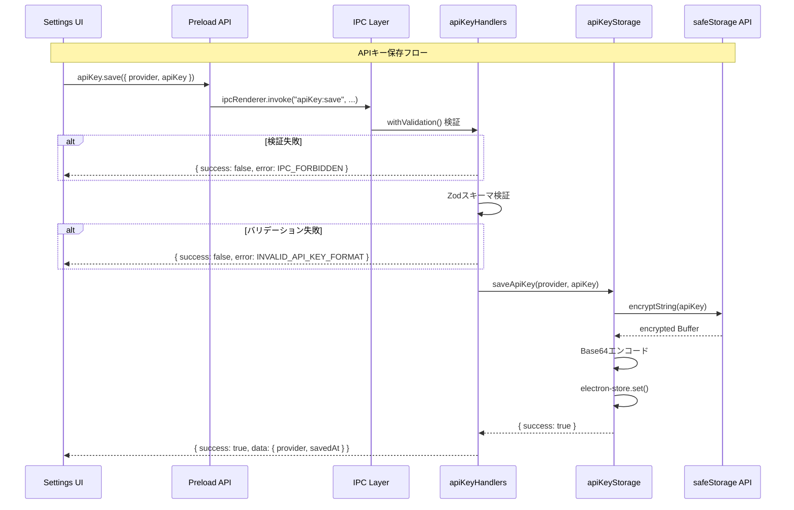
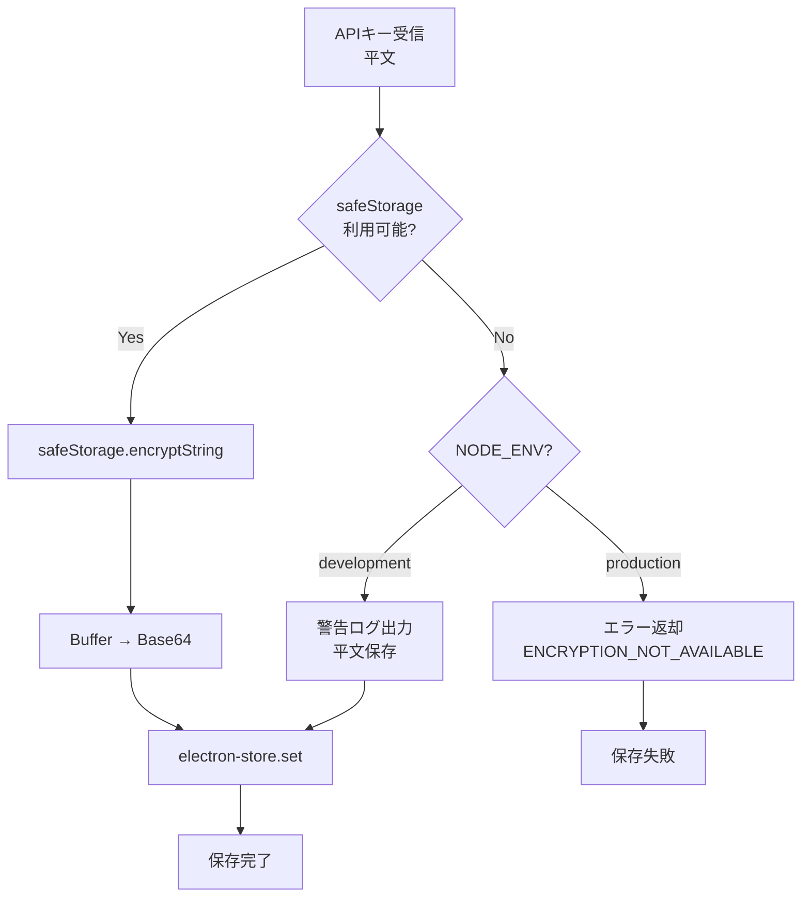
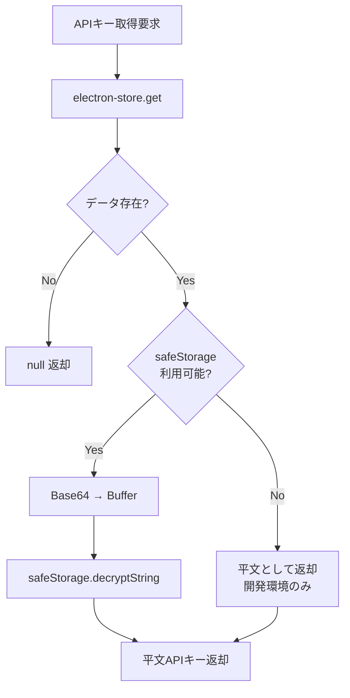

# APIプロバイダーAPIキー管理 - アーキテクチャ設計書

> **ドキュメント種別**: アーキテクチャ設計書
> **対象タスク**: T-01-2: ストレージ設計
> **作成日**: 2025-12-10
> **ステータス**: ドラフト
> **参照**:
>
> - `docs/30-workflows/api-key-management/data-model.md`
> - `docs/30-workflows/api-key-management/security-requirements.md`
> - `apps/desktop/src/main/infrastructure/secureStorage.ts`（既存パターン参照）

---

## 1. 設計概要

### 1.1 目的

Electron Main Process と Renderer Process 間のセキュアな IPC 通信を設計し、safeStorage API を活用した APIキー の暗号化保存アーキテクチャを定義する。

### 1.2 設計原則

| 原則               | 適用方法                                           |
| ------------------ | -------------------------------------------------- |
| 既存パターン踏襲   | `secureStorage.ts`, `authHandlers.ts` の構造を踏襲 |
| Main Process 限定  | 暗号化/復号化処理は Main Process でのみ実行        |
| IPC sender 検証    | `withValidation()` ラッパーによる呼び出し元検証    |
| 最小公開 API       | Renderer 側には save/delete/list/validate のみ公開 |
| エラーの安全な処理 | APIキー値をエラーメッセージに含めない              |

### 1.3 ファイル配置

```
apps/desktop/src/
├── main/
│   ├── infrastructure/
│   │   └── apiKeyStorage.ts         # 暗号化ストレージ層（新規）
│   └── ipc/
│       └── apiKeyHandlers.ts        # IPCハンドラー（新規）
├── preload/
│   ├── channels.ts                  # チャネル定義（追記）
│   └── index.ts                     # Preload API定義（追記）
└── renderer/
    └── (UIコンポーネントはT-01-3で設計)

packages/shared/
├── types/
│   └── api-keys.ts                  # 型定義（T-04-1で実装）
└── infrastructure/
    └── ai/
        └── apiKeyValidator.ts       # プロバイダー検証（T-04-4で実装）
```

---

## 2. アーキテクチャ全体像

### 2.1 レイヤー構成図



### 2.2 データフロー



---

## 3. IPC チャネル設計

### 3.1 チャネル定義

```typescript
// apps/desktop/src/preload/channels.ts への追記

export const IPC_CHANNELS = {
  // ... 既存チャネル ...

  // API Key operations
  API_KEY_SAVE: "apiKey:save",
  API_KEY_DELETE: "apiKey:delete",
  API_KEY_VALIDATE: "apiKey:validate",
  API_KEY_LIST: "apiKey:list",
  // API_KEY_GET は意図的に非公開（Main Process内部専用）
} as const;
```

### 3.2 チャネル詳細仕様

| チャネル          | 方向     | 入力型                 | 出力型                   | セキュリティ     |
| ----------------- | -------- | ---------------------- | ------------------------ | ---------------- |
| `apiKey:save`     | invoke   | `ApiKeySaveInput`      | `ApiKeySaveResponse`     | withValidation   |
| `apiKey:delete`   | invoke   | `ApiKeyDeleteInput`    | `ApiKeyDeleteResponse`   | withValidation   |
| `apiKey:validate` | invoke   | `{ provider, apiKey }` | `ApiKeyValidateResponse` | withValidation   |
| `apiKey:list`     | invoke   | なし                   | `ApiKeyListResponse`     | withValidation   |
| `apiKey:get`      | 内部専用 | `AIProvider`           | `string \| null`         | Main Process限定 |

### 3.3 ALLOWED_INVOKE_CHANNELS への追加

```typescript
export const ALLOWED_INVOKE_CHANNELS: readonly string[] = [
  // ... 既存チャネル ...
  // API Key channels
  IPC_CHANNELS.API_KEY_SAVE,
  IPC_CHANNELS.API_KEY_DELETE,
  IPC_CHANNELS.API_KEY_VALIDATE,
  IPC_CHANNELS.API_KEY_LIST,
  // 注意: API_KEY_GET は含めない（Renderer側に公開しない）
];
```

---

## 4. ストレージ層設計

### 4.1 apiKeyStorage インターフェース

```typescript
/**
 * APIキーストレージインターフェース
 *
 * @see secureStorage.ts SecureStorage インターフェースを参考
 */
export interface ApiKeyStorage {
  /**
   * APIキーを暗号化して保存
   *
   * @param provider - プロバイダー
   * @param apiKey - 平文のAPIキー
   * @returns 保存結果
   */
  saveApiKey(provider: AIProvider, apiKey: string): Promise<ApiKeySaveResult>;

  /**
   * APIキーを取得（復号化）
   *
   * @note Main Process内部専用。Renderer側には公開しない。
   * @param provider - プロバイダー
   * @returns 復号化されたAPIキー、または null
   */
  getApiKey(provider: AIProvider): Promise<string | null>;

  /**
   * APIキーを削除
   *
   * @param provider - プロバイダー
   * @returns 削除結果
   */
  deleteApiKey(provider: AIProvider): Promise<ApiKeyDeleteResult>;

  /**
   * 全プロバイダーの登録状態を取得
   *
   * @returns プロバイダーステータス一覧
   */
  listProviders(): Promise<ProviderListResult>;

  /**
   * 指定プロバイダーのAPIキーが登録されているか確認
   *
   * @param provider - プロバイダー
   * @returns 登録有無
   */
  hasApiKey(provider: AIProvider): Promise<boolean>;
}
```

### 4.2 ストレージキー設計

```typescript
/**
 * electron-store のストレージキー構造
 */
interface ApiKeyStoreSchema {
  /** プロバイダーごとのAPIキーエントリ */
  apiKeys: Record<AIProvider, ApiKeyEntry | undefined>;
}

/**
 * ストア設定
 */
const API_KEY_STORE_CONFIG = {
  name: "api-keys",
  encryptionKey: "knowledge-studio-api-keys",
} as const;
```

### 4.3 保存データ構造

```json
{
  "apiKeys": {
    "openai": {
      "provider": "openai",
      "encryptedKey": "base64EncodedEncryptedString...",
      "createdAt": "2025-12-10T12:00:00.000Z",
      "updatedAt": "2025-12-10T12:00:00.000Z",
      "lastValidatedAt": "2025-12-10T12:00:00.000Z"
    },
    "anthropic": {
      "provider": "anthropic",
      "encryptedKey": "base64EncodedEncryptedString...",
      "createdAt": "2025-12-10T13:00:00.000Z",
      "updatedAt": "2025-12-10T13:00:00.000Z",
      "lastValidatedAt": null
    }
  }
}
```

---

## 5. 暗号化フロー設計

### 5.1 暗号化フロー（保存時）



### 5.2 復号化フロー（取得時）



### 5.3 暗号化実装パターン

```typescript
/**
 * APIキー暗号化
 *
 * @param apiKey - 平文のAPIキー
 * @returns 暗号化されたBase64文字列
 * @throws 暗号化が利用できない場合（本番環境）
 */
function encryptApiKey(apiKey: string): string {
  if (safeStorage.isEncryptionAvailable()) {
    const encrypted = safeStorage.encryptString(apiKey);
    return encrypted.toString("base64");
  }

  if (process.env.NODE_ENV === "development") {
    console.warn(
      "[ApiKeyStorage] Encryption not available, storing in plain text",
    );
    return apiKey; // 開発環境では平文許可
  }

  throw new Error("Secure storage is not available");
}

/**
 * APIキー復号化
 *
 * @param encryptedKey - 暗号化されたBase64文字列
 * @returns 平文のAPIキー
 */
function decryptApiKey(encryptedKey: string): string {
  if (safeStorage.isEncryptionAvailable()) {
    const encrypted = Buffer.from(encryptedKey, "base64");
    return safeStorage.decryptString(encrypted);
  }

  // 暗号化が利用できない場合は平文として返す（開発環境）
  return encryptedKey;
}
```

---

## 6. IPC ハンドラー設計

### 6.1 registerApiKeyHandlers 関数

```typescript
/**
 * APIキー管理IPCハンドラーを登録
 *
 * @param mainWindow - メインウィンドウ
 */
export function registerApiKeyHandlers(mainWindow: BrowserWindow): void {
  const storage = createApiKeyStorage();

  // apiKey:save
  ipcMain.handle(
    IPC_CHANNELS.API_KEY_SAVE,
    withValidation(
      IPC_CHANNELS.API_KEY_SAVE,
      async (_event, input: unknown): Promise<ApiKeySaveResponse> => {
        // Zodスキーマでバリデーション
        const parsed = apiKeySaveInputSchema.safeParse(input);
        if (!parsed.success) {
          return {
            success: false,
            error: {
              code: API_KEY_ERROR_CODES.INVALID_API_KEY_FORMAT,
              message: parsed.error.errors[0]?.message ?? "Validation failed",
            },
          };
        }

        const { provider, apiKey, validateBeforeSave } = parsed.data;

        // オプション: 保存前検証
        if (validateBeforeSave) {
          const validation = await validateApiKey(provider, apiKey);
          if (!isValidApiKey(validation)) {
            return {
              success: false,
              error: {
                code: API_KEY_ERROR_CODES.VALIDATION_FAILED,
                message: validation.errorMessage ?? "API key validation failed",
              },
            };
          }
        }

        // 保存処理
        const result = await storage.saveApiKey(provider, apiKey);
        if (!result.success) {
          return {
            success: false,
            error: {
              code: result.errorCode,
              message: result.errorMessage,
            },
          };
        }

        // ログ出力（APIキー値は含めない）
        console.log(`[ApiKeyHandlers] Saved API key for provider: ${provider}`);

        return {
          success: true,
          data: {
            provider,
            savedAt: new Date().toISOString(),
          },
        };
      },
      { getAllowedWindows: () => [mainWindow] },
    ),
  );

  // apiKey:delete
  ipcMain.handle(
    IPC_CHANNELS.API_KEY_DELETE,
    withValidation(
      IPC_CHANNELS.API_KEY_DELETE,
      async (_event, input: unknown): Promise<ApiKeyDeleteResponse> => {
        const parsed = apiKeyDeleteInputSchema.safeParse(input);
        if (!parsed.success) {
          return {
            success: false,
            error: {
              code: API_KEY_ERROR_CODES.INVALID_PROVIDER,
              message: "Invalid provider",
            },
          };
        }

        const { provider } = parsed.data;
        const result = await storage.deleteApiKey(provider);

        if (!result.success) {
          return {
            success: false,
            error: {
              code: result.errorCode,
              message: result.errorMessage,
            },
          };
        }

        console.log(
          `[ApiKeyHandlers] Deleted API key for provider: ${provider}`,
        );

        return {
          success: true,
          data: {
            provider,
            deletedAt: new Date().toISOString(),
          },
        };
      },
      { getAllowedWindows: () => [mainWindow] },
    ),
  );

  // apiKey:validate
  ipcMain.handle(
    IPC_CHANNELS.API_KEY_VALIDATE,
    withValidation(
      IPC_CHANNELS.API_KEY_VALIDATE,
      async (_event, input: unknown): Promise<ApiKeyValidateResponse> => {
        const parsed = apiKeyValidateInputSchema.safeParse(input);
        if (!parsed.success) {
          return {
            success: false,
            error: {
              code: API_KEY_ERROR_CODES.INVALID_API_KEY_FORMAT,
              message: parsed.error.errors[0]?.message ?? "Validation failed",
            },
          };
        }

        const { provider, apiKey } = parsed.data;

        try {
          const result = await validateApiKey(provider, apiKey);
          return { success: true, data: result };
        } catch (error) {
          console.error(
            `[ApiKeyHandlers] Validation error for provider: ${provider}`,
            error instanceof Error ? error.message : "Unknown error",
          );

          return {
            success: false,
            error: {
              code: API_KEY_ERROR_CODES.VALIDATION_FAILED,
              message: "Validation failed",
            },
          };
        }
      },
      { getAllowedWindows: () => [mainWindow] },
    ),
  );

  // apiKey:list
  ipcMain.handle(
    IPC_CHANNELS.API_KEY_LIST,
    withValidation(
      IPC_CHANNELS.API_KEY_LIST,
      async (_event): Promise<ApiKeyListResponse> => {
        try {
          const result = await storage.listProviders();
          return { success: true, data: result };
        } catch (error) {
          console.error("[ApiKeyHandlers] List error:", error);
          return {
            success: false,
            error: {
              code: API_KEY_ERROR_CODES.GET_FAILED,
              message: "Failed to list providers",
            },
          };
        }
      },
      { getAllowedWindows: () => [mainWindow] },
    ),
  );
}
```

### 6.2 index.ts への統合

```typescript
// apps/desktop/src/main/ipc/index.ts への追記

import { registerApiKeyHandlers } from "./apiKeyHandlers";

export function registerAllIpcHandlers(mainWindow: BrowserWindow): void {
  // ... 既存ハンドラー登録 ...

  // API Key handlers (常に登録、Supabase不要)
  registerApiKeyHandlers(mainWindow);
}
```

---

## 7. Preload API 設計

### 7.1 contextBridge 公開 API

```typescript
// apps/desktop/src/preload/index.ts への追記

import { contextBridge, ipcRenderer } from "electron";

contextBridge.exposeInMainWorld("electronAPI", {
  // ... 既存API ...

  apiKey: {
    save: (input: ApiKeySaveInput) =>
      ipcRenderer.invoke(IPC_CHANNELS.API_KEY_SAVE, input),

    delete: (input: ApiKeyDeleteInput) =>
      ipcRenderer.invoke(IPC_CHANNELS.API_KEY_DELETE, input),

    validate: (input: { provider: AIProvider; apiKey: string }) =>
      ipcRenderer.invoke(IPC_CHANNELS.API_KEY_VALIDATE, input),

    list: () => ipcRenderer.invoke(IPC_CHANNELS.API_KEY_LIST),

    // get は意図的に公開しない
  },
});
```

### 7.2 TypeScript 型定義

```typescript
// apps/desktop/src/renderer/types/electron.d.ts への追記

interface ElectronAPI {
  // ... 既存API型 ...

  apiKey: {
    save: (input: ApiKeySaveInput) => Promise<ApiKeySaveResponse>;
    delete: (input: ApiKeyDeleteInput) => Promise<ApiKeyDeleteResponse>;
    validate: (input: {
      provider: AIProvider;
      apiKey: string;
    }) => Promise<ApiKeyValidateResponse>;
    list: () => Promise<ApiKeyListResponse>;
  };
}

declare global {
  interface Window {
    electronAPI: ElectronAPI;
  }
}
```

---

## 8. エラーハンドリング設計

### 8.1 エラー分類

| エラーカテゴリ     | エラーコード               | 発生箇所       | ユーザーメッセージ                     |
| ------------------ | -------------------------- | -------------- | -------------------------------------- |
| IPC検証エラー      | `IPC_FORBIDDEN`            | withValidation | 「不正なアクセスです」                 |
| 入力バリデーション | `INVALID_API_KEY_FORMAT`   | Handler        | 「入力形式が正しくありません」         |
| 入力バリデーション | `EMPTY_API_KEY`            | Handler        | 「APIキーを入力してください」          |
| 入力バリデーション | `INVALID_PROVIDER`         | Handler        | 「無効なプロバイダーです」             |
| 暗号化エラー       | `ENCRYPTION_NOT_AVAILABLE` | Storage        | 「セキュアストレージが利用できません」 |
| 暗号化エラー       | `ENCRYPTION_FAILED`        | Storage        | 「暗号化に失敗しました」               |
| 復号化エラー       | `DECRYPTION_FAILED`        | Storage        | 「復号化に失敗しました」               |
| 検証エラー         | `VALIDATION_FAILED`        | Validator      | 「APIキーが無効です」                  |
| 検証エラー         | `VALIDATION_TIMEOUT`       | Validator      | 「検証がタイムアウトしました」         |
| 検証エラー         | `VALIDATION_NETWORK_ERROR` | Validator      | 「ネットワークエラーが発生しました」   |
| ストレージエラー   | `SAVE_FAILED`              | Storage        | 「保存に失敗しました」                 |
| ストレージエラー   | `DELETE_FAILED`            | Storage        | 「削除に失敗しました」                 |
| ストレージエラー   | `NOT_FOUND`                | Storage        | 「APIキーが見つかりません」            |

### 8.2 エラーメッセージのサニタイズ

```typescript
/**
 * エラーメッセージをサニタイズ（APIキー値を除去）
 *
 * @see authHandlers.ts sanitizeErrorMessage パターン参照
 */
function sanitizeApiKeyError(error: unknown): string {
  if (error instanceof Error) {
    // APIキーパターンを除去
    return error.message
      .replace(/sk-[a-zA-Z0-9_-]+/g, "sk-***")
      .replace(/sk-ant-[a-zA-Z0-9_-]+/g, "sk-ant-***")
      .replace(/xai-[a-zA-Z0-9_-]+/g, "xai-***")
      .replace(/key=[\w.-]+/gi, "key=***");
  }
  return "An unknown error occurred";
}
```

### 8.3 エラーレスポンス例

```typescript
// 成功レスポンス
{
  success: true,
  data: {
    provider: "openai",
    savedAt: "2025-12-10T12:00:00.000Z"
  }
}

// 失敗レスポンス
{
  success: false,
  error: {
    code: "api-key/invalid-api-key-format",
    message: "APIキーを入力してください"
  }
}
```

---

## 9. セキュリティ考慮事項

### 9.1 実装チェックリスト

- [ ] `withValidation()` が全ハンドラーに適用されている
- [ ] `apiKey:get` が Renderer 側に公開されていない
- [ ] console.log にAPIキー値が出力されていない
- [ ] エラーメッセージにAPIキー値が含まれていない
- [ ] Zodスキーマで入力がバリデーションされている
- [ ] safeStorage 利用不可時は本番環境でエラー
- [ ] テストコードに実際のAPIキーがハードコードされていない

### 9.2 セキュリティログ出力

```typescript
// 許可されるログ出力
console.log("[ApiKeyStorage] Saved key for provider: openai");
console.log("[ApiKeyStorage] Deleted key for provider: anthropic");
console.error("[ApiKeyStorage] Encryption failed for provider: google");

// 禁止されるログ出力
console.log(`[ApiKeyStorage] Saving key: ${apiKey}`); // ❌
console.error(`[ApiKeyStorage] Invalid key: ${apiKey}`); // ❌
```

---

## 10. 完了条件チェックリスト

- [x] IPCチャネル設計完了（save, delete, validate, list）
- [x] 暗号化フロー図作成（Mermaid）
- [x] エラーハンドリング設計（エラーコード、サニタイズ）
- [x] ストレージインターフェース定義
- [x] IPC ハンドラー設計
- [x] Preload API 設計
- [x] セキュリティ考慮事項の文書化

---

## 11. 次フェーズへの引き継ぎ

### 11.1 T-01-3（UI/UX設計）への入力

- Preload API仕様（`window.electronAPI.apiKey`）
- エラーコードとユーザーメッセージのマッピング
- 非同期操作のレスポンス型

### 11.2 T-04-2（ストレージ実装）への入力

- `ApiKeyStorage` インターフェース
- 暗号化/復号化パターン
- electron-store スキーマ

### 11.3 T-04-3（IPC実装）への入力

- `registerApiKeyHandlers` 関数仕様
- チャネル定義とホワイトリスト
- Zodスキーマバリデーションパターン

---

## 変更履歴

| バージョン | 日付       | 変更内容 | 作成者              |
| ---------- | ---------- | -------- | ------------------- |
| 1.0.0      | 2025-12-10 | 初版作成 | @electron-architect |
