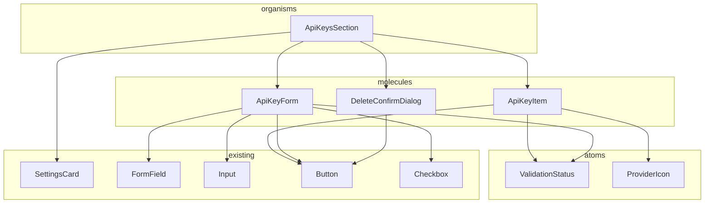
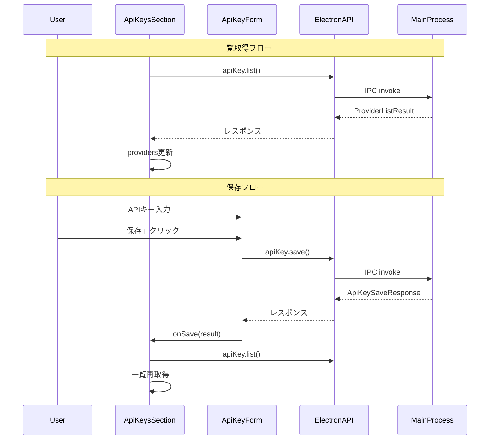

# APIプロバイダーAPIキー管理 - UI/UX設計書

> **ドキュメント種別**: UI/UX設計書
> **対象タスク**: T-01-3: UI/UX設計
> **作成日**: 2025-12-10
> **ステータス**: ドラフト
> **参照**:
>
> - `docs/30-workflows/api-key-management/data-model.md`
> - `docs/30-workflows/api-key-management/architecture.md`
> - `apps/desktop/src/renderer/views/SettingsView/index.tsx`（既存パターン参照）

---

## 1. 設計概要

### 1.1 目的

ユーザーがセキュリティを意識せずに安全にAPIキーを管理できるUIを設計する。マスク表示、検証ステータス表示、削除確認などのセキュリティ対策を組み込んだ設計を行う。

### 1.2 設計原則

| 原則             | 適用方法                                            |
| ---------------- | --------------------------------------------------- |
| 既存パターン踏襲 | `SettingsView`, `SettingsCard`, `FormField`を活用   |
| セキュリティ優先 | APIキー値は一切表示しない（登録有無のみ表示）       |
| アクセシビリティ | WCAG 2.1 AA準拠、キーボード操作、スクリーンリーダー |
| Atomic Design    | atoms/molecules/organisms の階層構造                |
| macOS HIG準拠    | グラスモーフィズム、ダークモード対応                |

### 1.3 配置場所

```
apps/desktop/src/renderer/
├── views/
│   └── SettingsView/
│       └── index.tsx                     # 既存（APIキーセクション追加）
└── components/
    └── organisms/
        └── ApiKeysSection/               # 新規作成
            ├── index.tsx                 # メインコンポーネント
            ├── ApiKeyItem.tsx            # 各プロバイダー行（molecule）
            ├── ApiKeyForm.tsx            # 入力フォーム（molecule）
            ├── ValidationStatus.tsx      # 検証状態表示（atom）
            └── __tests__/
                ├── ApiKeysSection.test.tsx
                └── ApiKeysSection.a11y.test.tsx
```

---

## 2. ワイヤーフレーム

### 2.1 全体レイアウト

```
┌─────────────────────────────────────────────────────────────────┐
│  設定                                                           │
│  Knowledge Studioの設定を管理します                              │
├─────────────────────────────────────────────────────────────────┤
│                                                                 │
│  ┌─ アカウント ─────────────────────────────────────────────┐   │
│  │  [既存のAccountSection]                                  │   │
│  └──────────────────────────────────────────────────────────┘   │
│                                                                 │
│  ┌─ APIキー設定 ────────────────────────────────────────────┐   │
│  │                                                          │   │
│  │  AIサービスへの接続に使用するAPIキーを管理します          │   │
│  │                                                          │   │
│  │  ┌───────────────────────────────────────────────────┐   │   │
│  │  │ [OpenAI icon]  OpenAI       ● 登録済み  [編集][削除]│   │   │
│  │  └───────────────────────────────────────────────────┘   │   │
│  │  ┌───────────────────────────────────────────────────┐   │   │
│  │  │ [Anthropic icon] Anthropic  ○ 未登録    [登録]    │   │   │
│  │  └───────────────────────────────────────────────────┘   │   │
│  │  ┌───────────────────────────────────────────────────┐   │   │
│  │  │ [Google icon]  Google AI    ● 登録済み  [編集][削除]│   │   │
│  │  └───────────────────────────────────────────────────┘   │   │
│  │  ┌───────────────────────────────────────────────────┐   │   │
│  │  │ [xAI icon]     xAI          ○ 未登録    [登録]    │   │   │
│  │  └───────────────────────────────────────────────────┘   │   │
│  │                                                          │   │
│  │  ℹ️ APIキーは暗号化して安全に保存されます                   │   │
│  │                                                          │   │
│  └──────────────────────────────────────────────────────────┘   │
│                                                                 │
│  ┌─ RAG設定 ────────────────────────────────────────────────┐   │
│  │  [既存のRAG設定]                                         │   │
│  └──────────────────────────────────────────────────────────┘   │
│                                                                 │
└─────────────────────────────────────────────────────────────────┘
```

### 2.2 登録/編集モーダル

```
┌─────────────────────────────────────────────────────────┐
│  OpenAI APIキーを登録                              [×]  │
├─────────────────────────────────────────────────────────┤
│                                                         │
│  APIキー *                                              │
│  ┌─────────────────────────────────────────────────┐   │
│  │ •••••••••••••••••••••••••••                  👁  │   │
│  └─────────────────────────────────────────────────┘   │
│  「sk-」で始まるAPIキーを入力してください               │
│                                                         │
│  ☐ 保存前にAPIキーを検証する                            │
│                                                         │
│  [検証状態エリア]                                       │
│  ┌─────────────────────────────────────────────────┐   │
│  │  ● 有効なAPIキーです                            │   │
│  │  ○ 検証中...                                    │   │
│  │  × 無効なAPIキーです                            │   │
│  │  ⚠ 検証できませんでした（ネットワークエラー）   │   │
│  └─────────────────────────────────────────────────┘   │
│                                                         │
├─────────────────────────────────────────────────────────┤
│                          [キャンセル]  [検証]  [保存]   │
└─────────────────────────────────────────────────────────┘
```

### 2.3 削除確認ダイアログ

```
┌─────────────────────────────────────────────────────────┐
│  APIキーを削除                                     [×]  │
├─────────────────────────────────────────────────────────┤
│                                                         │
│  ⚠️ OpenAIのAPIキーを削除しますか？                      │
│                                                         │
│  この操作は取り消せません。                              │
│  削除後、このプロバイダーを使用するには                  │
│  再度APIキーを登録する必要があります。                   │
│                                                         │
├─────────────────────────────────────────────────────────┤
│                                      [キャンセル]  [削除] │
└─────────────────────────────────────────────────────────┘
```

---

## 3. コンポーネント構成図

### 3.1 コンポーネントツリー



### 3.2 コンポーネント責務

| コンポーネント      | 種別     | 責務                                         |
| ------------------- | -------- | -------------------------------------------- |
| ApiKeysSection      | organism | 全プロバイダーの一覧管理、状態管理           |
| ApiKeyItem          | molecule | 個別プロバイダーの表示、編集/削除ボタン      |
| ApiKeyForm          | molecule | APIキー入力フォーム、検証実行                |
| DeleteConfirmDialog | molecule | 削除確認ダイアログ                           |
| ValidationStatus    | atom     | 検証結果のステータス表示                     |
| ProviderIcon        | atom     | プロバイダーごとのアイコン表示（既存を拡張） |

---

## 4. コンポーネント詳細仕様

### 4.1 ApiKeysSection (organism)

```typescript
interface ApiKeysSectionProps {
  className?: string;
}

interface ApiKeysSectionState {
  providers: ProviderStatus[];
  isLoading: boolean;
  error: string | null;
  editingProvider: AIProvider | null;
  deletingProvider: AIProvider | null;
}
```

**表示要素**:

- プロバイダー一覧（4プロバイダー固定表示）
- セキュリティ説明テキスト
- ローディング状態
- エラー状態

**操作フロー**:

1. マウント時に `window.electronAPI.apiKey.list()` で一覧取得
2. 「登録」→ `ApiKeyForm` モーダル表示
3. 「編集」→ `ApiKeyForm` モーダル表示（既存キー上書き）
4. 「削除」→ `DeleteConfirmDialog` 表示

### 4.2 ApiKeyItem (molecule)

```typescript
interface ApiKeyItemProps {
  provider: AIProvider;
  displayName: string;
  status: RegistrationStatus;
  lastValidatedAt: string | null;
  onRegister: () => void;
  onEdit: () => void;
  onDelete: () => void;
  disabled?: boolean;
}
```

**表示要素**:

| 要素                 | 未登録時             | 登録済み時               |
| -------------------- | -------------------- | ------------------------ |
| プロバイダーアイコン | 表示                 | 表示                     |
| プロバイダー名       | 表示                 | 表示                     |
| ステータスバッジ     | 「未登録」（グレー） | 「登録済み」（緑）       |
| 最終検証日時         | -                    | 「最終検証: YYYY/MM/DD」 |
| アクションボタン     | [登録]               | [編集] [削除]            |

### 4.3 ApiKeyForm (molecule)

```typescript
interface ApiKeyFormProps {
  provider: AIProvider;
  displayName: string;
  isOpen: boolean;
  onClose: () => void;
  onSave: (result: ApiKeySaveResponse) => void;
}

interface ApiKeyFormState {
  apiKey: string;
  validateBeforeSave: boolean;
  validationStatus: ApiKeyValidationStatus | null;
  validationMessage: string | null;
  isValidating: boolean;
  isSaving: boolean;
  error: string | null;
}
```

**入力フィールド仕様**:

| 項目              | 仕様                                         |
| ----------------- | -------------------------------------------- |
| 入力タイプ        | `type="password"` （常時マスク表示）         |
| プレースホルダー  | プロバイダーごとのプレフィックス例           |
| 最大長            | 256文字                                      |
| バリデーション    | クライアント側で基本チェック + サーバー側Zod |
| 表示/非表示トグル | 👁アイコンで一時的に表示可能                 |

**検証チェックボックス**:

- デフォルト: オフ
- オンの場合: 保存前にプロバイダーAPIで有効性を検証

**ボタン**:

- [キャンセル]: モーダルを閉じる
- [検証]: APIキーの有効性のみ検証（保存しない）
- [保存]: 保存（validateBeforeSaveがオンなら検証も実行）

### 4.4 ValidationStatus (atom)

```typescript
interface ValidationStatusProps {
  status: ApiKeyValidationStatus | null;
  message?: string;
  className?: string;
}
```

**表示パターン**:

| status          | アイコン | 色  | デフォルトメッセージ                 |
| --------------- | -------- | --- | ------------------------------------ |
| `null`          | -        | -   | （非表示）                           |
| `valid`         | ✓        | 緑  | 「有効なAPIキーです」                |
| `invalid`       | ×        | 赤  | 「無効なAPIキーです」                |
| `network_error` | ⚠        | 黄  | 「ネットワークエラーが発生しました」 |
| `timeout`       | ⚠        | 黄  | 「検証がタイムアウトしました」       |
| `unknown_error` | ⚠        | 黄  | 「検証できませんでした」             |

**ローディング状態**:

- Spinnerコンポーネントを使用
- メッセージ: 「検証中...」

---

## 5. 状態管理設計

### 5.1 ローカル状態 vs グローバル状態

| 状態             | 管理場所         | 理由                       |
| ---------------- | ---------------- | -------------------------- |
| providers一覧    | ApiKeysSection   | このセクション内でのみ使用 |
| フォーム入力値   | ApiKeyForm       | フォームスコープ内         |
| 検証状態         | ApiKeyForm       | フォームスコープ内         |
| モーダル開閉状態 | ApiKeysSection   | 親が制御                   |
| エラー状態       | 各コンポーネント | 表示スコープに応じて       |

### 5.2 データフロー



---

## 6. アクセシビリティ設計

### 6.1 WCAG 2.1 AA準拠項目

| 基準                 | 対応方法                                  |
| -------------------- | ----------------------------------------- |
| 1.4.3 コントラスト   | 4.5:1以上を確保、既存デザイントークン使用 |
| 2.1.1 キーボード操作 | Tab/Shift+Tab、Enter、Escape、Arrow対応   |
| 2.4.3 フォーカス順序 | 論理的な順序を維持                        |
| 2.4.7 フォーカス可視 | focus:ring-2 スタイル                     |
| 3.3.1 エラー識別     | role="alert"、aria-invalid                |
| 3.3.2 ラベル         | FormFieldの<label>                        |
| 4.1.2 名前、役割、値 | aria-label、aria-describedby、role        |

### 6.2 キーボード操作

| キー      | コンテキスト     | 動作                         |
| --------- | ---------------- | ---------------------------- |
| Tab       | 全般             | 次のフォーカス可能要素へ移動 |
| Shift+Tab | 全般             | 前のフォーカス可能要素へ移動 |
| Enter     | ボタン           | ボタンをクリック             |
| Enter     | 入力フィールド   | フォーム送信（保存）         |
| Escape    | モーダル         | モーダルを閉じる             |
| Space     | チェックボックス | トグル                       |

### 6.3 スクリーンリーダー対応

```tsx
// ApiKeyItem の例
<div
  role="listitem"
  aria-label={`${displayName}のAPIキー、${status === 'registered' ? '登録済み' : '未登録'}`}
>
  <ProviderIcon provider={provider} aria-hidden="true" />
  <span>{displayName}</span>
  <span aria-label={status === 'registered' ? '登録済み' : '未登録'}>
    {status === 'registered' ? '● 登録済み' : '○ 未登録'}
  </span>
  <Button aria-label={`${displayName}のAPIキーを${status === 'registered' ? '編集' : '登録'}`}>
    {status === 'registered' ? '編集' : '登録'}
  </Button>
</div>

// ValidationStatus の例
<div
  role="status"
  aria-live="polite"
  aria-label={`検証結果: ${message}`}
>
  <Icon name={iconName} aria-hidden="true" />
  <span>{message}</span>
</div>
```

---

## 7. マスク表示仕様

### 7.1 入力フィールド

| 状態             | 表示                            |
| ---------------- | ------------------------------- |
| 初期状態         | `type="password"` でマスク表示  |
| 表示トグルオン   | `type="text"` で平文表示        |
| 表示トグルオフ   | `type="password"` でマスク表示  |
| フィールド離脱時 | 自動で `type="password"` に戻す |

### 7.2 一覧表示

- **APIキー値は一切表示しない**
- 登録有無（登録済み/未登録）のみ表示
- 最終検証日時のみ表示

### 7.3 セキュリティ考慮

```tsx
// 表示トグルボタンの実装
const [showPassword, setShowPassword] = useState(false);

// フィールド離脱時に自動でマスクに戻す
const handleBlur = useCallback(() => {
  setShowPassword(false);
}, []);

// クリップボードへのコピーは許可しない
<Input
  type={showPassword ? "text" : "password"}
  onBlur={handleBlur}
  onCopy={(e) => e.preventDefault()}
  onCut={(e) => e.preventDefault()}
  autoComplete="off"
  data-lpignore="true" // LastPassなどのパスワードマネージャーを無効化
/>;
```

---

## 8. 検証ステータス表示仕様

### 8.1 表示タイミング

| トリガー                                          | 表示内容                        |
| ------------------------------------------------- | ------------------------------- |
| 入力開始                                          | 非表示                          |
| 「検証」ボタンクリック                            | ローディング → 結果             |
| 「保存」ボタンクリック（validateBeforeSave=true） | ローディング → 結果 → 保存処理  |
| 保存成功                                          | 成功メッセージ → モーダル閉じる |
| 保存失敗                                          | エラーメッセージ表示            |

### 8.2 アニメーション

```tsx
// ValidationStatus のアニメーション
<motion.div
  initial={{ opacity: 0, y: -10 }}
  animate={{ opacity: 1, y: 0 }}
  exit={{ opacity: 0, y: -10 }}
  transition={{ duration: 0.2 }}
>
  {/* ステータス内容 */}
</motion.div>
```

### 8.3 色とアイコン

```tsx
const statusConfig = {
  valid: {
    icon: "check-circle",
    color: "text-green-400",
    bgColor: "bg-green-400/10",
    message: "有効なAPIキーです",
  },
  invalid: {
    icon: "x-circle",
    color: "text-red-400",
    bgColor: "bg-red-400/10",
    message: "無効なAPIキーです",
  },
  network_error: {
    icon: "alert-triangle",
    color: "text-yellow-400",
    bgColor: "bg-yellow-400/10",
    message: "ネットワークエラーが発生しました",
  },
  timeout: {
    icon: "clock",
    color: "text-yellow-400",
    bgColor: "bg-yellow-400/10",
    message: "検証がタイムアウトしました",
  },
  unknown_error: {
    icon: "alert-circle",
    color: "text-yellow-400",
    bgColor: "bg-yellow-400/10",
    message: "検証できませんでした",
  },
};
```

---

## 9. エラーハンドリングUI

### 9.1 エラー種別と表示

| エラー種別         | 表示場所             | 表示方法                    |
| ------------------ | -------------------- | --------------------------- |
| 入力バリデーション | フォームフィールド下 | FormFieldのerrorプロップ    |
| API検証失敗        | ValidationStatus     | ステータスコンポーネント内  |
| 保存失敗           | モーダル上部         | Toastまたはインラインエラー |
| 一覧取得失敗       | セクション全体       | ErrorDisplayコンポーネント  |
| IPC禁止エラー      | Toastまたはアラート  | 「不正なアクセスです」      |

### 9.2 エラーメッセージ

| エラーコード               | ユーザー向けメッセージ                     |
| -------------------------- | ------------------------------------------ |
| `EMPTY_API_KEY`            | APIキーを入力してください                  |
| `INVALID_API_KEY_FORMAT`   | APIキーの形式が正しくありません            |
| `API_KEY_TOO_LONG`         | APIキーが長すぎます                        |
| `INVALID_PROVIDER`         | 無効なプロバイダーです                     |
| `VALIDATION_FAILED`        | APIキーが無効です                          |
| `VALIDATION_TIMEOUT`       | 検証がタイムアウトしました                 |
| `VALIDATION_NETWORK_ERROR` | ネットワークエラーが発生しました           |
| `SAVE_FAILED`              | 保存に失敗しました。もう一度お試しください |
| `DELETE_FAILED`            | 削除に失敗しました。もう一度お試しください |
| `ENCRYPTION_NOT_AVAILABLE` | セキュアストレージが利用できません         |

---

## 10. 完了条件チェックリスト

- [x] ワイヤーフレーム作成（全体レイアウト、モーダル、ダイアログ）
- [x] コンポーネント構成図（Mermaid図）
- [x] マスク表示仕様定義（入力フィールド、一覧、セキュリティ考慮）
- [x] 検証ステータス表示仕様（タイミング、アニメーション、色/アイコン）
- [x] アクセシビリティ設計（WCAG準拠、キーボード操作、スクリーンリーダー）
- [x] 状態管理設計
- [x] エラーハンドリングUI

---

## 11. 次フェーズへの引き継ぎ

### 11.1 T-02-1（設計レビュー）への入力

- 本UI設計書（ワイヤーフレーム、コンポーネント構成）
- アクセシビリティ設計
- セキュリティ考慮事項

### 11.2 T-03-4（UIコンポーネントテスト）への入力

- コンポーネント仕様（Props、State）
- 操作フロー
- アクセシビリティ要件

### 11.3 T-04-5（UI実装）への入力

- コンポーネント詳細仕様
- 状態管理設計
- マスク表示仕様
- 検証ステータス表示仕様

---

## 変更履歴

| バージョン | 日付       | 変更内容 | 作成者       |
| ---------- | ---------- | -------- | ------------ |
| 1.0.0      | 2025-12-10 | 初版作成 | @ui-designer |
