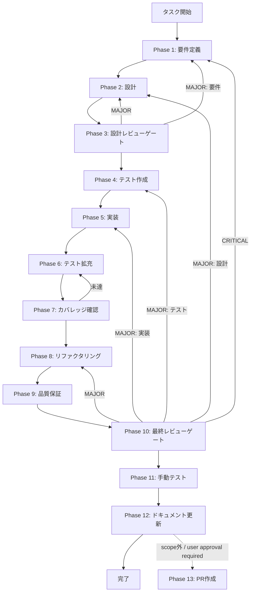

# approval-request-producer - タスク実行仕様書

## ユーザーからの元の指示

```
Issue #1803 (UT-IMP-SAFETY-GOV-PUSH-REQUEST-PRODUCER-001) を実装する。
pushApprovalRequest() の producer を HooksFactory.createPreToolUseHook() 内に接続し、
危険コマンド検出後に Main → Preload → Renderer へ approval リクエストを発火させる。
```

## メタ情報

| 項目         | 内容                                                 |
| ------------ | ---------------------------------------------------- |
| タスクID     | TASK-APPROVAL-PRODUCER-001                           |
| タスク名     | approval-request-producer                            |
| 分類         | 改善                                                 |
| 対象機能     | HooksFactory 危険コマンド検出 → ApprovalRequest 発火 |
| 優先度       | 高                                                   |
| 見積もり規模 | 小規模                                               |
| ステータス   | 未実施                                               |
| 作成日       | 2026-04-01                                           |
| 関連Issue    | #1803 (UT-IMP-SAFETY-GOV-PUSH-REQUEST-PRODUCER-001)  |

---

## タスク概要

### 目的

`HooksFactory.createPreToolUseHook()` 内の危険コマンド検出ブロック後に `pushApprovalRequest()` を呼び出し、Main プロセスから Renderer へ承認リクエストを IPC 経由でプッシュする producer を接続する。これにより、危険コマンドが実行される前に Renderer 側の承認 UI が起動するフローが完成する。

> 本タスクの scope は Phase 12 まで。`commit` / `PR` 作成はユーザー指示があるまで実行しない。
> Phase 13 は標準フレームワーク上の最終工程として保持するが、この workflow では `blocked` 扱いとする。

### 背景

`pushApprovalRequest()` の IPC 輸送経路（Main → Preload → Renderer）は `approvalHandlers.ts` に実装済みであり、IPC チャンネル `APPROVAL_REQUEST` も `ALLOWED_ON_CHANNELS` に登録済み。しかし、production ランタイムでこの関数を呼び出す **producer** が存在しない。

骨格実装（DI チェーン接続）は完了済みで、`HooksFactory.createPreToolUseHook()` 内に `TODO(human)` が設置済みである。本タスクはその TODO を実装して接続を完成させる。

### 最終ゴール

- `HooksFactory.createPreToolUseHook()` 内の危険コマンド検出後に `pushApprovalRequest(this.mainWindow, {...})` が呼ばれる
- `sessionId` / `operationId` の相関 ID が正しく設定される
- `operationId` は `uuidv4()` で生成される
- Main → Preload → Renderer の実発火テストが通る
- `approvalGate` / `sessionId` が DI チェーン経由で `HooksFactory` に渡される

### 成果物一覧

| 種別         | 成果物                                                   | 配置先                                                                         |
| ------------ | -------------------------------------------------------- | ------------------------------------------------------------------------------ |
| 機能         | `HooksFactory.createPreToolUseHook()` への producer 接続 | `apps/desktop/src/main/services/agent/HooksFactory.ts`                         |
| テスト       | `HooksFactory.producer.test.ts` (新規)                   | `apps/desktop/src/main/services/agent/__tests__/HooksFactory.producer.test.ts` |
| ドキュメント | タスク仕様書 (本ディレクトリ)                            | `docs/30-workflows/approval-request-producer/`                                 |

---

## 参照ファイル

本仕様書のコマンド選定は以下を参照：

- `apps/desktop/src/main/services/agent/HooksFactory.ts` - 主要修正対象
- `apps/desktop/src/main/ipc/approvalHandlers.ts` - `pushApprovalRequest()` 実装済み
- `apps/desktop/src/main/services/agent/AgentExecutor.ts` - HooksFactory 呼び出し元
- `apps/desktop/src/main/services/agent/ExecutionManager.ts` - ExecutionManager
- `apps/desktop/src/main/ipc/agentHandlers.ts` - DI チェーン入り口
- `apps/desktop/src/main/ipc/index.ts` - `DefaultApprovalGate` インスタンス生成箇所
- `docs/30-workflows/unassigned-task/UT-IMP-SAFETY-GOV-PUSH-REQUEST-PRODUCER-001-design.md` - 詳細設計書

---

## タスク分解サマリー

| ID     | フェーズ | サブタスク名       | 責務                                         | 依存 |
| ------ | -------- | ------------------ | -------------------------------------------- | ---- |
| T-01-1 | Phase 1  | 要件定義           | P50チェック・受入基準 AC-1〜AC-5 確定        | -    |
| T-02-1 | Phase 2  | 技術設計           | 接続ポイント確認・DI チェーン設計・型設計    | T-01 |
| T-03-1 | Phase 3  | 設計レビューゲート | PASS/MINOR/MAJOR 判定・Phase 4 開始条件確認  | T-02 |
| T-04-1 | Phase 4  | テスト作成         | `HooksFactory.producer.test.ts` 骨格作成     | T-03 |
| T-05-1 | Phase 5  | 実装               | `createPreToolUseHook()` への producer 接続  | T-04 |
| T-06-1 | Phase 6  | テスト拡充         | エッジケース・異常系テスト追加               | T-05 |
| T-07-1 | Phase 7  | カバレッジ確認     | Line 80%+ / Branch 60%+ / Function 80%+ 達成 | T-06 |
| T-08-1 | Phase 8  | リファクタリング   | コード品質向上・重複排除                     | T-07 |
| T-09-1 | Phase 9  | 品質保証           | lint / typecheck / 全テスト PASS 確認        | T-08 |
| T-10-1 | Phase 10 | 最終レビューゲート | PASS 判定・マージ可否確認                    | T-09 |
| T-11-1 | Phase 11 | 手動テスト         | Electron 起動・危険コマンド実発火確認        | T-10 |
| T-12-1 | Phase 12 | ドキュメント更新   | 仕様書・コメント更新                         | T-11 |
| T-13-1 | Phase 13 | PR作成             | `blocked` / ユーザー承認待ち                 | T-12 |

**総サブタスク数**: 13 個（Phase 13 は blocked）

---

## 実行フロー図



> Phase 13 はユーザー承認があるまで blocked のまま維持する。

---

## Phase 一覧

| Phase | 名称               | 仕様書                                                       | ステータス |
| ----- | ------------------ | ------------------------------------------------------------ | ---------- |
| 1     | 要件定義           | [phase-1-requirements.md](phase-1-requirements.md)           | 完了       |
| 2     | 設計               | [phase-2-design.md](phase-2-design.md)                       | 完了       |
| 3     | 設計レビューゲート | [phase-3-design-review.md](phase-3-design-review.md)         | 完了       |
| 4     | テスト作成         | [phase-4-test-creation.md](phase-4-test-creation.md)         | 未実施     |
| 5     | 実装               | [phase-5-implementation.md](phase-5-implementation.md)       | 未実施     |
| 6     | テスト拡充         | [phase-6-test-expansion.md](phase-6-test-expansion.md)       | 未実施     |
| 7     | カバレッジ確認     | [phase-7-coverage-check.md](phase-7-coverage-check.md)       | 未実施     |
| 8     | リファクタリング   | [phase-8-refactoring.md](phase-8-refactoring.md)             | 未実施     |
| 9     | 品質保証           | [phase-9-quality-assurance.md](phase-9-quality-assurance.md) | 未実施     |
| 10    | 最終レビューゲート | [phase-10-final-review.md](phase-10-final-review.md)         | 未実施     |
| 11    | 手動テスト         | [phase-11-manual-test.md](phase-11-manual-test.md)           | 未実施     |
| 12    | ドキュメント更新   | [phase-12-documentation.md](phase-12-documentation.md)       | 未実施     |
| 13    | PR作成             | [phase-13-pr-creation.md](phase-13-pr-creation.md)           | blocked    |

---

## テストカバレッジ目標

### ユニットテスト

| 指標              | 最低基準 | 推奨基準 |
| ----------------- | -------- | -------- |
| Line Coverage     | 80%      | 90%      |
| Branch Coverage   | 60%      | 70%      |
| Function Coverage | 80%      | 90%      |

### 結合テスト

| 指標                              | 目標 |
| --------------------------------- | ---- |
| IPC 経路（Main → Renderer）       | 100% |
| 正常系シナリオ                    | 100% |
| 異常系シナリオ（mainWindow 破棄） | 80%+ |

---

## 統合テスト連携（Phase 1〜11 で必須）

| Phase | 統合テスト連携アクション                                           |
| ----- | ------------------------------------------------------------------ |
| 1     | IPC 接続要件（APPROVAL_REQUEST チャンネル・DI フロー）を要件に明記 |
| 2     | IPC 4層整合性チェック（既存チャンネル確認）を設計に反映            |
| 3     | IPC 統合テスト観点のレビューゲートを実施                           |
| 4     | IPC 発火テストシナリオを `HooksFactory.producer.test.ts` に作成    |
| 5     | Main → Preload → Renderer 接続の実装                               |
| 6     | IPC 統合テストのカバレッジ向上                                     |
| 7     | 統合テストの再実行とゲート判定                                     |
| 8     | リファクタ後の統合テスト継続成功を確認                             |
| 9     | 品質保証で統合テスト結果を確認                                     |
| 10    | 最終レビューで統合テスト結果を確認                                 |
| 11    | 手動統合テスト（危険コマンド実発火→Renderer 承認 UI 起動）を確認   |

---

## Phase 完了時の必須アクション

**各 Phase 完了時に以下を必ず実行すること:**

1. **タスク 100% 実行**: Phase 内で指定された全タスクを完全に実行
2. **成果物確認**: 全ての必須成果物が生成されていることを検証
3. **実行記録**: 実行タスクの結果を記録
4. **artifacts.json 更新**: Phase 完了ステータスを更新
5. **Phase 末端の実行確認**: 各タスクを 100% 実行し、各タスクを完遂した旨を必ず明記

```bash
# Phase 完了時の検証コマンド
node .claude/skills/task-specification-creator/scripts/validate-phase-output.js docs/30-workflows/approval-request-producer --phase {{PHASE_NUMBER}}

# Phase 完了・成果物登録
node .claude/skills/task-specification-creator/scripts/complete-phase.js \
  --workflow docs/30-workflows/approval-request-producer --phase {{PHASE_NUMBER}} --artifacts "..."
```
