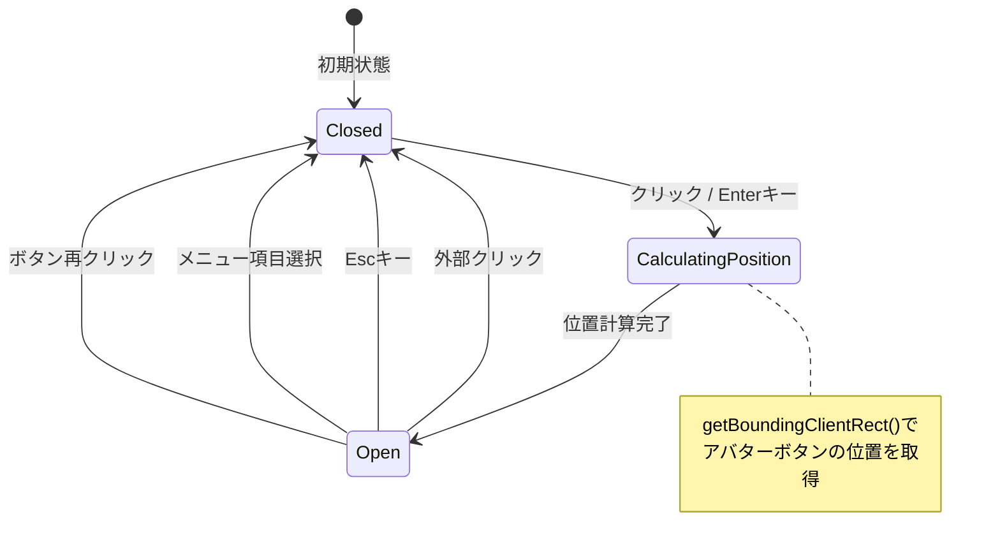
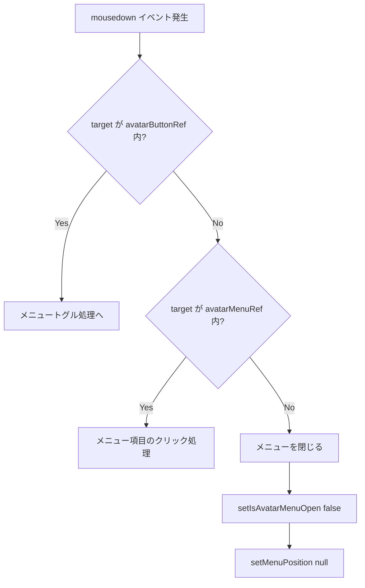

# アバター編集メニュー Portal実装設計書

## ドキュメント情報

| 項目     | 内容                                       |
| -------- | ------------------------------------------ |
| 文書ID   | DESIGN-AUTH-UI-002                         |
| 作成日   | 2025-12-20                                 |
| 作成者   | @ui-designer                               |
| 対象機能 | AccountSection - アバター編集メニュー      |
| 関連要件 | [REQ-AUTH-UI-002](./requirements-ui-ux.md) |

---

## 1. 設計概要

### 1.1 目的

ReactのcreatePortal APIを使用して、アバター編集メニューを`document.body`直下にレンダリングし、GlassPanelのスタッキングコンテキスト制約から脱出する。

### 1.2 技術的アプローチ

```
┌─────────────────────────────────────────────────────────────┐
│ Reactコンポーネントツリー                                      │
│ ┌─────────────────────────────────────────────────────────┐ │
│ │ AccountSection                                           │ │
│ │ ┌─────────────────────────────────────────────────────┐ │ │
│ │ │ GlassPanel (Profile Card)                           │ │ │
│ │ │   backdrop-blur → スタッキングコンテキスト作成       │ │ │
│ │ │ ┌─────────────────────────────────────────────────┐ │ │ │
│ │ │ │ Avatar Button (avatarButtonRef)                 │ │ │ │
│ │ │ │   ↓ クリック                                    │ │ │ │
│ │ │ │   getBoundingClientRect() で位置計算            │ │ │ │
│ │ │ └─────────────────────────────────────────────────┘ │ │ │
│ │ └─────────────────────────────────────────────────────┘ │ │
│ │                                                          │ │
│ │ GlassPanel (連携サービス) ← メニューはこの上に表示が必要 │ │
│ └──────────────────────────────────────────────────────────┘ │
└─────────────────────────────────────────────────────────────┘

┌─────────────────────────────────────────────────────────────┐
│ DOM ツリー (document.body)                                   │
│ ┌─────────────────────────────────────────────────────────┐ │
│ │ #root (アプリケーションルート)                           │ │
│ └─────────────────────────────────────────────────────────┘ │
│                                                              │
│ ┌─────────────────────────────────────────────────────────┐ │
│ │ Portal Target (createPortalでレンダリング)              │ │
│ │ ┌─────────────────────────────────────────────────────┐ │ │
│ │ │ Avatar Edit Menu (avatarMenuRef)                    │ │ │
│ │ │   position: fixed                                   │ │ │
│ │ │   z-index: 9999                                     │ │ │
│ │ │   top: menuPosition.top                             │ │ │
│ │ │   left: menuPosition.left                           │ │ │
│ │ └─────────────────────────────────────────────────────┘ │ │
│ └─────────────────────────────────────────────────────────┘ │
└─────────────────────────────────────────────────────────────┘
```

### 1.3 設計原則

- **単一責務**: メニュー位置計算と表示ロジックを分離
- **Composition over Inheritance**: Portalをコンポーネント合成パターンで実装
- **アクセシビリティファースト**: WCAG 2.1 AA準拠のキーボード操作とARIA属性

---

## 2. 状態管理設計

### 2.1 状態定義

```typescript
// メニュー開閉状態
const [isAvatarMenuOpen, setIsAvatarMenuOpen] = useState<boolean>(false);

// メニュー位置（Portal表示時に使用）
const [menuPosition, setMenuPosition] = useState<{
  top: number;
  left: number;
} | null>(null);
```

### 2.2 状態遷移図



### 2.3 状態の不変条件

| 不変条件                                              | 説明                                         |
| ----------------------------------------------------- | -------------------------------------------- |
| `menuPosition !== null` ↔ `isAvatarMenuOpen === true` | メニューが開いている場合のみ位置が設定される |
| `menuPosition.top >= 0`                               | 位置は常に正の値                             |
| `menuPosition.left >= 0`                              | 位置は常に正の値                             |

---

## 3. DOM参照設計

### 3.1 useRefの使用

```typescript
// アバターボタンのコンテナ参照（位置計算用）
const avatarButtonRef = useRef<HTMLDivElement>(null);

// Portalメニューの参照（外部クリック検出用）
const avatarMenuRef = useRef<HTMLDivElement>(null);
```

### 3.2 参照の用途

| Ref               | 用途                                      | 必要なタイミング     |
| ----------------- | ----------------------------------------- | -------------------- |
| `avatarButtonRef` | メニュー位置計算（getBoundingClientRect） | メニュー開く時       |
| `avatarMenuRef`   | 外部クリック検出                          | メニュー開いている間 |

---

## 4. メニュー位置計算ロジック

### 4.1 位置計算アルゴリズム

```typescript
const handleToggleAvatarMenu = useCallback(() => {
  setIsAvatarMenuOpen((prev) => {
    if (!prev && avatarButtonRef.current) {
      // メニューを開く時に位置を計算
      const rect = avatarButtonRef.current.getBoundingClientRect();
      setMenuPosition({
        top: rect.bottom + 8, // ボタン下端 + 8px (mt-2相当)
        left: rect.left, // ボタン左端に揃える
      });
    } else {
      // メニューを閉じる時は位置をリセット
      setMenuPosition(null);
    }
    return !prev;
  });
}, []);
```

### 4.2 位置計算の詳細

```
┌─────────────────────────────┐
│ Avatar Button               │
│ ┌─────────┐                 │
│ │ 📷      │ ← rect.top      │
│ │  ✏️     │                  │
│ └─────────┘ ← rect.bottom   │
│ ↑                           │
│ rect.left                   │
└─────────────────────────────┘
        │
        │ 8px gap (mt-2)
        ▼
┌─────────────────────────────┐
│ Portal Menu                 │
│ top: rect.bottom + 8        │
│ left: rect.left             │
│ ┌─────────────────────────┐ │
│ │ 📤 アップロード          │ │
│ ├─────────────────────────┤ │
│ │ 🔗 Googleのアバターを使用 │ │
│ ├─────────────────────────┤ │
│ │ 🗑️ アバターを削除        │ │
│ └─────────────────────────┘ │
└─────────────────────────────┘
```

### 4.3 getBoundingClientRect の返却値

```typescript
interface DOMRect {
  top: number; // ビューポート上端からの距離
  right: number; // ビューポート左端からの距離（右辺）
  bottom: number; // ビューポート上端からの距離（下辺）
  left: number; // ビューポート左端からの距離
  width: number; // 要素の幅
  height: number; // 要素の高さ
  x: number; // left と同等
  y: number; // top と同等
}
```

---

## 5. createPortal実装設計

### 5.1 Portal構造

```tsx
import { createPortal } from "react-dom";

// Portal条件: 開いている かつ 位置が計算済み
{
  isAvatarMenuOpen &&
    menuPosition &&
    createPortal(
      <div
        ref={avatarMenuRef}
        role="menu"
        aria-label="アバター編集メニュー"
        className="fixed w-48 bg-[var(--bg-secondary)] border border-white/10 rounded-lg shadow-lg z-[9999]"
        style={{
          top: menuPosition.top,
          left: menuPosition.left,
        }}
      >
        {/* メニュー項目 */}
      </div>,
      document.body, // Portal先: document.body直下
    );
}
```

### 5.2 Portalのメリット

| 特性                         | 説明                                                 |
| ---------------------------- | ---------------------------------------------------- |
| スタッキングコンテキスト脱出 | 親要素のbackdrop-blur等に影響されない                |
| z-index有効化                | document.body直下なので、z-index: 9999が正しく機能   |
| Reactツリー維持              | DOM階層は変わるが、Reactのコンポーネントツリーは維持 |
| イベント伝播                 | Reactのイベントシステムは正常に動作                  |

### 5.3 スタイリング

```typescript
// メニューコンテナ
const menuContainerStyles = clsx(
  "fixed", // 固定位置
  "w-48", // 幅192px
  "bg-[var(--bg-secondary)]", // 背景色
  "border border-white/10", // ボーダー
  "rounded-lg", // 角丸
  "shadow-lg", // シャドウ
  "z-[9999]", // z-index
);

// メニュー項目
const menuItemStyles = clsx(
  "w-full", // 全幅
  "px-4 py-2", // パディング
  "text-left text-sm", // テキスト配置・サイズ
  "text-white", // テキスト色
  "hover:bg-white/10", // ホバー時背景
  "flex items-center gap-2", // アイコン配置
);

// 削除ボタン（有効時）
const deleteButtonEnabledStyles = clsx(
  menuItemStyles,
  "text-red-400 hover:bg-red-500/10",
);

// 削除ボタン（無効時）
const deleteButtonDisabledStyles = clsx(
  menuItemStyles,
  "text-white/30 cursor-not-allowed",
);
```

---

## 6. イベントハンドリング設計

### 6.1 外部クリック検出

```typescript
useEffect(() => {
  const handleClickOutside = (event: MouseEvent) => {
    const target = event.target as Node;

    // アバターボタンコンテナの内部クリックを確認
    const isInsideButtonContainer = avatarButtonRef.current?.contains(target);

    // Portalメニューの内部クリックを確認
    const isInsideMenu = avatarMenuRef.current?.contains(target);

    // 両方の外側をクリックした場合のみ閉じる
    if (!isInsideButtonContainer && !isInsideMenu) {
      setIsAvatarMenuOpen(false);
      setMenuPosition(null);
    }
  };

  // メニューが開いている間のみイベントリスナーを登録
  if (isAvatarMenuOpen) {
    document.addEventListener("mousedown", handleClickOutside);
  }

  // クリーンアップ
  return () => {
    document.removeEventListener("mousedown", handleClickOutside);
  };
}, [isAvatarMenuOpen]);
```

### 6.2 イベントフロー図



### 6.3 メニュー項目クリック時の処理

```typescript
// アップロード
const handleUploadAvatar = useCallback(() => {
  uploadAvatar();
  setIsAvatarMenuOpen(false);
  setMenuPosition(null);
}, [uploadAvatar]);

// プロバイダーアバター使用
const handleUseProviderAvatar = useCallback(
  (provider: OAuthProvider) => {
    useProviderAvatar(provider);
    setIsAvatarMenuOpen(false);
    setMenuPosition(null);
  },
  [useProviderAvatar],
);

// アバター削除（確認ダイアログ表示）
const handleRemoveAvatarClick = useCallback(() => {
  setConfirmDialog({
    isOpen: true,
    type: "remove-avatar",
  });
  setIsAvatarMenuOpen(false);
  setMenuPosition(null);
}, []);
```

---

## 7. アクセシビリティ設計

### 7.1 ARIA属性

| 要素             | 属性            | 値                       | 説明                               |
| ---------------- | --------------- | ------------------------ | ---------------------------------- |
| メニューコンテナ | `role`          | `"menu"`                 | メニューとしてのセマンティクス     |
| メニューコンテナ | `aria-label`    | `"アバター編集メニュー"` | スクリーンリーダー向け説明         |
| メニュー項目     | `role`          | `"menuitem"`             | メニュー項目としてのセマンティクス |
| アバターボタン   | `aria-label`    | `"アバターを編集"`       | ボタンの目的説明                   |
| アバターボタン   | `aria-expanded` | `isAvatarMenuOpen`       | メニュー展開状態                   |
| アバターボタン   | `aria-haspopup` | `"menu"`                 | ポップアップの種類                 |

### 7.2 実装例

```tsx
// アバター編集ボタン
<Button
  variant="ghost"
  size="sm"
  onClick={handleToggleAvatarMenu}
  aria-label="アバターを編集"
  aria-expanded={isAvatarMenuOpen}
  aria-haspopup="menu"
  className="absolute -bottom-1 -right-1 w-6 h-6 !p-0 rounded-full bg-white/20 hover:bg-white/30"
>
  <Icon name="pencil" size={12} />
</Button>

// メニューコンテナ
<div
  ref={avatarMenuRef}
  role="menu"
  aria-label="アバター編集メニュー"
  className="..."
>
  <button role="menuitem" onClick={handleUploadAvatar}>
    <Icon name="upload" size={14} />
    アップロード
  </button>
  {/* ... */}
</div>
```

### 7.3 キーボード操作（将来実装）

| キー        | アクション                     | 現在の実装状態                |
| ----------- | ------------------------------ | ----------------------------- |
| Tab         | メニューボタンにフォーカス移動 | ✅ 実装済み                   |
| Enter/Space | メニュー開閉                   | ✅ Buttonコンポーネントで対応 |
| Escape      | メニューを閉じる               | ⚠️ 要実装                     |
| Arrow Down  | 次のメニュー項目にフォーカス   | ⚠️ 要実装                     |
| Arrow Up    | 前のメニュー項目にフォーカス   | ⚠️ 要実装                     |

### 7.4 Escキーハンドリング設計（推奨追加実装）

```typescript
useEffect(() => {
  const handleKeyDown = (event: KeyboardEvent) => {
    if (event.key === "Escape" && isAvatarMenuOpen) {
      setIsAvatarMenuOpen(false);
      setMenuPosition(null);
      // フォーカスをボタンに戻す
      avatarButtonRef.current?.querySelector("button")?.focus();
    }
  };

  if (isAvatarMenuOpen) {
    document.addEventListener("keydown", handleKeyDown);
  }

  return () => {
    document.removeEventListener("keydown", handleKeyDown);
  };
}, [isAvatarMenuOpen]);
```

---

## 8. コンポーネント構造設計

### 8.1 コンポーネント階層

```
AccountSection
├── State Management
│   ├── isAvatarMenuOpen: boolean
│   └── menuPosition: { top, left } | null
│
├── Refs
│   ├── avatarButtonRef: HTMLDivElement
│   └── avatarMenuRef: HTMLDivElement
│
├── Event Handlers
│   ├── handleToggleAvatarMenu()
│   ├── handleUploadAvatar()
│   ├── handleUseProviderAvatar()
│   └── handleRemoveAvatarClick()
│
├── Effects
│   └── useEffect (外部クリック検出)
│
└── Render
    ├── GlassPanel (Profile Card)
    │   └── Avatar Button (with avatarButtonRef)
    │
    └── Portal (to document.body)
        └── Avatar Menu (with avatarMenuRef)
            ├── Upload Button
            ├── Provider Avatar Buttons
            └── Remove Avatar Button
```

### 8.2 責務分離

| 責務             | 担当                                            |
| ---------------- | ----------------------------------------------- |
| 状態管理         | useState (isAvatarMenuOpen, menuPosition)       |
| DOM参照          | useRef (avatarButtonRef, avatarMenuRef)         |
| 位置計算         | handleToggleAvatarMenu内のgetBoundingClientRect |
| 外部クリック検出 | useEffect + mousedownイベントリスナー           |
| Portal描画       | createPortal                                    |

---

## 9. テスト容易性設計

### 9.1 テスト可能なポイント

| テスト対象           | テスト方法                                     |
| -------------------- | ---------------------------------------------- |
| Portal描画           | `document.body.querySelector('[role="menu"]')` |
| 位置計算             | モックしたgetBoundingClientRectの返却値確認    |
| 外部クリック         | userEvent.click() + メニュー非表示確認         |
| メニュー項目クリック | userEvent.click() + ハンドラー呼び出し確認     |
| ARIA属性             | getByRole, getByLabelText                      |

### 9.2 テストユーティリティ

```typescript
// Portal内の要素を取得するヘルパー
const getPortalMenu = () =>
  document.body.querySelector('[role="menu"]') as HTMLElement;

// メニューが開いていることを確認
const expectMenuOpen = () => {
  const menu = getPortalMenu();
  expect(menu).toBeInTheDocument();
  expect(menu).toHaveClass("fixed");
  expect(menu).toHaveStyle({ position: "fixed" });
};

// メニューが閉じていることを確認
const expectMenuClosed = () => {
  const menu = getPortalMenu();
  expect(menu).not.toBeInTheDocument();
};
```

---

## 10. 実装チェックリスト

### 10.1 必須実装項目

- [x] createPortalのインポート
- [x] menuPosition state追加
- [x] avatarButtonRef追加
- [x] avatarMenuRef追加
- [x] handleToggleAvatarMenu関数実装
- [x] getBoundingClientRectによる位置計算
- [x] Portalでのメニューレンダリング
- [x] 外部クリック検出useEffect
- [x] role="menu" 属性
- [x] role="menuitem" 属性
- [x] aria-label属性

### 10.2 推奨実装項目（Phase 5で対応可能）

- [ ] aria-expanded属性
- [ ] aria-haspopup属性
- [ ] Escキーでメニューを閉じる
- [ ] 矢印キーでメニュー項目間を移動
- [ ] フォーカス管理（メニュー開閉時）

---

## 11. 参照情報

### 11.1 関連ドキュメント

- [要件定義書](./requirements-ui-ux.md)
- [タスク実行仕様書](./task-auth-ui-z-index-fix-specification.md)

### 11.2 技術リファレンス

- [React createPortal](https://react.dev/reference/react-dom/createPortal)
- [getBoundingClientRect - MDN](https://developer.mozilla.org/en-US/docs/Web/API/Element/getBoundingClientRect)
- [WAI-ARIA Menu Pattern](https://www.w3.org/WAI/ARIA/apg/patterns/menu/)

### 11.3 対象ファイル

```
apps/desktop/src/renderer/components/organisms/AccountSection/index.tsx
```

---

## 12. 承認

| 役割           | 名前             | 日付                | 署名 |
| -------------- | ---------------- | ------------------- | ---- |
| 設計者         | @ui-designer     | 2025-12-20          | ✓    |
| アーキテクチャ | @arch-police     | _（Phase 2で記入）_ |      |
| テスト         | @frontend-tester | _（Phase 2で記入）_ |      |
