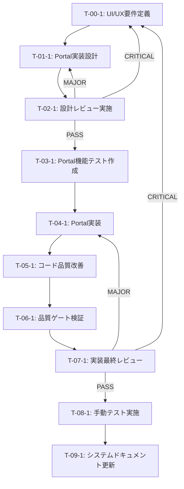

# アバターメニューz-index修正 - タスク実行仕様書

## ユーザーからの元の指示

```
アバター編集メニュー(z-[9999])が連携サービスのGlassPanelに隠れてボタンを押せない。
backdrop-blurを使用しているGlassPanelが新しいスタッキングコンテキストを作成するため、
子要素のz-indexが正しく機能していない。
```

## メタ情報

| 項目         | 内容                        |
| ------------ | --------------------------- |
| タスクID     | AUTH-UI-002                 |
| タスク名     | アバターメニューz-index修正 |
| 分類         | バグ修正                    |
| 対象機能     | AccountSection              |
| 優先度       | 高                          |
| 見積もり規模 | 小規模                      |
| ステータス   | 未実施                      |
| 発見元       | ユーザーフィードバック      |
| 発見日       | 2025-12-10                  |
| 関連タスク   | AUTH-UI-001                 |

---

## タスク概要

### 目的

アバター編集メニューが常に最前面に表示され、ユーザーがメニュー内のボタンをクリックできるようにする。CSSのスタッキングコンテキストの制約を克服し、ReactのPortal機能を活用してUI要素を適切な位置にレンダリングする。

### 背景

AUTH-UI-001でz-index値を`z-[9999]`に修正したが、親要素のGlassPanelが`backdrop-blur`を使用しているため、新しいスタッキングコンテキストが作成される。その結果、子要素のz-indexは親GlassPanel内でしか効果を持たず、他のGlassPanelコンポーネント（連携サービスセクション）の下にメニューが隠れてしまう。

この問題は、CSSのスタッキングコンテキストの仕様に起因する技術的制約であり、z-indexの値を上げるだけでは解決できない。ReactのcreatePortalを使用して、メニューを`document.body`直下にレンダリングすることで、スタッキングコンテキストから脱出し、z-indexを正しく機能させる。

### 最終ゴール

アバター編集メニューが連携サービスセクションの上に表示され、「アップロード」「変更」「削除」ボタンがすべてクリック可能になる。メニュー外クリックで閉じる動作も維持される。

### 成果物一覧

| 種別         | 成果物                             | 配置先                                                                       |
| ------------ | ---------------------------------- | ---------------------------------------------------------------------------- |
| 機能         | Portal化されたアバター編集メニュー | apps/desktop/src/renderer/components/organisms/AccountSection/index.tsx      |
| テスト       | Portal機能の単体テスト             | apps/desktop/src/renderer/components/organisms/AccountSection/index.test.tsx |
| ドキュメント | 実装完了レポート                   | docs/30-workflows/auth-ui-z-index-fix/                                       |

---

## 参照ファイル

本仕様書のコマンド・エージェント・スキル選定は以下を参照：

- `docs/00-requirements/master_system_design.md` - システム要件
- `.claude/commands/ai/command_list.md` - /ai:コマンド定義
- `.claude/agents/agent_list.md` - エージェント定義
- `.claude/skills/skill_list.md` - スキル定義

---

## タスク分解サマリー

| ID     | フェーズ                  | サブタスク名             | 責務                                               | 依存   |
| ------ | ------------------------- | ------------------------ | -------------------------------------------------- | ------ |
| T-00-1 | Phase 0: 要件定義         | UI/UX要件定義            | メニュー表示要件、アクセシビリティ要件の明確化     | なし   |
| T-01-1 | Phase 1: 設計             | Portal実装設計           | createPortal使用設計、メニュー位置計算ロジック設計 | T-00-1 |
| T-02-1 | Phase 2: 設計レビュー     | 設計レビュー実施         | 設計の妥当性検証、アクセシビリティ確認             | T-01-1 |
| T-03-1 | Phase 3: テスト作成       | Portal機能テスト作成     | Portal化されたメニューの検証テスト作成             | T-02-1 |
| T-04-1 | Phase 4: 実装             | Portal実装               | createPortalを使用したメニューのレンダリング実装   | T-03-1 |
| T-05-1 | Phase 5: リファクタリング | コード品質改善           | コードの可読性向上、型安全性の強化                 | T-04-1 |
| T-06-1 | Phase 6: 品質保証         | 品質ゲート検証           | テスト実行、Lint、型チェック、アクセシビリティ検証 | T-05-1 |
| T-07-1 | Phase 7: 最終レビュー     | 実装最終レビュー         | コード品質、セキュリティ、パフォーマンスの最終確認 | T-06-1 |
| T-08-1 | Phase 8: 手動テスト       | 手動テスト実施           | 実際のユーザー操作フローでの動作確認               | T-07-1 |
| T-09-1 | Phase 9: ドキュメント更新 | システムドキュメント更新 | UI設計ドキュメントの更新                           | T-08-1 |

**総サブタスク数**: 10個

---

## 実行フロー図



---

## Phase 0: 要件定義

### T-00-1: UI/UX要件定義

#### 目的

アバター編集メニューの表示要件とアクセシビリティ要件を明確に定義し、実装の基準となる受け入れ条件を確立する。

#### 背景

スタッキングコンテキストの問題は技術的制約であるが、ユーザー視点では「メニューが使えない」という機能不全である。技術的解決策を実装する前に、ユーザーにとって何が必要かを明確にする必要がある。

#### 責務（単一責務）

UI/UX要件とアクセシビリティ要件の明文化

#### Claude Code スラッシュコマンド

> ⚠️ 以下はターミナルコマンドではなく、Claude Code内で実行するスラッシュコマンドです

```
/ai:gather-requirements AccountSection Avatar Menu Display Requirements
```

- **参照**: `.claude/commands/ai/command_list.md`

#### 使用エージェント

- **エージェント**: @req-analyst
- **選定理由**: 要件定義の専門家として、ユーザー視点での機能要件を明確化できる。曖昧性を排除し、検証可能な受け入れ基準を定義する能力を持つ。
- **参照**: `.claude/agents/agent_list.md`

#### 活用スキル

| スキル名                               | 活用方法                                                       |
| -------------------------------------- | -------------------------------------------------------------- |
| requirements-engineering               | MoSCoW優先度設定、曖昧性検出、検証可能な要件定義               |
| acceptance-criteria-writing            | Given-When-Then形式での受け入れ基準作成                        |
| functional-non-functional-requirements | 機能要件（メニュー表示）と非機能要件（アクセシビリティ）の分類 |

- **参照**: `.claude/skills/skill_list.md`

#### 成果物

| 成果物               | パス                                                        | 内容                                          |
| -------------------- | ----------------------------------------------------------- | --------------------------------------------- |
| 要件定義ドキュメント | docs/30-workflows/auth-ui-z-index-fix/requirements-ui-ux.md | UI/UX要件、アクセシビリティ要件、受け入れ基準 |

#### 完了条件

- [ ] メニュー表示位置の要件が定義されている
- [ ] メニュー外クリックでの閉じる動作の要件が定義されている
- [ ] アクセシビリティ要件（WCAG 2.1 AA準拠）が定義されている
- [ ] 受け入れ基準がGiven-When-Then形式で記述されている

#### 依存関係

- **前提**: なし
- **後続**: T-01-1

---

## Phase 1: 設計

### T-01-1: Portal実装設計

#### 目的

ReactのcreatePortalを使用したアバター編集メニューの実装方法を設計し、メニュー位置計算ロジックとイベントハンドリングの詳細を定義する。

#### 背景

スタッキングコンテキストから脱出するためにPortalを使用する技術的アプローチは決定したが、具体的な実装方法（位置計算、状態管理、イベント処理）を詳細に設計する必要がある。

#### 責務（単一責務）

Portal実装の技術設計とアーキテクチャ決定

#### Claude Code スラッシュコマンド

> ⚠️ 以下はターミナルコマンドではなく、Claude Code内で実行するスラッシュコマンドです

```
/ai:design-architecture Avatar Menu Portal Implementation
```

- **参照**: `.claude/commands/ai/command_list.md`

#### 使用エージェント

- **エージェント**: @ui-designer
- **選定理由**: React UIコンポーネント設計の専門家として、Portal実装パターンとアクセシビリティを考慮した設計ができる。Component Composition Patternsとアクセシビリティ基準（WCAG）に精通している。
- **参照**: `.claude/agents/agent_list.md`

#### 活用スキル

| スキル名                       | 活用方法                                                       |
| ------------------------------ | -------------------------------------------------------------- |
| component-composition-patterns | Portal使用時のコンポーネント構造設計、状態管理の適切な配置     |
| react-hooks-advanced           | useStateとuseRefを使用したメニュー位置計算とDOM参照            |
| accessibility-wcag             | Portal化されたメニューのキーボードナビゲーションとARIA属性設計 |

- **参照**: `.claude/skills/skill_list.md`

#### 成果物

| 成果物           | パス                                                                  | 内容                                                               |
| ---------------- | --------------------------------------------------------------------- | ------------------------------------------------------------------ |
| 設計ドキュメント | docs/30-workflows/auth-ui-z-index-fix/design-portal-implementation.md | Portal実装設計、メニュー位置計算ロジック、イベントハンドリング設計 |

#### 完了条件

- [ ] createPortalの使用方法が設計されている
- [ ] メニュー位置計算ロジック（getBoundingClientRect使用）が設計されている
- [ ] メニュー外クリックイベントハンドリングが設計されている
- [ ] アクセシビリティ設計（ARIA属性、キーボード操作）が含まれている
- [ ] 状態管理（menuPosition state）の設計が完了している

#### 依存関係

- **前提**: T-00-1
- **後続**: T-02-1

---

## Phase 2: 設計レビューゲート

### T-02-1: 設計レビュー実施

#### 目的

実装開始前に、Portal実装設計の妥当性を複数の専門エージェントで検証し、問題を早期発見する。

#### 背景

Portal実装はReactの高度な機能であり、アクセシビリティやパフォーマンスへの影響を慎重に評価する必要がある。設計段階で問題を発見することで、実装後の手戻りを防ぐ。

#### レビュー参加エージェント

| エージェント     | レビュー観点                | 選定理由                                                     |
| ---------------- | --------------------------- | ------------------------------------------------------------ |
| @arch-police     | アーキテクチャ整合性        | コンポーネント構造とクリーンアーキテクチャ原則への準拠を確認 |
| @ui-designer     | UI/UX設計とアクセシビリティ | Portal使用時のアクセシビリティとユーザビリティを評価         |
| @frontend-tester | テスト容易性                | Portal化されたコンポーネントのテスト戦略と実装可能性を確認   |

- **参照**: `.claude/agents/agent_list.md`

#### レビューチェックリスト

**アーキテクチャ整合性** (@arch-police)

- [ ] コンポーネントの責務が単一であるか
- [ ] 既存のコンポーネント構造と整合性があるか
- [ ] SOLID原則（特にSRP）に違反していないか

**UI/UX設計とアクセシビリティ** (@ui-designer)

- [ ] WCAG 2.1 AA基準を満たしているか
- [ ] キーボードナビゲーションが適切に設計されているか
- [ ] ARIA属性が正しく設計されているか
- [ ] ユーザビリティが損なわれていないか

**テスト容易性** (@frontend-tester)

- [ ] Portal化されたコンポーネントがテスト可能か
- [ ] モック戦略が明確か
- [ ] テストケースが網羅的か

#### レビュー結果

- **判定**: _（実行時に記入）_
- **指摘事項**: _（実行時に記入）_
- **対応方針**: _（実行時に記入）_

#### 戻り先決定（MAJORの場合）

| 問題の種類 | 戻り先              |
| ---------- | ------------------- |
| 要件の問題 | Phase 0（要件定義） |
| 設計の問題 | Phase 1（設計）     |
| 両方の問題 | Phase 0（要件定義） |

#### 完了条件

- [ ] 全レビュー観点でPASSまたはMINOR判定
- [ ] 指摘事項がすべて対応済み
- [ ] レビュー結果が文書化されている

#### 依存関係

- **前提**: T-01-1
- **後続**: T-03-1

---

## Phase 3: テスト作成 (TDD: Red)

### T-03-1: Portal機能テスト作成

#### 目的

Portal化されたアバター編集メニューの動作を検証するテストを、実装より先に作成する。TDDのRed（失敗）状態を確認し、期待される動作を明確にする。

#### 背景

Portalは`document.body`直下にレンダリングされるため、通常のコンポーネントテストとは異なるアプローチが必要。テストを先に書くことで、実装すべき動作を明確にし、実装後の品質を保証する。

#### 責務（単一責務）

Portal機能の検証テスト作成

#### Claude Code スラッシュコマンド

> ⚠️ 以下はターミナルコマンドではなく、Claude Code内で実行するスラッシュコマンドです

```
/ai:generate-unit-tests apps/desktop/src/renderer/components/organisms/AccountSection/index.tsx
```

- **参照**: `.claude/commands/ai/command_list.md`

#### 使用エージェント

- **エージェント**: @frontend-tester
- **選定理由**: フロントエンドテストの専門家として、Portalを含むコンポーネントテスト戦略に精通。React Testing LibraryとVitestを使用したTDDアプローチを実践できる。
- **参照**: `.claude/agents/agent_list.md`

#### 活用スキル

| スキル名                | 活用方法                                           |
| ----------------------- | -------------------------------------------------- |
| vitest-advanced         | Vitestを使用したコンポーネントテストの作成         |
| tdd-principles          | Red-Green-Refactorサイクルの実践、テストファースト |
| boundary-value-analysis | Portal表示/非表示、位置計算の境界値テスト          |

- **参照**: `.claude/skills/skill_list.md`

#### 成果物

| 成果物         | パス                                                                         | 内容                   |
| -------------- | ---------------------------------------------------------------------------- | ---------------------- |
| テストファイル | apps/desktop/src/renderer/components/organisms/AccountSection/index.test.tsx | Portal機能の単体テスト |

#### TDD検証: Red状態確認

```bash
pnpm --filter @repo/desktop test:run AccountSection
```

- [ ] テストが失敗することを確認（Red状態）

#### 完了条件

- [ ] Portalで`document.body`直下にレンダリングされることを検証するテストが作成されている
- [ ] メニューがfixedポジションでレンダリングされることを検証するテストが作成されている
- [ ] メニュー外クリックで閉じることを検証するテストが作成されている
- [ ] テストが失敗すること（Red状態）を確認済み

#### 依存関係

- **前提**: T-02-1
- **後続**: T-04-1

---

## Phase 4: 実装 (TDD: Green)

### T-04-1: Portal実装

#### 目的

createPortalを使用してアバター編集メニューを`document.body`直下にレンダリングし、TDDのGreen（成功）状態を達成する。

#### 背景

設計とテストが完了したので、実際にPortal実装を行う。テストを通すための最小限の実装を行い、過剰な機能追加は避ける。

#### 責務（単一責務）

Portal機能の実装

#### Claude Code スラッシュコマンド

> ⚠️ 以下はターミナルコマンドではなく、Claude Code内で実行するスラッシュコマンドです

```
/ai:create-component AccountSection organism --with-portal
```

- **参照**: `.claude/commands/ai/command_list.md`

#### 使用エージェント

- **エージェント**: @ui-designer
- **選定理由**: React UIコンポーネント実装の専門家として、Portalパターンを適切に実装できる。アクセシビリティとパフォーマンスを考慮した実装が可能。
- **参照**: `.claude/agents/agent_list.md`

#### 活用スキル

| スキル名                       | 活用方法                                             |
| ------------------------------ | ---------------------------------------------------- |
| component-composition-patterns | Portal使用時のコンポーネント構造とComposition実装    |
| react-hooks-advanced           | useStateとuseRefを使用したメニュー位置計算と状態管理 |
| accessibility-wcag             | ARIA属性の実装、キーボードイベントハンドリング       |

- **参照**: `.claude/skills/skill_list.md`

#### 成果物

| 成果物                 | パス                                                                    | 内容                                   |
| ---------------------- | ----------------------------------------------------------------------- | -------------------------------------- |
| 実装済みコンポーネント | apps/desktop/src/renderer/components/organisms/AccountSection/index.tsx | Portal化されたアバター編集メニュー実装 |

#### TDD検証: Green状態確認

```bash
pnpm --filter @repo/desktop test:run AccountSection
```

- [ ] テストが成功することを確認（Green状態）

#### 完了条件

- [ ] createPortalを使用してメニューが`document.body`直下にレンダリングされている
- [ ] `menuPosition` stateでメニュー位置が管理されている
- [ ] `getBoundingClientRect`を使用してメニュー位置が計算されている
- [ ] メニュー外クリックで閉じる処理が実装されている
- [ ] すべてのテストが成功している（Green状態）

#### 依存関係

- **前提**: T-03-1
- **後続**: T-05-1

---

## Phase 5: リファクタリング (TDD: Refactor)

### T-05-1: コード品質改善

#### 目的

動作を変えずにコードの可読性、保守性、型安全性を改善する。TDDのRefactorフェーズとして、テストを継続的に実行しながら品質を向上させる。

#### 背景

Portal実装が動作するようになったが、コードの品質向上の余地がある。メニュー位置計算ロジックの抽出、型定義の強化、命名の改善などを行う。

#### 責務（単一責務）

コード品質の改善（動作は変更しない）

#### Claude Code スラッシュコマンド

> ⚠️ 以下はターミナルコマンドではなく、Claude Code内で実行するスラッシュコマンドです

```
/ai:refactor apps/desktop/src/renderer/components/organisms/AccountSection/index.tsx
```

- **参照**: `.claude/commands/ai/command_list.md`

#### 使用エージェント

- **エージェント**: @code-quality
- **選定理由**: コード品質管理の専門家として、Clean Code原則に基づくリファクタリングを実施できる。可読性、保守性、型安全性の向上に精通している。
- **参照**: `.claude/agents/agent_list.md`

#### 活用スキル

| スキル名               | 活用方法                                              |
| ---------------------- | ----------------------------------------------------- |
| refactoring-techniques | Extract Method、Replace Temp with Queryパターンの適用 |
| clean-code-practices   | 意味のある命名、小さな関数、DRY原則の適用             |
| type-safety-patterns   | TypeScript型定義の強化、型ガードの追加                |

- **参照**: `.claude/skills/skill_list.md`

#### 成果物

| 成果物                     | パス                                                                    | 内容                 |
| -------------------------- | ----------------------------------------------------------------------- | -------------------- |
| リファクタリング済みコード | apps/desktop/src/renderer/components/organisms/AccountSection/index.tsx | 品質改善されたコード |

#### TDD検証: 継続Green確認

```bash
pnpm --filter @repo/desktop test:run AccountSection
```

- [ ] リファクタリング後もテストが成功することを確認

#### 完了条件

- [ ] メニュー位置計算ロジックが関数として抽出されている（必要に応じて）
- [ ] 型定義が強化されている（MenuPositionなどの型定義）
- [ ] 変数・関数名が明確で意味が分かりやすい
- [ ] コードの重複が排除されている
- [ ] テストが継続的に成功している

#### 依存関係

- **前提**: T-04-1
- **後続**: T-06-1

---

## Phase 6: 品質保証

### T-06-1: 品質ゲート検証

#### 目的

定義された品質基準（テスト成功、Lintクリア、型チェッククリア、アクセシビリティ基準達成）をすべて満たすことを検証する。

#### 背景

実装とリファクタリングが完了したので、次フェーズに進む前に品質ゲートをすべて通過する必要がある。自動テスト、静的解析、アクセシビリティ検証を実施する。

#### 責務（単一責務）

品質基準の検証と確認

#### Claude Code スラッシュコマンド

> ⚠️ 以下はターミナルコマンドではなく、Claude Code内で実行するスラッシュコマンドです

```
/ai:run-all-tests --coverage
/ai:lint
/ai:analyze-code-quality apps/desktop/src/renderer/components/organisms/AccountSection
```

- **参照**: `.claude/commands/ai/command_list.md`

#### 使用エージェント

- **エージェント**: @code-quality
- **選定理由**: 品質管理の専門家として、テスト実行、Lint、型チェック、アクセシビリティ検証の統合的な実施と評価ができる。
- **参照**: `.claude/agents/agent_list.md`

#### 活用スキル

| スキル名             | 活用方法                                        |
| -------------------- | ----------------------------------------------- |
| vitest-advanced      | テストカバレッジの測定と評価                    |
| eslint-configuration | ESLintルールの実行と違反検出                    |
| prettier-integration | コードフォーマットの検証                        |
| accessibility-wcag   | アクセシビリティ基準（WCAG 2.1 AA）への準拠確認 |

- **参照**: `.claude/skills/skill_list.md`

#### 成果物

| 成果物       | パス                                                    | 内容                                     |
| ------------ | ------------------------------------------------------- | ---------------------------------------- |
| 品質レポート | docs/30-workflows/auth-ui-z-index-fix/quality-report.md | テスト結果、Lint結果、カバレッジレポート |

#### 完了条件

- [ ] 全ユニットテスト成功
- [ ] Lintエラーなし
- [ ] 型エラーなし
- [ ] コードフォーマット適用済み
- [ ] テストカバレッジ80%以上（AccountSectionコンポーネント）
- [ ] アクセシビリティ基準（WCAG 2.1 AA）を満たしている

#### 依存関係

- **前提**: T-05-1
- **後続**: T-07-1

---

## Phase 7: 最終レビューゲート

### T-07-1: 実装最終レビュー

#### 目的

実装完了後、ドキュメント更新前に全体的な品質・整合性を検証する。複数の専門エージェントによる多角的レビューで見落としを防ぐ。

#### 背景

Phase 6の自動検証だけでは検出できない設計判断やベストプラクティス違反を、人間的視点（エージェント）で確認する。

#### レビュー参加エージェント

| エージェント     | レビュー観点            | 選定理由                                                             |
| ---------------- | ----------------------- | -------------------------------------------------------------------- |
| @code-quality    | コード品質              | コーディング規約準拠、可読性、保守性、エラーハンドリングの評価       |
| @ui-designer     | UI/UXとアクセシビリティ | Portal実装がユーザビリティとアクセシビリティ基準を満たしているか確認 |
| @frontend-tester | テスト品質              | テストカバレッジ、テストケース設計、境界値テストの妥当性評価         |

- **参照**: `.claude/agents/agent_list.md`

#### レビューチェックリスト

**コード品質** (@code-quality)

- [ ] コーディング規約への準拠
- [ ] 可読性・保守性の確保
- [ ] 適切なエラーハンドリング
- [ ] 過度な複雑性の有無

**UI/UXとアクセシビリティ** (@ui-designer)

- [ ] WCAG 2.1 AA基準への準拠
- [ ] キーボードナビゲーションの実装
- [ ] ARIA属性の適切な使用
- [ ] ユーザビリティの確保

**テスト品質** (@frontend-tester)

- [ ] テストカバレッジが十分か
- [ ] テストケースが適切に設計されているか
- [ ] 境界値・異常系のテストがあるか
- [ ] テストの可読性・保守性

#### レビュー結果

- **判定**: _（実行時に記入）_
- **指摘事項**: _（実行時に記入）_
- **対応方針**: _（実行時に記入）_
- **未完了タスク数**: *（実行時に記入）*件

#### 戻り先決定（MAJOR/CRITICALの場合）

| 問題の種類       | 戻り先                      |
| ---------------- | --------------------------- |
| 要件の問題       | Phase 0（要件定義）         |
| 設計の問題       | Phase 1（設計）             |
| テスト設計の問題 | Phase 3（テスト作成）       |
| 実装の問題       | Phase 4（実装）             |
| コード品質の問題 | Phase 5（リファクタリング） |

#### エスカレーション条件

- 戻り先の判断が困難な場合
- 複数フェーズにまたがる問題の場合
- 要件自体の見直しが必要な場合

手順: ユーザーに問題を報告し、戻り先と対応方針を協議する

#### 完了条件

- [ ] 全レビュー観点でPASSまたはMINOR判定
- [ ] 指摘事項がすべて対応済み
- [ ] レビュー結果が文書化されている

#### 依存関係

- **前提**: T-06-1
- **後続**: T-08-1

---

## Phase 8: 手動テスト検証

### T-08-1: 手動テスト実施

#### 目的

自動テストでは検証できないユーザー体験・UI/UX・実環境動作を手動で確認し、実際のユーザー視点での品質を担保する。

#### 背景

自動テストはロジックの正しさを検証するが、実際のユーザー操作フロー、視覚的なUI/UX、エッジケースは手動確認が必要。

#### テスト分類

機能テスト、UI/UXテスト

#### 使用エージェント

- **エージェント**: @frontend-tester
- **選定理由**: フロントエンド手動テストの専門家として、ユーザー視点でのテストシナリオ作成と実行計画を策定できる。
- **参照**: `.claude/agents/agent_list.md`

#### 手動テストケース

| No  | カテゴリ    | テスト項目                       | 前提条件                     | 操作手順                                                                                         | 期待結果                                               | 実行結果 | 備考 |
| --- | ----------- | -------------------------------- | ---------------------------- | ------------------------------------------------------------------------------------------------ | ------------------------------------------------------ | -------- | ---- |
| 1   | 機能テスト  | アバター編集メニュー表示         | ログイン済み                 | 1. アバター編集ボタンをクリック                                                                  | メニューが連携サービスセクションの上に表示される       |          |      |
| 2   | 機能テスト  | メニュー内ボタンクリック         | メニューが表示されている状態 | 1. 「アップロード」ボタンをクリック                                                              | ファイル選択ダイアログが表示される                     |          |      |
| 3   | 機能テスト  | メニュー外クリックで閉じる       | メニューが表示されている状態 | 1. メニュー外の領域をクリック                                                                    | メニューが閉じる                                       |          |      |
| 4   | UI/UXテスト | メニュー位置の視覚的確認         | ログイン済み                 | 1. アバター編集ボタンをクリック<br>2. メニューの表示位置を視覚的に確認                           | メニューがアバター編集ボタンの下に適切に配置されている |          |      |
| 5   | UI/UXテスト | レイアウト崩れの確認             | ログイン済み                 | 1. ウィンドウサイズを変更<br>2. アバター編集ボタンをクリック                                     | メニューが崩れずに表示される                           |          |      |
| 6   | UI/UXテスト | アクセシビリティ：キーボード操作 | ログイン済み                 | 1. Tabキーでアバター編集ボタンにフォーカス<br>2. Enterキーでメニューを開く<br>3. Escキーで閉じる | キーボードのみで操作可能                               |          |      |

#### テスト実行手順

1. アプリケーションを開発モードで起動: `pnpm --filter @repo/desktop dev`
2. ログイン処理を実施
3. 上記テストケースを順番に実行
4. 各テストケースの結果を記録
5. 問題が発見された場合は、スクリーンショットとともに記録

#### 成果物

| 成果物                 | パス                                                        | 内容                                 |
| ---------------------- | ----------------------------------------------------------- | ------------------------------------ |
| 手動テスト結果レポート | docs/30-workflows/auth-ui-z-index-fix/manual-test-report.md | 手動テストの実施結果と発見された問題 |

#### 完了条件

- [ ] すべての手動テストケースが実行済み
- [ ] すべてのテストケースがPASS（または既知の問題として記録）
- [ ] 発見された不具合が修正済みまたは未完了タスクとして記録済み

#### 依存関係

- **前提**: T-07-1
- **後続**: T-09-1

---

## Phase 9: ドキュメント更新・未完了タスク記録

### T-09-1: システムドキュメント更新

#### 目的

タスク完了後、実装した内容をシステム要件ドキュメントに反映する。

#### 前提条件

- [ ] Phase 6の品質ゲートをすべて通過
- [ ] Phase 7の最終レビューゲートを通過
- [ ] Phase 8の手動テストが完了
- [ ] すべてのテストが成功

---

#### サブタスク 9.1: システムドキュメント更新

##### 更新対象ドキュメント

このタスクで更新が必要なドキュメント：

- `docs/00-requirements/16-ui-ux-guidelines.md` - UIコンポーネント実装パターンにPortal使用例を追加

##### Claude Code スラッシュコマンド

> ⚠️ 以下はターミナルコマンドではなく、Claude Code内で実行するスラッシュコマンドです

```
/ai:update-all-docs
```

- **参照**: `.claude/commands/ai/command_list.md`

##### 使用エージェント

- **エージェント**: @spec-writer
- **選定理由**: テクニカルライターとして、実装した内容を適切にドキュメント化できる。Documentation as Code原則に従った更新が可能。
- **参照**: `.claude/agents/agent_list.md`

##### 更新原則

- 概要のみ記載（詳細な実装説明は不要）
- システム構築に必要十分な情報のみ追記
- 既存ドキュメントの構造・フォーマットを維持
- Single Source of Truth原則を遵守

---

#### サブタスク 9.2: 未完了タスク・追加タスク記録

##### 出力先

`docs/30-workflows/unassigned-task/`

##### 記録対象タスク一覧

Phase 7レビューまたはPhase 8手動テストで発見された未対応の課題や、スコープ外だが将来対応が必要なタスクを記録する。

_（Phase 7, 8の実行結果に応じて記載）_

##### ファイル命名規則

- 要件系: `requirements-{{機能領域}}.md`
- 改善系: `task-{{改善領域}}-improvements.md`

##### Claude Code スラッシュコマンド

> ⚠️ 以下はターミナルコマンドではなく、Claude Code内で実行するスラッシュコマンドです

_（未完了タスクの内容に応じて適切なコマンドを選定）_

- **参照**: `.claude/commands/ai/command_list.md`

##### 使用エージェント

_（未完了タスクの性質に応じて動的に選定）_

- **参照**: `.claude/agents/agent_list.md`

##### 指示書としての品質基準

生成されるタスク指示書は以下を満たすこと：

**Why（なぜ必要か）**

- [ ] 背景が明確に記述されている
- [ ] 問題点・課題が具体的に説明されている
- [ ] 放置した場合の影響が記載されている

**What（何を達成するか）**

- [ ] 目的が明確に定義されている
- [ ] 最終ゴールが具体的に記述されている
- [ ] スコープ（含む/含まない）が明記されている
- [ ] 成果物が一覧化されている

**How（どのように実行するか）**

- [ ] 前提条件が明記されている
- [ ] 依存タスクが特定されている
- [ ] 必要な知識・スキルが記載されている
- [ ] 推奨アプローチが説明されている

**実行手順**

- [ ] フェーズ構成が明確である
- [ ] 各フェーズにClaude Codeスラッシュコマンド（/ai:xxx形式）が記載されている
- [ ] 使用エージェント・スキルが選定されている
- [ ] 各フェーズの成果物・完了条件が定義されている

**検証・完了**

- [ ] 完了条件チェックリストがある
- [ ] テストケース/検証方法が記載されている
- [ ] リスクと対策が検討されている

---

#### 完了条件

- [ ] `docs/00-requirements/16-ui-ux-guidelines.md` が更新されている
- [ ] 未完了タスクがすべて `docs/30-workflows/unassigned-task/` に記録されている（該当する場合）
- [ ] 未完了タスク指示書が品質基準を満たしている（該当する場合）

---

## リスクと対策

| リスク                                       | 影響度 | 発生確率 | 対策                                                                     | 対応サブタスク |
| -------------------------------------------- | ------ | -------- | ------------------------------------------------------------------------ | -------------- |
| メニュー位置がずれる                         | 中     | 中       | getBoundingClientRectで正確に計算、手動テストで確認                      | T-04-1, T-08-1 |
| スクロール時に位置がずれる                   | 低     | 低       | fixedポジションで対応、必要に応じてスクロールイベントハンドリング追加    | T-04-1         |
| アクセシビリティ基準を満たさない             | 高     | 中       | 設計段階でWCAG 2.1 AA基準を確認、レビューゲートで検証                    | T-01-1, T-02-1 |
| Portalのテストが複雑になる                   | 中     | 中       | React Testing Libraryのdocument.body検索パターンを使用、早期にテスト作成 | T-03-1         |
| 既存のメニュー外クリックイベントが動作しない | 中     | 低       | Portalでもイベントバブリングが機能することを確認、手動テストで検証       | T-08-1         |

---

## 前提条件

- React 18+のcreatePortal APIが利用可能
- Vitestとreact-testing-libraryがセットアップ済み
- TailwindCSSが設定済み
- TypeScript 5.x環境

---

## 備考

### 技術的制約

- CSSのスタッキングコンテキストは`backdrop-blur`, `filter`, `transform`, `opacity`などで作成される
- 親要素がスタッキングコンテキストを作成すると、子要素のz-indexはそのコンテキスト内でのみ有効
- Portalは物理的なDOM階層を変更するが、Reactコンポーネントツリーは維持される

### 参考資料

- [React Portal公式ドキュメント](https://react.dev/reference/react-dom/createPortal)
- [CSS Stacking Context - MDN](https://developer.mozilla.org/en-US/docs/Web/CSS/CSS_positioned_layout/Understanding_z-index/Stacking_context)
- [WCAG 2.1 AA Guidelines](https://www.w3.org/WAI/WCAG21/quickref/)
