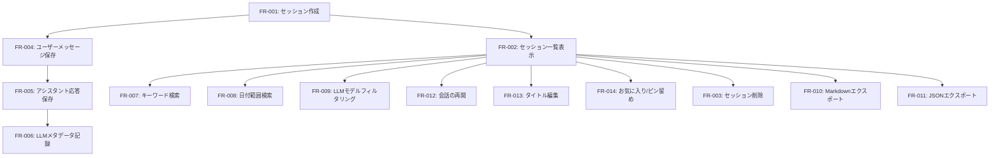

# チャット履歴永続化機能 - 機能要件定義書

## メタ情報

| 項目         | 内容                             |
| ------------ | -------------------------------- |
| ドキュメント | 機能要件定義書                   |
| タスクID     | TASK-CHAT-HISTORY-001            |
| バージョン   | 1.0.0                            |
| 作成日       | 2025-12-20                       |
| 対象         | チャット履歴永続化機能           |
| 分類方法     | MoSCoW (Must/Should/Could/Won't) |

---

## 1. 概要

### 1.1 目的

LLMベースのAIチャット機能において、ユーザーとアシスタント間の会話履歴をローカルに永続化し、過去の会話を検索・参照・再開できるようにする。

### 1.2 スコープ

- **対象**: Electronデスクトップアプリケーションのチャット機能
- **ストレージ**: Turso Embedded Replicas (libSQL)
- **UI**: チャット画面、履歴サイドバー
- **データ**: チャットセッション、個別メッセージ、LLMメタデータ

---

## 2. 機能要件

### 2.1 チャットセッション管理 (Must Have)

#### FR-001: チャットセッション自動作成

| 項目     | 内容                                                                 |
| -------- | -------------------------------------------------------------------- |
| 要件ID   | FR-001                                                               |
| 優先度   | **Must Have**                                                        |
| 説明     | 新規チャット開始時に、チャットセッションを自動的にデータベースに作成 |
| トリガー | ユーザーが新しいチャットを開始したとき                               |
| 入力     | なし（システム自動生成）                                             |
| 出力     | セッションID、作成日時、デフォルトタイトル                           |
| 制約     | セッションIDは一意であること（UUID v4）                              |

**詳細仕様**:

- セッションIDはUUID v4形式で生成
- デフォルトタイトルは「新しいチャット - YYYY-MM-DD HH:mm」形式
- 作成日時はISO 8601形式（UTC）で保存
- セッション作成と同時に初期メタデータを記録

#### FR-002: チャットセッション一覧表示

| 項目     | 内容                                                     |
| -------- | -------------------------------------------------------- |
| 要件ID   | FR-002                                                   |
| 優先度   | **Must Have**                                            |
| 説明     | 保存されたチャットセッションの一覧をサイドバーに表示     |
| トリガー | アプリ起動時、セッション作成/削除時                      |
| 入力     | なし                                                     |
| 出力     | セッション一覧（タイトル、最終更新日時、メッセージ件数） |
| 制約     | 最新順にソート、デフォルトで50件まで表示                 |

**詳細仕様**:

- 各セッション項目には以下を表示:
  - タイトル（ユーザー編集可）
  - 最終メッセージのプレビュー（最大50文字）
  - 最終更新日時（相対時間表示）
  - メッセージ数バッジ
- 無限スクロール対応（Phase 1実装、ページネーションはPhase 2で検討）
- お気に入りセッションは上部に固定表示

#### FR-003: チャットセッション削除

| 項目     | 内容                                               |
| -------- | -------------------------------------------------- |
| 要件ID   | FR-003                                             |
| 優先度   | **Must Have**                                      |
| 説明     | 選択したチャットセッションを削除                   |
| トリガー | ユーザーが削除ボタンをクリック                     |
| 入力     | セッションID                                       |
| 出力     | 削除成功/失敗のステータス                          |
| 制約     | 削除前に確認ダイアログを表示、関連メッセージも削除 |

**詳細仕様**:

- カスケード削除: セッション削除時、関連する全メッセージを削除
- 確認ダイアログには削除対象のタイトルとメッセージ件数を表示
- 削除後は一覧から即座に除外
- トランザクション処理で整合性を保証

---

### 2.2 メッセージ保存 (Must Have)

#### FR-004: ユーザーメッセージの保存

| 項目     | 内容                                                     |
| -------- | -------------------------------------------------------- |
| 要件ID   | FR-004                                                   |
| 優先度   | **Must Have**                                            |
| 説明     | ユーザーが送信したメッセージをデータベースに保存         |
| トリガー | ユーザーがメッセージを送信                               |
| 入力     | セッションID、メッセージ内容、タイムスタンプ             |
| 出力     | メッセージID、保存成功/失敗のステータス                  |
| 制約     | メッセージ内容は最大100,000文字、送信順序を記録（index） |

**詳細仕様**:

- メッセージロール: `user`
- 添付ファイルがある場合、ファイルパスまたはbase64データを保存
- メッセージインデックス（順序）を自動採番
- タイムスタンプはISO 8601形式（UTC）

#### FR-005: アシスタント応答の保存

| 項目     | 内容                                                                |
| -------- | ------------------------------------------------------------------- |
| 要件ID   | FR-005                                                              |
| 優先度   | **Must Have**                                                       |
| 説明     | LLMからのアシスタント応答をデータベースに保存                       |
| トリガー | LLMからの応答受信完了時                                             |
| 入力     | セッションID、応答内容、LLMメタデータ、タイムスタンプ               |
| 出力     | メッセージID、保存成功/失敗のステータス                             |
| 制約     | ストリーミング応答の場合は完了時に一括保存、LLMメタデータは必須記録 |

**詳細仕様**:

- メッセージロール: `assistant`
- LLMメタデータを必須で記録（FR-006参照）
- ストリーミング中は一時バッファに保持、完了後にDB保存
- エラー応答の場合もエラーメッセージを保存

#### FR-006: LLMメタデータの記録

| 項目     | 内容                                                                    |
| -------- | ----------------------------------------------------------------------- |
| 要件ID   | FR-006                                                                  |
| 優先度   | **Must Have**                                                           |
| 説明     | 各アシスタント応答に対して使用されたLLMのプロバイダー・モデル情報を記録 |
| トリガー | アシスタント応答保存時                                                  |
| 入力     | プロバイダー名、モデル名、モデルバージョン、追加メタデータ（JSON）      |
| 出力     | メタデータ記録成功/失敗のステータス                                     |
| 制約     | プロバイダー名とモデル名は必須、バージョンは任意                        |

**詳細仕様**:

- **プロバイダー名**: `openai`, `anthropic`, `google`, `xai` など
- **モデル名**: `gpt-4`, `claude-3-5-sonnet-20241022`, `gemini-pro` など
- **モデルバージョン**: 利用可能な場合は記録（例: `20241022`）
- **追加メタデータ（JSON）**:
  - `temperature`: 温度パラメータ
  - `max_tokens`: 最大トークン数
  - `top_p`: Top-p サンプリング
  - `stream`: ストリーミングモードの有無
  - `response_time_ms`: 応答時間（ミリ秒）
  - `token_usage`: トークン使用量（入力/出力）※LLMプロバイダーから取得可能な場合のみ記録

**保存例**:

```json
{
  "provider": "anthropic",
  "model": "claude-3-5-sonnet-20241022",
  "version": "20241022",
  "metadata": {
    "temperature": 0.7,
    "max_tokens": 4096,
    "stream": true,
    "response_time_ms": 1234,
    "token_usage": {
      "input_tokens": 150,
      "output_tokens": 320
    }
  }
}
```

---

### 2.3 検索機能 (Must Have)

#### FR-007: キーワード検索

| 項目     | 内容                                                     |
| -------- | -------------------------------------------------------- |
| 要件ID   | FR-007                                                   |
| 優先度   | **Must Have**                                            |
| 説明     | セッションタイトルまたはメッセージ内容をキーワードで検索 |
| トリガー | ユーザーが検索ボックスに入力                             |
| 入力     | 検索キーワード（文字列）                                 |
| 出力     | マッチしたセッション一覧                                 |
| 制約     | 部分一致検索、大文字小文字を区別しない                   |

**詳細仕様**:

- SQLite FTS5（Full-Text Search）を使用
- セッションタイトルとメッセージ内容の両方を検索対象
- ハイライト表示: マッチした箇所を強調
- 検索結果は関連度順にソート

#### FR-008: 日付範囲検索

| 項目     | 内容                                  |
| -------- | ------------------------------------- |
| 要件ID   | FR-008                                |
| 優先度   | **Should Have**                       |
| 説明     | 指定した日付範囲内のセッションを検索  |
| トリガー | ユーザーが日付フィルターを適用        |
| 入力     | 開始日、終了日                        |
| 出力     | 該当期間内のセッション一覧            |
| 制約     | 開始日 ≤ 終了日、日付はローカルタイム |

**詳細仕様**:

- カレンダーUIから日付を選択
- プリセット: 「今日」「直近7日間」「直近30日間」「カスタム」
- セッションの作成日時を基準に検索

#### FR-009: LLMモデルフィルタリング

| 項目     | 内容                                              |
| -------- | ------------------------------------------------- |
| 要件ID   | FR-009                                            |
| 優先度   | **Should Have**                                   |
| 説明     | 使用されたLLMプロバイダー・モデルでフィルタリング |
| トリガー | ユーザーがモデルフィルターを選択                  |
| 入力     | プロバイダー名、モデル名（任意）                  |
| 出力     | 該当モデルを使用したセッション一覧                |
| 制約     | プロバイダーのみ、またはモデル名でも絞り込み可    |

**詳細仕様**:

- ドロップダウンメニューから選択
- 使用実績のあるプロバイダー・モデルのみ表示
- 複数選択可能（OR条件）

---

### 2.4 エクスポート機能 (Should Have)

#### FR-010: Markdown形式エクスポート

| 項目     | 内容                                                       |
| -------- | ---------------------------------------------------------- |
| 要件ID   | FR-010                                                     |
| 優先度   | **Should Have**                                            |
| 説明     | 選択したセッションをMarkdown形式でエクスポート             |
| トリガー | ユーザーがエクスポートボタンをクリック                     |
| 入力     | セッションID、エクスポート範囲（全体/選択範囲）            |
| 出力     | Markdownファイル（.md）                                    |
| 制約     | ファイル名は「セッションタイトル\_YYYYMMDD_HHmmss.md」形式 |

**詳細仕様**:

- フォーマット:

  ```markdown
  # [セッションタイトル]

  **作成日**: YYYY-MM-DD HH:mm:ss
  **メッセージ数**: N件

  ---

  ## ユーザー (YYYY-MM-DD HH:mm:ss)

  [メッセージ内容]

  ## アシスタント (YYYY-MM-DD HH:mm:ss)

  **モデル**: [provider/model]
  [応答内容]

  ---
  ```

- コードブロックはシンタックスハイライト保持
- 添付ファイルは `` 形式でリンク

#### FR-011: JSON形式エクスポート

| 項目     | 内容                                                         |
| -------- | ------------------------------------------------------------ |
| 要件ID   | FR-011                                                       |
| 優先度   | **Should Have**                                              |
| 説明     | 選択したセッションをJSON形式でエクスポート                   |
| トリガー | ユーザーがエクスポートボタンをクリック（JSON選択時）         |
| 入力     | セッションID、エクスポート範囲（全体/選択範囲）              |
| 出力     | JSONファイル（.json）                                        |
| 制約     | ファイル名は「セッションタイトル\_YYYYMMDD_HHmmss.json」形式 |

**詳細仕様**:

- JSON Schema:
  ```json
  {
    "session_id": "uuid",
    "title": "string",
    "created_at": "ISO 8601",
    "updated_at": "ISO 8601",
    "messages": [
      {
        "message_id": "uuid",
        "role": "user | assistant",
        "content": "string",
        "timestamp": "ISO 8601",
        "llm_metadata": {
          "provider": "string",
          "model": "string",
          "version": "string",
          "metadata": {}
        }
      }
    ]
  }
  ```
- LLMメタデータを完全に含める
- Pretty print（インデント2スペース）で出力

---

### 2.5 履歴管理UI (Must Have)

#### FR-012: 過去の会話の再開

| 項目     | 内容                                               |
| -------- | -------------------------------------------------- |
| 要件ID   | FR-012                                             |
| 優先度   | **Must Have**                                      |
| 説明     | 履歴一覧から選択したセッションを再開               |
| トリガー | ユーザーがセッション項目をクリック                 |
| 入力     | セッションID                                       |
| 出力     | チャット画面に過去のメッセージ履歴を表示           |
| 制約     | メッセージは送信順に表示、新規メッセージ追加も可能 |

**詳細仕様**:

- 過去のメッセージを時系列順に復元
- スクロール位置は最下部（最新メッセージ）
- ユーザーは続きからチャット可能
- 新規メッセージは同じセッションに追加保存

#### FR-013: タイトル編集

| 項目     | 内容                                                             |
| -------- | ---------------------------------------------------------------- |
| 要件ID   | FR-013                                                           |
| 優先度   | **Should Have**                                                  |
| 説明     | セッションタイトルを編集                                         |
| トリガー | ユーザーがタイトル部分をダブルクリックまたは編集ボタンをクリック |
| 入力     | セッションID、新しいタイトル                                     |
| 出力     | 更新後のタイトル                                                 |
| 制約     | タイトルは最大100文字、空文字は不可                              |

**詳細仕様**:

- インライン編集UI（クリックでテキストボックスに変換）
- Enterキーで保存、Escキーでキャンセル
- 自動保存（フォーカスアウト時）
- バリデーション: 最大100文字、空文字の場合はデフォルトタイトルに戻す

#### FR-014: お気に入り/ピン留め

| 項目     | 内容                                             |
| -------- | ------------------------------------------------ |
| 要件ID   | FR-014                                           |
| 優先度   | **Could Have**                                   |
| 説明     | セッションをお気に入りに追加またはピン留め       |
| トリガー | ユーザーが星アイコンまたはピンアイコンをクリック |
| 入力     | セッションID、お気に入りフラグ                   |
| 出力     | 更新後のお気に入りステータス                     |
| 制約     | ピン留めセッションは一覧の上部に固定表示         |

**詳細仕様**:

- お気に入りフラグ: `is_favorite` (boolean)
- ピン留めフラグ: `is_pinned` (boolean)
- ピン留めセッションは最大10件まで
- ピン留め解除後は通常の並び順に戻る

---

## 3. 機能要件サマリー（MoSCoW分類）

| 優先度          | 要件ID                 | 概要                                                    |
| --------------- | ---------------------- | ------------------------------------------------------- |
| **Must Have**   | FR-001, FR-002, FR-003 | セッション管理（作成、一覧、削除）                      |
| **Must Have**   | FR-004, FR-005, FR-006 | メッセージ保存（ユーザー、アシスタント、LLMメタデータ） |
| **Must Have**   | FR-007                 | キーワード検索                                          |
| **Must Have**   | FR-012                 | 過去の会話の再開                                        |
| **Should Have** | FR-008, FR-009         | 日付範囲検索、LLMモデルフィルタリング                   |
| **Should Have** | FR-010, FR-011         | エクスポート（Markdown、JSON）                          |
| **Should Have** | FR-013                 | タイトル編集                                            |
| **Could Have**  | FR-014                 | お気に入り/ピン留め                                     |
| **Won't Have**  | -                      | クラウド同期、暗号化、複数デバイス共有                  |

---

## 4. 機能間の依存関係



---

## 5. 除外項目（Won't Have）

| 項目                     | 理由                                          |
| ------------------------ | --------------------------------------------- |
| クラウド同期             | フェーズ1ではローカル専用、将来拡張として検討 |
| データ暗号化             | 現段階では不要、セキュリティ要件次第で追加    |
| 複数デバイス間の履歴共有 | ローカルストレージのため対象外                |
| 会話のフォルダ分類       | タグ機能で代替可能、優先度低                  |
| 音声メッセージの保存     | テキストチャットのみ対象                      |

---

## 6. 次のステップ

- [ ] 非機能要件定義書の作成
- [ ] 受け入れ基準ドキュメントの作成
- [ ] データベーススキーマ設計（Phase 1）
- [ ] UIワイヤーフレーム作成（Phase 1）
