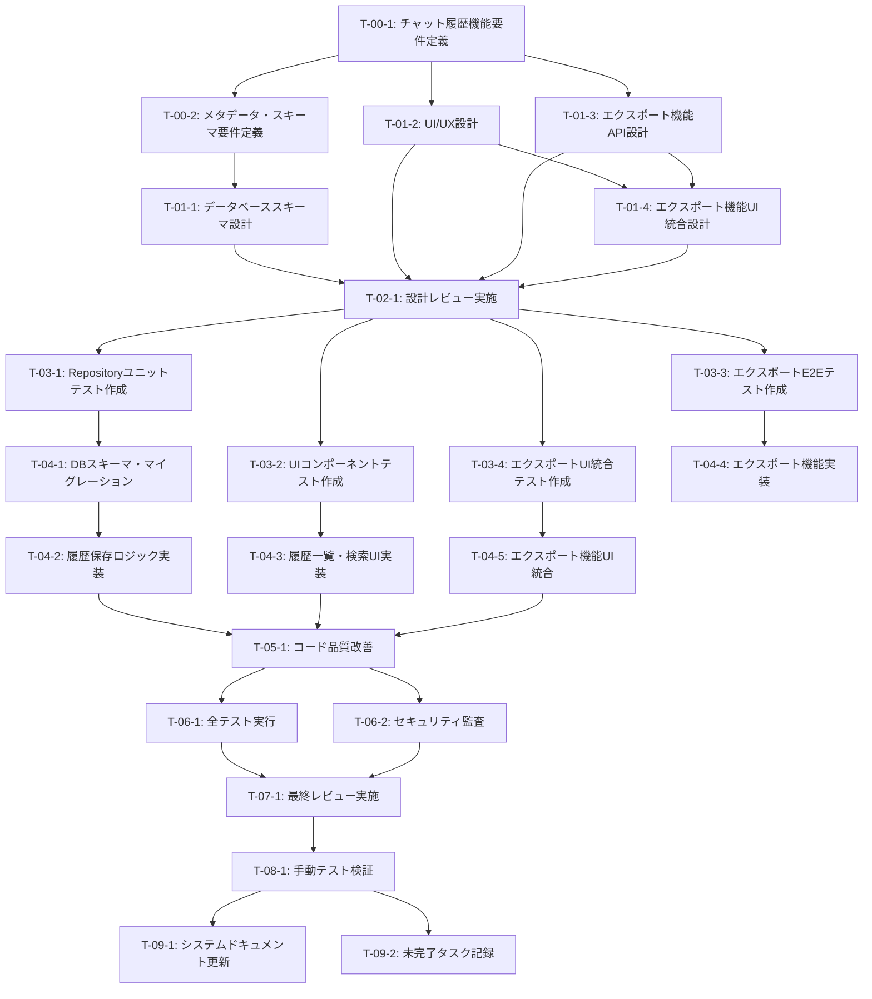

# チャット履歴永続化機能 - タスク実行仕様書

## ユーザーからの元の指示

```
チャットでのやり取りは重要な知識や成果物を含むことが多い。履歴を永続化することで、過去の会話を参照したり、ワークスペースと連携して成果物を管理できるようになる。
```

## メタ情報

| 項目             | 内容                              |
| ---------------- | --------------------------------- |
| タスクID         | TASK-CHAT-HISTORY-001             |
| タスク名         | チャット履歴永続化機能            |
| 分類             | 新規機能                          |
| 対象機能         | チャット                          |
| 優先度           | 高                                |
| 見積もり規模     | 中規模                            |
| ステータス       | 未実施                            |
| 発見元           | ユーザー要望                      |
| 発見日           | 2025-12-11                        |
| 発見エージェント | .claude/agents/product-manager.md |

---

## タスク概要

### 目的

チャット履歴をローカルデータベース（Turso Embedded Replicas）に永続化し、過去の会話を検索・参照・再開できるようにすることで、知識の蓄積とワークスペースとの連携を実現する。

### 背景

現状、チャット履歴は保存されず、セッション終了と同時に失われてしまう。AIとの対話で生成された重要な知識や成果物を再利用できないため、同じ質問を繰り返す必要があり、作業効率が低下している。

### 最終ゴール

- チャット履歴が自動的にローカルDBに保存される
- 履歴一覧画面で過去の会話を日付・キーワードで検索できる
- 過去の会話を再開し、継続して対話できる
- 履歴をMarkdown/JSON形式でエクスポートできる
- ワークスペース機能と連携し、チャットから生成された成果物を管理できる（将来対応）

### 成果物一覧

| 種別             | 成果物                                                | 配置先                                                       |
| ---------------- | ----------------------------------------------------- | ------------------------------------------------------------ |
| データベース     | chat_sessionsテーブル、chat_messagesテーブル          | packages/shared/src/db/schema/                               |
| マイグレーション | チャット履歴スキーマ作成マイグレーション              | packages/shared/drizzle/migrations/                          |
| リポジトリ       | ChatSessionRepository, ChatMessageRepository          | packages/shared/src/repositories/                            |
| ビジネスロジック | ChatHistoryService（保存、検索、エクスポート）        | packages/shared/src/features/chat-history/                   |
| UIコンポーネント | ChatHistoryList, ChatHistorySearch, ChatHistoryExport | apps/desktop/src/components/chat/                            |
| テスト           | ユニットテスト、E2Eテスト                             | packages/shared/src/\*\*/**tests**/, apps/desktop/tests/     |
| ドキュメント     | データベース設計書更新、API設計書更新                 | docs/00-requirements/15-database-design.md, 08-api-design.md |

---

## 参照ファイル

本仕様書のコマンド・エージェント・スキル選定は以下を参照：

- `docs/00-requirements/master_system_design.md` - システム要件
- `.claude/commands/ai/command_list.md` - /ai:コマンド定義
- `.claude/agents/agent_list.md` - エージェント定義
- `.claude/skills/skill_list.md` - スキル定義

---

## タスク分解サマリー

| ID     | フェーズ                    | サブタスク名                           | 責務                                     | 依存           |
| ------ | --------------------------- | -------------------------------------- | ---------------------------------------- | -------------- |
| T-00-1 | Phase 0: 要件定義           | チャット履歴機能要件定義               | 保存、検索、エクスポート機能の詳細定義   | -              |
| T-00-2 | Phase 0: 要件定義           | メタデータ・スキーマ要件定義           | 保存すべきメタデータとスキーマ構造の定義 | T-00-1         |
| T-01-1 | Phase 1: 設計               | データベーススキーマ設計               | chat_sessions/messagesテーブル設計       | T-00-2         |
| T-01-2 | Phase 1: 設計               | UI/UX設計                              | 履歴一覧・検索・エクスポートUI設計       | T-00-1         |
| T-01-3 | Phase 1: 設計               | エクスポート機能API設計                | Markdown/JSONエクスポートAPI設計         | T-00-1         |
| T-01-4 | Phase 1: 設計               | エクスポート機能UI統合設計             | ボタン配置・ダイアログ統合・IPC設計      | T-01-2, T-01-3 |
| T-02-1 | Phase 2: 設計レビューゲート | 設計レビュー実施                       | 要件充足性、DB設計妥当性の検証           | T-01-\*        |
| T-03-1 | Phase 3: テスト作成 (Red)   | Repositoryユニットテスト作成           | CRUD操作のテストケース作成               | T-02-1         |
| T-03-2 | Phase 3: テスト作成 (Red)   | UIコンポーネントテスト作成             | 履歴一覧・検索UIのテスト作成             | T-02-1         |
| T-03-3 | Phase 3: テスト作成 (Red)   | エクスポート機能E2Eテスト作成          | エクスポート機能の統合テスト作成         | T-02-1         |
| T-03-4 | Phase 3: テスト作成 (Red)   | エクスポートUI統合テスト作成           | ボタン表示・ダイアログ開閉フローテスト   | T-02-1         |
| T-04-1 | Phase 4: 実装 (Green)       | データベーススキーマ・マイグレーション | Drizzle ORMスキーマとマイグレーション    | T-03-1         |
| T-04-2 | Phase 4: 実装 (Green)       | チャット履歴保存ロジック実装           | リアルタイム保存ロジックの実装           | T-04-1         |
| T-04-3 | Phase 4: 実装 (Green)       | 履歴一覧・検索UI実装                   | React UIコンポーネント実装               | T-03-2         |
| T-04-4 | Phase 4: 実装 (Green)       | エクスポート機能実装                   | Markdown/JSONエクスポート実装            | T-03-3         |
| T-04-5 | Phase 4: 実装 (Green)       | エクスポート機能UI統合                 | チャット履歴ページへの統合               | T-03-4         |
| T-05-1 | Phase 5: リファクタリング   | コード品質改善                         | Clean Code原則に基づくリファクタリング   | T-04-\*        |
| T-06-1 | Phase 6: 品質保証           | 全テスト実行・カバレッジ確認           | 品質ゲート基準の検証                     | T-05-1         |
| T-06-2 | Phase 6: 品質保証           | セキュリティ監査                       | チャット履歴のセキュリティ検証           | T-05-1         |
| T-07-1 | Phase 7: 最終レビューゲート | 最終レビュー実施                       | コード品質・アーキテクチャ整合性の検証   | T-06-\*        |
| T-08-1 | Phase 8: 手動テスト検証     | 機能テスト・UI/UXテスト                | 実際のユーザー操作フローの検証           | T-07-1         |
| T-09-1 | Phase 9: ドキュメント更新   | システムドキュメント更新               | DB設計書、API設計書の更新                | T-08-1         |
| T-09-2 | Phase 9: 未完了タスク記録   | 未完了タスク記録                       | ワークスペース連携機能の指示書作成       | T-08-1         |

**総サブタスク数**: 22個

---

## 実行フロー図



---

## Phase 0: 要件定義

### T-00-1: チャット履歴機能要件定義

#### 目的

チャット履歴の保存、検索、エクスポート機能の詳細な要件を定義し、実装の方向性を明確にする。

#### 背景

ユーザーがチャット履歴を活用するために必要な機能を正確に把握し、過不足のない実装を行う必要がある。

#### 責務（単一責務）

チャット履歴機能全体の機能要件を定義する。

#### Claude Code スラッシュコマンド

> ⚠️ 以下はターミナルコマンドではなく、Claude Code内で実行するスラッシュコマンドです

```
/ai:gather-requirements チャット履歴永続化機能
```

- **参照**: `.claude/commands/ai/command_list.md`

#### 使用エージェント

- **エージェント**: `.claude/agents/req-analyst.md`
- **選定理由**: 要件定義の専門家であり、Karl Wiegersの要件工学手法に基づいて、機能要件と非機能要件を明確に定義できる
- **参照**: `.claude/agents/agent_list.md`

#### 活用スキル

| スキル名                                                       | 活用方法                                         |
| -------------------------------------------------------------- | ------------------------------------------------ |
| .claude/skills/requirements-engineering/SKILL.md               | MoSCoW優先度付け、曖昧性検出、要件トリアージ     |
| .claude/skills/functional-non-functional-requirements/SKILL.md | FR/NFR分類、FURPS+品質モデル、測定可能な目標定義 |
| .claude/skills/acceptance-criteria-writing/SKILL.md            | Given-When-Then形式での受け入れ基準作成          |

- **参照**: `.claude/skills/skill_list.md`

#### 成果物

| 成果物                   | パス                                                                      | 内容                                         |
| ------------------------ | ------------------------------------------------------------------------- | -------------------------------------------- |
| 機能要件定義書           | docs/30-workflows/chat-history-persistence/requirements-functional.md     | 保存、検索、エクスポート機能の詳細要件       |
| 非機能要件定義書         | docs/30-workflows/chat-history-persistence/requirements-non-functional.md | パフォーマンス、セキュリティ、ユーザビリティ |
| 受け入れ基準ドキュメント | docs/30-workflows/chat-history-persistence/acceptance-criteria.md         | Given-When-Then形式のテストシナリオ          |

#### 完了条件

- [ ] 機能要件（Must Have, Should Have, Could Have）が明確に定義されている
- [ ] 非機能要件（パフォーマンス、セキュリティ、ユーザビリティ）が定量的に記述されている
- [ ] 受け入れ基準がテスト可能な形式で記載されている
- [ ] ステークホルダー（ユーザー、開発チーム）のレビューを受けている

#### 依存関係

- **前提**: なし
- **後続**: T-00-2, T-01-2, T-01-3

---

### T-00-2: メタデータ・スキーマ要件定義

#### 目的

チャット履歴として保存すべきメタデータ（日時、使用LLM、タイトル、システムプロンプト、添付ファイル情報等）の詳細構造を定義する。

#### 背景

データベース設計の前に、保存すべき情報の粒度と構造を明確にする必要がある。

#### 責務（単一責務）

チャット履歴のメタデータとスキーマ要件を定義する。

#### Claude Code スラッシュコマンド

> ⚠️ 以下はターミナルコマンドではなく、Claude Code内で実行するスラッシュコマンドです

```
/ai:write-spec チャット履歴メタデータスキーマ
```

- **参照**: `.claude/commands/ai/command_list.md`

#### 使用エージェント

- **エージェント**: `.claude/agents/spec-writer.md`
- **選定理由**: Andrew Huntの『達人プログラマー』思想に基づき、実装可能な詳細仕様書を作成できる。メタデータの粒度と構造を明確に定義する能力が高い
- **参照**: `.claude/agents/agent_list.md`

#### 活用スキル

| スキル名                                                  | 活用方法                                         |
| --------------------------------------------------------- | ------------------------------------------------ |
| .claude/skills/technical-documentation-standards/SKILL.md | IEEE 830準拠の仕様書作成、DRY原則の適用          |
| .claude/skills/structured-writing/SKILL.md                | DITA、トピックベースライティング、モジュール構造 |

- **参照**: `.claude/skills/skill_list.md`

#### 成果物

| 成果物             | パス                                                                 | 内容                           |
| ------------------ | -------------------------------------------------------------------- | ------------------------------ |
| メタデータ仕様書   | docs/30-workflows/chat-history-persistence/metadata-specification.md | 保存するメタデータの詳細定義   |
| スキーマ要件定義書 | docs/30-workflows/chat-history-persistence/schema-requirements.md    | データベーステーブル構造の要件 |

#### 完了条件

- [ ] チャットセッションのメタデータ項目が網羅的に定義されている
- [ ] チャットメッセージのメタデータ項目が定義されている
- [ ] システムプロンプト、添付ファイル情報の保存要件が明確になっている
- [ ] スキーマ要件とT-00-1の機能要件が整合している

#### 依存関係

- **前提**: T-00-1
- **後続**: T-01-1

---

## Phase 1: 設計

### T-01-1: データベーススキーマ設計

#### 目的

Turso（SQLite）+ Drizzle ORMを使用した、chat_sessionsテーブルとchat_messagesテーブルの詳細設計を行う。

#### 背景

チャット履歴を効率的に保存・検索するために、正規化されたスキーマとインデックス戦略が必要。

#### 責務（単一責務）

データベーススキーマの設計を行う。

#### Claude Code スラッシュコマンド

> ⚠️ 以下はターミナルコマンドではなく、Claude Code内で実行するスラッシュコマンドです

```
/ai:design-database chat_sessions chat_messages
```

- **参照**: `.claude/commands/ai/command_list.md`

#### 使用エージェント

- **エージェント**: `.claude/agents/db-architect.md`
- **選定理由**: C.J.Dateのリレーショナルデータベース理論に基づき、正規化、インデックス設計、JSON活用に精通している。TursoとDrizzle ORMに最適化されたスキーマを設計できる
- **参照**: `.claude/agents/agent_list.md`

#### 活用スキル

| スキル名                                        | 活用方法                                             |
| ----------------------------------------------- | ---------------------------------------------------- |
| .claude/skills/database-normalization/SKILL.md  | 第3正規形準拠、意図的な非正規化の判断                |
| .claude/skills/indexing-strategies/SKILL.md     | B-Treeインデックス、部分インデックス、カバリング     |
| .claude/skills/json-optimization/SKILL.md       | JSON式インデックス、JSON関数最適化、SQLite JSON1拡張 |
| .claude/skills/foreign-key-constraints/SKILL.md | CASCADE動作、ソフトデリート統合、循環参照回避        |

- **参照**: `.claude/skills/skill_list.md`

#### 成果物

| 成果物                  | パス                                                                 | 内容                                 |
| ----------------------- | -------------------------------------------------------------------- | ------------------------------------ |
| スキーマ設計書          | docs/30-workflows/chat-history-persistence/database-schema-design.md | ER図、テーブル定義、インデックス戦略 |
| Drizzle ORMスキーマ定義 | packages/shared/src/db/schema/chat-history.ts                        | TypeScript型定義付きスキーマ         |

#### 完了条件

- [ ] chat_sessionsテーブルとchat_messagesテーブルの詳細設計が完了している
- [ ] 外部キー制約、インデックス戦略が明確になっている
- [ ] メタデータのJSON列設計とインデックス戦略が定義されている
- [ ] ER図がMermaid形式で作成されている
- [ ] Drizzle ORMスキーマ定義の雛形が作成されている

#### 依存関係

- **前提**: T-00-2
- **後続**: T-04-1

---

### T-01-2: UI/UX設計

#### 目的

履歴一覧画面、検索機能、エクスポートボタンのUI/UXデザインを行う。Apple HIG準拠のElectronデスクトップアプリ向けUI設計。

#### 背景

ユーザーが直感的にチャット履歴を参照・管理できるUIが必要。

#### 責務（単一責務）

チャット履歴機能のUI/UX設計を行う。

#### Claude Code スラッシュコマンド

> ⚠️ 以下はターミナルコマンドではなく、Claude Code内で実行するスラッシュコマンドです

```
/ai:create-component ChatHistoryList
/ai:create-component ChatHistorySearch
/ai:create-component ChatHistoryExport
```

- **参照**: `.claude/commands/ai/command_list.md`

#### 使用エージェント

- **エージェント**: `.claude/agents/ui-designer.md`
- **選定理由**: モジュラー設計原則、Composition パターン、デザイントークン、アクセシビリティ（WCAG）に精通し、Apple HIG準拠のUI設計を実現できる
- **代替候補**: `.claude/agents/electron-ui-dev.md`（Electron特有のUI要素が必要な場合）
- **参照**: `.claude/agents/agent_list.md`

#### 活用スキル

| スキル名                                               | 活用方法                                          |
| ------------------------------------------------------ | ------------------------------------------------- |
| .claude/skills/design-system-architecture/SKILL.md     | コンポーネント規約、デザイントークン統合          |
| .claude/skills/component-composition-patterns/SKILL.md | Slot/Compound/Controlled-Uncontrolledパターン     |
| .claude/skills/tailwind-css-patterns/SKILL.md          | カスタムユーティリティ、アクセシビリティ対応      |
| .claude/skills/accessibility-wcag/SKILL.md             | WCAG 2.1 AA準拠、ARIA、キーボードナビゲーション   |
| .claude/skills/apple-hig-guidelines/SKILL.md           | Apple HIG準拠設計、角丸・シャドウ・アニメーション |

- **参照**: `.claude/skills/skill_list.md`

#### 成果物

| 成果物               | パス                                                           | 内容                                      |
| -------------------- | -------------------------------------------------------------- | ----------------------------------------- |
| UI/UX設計書          | docs/30-workflows/chat-history-persistence/ui-ux-design.md     | ワイヤーフレーム、画面遷移図、操作フロー  |
| コンポーネント設計書 | docs/30-workflows/chat-history-persistence/component-design.md | ChatHistoryList, Search, Exportの詳細設計 |

#### 完了条件

- [ ] 履歴一覧画面のワイヤーフレームが作成されている
- [ ] 検索機能のUI設計が完了している（キーワード、日付範囲フィルター）
- [ ] エクスポート機能のUI設計が完了している（Markdown/JSON選択UI）
- [ ] Apple HIG準拠のデザインガイドラインに従っている
- [ ] アクセシビリティ（WCAG 2.1 AA）が考慮されている

#### 依存関係

- **前提**: T-00-1
- **後続**: T-03-2, T-04-3

---

### T-01-3: エクスポート機能API設計

#### 目的

チャット履歴をMarkdown/JSON形式でエクスポートするAPIエンドポイントの設計を行う。

#### 背景

履歴データを外部ツールで再利用できるように、標準的な形式でエクスポート可能にする必要がある。

#### 責務（単一責務）

エクスポート機能のAPI設計を行う。

#### Claude Code スラッシュコマンド

> ⚠️ 以下はターミナルコマンドではなく、Claude Code内で実行するスラッシュコマンドです

```
/ai:design-api chat-history-export
```

- **参照**: `.claude/commands/ai/command_list.md`

#### 使用エージェント

- **エージェント**: `.claude/agents/api-doc-writer.md`
- **選定理由**: OpenAPI 3.x仕様設計、RESTful API設計、エンドポイント定義に精通している。エクスポート機能のAPI仕様を明確に定義できる
- **参照**: `.claude/agents/agent_list.md`

#### 活用スキル

| スキル名                                          | 活用方法                                     |
| ------------------------------------------------- | -------------------------------------------- |
| .claude/skills/openapi-specification/SKILL.md     | OpenAPI 3.x仕様設計、スキーマ定義パターン    |
| .claude/skills/request-response-examples/SKILL.md | サンプルリクエスト、レスポンス、エラーケース |
| .claude/skills/api-versioning/SKILL.md            | バージョニング戦略、非推奨化、互換性維持     |

- **参照**: `.claude/skills/skill_list.md`

#### 成果物

| 成果物        | パス                                                                | 内容                                      |
| ------------- | ------------------------------------------------------------------- | ----------------------------------------- |
| API設計書     | docs/30-workflows/chat-history-persistence/api-design.md            | エンドポイント定義、リクエスト/レスポンス |
| OpenAPI仕様書 | docs/30-workflows/chat-history-persistence/openapi-chat-export.yaml | OpenAPI 3.x形式のAPI仕様                  |

#### 完了条件

- [ ] Markdown/JSONエクスポートAPIのエンドポイントが設計されている
- [ ] リクエストパラメータ（session_id、format、date_range等）が定義されている
- [ ] レスポンス形式（Markdown/JSON）が明確になっている
- [ ] エラーレスポンスが設計されている
- [ ] OpenAPI 3.x仕様書が作成されている

#### 依存関係

- **前提**: T-00-1
- **後続**: T-03-3, T-04-4

---

### T-01-4: エクスポート機能UI統合設計

#### 目的

チャット履歴ページへのエクスポートボタン配置、ダイアログ統合、ファイル保存フローの詳細設計を行う。

#### 背景

T-01-3でエクスポートAPIを設計したが、実際のユーザーフローである「ボタンクリック → ダイアログ表示 → 形式選択 → ファイル保存」の統合設計が必要。Electron IPC通信とファイル保存ダイアログの設計も含む。

#### 責務（単一責務）

エクスポート機能のUI統合設計を行う。

#### Claude Code スラッシュコマンド

> ⚠️ 以下はターミナルコマンドではなく、Claude Code内で実行するスラッシュコマンドです

```
/ai:write-spec エクスポート機能UI統合設計
```

- **参照**: `.claude/commands/ai/command_list.md`

#### 使用エージェント

- **エージェント**: `.claude/agents/ui-designer.md`
- **選定理由**: コンポーネント統合設計、状態管理設計、親子コンポーネント連携パターンに精通している。Apple HIG準拠のボタン配置・ツールバー設計が可能
- **参照**: `.claude/agents/agent_list.md`

#### 活用スキル

| スキル名                                               | 活用方法                                            |
| ------------------------------------------------------ | --------------------------------------------------- |
| .claude/skills/component-composition-patterns/SKILL.md | 親子コンポーネント連携、Props設計、状態リフティング |
| .claude/skills/state-lifting/SKILL.md                  | 状態の適切な配置レベルの決定                        |
| electron-ipc-patterns                                  | ファイル保存ダイアログのIPC設計                     |
| .claude/skills/apple-hig-guidelines/SKILL.md           | ツールバーボタン配置、アイコン選択                  |

- **参照**: `.claude/skills/skill_list.md`

#### 成果物

| 成果物             | パス                                                                     | 内容                                           |
| ------------------ | ------------------------------------------------------------------------ | ---------------------------------------------- |
| UI統合設計書       | docs/30-workflows/chat-history-persistence/ui-integration-design.md      | ボタン配置、状態管理、イベントフローの詳細設計 |
| Electron IPC設計書 | docs/30-workflows/chat-history-persistence/electron-ipc-export-design.md | ファイル保存ダイアログのIPC通信設計            |

#### 完了条件

- [ ] エクスポートボタンの配置場所が決定されている（ヘッダー/ツールバー/セッションアイテム等）
- [ ] ダイアログの表示/非表示制御の状態管理設計が完了している
- [ ] onExportハンドラーのフロー設計が完了している（ChatHistoryService呼び出し → Electron IPC → ファイル保存）
- [ ] エラーハンドリングの設計が完了している
- [ ] Apple HIG準拠のUI設計になっている
- [ ] Electron IPCハンドラーの設計が完了している

#### 依存関係

- **前提**: T-01-2, T-01-3
- **後続**: T-02-1

---

## Phase 2: 設計レビューゲート

### T-02-1: 設計レビュー実施

#### 目的

実装開始前に、要件・設計の妥当性を複数エージェントで検証し、問題を早期発見する。

#### 背景

設計ミスが実装後に発見されると修正コストが大幅に増加する。「Shift Left」原則に基づき、問題を可能な限り早期に検出する。

#### レビュー参加エージェント

| エージェント                     | レビュー観点           | 選定理由                                                   |
| -------------------------------- | ---------------------- | ---------------------------------------------------------- |
| `.claude/agents/req-analyst.md`  | 要件充足性             | 要件が明確かつ検証可能か、スコープが適切に定義されているか |
| `.claude/agents/arch-police.md`  | アーキテクチャ整合性   | Clean Architectureレイヤー違反、依存関係逆転の原則遵守     |
| `.claude/agents/db-architect.md` | データベース設計妥当性 | 正規化、インデックス設計、パフォーマンス影響               |
| `.claude/agents/ui-designer.md`  | UI/UX設計              | アクセシビリティ、ユーザビリティ、デザインシステム整合性   |
| `.claude/agents/sec-auditor.md`  | セキュリティ設計       | セキュリティ上の考慮漏れ、データ保護の方針                 |

- **参照**: `.claude/agents/agent_list.md`

#### レビューチェックリスト

**要件充足性** (`.claude/agents/req-analyst.md`)

- [ ] 要件が明確かつ検証可能か
- [ ] スコープが適切に定義されているか
- [ ] 受け入れ基準が具体的か

**アーキテクチャ整合性** (`.claude/agents/arch-police.md`)

- [ ] クリーンアーキテクチャのレイヤー違反がないか
- [ ] 依存関係逆転の原則(DIP)が守られているか
- [ ] 既存設計との整合性があるか

**データベース設計妥当性** (`.claude/agents/db-architect.md`)

- [ ] 正規化が適切か
- [ ] インデックス設計が考慮されているか
- [ ] パフォーマンス影響が検討されているか

**UI/UX設計** (`.claude/agents/ui-designer.md`)

- [ ] アクセシビリティ（WCAG 2.1 AA）が考慮されているか
- [ ] ユーザビリティが確保されているか
- [ ] デザインシステムとの整合性があるか

**セキュリティ設計** (`.claude/agents/sec-auditor.md`)

- [ ] セキュリティ上の考慮漏れがないか
- [ ] データ保護の方針が明確か
- [ ] 個人情報の取り扱いが適切か

#### レビュー結果判定

- **PASS**: 全レビュー観点で問題なし → Phase 3へ進行
- **MINOR**: 軽微な指摘あり → 指摘対応後Phase 3へ進行
- **MAJOR**: 重大な問題あり → 影響範囲に応じて戻り先を決定

#### 戻り先決定基準

| 問題の種類 | 戻り先              |
| ---------- | ------------------- |
| 要件の問題 | Phase 0（要件定義） |
| 設計の問題 | Phase 1（設計）     |
| 両方の問題 | Phase 0（要件定義） |

#### 実装状況（2025-12-22）

**✅ 完了した項目:**

1. **5つのエージェントによるレビュー実施**
   - .claude/agents/req-analyst.md: 要件充足性レビュー（判定: MINOR → PASS）
   - .claude/agents/arch-police.md: アーキテクチャ整合性レビュー（判定: MINOR → PASS）
   - .claude/agents/db-architect.md: データベース設計妥当性レビュー（判定: MAJOR → PASS）
   - .claude/agents/ui-designer.md: UI/UX設計レビュー（判定: MINOR → PASS）
   - .claude/agents/sec-auditor.md: セキュリティ設計レビュー（判定: MINOR → PASS）

2. **レビュー指摘事項の修正**
   - ✅ データベースカバリングインデックス追加: `idx_chat_messages_session_timestamp`
   - ✅ IPCチャネル定数の作成: `packages/shared/src/ipc/channels.ts`
   - ✅ FR-002の曖昧性解消: 無限スクロール選択を明記
   - ✅ AC-028の警告メッセージ詳細化
   - ✅ AC-023aの追加: 1,000件超のエクスポート警告仕様
   - ✅ token_usageの任意性を明記
   - ✅ コントラスト比の実測値追加（16.1:1, 4.6:1等）
   - ✅ フォーカススタイルの詳細化
   - ✅ アニメーション仕様へのTailwindクラス追加
   - ✅ ファイルサイズ制限の具体値定義（100MB）

3. **レビュー結果文書の作成**
   - ✅ `docs/30-workflows/chat-history-persistence/review-results.md`
   - 5つのエージェントの判定、修正内容、次のステップを統合

**総合判定**: **PASS（全レビュー観点で承認）**

**次のステップ**: Phase 3（テスト作成）へ進行可能

#### 完了条件

- [x] 全レビュー観点のチェックリストが完了している
- [x] レビュー結果が文書化されている
- [x] 指摘事項が対応されている（MINOR/MAJORの場合）
- [x] レビュー参加者全員の承認が得られている

#### 依存関係

- **前提**: T-01-1, T-01-2, T-01-3, T-01-4
- **後続**: T-03-1, T-03-2, T-03-3, T-03-4

---

## Phase 3: テスト作成 (TDD: Red)

### T-03-1: Repositoryユニットテスト作成

#### 目的

ChatSessionRepository、ChatMessageRepositoryのCRUD操作を検証するテストを実装より先に作成する。

#### 背景

テストファーストにより、期待される動作を明確にし、実装の品質を保証する。

#### 責務（単一責務）

Repositoryレイヤーのユニットテストを作成する。

#### Claude Code スラッシュコマンド

> ⚠️ 以下はターミナルコマンドではなく、Claude Code内で実行するスラッシュコマンドです

```
/ai:generate-unit-tests packages/shared/src/repositories/chat-session-repository.ts
/ai:generate-unit-tests packages/shared/src/repositories/chat-message-repository.ts
```

- **参照**: `.claude/commands/ai/command_list.md`

#### 使用エージェント

- **エージェント**: `.claude/agents/unit-tester.md`
- **選定理由**: Kent BeckのTDD原則に基づき、Red-Green-Refactorサイクルを実践できる。境界値分析とモック活用に精通
- **参照**: `.claude/agents/agent_list.md`

#### 活用スキル

| スキル名                                        | 活用方法                                     |
| ----------------------------------------------- | -------------------------------------------- |
| .claude/skills/tdd-principles/SKILL.md          | Red-Green-Refactorサイクル、テストファースト |
| .claude/skills/test-doubles/SKILL.md            | Mock、Stub、Spy、Fakeの使い分け              |
| .claude/skills/vitest-advanced/SKILL.md         | テスト構造、モッキング、非同期テスト         |
| .claude/skills/boundary-value-analysis/SKILL.md | 境界値テスト、等価分割、エッジケース網羅     |

- **参照**: `.claude/skills/skill_list.md`

#### 成果物

| 成果物                      | パス                                                                       | 内容                             |
| --------------------------- | -------------------------------------------------------------------------- | -------------------------------- |
| ChatSessionRepositoryテスト | packages/shared/src/repositories/**tests**/chat-session-repository.test.ts | CRUD操作、検索機能のテスト       |
| ChatMessageRepositoryテスト | packages/shared/src/repositories/**tests**/chat-message-repository.test.ts | CRUD操作、メッセージ取得のテスト |

#### TDD検証: Red状態確認

```bash
pnpm --filter @repo/shared test:run
```

- [ ] テストが失敗することを確認（Red状態）

#### 完了条件

- [ ] ChatSessionRepositoryの全CRUD操作にテストがある
- [ ] ChatMessageRepositoryの全CRUD操作にテストがある
- [ ] 境界値・異常系のテストケースが含まれている
- [ ] テストが実行され、失敗（Red）が確認されている

#### 依存関係

- **前提**: T-02-1
- **後続**: T-04-1

---

### T-03-2: UIコンポーネントテスト作成

#### 目的

ChatHistoryList、ChatHistorySearch、ChatHistoryExportコンポーネントのReact Testing Libraryによるテストを作成する。

#### 背景

UIコンポーネントのユーザー操作、レンダリング、状態管理を検証するテストが必要。

#### 責務（単一責務）

UIコンポーネントのテストを作成する。

#### Claude Code スラッシュコマンド

> ⚠️ 以下はターミナルコマンドではなく、Claude Code内で実行するスラッシュコマンドです

```
/ai:generate-unit-tests apps/desktop/src/components/chat/ChatHistoryList.tsx
/ai:generate-unit-tests apps/desktop/src/components/chat/ChatHistorySearch.tsx
/ai:generate-unit-tests apps/desktop/src/components/chat/ChatHistoryExport.tsx
```

- **参照**: `.claude/commands/ai/command_list.md`

#### 使用エージェント

- **エージェント**: `.claude/agents/frontend-tester.md`
- **選定理由**: Kent C. DoddsのTesting Library哲学に基づき、ユーザー視点のテストを作成できる。React Testing Library、アクセシビリティテストに精通
- **参照**: `.claude/agents/agent_list.md`

#### 活用スキル

| スキル名                             | 活用方法                             |
| ------------------------------------ | ------------------------------------ |
| react-testing-library                | ユーザー視点のテスト、role/label活用 |
| accessibility-testing                | axe-core、WCAG 2.1 AA準拠テスト      |
| .claude/skills/test-doubles/SKILL.md | MSWによるAPIモック                   |

- **参照**: `.claude/skills/skill_list.md`

#### 成果物

| 成果物                  | パス                                                                  | 内容                                   |
| ----------------------- | --------------------------------------------------------------------- | -------------------------------------- |
| ChatHistoryListテスト   | apps/desktop/src/components/chat/**tests**/ChatHistoryList.test.tsx   | 一覧表示、ページング、選択操作のテスト |
| ChatHistorySearchテスト | apps/desktop/src/components/chat/**tests**/ChatHistorySearch.test.tsx | 検索入力、フィルタリング、結果表示     |
| ChatHistoryExportテスト | apps/desktop/src/components/chat/**tests**/ChatHistoryExport.test.tsx | エクスポート形式選択、ダウンロード     |

#### TDD検証: Red状態確認

```bash
pnpm --filter @repo/desktop test:run
```

- [ ] テストが失敗することを確認（Red状態）

#### 完了条件

- [ ] 各コンポーネントのユーザー操作テストが作成されている
- [ ] アクセシビリティテスト（axe-core）が含まれている
- [ ] テストが実行され、失敗（Red）が確認されている

#### 依存関係

- **前提**: T-02-1
- **後続**: T-04-3

---

### T-03-3: エクスポート機能E2Eテスト作成

#### 目的

Playwrightを使用した、チャット履歴エクスポート機能の統合テストシナリオを作成する。

#### 背景

実際のユーザーフロー（履歴選択 → エクスポート形式選択 → ダウンロード）を検証するE2Eテストが必要。

#### 責務（単一責務）

エクスポート機能のE2Eテストを作成する。

#### Claude Code スラッシュコマンド

> ⚠️ 以下はターミナルコマンドではなく、Claude Code内で実行するスラッシュコマンドです

```
/ai:generate-e2e-tests チャット履歴エクスポート
```

- **参照**: `.claude/commands/ai/command_list.md`

#### 使用エージェント

- **エージェント**: `.claude/agents/e2e-tester.md`
- **選定理由**: Gleb BahmutovのE2Eテスト手法に基づき、フレーキーテスト防止、Playwright活用に精通している
- **参照**: `.claude/agents/agent_list.md`

#### 活用スキル

| スキル名                                      | 活用方法                                   |
| --------------------------------------------- | ------------------------------------------ |
| .claude/skills/playwright-testing/SKILL.md    | Playwrightブラウザ自動化、セレクタ戦略     |
| .claude/skills/test-data-management/SKILL.md  | Seeding、Teardown、テストデータ分離        |
| .claude/skills/flaky-test-prevention/SKILL.md | リトライロジック、明示的待機、非決定性排除 |

- **参照**: `.claude/skills/skill_list.md`

#### 成果物

| 成果物                | パス                                               | 内容                                 |
| --------------------- | -------------------------------------------------- | ------------------------------------ |
| エクスポートE2Eテスト | apps/desktop/tests/e2e/chat-history-export.spec.ts | エクスポート機能の統合テストシナリオ |

#### TDD検証: Red状態確認

```bash
pnpm --filter @repo/desktop test:e2e
```

- [ ] テストが失敗することを確認（Red状態）

#### 完了条件

- [ ] Markdown/JSONエクスポートのE2Eテストシナリオが作成されている
- [ ] ダウンロードファイルの検証が含まれている
- [ ] テストが実行され、失敗（Red）が確認されている

#### 依存関係

- **前提**: T-02-1
- **後続**: T-04-4

---

### T-03-4: エクスポート機能UI統合テスト作成

#### 目的

チャット履歴ページへのエクスポート機能統合に関するE2Eテストを作成する。エクスポートボタンの表示、ダイアログ開閉、ファイル保存フローを検証する。

#### 背景

T-03-3でエクスポートダイアログのE2Eテストを作成したが、チャット履歴ページからのトリガー（エクスポートボタンクリック → ダイアログ表示）の統合テストが必要。

#### 責務（単一責務）

エクスポート機能のUI統合テストを作成する。

#### Claude Code スラッシュコマンド

> ⚠️ 以下はターミナルコマンドではなく、Claude Code内で実行するスラッシュコマンドです

```
/ai:generate-e2e-tests チャット履歴エクスポートUI統合
```

- **参照**: `.claude/commands/ai/command_list.md`

#### 使用エージェント

- **エージェント**: `.claude/agents/e2e-tester.md`
- **選定理由**: Gleb BahmutovのE2Eテスト手法に基づき、UI統合テスト、Playwright活用、フレーキーテスト防止に精通している
- **参照**: `.claude/agents/agent_list.md`

#### 活用スキル

| スキル名                                      | 活用方法                                                 |
| --------------------------------------------- | -------------------------------------------------------- |
| .claude/skills/playwright-testing/SKILL.md    | Playwrightブラウザ自動化、ボタンクリック、ダイアログ検証 |
| .claude/skills/flaky-test-prevention/SKILL.md | 明示的待機、要素の可視性確認、非決定性排除               |
| accessibility-testing                         | キーボードナビゲーション、ARIA属性検証                   |

- **参照**: `.claude/skills/skill_list.md`

#### 成果物

| 成果物                        | パス                                         | 内容                                                 |
| ----------------------------- | -------------------------------------------- | ---------------------------------------------------- |
| UI統合E2Eテスト（T-03-3拡張） | apps/desktop/e2e/chat-history-export.spec.ts | エクスポートボタンからダイアログ表示までのフロー検証 |

#### テスト観点

1. **エクスポートボタンの表示**
   - チャット履歴ページにエクスポートボタンが表示されること
   - ボタンにDownloadアイコンが含まれること
   - ボタンにaria-label="エクスポート"が設定されていること

2. **ダイアログの開閉**
   - エクスポートボタンクリックでダイアログが開くこと
   - ダイアログにrole="dialog"が設定されていること
   - キャンセルボタンでダイアログが閉じること
   - Escapeキーでダイアログが閉じること

3. **統合フロー**
   - セッション情報がダイアログに正しく渡されること
   - エクスポート実行後にダイアログが閉じること

#### TDD検証: Red状態確認

```bash
pnpm --filter @repo/desktop test:e2e -- chat-history-export
```

- [ ] テストが失敗することを確認（Red状態）

#### 完了条件

- [ ] エクスポートボタン表示のテストが作成されている
- [ ] ボタンクリック→ダイアログ表示のテストが作成されている
- [ ] ダイアログ開閉フローのテストが作成されている
- [ ] テストが実行され、失敗（Red）が確認されている

#### 依存関係

- **前提**: T-02-1
- **後続**: T-04-5

---

## Phase 4: 実装 (TDD: Green)

### T-04-1: データベーススキーマ・マイグレーション実装

#### 目的

Drizzle ORMを使用したchat_sessions/messagesテーブルのスキーマ定義とマイグレーションファイルを実装する。

#### 背景

T-01-1で設計したスキーマを実際のコードとして実装し、マイグレーション可能にする。

#### 責務（単一責務）

データベーススキーマとマイグレーションを実装する。

#### Claude Code スラッシュコマンド

> ⚠️ 以下はターミナルコマンドではなく、Claude Code内で実行するスラッシュコマンドです

```
/ai:create-db-schema chat_sessions
/ai:create-db-schema chat_messages
/ai:create-migration チャット履歴テーブル作成
```

- **参照**: `.claude/commands/ai/command_list.md`

#### 使用エージェント

- **エージェント**: `.claude/agents/repo-dev.md`
- **選定理由**: Vlad MihalceaのORM最適化手法に基づき、Drizzle ORMの効率的利用、データアクセス層実装に精通している
- **参照**: `.claude/agents/agent_list.md`

#### 活用スキル

| スキル名                                    | 活用方法                                      |
| ------------------------------------------- | --------------------------------------------- |
| .claude/skills/database-migrations/SKILL.md | Drizzle Kit、ゼロダウンタイムマイグレーション |
| .claude/skills/orm-best-practices/SKILL.md  | Drizzle ORMの効率的利用、Raw SQLとの使い分け  |

- **参照**: `.claude/skills/skill_list.md`

#### 成果物

| 成果物                   | パス                                                            | 内容                    |
| ------------------------ | --------------------------------------------------------------- | ----------------------- |
| チャット履歴スキーマ     | packages/shared/src/db/schema/chat-history.ts                   | Drizzle ORMスキーマ定義 |
| マイグレーションファイル | packages/shared/drizzle/migrations/0001_create_chat_history.sql | SQLマイグレーション     |

#### TDD検証: Green状態確認

```bash
pnpm --filter @repo/shared test:run
```

- [ ] テストが成功することを確認（Green状態）

#### 完了条件

- [ ] chat_sessionsテーブルのDrizzle ORMスキーマが実装されている
- [ ] chat_messagesテーブルのDrizzle ORMスキーマが実装されている
- [ ] マイグレーションファイルが生成されている
- [ ] T-03-1のテストが成功している

#### 依存関係

- **前提**: T-03-1
- **後続**: T-04-2

---

### T-04-2: チャット履歴保存ロジック実装

#### 目的

チャットメッセージをリアルタイムでデータベースに保存するビジネスロジックを実装する。

#### 背景

ユーザーとAIの対話をリアルタイムに保存し、セッション情報とメッセージを関連付ける。

#### 責務（単一責務）

チャット履歴保存ロジックを実装する。

#### Claude Code スラッシュコマンド

> ⚠️ 以下はターミナルコマンドではなく、Claude Code内で実行するスラッシュコマンドです

```
/ai:implement-business-logic chat-history-save
```

- **参照**: `.claude/commands/ai/command_list.md`

#### 使用エージェント

- **エージェント**: `.claude/agents/logic-dev.md`
- **選定理由**: Martin Fowlerのリファクタリング手法に基づき、可読性の高いビジネスロジック実装、テスト駆動開発に精通している
- **参照**: `.claude/agents/agent_list.md`

#### 活用スキル

| スキル名                                     | 活用方法                               |
| -------------------------------------------- | -------------------------------------- |
| .claude/skills/clean-code-practices/SKILL.md | 意味のある命名、小さな関数、DRY原則    |
| .claude/skills/transaction-script/SKILL.md   | シンプルな手続き型ロジック、適切な粒度 |
| .claude/skills/test-doubles/SKILL.md         | Mock、Stub、Spyの使い分け              |

- **参照**: `.claude/skills/skill_list.md`

#### 成果物

| 成果物                | パス                                                              | 内容                                       |
| --------------------- | ----------------------------------------------------------------- | ------------------------------------------ |
| ChatHistoryService    | packages/shared/src/features/chat-history/chat-history-service.ts | 保存、検索、エクスポートのビジネスロジック |
| ChatSessionRepository | packages/shared/src/repositories/chat-session-repository.ts       | セッションCRUD操作                         |
| ChatMessageRepository | packages/shared/src/repositories/chat-message-repository.ts       | メッセージCRUD操作                         |

#### TDD検証: Green状態確認

```bash
pnpm --filter @repo/shared test:run
```

- [ ] テストが成功することを確認（Green状態）

#### 完了条件

- [ ] ChatHistoryServiceが実装されている
- [ ] リアルタイム保存ロジックが実装されている
- [ ] T-03-1のテストが全て成功している

#### 依存関係

- **前提**: T-04-1
- **後続**: T-05-1

---

### T-04-3: 履歴一覧・検索UI実装

#### 目的

ChatHistoryList、ChatHistorySearchコンポーネントをReact + Tailwind CSSで実装する。

#### 背景

T-01-2で設計したUI/UXを実際のReactコンポーネントとして実装する。

#### 責務（単一責務）

履歴一覧・検索UIを実装する。

#### Claude Code スラッシュコマンド

> ⚠️ 以下はターミナルコマンドではなく、Claude Code内で実行するスラッシュコマンドです

```
/ai:create-component ChatHistoryList organism
/ai:create-component ChatHistorySearch molecule
```

- **参照**: `.claude/commands/ai/command_list.md`

#### 使用エージェント

- **エージェント**: `.claude/agents/ui-designer.md`
- **選定理由**: モジュラー設計、Compositionパターン、Tailwind CSS、WCAG準拠UIの実装に精通している
- **参照**: `.claude/agents/agent_list.md`

#### 活用スキル

| スキル名                                               | 活用方法                                        |
| ------------------------------------------------------ | ----------------------------------------------- |
| .claude/skills/component-composition-patterns/SKILL.md | Slot/Compound/Controlled-Uncontrolledパターン   |
| .claude/skills/tailwind-css-patterns/SKILL.md          | カスタムユーティリティ、アクセシビリティ対応    |
| .claude/skills/accessibility-wcag/SKILL.md             | WCAG 2.1 AA準拠、ARIA、キーボードナビゲーション |

- **参照**: `.claude/skills/skill_list.md`

#### 成果物

| 成果物            | パス                                                   | 内容                       |
| ----------------- | ------------------------------------------------------ | -------------------------- |
| ChatHistoryList   | apps/desktop/src/components/chat/ChatHistoryList.tsx   | 履歴一覧表示コンポーネント |
| ChatHistorySearch | apps/desktop/src/components/chat/ChatHistorySearch.tsx | 履歴検索コンポーネント     |

#### TDD検証: Green状態確認

```bash
pnpm --filter @repo/desktop test:run
```

- [ ] テストが成功することを確認（Green状態）

#### 完了条件

- [ ] ChatHistoryListコンポーネントが実装されている
- [ ] ChatHistorySearchコンポーネントが実装されている
- [ ] WCAG 2.1 AA準拠が確認されている
- [ ] T-03-2のテストが全て成功している

#### 依存関係

- **前提**: T-03-2
- **後続**: T-05-1

---

### T-04-4: エクスポート機能実装

#### 目的

チャット履歴をMarkdown/JSON形式でエクスポートする機能を実装する。

#### 背景

T-01-3で設計したエクスポートAPIとUIを実装し、履歴データを外部利用可能にする。

#### 責務（単一責務）

エクスポート機能を実装する。

#### Claude Code スラッシュコマンド

> ⚠️ 以下はターミナルコマンドではなく、Claude Code内で実行するスラッシュコマンドです

```
/ai:implement-business-logic chat-history-export
/ai:create-component ChatHistoryExport molecule
```

- **参照**: `.claude/commands/ai/command_list.md`

#### 使用エージェント

- **エージェント**: `.claude/agents/logic-dev.md`
- **選定理由**: ビジネスロジック実装、ファイル生成処理、テスト駆動開発に精通している
- **参照**: `.claude/agents/agent_list.md`

#### 活用スキル

| スキル名                                     | 活用方法                            |
| -------------------------------------------- | ----------------------------------- |
| .claude/skills/clean-code-practices/SKILL.md | 意味のある命名、小さな関数、DRY原則 |
| .claude/skills/transaction-script/SKILL.md   | シンプルな手続き型ロジック          |

- **参照**: `.claude/skills/skill_list.md`

#### 成果物

| 成果物              | パス                                                               | 内容                              |
| ------------------- | ------------------------------------------------------------------ | --------------------------------- |
| ChatHistoryExporter | packages/shared/src/features/chat-history/chat-history-exporter.ts | Markdown/JSONエクスポートロジック |
| ChatHistoryExport   | apps/desktop/src/components/chat/ChatHistoryExport.tsx             | エクスポートUIコンポーネント      |

#### TDD検証: Green状態確認

```bash
pnpm --filter @repo/desktop test:e2e
```

- [ ] テストが成功することを確認（Green状態）

#### 完了条件

- [x] Markdown形式エクスポートが実装されている（ChatHistoryServiceに既存）
- [x] JSON形式エクスポートが実装されている（ChatHistoryServiceに既存）
- [x] ChatHistoryExportコンポーネントが実装されている
- [x] ユニットテスト（37件）が全て成功している
- [ ] T-03-3のE2Eテストが全て成功している（UI統合待ち）

#### 実装状況（2025-12-21）

**✅ 完了した項目:**

1. **型定義の追加** (apps/desktop/src/components/chat/types.ts)
   - ExportFormat型: "markdown" | "json"
   - ExportRange型: "all" | "selected"
   - ExportOptions型: format, range, selectedMessageIds
   - ChatHistoryExportProps型の定義

2. **ChatHistoryExportコンポーネント実装** (apps/desktop/src/components/chat/ChatHistoryExport.tsx)
   - フォーマット選択UI（Markdown/JSON）
   - 範囲選択UI（全メッセージ/選択範囲）
   - エラー表示・ローディング状態
   - WCAG 2.1 AA準拠（フォーカストラップ、キーボードナビゲーション、ARIA属性）
   - Apple HIG準拠デザイン
   - Escapeキーでダイアログクローズ
   - オーバーレイクリックでクローズ

3. **エクスポートの追加** (apps/desktop/src/components/chat/index.ts)
   - ChatHistoryExportコンポーネントのエクスポート
   - 関連型のエクスポート

4. **ユニットテスト成功**
   - 全37件のテストケースが成功
   - フォーマット選択、範囲選択、エクスポート実行のテスト
   - エラーハンドリング、アクセシビリティのテスト

**❌ E2Eテスト失敗の原因:**

E2Eテストは以下のコードを前提としていますが、この統合がまだ完了していません：

```typescript
// e2e/chat-history-export.spec.ts:112
await page.goto(`/chat/history/${TEST_SESSION.id}`);
await page.getByRole("button", { name: /エクスポート/i }).click();
```

**失敗理由:**

- ChatHistoryExportコンポーネントは独立して実装済み
- しかし、チャット履歴ページ（`/chat/history/${sessionId}`）への統合がまだ完了していない
- ページに「エクスポート」ボタンが存在しないため、E2Eテストがタイムアウト

#### 次のステップ（追加タスク）

T-04-4で実装したChatHistoryExportコンポーネントをチャット履歴UIに統合する必要があります：

**必要な追加実装:**

1. **チャット履歴ページへのエクスポートボタン追加**
   - 配置場所: ChatHistoryListまたはチャット履歴ページのヘッダー/ツールバー
   - UI: "エクスポート"ボタン（Download アイコン付き）
   - アクセシビリティ: role="button", aria-label="エクスポート"

2. **エクスポートダイアログの表示制御**
   - ボタンクリック時にChatHistoryExportダイアログを表示
   - useState でダイアログの開閉状態を管理
   - 選択されたセッションIDの管理

3. **onExportハンドラーの実装**
   - ChatHistoryServiceの`exportToMarkdown`/`exportToJson`メソッド呼び出し
   - ファイルダウンロード処理（Electronの`dialog.showSaveDialog`使用）
   - エクスポート完了後のダイアログクローズ
   - エラーハンドリング

4. **E2Eテストの再実行**
   - 統合完了後、`pnpm --filter @repo/desktop test:e2e -- chat-history-export`
   - 全12件のE2Eテストケースが成功することを確認

**推奨される次タスクID: T-04-5**

```
名称: エクスポート機能のUI統合
目的: ChatHistoryExportコンポーネントをチャット履歴ページに統合し、E2Eテストを成功させる
成果物:
  - チャット履歴ページへのエクスポートボタン追加
  - onExportハンドラーの実装
  - E2Eテスト成功確認
```

#### 依存関係

- **前提**: T-03-3
- **後続**: T-04-5（UI統合タスク - 新規）, T-05-1

---

### T-04-5: エクスポート機能UI統合

#### 目的

T-04-4で実装したChatHistoryExportコンポーネントをチャット履歴ページに統合し、E2Eテストを成功させる。

#### 背景

ChatHistoryExportコンポーネントは独立して完成しているが、チャット履歴ページ（`/chat/history/${sessionId}`）への統合が未完了。E2Eテストはページに「エクスポート」ボタンが存在することを前提としているため、統合を完了させる必要がある。

#### 責務（単一責務）

エクスポート機能をチャット履歴UIに統合する。

#### Claude Code スラッシュコマンド

> ⚠️ 以下はターミナルコマンドではなく、Claude Code内で実行するスラッシュコマンドです

**注**: このタスクは既存ページコンポーネントへの機能追加のため、専用のスラッシュコマンドは使用せず、エージェント `.claude/agents/ui-designer.md` が T-01-4 の設計書と T-03-4 のテストに基づいて直接実装を行います。

必要に応じて以下のコマンドを使用：

```
/ai:write-spec エクスポート機能UI統合実装（実装詳細仕様が必要な場合）
```

- **参照**: `.claude/commands/ai/command_list.md`

#### 使用エージェント

- **エージェント**: `.claude/agents/ui-designer.md`
- **選定理由**: React UIコンポーネント統合、状態管理、親子コンポーネント連携に精通している
- **参照**: `.claude/agents/agent_list.md`

#### 活用スキル

| スキル名                                               | 活用方法                                      |
| ------------------------------------------------------ | --------------------------------------------- |
| .claude/skills/component-composition-patterns/SKILL.md | 親子コンポーネント連携、Propsバケツリレー回避 |
| .claude/skills/state-lifting/SKILL.md                  | 状態の適切な配置、イベントハンドラーの設計    |
| electron-ipc-patterns                                  | ファイル保存ダイアログの呼び出し、IPC通信     |

- **参照**: `.claude/skills/skill_list.md`

#### 成果物

| 成果物                     | パス                                                 | 内容                                   |
| -------------------------- | ---------------------------------------------------- | -------------------------------------- |
| チャット履歴ページ統合     | apps/desktop/src/pages/chat-history/[id].tsx（予想） | エクスポートボタン追加、ダイアログ統合 |
| エクスポートハンドラー実装 | 同上                                                 | onExport実装、ファイル保存処理         |

#### 必要な実装詳細

1. **エクスポートボタンの追加**
   - 配置: チャット履歴ページのヘッダーまたはツールバー
   - UI: `<button role="button" aria-label="エクスポート">エクスポート</button>`
   - アイコン: lucide-react の `Download`

2. **ダイアログ表示制御**

   ```typescript
   const [showExportDialog, setShowExportDialog] = useState(false);
   ```

3. **onExportハンドラー実装**

   ```typescript
   const handleExport = async (options: ExportOptions) => {
     // 1. ChatHistoryServiceからデータ取得
     const service = new ChatHistoryService(/* deps */);
     const content =
       options.format === "markdown"
         ? await service.exportToMarkdown(sessionId, options)
         : await service.exportToJson(sessionId, options);

     // 2. Electronファイル保存ダイアログ
     const result = await window.electron.dialog.showSaveDialog({
       defaultPath: `chat-${sessionId}.${options.format === "markdown" ? "md" : "json"}`,
     });

     // 3. ファイル書き込み
     if (!result.canceled) {
       await window.electron.fs.writeFile(result.filePath, content);
     }

     // 4. ダイアログクローズ
     setShowExportDialog(false);
   };
   ```

4. **ChatHistoryExportコンポーネントの統合**
   ```tsx
   {
     showExportDialog && (
       <ChatHistoryExport
         session={session}
         onExport={handleExport}
         onClose={() => setShowExportDialog(false)}
       />
     );
   }
   ```

#### TDD検証: Green状態確認

```bash
pnpm --filter @repo/desktop test:e2e -- chat-history-export
```

- [ ] E2Eテスト全12件が成功することを確認（Green状態）

#### 完了条件

- [ ] チャット履歴ページに「エクスポート」ボタンが追加されている
- [ ] ボタンクリックでChatHistoryExportダイアログが表示される
- [ ] onExportハンドラーが実装されている
- [ ] ファイル保存ダイアログが正しく動作する
- [ ] Markdown/JSON形式でファイルがダウンロードされる
- [ ] T-03-3のE2Eテスト全12件が成功している

#### 依存関係

- **前提**: T-04-4
- **後続**: T-05-1

---

## Phase 5: リファクタリング (TDD: Refactor)

### T-05-1: コード品質改善

#### 目的

動作を変えずに、Clean Code原則に基づいたコード品質改善を行う。

#### 背景

実装フェーズで追加されたコードの保守性、可読性、テスト容易性を向上させる。

#### 責務（単一責務）

コード品質を改善する。

#### Claude Code スラッシュコマンド

> ⚠️ 以下はターミナルコマンドではなく、Claude Code内で実行するスラッシュコマンドです

```
/ai:refactor packages/shared/src/features/chat-history/
/ai:refactor apps/desktop/src/components/chat/
```

- **参照**: `.claude/commands/ai/command_list.md`

#### 使用エージェント

- **エージェント**: `.claude/agents/code-quality.md`
- **選定理由**: Nicholas C. ZakasのESLint哲学に基づき、コード品質管理、静的解析、リファクタリングに精通している
- **参照**: `.claude/agents/agent_list.md`

#### 活用スキル

| スキル名                                       | 活用方法                                |
| ---------------------------------------------- | --------------------------------------- |
| .claude/skills/refactoring-techniques/SKILL.md | Extract Method、Replace Temp with Query |
| .claude/skills/clean-code-practices/SKILL.md   | 意味のある命名、小さな関数、DRY原則     |
| .claude/skills/eslint-configuration/SKILL.md   | ESLintルール適用、コードスメル検出      |

- **参照**: `.claude/skills/skill_list.md`

#### 成果物

| 成果物                   | パス                                                             | 内容                       |
| ------------------------ | ---------------------------------------------------------------- | -------------------------- |
| リファクタリングレポート | docs/30-workflows/chat-history-persistence/refactoring-report.md | リファクタリング内容の記録 |

#### TDD検証: 継続Green確認

```bash
pnpm --filter @repo/shared test:run
pnpm --filter @repo/desktop test:run
```

- [ ] リファクタリング後もテストが成功することを確認

#### 完了条件

- [ ] コードスメルが排除されている
- [ ] 循環的複雑度が基準値以下になっている
- [ ] ESLint違反がゼロになっている
- [ ] 全テストが継続して成功している

#### 依存関係

- **前提**: T-04-2, T-04-3, T-04-4
- **後続**: T-06-1, T-06-2

---

## Phase 6: 品質保証

### T-06-1: 全テスト実行・カバレッジ確認

#### 目的

全テストスイート（ユニット + E2E）を実行し、品質ゲート基準をクリアすることを確認する。

#### 背景

Phase 9（ドキュメント更新）に進む前に、品質基準を満たすことを客観的に検証する必要がある。

#### 責務（単一責務）

全テストを実行し、品質ゲート基準を検証する。

#### Claude Code スラッシュコマンド

> ⚠️ 以下はターミナルコマンドではなく、Claude Code内で実行するスラッシュコマンドです

```
/ai:run-all-tests --coverage
```

- **参照**: `.claude/commands/ai/command_list.md`

#### 使用エージェント

- **エージェント**: `.claude/agents/unit-tester.md`
- **選定理由**: TDD原則に基づき、テストスイート全体の実行、カバレッジ分析、品質メトリクス評価に精通している
- **参照**: `.claude/agents/agent_list.md`

#### 活用スキル

| スキル名                                | 活用方法                             |
| --------------------------------------- | ------------------------------------ |
| .claude/skills/vitest-advanced/SKILL.md | カバレッジレポート分析、テスト最適化 |
| .claude/skills/test-doubles/SKILL.md    | モック検証、テストの信頼性向上       |

- **参照**: `.claude/skills/skill_list.md`

#### 成果物

| 成果物             | パス                                                      | 内容                           |
| ------------------ | --------------------------------------------------------- | ------------------------------ |
| テストレポート     | docs/30-workflows/chat-history-persistence/test-report.md | テスト結果、カバレッジレポート |
| カバレッジレポート | packages/shared/coverage/lcov-report/index.html           | HTML形式のカバレッジレポート   |

#### 完了条件

- [ ] 全ユニットテストが成功している
- [ ] 全E2Eテストが成功している
- [ ] コードカバレッジが80%以上である
- [ ] Lintエラーがゼロである
- [ ] 型エラーがゼロである

#### 依存関係

- **前提**: T-05-1
- **後続**: T-07-1

---

### T-06-2: セキュリティ監査

#### 目的

チャット履歴機能のセキュリティリスク（データ漏洩、認可不備、XSS等）を監査する。

#### 背景

チャット履歴には機密情報が含まれる可能性があるため、セキュリティ対策が適切に実装されているか検証する。

#### 責務（単一責務）

セキュリティ監査を実施する。

#### Claude Code スラッシュコマンド

> ⚠️ 以下はターミナルコマンドではなく、Claude Code内で実行するスラッシュコマンドです

```
/ai:security-audit chat-history
```

- **参照**: `.claude/commands/ai/command_list.md`

#### 使用エージェント

- **エージェント**: `.claude/agents/sec-auditor.md`
- **選定理由**: Bruce SchneierのセキュリティとプライバシーBruce Schneierのセキュリティ哲学に基づき、脆弱性スキャン、OWASP Top 10準拠に精通している
- **参照**: `.claude/agents/agent_list.md`

#### 活用スキル

| スキル名                                                      | 活用方法                               |
| ------------------------------------------------------------- | -------------------------------------- |
| .claude/skills/authentication-authorization-security/SKILL.md | 認証・認可機構のセキュリティ評価       |
| .claude/skills/security-configuration-review/SKILL.md         | セキュリティヘッダー、CORS設定レビュー |
| .claude/skills/dependency-security-scanning/SKILL.md          | pnpm audit、CVE評価                    |

- **参照**: `.claude/skills/skill_list.md`

#### 成果物

| 成果物                   | パス                                                                | 内容                 |
| ------------------------ | ------------------------------------------------------------------- | -------------------- |
| セキュリティ監査レポート | docs/30-workflows/chat-history-persistence/security-audit-report.md | 脆弱性評価、対策状況 |

#### 完了条件

- [ ] OWASP Top 10準拠が確認されている
- [ ] データ暗号化が適切に実装されている
- [ ] アクセス制御（認可）が実装されている
- [ ] 依存関係の脆弱性がゼロである
- [ ] 重大なセキュリティリスクがゼロである

#### 依存関係

- **前提**: T-05-1
- **後続**: T-07-1

---

## Phase 7: 最終レビューゲート

### T-07-1: 最終レビュー実施

#### 目的

実装完了後、ドキュメント更新前に全体的な品質・整合性を検証する。

#### 背景

Phase 6の自動検証だけでは検出できない設計判断やベストプラクティス違反を人間的視点で確認する。

#### レビュー参加エージェント

| エージェント                        | レビュー観点                   | 選定理由                                                     |
| ----------------------------------- | ------------------------------ | ------------------------------------------------------------ |
| `.claude/agents/code-quality.md`    | コード品質                     | コーディング規約準拠、可読性・保守性、エラーハンドリング     |
| `.claude/agents/arch-police.md`     | アーキテクチャ遵守             | 実装がアーキテクチャ設計に従っているか                       |
| `.claude/agents/unit-tester.md`     | テスト品質                     | テストカバレッジ、テストケース設計、境界値・異常系テスト     |
| `.claude/agents/sec-auditor.md`     | セキュリティ                   | OWASP Top 10、入力検証、認証・認可                           |
| `.claude/agents/frontend-tester.md` | フロントエンド（該当する場合） | アクセシビリティ、レスポンシブデザイン、ユーザビリティ       |
| `.claude/agents/db-architect.md`    | データベース（該当する場合）   | スキーマ設計妥当性、インデックス設計、マイグレーション安全性 |

- **参照**: `.claude/agents/agent_list.md`

#### レビューチェックリスト

**コード品質** (`.claude/agents/code-quality.md`)

- [ ] コーディング規約への準拠
- [ ] 可読性・保守性の確保
- [ ] 適切なエラーハンドリング
- [ ] 過度な複雑性の有無

**アーキテクチャ遵守** (`.claude/agents/arch-police.md`)

- [ ] 実装がアーキテクチャ設計に従っているか
- [ ] レイヤー間の依存関係が適切か
- [ ] SOLID原則への準拠

**テスト品質** (`.claude/agents/unit-tester.md`)

- [ ] テストカバレッジが十分か
- [ ] テストケースが適切に設計されているか
- [ ] 境界値・異常系のテストがあるか
- [ ] テストの可読性・保守性

**セキュリティ** (`.claude/agents/sec-auditor.md`)

- [ ] OWASP Top 10への対応
- [ ] 入力検証・サニタイズの実装
- [ ] データ暗号化の適切な実装
- [ ] 機密情報の適切な取り扱い

**フロントエンド** (`.claude/agents/frontend-tester.md`)

- [ ] アクセシビリティ(WCAG)への準拠
- [ ] レスポンシブデザインの実装
- [ ] ユーザビリティの確保

**データベース** (`.claude/agents/db-architect.md`)

- [ ] スキーマ設計の妥当性
- [ ] インデックス設計の適切性
- [ ] マイグレーションの安全性

#### 未完了タスク指示書作成（該当する場合）

レビューで発見された課題の性質に応じて、最適なエージェントを動的に選定する。

| 課題分類           | 担当エージェント候補                                                                                 |
| ------------------ | ---------------------------------------------------------------------------------------------------- |
| セキュリティ課題   | `.claude/agents/sec-auditor.md`, `.claude/agents/auth-specialist.md`                                 |
| アーキテクチャ課題 | `.claude/agents/arch-police.md`, `.claude/agents/domain-modeler.md`                                  |
| コード品質課題     | `.claude/agents/code-quality.md`, `.claude/agents/logic-dev.md`                                      |
| テスト課題         | `.claude/agents/unit-tester.md`, `.claude/agents/e2e-tester.md`, `.claude/agents/frontend-tester.md` |
| パフォーマンス課題 | `.claude/agents/sre-observer.md`, `.claude/agents/dba-mgr.md`                                        |
| UI/UX課題          | `.claude/agents/ui-designer.md`, `.claude/agents/frontend-tester.md`                                 |

**指示書作成フロー**:

1. レビューで課題を発見
2. 課題の性質・領域を分析
3. 最適なエージェントを動的に選定（選定理由を明記）
4. 選定されたエージェントが指示書を作成
5. 指示書の品質を検証

**出力先**: `docs/30-workflows/unassigned-task/`

#### レビュー結果判定

- **PASS**: 全レビュー観点で問題なし → Phase 8へ進行
- **MINOR**: 軽微な指摘あり → 指摘対応後Phase 8へ進行（Phase 5内で修正可能）
- **MAJOR**: 重大な問題あり → 影響範囲に応じて戻り先を決定
- **CRITICAL**: 致命的な問題あり → Phase 0へ戻りユーザーと要件を再確認

#### 戻り先決定基準

| 問題の種類       | 戻り先                      |
| ---------------- | --------------------------- |
| 要件の問題       | Phase 0（要件定義）         |
| 設計の問題       | Phase 1（設計）             |
| テスト設計の問題 | Phase 3（テスト作成）       |
| 実装の問題       | Phase 4（実装）             |
| コード品質の問題 | Phase 5（リファクタリング） |

#### エスカレーション条件

- 戻り先の判断が困難な場合
- 複数フェーズにまたがる問題の場合
- 要件自体の見直しが必要な場合

**手順**: ユーザーに問題を報告し、戻り先と対応方針を協議する

#### 完了条件

- [ ] 全レビュー観点のチェックリストが完了している
- [ ] レビュー結果が文書化されている
- [ ] 指摘事項が対応されている（MINOR/MAJORの場合）
- [ ] 未完了タスク指示書が作成されている（該当する場合）

#### 依存関係

- **前提**: T-06-1, T-06-2
- **後続**: T-08-1

---

## Phase 8: 手動テスト検証

### T-08-1: 機能テスト・UI/UXテスト

#### 目的

自動テストでは検証できないユーザー体験・UI/UX・実環境動作を手動で確認し、実際のユーザー視点での品質を担保する。

#### 背景

自動テストはロジックの正しさを検証するが、以下は手動確認が必要：

- 実際のユーザー操作フロー
- 視覚的なUI/UXの確認
- エッジケースやコーナーケース
- パフォーマンスの体感確認

#### 手動テストケース

| No  | カテゴリ     | テスト項目               | 前提条件                     | 操作手順                                                                    | 期待結果                                   | 実行結果 | 備考 |
| --- | ------------ | ------------------------ | ---------------------------- | --------------------------------------------------------------------------- | ------------------------------------------ | -------- | ---- |
| 1   | 機能テスト   | チャット履歴の自動保存   | チャット画面が表示されている | 1. AIと対話を行う<br>2. 数回メッセージを送信する                            | メッセージがリアルタイムでDBに保存される   |          |      |
| 2   | 機能テスト   | 履歴一覧の表示           | 複数のセッションが保存済み   | 1. 履歴一覧画面を開く                                                       | 過去のセッションが日付順で表示される       |          |      |
| 3   | 機能テスト   | キーワード検索           | 履歴一覧画面が表示されている | 1. 検索ボックスにキーワードを入力<br>2. 検索ボタンをクリック                | キーワードに一致するセッションが表示される |          |      |
| 4   | 機能テスト   | 日付範囲フィルター       | 履歴一覧画面が表示されている | 1. 日付範囲を指定<br>2. フィルター適用                                      | 指定範囲内のセッションのみ表示される       |          |      |
| 5   | 機能テスト   | 過去の会話の再開         | 履歴一覧で1件選択            | 1. セッションをクリック<br>2. チャット画面に遷移                            | 過去のメッセージが表示され、続きが可能     |          |      |
| 6   | 機能テスト   | Markdownエクスポート     | 1件のセッションを選択        | 1. エクスポートボタンをクリック<br>2. Markdown形式を選択<br>3. ダウンロード | Markdown形式でファイルがダウンロードされる |          |      |
| 7   | 機能テスト   | JSONエクスポート         | 1件のセッションを選択        | 1. エクスポートボタンをクリック<br>2. JSON形式を選択<br>3. ダウンロード     | JSON形式でファイルがダウンロードされる     |          |      |
| 8   | UI/UXテスト  | レイアウト崩れの確認     | 履歴一覧画面が表示されている | 1. 画面サイズを変更（最小〜最大）                                           | レイアウトが崩れず、レスポンシブに表示     |          |      |
| 9   | UI/UXテスト  | キーボードナビゲーション | 履歴一覧画面が表示されている | 1. Tabキーで要素間を移動<br>2. Enterキーで選択                              | キーボードのみで全操作が可能               |          |      |
| 10  | UI/UXテスト  | エラーメッセージの確認   | ネットワーク切断状態         | 1. 履歴一覧を開く                                                           | エラーメッセージが分かりやすく表示される   |          |      |
| 11  | 異常系テスト | 空の履歴表示             | 履歴が1件も保存されていない  | 1. 履歴一覧画面を開く                                                       | 「履歴がありません」のメッセージが表示     |          |      |
| 12  | 異常系テスト | 検索結果0件の表示        | 履歴一覧画面が表示されている | 1. 存在しないキーワードで検索                                               | 「検索結果がありません」のメッセージ表示   |          |      |

#### 使用エージェント

- **エージェント**: `.claude/agents/frontend-tester.md`
- **選定理由**: Kent C. Doddsのテスト哲学に基づき、ユーザー視点のテスト、アクセシビリティ検証に精通している
- **参照**: `.claude/agents/agent_list.md`

#### 成果物

| 成果物                 | パス                                                             | 内容                                 |
| ---------------------- | ---------------------------------------------------------------- | ------------------------------------ |
| 手動テスト結果レポート | docs/30-workflows/chat-history-persistence/manual-test-report.md | 手動テスト実行結果、発見された不具合 |

#### 完了条件

- [ ] すべての手動テストケースが実行済み
- [ ] すべてのテストケースがPASS（または既知の問題として記録）
- [ ] 発見された不具合が修正済みまたは未完了タスクとして記録済み

#### 依存関係

- **前提**: T-07-1
- **後続**: T-09-1, T-09-2

---

## Phase 9: ドキュメント更新・未完了タスク記録

### T-09-1: システムドキュメント更新

#### 目的

タスク完了後、実装した内容をシステム要件ドキュメントに反映する。

#### 前提条件

- [ ] Phase 6の品質ゲートをすべて通過していること
- [ ] Phase 7の最終レビューゲートを通過していること
- [ ] Phase 8の手動テストが完了していること
- [ ] すべてのテストが成功していること

#### 更新対象ドキュメント

以下の判断基準に基づき、該当するドキュメントを更新する：

| ドキュメント          | 更新条件                                  |
| --------------------- | ----------------------------------------- |
| 15-database-design.md | データベーステーブル/スキーマの追加・変更 |
| 08-api-design.md      | 新しいAPIエンドポイントの追加             |
| 06-core-interfaces.md | コアインターフェースの追加/変更           |

**本タスクでの更新対象**:

- `docs/00-requirements/15-database-design.md` - chat_sessions/messagesテーブル追加
- `docs/00-requirements/08-api-design.md` - エクスポートAPIエンドポイント追加

#### Claude Code スラッシュコマンド

> ⚠️ 以下はターミナルコマンドではなく、Claude Code内で実行するスラッシュコマンドです

```
/ai:update-all-docs
```

- **参照**: `.claude/commands/ai/command_list.md`

#### 使用エージェント

- **エージェント**: `.claude/agents/spec-writer.md`
- **選定理由**: Andrew Huntの『達人プログラマー』思想に基づき、Documentation as Codeを実践し、仕様書を正本として管理できる
- **参照**: `.claude/agents/agent_list.md`

#### 更新原則

- 概要のみ記載（詳細な実装説明は不要）
- システム構築に必要十分な情報のみ追記
- 既存ドキュメントの構造・フォーマットを維持
- Single Source of Truth原則を遵守

#### 完了条件

- [ ] 該当ドキュメントが更新されている
- [ ] 更新内容が既存フォーマットに従っている
- [ ] 重複記載がない（Single Source of Truth）

#### 依存関係

- **前提**: T-08-1
- **後続**: なし

---

### T-09-2: 未完了タスク・追加タスク記録

#### 目的

レビューで発見された未対応の課題や、スコープ外だが将来対応が必要なタスクを、誰でも実行可能な粒度でドキュメント化する。

#### 出力先

`docs/30-workflows/unassigned-task/`

#### ファイル命名規則

- 要件系: `requirements-{{機能領域}}.md`
- 改善系: `task-{{改善領域}}-improvements.md`

#### 記録対象タスク

| タスクID                      | タスク名                           | 分類         | 優先度 | 概要                                                   |
| ----------------------------- | ---------------------------------- | ------------ | ------ | ------------------------------------------------------ |
| TASK-CHAT-WS-EXPORT-001       | チャット成果物のワークスペース連携 | 新規機能     | 中     | チャット履歴から生成された成果物をワークスペースで管理 |
| TASK-CHAT-HISTORY-ENCRYPT-001 | チャット履歴の暗号化               | セキュリティ | 中     | Electronセキュリティ強化のため、履歴データを暗号化     |

#### Claude Code スラッシュコマンド

> ⚠️ 以下はターミナルコマンドではなく、Claude Code内で実行するスラッシュコマンドです

```
/ai:write-spec ワークスペース連携機能
```

- **参照**: `.claude/commands/ai/command_list.md`

#### 使用エージェント

- **エージェント**: `.claude/agents/spec-writer.md`
- **選定理由**: 100人中100人が同じ理解で実行可能な粒度で指示書を作成できる
- **参照**: `.claude/agents/agent_list.md`

#### 指示書としての品質基準

生成されるタスク指示書は以下を満たすこと：

**Why（なぜ必要か）**

- [ ] 背景が明確に記述されている
- [ ] 問題点・課題が具体的に説明されている
- [ ] 放置した場合の影響が記載されている

**What（何を達成するか）**

- [ ] 目的が明確に定義されている
- [ ] 最終ゴールが具体的に記述されている
- [ ] スコープ（含む/含まない）が明記されている
- [ ] 成果物が一覧化されている

**How（どのように実行するか）**

- [ ] 前提条件が明記されている
- [ ] 依存タスクが特定されている
- [ ] 必要な知識・スキルが記載されている
- [ ] 推奨アプローチが説明されている

**実行手順**

- [ ] フェーズ構成が明確である
- [ ] 各フェーズにClaude Codeスラッシュコマンド（/ai:xxx形式）が記載されている
- [ ] 使用エージェント・スキルが選定されている
- [ ] 各フェーズの成果物・完了条件が定義されている

**検証・完了**

- [ ] 完了条件チェックリストがある
- [ ] テストケース/検証方法が記載されている
- [ ] リスクと対策が検討されている

#### 完了条件

- [ ] 未完了タスク指示書が作成されている
- [ ] 指示書が品質基準を満たしている
- [ ] ファイル命名規則に従っている

#### 依存関係

- **前提**: T-08-1
- **後続**: なし

---

## リスクと対策

| リスク                         | 影響度 | 発生確率 | 対策                                                         | 対応サブタスク |
| ------------------------------ | ------ | -------- | ------------------------------------------------------------ | -------------- |
| 大量の履歴データによる性能劣化 | 高     | 中       | インデックス最適化、ページネーション実装、定期的なアーカイブ | T-01-1, T-04-2 |
| 機密情報の漏洩リスク           | 高     | 低       | データ暗号化、アクセス制御、監査ログ                         | T-06-2         |
| マイグレーション失敗           | 中     | 低       | ロールバック計画、本番前のステージング検証                   | T-04-1         |
| UIレスポンシブ対応の不備       | 低     | 中       | 複数画面サイズでの手動テスト、Playwrightビューポートテスト   | T-08-1         |

---

## 前提条件

- Turso（SQLite）+ Drizzle ORMが既に導入されている
- Electronデスクトップアプリの基本構造が整っている
- Reactベースのチャット画面が既に実装されている
- pnpmがインストールされている

---

## 備考

### 技術的制約

- SQLiteのJSON1拡張を活用したメタデータ保存
- Electronのmainプロセスでデータベース操作を行い、IPCでrendererと通信
- ファイルサイズ制限: エクスポート時は最大100MBまで

### 参考資料

- [Turso ドキュメント](https://docs.turso.tech/)
- [Drizzle ORM ドキュメント](https://orm.drizzle.team/)
- [React Testing Library ドキュメント](https://testing-library.com/docs/react-testing-library/intro/)
- [Playwright ドキュメント](https://playwright.dev/)
