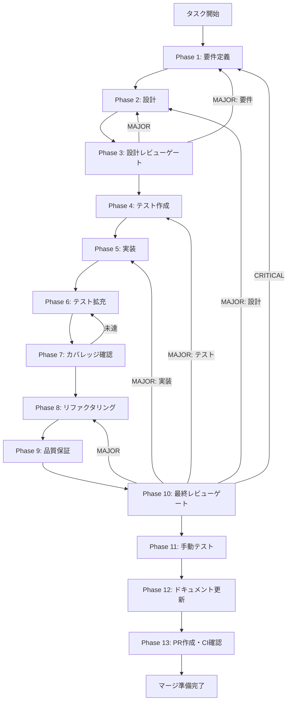

# ChatHistoryProvider App Integration - タスク仕様書

## ユーザーからの元の指示

```
ChatHistoryProvider をElectronデスクトップアプリのエントリポイント（App.tsx）に統合し、
全コンポーネントからチャット履歴Use Casesへのアクセスを可能にする。
（タスク指示書: docs/30-workflows/unassigned-task/task-chat-history-provider-integration.md）
```

## メタ情報

| 項目         | 内容                                 |
| ------------ | ------------------------------------ |
| タスクID     | UT-007                               |
| タスク名     | ChatHistoryProvider App Integration  |
| 分類         | 実装                                 |
| 対象機能     | チャット履歴機能（chat-history）     |
| 優先度       | 高                                   |
| 見積もり規模 | 小規模                               |
| ステータス   | 未実施                               |
| 発見元       | Phase 12（UT-006完了後の後続タスク） |
| 発見日       | 2026-01-22                           |
| 関連タスク   | UT-006 React Context DI実装          |
| 依存タスク   | UT-006 React Context DI実装（完了）  |
| GitHub Issue | #428                                 |

---

## 目的

ChatHistoryProviderをElectronデスクトップアプリのエントリポイントに統合し、全コンポーネントからチャット履歴Use Casesへのアクセスを可能にする。

## 背景

UT-006にてReact Context DI（ChatHistoryContext, ChatHistoryProvider, useChatHistory）が実装された。しかし、これらはまだElectronデスクトップアプリのエントリポイントに統合されていない。

Providerをアプリのルートレベルでラップすることで、全てのコンポーネントからUse Casesにアクセス可能になる。

### 最終ゴール

- ChatHistoryProviderがApp.tsxでルートレベルにラップされている
- DrizzleリポジトリがProviderに正しく注入されている
- 任意のコンポーネントからuseChatHistoryが使用可能
- 初期化状態（isReady）が正しく管理されている
- PRが作成され、CIが通過している

### 成果物一覧

| 種別         | 成果物                 | 配置先                                                         |
| ------------ | ---------------------- | -------------------------------------------------------------- |
| 機能         | リポジトリファクトリー | `apps/desktop/src/features/chat-history/repositories/index.ts` |
| 機能         | App.tsx Provider統合   | `apps/desktop/src/renderer/App.tsx`                            |
| テスト       | 統合テスト             | `apps/desktop/src/features/chat-history/__tests__/*.test.tsx`  |
| ドキュメント | 実装ガイド             | `outputs/phase-12/implementation-guide.md`                     |
| PR           | GitHub Pull Request    | GitHub UI                                                      |

---

## Phase構成

| Phase | 名称               | 概要                                       |
| ----- | ------------------ | ------------------------------------------ |
| 1     | 要件定義           | 機能要件・非機能要件・制約条件の定義       |
| 2     | 設計               | 詳細設計・統合テスト設計                   |
| 3     | 設計レビューゲート | 設計の妥当性検証                           |
| 4     | テスト作成         | TDD Red Phase - 失敗するテストの作成       |
| 5     | 実装               | TDD Green Phase - テストを通す最小限の実装 |
| 6     | テスト拡充         | エッジケース・境界値テストの追加           |
| 7     | カバレッジ確認     | テストカバレッジの検証                     |
| 8     | リファクタリング   | TDD Refactor Phase - コード品質の向上      |
| 9     | 品質保証           | 静的解析・型チェック・Lintチェック         |
| 10    | 最終レビューゲート | 全体の品質と整合性を検証                   |
| 11    | 手動テスト         | UX・実環境での動作確認                     |
| 12    | ドキュメント更新   | 実装ガイド・仕様書更新                     |
| 13    | PR作成             | コミット・PR作成・CI確認                   |

---

## タスク分解サマリー

| ID     | フェーズ | サブタスク名     | 責務                 | 依存 |
| ------ | -------- | ---------------- | -------------------- | ---- |
| T-01-1 | Phase 1  | 要件定義         | 機能・非機能要件定義 | -    |
| T-02-1 | Phase 2  | 設計             | 詳細設計・テスト設計 | T-01 |
| T-03-1 | Phase 3  | 設計レビュー     | 設計妥当性検証       | T-02 |
| T-04-1 | Phase 4  | テスト作成       | TDD Red Phase        | T-03 |
| T-05-1 | Phase 5  | 実装             | TDD Green Phase      | T-04 |
| T-06-1 | Phase 6  | テスト拡充       | カバレッジ向上       | T-05 |
| T-07-1 | Phase 7  | カバレッジ確認   | カバレッジ基準検証   | T-06 |
| T-08-1 | Phase 8  | リファクタリング | TDD Refactor Phase   | T-07 |
| T-09-1 | Phase 9  | 品質保証         | 静的解析・型チェック | T-08 |
| T-10-1 | Phase 10 | 最終レビュー     | 全体品質検証         | T-09 |
| T-11-1 | Phase 11 | 手動テスト       | UX・実環境確認       | T-10 |
| T-12-1 | Phase 12 | ドキュメント更新 | 実装ガイド・仕様更新 | T-11 |
| T-13-1 | Phase 13 | PR作成           | コミット・PR・CI確認 | T-12 |

**総サブタスク数**: 13個

---

## 実行フロー図



---

## Phase一覧

| Phase | 名称               | 仕様書                                                 | ステータス |
| ----- | ------------------ | ------------------------------------------------------ | ---------- |
| 1     | 要件定義           | [phase-1-requirements.md](phase-1-requirements.md)     | 未実施     |
| 2     | 設計               | [phase-2-design.md](phase-2-design.md)                 | 未実施     |
| 3     | 設計レビューゲート | [phase-3-design-review.md](phase-3-design-review.md)   | 未実施     |
| 4     | テスト作成         | [phase-4-test-creation.md](phase-4-test-creation.md)   | 未実施     |
| 5     | 実装               | [phase-5-implementation.md](phase-5-implementation.md) | 未実施     |
| 6     | テスト拡充         | [phase-6-test-expansion.md](phase-6-test-expansion.md) | 未実施     |
| 7     | カバレッジ確認     | [phase-7-coverage-check.md](phase-7-coverage-check.md) | 未実施     |
| 8     | リファクタリング   | [phase-8-refactoring.md](phase-8-refactoring.md)       | 未実施     |
| 9     | 品質保証           | [phase-9-quality.md](phase-9-quality.md)               | 未実施     |
| 10    | 最終レビューゲート | [phase-10-final-review.md](phase-10-final-review.md)   | 未実施     |
| 11    | 手動テスト         | [phase-11-manual-test.md](phase-11-manual-test.md)     | 未実施     |
| 12    | ドキュメント更新   | [phase-12-documentation.md](phase-12-documentation.md) | 未実施     |
| 13    | PR作成             | [phase-13-pr-creation.md](phase-13-pr-creation.md)     | 未実施     |

---

## テストカバレッジ目標

### ユニットテスト

| 指標              | 最低基準 | 推奨基準 |
| ----------------- | -------- | -------- |
| Line Coverage     | 80%      | 90%      |
| Branch Coverage   | 60%      | 70%      |
| Function Coverage | 80%      | 90%      |

### 結合テスト

| 指標                         | 目標 |
| ---------------------------- | ---- |
| APIエンドポイント            | 100% |
| モジュール間インターフェース | 100% |
| 正常系シナリオ               | 100% |
| 異常系シナリオ               | 80%+ |
| 外部連携ポイント             | 100% |

---

## 統合テスト連携（Phase 1〜11で必須）

各Phaseで以下の統合テスト連携アクションを実施すること:

| Phase | 統合テスト連携アクション                        |
| ----- | ----------------------------------------------- |
| 1     | 接続要件（API/認証/データフロー）を要件に明記   |
| 2     | 統合ポイント/契約（API・スキーマ）を設計に反映  |
| 3     | 統合テスト観点のレビューゲートを実施            |
| 4     | 統合テストシナリオを全カテゴリで作成            |
| 5     | フロント/バック接続の実装とテスト支援コード整備 |
| 6     | 統合テストの拡充（全カテゴリのカバレッジ向上）  |
| 7     | 統合テストの再実行とゲート判定                  |
| 8     | リファクタ後の統合テスト継続成功を確認          |
| 9     | 品質保証で統合テスト結果を確認                  |
| 10    | 最終レビューで統合テスト結果を確認              |
| 11    | 手動統合テスト（UI/API接続）を確認              |

---

## Phase完了時の必須アクション

**各Phase完了時に以下を必ず実行すること:**

1. **タスク100%実行**: Phase内で指定された全タスクを完全に実行
2. **成果物確認**: 全ての必須成果物が生成されていることを検証
3. **実行記録**: 実行タスクの結果を記録
4. **artifacts.json更新**: Phase完了ステータスを更新
5. **Phase末端の実行確認**: 各タスクを100%実行し、各タスクを完遂した旨を必ず明記

```bash
# Phase完了時の検証コマンド
node .claude/skills/task-specification-creator/scripts/validate-phase-output.js docs/30-workflows/chat-history-provider-integration --phase {{PHASE_NUMBER}}

# Phase完了・成果物登録
node .claude/skills/task-specification-creator/scripts/complete-phase.js \
  --workflow docs/30-workflows/chat-history-provider-integration --phase {{PHASE_NUMBER}} --artifacts "..."
```

---

## 関連ドキュメント

| ドキュメント         | パス                                                                             |
| -------------------- | -------------------------------------------------------------------------------- |
| アーキテクチャ仕様   | `.claude/skills/aiworkflow-requirements/references/architecture-chat-history.md` |
| インターフェース仕様 | `.claude/skills/aiworkflow-requirements/references/interfaces-chat-history.md`   |
| React Context DI仕様 | `docs/30-workflows/react-context-di/outputs/phase-12/implementation-guide.md`    |
| タスク指示書         | `docs/30-workflows/unassigned-task/task-chat-history-provider-integration.md`    |

---

## 既存実装の確認

### 確認済み実装

| コンポーネント               | パス                                                                                                   | 状態   |
| ---------------------------- | ------------------------------------------------------------------------------------------------------ | ------ |
| ChatHistoryProvider          | `apps/desktop/src/features/chat-history/context/ChatHistoryProvider.tsx`                               | 実装済 |
| ChatHistoryContext           | `apps/desktop/src/features/chat-history/context/ChatHistoryContext.tsx`                                | 実装済 |
| useChatHistory               | `apps/desktop/src/features/chat-history/context/useChatHistory.ts`                                     | 実装済 |
| DrizzleChatSessionRepository | `packages/shared/src/features/chat-history/infrastructure/persistence/DrizzleChatSessionRepository.ts` | 実装済 |
| DrizzleChatMessageRepository | `packages/shared/src/features/chat-history/infrastructure/persistence/DrizzleChatMessageRepository.ts` | 実装済 |
| App.tsx（未統合）            | `apps/desktop/src/renderer/App.tsx`                                                                    | 要修正 |

---

## 完了条件

### 機能要件

- [ ] ChatHistoryProviderがApp.tsxでラップされている
- [ ] DrizzleリポジトリがProviderに正しく注入されている
- [ ] useChatHistoryが任意のコンポーネントで使用可能
- [ ] isReadyフラグが正しく動作する

### 品質要件

- [ ] 型エラー 0件
- [ ] Lintエラー 0件
- [ ] 全テストパス

### ドキュメント要件

- [ ] 実装ガイドが作成されている
- [ ] システム仕様書が更新されている（必要な場合）

---

## 実行方法

各Phaseを順番に実行してください：

```
docs/30-workflows/chat-history-provider-integration/phase-1-requirements.md
docs/30-workflows/chat-history-provider-integration/phase-2-design.md
docs/30-workflows/chat-history-provider-integration/phase-3-design-review.md
...
docs/30-workflows/chat-history-provider-integration/phase-13-pr-creation.md
```

---

**作成日**: 2026-01-22
**作成者**: Claude Code
**バージョン**: 1.0
