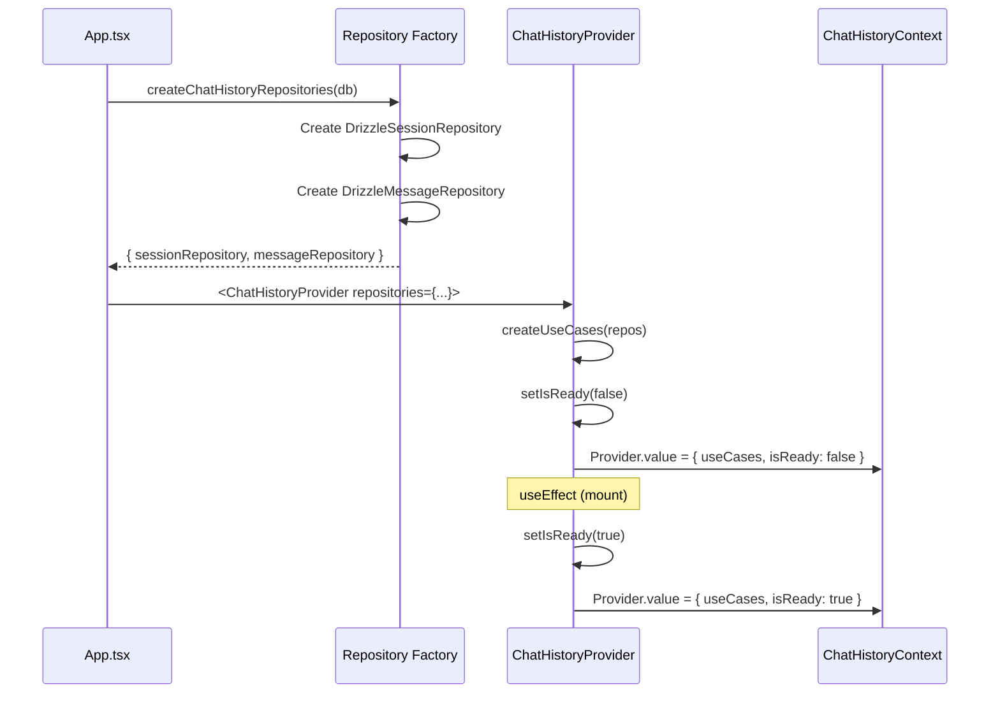

# Phase 2: 詳細設計

## メタ情報

| 項目   | 内容                              |
| ------ | --------------------------------- |
| Phase  | 2                                 |
| 作成日 | 2026-01-22                        |
| 機能名 | chat-history-provider-integration |
| 作成者 | Claude Code                       |

---

## 1. リポジトリファクトリー設計

### 責務

リポジトリファクトリーは以下の責務を持つ:

1. **DBインスタンスの取得**: Electron Main ProcessからのDBインスタンス取得
2. **リポジトリのインスタンス化**: DrizzleリポジトリをDBインスタンスで初期化
3. **シングルトン管理**: アプリケーションライフサイクル全体で単一インスタンスを維持

### インターフェース設計

```typescript
// apps/desktop/src/features/chat-history/repositories/index.ts

import type {
  IChatSessionRepository,
  IChatMessageRepository,
} from "@repo/shared";

/**
 * リポジトリファクトリーのインターフェース
 */
interface ChatHistoryRepositories {
  sessionRepository: IChatSessionRepository;
  messageRepository: IChatMessageRepository;
}

/**
 * リポジトリファクトリー関数
 * シングルトンパターンでリポジトリを管理
 */
export function createChatHistoryRepositories(
  db: unknown,
): ChatHistoryRepositories;

/**
 * 初期化済みリポジトリを取得
 * 未初期化の場合はエラーをスロー
 */
export function getChatHistoryRepositories(): ChatHistoryRepositories;

/**
 * リポジトリが初期化済みかどうか
 */
export function isRepositoriesInitialized(): boolean;
```

### 実装設計

```typescript
import {
  DrizzleChatSessionRepository,
  DrizzleChatMessageRepository,
  type IChatSessionRepository,
  type IChatMessageRepository,
} from "@repo/shared";

// シングルトンインスタンス
let repositories: {
  sessionRepository: IChatSessionRepository;
  messageRepository: IChatMessageRepository;
} | null = null;

export function createChatHistoryRepositories(
  db: unknown,
): ChatHistoryRepositories {
  if (repositories) {
    return repositories;
  }

  repositories = {
    sessionRepository: new DrizzleChatSessionRepository(db),
    messageRepository: new DrizzleChatMessageRepository(db),
  };

  return repositories;
}

export function getChatHistoryRepositories(): ChatHistoryRepositories {
  if (!repositories) {
    throw new Error(
      "Chat history repositories not initialized. Call createChatHistoryRepositories first.",
    );
  }
  return repositories;
}

export function isRepositoriesInitialized(): boolean {
  return repositories !== null;
}
```

---

## 2. Provider階層設計

### 既存App.tsx構造

```
<BrowserRouter>
  <AuthGuard>
    <Routes>
      <Route path="/agent" ... />
      <Route path="/chat/history/:sessionId" ... />
      <Route path="/chat/history" ... />
      <Route path="/history/:fileId" ... />
      <Route path="*" ... />
    </Routes>
  </AuthGuard>
</BrowserRouter>
```

### 設計後のProvider階層

```
<BrowserRouter>
  <ChatHistoryProvider
    sessionRepository={getSessionRepository()}
    messageRepository={getMessageRepository()}
  >
    <AuthGuard>
      <Routes>
        <Route path="/agent" ... />
        <Route path="/chat/history/:sessionId" ... />
        <Route path="/chat/history" ... />
        <Route path="/history/:fileId" ... />
        <Route path="*" ... />
      </Routes>
    </AuthGuard>
  </ChatHistoryProvider>
</BrowserRouter>
```

### 配置位置の決定理由

| 選択肢                       | メリット                  | デメリット              | 採用 |
| ---------------------------- | ------------------------- | ----------------------- | ---- |
| BrowserRouter内、AuthGuard外 | 全ルートでContext利用可能 | 認証前もContext参照可能 | ✓    |
| AuthGuard内                  | 認証後のみContext利用可能 | 一部ルートで使用不可    | -    |
| BrowserRouter外              | 最も外側での管理          | Router情報が使用不可    | -    |

**採用理由**: ChatHistoryProviderはBrowserRouter内、AuthGuard外に配置する。これにより:

- 全てのRouteでChatHistoryContextが利用可能
- AuthGuardより先に初期化されるため、認証完了後すぐにチャット機能を使用可能
- 既存のRoute構造を変更せずに統合可能

---

## 3. 初期化フロー設計

### 初期化シーケンス



### 状態遷移図

```
┌─────────────────┐    mount     ┌─────────────────┐
│ INITIALIZING    │ ──────────→ │ READY           │
│ isReady: false  │              │ isReady: true   │
└─────────────────┘              └─────────────────┘
                                         │
                                         │ error
                                         ↓
                                ┌─────────────────┐
                                │ ERROR           │
                                │ isReady: false  │
                                │ error: Error    │
                                └─────────────────┘
```

### エラーハンドリング設計

| エラー種別           | 発生条件                       | 対応                                     |
| -------------------- | ------------------------------ | ---------------------------------------- |
| DB接続失敗           | DBインスタンスがnull/undefined | ファクトリーでエラースロー               |
| リポジトリ初期化失敗 | コンストラクタ例外             | ファクトリーでエラーをキャッチ・再スロー |
| Provider未設定       | useChatHistory呼び出し時       | useChatHistoryでエラースロー             |

---

## 4. 設計決定事項サマリー

| ID   | 決定事項                         | 理由                                 |
| ---- | -------------------------------- | ------------------------------------ |
| D-01 | シングルトンでリポジトリ管理     | メモリ効率、一貫性確保               |
| D-02 | BrowserRouter内、AuthGuard外配置 | 全ルートでContext利用可能            |
| D-03 | useEffectでisReady遷移           | React標準パターン                    |
| D-04 | ファクトリーパターン採用         | Clean Architecture依存関係ルール遵守 |
| D-05 | 既存Provider実装を維持           | 変更最小化、リスク低減               |

---

## Clean Architecture適合確認

### レイヤー構成

```
Domain Layer:
  - IChatSessionRepository (interface)
  - IChatMessageRepository (interface)
  - ChatSession, ChatMessage (entities)

Application Layer:
  - CreateChatSessionUseCase
  - AddUserMessageUseCase
  - AddAssistantMessageUseCase
  - TogglePinnedUseCase
  - SearchSessionsUseCase

Infrastructure Layer:
  - DrizzleChatSessionRepository (implements IChatSessionRepository)
  - DrizzleChatMessageRepository (implements IChatMessageRepository)

UI Layer (本タスクの対象):
  - ChatHistoryProvider (Providerコンポーネント)
  - useChatHistory (Hook)
  - Repository Factory (DI用ファクトリー)
  - App.tsx (エントリポイント)
```

### 依存関係

```
App.tsx (UI)
    ↓ uses
Repository Factory (UI)
    ↓ creates
DrizzleRepositories (Infrastructure)
    ↓ implements
IRepository interfaces (Domain)

ChatHistoryProvider (UI)
    ↓ uses
Use Cases (Application)
    ↓ depends on
IRepository interfaces (Domain)
```

**依存関係ルール遵守**: UI → Application → Domain の方向のみ

---

## タスク完了状態

- [x] タスク1: リポジトリファクトリー設計 - **完了**
- [x] タスク2: Provider階層設計 - **完了**
- [x] タスク3: 初期化フロー設計 - **完了**
- [x] タスク5: 設計サマリー作成 - **完了**
