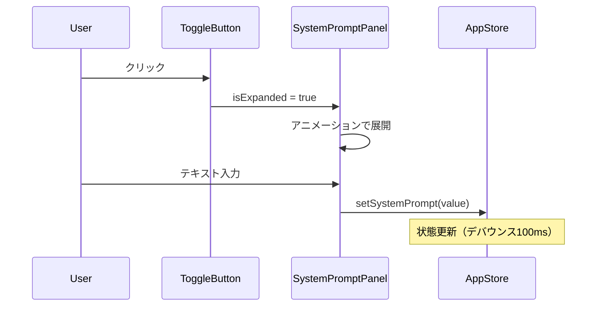
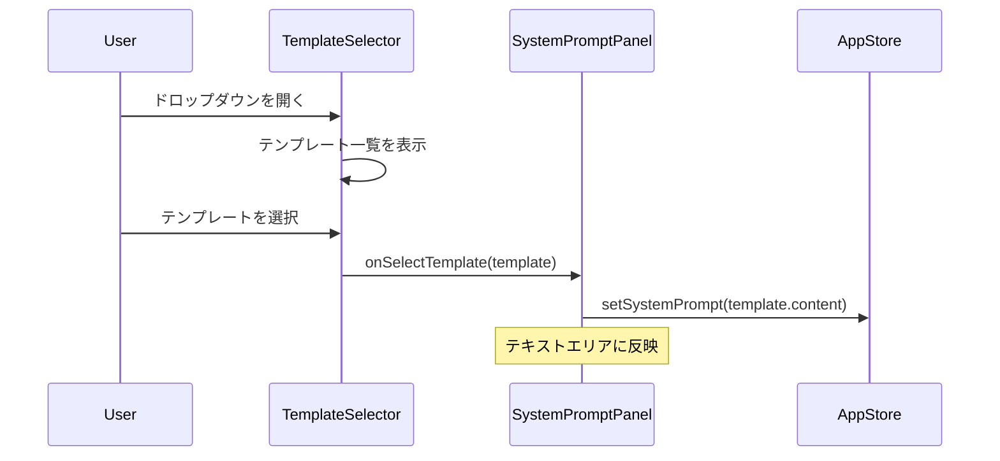
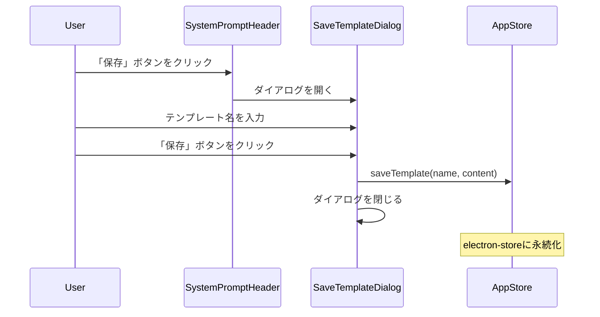
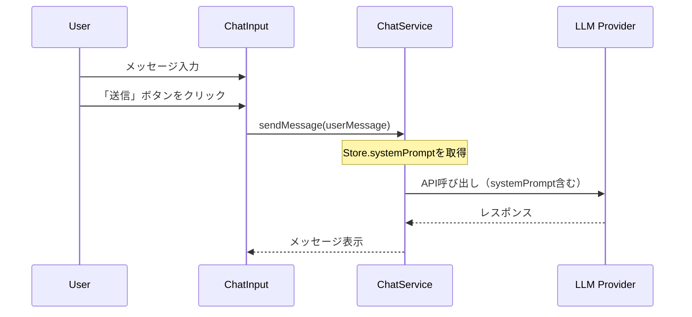

# システムプロンプト設定機能 - UI設計書

## メタ情報

| 項目           | 内容                                                               |
| -------------- | ------------------------------------------------------------------ |
| ドキュメントID | UI-CHAT-SYSPROMPT-001                                              |
| 作成日         | 2025-12-25                                                         |
| ステータス     | ドラフト                                                           |
| 関連タスク     | T-01-1                                                             |
| 参照           | `docs/30-workflows/chat-system-prompt/task-step00-requirements.md` |

---

## 1. コンポーネント構造

### 1.1 コンポーネント階層

```
ChatView/
├── ヘッダー
│   ├── タイトル「AIチャット」
│   ├── RAGステータス表示
│   ├── SystemPromptToggleButton (NEW) ← 新規追加
│   └── 履歴ナビボタン
├── SystemPromptPanel (NEW) ← 新規追加（条件付き表示）
│   ├── SystemPromptHeader
│   │   ├── TemplateSelector
│   │   ├── SaveTemplateButton
│   │   └── ClearButton
│   ├── SystemPromptTextArea
│   └── CharacterCounter
├── メッセージエリア
│   └── ChatMessage[]
└── フッター
    └── ChatInput
```

### 1.2 新規コンポーネント一覧

| コンポーネント名         | 分類     | 責務                                       |
| ------------------------ | -------- | ------------------------------------------ |
| SystemPromptToggleButton | Atom     | システムプロンプトパネルの展開/折りたたみ  |
| SystemPromptPanel        | Organism | システムプロンプト設定UIのコンテナ         |
| SystemPromptHeader       | Molecule | テンプレート選択・保存・クリアのアクション |
| TemplateSelector         | Molecule | テンプレート選択ドロップダウン             |
| SystemPromptTextArea     | Molecule | システムプロンプト入力エリア               |
| CharacterCounter         | Atom     | 文字数カウント表示                         |
| SaveTemplateDialog       | Organism | テンプレート保存ダイアログ                 |
| TemplateListItem         | Molecule | テンプレート一覧の個別アイテム             |

---

## 2. レイアウト設計

### 2.1 全体レイアウト

```
┌─────────────────────────────────────────────────────────┐
│  チャットヘッダー                                         │
│  ┌───────────────────────────────────────────────────┐  │
│  │ AIチャット    [RAG Status]  [⚙️] [📜]            │  │
│  │                              ↑                     │  │
│  │                     SystemPromptToggleButton       │  │
│  └───────────────────────────────────────────────────┘  │
├─────────────────────────────────────────────────────────┤
│  SystemPromptPanel（展開時のみ表示）                      │
│  ┌───────────────────────────────────────────────────┐  │
│  │ [テンプレート選択 ▼]        [💾 保存] [🗑️ クリア]│  │
│  ├───────────────────────────────────────────────────┤  │
│  │ ┌───────────────────────────────────────────────┐│  │
│  │ │ システムプロンプトを入力...                    ││  │
│  │ │                                               ││  │
│  │ │                                               ││  │
│  │ │                                               ││  │
│  │ └───────────────────────────────────────────────┘│  │
│  │                                   0 / 4,000 文字  │  │
│  └───────────────────────────────────────────────────┘  │
├─────────────────────────────────────────────────────────┤
│  メッセージエリア (flex: 1)                              │
│                                                         │
│  ┌───────────────────────────────────────────────────┐  │
│  │ [Assistant] メッセージ内容...                     │  │
│  └───────────────────────────────────────────────────┘  │
│                                                         │
│  ┌───────────────────────────────────────────────────┐  │
│  │                          メッセージ内容... [User] │  │
│  └───────────────────────────────────────────────────┘  │
│                                                         │
├─────────────────────────────────────────────────────────┤
│  フッター                                                │
│  ┌───────────────────────────────────────────────────┐  │
│  │ [入力フィールド]                        [送信]    │  │
│  └───────────────────────────────────────────────────┘  │
└─────────────────────────────────────────────────────────┘
```

### 2.2 SystemPromptPanel レイアウト詳細

```
┌─────────────────────────────────────────────────────────┐
│ SystemPromptHeader                                       │
│ ┌──────────────────────┐  ┌─────────┐ ┌─────────────┐  │
│ │ テンプレートを選択 ▼ │  │ 💾 保存 │ │ 🗑️ クリア │  │
│ └──────────────────────┘  └─────────┘ └─────────────┘  │
├─────────────────────────────────────────────────────────┤
│ SystemPromptTextArea                                     │
│ ┌─────────────────────────────────────────────────────┐ │
│ │ あなたは翻訳アシスタントです。                       │ │
│ │                                                     │ │
│ │ ## 役割                                             │ │
│ │ - ユーザーから提供されたテキストを指定された...      │ │
│ │                                                     │ │
│ │                                                     │ │
│ │                                                     │ │
│ └─────────────────────────────────────────────────────┘ │
│                                                         │
│ CharacterCounter                                         │
│                                      128 / 4,000 文字   │
└─────────────────────────────────────────────────────────┘
```

### 2.3 テンプレート選択ドロップダウン

```
┌──────────────────────────┐
│ テンプレートを選択     ▼ │
├──────────────────────────┤
│ ─── プリセット ───       │
│ ○ 翻訳アシスタント       │
│ ○ プログラミング支援     │
│ ○ ライティング支援       │
├──────────────────────────┤
│ ─── カスタム ───         │
│ ○ マイテンプレート1      │
│   [📝] [🗑️]             │
│ ○ マイテンプレート2      │
│   [📝] [🗑️]             │
├──────────────────────────┤
│ カスタムテンプレートがない場合  │
│ 「保存」ボタンで追加できます    │
└──────────────────────────┘
```

### 2.4 テンプレート保存ダイアログ

```
┌─────────────────────────────────────────┐
│ テンプレートを保存                [×]   │
├─────────────────────────────────────────┤
│                                         │
│ テンプレート名                          │
│ ┌─────────────────────────────────────┐ │
│ │ マイテンプレート                    │ │
│ └─────────────────────────────────────┘ │
│                            0 / 50 文字  │
│                                         │
│ プレビュー                              │
│ ┌─────────────────────────────────────┐ │
│ │ あなたは翻訳アシスタントです...      │ │
│ │ （最初の100文字を表示）              │ │
│ └─────────────────────────────────────┘ │
│                                         │
│         [キャンセル]    [保存]          │
└─────────────────────────────────────────┘
```

---

## 3. コンポーネント詳細設計

### 3.1 SystemPromptToggleButton

**ファイルパス**: `apps/desktop/src/renderer/components/atoms/SystemPromptToggleButton/index.tsx`

**Props**:

```typescript
interface SystemPromptToggleButtonProps {
  isExpanded: boolean;
  onClick: () => void;
  hasContent: boolean; // システムプロンプトに内容があるかどうか
  disabled?: boolean;
  className?: string;
}
```

**スタイリング**:

| 状態       | スタイル                                               |
| ---------- | ------------------------------------------------------ |
| 通常       | `bg-transparent text-white/60`                         |
| ホバー     | `bg-white/5 text-white/80`                             |
| アクティブ | `bg-white/10 text-white`                               |
| 内容あり   | `text-[var(--status-primary)]`（ドットインジケーター） |
| 展開中     | アイコン回転（180deg）                                 |

**アイコン**: `Settings` (lucide-react) または `SlidersHorizontal`

**アクセシビリティ**:

```typescript
aria-expanded={isExpanded}
aria-controls="system-prompt-panel"
aria-label={isExpanded ? "システムプロンプトを閉じる" : "システムプロンプトを開く"}
```

---

### 3.2 SystemPromptPanel

**ファイルパス**: `apps/desktop/src/renderer/components/organisms/SystemPromptPanel/index.tsx`

**Props**:

```typescript
interface SystemPromptPanelProps {
  isExpanded: boolean;
  systemPrompt: string;
  onSystemPromptChange: (value: string) => void;
  templates: PromptTemplate[];
  onSelectTemplate: (template: PromptTemplate) => void;
  onSaveTemplate: (name: string) => void;
  onDeleteTemplate: (templateId: string) => void;
  onClear: () => void;
  className?: string;
}
```

**レイアウト構造**:

```typescript
<Collapsible open={isExpanded}>
  <GlassPanel className="mx-4 mt-2">
    <SystemPromptHeader ... />
    <SystemPromptTextArea ... />
    <CharacterCounter ... />
  </GlassPanel>
</Collapsible>
```

**アニメーション**:

- 展開/折りたたみ: `transition-all duration-200 ease-out`
- 高さ: `max-height: 0` → `max-height: 400px`
- 透明度: `opacity: 0` → `opacity: 1`

**スタイリング**:

```css
/* GlassPanel拡張 */
.system-prompt-panel {
  background: rgba(255, 255, 255, 0.05);
  backdrop-filter: blur(20px);
  border: 1px solid rgba(255, 255, 255, 0.1);
  border-radius: var(--radius-lg);
}
```

---

### 3.3 SystemPromptHeader

**ファイルパス**: `apps/desktop/src/renderer/components/molecules/SystemPromptHeader/index.tsx`

**Props**:

```typescript
interface SystemPromptHeaderProps {
  templates: PromptTemplate[];
  selectedTemplateId: string | null;
  onSelectTemplate: (template: PromptTemplate) => void;
  onSaveClick: () => void;
  onClearClick: () => void;
  hasContent: boolean;
  disabled?: boolean;
}
```

**レイアウト**:

```typescript
<div className="flex items-center justify-between p-3 border-b border-white/10">
  <TemplateSelector ... />
  <div className="flex gap-2">
    <Button variant="ghost" size="sm" onClick={onSaveClick} disabled={!hasContent}>
      <Save size={16} /> 保存
    </Button>
    <Button variant="ghost" size="sm" onClick={onClearClick} disabled={!hasContent}>
      <Trash2 size={16} /> クリア
    </Button>
  </div>
</div>
```

---

### 3.4 TemplateSelector

**ファイルパス**: `apps/desktop/src/renderer/components/molecules/TemplateSelector/index.tsx`

**Props**:

```typescript
interface TemplateSelectorProps {
  templates: PromptTemplate[];
  selectedTemplateId: string | null;
  onSelect: (template: PromptTemplate) => void;
  onDelete: (templateId: string) => void;
  onRename: (templateId: string, newName: string) => void;
  disabled?: boolean;
}
```

**構造**:

```typescript
<Popover>
  <PopoverTrigger asChild>
    <Button variant="secondary" className="w-48 justify-between">
      <span>{selectedTemplate?.name || "テンプレートを選択"}</span>
      <ChevronDown size={16} />
    </Button>
  </PopoverTrigger>
  <PopoverContent className="w-64 p-0">
    {/* プリセットグループ */}
    <div className="py-2">
      <div className="px-3 py-1 text-xs text-white/50">プリセット</div>
      {presetTemplates.map(template => (
        <TemplateListItem key={template.id} template={template} ... />
      ))}
    </div>
    <Separator />
    {/* カスタムグループ */}
    <div className="py-2">
      <div className="px-3 py-1 text-xs text-white/50">カスタム</div>
      {customTemplates.length > 0 ? (
        customTemplates.map(template => (
          <TemplateListItem key={template.id} template={template} showActions ... />
        ))
      ) : (
        <div className="px-3 py-2 text-sm text-white/40">
          「保存」ボタンで追加できます
        </div>
      )}
    </div>
  </PopoverContent>
</Popover>
```

---

### 3.5 SystemPromptTextArea

**ファイルパス**: `apps/desktop/src/renderer/components/molecules/SystemPromptTextArea/index.tsx`

**Props**:

```typescript
interface SystemPromptTextAreaProps {
  value: string;
  onChange: (value: string) => void;
  maxLength: number;
  placeholder?: string;
  disabled?: boolean;
  className?: string;
}
```

**スタイリング**:

```css
.system-prompt-textarea {
  min-height: 120px;
  max-height: 300px;
  resize: vertical;
  background: rgba(0, 0, 0, 0.2);
  border: 1px solid rgba(255, 255, 255, 0.1);
  border-radius: var(--radius-md);
  padding: var(--spacing-3);
  font-family: var(--font-mono);
  font-size: 13px;
  line-height: 1.5;
  color: var(--text-primary);
}

.system-prompt-textarea:focus {
  outline: none;
  border-color: var(--status-primary);
  box-shadow: 0 0 0 2px rgba(var(--status-primary-rgb), 0.2);
}

.system-prompt-textarea::placeholder {
  color: var(--text-tertiary);
}
```

**機能**:

- 自動リサイズ（行数に応じて高さ調整）
- 最大文字数到達時の視覚的フィードバック
- Tabキーでインデント挿入（オプション）

---

### 3.6 CharacterCounter

**ファイルパス**: `apps/desktop/src/renderer/components/atoms/CharacterCounter/index.tsx`

**Props**:

```typescript
interface CharacterCounterProps {
  current: number;
  max: number;
  className?: string;
}
```

**スタイリング**:

| 状態         | 色                |
| ------------ | ----------------- |
| 通常         | `text-white/40`   |
| 警告(80%+)   | `text-yellow-400` |
| エラー(95%+) | `text-red-400`    |

**表示形式**: `{current.toLocaleString()} / {max.toLocaleString()} 文字`

---

### 3.7 SaveTemplateDialog

**ファイルパス**: `apps/desktop/src/renderer/components/organisms/SaveTemplateDialog/index.tsx`

**Props**:

```typescript
interface SaveTemplateDialogProps {
  isOpen: boolean;
  onClose: () => void;
  onSave: (name: string) => void;
  previewContent: string;
  existingNames: string[]; // 重複チェック用
}
```

**バリデーション**:

- 名前は1-50文字
- 空白のみは不可
- 既存名との重複チェック

---

## 4. ユーザーインタラクションフロー

### 4.1 システムプロンプトの入力



### 4.2 テンプレートの選択



### 4.3 テンプレートの保存



### 4.4 LLMへのシステムプロンプト送信



---

## 5. 既存UIとの整合性

### 5.1 デザイントークンの使用

| 要素             | トークン                               |
| ---------------- | -------------------------------------- |
| 背景             | `var(--bg-glass)`                      |
| ボーダー         | `var(--border-subtle)`                 |
| プライマリ色     | `var(--status-primary)`                |
| テキスト（主）   | `var(--text-primary)`                  |
| テキスト（副）   | `var(--text-secondary)`                |
| テキスト（補足） | `var(--text-tertiary)`                 |
| 角丸             | `var(--radius-md)`, `var(--radius-lg)` |
| スペーシング     | `var(--spacing-*)` (4px単位)           |

### 5.2 既存コンポーネントの再利用

| 既存コンポーネント | 使用箇所                       |
| ------------------ | ------------------------------ |
| GlassPanel         | SystemPromptPanelのコンテナ    |
| Button             | 保存、クリア、キャンセルボタン |
| Input              | テンプレート名入力             |
| Popover            | TemplateSelector               |

### 5.3 スタイルの統一

```typescript
// 既存のChatViewと同様のスタイリングパターンを使用
const panelStyles = clsx(
  "mx-4 mt-2",
  "bg-white/5",
  "border border-white/10",
  "rounded-lg",
  "backdrop-blur-md",
  className,
);
```

---

## 6. アクセシビリティ対応

### 6.1 ARIA属性

| コンポーネント           | ARIA属性                                         |
| ------------------------ | ------------------------------------------------ |
| SystemPromptToggleButton | `aria-expanded`, `aria-controls`, `aria-label`   |
| SystemPromptPanel        | `id`, `role="region"`, `aria-labelledby`         |
| TemplateSelector         | `role="listbox"`, `aria-activedescendant`        |
| TemplateListItem         | `role="option"`, `aria-selected`                 |
| SystemPromptTextArea     | `aria-describedby` (CharacterCounter)            |
| SaveTemplateDialog       | `role="dialog"`, `aria-modal`, `aria-labelledby` |

### 6.2 キーボード操作

| キー          | 動作                              |
| ------------- | --------------------------------- |
| Tab           | フォーカス移動                    |
| Escape        | ドロップダウン/ダイアログを閉じる |
| Enter         | 選択確定                          |
| Arrow Up/Down | ドロップダウン内のアイテム移動    |
| Space         | ボタン/チェックボックスのトグル   |

### 6.3 フォーカス管理

```typescript
// パネル展開時にテキストエリアにフォーカス
useEffect(() => {
  if (isExpanded && textAreaRef.current) {
    textAreaRef.current.focus();
  }
}, [isExpanded]);

// ダイアログオープン時に名前入力にフォーカス
useEffect(() => {
  if (isOpen && nameInputRef.current) {
    nameInputRef.current.focus();
  }
}, [isOpen]);
```

---

## 7. レスポンシブ対応

### 7.1 ブレークポイント

| ブレークポイント | SystemPromptPanel                        |
| ---------------- | ---------------------------------------- |
| デフォルト       | 通常表示                                 |
| 狭いウィンドウ   | ヘッダーボタンを縦並びに変更（将来対応） |

### 7.2 最小幅

- SystemPromptPanel: `min-width: 300px`
- SystemPromptTextArea: `min-width: 250px`

---

## 8. エラー状態・エッジケース

### 8.1 エラー状態

| エラー種別               | UI表現                               |
| ------------------------ | ------------------------------------ |
| 文字数超過               | 文字カウンターを赤色表示、入力制限   |
| テンプレート名重複       | エラーメッセージ表示、保存ボタン無効 |
| 保存失敗                 | トースト通知でエラー表示             |
| テンプレート読み込み失敗 | デフォルト値へフォールバック         |

### 8.2 空状態

| 状態                     | UI表現                                   |
| ------------------------ | ---------------------------------------- |
| システムプロンプト未入力 | プレースホルダー表示                     |
| カスタムテンプレートなし | 「保存ボタンで追加できます」テキスト表示 |

---

## 9. 視覚的フィードバック

### 9.1 操作フィードバック

| 操作             | フィードバック                             |
| ---------------- | ------------------------------------------ |
| ボタンホバー     | 背景色変更（opacity上昇）                  |
| ボタンクリック   | 押し込みアニメーション（scale: 0.98）      |
| テンプレート選択 | チェックマークアイコン表示                 |
| 保存成功         | トースト通知「テンプレートを保存しました」 |
| クリア実行       | テキストエリアがクリアされる               |

### 9.2 状態インジケーター

| 状態                     | インジケーター                     |
| ------------------------ | ---------------------------------- |
| システムプロンプト設定中 | トグルボタンにドットインジケーター |
| 未保存の変更あり         | アスタリスク表示（将来対応）       |
| 文字数警告               | カウンター色変更（黄色→赤色）      |

---

## 10. ファイル構成

```
apps/desktop/src/renderer/
├── components/
│   ├── atoms/
│   │   ├── SystemPromptToggleButton/
│   │   │   ├── index.tsx
│   │   │   └── SystemPromptToggleButton.test.tsx
│   │   └── CharacterCounter/
│   │       ├── index.tsx
│   │       └── CharacterCounter.test.tsx
│   ├── molecules/
│   │   ├── SystemPromptHeader/
│   │   │   ├── index.tsx
│   │   │   └── SystemPromptHeader.test.tsx
│   │   ├── TemplateSelector/
│   │   │   ├── index.tsx
│   │   │   └── TemplateSelector.test.tsx
│   │   ├── SystemPromptTextArea/
│   │   │   ├── index.tsx
│   │   │   └── SystemPromptTextArea.test.tsx
│   │   └── TemplateListItem/
│   │       ├── index.tsx
│   │       └── TemplateListItem.test.tsx
│   └── organisms/
│       ├── SystemPromptPanel/
│       │   ├── index.tsx
│       │   └── SystemPromptPanel.test.tsx
│       └── SaveTemplateDialog/
│           ├── index.tsx
│           └── SaveTemplateDialog.test.tsx
└── views/
    └── ChatView/
        └── index.tsx (修正)
```

---

## 11. 完了条件チェックリスト

- [x] コンポーネント構造が定義されている
- [x] レイアウト（配置・サイズ）が明確である
- [x] ユーザーインタラクションフローが設計されている
- [x] 既存UIとの整合性が考慮されている
- [x] アクセシビリティが考慮されている

---

## 12. 次のアクション

1. **T-01-2: 状態管理設計** - Zustand storeの拡張設計
2. **T-01-3: テンプレート管理設計** - electron-storeでの永続化設計
3. **T-02-1: 設計レビュー** - 設計全体の妥当性検証

---

## 更新履歴

| 日付       | 版  | 変更内容 | 作成者 |
| ---------- | --- | -------- | ------ |
| 2025-12-25 | 1.0 | 初版作成 | Claude |
