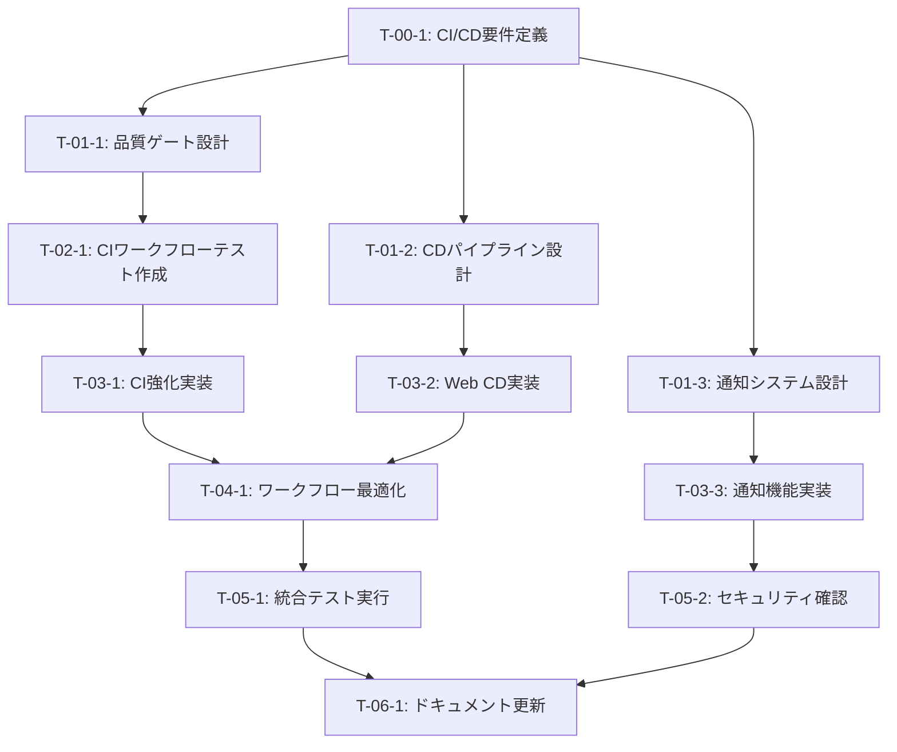

# CI/CD MVP構築 - タスク実行仕様書

## ユーザーからの元の指示

```
mainブランチにマージされると、デプロイできるようにci/cdを組み込んで。
あとは、自動でci/cdを組むべきものも設定して、mvp開発です。
ただし、自動化するところは自動化して、品質は担保したい。
このバランスを整えて。
```

---

## タスク概要

### 目的

mainブランチへのマージ時に自動デプロイが実行されるCI/CDパイプラインを構築する。
MVP開発として必要十分な品質ゲートを設置し、自動化と品質のバランスを最適化する。

### 背景

現在のプロジェクトには基本的なCI設定（ci.yml、backend-ci.yml）が存在するが、
以下の課題がある：

1. Webアプリ（Next.js）のCD設定が未整備
2. 品質ゲートの一部が`continue-on-error: true`で無効化されている
3. デプロイ通知システム（Discord Webhook）が未実装
4. E2Eテストがパイプラインに組み込まれていない

### 最終ゴール

- mainブランチへのマージで自動デプロイが実行される
- 品質ゲート（テスト、型チェック、Lint）を通過しないとマージ不可
- デプロイ成功/失敗時にDiscord通知される
- MVP開発に適した軽量かつ堅実なパイプライン

### 成果物一覧

| 種別         | 成果物             | 配置先                                 |
| ------------ | ------------------ | -------------------------------------- |
| ワークフロー | Web CD設定         | `.github/workflows/web-cd.yml`         |
| ワークフロー | 統合CI強化         | `.github/workflows/ci.yml`（既存改修） |
| 設定         | Railway設定        | `apps/web/railway.json`                |
| ドキュメント | ワークフロー可視化 | `.github/workflows/README.md`          |

---

## 参照ファイル

本仕様書のコマンド・エージェント・スキル選定は以下を参照：

- `docs/00-requirements/master_system_design.md` - システム要件
- `.claude/commands/ai/command_list.md` - /ai:コマンド定義
- `.claude/agents/agent_list.md` - エージェント定義
- `.claude/skills/skill_list.md` - スキル定義

---

## タスク分解サマリー

| ID     | フェーズ | サブタスク名             | 責務                         | 依存           |
| ------ | -------- | ------------------------ | ---------------------------- | -------------- |
| T-00-1 | Phase 0  | CI/CD要件定義            | 要件の明確化と優先順位付け   | なし           |
| T-01-1 | Phase 1  | 品質ゲート設計           | CIパイプラインの品質基準設計 | T-00-1         |
| T-01-2 | Phase 1  | CDパイプライン設計       | デプロイフローの設計         | T-00-1         |
| T-01-3 | Phase 1  | 通知システム設計         | Discord Webhook連携設計      | T-00-1         |
| T-02-1 | Phase 2  | CIワークフローテスト作成 | CIの動作検証テスト           | T-01-1         |
| T-03-1 | Phase 3  | CI強化実装               | 品質ゲート厳格化             | T-02-1         |
| T-03-2 | Phase 3  | Web CD実装               | Next.jsデプロイワークフロー  | T-01-2         |
| T-03-3 | Phase 3  | 通知機能実装             | Discord Webhook連携          | T-01-3         |
| T-04-1 | Phase 4  | ワークフロー最適化       | 重複排除・キャッシュ最適化   | T-03-1, T-03-2 |
| T-05-1 | Phase 5  | 統合テスト実行           | 全パイプラインの動作検証     | T-04-1         |
| T-05-2 | Phase 5  | セキュリティ確認         | シークレット管理・権限確認   | T-03-3         |
| T-06-1 | Phase 6  | ドキュメント更新         | 12-deployment.md更新         | T-05-1, T-05-2 |

**総サブタスク数**: 12個

---

## 実行フロー図



---

## Phase 0: 要件定義

### T-00-1: CI/CD要件定義

#### 目的

MVPに必要なCI/CD要件を明確化し、品質と自動化のバランスを定義する。

#### 背景

現在のci.ymlはPR時のCI、backend-ci.ymlはバックエンドのCD設定があるが、
Webアプリ（Next.js）のCD設定が不足。品質ゲートも一部緩い設定になっている。

#### 責務（単一責務）

CI/CD要件の分析と優先順位付け

#### 実行コマンド

```bash
/ai:gather-requirements ci-cd-pipeline
```

#### 使用エージェント

- **エージェント**: `@req-analyst`
- **選定理由**: 要件分析・整理の専門エージェント
- **参照**: `.claude/agents/agent_list.md`

#### 活用スキル

| スキル名                               | 活用方法                      |
| -------------------------------------- | ----------------------------- |
| requirements-engineering               | CI/CDの機能・非機能要件の整理 |
| functional-non-functional-requirements | 品質基準の定義                |

- **参照**: `.claude/skills/skill_list.md`

#### 成果物

| 成果物     | パス                                         | 内容            |
| ---------- | -------------------------------------------- | --------------- |
| 要件定義書 | `docs/30-workflows/cicd-mvp/requirements.md` | CI/CD要件の詳細 |

#### 完了条件

- [ ] 品質ゲートの厳格化レベルが決定されている
- [ ] デプロイ対象（backend/web）が明確化されている
- [ ] 通知要件（Discord Webhook）が定義されている
- [ ] MVP範囲が明確に定義されている

#### 依存関係

- **前提**: なし
- **後続**: T-01-1, T-01-2, T-01-3

---

## Phase 1: 設計

### T-01-1: 品質ゲート設計

#### 目的

CIパイプラインにおける品質ゲートの基準と構成を設計する。

#### 背景

現在のci.ymlでは`continue-on-error: true`が多用されており、
品質ゲートとして機能していない。MVP開発でも最低限の品質担保が必要。

#### 責務（単一責務）

CIにおける品質基準とゲート構成の設計

#### 実行コマンド

```bash
/ai:create-ci-workflow test
```

#### 使用エージェント

- **エージェント**: `@gha-workflow-architect`
- **選定理由**: GitHub Actions ワークフロー設計の専門家
- **参照**: `.claude/agents/agent_list.md`

#### 活用スキル

| スキル名                   | 活用方法                 |
| -------------------------- | ------------------------ |
| github-actions-expressions | ワークフロー条件式の設計 |
| conditional-execution-gha  | 品質ゲートの条件分岐設計 |
| parallel-jobs-gha          | ジョブ並列実行の最適化   |

- **参照**: `.claude/skills/skill_list.md`

#### 成果物

| 成果物   | パス                                      | 内容             |
| -------- | ----------------------------------------- | ---------------- |
| CI設計書 | `docs/30-workflows/cicd-mvp/ci-design.md` | 品質ゲート構成図 |

#### 完了条件

- [ ] 必須品質チェック（lint, typecheck, test）が定義されている
- [ ] ジョブ依存関係が設計されている
- [ ] ブランチ保護ルールの要件が明確化されている

#### 依存関係

- **前提**: T-00-1
- **後続**: T-02-1

---

### T-01-2: CDパイプライン設計

#### 目的

mainブランチへのマージ時に自動デプロイを実行するワークフローを設計する。

#### 背景

backend-ci.ymlにはRailwayデプロイが実装されているが、
Webアプリ（Next.js）用のCD設定が必要。

#### 責務（単一責務）

CDワークフローのアーキテクチャ設計

#### 実行コマンド

```bash
/ai:create-cd-workflow production
```

#### 使用エージェント

- **エージェント**: `@gha-workflow-architect`
- **選定理由**: GitHub Actions ワークフロー設計の専門家
- **参照**: `.claude/agents/agent_list.md`

#### 活用スキル

| スキル名                    | 活用方法             |
| --------------------------- | -------------------- |
| deployment-environments-gha | 本番環境デプロイ設計 |
| reusable-workflows          | 共通処理の再利用設計 |
| caching-strategies-gha      | ビルドキャッシュ戦略 |

- **参照**: `.claude/skills/skill_list.md`

#### 成果物

| 成果物   | パス                                      | 内容             |
| -------- | ----------------------------------------- | ---------------- |
| CD設計書 | `docs/30-workflows/cicd-mvp/cd-design.md` | デプロイフロー図 |

#### 完了条件

- [ ] デプロイトリガー条件が定義されている
- [ ] ヘルスチェック仕様が設計されている
- [ ] ロールバック方針が明確化されている

#### 依存関係

- **前提**: T-00-1
- **後続**: T-03-2

---

### T-01-3: 通知システム設計

#### 目的

デプロイ成功/失敗時のDiscord Webhook通知システムを設計する。

#### 背景

docs/00-requirements/12-deployment.mdにDiscord通知要件が定義されているが、
具体的な実装設計が必要。

#### 責務（単一責務）

通知システムのインターフェース設計

#### 実行コマンド

```bash
/ai:design-api discord-webhook-notification
```

#### 使用エージェント

- **エージェント**: `@gateway-dev`
- **選定理由**: 外部API連携設計の専門家
- **参照**: `.claude/agents/agent_list.md`

#### 活用スキル

| スキル名                     | 活用方法                            |
| ---------------------------- | ----------------------------------- |
| notification-integration-gha | GitHub Actions通知連携              |
| http-best-practices          | Webhook呼び出しのベストプラクティス |

- **参照**: `.claude/skills/skill_list.md`

#### 成果物

| 成果物     | パス                                                | 内容                 |
| ---------- | --------------------------------------------------- | -------------------- |
| 通知設計書 | `docs/30-workflows/cicd-mvp/notification-design.md` | 通知フォーマット仕様 |

#### 完了条件

- [ ] Discord Embed形式のメッセージ構造が定義されている
- [ ] 通知トリガー条件（成功/失敗）が設計されている
- [ ] シークレット管理方針が明確化されている

#### 依存関係

- **前提**: T-00-1
- **後続**: T-03-3

---

## Phase 2: テスト作成 (TDD: Red)

### T-02-1: CIワークフローテスト作成

#### 目的

CIワークフローの動作を検証するためのテストを作成する。

#### 背景

GitHub Actionsワークフローは直接テストが難しいため、
ローカルでの検証スクリプトとPRでの動作確認計画を作成する。

#### 責務（単一責務）

CIワークフローの検証計画とテストスクリプト作成

#### 実行コマンド

```bash
/ai:generate-unit-tests .github/workflows/ci.yml
```

#### 使用エージェント

- **エージェント**: `@unit-tester`
- **選定理由**: テスト設計・実装の専門家
- **参照**: `.claude/agents/agent_list.md`

#### 活用スキル

| スキル名                 | 活用方法                 |
| ------------------------ | ------------------------ |
| tdd-principles           | テストファースト設計     |
| test-data-management     | テストデータの管理       |
| github-actions-debugging | ワークフローデバッグ手法 |

- **参照**: `.claude/skills/skill_list.md`

#### 成果物

| 成果物         | パス                                      | 内容                   |
| -------------- | ----------------------------------------- | ---------------------- |
| テスト計画書   | `docs/30-workflows/cicd-mvp/test-plan.md` | 検証項目と手順         |
| 検証スクリプト | `scripts/validate-ci.sh`                  | ローカル検証スクリプト |

#### TDD検証: Red状態確認

```bash
./scripts/validate-ci.sh
```

- [ ] テストが失敗することを確認（Red状態）

#### 完了条件

- [ ] 品質ゲートの検証項目が定義されている
- [ ] ローカル検証スクリプトが作成されている
- [ ] PRでの動作確認手順が文書化されている

#### 依存関係

- **前提**: T-01-1
- **後続**: T-03-1

---

## Phase 3: 実装 (TDD: Green)

### T-03-1: CI強化実装

#### 目的

品質ゲートを厳格化したCIワークフローを実装する。

#### 背景

現在のci.ymlから`continue-on-error: true`を除去し、
必須品質チェックとして機能させる。

#### 責務（単一責務）

CIワークフローの品質ゲート強化

#### 実行コマンド

```bash
/ai:create-ci-workflow lint
/ai:create-ci-workflow test
/ai:create-ci-workflow build
```

#### 使用エージェント

- **エージェント**: `@devops-eng`
- **選定理由**: CI/CD実装の専門家
- **参照**: `.claude/agents/agent_list.md`

#### 活用スキル

| スキル名                   | 活用方法             |
| -------------------------- | -------------------- |
| github-actions-expressions | 条件式の実装         |
| caching-strategies-gha     | pnpmキャッシュ最適化 |
| cost-optimization-gha      | 実行時間最適化       |

- **参照**: `.claude/skills/skill_list.md`

#### 成果物

| 成果物         | パス                       | 内容         |
| -------------- | -------------------------- | ------------ |
| CIワークフロー | `.github/workflows/ci.yml` | 強化版CI設定 |

#### TDD検証: Green状態確認

```bash
# PRを作成してCIが全て成功することを確認
gh pr checks
```

- [ ] テストが成功することを確認（Green状態）

#### 完了条件

- [ ] lint, typecheck, testが全て必須チェックになっている
- [ ] continue-on-errorが適切に除去されている
- [ ] buildジョブが品質チェック成功後に実行される

#### 依存関係

- **前提**: T-02-1
- **後続**: T-04-1

---

### T-03-2: Web CD実装

#### 目的

Next.js WebアプリのRailwayデプロイワークフローを実装する。

#### 背景

backend-ci.ymlを参考に、apps/web向けのCDワークフローを作成する。

#### 責務（単一責務）

WebアプリCDワークフローの実装

#### 実行コマンド

```bash
/ai:create-cd-workflow production
```

#### 使用エージェント

- **エージェント**: `@devops-eng`
- **選定理由**: CI/CD実装の専門家
- **参照**: `.claude/agents/agent_list.md`

#### 活用スキル

| スキル名                    | 活用方法             |
| --------------------------- | -------------------- |
| deployment-environments-gha | 本番環境デプロイ実装 |
| infrastructure-as-code      | Railway設定管理      |

- **参照**: `.claude/skills/skill_list.md`

#### 成果物

| 成果物         | パス                           | 内容                |
| -------------- | ------------------------------ | ------------------- |
| CDワークフロー | `.github/workflows/web-cd.yml` | WebデプロイCD設定   |
| Railway設定    | `apps/web/railway.json`        | Railway設定ファイル |

#### TDD検証: Green状態確認

```bash
# mainブランチにマージしてデプロイが実行されることを確認
gh workflow view web-cd.yml
```

- [ ] テストが成功することを確認（Green状態）

#### 完了条件

- [ ] mainマージでデプロイが自動実行される
- [ ] ヘルスチェックが実装されている
- [ ] デプロイ失敗時にエラーが報告される

#### 依存関係

- **前提**: T-01-2
- **後続**: T-04-1

---

### T-03-3: 通知機能実装

#### 目的

Discord Webhookによるデプロイ通知機能を実装する。

#### 背景

12-deployment.mdの通知要件に基づき、デプロイ成功/失敗時の
Discord通知を実装する。

#### 責務（単一責務）

Discord Webhook通知機能の実装

#### 実行コマンド

```bash
/ai:create-api-gateway discord
```

#### 使用エージェント

- **エージェント**: `@gateway-dev`
- **選定理由**: 外部API連携実装の専門家
- **参照**: `.claude/agents/agent_list.md`

#### 活用スキル

| スキル名                     | 活用方法             |
| ---------------------------- | -------------------- |
| notification-integration-gha | 通知ワークフロー実装 |
| api-client-patterns          | Webhook呼び出し実装  |

- **参照**: `.claude/skills/skill_list.md`

#### 成果物

| 成果物           | パス                                        | 内容                       |
| ---------------- | ------------------------------------------- | -------------------------- |
| 通知ステップ     | `.github/workflows/web-cd.yml`              | 通知ステップ追加           |
| Composite Action | `.github/actions/discord-notify/action.yml` | 再利用可能な通知アクション |

#### TDD検証: Green状態確認

```bash
# テストWebhookで通知が送信されることを確認
```

- [ ] テストが成功することを確認（Green状態）

#### 完了条件

- [ ] デプロイ成功時に成功通知が送信される
- [ ] デプロイ失敗時にエラー通知が送信される
- [ ] 通知にコミット情報、ブランチ名、作成者が含まれる

#### 依存関係

- **前提**: T-01-3
- **後続**: T-05-2

---

## Phase 4: リファクタリング (TDD: Refactor)

### T-04-1: ワークフロー最適化

#### 目的

CI/CDワークフローの重複を排除し、実行時間を最適化する。

#### 背景

複数のワークフローで共通処理（セットアップ、ビルド等）が重複している。
再利用可能なワークフローで共通化する。

#### 責務（単一責務）

ワークフローの共通化と最適化

#### 実行コマンド

```bash
/ai:create-reusable-workflow setup-node
/ai:optimize-ci-performance .github/workflows/ci.yml
```

#### 使用エージェント

- **エージェント**: `@gha-workflow-architect`
- **選定理由**: ワークフロー最適化の専門家
- **参照**: `.claude/agents/agent_list.md`

#### 活用スキル

| スキル名               | 活用方法               |
| ---------------------- | ---------------------- |
| reusable-workflows     | 共通ワークフローの抽出 |
| caching-strategies-gha | キャッシュ戦略の最適化 |
| cost-optimization-gha  | 実行時間削減           |

- **参照**: `.claude/skills/skill_list.md`

#### 成果物

| 成果物             | パス                                   | 内容             |
| ------------------ | -------------------------------------- | ---------------- |
| 再利用ワークフロー | `.github/workflows/reusable-setup.yml` | 共通セットアップ |
| 最適化CI           | `.github/workflows/ci.yml`             | 最適化版         |

#### TDD検証: 継続Green確認

```bash
# 全CIが引き続き成功することを確認
pnpm lint && pnpm typecheck && pnpm test
```

- [ ] リファクタリング後もテストが成功することを確認

#### 完了条件

- [ ] 共通処理が再利用可能ワークフローに抽出されている
- [ ] pnpmキャッシュが最適化されている
- [ ] ワークフロー実行時間が短縮されている

#### 依存関係

- **前提**: T-03-1, T-03-2
- **後続**: T-05-1

---

## Phase 5: 品質保証

### T-05-1: 統合テスト実行

#### 目的

全CI/CDパイプラインが正しく動作することを検証する。

#### 背景

個別のワークフローは動作確認済みだが、
統合した状態での動作を確認する必要がある。

#### 責務（単一責務）

統合パイプラインの動作検証

#### 実行コマンド

```bash
/ai:run-all-tests --coverage
```

#### 使用エージェント

- **エージェント**: `@e2e-tester`
- **選定理由**: E2E・統合テストの専門家
- **参照**: `.claude/agents/agent_list.md`

#### 活用スキル

| スキル名              | 活用方法           |
| --------------------- | ------------------ |
| e2e-test-patterns     | 統合テストパターン |
| flaky-test-prevention | 安定したテスト設計 |

- **参照**: `.claude/skills/skill_list.md`

#### 成果物

| 成果物         | パス                                                    | 内容             |
| -------------- | ------------------------------------------------------- | ---------------- |
| 統合テスト結果 | `docs/30-workflows/cicd-mvp/integration-test-report.md` | 検証結果レポート |

#### 完了条件

- [ ] PR作成時にCIが全て成功する
- [ ] mainマージ時にCDが正しく実行される
- [ ] ヘルスチェックが成功する
- [ ] 通知が正しく送信される

#### 依存関係

- **前提**: T-04-1
- **後続**: T-06-1

---

### T-05-2: セキュリティ確認

#### 目的

シークレット管理と権限設定のセキュリティを確認する。

#### 背景

RAILWAY_TOKEN、DISCORD_WEBHOOK_URL等のシークレットが
適切に管理されていることを確認する。

#### 責務（単一責務）

シークレット・権限のセキュリティ検証

#### 実行コマンド

```bash
/ai:security-audit api
```

#### 使用エージェント

- **エージェント**: `@sec-auditor`
- **選定理由**: セキュリティ監査の専門家
- **参照**: `.claude/agents/agent_list.md`

#### 活用スキル

| スキル名                      | 活用方法                             |
| ----------------------------- | ------------------------------------ |
| secret-management             | シークレット管理のベストプラクティス |
| security-configuration-review | 設定のセキュリティレビュー           |

- **参照**: `.claude/skills/skill_list.md`

#### 成果物

| 成果物               | パス                                            | 内容                 |
| -------------------- | ----------------------------------------------- | -------------------- |
| セキュリティレポート | `docs/30-workflows/cicd-mvp/security-report.md` | セキュリティ確認結果 |

#### 完了条件

- [ ] シークレットがログに出力されないことを確認
- [ ] 最小権限の原則が適用されている
- [ ] 環境変数の分離が適切である

#### 依存関係

- **前提**: T-03-3
- **後続**: T-06-1

---

## 品質ゲートチェックリスト

### 機能検証

- [ ] 全ユニットテスト成功
- [ ] 全統合テスト成功
- [ ] CI/CDワークフローの動作確認完了

### コード品質

- [ ] Lintエラーなし
- [ ] 型エラーなし
- [ ] コードフォーマット適用済み

### テスト網羅性

- [ ] カバレッジ基準達成

### セキュリティ

- [ ] 脆弱性スキャン完了
- [ ] シークレット管理の確認完了

---

## Phase 6: ドキュメント更新

### T-06-1: ドキュメント更新

#### 目的

実装したCI/CD設定をシステム要件ドキュメントに反映する。

#### 前提条件

- [ ] Phase 5の品質ゲートをすべて通過
- [ ] すべてのテストが成功

#### 更新対象ドキュメント

| ドキュメント                            | 更新内容（概要のみ）                   |
| --------------------------------------- | -------------------------------------- |
| `docs/00-requirements/12-deployment.md` | Web CD設定の追加、品質ゲート要件の更新 |
| `.github/workflows/README.md`           | ワークフロー可視化図の更新             |

#### 実行コマンド

```bash
/ai:update-all-docs
```

#### 使用エージェント

- **エージェント**: `@api-doc-writer`
- **選定理由**: ドキュメント更新に特化したエージェント
- **参照**: `.claude/agents/agent_list.md`

#### 更新原則

- 概要のみ記載（詳細な実装説明は不要）
- システム構築に必要十分な情報のみ追記
- 既存ドキュメントの構造・フォーマットを維持
- Single Source of Truth原則を遵守

#### 完了条件

- [ ] 関連ドキュメントが更新されている
- [ ] 更新内容が概要レベルである（詳細すぎない）
- [ ] 既存ドキュメントとの整合性が保たれている

---

## リスクと対策

| リスク              | 影響度 | 発生確率 | 対策                                      | 対応サブタスク |
| ------------------- | ------ | -------- | ----------------------------------------- | -------------- |
| Railway APIの変更   | 中     | 低       | Railway CLI最新版を使用、ドキュメント確認 | T-03-2         |
| Discord Webhook制限 | 低     | 低       | レート制限の考慮、リトライ実装            | T-03-3         |
| CIの実行時間増加    | 中     | 中       | キャッシュ最適化、並列実行                | T-04-1         |
| シークレット漏洩    | 高     | 低       | マスク処理の徹底、最小権限                | T-05-2         |

---

## 前提条件

- GitHub Actionsが有効化されている
- Railway プロジェクトが作成済み
- RAILWAY_TOKEN シークレットが設定済み
- Discord Webhook URLが取得済み（DISCORD_WEBHOOK_URL）

---

## 備考

### 技術的制約

- GitHub Actions の無料枠制限（並列ジョブ数、実行時間）
- Railway の無料枠制限
- pnpmのキャッシュサイズ制限

### 参考資料

- [Railway Documentation](https://docs.railway.app/)
- [GitHub Actions Documentation](https://docs.github.com/en/actions)
- [Discord Webhook Guide](https://discord.com/developers/docs/resources/webhook)
- `docs/00-requirements/12-deployment.md` - 既存デプロイ仕様
