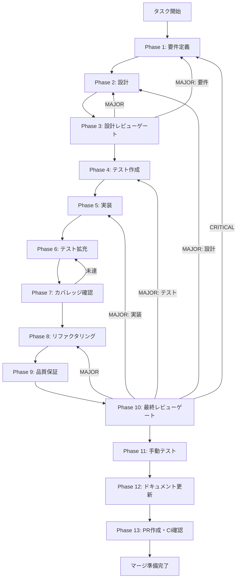

# Claude Agent SDK統合 - タスク実行仕様書

## ユーザーからの元の指示

```
Claude Agent SDK（@anthropic-ai/claude-agent-sdk）をElectronアプリに統合し、
query() API、Hooksシステム、Permission Control、ストリーミング出力を実装する。
ユーザーのClaude Codeサブスクリプションを活用したスキルベースのタスク実行機能を提供する。
```

## メタ情報

| 項目         | 内容                    |
| ------------ | ----------------------- |
| タスクID     | AGENT-005               |
| タスク名     | claude-code-integration |
| 分類         | 要件                    |
| 対象機能     | エージェント機能        |
| 優先度       | 高                      |
| 見積もり規模 | 大規模                  |
| ステータス   | 未実施                  |
| 作成日       | 2026-01-12              |

---

## 依存関係と並行実行

### 依存関係マップ

```
task-agent-01-dashboard-foundation.md (AGENT-001)
    │
    ├──► task-agent-02-skill-management-ui.md (AGENT-002) ─┐
    │                                                      │
    └──► task-agent-03-skill-management-backend.md ────────┼──► task-agent-04-execution-ui.md
         (AGENT-003) ※02と並行可能                         │    (AGENT-004)
                │                                          │
                └──► task-agent-05-claude-code-integration ┘    ※04と並行可能
                     (AGENT-005/本タスク) ※04と並行可能
                          │
                          └──► task-agent-06-custom-environment-ui.md (AGENT-006)
                                    │
                                    └──► task-agent-07-environment-backend.md (AGENT-007)
                                         ※06と並行可能
```

### 本タスクの位置づけ

| 項目                     | 内容                                                       |
| ------------------------ | ---------------------------------------------------------- |
| 直接依存                 | AGENT-003（スキル管理バックエンド）                        |
| 並行実行可能             | AGENT-004（エージェント実行UI）                            |
| 本タスク完了後に開始可能 | AGENT-006（カスタム実行環境UI）, AGENT-007（実行環境管理） |

---

## タスク概要

### 目的

Claude Agent SDK（`@anthropic-ai/claude-agent-sdk`）の`query()` APIをElectronアプリに統合し、Hooksシステム、Permission Control、ストリーミング出力、Permission Dialogを実装する。ユーザーのClaude Codeサブスクリプションを活用したスキルベースのタスク実行基盤を提供する。

### 背景

エージェント機能の中核として、**Claude Agent SDK** を使用して、ユーザーのClaude Codeサブスクリプションを活用したスキルベースのタスク実行機能を実装する必要がある。Claude Agent SDKは、Claude Codeの認証・サブスクリプションを自動的に利用するため、Anthropic APIキーを直接管理する必要がない。SDKの`query()` APIを使用することで、ストリーミング出力、Hooksシステム、Permission Controlを統合的に扱える。

現状の課題：

- Claude Agent SDKを統合する機能がない
- Hooksシステム（PreToolUse/PostToolUse/PermissionRequest）がない
- Permission Control（権限制御）の仕組みがない
- ストリーミング出力をIPC経由で転送する機能がない
- 実行の中断・キャンセル機能がない
- Permission Dialog（ユーザー承認UI）との連携がない

### 最終ゴール

- Claude Agent SDK `query()` APIでエージェントを実行できる
- Hooksシステムで危険なツール使用をブロックできる
- Permission Controlで宣言的に権限ルールを定義できる
- Permission Dialogでユーザー承認を求められる
- 実行結果がストリーミングでRendererに転送される
- AbortSignalで実行をキャンセルできる
- 複数の実行を管理できる

### 成果物一覧

| 種別         | 成果物                      | 配置先                                                     |
| ------------ | --------------------------- | ---------------------------------------------------------- |
| 機能         | AgentExecutor               | `apps/desktop/src/main/services/agent/AgentExecutor.ts`    |
| 機能         | ExecutionManager            | `apps/desktop/src/main/services/agent/ExecutionManager.ts` |
| 機能         | PermissionRulesConfig       | `apps/desktop/src/main/services/agent/PermissionRules.ts`  |
| 機能         | HooksFactory                | `apps/desktop/src/main/services/agent/HooksFactory.ts`     |
| 機能         | agentHandlers更新           | `apps/desktop/src/main/ipc/agentHandlers.ts`               |
| 型定義       | 型定義更新                  | `packages/shared/src/types/agent.ts`                       |
| IPCチャネル  | IPCチャネル更新             | `apps/desktop/src/preload/channels.ts`                     |
| テスト       | ユニット/統合テスト         | `apps/desktop/src/main/services/agent/*.test.ts`           |
| ドキュメント | 実装ガイド・APIリファレンス | `outputs/phase-12/`                                        |
| PR           | GitHub Pull Request         | GitHub UI                                                  |

---

## 参照資料

本仕様書の設計は以下を参照：

- `.claude/skills/aiworkflow-requirements/references/interfaces-agent-sdk.md` - Agent SDKインターフェース仕様
- `.claude/skills/aiworkflow-requirements/references/security-api-electron.md` - Electronセキュリティ仕様
- `.claude/skills/aiworkflow-requirements/references/architecture-patterns.md` - アーキテクチャパターン
- `.claude/skills/claude-agent-sdk/` - Claude Agent SDKスキル

---

## タスク分解サマリー

| ID     | フェーズ | サブタスク名           | 責務                               | 依存 |
| ------ | -------- | ---------------------- | ---------------------------------- | ---- |
| T-01-1 | Phase 1  | 要件抽出               | SDK統合要件の明確化                | -    |
| T-01-2 | Phase 1  | 受け入れ基準作成       | Given-When-Then形式で基準定義      | -    |
| T-02-1 | Phase 2  | 型定義設計             | AgentStreamMessage等の型設計       | T-01 |
| T-02-2 | Phase 2  | クラス設計             | AgentExecutor/ExecutionManager設計 | T-01 |
| T-02-3 | Phase 2  | IPC通信設計            | ストリーミングIPC設計              | T-01 |
| T-03-1 | Phase 3  | セキュリティレビュー   | コマンドインジェクション対策確認   | T-02 |
| T-03-2 | Phase 3  | 既存パターン整合       | 既存IPC設計との整合確認            | T-02 |
| T-04-1 | Phase 4  | HooksFactoryテスト     | PreToolUse/PostToolUseテスト       | T-03 |
| T-04-2 | Phase 4  | AgentExecutorテスト    | query()呼び出しテスト              | T-03 |
| T-04-3 | Phase 4  | ExecutionManagerテスト | 複数実行管理テスト                 | T-03 |
| T-04-4 | Phase 4  | 統合テストシナリオ作成 | API接続/エラー/認証連携テスト      | T-03 |
| T-05-1 | Phase 5  | 型定義実装             | packages/shared/src/types/agent.ts | T-04 |
| T-05-2 | Phase 5  | HooksFactory実装       | Hooks生成・IPC連携                 | T-04 |
| T-05-3 | Phase 5  | PermissionRules実装    | 宣言的権限ルール                   | T-04 |
| T-05-4 | Phase 5  | AgentExecutor実装      | SDK query() API統合                | T-04 |
| T-05-5 | Phase 5  | ExecutionManager実装   | 複数実行管理                       | T-04 |
| T-05-6 | Phase 5  | agentHandlers拡張      | IPCハンドラー追加                  | T-04 |
| T-06-1 | Phase 6  | カバレッジ分析         | 未到達コード特定                   | T-05 |
| T-06-2 | Phase 6  | 統合テスト拡充         | API/データフロー/エラー処理        | T-05 |
| T-07-1 | Phase 7  | カバレッジ検証         | 基準達成確認                       | T-06 |
| T-08-1 | Phase 8  | リファクタリング       | コード品質改善                     | T-07 |
| T-09-1 | Phase 9  | 品質保証               | 静的解析・セキュリティ             | T-08 |
| T-10-1 | Phase 10 | 最終レビュー           | 全体整合性検証                     | T-09 |
| T-11-1 | Phase 11 | 手動テスト             | UX・実環境動作確認                 | T-10 |
| T-12-1 | Phase 12 | 実装ガイド作成         | 概念的説明+技術的詳細              | T-11 |
| T-12-2 | Phase 12 | ドキュメント更新       | aiworkflow-requirements更新        | T-11 |
| T-12-3 | Phase 12 | 未タスク検出           | 残課題の検出と記録                 | T-11 |
| T-13-1 | Phase 13 | PR作成                 | /ai:diff-to-prでPR作成             | T-12 |

**総サブタスク数**: 25個

---

## 実行フロー図



---

## Phase一覧

| Phase | 名称               | 仕様書                                                 | ステータス |
| ----- | ------------------ | ------------------------------------------------------ | ---------- |
| 1     | 要件定義           | [phase-1-requirements.md](phase-1-requirements.md)     | 未実施     |
| 2     | 設計               | [phase-2-design.md](phase-2-design.md)                 | 未実施     |
| 3     | 設計レビューゲート | [phase-3-design-review.md](phase-3-design-review.md)   | 未実施     |
| 4     | テスト作成         | [phase-4-test-creation.md](phase-4-test-creation.md)   | 未実施     |
| 5     | 実装               | [phase-5-implementation.md](phase-5-implementation.md) | 未実施     |
| 6     | テスト拡充         | [phase-6-test-expansion.md](phase-6-test-expansion.md) | 未実施     |
| 7     | カバレッジ確認     | [phase-7-coverage-check.md](phase-7-coverage-check.md) | 未実施     |
| 8     | リファクタリング   | [phase-8-refactoring.md](phase-8-refactoring.md)       | 未実施     |
| 9     | 品質保証           | [phase-9-quality.md](phase-9-quality.md)               | 未実施     |
| 10    | 最終レビューゲート | [phase-10-final-review.md](phase-10-final-review.md)   | 未実施     |
| 11    | 手動テスト         | [phase-11-manual-test.md](phase-11-manual-test.md)     | 未実施     |
| 12    | ドキュメント更新   | [phase-12-documentation.md](phase-12-documentation.md) | 未実施     |
| 13    | PR作成             | [phase-13-pr-creation.md](phase-13-pr-creation.md)     | 未実施     |

---

## テストカバレッジ目標

### ユニットテスト

| 指標              | 最低基準 | 推奨基準 |
| ----------------- | -------- | -------- |
| Line Coverage     | 80%      | 90%      |
| Branch Coverage   | 60%      | 70%      |
| Function Coverage | 80%      | 90%      |

### 結合テスト

| 指標                         | 目標 |
| ---------------------------- | ---- |
| APIエンドポイント            | 100% |
| モジュール間インターフェース | 100% |
| 正常系シナリオ               | 100% |
| 異常系シナリオ               | 80%+ |
| 外部連携ポイント             | 100% |

---

## 統合テスト連携（Phase 1〜11で必須）

各Phaseで以下の統合テスト連携アクションを実施すること:

| Phase | 統合テスト連携アクション                                   |
| ----- | ---------------------------------------------------------- |
| 1     | IPC接続要件（agent:stream/agent:permission）を要件に明記   |
| 2     | SDK query() API・Hooks・ストリーミングの統合ポイントを設計 |
| 3     | セキュリティ観点（コマンドインジェクション防止）をレビュー |
| 4     | API接続/データフロー/エラー/Permission連携テストを作成     |
| 5     | Main→Renderer IPC通信・ストリーミング処理を実装            |
| 6     | 統合テストの拡充（全カテゴリのカバレッジ向上）             |
| 7     | 統合テストの再実行とゲート判定                             |
| 8     | リファクタ後の統合テスト継続成功を確認                     |
| 9     | 品質保証で統合テスト結果を確認                             |
| 10    | 最終レビューで統合テスト結果を確認                         |
| 11    | 手動統合テスト（エージェント実行→ストリーミング→完了）確認 |

---

## Phase完了時の必須アクション

**各Phase完了時に以下を必ず実行すること:**

1. **タスク100%実行**: Phase内で指定された全タスクを完全に実行
2. **成果物確認**: 全ての必須成果物が生成されていることを検証
3. **実行記録**: 実行タスクの結果を記録
4. **artifacts.json更新**: Phase完了ステータスを更新
5. **Phase末端の実行確認**: 各タスクを100%実行し、各タスクを完遂した旨を必ず明記

```bash
# Phase完了時の検証コマンド
node .claude/skills/task-specification-creator/scripts/validate-phase-output.mjs docs/30-workflows/claude-code-integration --phase {{PHASE_NUMBER}}

# Phase完了・成果物登録
node .claude/skills/task-specification-creator/scripts/complete-phase.mjs \
  --workflow docs/30-workflows/claude-code-integration --phase {{PHASE_NUMBER}} --artifacts "..."
```

---

## 完了条件チェックリスト

### 機能要件

- [ ] SDK `query()` APIでエージェントを実行できる
- [ ] Hooksシステムで危険なツール使用をブロックできる
- [ ] Permission Controlで宣言的に権限ルールを定義できる
- [ ] Permission Dialogでユーザー承認を求められる
- [ ] ストリーミング出力を受信できる
- [ ] AbortSignalで実行をキャンセルできる
- [ ] 複数の実行を管理できる

### 品質要件

- [ ] テストカバレッジ: Line 80%以上
- [ ] TypeScript型エラーなし
- [ ] ESLint/Prettierエラーなし

### セキュリティ要件

- [ ] 危険なBashコマンドがPreToolUseでブロックされる
- [ ] システムディレクトリへの書き込みがdenyルールで禁止される
- [ ] 書き込み系ツールがaskルールで確認を要求する
- [ ] AbortSignalが適切にチェックされる

### ドキュメント要件

- [ ] Claude Agent SDK統合仕様が文書化されている
- [ ] Hooksシステム実装ガイドが作成されている
- [ ] Permission Control設定ガイドが作成されている

---

## リスクと対策

| リスク                              | 影響度 | 発生確率 | 対策                                                 |
| ----------------------------------- | ------ | -------- | ---------------------------------------------------- |
| Claude Codeの認証が未完了           | 高     | 中       | 起動時チェック、認証ガイド表示                       |
| Permission Dialog応答のタイムアウト | 中     | 中       | タイムアウト設定、デフォルト拒否                     |
| ストリーミングの途切れ              | 中     | 低       | エラーハンドリング、再試行ロジック                   |
| AbortSignalの伝播漏れ               | 中     | 低       | signal.abortedの定期チェック、Hook内でのチェック実装 |
| 複数実行時のPermission競合          | 中     | 低       | executionIdによる分離、requestIdによる一意識別       |
