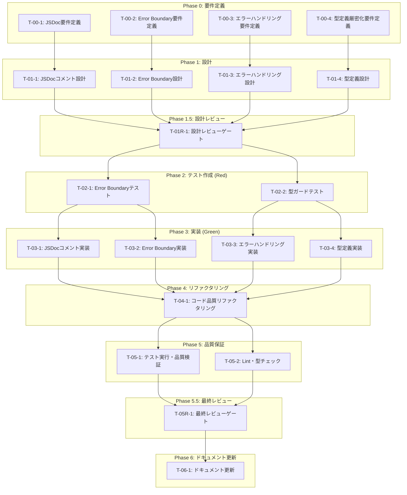

# login-only-auth コード品質強化 - タスク実行仕様書

## ユーザーからの元の指示

```
# コード品質改善タスク仕様書

## タスク概要

| 項目       | 内容                                                          |
| ---------- | ------------------------------------------------------------- |
| タスク名   | login-only-auth コード品質強化                                |
| 対象機能   | 認証画面（AuthView/AuthGuard/AccountSection）のコード品質向上 |
| 優先度     | 中                                                            |
| 見積もり   | 小規模                                                        |
| ステータス | 未実施                                                        |

## 背景と目的

Phase 5.5 Final Review Gate において、`@code-quality` エージェントによるコード品質レビューで以下の改善点が指摘された：

1. **JSDoc コメント不足**
2. **Error Boundary 未実装**
3. **エラーハンドリングの改善余地**
4. **型定義の厳密化**

これらの改善を行い、コードの保守性と可読性を向上させる。
```

---

## タスク概要

### 目的

Phase 5.5 Final Review Gateで指摘されたコード品質課題を解決し、認証関連コンポーネントの保守性・可読性・堅牢性を向上させる。具体的には以下の4点を改善する：

1. **JSDocコメント追加** - 全パブリック関数・コンポーネントに適切なドキュメントを追加
2. **Error Boundary実装** - 認証コンポーネント用のエラー境界を実装
3. **エラーハンドリング改善** - エラー処理の統一と日本語化
4. **型定義厳密化** - any型排除とDiscriminated Union活用

### 背景

コード品質の改善は技術的負債の蓄積を防ぎ、チーム開発における生産性を維持するために重要である。特に認証機能はアプリケーションの中核であり、高品質なコードベースを維持することが求められる。

### 最終ゴール

- 全対象ファイルにJSDocコメントが追加されている
- AuthErrorBoundaryが実装され、テストが通過している
- エラーハンドリングが統一され、日本語メッセージが表示される
- any型が排除され、型安全性が向上している
- `@code-quality`エージェントのレビューでPASS評価を取得

### 成果物一覧

| 種別         | 成果物                           | 配置先                                                                      |
| ------------ | -------------------------------- | --------------------------------------------------------------------------- |
| 機能         | AuthErrorBoundary コンポーネント | `apps/desktop/src/renderer/components/AuthGuard/AuthErrorBoundary.tsx`      |
| 機能         | 型定義ファイル                   | `apps/desktop/src/renderer/components/AuthGuard/types.ts`                   |
| テスト       | AuthErrorBoundaryテスト          | `apps/desktop/src/renderer/components/AuthGuard/AuthErrorBoundary.test.tsx` |
| ドキュメント | 品質レポート                     | `docs/30-workflows/code-quality-improvements/quality-report.md`             |

---

## 参照ファイル

本仕様書のコマンド・エージェント・スキル選定は以下を参照：

- `docs/00-requirements/master_system_design.md` - システム要件
- `.claude/commands/ai/command_list.md` - /ai:コマンド定義
- `.claude/agents/agent_list.md` - エージェント定義
- `.claude/skills/skill_list.md` - スキル定義

---

## タスク分解サマリー

| ID      | フェーズ  | サブタスク名               | 責務                                         | 依存           |
| ------- | --------- | -------------------------- | -------------------------------------------- | -------------- |
| T-00-1  | Phase 0   | JSDoc要件定義              | JSDocコメントの要件と対象ファイルの特定      | なし           |
| T-00-2  | Phase 0   | Error Boundary要件定義     | Error Boundaryの機能要件定義                 | なし           |
| T-00-3  | Phase 0   | エラーハンドリング要件定義 | エラー処理統一の要件定義                     | なし           |
| T-00-4  | Phase 0   | 型定義厳密化要件定義       | any型排除と型ガード追加の要件定義            | なし           |
| T-01-1  | Phase 1   | JSDocコメント設計          | JSDocコメントのテンプレートと規約設計        | T-00-1         |
| T-01-2  | Phase 1   | Error Boundary設計         | AuthErrorBoundaryコンポーネント設計          | T-00-2         |
| T-01-3  | Phase 1   | エラーハンドリング設計     | エラー処理ヘルパーと日本語化設計             | T-00-3         |
| T-01-4  | Phase 1   | 型定義設計                 | 型ガード・Discriminated Union設計            | T-00-4         |
| T-01R-1 | Phase 1.5 | 設計レビューゲート         | 設計の妥当性検証                             | T-01-1〜T-01-4 |
| T-02-1  | Phase 2   | Error Boundaryテスト作成   | AuthErrorBoundaryのテスト作成（Red）         | T-01R-1        |
| T-02-2  | Phase 2   | 型ガードテスト作成         | 型ガード関数のテスト作成（Red）              | T-01R-1        |
| T-03-1  | Phase 3   | JSDocコメント実装          | 対象ファイルへのJSDoc追加                    | T-02-1         |
| T-03-2  | Phase 3   | Error Boundary実装         | AuthErrorBoundaryコンポーネント実装（Green） | T-02-1         |
| T-03-3  | Phase 3   | エラーハンドリング実装     | handleAuthErrorヘルパー実装                  | T-02-2         |
| T-03-4  | Phase 3   | 型定義実装                 | 型定義ファイルと型ガード実装（Green）        | T-02-2         |
| T-04-1  | Phase 4   | コード品質リファクタリング | コード整理と一貫性確保                       | T-03-1〜T-03-4 |
| T-05-1  | Phase 5   | テスト実行・品質検証       | 全テスト実行とカバレッジ確認                 | T-04-1         |
| T-05-2  | Phase 5   | Lint・型チェック           | ESLint/TypeScriptエラー確認                  | T-04-1         |
| T-05R-1 | Phase 5.5 | 最終レビューゲート         | コード品質の最終検証                         | T-05-1〜T-05-2 |
| T-06-1  | Phase 6   | ドキュメント更新           | システムドキュメントへの反映                 | T-05R-1        |

**総サブタスク数**: 18個

---

## 実行フロー図



---

## Phase 0: 要件定義

### T-00-1: JSDoc要件定義

#### 目的

JSDocコメントを追加すべき対象ファイルと、コメントの形式・内容を明確に定義する。

#### 背景

コードの可読性と保守性を向上させるため、パブリックAPI・コンポーネントには適切なドキュメントが必要である。

#### 責務（単一責務）

JSDocコメントの要件定義のみを担う。

#### Claude Code スラッシュコマンド

> ⚠️ 以下はターミナルコマンドではなく、Claude Code内で実行するスラッシュコマンドです

```
/ai:gather-requirements JSDoc-documentation
```

- **参照**: `.claude/commands/ai/command_list.md`

#### 使用エージェント

- **エージェント**: `@req-analyst`
- **選定理由**: 要件の明確化と検証可能な基準の定義が専門
- **参照**: `.claude/agents/agent_list.md`

#### 活用スキル

| スキル名                    | 活用方法                      |
| --------------------------- | ----------------------------- |
| requirements-engineering    | JSDoc要件の構造化と優先度付け |
| acceptance-criteria-writing | テスト可能な完了条件の定義    |

- **参照**: `.claude/skills/skill_list.md`

#### 成果物

| 成果物      | パス                                                                | 内容                                     |
| ----------- | ------------------------------------------------------------------- | ---------------------------------------- |
| JSDoc要件書 | `docs/30-workflows/code-quality-improvements/requirements-jsdoc.md` | 対象ファイル一覧、コメント形式、完了基準 |

#### 完了条件

- [ ] 対象ファイル5件が特定されている
- [ ] JSDocコメントの形式が定義されている
- [ ] 各要件に優先度が設定されている

#### 依存関係

- **前提**: なし
- **後続**: T-01-1

---

### T-00-2: Error Boundary要件定義

#### 目的

認証コンポーネント用Error Boundaryの機能要件と動作仕様を定義する。

#### 背景

Reactのエラー境界は子コンポーネントのエラーをキャッチし、UIのクラッシュを防ぐ重要なパターンである。

#### 責務（単一責務）

Error Boundaryの機能要件定義のみを担う。

#### Claude Code スラッシュコマンド

> ⚠️ 以下はターミナルコマンドではなく、Claude Code内で実行するスラッシュコマンドです

```
/ai:gather-requirements error-boundary
```

- **参照**: `.claude/commands/ai/command_list.md`

#### 使用エージェント

- **エージェント**: `@req-analyst`
- **選定理由**: 機能要件の定義が専門
- **参照**: `.claude/agents/agent_list.md`

#### 活用スキル

| スキル名                               | 活用方法                   |
| -------------------------------------- | -------------------------- |
| requirements-engineering               | Error Boundary要件の構造化 |
| functional-non-functional-requirements | 機能・非機能要件の分離     |

- **参照**: `.claude/skills/skill_list.md`

#### 成果物

| 成果物               | パス                                                                         | 内容                                             |
| -------------------- | ---------------------------------------------------------------------------- | ------------------------------------------------ |
| Error Boundary要件書 | `docs/30-workflows/code-quality-improvements/requirements-error-boundary.md` | 機能要件、フォールバックUI仕様、リトライ機能仕様 |

#### 完了条件

- [ ] Error Boundaryの機能要件4件が定義されている
- [ ] フォールバックUIの仕様が明確である
- [ ] リトライ機能の動作が定義されている

#### 依存関係

- **前提**: なし
- **後続**: T-01-2

---

### T-00-3: エラーハンドリング要件定義

#### 目的

エラー処理の統一方針と日本語メッセージの設計を定義する。

#### 背景

現状のエラーハンドリングは各所で異なる実装となっており、ユーザー体験の一貫性が欠けている。

#### 責務（単一責務）

エラーハンドリング統一の要件定義のみを担う。

#### Claude Code スラッシュコマンド

> ⚠️ 以下はターミナルコマンドではなく、Claude Code内で実行するスラッシュコマンドです

```
/ai:gather-requirements error-handling
```

- **参照**: `.claude/commands/ai/command_list.md`

#### 使用エージェント

- **エージェント**: `@req-analyst`
- **選定理由**: 要件の構造化が専門
- **参照**: `.claude/agents/agent_list.md`

#### 活用スキル

| スキル名                    | 活用方法                       |
| --------------------------- | ------------------------------ |
| requirements-engineering    | エラーハンドリング要件の構造化 |
| acceptance-criteria-writing | 検証可能な完了条件の定義       |

- **参照**: `.claude/skills/skill_list.md`

#### 成果物

| 成果物                   | パス                                                                         | 内容                                     |
| ------------------------ | ---------------------------------------------------------------------------- | ---------------------------------------- |
| エラーハンドリング要件書 | `docs/30-workflows/code-quality-improvements/requirements-error-handling.md` | エラー種別、日本語メッセージ、処理フロー |

#### 完了条件

- [ ] エラー種別が分類されている
- [ ] 各エラー種別の日本語メッセージが定義されている
- [ ] 対象関数5件が特定されている

#### 依存関係

- **前提**: なし
- **後続**: T-01-3

---

### T-00-4: 型定義厳密化要件定義

#### 目的

any型の排除と型ガード・Discriminated Unionの適用要件を定義する。

#### 背景

TypeScriptの型安全性を最大限活用するため、any型を排除し、より厳密な型定義が必要である。

#### 責務（単一責務）

型定義厳密化の要件定義のみを担う。

#### Claude Code スラッシュコマンド

> ⚠️ 以下はターミナルコマンドではなく、Claude Code内で実行するスラッシュコマンドです

```
/ai:gather-requirements type-safety
```

- **参照**: `.claude/commands/ai/command_list.md`

#### 使用エージェント

- **エージェント**: `@req-analyst`
- **選定理由**: 要件の明確化が専門
- **参照**: `.claude/agents/agent_list.md`

#### 活用スキル

| スキル名                               | 活用方法             |
| -------------------------------------- | -------------------- |
| requirements-engineering               | 型安全性要件の構造化 |
| functional-non-functional-requirements | 品質要件の定義       |

- **参照**: `.claude/skills/skill_list.md`

#### 成果物

| 成果物       | パス                                                                      | 内容                                                 |
| ------------ | ------------------------------------------------------------------------- | ---------------------------------------------------- |
| 型定義要件書 | `docs/30-workflows/code-quality-improvements/requirements-type-safety.md` | any型使用箇所、型ガード要件、Discriminated Union設計 |

#### 完了条件

- [ ] any型の使用箇所が特定されている
- [ ] 型ガード関数の要件が定義されている
- [ ] Discriminated Unionの適用箇所が明確である

#### 依存関係

- **前提**: なし
- **後続**: T-01-4

---

## Phase 1: 設計

### T-01-1: JSDocコメント設計

#### 目的

JSDocコメントのテンプレートと規約を設計する。

#### 背景

一貫性のあるドキュメントを実現するため、統一された形式が必要である。

#### 責務（単一責務）

JSDocコメントの設計のみを担う。

#### Claude Code スラッシュコマンド

> ⚠️ 以下はターミナルコマンドではなく、Claude Code内で実行するスラッシュコマンドです

```
/ai:write-spec jsdoc-documentation
```

- **参照**: `.claude/commands/ai/command_list.md`

#### 使用エージェント

- **エージェント**: `@spec-writer`
- **選定理由**: 技術ドキュメントの構造設計が専門
- **参照**: `.claude/agents/agent_list.md`

#### 活用スキル

| スキル名                          | 活用方法                    |
| --------------------------------- | --------------------------- |
| markdown-advanced-syntax          | コードブロック内のJSDoc記法 |
| technical-documentation-standards | ドキュメント品質基準の適用  |

- **参照**: `.claude/skills/skill_list.md`

#### 成果物

| 成果物      | パス                                                          | 内容                                   |
| ----------- | ------------------------------------------------------------- | -------------------------------------- |
| JSDoc設計書 | `docs/30-workflows/code-quality-improvements/design-jsdoc.md` | テンプレート、タグ規約、サンプルコード |

#### 完了条件

- [ ] コンポーネント用テンプレートが定義されている
- [ ] 関数用テンプレートが定義されている
- [ ] @param, @returns, @example タグの使用規約が明確である

#### 依存関係

- **前提**: T-00-1
- **後続**: T-01R-1

---

### T-01-2: Error Boundary設計

#### 目的

AuthErrorBoundaryコンポーネントの詳細設計を行う。

#### 背景

要件に基づき、実装可能な詳細設計を作成する。

#### 責務（単一責務）

Error Boundaryの設計のみを担う。

#### Claude Code スラッシュコマンド

> ⚠️ 以下はターミナルコマンドではなく、Claude Code内で実行するスラッシュコマンドです

```
/ai:create-component AuthErrorBoundary organism
```

- **参照**: `.claude/commands/ai/command_list.md`

#### 使用エージェント

- **エージェント**: `@ui-designer`
- **選定理由**: UIコンポーネント設計が専門
- **参照**: `.claude/agents/agent_list.md`

#### 活用スキル

| スキル名           | 活用方法                               |
| ------------------ | -------------------------------------- |
| error-boundary     | Error Boundaryパターンの適用           |
| accessibility-wcag | フォールバックUIのアクセシビリティ確保 |

- **参照**: `.claude/skills/skill_list.md`

#### 成果物

| 成果物               | パス                                                                   | 内容                                                       |
| -------------------- | ---------------------------------------------------------------------- | ---------------------------------------------------------- |
| Error Boundary設計書 | `docs/30-workflows/code-quality-improvements/design-error-boundary.md` | コンポーネント構造、Props定義、State定義、フォールバックUI |

#### 完了条件

- [ ] Propsインターフェースが定義されている
- [ ] State構造が定義されている
- [ ] フォールバックUIのデザインが明確である
- [ ] リトライロジックが設計されている

#### 依存関係

- **前提**: T-00-2
- **後続**: T-01R-1

---

### T-01-3: エラーハンドリング設計

#### 目的

handleAuthErrorヘルパー関数と日本語メッセージマッピングを設計する。

#### 背景

エラー処理の統一と国際化対応の基盤を構築する。

#### 責務（単一責務）

エラーハンドリングの設計のみを担う。

#### Claude Code スラッシュコマンド

> ⚠️ 以下はターミナルコマンドではなく、Claude Code内で実行するスラッシュコマンドです

```
/ai:write-spec error-handling-helper
```

- **参照**: `.claude/commands/ai/command_list.md`

#### 使用エージェント

- **エージェント**: `@logic-dev`
- **選定理由**: ビジネスロジック実装設計が専門
- **参照**: `.claude/agents/agent_list.md`

#### 活用スキル

| スキル名             | 活用方法                             |
| -------------------- | ------------------------------------ |
| clean-code-practices | 明確な関数設計                       |
| error-message-design | ユーザーフレンドリーなメッセージ設計 |

- **参照**: `.claude/skills/skill_list.md`

#### 成果物

| 成果物                   | パス                                                                   | 内容                                                              |
| ------------------------ | ---------------------------------------------------------------------- | ----------------------------------------------------------------- |
| エラーハンドリング設計書 | `docs/30-workflows/code-quality-improvements/design-error-handling.md` | handleAuthError関数設計、エラーコードマッピング、日本語メッセージ |

#### 完了条件

- [ ] handleAuthError関数のシグネチャが定義されている
- [ ] エラーコードと日本語メッセージのマッピングが完成している
- [ ] 既存コードへの適用箇所が明確である

#### 依存関係

- **前提**: T-00-3
- **後続**: T-01R-1

---

### T-01-4: 型定義設計

#### 目的

型ガード関数とDiscriminated Unionの詳細設計を行う。

#### 背景

型安全性の向上により、ランタイムエラーを防止する。

#### 責務（単一責務）

型定義の設計のみを担う。

#### Claude Code スラッシュコマンド

> ⚠️ 以下はターミナルコマンドではなく、Claude Code内で実行するスラッシュコマンドです

```
/ai:create-schema auth-guard-types
```

- **参照**: `.claude/commands/ai/command_list.md`

#### 使用エージェント

- **エージェント**: `@schema-def`
- **選定理由**: 型定義とスキーマ設計が専門
- **参照**: `.claude/agents/agent_list.md`

#### 活用スキル

| スキル名             | 活用方法                            |
| -------------------- | ----------------------------------- |
| type-safety-patterns | Discriminated Union、型ガードの設計 |
| zod-validation       | ランタイムバリデーションとの統合    |

- **参照**: `.claude/skills/skill_list.md`

#### 成果物

| 成果物       | パス                                                                     | 内容                                        |
| ------------ | ------------------------------------------------------------------------ | ------------------------------------------- |
| 型定義設計書 | `docs/30-workflows/code-quality-improvements/design-type-definitions.md` | AuthGuardState型、型ガード関数、AuthError型 |

#### 完了条件

- [ ] AuthGuardState Discriminated Unionが定義されている
- [ ] isAuthenticated型ガードが設計されている
- [ ] AuthError型が定義されている

#### 依存関係

- **前提**: T-00-4
- **後続**: T-01R-1

---

## Phase 1.5: 設計レビューゲート

### T-01R-1: 設計レビューゲート

#### 目的

実装開始前に要件・設計の妥当性を複数エージェントで検証する。

#### 背景

設計ミスが実装後に発見されると修正コストが大幅に増加する。「Shift Left」原則に基づき、問題を可能な限り早期に検出する。

#### レビュー参加エージェント

| エージェント    | レビュー観点         | 選定理由                     |
| --------------- | -------------------- | ---------------------------- |
| `@req-analyst`  | 要件充足性           | 要件定義の専門家             |
| `@arch-police`  | アーキテクチャ整合性 | クリーンアーキテクチャの監視 |
| `@code-quality` | コード品質基準       | 品質基準の専門家             |

- **参照**: `.claude/agents/agent_list.md`

#### レビューチェックリスト

**要件充足性** (@req-analyst)

- [ ] 全ての要件が設計でカバーされているか
- [ ] 受け入れ基準が具体的か
- [ ] スコープが適切に定義されているか

**アーキテクチャ整合性** (@arch-police)

- [ ] 既存のコンポーネント構造と整合性があるか
- [ ] 依存関係が適切か
- [ ] SOLID原則に違反していないか

**コード品質基準** (@code-quality)

- [ ] JSDoc形式が標準に準拠しているか
- [ ] 型定義が厳密か
- [ ] エラーハンドリングパターンが一貫しているか

#### レビュー結果

- **判定**: （実行時に記入）
- **指摘事項**: （実行時に記入）
- **対応方針**: （実行時に記入）

#### 戻り先決定（MAJORの場合）

| 問題の種類 | 戻り先                    |
| ---------- | ------------------------- |
| 要件の問題 | Phase 0（要件定義）へ戻る |
| 設計の問題 | Phase 1（設計）へ戻る     |

#### 完了条件

- [ ] 全レビュー観点でチェックが完了している
- [ ] 重大な問題がないことが確認されている
- [ ] PASS/MINOR判定を取得している

#### 依存関係

- **前提**: T-01-1〜T-01-4
- **後続**: T-02-1, T-02-2

---

## Phase 2: テスト作成 (TDD: Red)

### T-02-1: Error Boundaryテスト作成

#### 目的

AuthErrorBoundaryコンポーネントのテストを実装より先に作成する。

#### 背景

TDD原則に従い、期待される動作を先にテストとして定義する。

#### 責務（単一責務）

Error Boundaryのテスト作成のみを担う。

#### Claude Code スラッシュコマンド

> ⚠️ 以下はターミナルコマンドではなく、Claude Code内で実行するスラッシュコマンドです

```
/ai:generate-unit-tests apps/desktop/src/renderer/components/AuthGuard/AuthErrorBoundary.tsx
```

- **参照**: `.claude/commands/ai/command_list.md`

#### 使用エージェント

- **エージェント**: `@unit-tester`
- **選定理由**: TDDとユニットテスト作成が専門
- **参照**: `.claude/agents/agent_list.md`

#### 活用スキル

| スキル名        | 活用方法                         |
| --------------- | -------------------------------- |
| tdd-principles  | Red-Green-Refactorサイクルの適用 |
| test-doubles    | エラー発生のモック               |
| vitest-advanced | Reactコンポーネントテスト        |

- **参照**: `.claude/skills/skill_list.md`

#### 成果物

| 成果物         | パス                                                                        | 内容                         |
| -------------- | --------------------------------------------------------------------------- | ---------------------------- |
| テストファイル | `apps/desktop/src/renderer/components/AuthGuard/AuthErrorBoundary.test.tsx` | Error Boundaryのテストケース |

#### TDD検証: Red状態確認

```bash
pnpm --filter @repo/desktop test:run -- AuthErrorBoundary
```

- [ ] テストが失敗することを確認（Red状態）

#### 完了条件

- [ ] 子コンポーネントでエラー発生時のテストがある
- [ ] 再試行ボタンクリック時のテストがある
- [ ] 正常時は子コンポーネントが表示されるテストがある
- [ ] テストが失敗状態（Red）である

#### 依存関係

- **前提**: T-01R-1
- **後続**: T-03-1, T-03-2

---

### T-02-2: 型ガードテスト作成

#### 目的

型ガード関数のテストを実装より先に作成する。

#### 背景

型ガードの正確性を検証するテストを先に定義する。

#### 責務（単一責務）

型ガードのテスト作成のみを担う。

#### Claude Code スラッシュコマンド

> ⚠️ 以下はターミナルコマンドではなく、Claude Code内で実行するスラッシュコマンドです

```
/ai:generate-unit-tests apps/desktop/src/renderer/components/AuthGuard/types.ts
```

- **参照**: `.claude/commands/ai/command_list.md`

#### 使用エージェント

- **エージェント**: `@unit-tester`
- **選定理由**: 型安全性のテストが専門
- **参照**: `.claude/agents/agent_list.md`

#### 活用スキル

| スキル名                | 活用方法               |
| ----------------------- | ---------------------- |
| tdd-principles          | テストファーストの適用 |
| boundary-value-analysis | 境界値テストの設計     |

- **参照**: `.claude/skills/skill_list.md`

#### 成果物

| 成果物         | パス                                                           | 内容                       |
| -------------- | -------------------------------------------------------------- | -------------------------- |
| テストファイル | `apps/desktop/src/renderer/components/AuthGuard/types.test.ts` | 型ガード関数のテストケース |

#### TDD検証: Red状態確認

```bash
pnpm --filter @repo/desktop test:run -- types.test
```

- [ ] テストが失敗することを確認（Red状態）

#### 完了条件

- [ ] isAuthenticated型ガードのテストがある
- [ ] 各AuthGuardState状態のテストがある
- [ ] テストが失敗状態（Red）である

#### 依存関係

- **前提**: T-01R-1
- **後続**: T-03-3, T-03-4

---

## Phase 3: 実装 (TDD: Green)

### T-03-1: JSDocコメント実装

#### 目的

対象ファイルにJSDocコメントを追加する。

#### 背景

設計で定義したテンプレートに従い、一貫性のあるドキュメントを追加する。

#### 責務（単一責務）

JSDocコメントの実装のみを担う。

#### Claude Code スラッシュコマンド

> ⚠️ 以下はターミナルコマンドではなく、Claude Code内で実行するスラッシュコマンドです

```
/ai:refactor apps/desktop/src/renderer/components/AuthGuard/index.tsx
```

- **参照**: `.claude/commands/ai/command_list.md`

#### 使用エージェント

- **エージェント**: `@code-quality`
- **選定理由**: コード品質改善が専門
- **参照**: `.claude/agents/agent_list.md`

#### 活用スキル

| スキル名             | 活用方法                 |
| -------------------- | ------------------------ |
| clean-code-practices | 可読性の高いコメント作成 |
| code-style-guides    | 一貫したスタイルの適用   |

- **参照**: `.claude/skills/skill_list.md`

#### 成果物

| 成果物       | パス                                                                      | 内容              |
| ------------ | ------------------------------------------------------------------------- | ----------------- |
| 更新ファイル | `apps/desktop/src/renderer/components/AuthGuard/index.tsx`                | JSDocコメント追加 |
| 更新ファイル | `apps/desktop/src/renderer/components/AuthGuard/LoadingScreen.tsx`        | JSDocコメント追加 |
| 更新ファイル | `apps/desktop/src/renderer/views/AuthView/index.tsx`                      | JSDocコメント追加 |
| 更新ファイル | `apps/desktop/src/renderer/components/organisms/AccountSection/index.tsx` | JSDocコメント追加 |
| 更新ファイル | `apps/desktop/src/renderer/components/atoms/ProviderIcon/index.tsx`       | JSDocコメント追加 |

#### 完了条件

- [ ] AuthGuard/index.tsx にJSDoc追加
- [ ] AuthGuard/LoadingScreen.tsx にJSDoc追加
- [ ] AuthView/index.tsx にJSDoc追加
- [ ] AccountSection/index.tsx にJSDoc追加
- [ ] ProviderIcon/index.tsx にJSDoc追加

#### 依存関係

- **前提**: T-02-1
- **後続**: T-04-1

---

### T-03-2: Error Boundary実装

#### 目的

AuthErrorBoundaryコンポーネントを実装し、テストを通過させる。

#### 背景

TDD Green段階として、テストを通過する最小限の実装を行う。

#### 責務（単一責務）

Error Boundaryの実装のみを担う。

#### Claude Code スラッシュコマンド

> ⚠️ 以下はターミナルコマンドではなく、Claude Code内で実行するスラッシュコマンドです

```
/ai:create-component AuthErrorBoundary organism
```

- **参照**: `.claude/commands/ai/command_list.md`

#### 使用エージェント

- **エージェント**: `@ui-designer`
- **選定理由**: UIコンポーネント実装が専門
- **参照**: `.claude/agents/agent_list.md`

#### 活用スキル

| スキル名           | 活用方法                   |
| ------------------ | -------------------------- |
| error-boundary     | Error Boundary実装パターン |
| accessibility-wcag | アクセシブルなUI実装       |

- **参照**: `.claude/skills/skill_list.md`

#### 成果物

| 成果物         | パス                                                                   | 内容                         |
| -------------- | ---------------------------------------------------------------------- | ---------------------------- |
| コンポーネント | `apps/desktop/src/renderer/components/AuthGuard/AuthErrorBoundary.tsx` | Error Boundaryコンポーネント |

#### TDD検証: Green状態確認

```bash
pnpm --filter @repo/desktop test:run -- AuthErrorBoundary
```

- [ ] テストが成功することを確認（Green状態）

#### 完了条件

- [ ] AuthErrorBoundary.tsx が作成されている
- [ ] getDerivedStateFromErrorが実装されている
- [ ] componentDidCatchでエラーログが出力される
- [ ] フォールバックUIが表示される
- [ ] 再試行ボタンが機能する
- [ ] テストが成功状態（Green）である

#### 依存関係

- **前提**: T-02-1
- **後続**: T-04-1

---

### T-03-3: エラーハンドリング実装

#### 目的

handleAuthErrorヘルパー関数を実装し、既存コードに適用する。

#### 背景

統一されたエラーハンドリングにより、ユーザー体験を向上させる。

#### 責務（単一責務）

エラーハンドリングの実装のみを担う。

#### Claude Code スラッシュコマンド

> ⚠️ 以下はターミナルコマンドではなく、Claude Code内で実行するスラッシュコマンドです

```
/ai:implement-business-logic auth-error-handler
```

- **参照**: `.claude/commands/ai/command_list.md`

#### 使用エージェント

- **エージェント**: `@logic-dev`
- **選定理由**: ビジネスロジック実装が専門
- **参照**: `.claude/agents/agent_list.md`

#### 活用スキル

| スキル名               | 活用方法           |
| ---------------------- | ------------------ |
| clean-code-practices   | 明確な関数実装     |
| refactoring-techniques | 既存コードへの適用 |

- **参照**: `.claude/skills/skill_list.md`

#### 成果物

| 成果物       | パス                                                  | 内容                                          |
| ------------ | ----------------------------------------------------- | --------------------------------------------- |
| ヘルパー関数 | `apps/desktop/src/renderer/store/slices/authSlice.ts` | handleAuthError関数追加、既存エラー処理の統一 |

#### 完了条件

- [ ] handleAuthError関数が実装されている
- [ ] login関数のエラーハンドリングが統一されている
- [ ] logout関数のエラーハンドリングが統一されている
- [ ] 日本語エラーメッセージが表示される

#### 依存関係

- **前提**: T-02-2
- **後続**: T-04-1

---

### T-03-4: 型定義実装

#### 目的

型定義ファイルと型ガード関数を実装し、テストを通過させる。

#### 背景

TDD Green段階として、型安全性を確保する実装を行う。

#### 責務（単一責務）

型定義の実装のみを担う。

#### Claude Code スラッシュコマンド

> ⚠️ 以下はターミナルコマンドではなく、Claude Code内で実行するスラッシュコマンドです

```
/ai:create-schema auth-guard-types
```

- **参照**: `.claude/commands/ai/command_list.md`

#### 使用エージェント

- **エージェント**: `@schema-def`
- **選定理由**: 型定義実装が専門
- **参照**: `.claude/agents/agent_list.md`

#### 活用スキル

| スキル名             | 活用方法                |
| -------------------- | ----------------------- |
| type-safety-patterns | Discriminated Union実装 |
| zod-validation       | ランタイム検証との統合  |

- **参照**: `.claude/skills/skill_list.md`

#### 成果物

| 成果物         | パス                                                      | 内容                                |
| -------------- | --------------------------------------------------------- | ----------------------------------- |
| 型定義ファイル | `apps/desktop/src/renderer/components/AuthGuard/types.ts` | AuthGuardState、型ガード、AuthError |

#### TDD検証: Green状態確認

```bash
pnpm --filter @repo/desktop test:run -- types.test
```

- [ ] テストが成功することを確認（Green状態）

#### 完了条件

- [ ] AuthGuardState Discriminated Unionが実装されている
- [ ] isAuthenticated型ガードが実装されている
- [ ] AuthError型が実装されている
- [ ] テストが成功状態（Green）である

#### 依存関係

- **前提**: T-02-2
- **後続**: T-04-1

---

## Phase 4: リファクタリング (TDD: Refactor)

### T-04-1: コード品質リファクタリング

#### 目的

動作を変えずにコード品質を改善する。

#### 背景

TDD Refactor段階として、コードの一貫性と可読性を向上させる。

#### 責務（単一責務）

コード品質のリファクタリングのみを担う。

#### Claude Code スラッシュコマンド

> ⚠️ 以下はターミナルコマンドではなく、Claude Code内で実行するスラッシュコマンドです

```
/ai:refactor apps/desktop/src/renderer/components/AuthGuard
```

- **参照**: `.claude/commands/ai/command_list.md`

#### 使用エージェント

- **エージェント**: `@code-quality`
- **選定理由**: コード品質改善が専門
- **参照**: `.claude/agents/agent_list.md`

#### 活用スキル

| スキル名               | 活用方法                 |
| ---------------------- | ------------------------ |
| refactoring-techniques | 安全なリファクタリング   |
| clean-code-practices   | コード可読性の向上       |
| code-smell-detection   | コードスメルの検出と解消 |

- **参照**: `.claude/skills/skill_list.md`

#### 成果物

| 成果物                       | パス                                              | 内容                 |
| ---------------------------- | ------------------------------------------------- | -------------------- |
| リファクタリング済みファイル | `apps/desktop/src/renderer/components/AuthGuard/` | 品質改善されたコード |

#### TDD検証: 継続Green確認

```bash
pnpm --filter @repo/desktop test:run
```

- [ ] リファクタリング後もテストが成功することを確認

#### 完了条件

- [ ] コードの一貫性が確保されている
- [ ] 重複コードが排除されている
- [ ] 命名が適切である
- [ ] テストが継続して成功している

#### 依存関係

- **前提**: T-03-1〜T-03-4
- **後続**: T-05-1, T-05-2

---

---

## Phase 5.5: 最終レビューゲート

### T-05R-1: 最終レビューゲート

#### 目的

実装完了後、ドキュメント更新前に全体的な品質・整合性を検証する。

#### 背景

Phase 5の自動検証だけでは検出できない設計判断やベストプラクティス違反を人間的視点で確認する。

#### レビュー参加エージェント

| エージェント    | レビュー観点       | 選定理由                         |
| --------------- | ------------------ | -------------------------------- |
| `@code-quality` | コード品質         | コーディング規約・可読性の専門家 |
| `@arch-police`  | アーキテクチャ遵守 | 設計原則の監視                   |
| `@unit-tester`  | テスト品質         | テスト設計の専門家               |

- **参照**: `.claude/agents/agent_list.md`

#### レビューチェックリスト

**コード品質** (@code-quality)

- [ ] コーディング規約への準拠
- [ ] 可読性・保守性の確保
- [ ] 適切なエラーハンドリング
- [ ] JSDocコメントの品質

**アーキテクチャ遵守** (@arch-police)

- [ ] 実装がアーキテクチャ設計に従っているか
- [ ] レイヤー間の依存関係が適切か
- [ ] SOLID原則への準拠

**テスト品質** (@unit-tester)

- [ ] テストカバレッジが十分か
- [ ] テストケースが適切に設計されているか
- [ ] 境界値・異常系のテストがあるか

#### レビュー結果

- **判定**: （実行時に記入）
- **指摘事項**: （実行時に記入）
- **対応方針**: （実行時に記入）

#### 戻り先決定（MAJOR/CRITICALの場合）

| 問題の種類       | 戻り先                            |
| ---------------- | --------------------------------- |
| 設計の問題       | Phase 1（設計）へ戻る             |
| テスト設計の問題 | Phase 2（テスト作成）へ戻る       |
| 実装の問題       | Phase 3（実装）へ戻る             |
| コード品質の問題 | Phase 4（リファクタリング）へ戻る |

#### 完了条件

- [ ] 全レビュー観点でチェックが完了している
- [ ] 重大な問題がないことが確認されている
- [ ] PASS/MINOR判定を取得している

#### 依存関係

- **前提**: T-05-1, T-05-2
- **後続**: T-06-1

---

## Phase 6: ドキュメント更新・未完了タスク記録

### T-06-1: ドキュメント更新

#### 目的

タスク完了後、実装した内容をシステム要件ドキュメントに反映する。

#### 前提条件

- [ ] Phase 5の品質ゲートをすべて通過
- [ ] Phase 5.5の最終レビューゲートを通過
- [ ] すべてのテストが成功

---

#### サブタスク 6.1: システムドキュメント更新

##### 更新対象ドキュメント

| ドキュメント                                  | 更新内容                     |
| --------------------------------------------- | ---------------------------- |
| `docs/00-requirements/16-ui-ux-guidelines.md` | Error Boundaryパターンの追加 |

##### Claude Code スラッシュコマンド

> ⚠️ 以下はターミナルコマンドではなく、Claude Code内で実行するスラッシュコマンドです

```
/ai:update-all-docs
```

- **参照**: `.claude/commands/ai/command_list.md`

##### 使用エージェント

- **エージェント**: `@spec-writer`
- **選定理由**: 技術ドキュメント作成が専門
- **参照**: `.claude/agents/agent_list.md`

##### 更新原則

- 概要のみ記載（詳細な実装説明は不要）
- システム構築に必要十分な情報のみ追記
- 既存ドキュメントの構造・フォーマットを維持
- Single Source of Truth原則を遵守

---

#### サブタスク 6.2: 品質レポート作成

##### 出力先

`docs/30-workflows/code-quality-improvements/quality-report.md`

##### 記録内容

- 実施した改善内容のサマリー
- テストカバレッジレポート
- レビュー結果

---

#### 完了条件

- [ ] システムドキュメントが更新されている
- [ ] 品質レポートが作成されている
- [ ] 全タスクが完了している

---

## リスクと対策

| リスク                 | 影響度 | 発生確率 | 対策                                   | 対応サブタスク |
| ---------------------- | ------ | -------- | -------------------------------------- | -------------- |
| 既存テストの破壊       | 高     | 低       | リファクタリング前後でテスト実行を確認 | T-04-1         |
| Error Boundaryの誤動作 | 高     | 低       | 十分なテストケースを作成               | T-02-1         |
| 型定義の不整合         | 中     | 中       | TypeScriptコンパイラによる検証         | T-05-2         |

---

## 前提条件

- pnpmがインストールされていること
- Node.js 18以上がインストールされていること
- プロジェクトの依存関係がインストールされていること（`pnpm install`済み）

---

## 備考

### 技術的制約

- React 18のError Boundary APIを使用
- TypeScript 5.xの厳格モードを維持
- Vitestによるテスト実行

### 参考資料

- [React Error Boundary Documentation](https://react.dev/reference/react/Component#catching-rendering-errors-with-an-error-boundary)
- [TypeScript Discriminated Unions](https://www.typescriptlang.org/docs/handbook/2/narrowing.html#discriminated-unions)
- [JSDoc Reference](https://jsdoc.app/)
