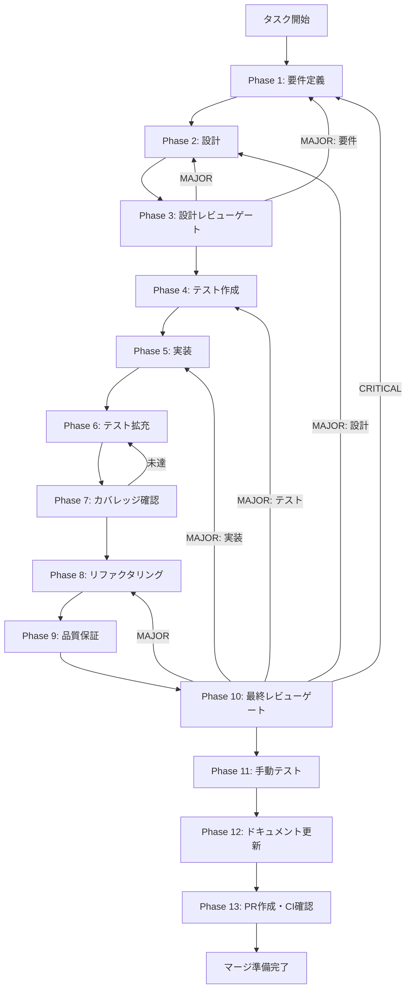

# conversation-history-ui-implementation - タスク実行仕様書

## ユーザーからの元の指示

```
会話履歴UI実装タスク。バックエンドAPI（ConversationRepository + IPC Handlers）を活用したUIコンポーネントを実装し、ユーザーが会話履歴を閲覧・管理・操作できるようにする。
```

## メタ情報

```yaml
issue_number: 485
```

| 項目         | 内容                                   |
| ------------ | -------------------------------------- |
| タスクID     | UI-CONV-HISTORY-001                    |
| タスク名     | conversation-history-ui-implementation |
| 分類         | 改善（UI実装）                         |
| 対象機能     | 会話履歴表示・管理UI                   |
| 優先度       | 高                                     |
| 見積もり規模 | 中規模                                 |
| ステータス   | 未実施                                 |
| 作成日       | 2026-01-24                             |
| 依存タスク   | UT-LLM-HISTORY-001（完了）             |

---

## タスク概要

### 目的

バックエンドAPI（ConversationRepository + IPC Handlers）を活用したUIコンポーネントを実装し、ユーザーが会話履歴を閲覧・管理・操作できるようにする。

### 背景

UT-LLM-HISTORY-001で会話履歴永続化のバックエンド（ConversationRepository + IPC Handlers）が完成した。しかし、UIコンポーネントが未実装のため、ユーザーは会話履歴機能を利用できない状態にある。

| 課題                   | 説明                                              |
| ---------------------- | ------------------------------------------------- |
| 会話一覧が表示されない | 過去の会話をリストで確認する手段がない            |
| 会話詳細が表示されない | 特定の会話のメッセージ履歴を閲覧する手段がない    |
| メッセージ送信UIがない | 会話にメッセージを追加するUIがない                |
| Preload API未接続      | Renderer ProcessからバックエンドAPIにアクセス不可 |

### 最終ゴール

- 会話一覧表示（ページネーション・検索対応）
- 会話詳細表示（メッセージ一覧）
- 新規会話作成・削除
- メッセージ追加（LLM連携対応）
- Preload API経由でのバックエンドアクセス

### 成果物一覧

| 種別         | 成果物                 | 配置先                                               |
| ------------ | ---------------------- | ---------------------------------------------------- |
| 機能         | ConversationListPanel  | `apps/desktop/src/renderer/components/conversation/` |
| 機能         | ConversationDetailView | `apps/desktop/src/renderer/components/conversation/` |
| 機能         | MessageInput           | `apps/desktop/src/renderer/components/conversation/` |
| 機能         | conversationAPI        | `apps/desktop/src/preload/index.ts`（拡張）          |
| 機能         | useConversation hooks  | `apps/desktop/src/renderer/hooks/`                   |
| テスト       | ユニットテスト         | `apps/desktop/src/renderer/__tests__/`               |
| ドキュメント | 実装ガイド             | `outputs/phase-12/`                                  |
| PR           | GitHub Pull Request    | GitHub UI                                            |

---

## 参照ファイル

本仕様書のコマンド選定は以下を参照：

### システム仕様（aiworkflow-requirements）【必須参照】

> 実装前に必ず以下のシステム仕様を確認し、既存設計との整合性を確保してください。

| 参照資料               | パス                                                                           | 内容                                   |
| ---------------------- | ------------------------------------------------------------------------------ | -------------------------------------- |
| UI/UXパネル仕様        | `.claude/skills/aiworkflow-requirements/references/ui-ux-history-panel.md`     | 履歴パネルのUI/UX仕様                  |
| 会話履歴永続化パターン | `.claude/skills/aiworkflow-requirements/references/architecture-patterns.md`   | ConversationRepository/IPC設計パターン |
| LLMインターフェース    | `.claude/skills/aiworkflow-requirements/references/interfaces-llm.md`          | Conversation/Message型定義、IPC契約    |
| チャット履歴仕様       | `.claude/skills/aiworkflow-requirements/references/interfaces-chat-history.md` | ChatSession/ChatMessage型定義          |
| アーキテクチャ概要     | `.claude/skills/aiworkflow-requirements/references/architecture-overview.md`   | Electronアプリ全体構成                 |

### 関連ドキュメント

| ドキュメント     | パス                                                                                              |
| ---------------- | ------------------------------------------------------------------------------------------------- |
| バックエンド実装 | `docs/30-workflows/llm-conversation-history-persistence/outputs/phase-12/implementation-guide.md` |
| 型定義           | `apps/desktop/src/shared/types/conversation.ts`                                                   |
| Repository       | `apps/desktop/src/main/repositories/conversationRepository.ts`                                    |
| IPC Handlers     | `apps/desktop/src/main/ipc/conversationHandlers.ts`                                               |

---

## タスク分解サマリー

| ID     | フェーズ | サブタスク名       | 責務                             | 依存 |
| ------ | -------- | ------------------ | -------------------------------- | ---- |
| T-01-1 | Phase 1  | 要件定義           | UI要件・デザイン仕様策定         | -    |
| T-02-1 | Phase 2  | 設計               | コンポーネント設計・状態管理設計 | T-01 |
| T-03-1 | Phase 3  | 設計レビュー       | レビューゲート                   | T-02 |
| T-04-1 | Phase 4  | テスト作成         | TDD Red Phase                    | T-03 |
| T-05-1 | Phase 5  | 実装               | TDD Green Phase                  | T-04 |
| T-06-1 | Phase 6  | テスト拡充         | カバレッジ向上                   | T-05 |
| T-07-1 | Phase 7  | カバレッジ確認     | 80%+確認                         | T-06 |
| T-08-1 | Phase 8  | リファクタリング   | TDD Refactor Phase               | T-07 |
| T-09-1 | Phase 9  | 品質保証           | 最終品質チェック                 | T-08 |
| T-10-1 | Phase 10 | 最終レビューゲート | レビューゲート                   | T-09 |
| T-11-1 | Phase 11 | 手動テスト         | UIテスト                         | T-10 |
| T-12-1 | Phase 12 | ドキュメント       | 実装ガイド・仕様更新             | T-11 |
| T-13-1 | Phase 13 | PR作成             | マージ準備                       | T-12 |

**総サブタスク数**: 13個

---

## 実行フロー図



---

## Phase一覧

| Phase | 名称               | 仕様書                                                 | ステータス |
| ----- | ------------------ | ------------------------------------------------------ | ---------- |
| 1     | 要件定義           | [phase-1-requirements.md](phase-1-requirements.md)     | 未実施     |
| 2     | 設計               | [phase-2-design.md](phase-2-design.md)                 | 未実施     |
| 3     | 設計レビューゲート | [phase-3-design-review.md](phase-3-design-review.md)   | 未実施     |
| 4     | テスト作成         | [phase-4-test-creation.md](phase-4-test-creation.md)   | 未実施     |
| 5     | 実装               | [phase-5-implementation.md](phase-5-implementation.md) | 未実施     |
| 6     | テスト拡充         | [phase-6-test-expansion.md](phase-6-test-expansion.md) | 未実施     |
| 7     | カバレッジ確認     | [phase-7-coverage-check.md](phase-7-coverage-check.md) | 未実施     |
| 8     | リファクタリング   | [phase-8-refactoring.md](phase-8-refactoring.md)       | 未実施     |
| 9     | 品質保証           | [phase-9-quality.md](phase-9-quality.md)               | 未実施     |
| 10    | 最終レビューゲート | [phase-10-final-review.md](phase-10-final-review.md)   | 未実施     |
| 11    | 手動テスト         | [phase-11-manual-test.md](phase-11-manual-test.md)     | 未実施     |
| 12    | ドキュメント更新   | [phase-12-documentation.md](phase-12-documentation.md) | 未実施     |
| 13    | PR作成             | [phase-13-pr-creation.md](phase-13-pr-creation.md)     | 未実施     |

---

## サブタスク構成（UI-001〜UI-004）

### UI-001: 会話一覧UIコンポーネント

| コンポーネント        | 責務                     |
| --------------------- | ------------------------ |
| ConversationListPanel | 一覧パネル（サイドバー） |
| ConversationListItem  | 個別会話アイテム         |
| ConversationSearch    | 検索入力                 |
| NewConversationButton | 新規作成ボタン           |

### UI-002: 会話詳細UIコンポーネント

| コンポーネント         | 責務                             |
| ---------------------- | -------------------------------- |
| ConversationDetailView | 詳細ビュー全体                   |
| ConversationHeader     | 会話タイトル・操作ボタン         |
| MessageList            | メッセージ一覧                   |
| MessageBubble          | 個別メッセージ（user/assistant） |

### UI-003: メッセージ入力UIコンポーネント

| コンポーネント | 責務                 |
| -------------- | -------------------- |
| MessageInput   | 入力フォーム全体     |
| TextArea       | 可変高さテキスト入力 |
| SendButton     | 送信ボタン           |

### UI-004: Preload API接続

| IPCチャンネル             | 用途           |
| ------------------------- | -------------- |
| `conversation:create`     | 会話作成       |
| `conversation:get`        | 会話取得       |
| `conversation:list`       | 一覧取得       |
| `conversation:update`     | 会話更新       |
| `conversation:delete`     | 会話削除       |
| `conversation:addMessage` | メッセージ追加 |
| `conversation:search`     | キーワード検索 |

---

## テストカバレッジ目標

### ユニットテスト

| 指標              | 最低基準 | 推奨基準 |
| ----------------- | -------- | -------- |
| Line Coverage     | 80%      | 90%      |
| Branch Coverage   | 60%      | 70%      |
| Function Coverage | 80%      | 90%      |

### テストケース目標

| カテゴリ    | テスト内容                     | 件数 |
| ----------- | ------------------------------ | ---- |
| Preload API | チャンネル登録・safeInvoke動作 | 10+  |
| 一覧UI      | 表示・ページネーション・検索   | 20+  |
| 詳細UI      | メッセージ表示・スクロール     | 20+  |
| 入力UI      | 入力・送信・ローディング       | 15+  |

---

## 統合テスト連携（Phase 1〜11で必須）

各Phaseで以下の統合テスト連携アクションを実施すること:

| Phase | 統合テスト連携アクション                           |
| ----- | -------------------------------------------------- |
| 1     | IPC接続要件を要件に明記                            |
| 2     | Preload API/Renderer Store統合ポイントを設計に反映 |
| 3     | 統合テスト観点のレビューゲートを実施               |
| 4     | IPC統合テストシナリオを作成                        |
| 5     | Preload API/UI接続の実装                           |
| 6     | 統合テストの拡充                                   |
| 7     | 統合テストの再実行とゲート判定                     |
| 8     | リファクタ後の統合テスト継続成功を確認             |
| 9     | 品質保証で統合テスト結果を確認                     |
| 10    | 最終レビューで統合テスト結果を確認                 |
| 11    | 手動統合テスト（UI/IPC接続）を確認                 |

---

## Phase完了時の必須アクション

**各Phase完了時に以下を必ず実行すること:**

1. **タスク100%実行**: Phase内で指定された全タスクを完全に実行
2. **成果物確認**: 全ての必須成果物が生成されていることを検証
3. **実行記録**: 実行タスクの結果を記録
4. **artifacts.json更新**: Phase完了ステータスを更新
5. **Phase末端の実行確認**: 各タスクを100%実行し、各タスクを完遂した旨を必ず明記

```bash
# Phase完了時の検証コマンド
node .claude/skills/task-specification-creator/scripts/validate-phase-output.js docs/30-workflows/conversation-history-ui-implementation --phase {{PHASE_NUMBER}}

# Phase完了・成果物登録
node .claude/skills/task-specification-creator/scripts/complete-phase.js \
  --workflow docs/30-workflows/conversation-history-ui-implementation --phase {{PHASE_NUMBER}} --artifacts "..."
```

---

## 変更履歴

| Version | Date       | Changes  |
| ------- | ---------- | -------- |
| 1.0.0   | 2026-01-24 | 初版作成 |
