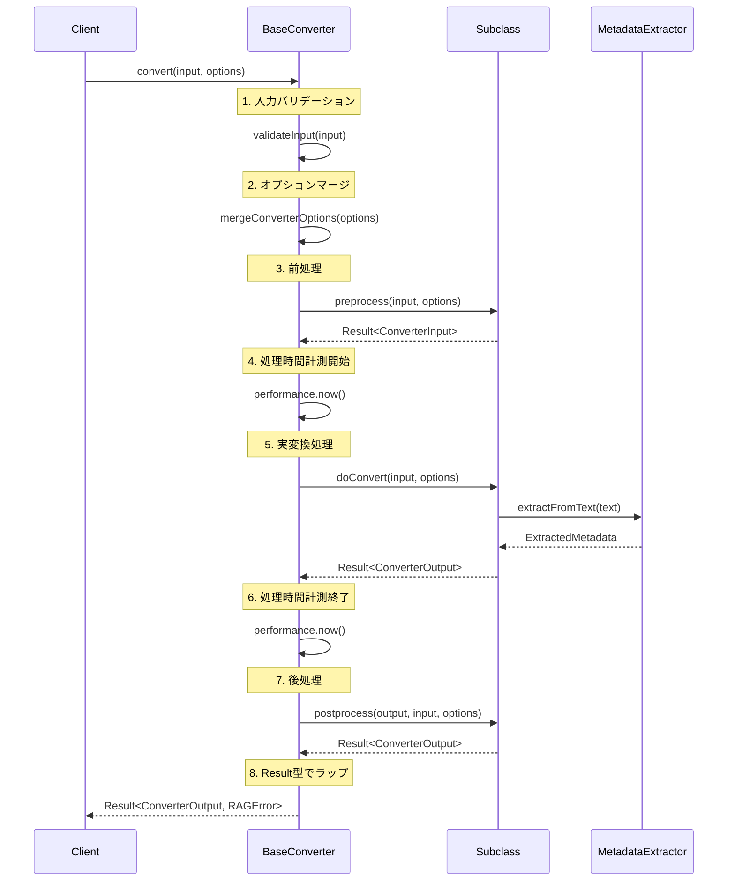

# BaseConverter - 抽象クラス詳細設計書

## 1. 概要

### 1.1 目的

BaseConverterクラスの詳細設計を提供し、すべてのコンバーター実装で共通する処理を抽象化することで、DRY原則を実現し、実装の一貫性を確保する。

### 1.2 設計原則

| 原則                         | 適用内容                                                                     |
| ---------------------------- | ---------------------------------------------------------------------------- |
| テンプレートメソッドパターン | convert()メソッドで処理フローを定義し、サブクラスで詳細を実装                |
| Open/Closed原則              | 拡張に開いて、修正に閉じた設計（新規コンバーター追加時に既存コード変更不要） |
| Liskov置換原則               | すべてのサブクラスがIConverterとして扱える                                   |
| 単一責任原則                 | BaseConverterは共通処理のみを担当、変換ロジックはサブクラスが担当            |
| 依存性逆転原則               | 抽象に依存し、具象に依存しない                                               |

### 1.3 責務

| 責務分類           | BaseConverterの責務          | サブクラスの責務             |
| ------------------ | ---------------------------- | ---------------------------- |
| 変換フロー制御     | ✓ テンプレートメソッドで制御 | -                            |
| 前処理・後処理     | ✓ フックポイント提供         | △ 必要に応じてオーバーライド |
| エラーハンドリング | ✓ Result型ラップ             | -                            |
| 処理時間計測       | ✓ 自動計測                   | -                            |
| 実変換処理         | -                            | ✓ doConvert()を実装          |
| メタデータ提供     | ✓ インターフェース実装       | ✓ 値を提供                   |

---

## 2. クラス構造

### 2.1 クラス定義

```typescript
/**
 * コンバーター基底クラス
 *
 * すべてのコンバーター実装で共通する処理を提供。
 * テンプレートメソッドパターンを適用し、変換フローを標準化。
 *
 * サブクラスは以下を実装する必要がある：
 * - doConvert(): 実際の変換処理
 * - id, name, supportedMimeTypes, priority: メタデータ
 */
export abstract class BaseConverter implements IConverter {
  // ========================================
  // 抽象プロパティ（サブクラスで実装必須）
  // ========================================

  /**
   * コンバーターID（一意）
   *
   * 制約:
   * - 英数字、ハイフン、アンダースコアのみ
   * - ケバブケース推奨
   *
   * 例: "plain-text-converter", "markdown-converter"
   */
  abstract readonly id: string;

  /**
   * コンバーター名（表示用）
   *
   * 例: "Plain Text Converter", "Markdown Converter"
   */
  abstract readonly name: string;

  /**
   * サポートするMIMEタイプのリスト
   *
   * 例: ["text/plain"], ["text/markdown", "text/x-markdown"]
   */
  abstract readonly supportedMimeTypes: readonly string[];

  /**
   * 優先度（高いほど優先）
   *
   * 推奨範囲: 0～100
   * 例: 0（標準）, 10（高優先度）, -10（フォールバック）
   */
  abstract readonly priority: number;

  // ========================================
  // テンプレートメソッド（final扱い）
  // ========================================

  /**
   * ファイルを変換（テンプレートメソッド）
   *
   * 処理フロー:
   * 1. 入力バリデーション
   * 2. オプションのマージ
   * 3. 前処理（preprocess）
   * 4. 処理時間計測開始
   * 5. 実変換処理（doConvert）
   * 6. 処理時間計測終了
   * 7. 後処理（postprocess）
   * 8. Result型でラップして返す
   *
   * サブクラスでオーバーライドしないこと（final扱い）。
   *
   * @param input - 変換対象の入力データ
   * @param options - 変換オプション（省略可）
   * @returns 変換結果またはエラー
   */
  async convert(
    input: ConverterInput,
    options?: ConverterOptions,
  ): Promise<Result<ConverterOutput, RAGError>> {
    try {
      // 1. 入力バリデーション
      const validationResult = this.validateInput(input);
      if (!validationResult.success) {
        return validationResult;
      }

      // 2. オプションのマージ
      const mergedOptions = mergeConverterOptions(options);

      // 3. 前処理
      const preprocessResult = await this.preprocess(input, mergedOptions);
      if (!preprocessResult.success) {
        return preprocessResult;
      }
      const preprocessedInput = preprocessResult.data;

      // 4. 処理時間計測開始
      const startTime = performance.now();

      // 5. 実変換処理
      const conversionResult = await this.doConvert(
        preprocessedInput,
        mergedOptions,
      );

      // 6. 処理時間計測終了
      const processingTime = performance.now() - startTime;

      if (!conversionResult.success) {
        return conversionResult;
      }

      // 処理時間を設定
      const outputWithTime: ConverterOutput = {
        ...conversionResult.data,
        processingTime,
      };

      // 7. 後処理
      const postprocessResult = await this.postprocess(
        outputWithTime,
        preprocessedInput,
        mergedOptions,
      );

      return postprocessResult;
    } catch (error) {
      // 8. 予期しないエラーのハンドリング
      return this.handleError(error, input);
    }
  }

  /**
   * このコンバーターで変換可能か判定
   *
   * デフォルト実装:
   * - supportedMimeTypesにinput.mimeTypeが含まれるかチェック
   *
   * サブクラスでオーバーライド可能（追加条件を実装可能）。
   *
   * @param input - 変換対象の入力データ
   * @returns 変換可能な場合true
   */
  canConvert(input: ConverterInput): boolean {
    return this.supportedMimeTypes.includes(input.mimeType);
  }

  /**
   * 推定処理時間を取得（ミリ秒）
   *
   * デフォルト実装:
   * - コンテンツサイズに基づく線形推定（1KB = 1ms）
   *
   * サブクラスでオーバーライド可能（ファイル形式の複雑さを考慮可能）。
   *
   * @param input - 変換対象の入力データ
   * @returns 推定処理時間（ミリ秒）
   */
  estimateProcessingTime(input: ConverterInput): number {
    const contentSize = this.getContentSize(input);
    const sizeInKB = contentSize / 1024;
    return Math.ceil(sizeInKB); // 1KB = 1ms
  }

  // ========================================
  // フックメソッド（サブクラスでオーバーライド可能）
  // ========================================

  /**
   * 前処理フック
   *
   * 変換処理の前に実行される。
   * 入力データの正規化、エンコーディング変換等を実施。
   *
   * デフォルト実装: 入力をそのまま返す
   *
   * サブクラスでオーバーライド可能:
   * - エンコーディング変換
   * - バイナリ→テキスト変換
   * - 入力データの正規化
   *
   * @param input - 変換対象の入力データ
   * @param options - 変換オプション
   * @returns 前処理後の入力データまたはエラー
   */
  protected async preprocess(
    input: ConverterInput,
    options: ConverterOptions,
  ): Promise<Result<ConverterInput, RAGError>> {
    return ok(input);
  }

  /**
   * 後処理フック
   *
   * 変換処理の後に実行される。
   * 出力データの整形、追加メタデータの抽出等を実施。
   *
   * デフォルト実装: 出力をそのまま返す
   *
   * サブクラスでオーバーライド可能:
   * - 出力データの整形
   * - 追加メタデータの抽出
   * - フォーマット正規化
   *
   * @param output - 変換後の出力データ
   * @param input - 変換前の入力データ
   * @param options - 変換オプション
   * @returns 後処理後の出力データまたはエラー
   */
  protected async postprocess(
    output: ConverterOutput,
    input: ConverterInput,
    options: ConverterOptions,
  ): Promise<Result<ConverterOutput, RAGError>> {
    return ok(output);
  }

  // ========================================
  // 抽象メソッド（サブクラスで実装必須）
  // ========================================

  /**
   * 実変換処理（抽象メソッド）
   *
   * サブクラスで実装必須。
   * ファイル形式固有の変換ロジックを実装。
   *
   * 実装ガイドライン:
   * 1. input.contentを適切な形式に変換
   * 2. メタデータを抽出（MetadataExtractorを使用）
   * 3. ConverterOutputを生成
   * 4. Result型でラップして返す
   *
   * エラーハンドリング:
   * - 変換失敗時はResult.errorを返す
   * - 例外をスローしない（catchしてResult.errorに変換）
   *
   * @param input - 前処理済みの入力データ
   * @param options - 変換オプション
   * @returns 変換結果またはエラー
   */
  protected abstract doConvert(
    input: ConverterInput,
    options: ConverterOptions,
  ): Promise<Result<ConverterOutput, RAGError>>;

  // ========================================
  // ヘルパーメソッド（protectedで提供）
  // ========================================

  /**
   * 入力データをバリデート
   *
   * 基本的なバリデーションを実施:
   * - fileIdが空でないか
   * - filePathが空でないか
   * - mimeTypeが空でないか
   * - contentが空でないか
   *
   * @param input - 検証する入力データ
   * @returns バリデーション結果
   */
  protected validateInput(input: ConverterInput): Result<void, RAGError> {
    if (!input.fileId) {
      return err(
        createRAGError(ErrorCodes.INVALID_INPUT, "fileId is required", {
          converterId: this.id,
        }),
      );
    }

    if (!input.filePath) {
      return err(
        createRAGError(ErrorCodes.INVALID_INPUT, "filePath is required", {
          converterId: this.id,
        }),
      );
    }

    if (!input.mimeType) {
      return err(
        createRAGError(ErrorCodes.INVALID_INPUT, "mimeType is required", {
          converterId: this.id,
        }),
      );
    }

    if (input.content === null || input.content === undefined) {
      return err(
        createRAGError(ErrorCodes.INVALID_INPUT, "content is required", {
          converterId: this.id,
        }),
      );
    }

    return ok(undefined);
  }

  /**
   * エラーハンドリング
   *
   * 予期しないエラーをResult型にラップ。
   *
   * @param error - 発生したエラー
   * @param input - 変換対象の入力データ
   * @returns エラー結果
   */
  protected handleError(
    error: unknown,
    input: ConverterInput,
  ): Result<never, RAGError> {
    return err(
      createRAGError(
        ErrorCodes.CONVERSION_FAILED,
        `Conversion failed for ${this.id}`,
        {
          converterId: this.id,
          fileId: input.fileId,
          mimeType: input.mimeType,
        },
        error as Error,
      ),
    );
  }

  /**
   * コンテンツサイズを取得（バイト）
   *
   * @param input - 入力データ
   * @returns コンテンツサイズ（バイト）
   */
  protected getContentSize(input: ConverterInput): number {
    if (typeof input.content === "string") {
      // 文字列の場合、UTF-8バイトサイズを概算
      return new TextEncoder().encode(input.content).length;
    } else {
      // ArrayBufferの場合
      return input.content.byteLength;
    }
  }

  /**
   * テキストコンテンツを取得
   *
   * input.contentがstring型の場合はそのまま返す。
   * ArrayBuffer型の場合はデコードして返す。
   *
   * @param input - 入力データ
   * @returns テキストコンテンツ
   */
  protected getTextContent(input: ConverterInput): string {
    if (isTextContent(input)) {
      return input.content;
    } else {
      return new TextDecoder(input.encoding).decode(input.content);
    }
  }

  // ========================================
  // メタデータ取得（IConverterExtended実装）
  // ========================================

  /**
   * コンバーターのメタデータを取得
   *
   * @returns ConverterMetadata
   */
  getMetadata(): ConverterMetadata {
    return {
      id: this.id,
      name: this.name,
      description: this.getDescription(),
      version: this.getVersion(),
      supportedMimeTypes: this.supportedMimeTypes,
      priority: this.priority,
    };
  }

  /**
   * サポートしているMIMEタイプか判定
   *
   * @param mimeType - 判定するMIMEタイプ
   * @returns サポートしている場合true
   */
  supportsMimeType(mimeType: string): boolean {
    return this.supportedMimeTypes.includes(mimeType);
  }

  /**
   * コンバーターの説明を取得
   *
   * サブクラスでオーバーライド推奨。
   *
   * @returns 説明文
   */
  protected getDescription(): string {
    return `Converter for ${this.supportedMimeTypes.join(", ")}`;
  }

  /**
   * コンバーターのバージョンを取得
   *
   * サブクラスでオーバーライド可能。
   *
   * @returns バージョン（SemVer形式）
   */
  protected getVersion(): string {
    return "1.0.0";
  }
}
```

---

## 3. テンプレートメソッドパターン

### 3.1 処理フロー図



### 3.2 各ステップの詳細

| ステップ              | 実装場所      | 責務                   | オーバーライド可否 |
| --------------------- | ------------- | ---------------------- | ------------------ |
| 1. 入力バリデーション | BaseConverter | 基本的なバリデーション | △ 拡張可能         |
| 2. オプションマージ   | BaseConverter | デフォルト値との統合   | ✗ 不可             |
| 3. 前処理             | Subclass      | 入力データの正規化     | ○ 推奨             |
| 4. 処理時間計測開始   | BaseConverter | 自動計測               | ✗ 不可             |
| 5. 実変換処理         | Subclass      | ファイル形式固有の変換 | ● 必須             |
| 6. 処理時間計測終了   | BaseConverter | 自動計測               | ✗ 不可             |
| 7. 後処理             | Subclass      | 出力データの整形       | ○ 推奨             |
| 8. エラーハンドリング | BaseConverter | Result型ラップ         | ✗ 不可             |

---

## 4. サブクラス実装ガイドライン

### 4.1 最小実装例

```typescript
import { BaseConverter } from "./base-converter";
import type {
  ConverterInput,
  ConverterOutput,
  ConverterOptions,
} from "./types";
import type { Result, RAGError } from "../../types/rag";
import { ok, err, createRAGError, ErrorCodes } from "../../types/rag";
import { MetadataExtractor } from "./metadata-extractor";

/**
 * プレーンテキストコンバーター
 *
 * 最小限の実装例。
 */
export class PlainTextConverter extends BaseConverter {
  // ========================================
  // 必須プロパティ
  // ========================================

  readonly id = "plain-text-converter";
  readonly name = "Plain Text Converter";
  readonly supportedMimeTypes = ["text/plain"] as const;
  readonly priority = 0;

  // ========================================
  // 必須メソッド
  // ========================================

  protected async doConvert(
    input: ConverterInput,
    options: ConverterOptions,
  ): Promise<Result<ConverterOutput, RAGError>> {
    try {
      // 1. テキストコンテンツを取得
      const text = this.getTextContent(input);

      // 2. メタデータを抽出
      const extractedMetadata = MetadataExtractor.extractFromText(
        text,
        options,
      );

      // 3. ConverterOutputを生成
      return ok({
        convertedContent: text,
        extractedMetadata,
        processingTime: 0, // BaseConverterが自動設定
      });
    } catch (error) {
      return err(
        createRAGError(
          ErrorCodes.CONVERSION_FAILED,
          "Failed to convert plain text file",
          { converterId: this.id, fileId: input.fileId },
          error as Error,
        ),
      );
    }
  }

  // ========================================
  // オプショナルメソッド（オーバーライド推奨）
  // ========================================

  protected getDescription(): string {
    return "Converts plain text files to searchable format";
  }
}
```

### 4.2 高度な実装例（前処理・後処理付き）

```typescript
/**
 * Markdownコンバーター
 *
 * 前処理・後処理をオーバーライドした高度な実装例。
 */
export class MarkdownConverter extends BaseConverter {
  readonly id = "markdown-converter";
  readonly name = "Markdown Converter";
  readonly supportedMimeTypes = ["text/markdown", "text/x-markdown"] as const;
  readonly priority = 10;

  // ========================================
  // 前処理のオーバーライド
  // ========================================

  protected async preprocess(
    input: ConverterInput,
    options: ConverterOptions,
  ): Promise<Result<ConverterInput, RAGError>> {
    try {
      // バイナリ→テキスト変換（必要な場合）
      if (isBinaryContent(input)) {
        const text = new TextDecoder(input.encoding).decode(input.content);
        return ok({
          ...input,
          content: text,
        });
      }

      return ok(input);
    } catch (error) {
      return err(
        createRAGError(
          ErrorCodes.CONVERSION_FAILED,
          "Failed to preprocess Markdown file",
          { converterId: this.id, fileId: input.fileId },
          error as Error,
        ),
      );
    }
  }

  // ========================================
  // 実変換処理
  // ========================================

  protected async doConvert(
    input: ConverterInput,
    options: ConverterOptions,
  ): Promise<Result<ConverterOutput, RAGError>> {
    try {
      const text = this.getTextContent(input);

      // Markdown固有の変換処理
      const convertedText = this.stripMarkdownSyntax(text, options);

      // メタデータ抽出
      const extractedMetadata = MetadataExtractor.extractFromText(
        convertedText,
        options,
      );

      return ok({
        convertedContent: convertedText,
        extractedMetadata,
        processingTime: 0,
      });
    } catch (error) {
      return err(
        createRAGError(
          ErrorCodes.CONVERSION_FAILED,
          "Failed to convert Markdown file",
          { converterId: this.id, fileId: input.fileId },
          error as Error,
        ),
      );
    }
  }

  // ========================================
  // 後処理のオーバーライド
  // ========================================

  protected async postprocess(
    output: ConverterOutput,
    input: ConverterInput,
    options: ConverterOptions,
  ): Promise<Result<ConverterOutput, RAGError>> {
    try {
      // 出力の整形（例: 余分な空白削除）
      const trimmedContent = output.convertedContent.trim();

      return ok({
        ...output,
        convertedContent: trimmedContent,
      });
    } catch (error) {
      return err(
        createRAGError(
          ErrorCodes.CONVERSION_FAILED,
          "Failed to postprocess Markdown conversion",
          { converterId: this.id, fileId: input.fileId },
          error as Error,
        ),
      );
    }
  }

  // ========================================
  // プライベートヘルパーメソッド
  // ========================================

  private stripMarkdownSyntax(text: string, options: ConverterOptions): string {
    // Markdown記法を除去する実装
    // （簡略版、実際はライブラリを使用）
    return text
      .replace(/^#{1,6}\s+/gm, "") // 見出し
      .replace(/\*\*(.+?)\*\*/g, "$1") // 太字
      .replace(/\*(.+?)\*/g, "$1") // イタリック
      .replace(/\[(.+?)\]\(.+?\)/g, "$1"); // リンク
  }

  protected getDescription(): string {
    return "Converts Markdown files to plain text, stripping formatting";
  }

  protected getVersion(): string {
    return "1.1.0";
  }
}
```

---

## 5. エラーハンドリング戦略

### 5.1 エラーの種類と対応

| エラー種類           | 発生箇所        | 対応方法          | Result型      |
| -------------------- | --------------- | ----------------- | ------------- |
| バリデーションエラー | validateInput() | INVALID_INPUT     | err(RAGError) |
| 前処理エラー         | preprocess()    | CONVERSION_FAILED | err(RAGError) |
| 変換処理エラー       | doConvert()     | CONVERSION_FAILED | err(RAGError) |
| 後処理エラー         | postprocess()   | CONVERSION_FAILED | err(RAGError) |
| 予期しないエラー     | convert() catch | CONVERSION_FAILED | err(RAGError) |

### 5.2 エラーハンドリングのベストプラクティス

```typescript
protected async doConvert(
  input: ConverterInput,
  options: ConverterOptions
): Promise<Result<ConverterOutput, RAGError>> {
  try {
    // 変換処理
    const text = this.getTextContent(input);

    // 特定のエラーケースを明示的に処理
    if (text.length === 0) {
      return err(
        createRAGError(
          ErrorCodes.INVALID_INPUT,
          "File is empty",
          { converterId: this.id, fileId: input.fileId }
        )
      );
    }

    // 変換実行
    const convertedText = this.performConversion(text);
    const metadata = MetadataExtractor.extractFromText(convertedText, options);

    return ok({
      convertedContent: convertedText,
      extractedMetadata: metadata,
      processingTime: 0,
    });
  } catch (error) {
    // 予期しないエラーを適切にラップ
    return err(
      createRAGError(
        ErrorCodes.CONVERSION_FAILED,
        `Unexpected error during conversion: ${(error as Error).message}`,
        { converterId: this.id, fileId: input.fileId },
        error as Error
      )
    );
  }
}
```

---

## 6. パフォーマンス最適化

### 6.1 処理時間計測

```typescript
// BaseConverterが自動計測
const startTime = performance.now();
const result = await this.doConvert(input, options);
const processingTime = performance.now() - startTime;
```

### 6.2 推定処理時間のカスタマイズ

```typescript
export class PDFConverter extends BaseConverter {
  // PDFは複雑なため、推定時間を多めに設定
  estimateProcessingTime(input: ConverterInput): number {
    const contentSize = this.getContentSize(input);
    const sizeInKB = contentSize / 1024;
    return Math.ceil(sizeInKB * 5); // 1KB = 5ms（PDFは5倍遅い想定）
  }
}
```

### 6.3 メモリ効率

```typescript
protected async doConvert(
  input: ConverterInput,
  options: ConverterOptions
): Promise<Result<ConverterOutput, RAGError>> {
  // ✓ 良い例: ストリーム処理（大きなファイル向け）
  const text = this.getTextContent(input);

  // チャンク単位で処理
  const chunks = this.splitIntoChunks(text, 10000);
  const processedChunks = chunks.map(chunk => this.processChunk(chunk));
  const result = processedChunks.join("");

  // メタデータ抽出
  const metadata = MetadataExtractor.extractFromText(result, options);

  return ok({
    convertedContent: result,
    extractedMetadata: metadata,
    processingTime: 0,
  });
}
```

---

## 7. テスト戦略

### 7.1 BaseConverterのテスト

```typescript
import { describe, it, expect, vi } from "vitest";
import { BaseConverter } from "./base-converter";
import type { ConverterInput, ConverterOptions } from "./types";
import { ok, err } from "../../types/rag";

// テスト用のコンバーター実装
class TestConverter extends BaseConverter {
  readonly id = "test-converter";
  readonly name = "Test Converter";
  readonly supportedMimeTypes = ["text/plain"] as const;
  readonly priority = 0;

  protected async doConvert(input: ConverterInput, options: ConverterOptions) {
    const text = this.getTextContent(input);
    return ok({
      convertedContent: text.toUpperCase(),
      extractedMetadata: {
        /* ... */
      },
      processingTime: 0,
    });
  }
}

describe("BaseConverter", () => {
  let converter: TestConverter;

  beforeEach(() => {
    converter = new TestConverter();
  });

  describe("convert()", () => {
    it("should execute template method correctly", async () => {
      const input: ConverterInput = {
        fileId: "file_123" as FileId,
        filePath: "/test.txt",
        mimeType: "text/plain",
        content: "hello",
        encoding: "utf-8",
      };

      const result = await converter.convert(input);

      expect(result.success).toBe(true);
      if (result.success) {
        expect(result.data.convertedContent).toBe("HELLO");
        expect(result.data.processingTime).toBeGreaterThan(0);
      }
    });

    it("should handle validation errors", async () => {
      const invalidInput: ConverterInput = {
        fileId: "" as FileId, // 無効
        filePath: "/test.txt",
        mimeType: "text/plain",
        content: "hello",
        encoding: "utf-8",
      };

      const result = await converter.convert(invalidInput);

      expect(result.success).toBe(false);
      if (!result.success) {
        expect(result.error.code).toBe(ErrorCodes.INVALID_INPUT);
      }
    });
  });

  describe("canConvert()", () => {
    it("should return true for supported MIME type", () => {
      const input: ConverterInput = {
        fileId: "file_123" as FileId,
        filePath: "/test.txt",
        mimeType: "text/plain",
        content: "hello",
        encoding: "utf-8",
      };

      expect(converter.canConvert(input)).toBe(true);
    });

    it("should return false for unsupported MIME type", () => {
      const input: ConverterInput = {
        fileId: "file_123" as FileId,
        filePath: "/test.pdf",
        mimeType: "application/pdf",
        content: new ArrayBuffer(10),
        encoding: "utf-8",
      };

      expect(converter.canConvert(input)).toBe(false);
    });
  });

  describe("estimateProcessingTime()", () => {
    it("should estimate processing time based on content size", () => {
      const input: ConverterInput = {
        fileId: "file_123" as FileId,
        filePath: "/test.txt",
        mimeType: "text/plain",
        content: "a".repeat(1024), // 1KB
        encoding: "utf-8",
      };

      const estimatedTime = converter.estimateProcessingTime(input);

      expect(estimatedTime).toBeGreaterThan(0);
      expect(estimatedTime).toBeLessThan(10); // 1KBなので10ms未満
    });
  });
});
```

### 7.2 サブクラスのテスト

```typescript
describe("PlainTextConverter", () => {
  let converter: PlainTextConverter;

  beforeEach(() => {
    converter = new PlainTextConverter();
  });

  it("should convert plain text correctly", async () => {
    const input: ConverterInput = {
      fileId: "file_123" as FileId,
      filePath: "/test.txt",
      mimeType: "text/plain",
      content: "Hello, World!",
      encoding: "utf-8",
    };

    const result = await converter.convert(input);

    expect(result.success).toBe(true);
    if (result.success) {
      expect(result.data.convertedContent).toBe("Hello, World!");
      expect(result.data.extractedMetadata).toBeDefined();
    }
  });
});
```

---

## 8. SOLID原則の適用

### 8.1 単一責任原則（SRP）

BaseConverterの責務:

- ✓ 変換フローの制御
- ✓ エラーハンドリング
- ✓ 処理時間計測
- ✗ 実変換処理（サブクラスに委譲）

### 8.2 Open/Closed原則（OCP）

拡張に開いて、修正に閉じた設計:

```typescript
// 新しいコンバーターを追加（BaseConverterの変更不要）
export class NewFormatConverter extends BaseConverter {
  // ...
}
```

### 8.3 Liskov置換原則（LSP）

すべてのサブクラスがIConverterとして扱える:

```typescript
function processFile(converter: IConverter, input: ConverterInput) {
  // どのサブクラスでも動作
  return converter.convert(input);
}
```

### 8.4 依存性逆転原則（DIP）

抽象（IConverter）に依存し、具象に依存しない:

```typescript
class ConversionService {
  constructor(private registry: ConverterRegistry) {}

  async convert(input: ConverterInput) {
    // IConverterに依存、具象クラスに依存しない
    const converter: IConverter = this.registry.findConverter(input);
    return converter.convert(input);
  }
}
```

---

## 9. 実装ガイドライン

### 9.1 ファイル構成

```
packages/shared/src/services/conversion/
├── base-converter.ts          # BaseConverter実装
├── base-converter.test.ts     # BaseConverterテスト
├── converters/
│   ├── plain-text-converter.ts
│   ├── plain-text-converter.test.ts
│   ├── markdown-converter.ts
│   └── markdown-converter.test.ts
└── index.ts
```

### 9.2 命名規約

| 要素             | 規約                              | 例                          |
| ---------------- | --------------------------------- | --------------------------- |
| クラス名         | PascalCase + Converter接尾辞      | `PlainTextConverter`        |
| 抽象メソッド     | protected + camelCase + 動詞      | `doConvert`                 |
| フックメソッド   | protected + camelCase + 動詞      | `preprocess`, `postprocess` |
| ヘルパーメソッド | protected + camelCase + get接頭辞 | `getTextContent`            |

### 9.3 コメント規約

```typescript
/**
 * メソッドの簡潔な説明
 *
 * 詳細説明（複数行可）
 *
 * 実装ガイドライン:
 * - ガイドライン1
 * - ガイドライン2
 *
 * @param input - パラメータ説明
 * @returns 戻り値説明
 */
```

---

## 10. 変更履歴

| 日付       | バージョン | 変更者 | 変更内容 |
| ---------- | ---------- | ------ | -------- |
| 2025-12-20 | 1.0.0      | AI     | 初版作成 |

---

## 11. 完了条件チェックリスト

- [ ] テンプレートメソッドパターンが適用されている
- [ ] 前処理・後処理のフックポイントが設計されている
- [ ] エラーハンドリングの共通処理が設計されている
- [ ] サブクラスで実装すべき抽象メソッドが明確
- [ ] SOLID原則が適用されている
- [ ] テスト戦略が明確
- [ ] 実装ガイドラインが提供されている
