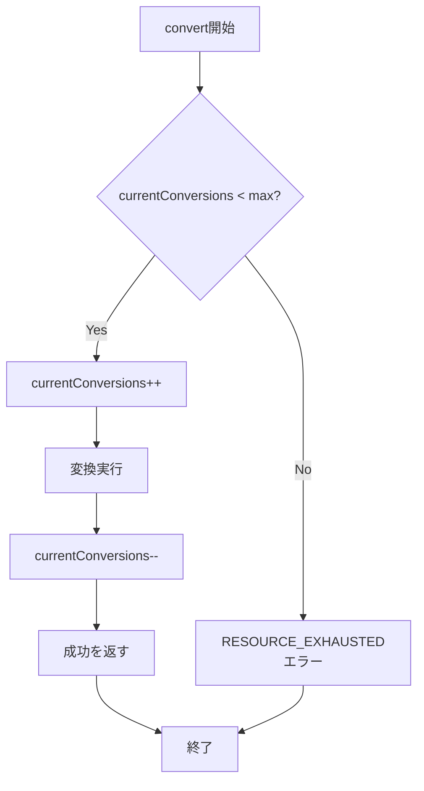
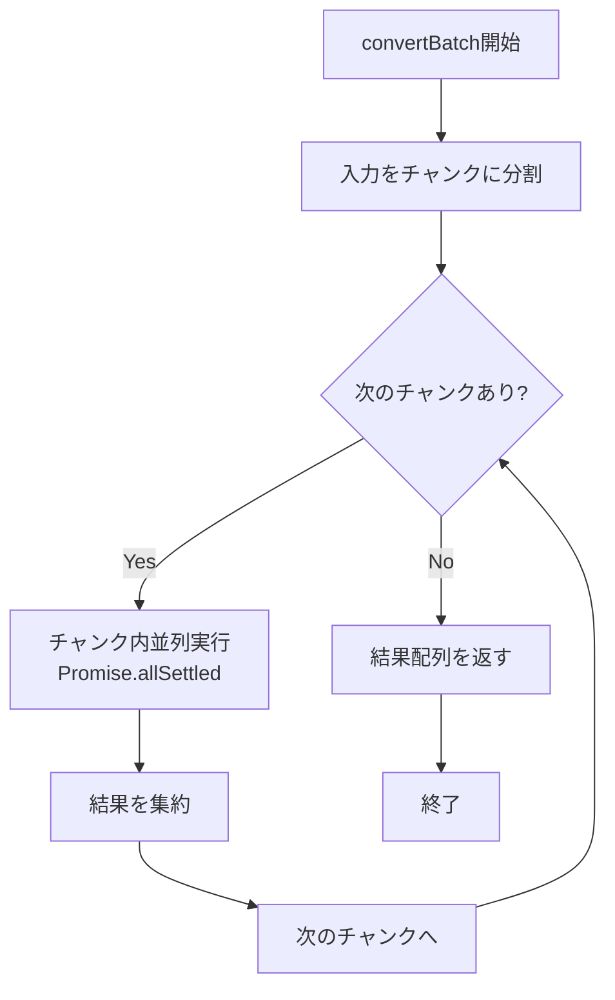

# ConversionService - 変換サービス詳細設計書

## 1. 概要

### 1.1 目的

ConversionServiceクラスの詳細設計を提供し、BaseConverterとConverterRegistryを統合し、タイムアウト・同時実行制御・バッチ変換等の高度な機能を確立する。

### 1.2 設計原則

| 原則                       | 適用内容                                                      |
| -------------------------- | ------------------------------------------------------------- |
| アプリケーションサービス層 | ドメインロジック（コンバーター）を統合し、ユースケースを実現  |
| 単一責任原則               | 変換処理の統括のみを担当（個別の変換ロジックは担当しない）    |
| 依存性逆転原則             | IConverterとConverterRegistryに依存（具象クラスに依存しない） |
| 疎結合                     | ConverterRegistryを依存性注入で受け取る（テスト容易性）       |
| リソース管理               | タイムアウト・同時実行数制限でシステムリソースを保護          |

### 1.3 責務

| 責務カテゴリ     | 責務内容                                                    |
| ---------------- | ----------------------------------------------------------- |
| 変換統括         | ConverterRegistryから最適なコンバーターを取得し、変換を実行 |
| タイムアウト管理 | 長時間実行の変換処理をタイムアウト                          |
| 同時実行制御     | 同時実行数を制限し、リソース枯渇を防止                      |
| バッチ処理       | 複数ファイルの一括変換を効率的に実行                        |
| エラー集約       | 変換エラーを統一的に処理                                    |

### 1.4 非責務（他コンポーネントの責務）

| 非責務             | 担当コンポーネント                          |
| ------------------ | ------------------------------------------- |
| 実変換処理         | IConverter実装（BaseConverter、サブクラス） |
| コンバーター管理   | ConverterRegistry                           |
| ユーザー認証・認可 | 上位レイヤー（RAGService等）                |
| データベース永続化 | Repository層                                |

---

## 2. クラス構造

### 2.1 クラス定義

```typescript
/**
 * 変換サービス
 *
 * ファイル変換処理を統括し、以下の機能を提供：
 * - 単一ファイル変換
 * - バッチ変換
 * - タイムアウト管理
 * - 同時実行数制限
 *
 * アプリケーションサービス層に位置し、
 * BaseConverterとConverterRegistryを統合。
 */
export class ConversionService {
  // ========================================
  // プライベートフィールド
  // ========================================

  /**
   * コンバーターレジストリ
   *
   * 依存性注入で受け取る。
   */
  private readonly registry: ConverterRegistry;

  /**
   * デフォルトタイムアウト（ミリ秒）
   */
  private readonly defaultTimeout: number;

  /**
   * 最大同時実行数
   */
  private readonly maxConcurrentConversions: number;

  /**
   * 現在実行中の変換数
   */
  private currentConversions: number;

  // ========================================
  // コンストラクタ
  // ========================================

  /**
   * コンストラクタ
   *
   * @param registry - コンバーターレジストリ（依存性注入）
   * @param options - サービスオプション
   */
  constructor(registry: ConverterRegistry, options?: ConversionServiceOptions) {
    this.registry = registry;
    this.defaultTimeout = options?.defaultTimeout ?? 60000; // デフォルト60秒
    this.maxConcurrentConversions = options?.maxConcurrentConversions ?? 5;
    this.currentConversions = 0;
  }

  // ========================================
  // 単一ファイル変換
  // ========================================

  /**
   * 単一ファイルを変換
   *
   * 処理フロー:
   * 1. 同時実行数チェック
   * 2. コンバーター検索（ConverterRegistry）
   * 3. タイムアウト付き変換実行
   * 4. エラーハンドリング
   *
   * @param input - 変換対象の入力データ
   * @param options - 変換オプション
   * @returns 変換結果またはエラー
   */
  async convert(
    input: ConverterInput,
    options?: ConverterOptions,
  ): Promise<Result<ConverterOutput, RAGError>> {
    // 1. 同時実行数チェック
    if (this.currentConversions >= this.maxConcurrentConversions) {
      return err(
        createRAGError(
          ErrorCodes.RESOURCE_EXHAUSTED,
          `Maximum concurrent conversions reached: ${this.maxConcurrentConversions}`,
          {
            currentConversions: this.currentConversions,
            maxConcurrentConversions: this.maxConcurrentConversions,
          },
        ),
      );
    }

    try {
      // 同時実行数をインクリメント
      this.currentConversions++;

      // 2. コンバーター検索
      const converterResult = this.registry.findConverter(input);
      if (!converterResult.success) {
        return converterResult;
      }

      const converter = converterResult.data;

      // 3. タイムアウト付き変換実行
      const timeout = options?.timeout ?? this.defaultTimeout;
      const result = await this.convertWithTimeout(
        converter,
        input,
        options,
        timeout,
      );

      return result;
    } finally {
      // 同時実行数をデクリメント
      this.currentConversions--;
    }
  }

  /**
   * タイムアウト付きで変換を実行
   *
   * Promise.race()を使用してタイムアウトを実現。
   *
   * @param converter - 使用するコンバーター
   * @param input - 変換対象の入力データ
   * @param options - 変換オプション
   * @param timeout - タイムアウト時間（ミリ秒）
   * @returns 変換結果またはエラー
   */
  private async convertWithTimeout(
    converter: IConverter,
    input: ConverterInput,
    options: ConverterOptions | undefined,
    timeout: number,
  ): Promise<Result<ConverterOutput, RAGError>> {
    const timeoutPromise = new Promise<Result<never, RAGError>>((resolve) => {
      setTimeout(() => {
        resolve(
          err(
            createRAGError(
              ErrorCodes.TIMEOUT,
              `Conversion timeout after ${timeout}ms`,
              {
                converterId: converter.id,
                fileId: input.fileId,
                timeout,
              },
            ),
          ),
        );
      }, timeout);
    });

    const conversionPromise = converter.convert(input, options);

    // Promise.race()でタイムアウトを実現
    const result = await Promise.race([conversionPromise, timeoutPromise]);

    return result;
  }

  // ========================================
  // バッチ変換
  // ========================================

  /**
   * 複数ファイルを一括変換
   *
   * Promise.allSettled()を使用し、一部のファイルが失敗しても
   * 他のファイルの変換を継続。
   *
   * 同時実行数制限を考慮し、チャンク単位で処理。
   *
   * @param inputs - 変換対象の入力データ配列
   * @param options - 変換オプション
   * @returns 変換結果の配列（成功・失敗を含む）
   */
  async convertBatch(
    inputs: ConverterInput[],
    options?: ConverterOptions,
  ): Promise<BatchConversionResult[]> {
    const results: BatchConversionResult[] = [];

    // チャンクサイズは同時実行数と同じ
    const chunkSize = this.maxConcurrentConversions;

    // チャンク単位で処理
    for (let i = 0; i < inputs.length; i += chunkSize) {
      const chunk = inputs.slice(i, i + chunkSize);

      // チャンク内の変換を並列実行
      const chunkResults = await Promise.allSettled(
        chunk.map((input) => this.convert(input, options)),
      );

      // 結果を集約
      for (let j = 0; j < chunkResults.length; j++) {
        const input = chunk[j];
        const promiseResult = chunkResults[j];

        if (promiseResult.status === "fulfilled") {
          const conversionResult = promiseResult.value;

          if (conversionResult.success) {
            results.push({
              input,
              status: "success",
              output: conversionResult.data,
            });
          } else {
            results.push({
              input,
              status: "error",
              error: conversionResult.error,
            });
          }
        } else {
          // Promise自体が拒否された（通常は発生しない）
          results.push({
            input,
            status: "error",
            error: createRAGError(
              ErrorCodes.INTERNAL_ERROR,
              "Unexpected promise rejection",
              { fileId: input.fileId },
              promiseResult.reason as Error,
            ),
          });
        }
      }
    }

    return results;
  }

  // ========================================
  // ユーティリティメソッド
  // ========================================

  /**
   * 変換可能性を確認
   *
   * @param input - 変換対象の入力データ
   * @returns 変換可能な場合true
   */
  canConvert(input: ConverterInput): boolean {
    const converterResult = this.registry.findConverter(input);
    return converterResult.success;
  }

  /**
   * 推定処理時間を取得
   *
   * @param input - 変換対象の入力データ
   * @returns 推定処理時間（ミリ秒）、コンバーターが見つからない場合はnull
   */
  estimateProcessingTime(input: ConverterInput): number | null {
    const converterResult = this.registry.findConverter(input);

    if (!converterResult.success) {
      return null;
    }

    return converterResult.data.estimateProcessingTime(input);
  }

  /**
   * サポートしているMIMEタイプ一覧を取得
   *
   * @returns MIMEタイプの配列
   */
  getSupportedMimeTypes(): string[] {
    return this.registry.getSupportedMimeTypes();
  }

  /**
   * 現在の同時実行数を取得
   *
   * @returns 実行中の変換数
   */
  getCurrentConversions(): number {
    return this.currentConversions;
  }

  /**
   * サービス設定を取得
   *
   * @returns サービス設定
   */
  getSettings(): ConversionServiceSettings {
    return {
      defaultTimeout: this.defaultTimeout,
      maxConcurrentConversions: this.maxConcurrentConversions,
      currentConversions: this.currentConversions,
    };
  }
}
```

---

## 3. 型定義

### 3.1 ConversionServiceOptions

```typescript
/**
 * ConversionServiceのコンストラクタオプション
 */
export interface ConversionServiceOptions {
  /**
   * デフォルトタイムアウト（ミリ秒）
   *
   * 個別の変換でタイムアウトが指定されない場合に使用。
   *
   * デフォルト: 60000（60秒）
   * 推奨範囲: 10000～300000（10秒～5分）
   */
  readonly defaultTimeout?: number;

  /**
   * 最大同時実行数
   *
   * 同時に実行できる変換処理の最大数。
   * これを超える変換要求はエラーを返す。
   *
   * デフォルト: 5
   * 推奨範囲: 1～10
   */
  readonly maxConcurrentConversions?: number;
}
```

### 3.2 BatchConversionResult

```typescript
/**
 * バッチ変換の個別結果
 */
export type BatchConversionResult =
  | {
      input: ConverterInput;
      status: "success";
      output: ConverterOutput;
    }
  | {
      input: ConverterInput;
      status: "error";
      error: RAGError;
    };
```

### 3.3 ConversionServiceSettings

```typescript
/**
 * ConversionServiceの設定情報
 */
export interface ConversionServiceSettings {
  readonly defaultTimeout: number;
  readonly maxConcurrentConversions: number;
  readonly currentConversions: number;
}
```

### 3.4 拡張オプション（ConverterOptionsに追加）

```typescript
/**
 * ConverterOptionsにタイムアウトを追加
 */
export interface ConverterOptions {
  // ... 既存のフィールド

  /**
   * タイムアウト時間（ミリ秒）
   *
   * 指定された時間内に変換が完了しない場合、タイムアウトエラーを返す。
   * 未指定の場合、ConversionServiceのデフォルトタイムアウトを使用。
   *
   * 制約: 1000以上の整数（1秒以上）
   */
  readonly timeout?: number;
}
```

---

## 4. タイムアウト機能の設計

### 4.1 タイムアウト実装方法

#### 4.1.1 Promise.race()パターン

```typescript
async convertWithTimeout(
  converter: IConverter,
  input: ConverterInput,
  options: ConverterOptions | undefined,
  timeout: number
): Promise<Result<ConverterOutput, RAGError>> {
  // タイムアウトPromise
  const timeoutPromise = new Promise<Result<never, RAGError>>(
    (resolve) => {
      setTimeout(() => {
        resolve(
          err(
            createRAGError(
              ErrorCodes.TIMEOUT,
              `Conversion timeout after ${timeout}ms`,
              {
                converterId: converter.id,
                fileId: input.fileId,
                timeout,
              }
            )
          )
        );
      }, timeout);
    }
  );

  // 変換Promise
  const conversionPromise = converter.convert(input, options);

  // Promise.race()でタイムアウトを実現
  return await Promise.race([conversionPromise, timeoutPromise]);
}
```

#### 4.1.2 AbortControllerパターン（将来実装）

```typescript
async convertWithAbort(
  converter: IConverter,
  input: ConverterInput,
  options: ConverterOptions | undefined,
  timeout: number
): Promise<Result<ConverterOutput, RAGError>> {
  const abortController = new AbortController();

  // タイムアウト設定
  const timeoutId = setTimeout(() => {
    abortController.abort();
  }, timeout);

  try {
    // AbortSignalを渡して変換実行（コンバーターがサポートしている場合）
    const result = await converter.convert(input, {
      ...options,
      signal: abortController.signal, // 将来拡張
    });

    clearTimeout(timeoutId);
    return result;
  } catch (error) {
    if (error instanceof Error && error.name === "AbortError") {
      return err(
        createRAGError(
          ErrorCodes.TIMEOUT,
          `Conversion aborted after ${timeout}ms`,
          { converterId: converter.id, fileId: input.fileId, timeout }
        )
      );
    }
    throw error;
  }
}
```

### 4.2 タイムアウト設定の優先順位

| 優先度    | 設定元                                    | 例                               |
| --------- | ----------------------------------------- | -------------------------------- |
| 1（最高） | `options.timeout`                         | 個別変換でのタイムアウト指定     |
| 2         | `ConversionServiceOptions.defaultTimeout` | サービスインスタンスのデフォルト |
| 3（最低） | ハードコードされたデフォルト              | 60000ms（60秒）                  |

---

## 5. 同時実行制御の設計

### 5.1 セマフォパターン

#### 5.1.1 基本実装

```typescript
class ConversionService {
  private currentConversions: number = 0;
  private readonly maxConcurrentConversions: number = 5;

  async convert(input: ConverterInput, options?: ConverterOptions) {
    // 1. 同時実行数チェック
    if (this.currentConversions >= this.maxConcurrentConversions) {
      return err(
        createRAGError(
          ErrorCodes.RESOURCE_EXHAUSTED,
          `Maximum concurrent conversions reached: ${this.maxConcurrentConversions}`,
          {
            currentConversions: this.currentConversions,
            maxConcurrentConversions: this.maxConcurrentConversions,
          },
        ),
      );
    }

    try {
      // 2. カウンターをインクリメント
      this.currentConversions++;

      // 3. 変換実行
      const result = await this.convertWithTimeout(/* ... */);

      return result;
    } finally {
      // 4. カウンターをデクリメント（必ず実行）
      this.currentConversions--;
    }
  }
}
```

#### 5.1.2 待機キュー（将来実装）

```typescript
/**
 * 待機キューを持つ実装（将来拡張）
 */
class ConversionServiceWithQueue extends ConversionService {
  private readonly queue: Array<{
    input: ConverterInput;
    options?: ConverterOptions;
    resolve: (result: Result<ConverterOutput, RAGError>) => void;
  }> = [];

  async convert(
    input: ConverterInput,
    options?: ConverterOptions,
  ): Promise<Result<ConverterOutput, RAGError>> {
    if (this.currentConversions >= this.maxConcurrentConversions) {
      // キューに追加して待機
      return new Promise((resolve) => {
        this.queue.push({ input, options, resolve });
      });
    }

    return super.convert(input, options);
  }

  private async processQueue(): Promise<void> {
    while (
      this.queue.length > 0 &&
      this.currentConversions < this.maxConcurrentConversions
    ) {
      const item = this.queue.shift();
      if (item) {
        const result = await super.convert(item.input, item.options);
        item.resolve(result);
      }
    }
  }
}
```

### 5.2 同時実行制御のフロー図



---

## 6. バッチ変換の設計

### 6.1 バッチ処理戦略

#### 6.1.1 チャンク処理

```typescript
async convertBatch(
  inputs: ConverterInput[],
  options?: ConverterOptions
): Promise<BatchConversionResult[]> {
  const results: BatchConversionResult[] = [];
  const chunkSize = this.maxConcurrentConversions;

  // チャンク単位で処理
  for (let i = 0; i < inputs.length; i += chunkSize) {
    const chunk = inputs.slice(i, i + chunkSize);

    // チャンク内は並列実行
    const chunkResults = await Promise.allSettled(
      chunk.map((input) => this.convert(input, options))
    );

    // 結果を集約
    for (let j = 0; j < chunkResults.length; j++) {
      const input = chunk[j];
      const promiseResult = chunkResults[j];

      if (promiseResult.status === "fulfilled") {
        const conversionResult = promiseResult.value;

        if (conversionResult.success) {
          results.push({
            input,
            status: "success",
            output: conversionResult.data,
          });
        } else {
          results.push({
            input,
            status: "error",
            error: conversionResult.error,
          });
        }
      } else {
        results.push({
          input,
          status: "error",
          error: createRAGError(
            ErrorCodes.INTERNAL_ERROR,
            "Unexpected promise rejection",
            { fileId: input.fileId },
            promiseResult.reason as Error
          ),
        });
      }
    }
  }

  return results;
}
```

#### 6.1.2 バッチ処理のフロー図



### 6.2 バッチ結果の集計

```typescript
/**
 * バッチ変換結果を集計
 *
 * @param results - バッチ変換結果
 * @returns 集計情報
 */
export function summarizeBatchResults(
  results: BatchConversionResult[],
): BatchConversionSummary {
  const summary: BatchConversionSummary = {
    total: results.length,
    success: 0,
    failed: 0,
    totalProcessingTime: 0,
    errors: [],
  };

  for (const result of results) {
    if (result.status === "success") {
      summary.success++;
      summary.totalProcessingTime += result.output.processingTime;
    } else {
      summary.failed++;
      summary.errors.push({
        fileId: result.input.fileId,
        error: result.error,
      });
    }
  }

  return summary;
}

/**
 * バッチ変換の集計情報
 */
export interface BatchConversionSummary {
  readonly total: number;
  readonly success: number;
  readonly failed: number;
  readonly totalProcessingTime: number;
  readonly errors: Array<{ fileId: FileId; error: RAGError }>;
}
```

---

## 7. レジストリとの統合

### 7.1 依存性注入

```typescript
// ✓ 良い例: 依存性注入
class ConversionService {
  constructor(private readonly registry: ConverterRegistry) {}
}

// グローバルインスタンス
export const globalConversionService = new ConversionService(
  globalConverterRegistry,
);

// テスト用インスタンス
const testRegistry = createTestRegistry();
const testService = new ConversionService(testRegistry);
```

### 7.2 疎結合な連携

```typescript
async convert(
  input: ConverterInput,
  options?: ConverterOptions
): Promise<Result<ConverterOutput, RAGError>> {
  // レジストリからコンバーターを取得（疎結合）
  const converterResult = this.registry.findConverter(input);

  if (!converterResult.success) {
    // レジストリのエラーをそのまま返す
    return converterResult;
  }

  // コンバーターで変換実行
  const converter = converterResult.data;
  return await this.convertWithTimeout(converter, input, options, timeout);
}
```

---

## 8. 使用例

### 8.1 基本的な使用例

```typescript
import { globalConversionService } from "./conversion-service";
import type { ConverterInput } from "./types";

const input: ConverterInput = {
  fileId: "file_123" as FileId,
  filePath: "/path/to/file.md",
  mimeType: "text/markdown",
  content: "# Hello, World!",
  encoding: "utf-8",
};

// 単一ファイル変換
const result = await globalConversionService.convert(input, {
  preserveFormatting: true,
  timeout: 30000, // 30秒
});

if (result.success) {
  console.log("変換成功:", result.data.convertedContent);
  console.log("処理時間:", result.data.processingTime, "ms");
} else {
  console.error("変換失敗:", result.error.message);
}
```

### 8.2 バッチ変換の使用例

```typescript
import {
  globalConversionService,
  summarizeBatchResults,
} from "./conversion-service";

const inputs: ConverterInput[] = [
  {
    fileId: "file_1" as FileId,
    filePath: "/file1.txt",
    mimeType: "text/plain",
    content: "Content 1",
    encoding: "utf-8",
  },
  {
    fileId: "file_2" as FileId,
    filePath: "/file2.md",
    mimeType: "text/markdown",
    content: "# Content 2",
    encoding: "utf-8",
  },
  {
    fileId: "file_3" as FileId,
    filePath: "/file3.txt",
    mimeType: "text/plain",
    content: "Content 3",
    encoding: "utf-8",
  },
];

// バッチ変換
const results = await globalConversionService.convertBatch(inputs);

// 結果を集計
const summary = summarizeBatchResults(results);
console.log(`成功: ${summary.success}, 失敗: ${summary.failed}`);
console.log(`合計処理時間: ${summary.totalProcessingTime}ms`);

// エラー詳細を表示
if (summary.errors.length > 0) {
  console.error("エラー詳細:");
  summary.errors.forEach(({ fileId, error }) => {
    console.error(`  - ${fileId}: ${error.message}`);
  });
}
```

### 8.3 変換可能性の確認

```typescript
const input: ConverterInput = {
  fileId: "file_123" as FileId,
  filePath: "/file.unknown",
  mimeType: "application/unknown",
  content: "???",
  encoding: "utf-8",
};

// 変換可能かチェック
if (globalConversionService.canConvert(input)) {
  console.log("変換可能です");

  // 推定処理時間を取得
  const estimatedTime = globalConversionService.estimateProcessingTime(input);
  console.log(`推定処理時間: ${estimatedTime}ms`);

  // 変換実行
  await globalConversionService.convert(input);
} else {
  console.log("変換できません");
  console.log(
    "サポートMIMEタイプ:",
    globalConversionService.getSupportedMimeTypes(),
  );
}
```

### 8.4 サービス設定の確認

```typescript
const settings = globalConversionService.getSettings();

console.log("サービス設定:");
console.log(`  デフォルトタイムアウト: ${settings.defaultTimeout}ms`);
console.log(`  最大同時実行数: ${settings.maxConcurrentConversions}`);
console.log(`  現在の実行数: ${settings.currentConversions}`);
```

---

## 9. テスト戦略

### 9.1 ConversionServiceのテスト

```typescript
import { describe, it, expect, beforeEach, vi } from "vitest";
import { ConversionService } from "./conversion-service";
import { createTestRegistry } from "./converter-registry";
import type { IConverter, ConverterInput } from "./types";

// モックコンバーター
class MockConverter implements IConverter {
  constructor(
    public readonly id: string,
    public readonly name: string,
    public readonly supportedMimeTypes: readonly string[],
    public readonly priority: number,
    private readonly delay: number = 0,
  ) {}

  canConvert(input: ConverterInput): boolean {
    return this.supportedMimeTypes.includes(input.mimeType);
  }

  async convert(
    input: ConverterInput,
  ): Promise<Result<ConverterOutput, RAGError>> {
    // 遅延をシミュレート
    await new Promise((resolve) => setTimeout(resolve, this.delay));

    return ok({
      convertedContent: `Converted: ${this.getTextContent(input)}`,
      extractedMetadata: {
        title: null,
        author: null,
        language: "en",
        wordCount: 1,
        lineCount: 1,
        charCount: 10,
        headers: [],
        codeBlocks: 0,
        links: [],
        custom: {},
      },
      processingTime: this.delay,
    });
  }

  estimateProcessingTime(): number {
    return this.delay;
  }

  private getTextContent(input: ConverterInput): string {
    return typeof input.content === "string"
      ? input.content
      : new TextDecoder().decode(input.content);
  }
}

describe("ConversionService", () => {
  let registry: ConverterRegistry;
  let service: ConversionService;

  beforeEach(() => {
    registry = createTestRegistry();
    service = new ConversionService(registry, {
      defaultTimeout: 5000,
      maxConcurrentConversions: 2,
    });
  });

  describe("convert()", () => {
    it("should convert file successfully", async () => {
      const converter = new MockConverter(
        "test-converter",
        "Test Converter",
        ["text/plain"],
        0,
        10,
      );
      registry.register(converter);

      const input: ConverterInput = {
        fileId: "file_123" as FileId,
        filePath: "/test.txt",
        mimeType: "text/plain",
        content: "Hello",
        encoding: "utf-8",
      };

      const result = await service.convert(input);

      expect(result.success).toBe(true);
      if (result.success) {
        expect(result.data.convertedContent).toContain("Converted");
      }
    });

    it("should timeout if conversion takes too long", async () => {
      const converter = new MockConverter(
        "slow-converter",
        "Slow Converter",
        ["text/plain"],
        0,
        10000, // 10秒かかる
      );
      registry.register(converter);

      const input: ConverterInput = {
        fileId: "file_123" as FileId,
        filePath: "/test.txt",
        mimeType: "text/plain",
        content: "Hello",
        encoding: "utf-8",
      };

      const result = await service.convert(input, {
        timeout: 100, // 100msでタイムアウト
      });

      expect(result.success).toBe(false);
      if (!result.success) {
        expect(result.error.code).toBe(ErrorCodes.TIMEOUT);
      }
    });

    it("should reject when max concurrent conversions reached", async () => {
      const converter = new MockConverter(
        "test-converter",
        "Test Converter",
        ["text/plain"],
        0,
        1000, // 1秒かかる
      );
      registry.register(converter);

      const input1: ConverterInput = {
        fileId: "file_1" as FileId,
        filePath: "/test1.txt",
        mimeType: "text/plain",
        content: "Hello 1",
        encoding: "utf-8",
      };
      const input2: ConverterInput = {
        fileId: "file_2" as FileId,
        filePath: "/test2.txt",
        mimeType: "text/plain",
        content: "Hello 2",
        encoding: "utf-8",
      };
      const input3: ConverterInput = {
        fileId: "file_3" as FileId,
        filePath: "/test3.txt",
        mimeType: "text/plain",
        content: "Hello 3",
        encoding: "utf-8",
      };

      // maxConcurrentConversions=2なので、3件目はエラー
      const promise1 = service.convert(input1);
      const promise2 = service.convert(input2);
      const promise3 = service.convert(input3);

      const result3 = await promise3;

      expect(result3.success).toBe(false);
      if (!result3.success) {
        expect(result3.error.code).toBe(ErrorCodes.RESOURCE_EXHAUSTED);
      }

      // 1件目と2件目は成功を待つ
      await promise1;
      await promise2;
    });
  });

  describe("convertBatch()", () => {
    it("should convert multiple files", async () => {
      const converter = new MockConverter(
        "test-converter",
        "Test Converter",
        ["text/plain"],
        0,
        10,
      );
      registry.register(converter);

      const inputs: ConverterInput[] = [
        {
          fileId: "file_1" as FileId,
          filePath: "/file1.txt",
          mimeType: "text/plain",
          content: "Hello 1",
          encoding: "utf-8",
        },
        {
          fileId: "file_2" as FileId,
          filePath: "/file2.txt",
          mimeType: "text/plain",
          content: "Hello 2",
          encoding: "utf-8",
        },
      ];

      const results = await service.convertBatch(inputs);

      expect(results.length).toBe(2);
      expect(results.filter((r) => r.status === "success").length).toBe(2);
    });

    it("should continue on partial failures", async () => {
      const converter = new MockConverter(
        "test-converter",
        "Test Converter",
        ["text/plain"],
        0,
        10,
      );
      registry.register(converter);

      const inputs: ConverterInput[] = [
        {
          fileId: "file_1" as FileId,
          filePath: "/file1.txt",
          mimeType: "text/plain",
          content: "Hello 1",
          encoding: "utf-8",
        },
        {
          fileId: "file_2" as FileId,
          filePath: "/file2.unknown",
          mimeType: "application/unknown", // サポートされていない
          content: "Hello 2",
          encoding: "utf-8",
        },
        {
          fileId: "file_3" as FileId,
          filePath: "/file3.txt",
          mimeType: "text/plain",
          content: "Hello 3",
          encoding: "utf-8",
        },
      ];

      const results = await service.convertBatch(inputs);

      expect(results.length).toBe(3);
      expect(results.filter((r) => r.status === "success").length).toBe(2);
      expect(results.filter((r) => r.status === "error").length).toBe(1);
    });
  });

  describe("canConvert()", () => {
    it("should return true for supported MIME type", () => {
      const converter = new MockConverter(
        "test-converter",
        "Test Converter",
        ["text/plain"],
        0,
      );
      registry.register(converter);

      const input: ConverterInput = {
        fileId: "file_123" as FileId,
        filePath: "/test.txt",
        mimeType: "text/plain",
        content: "Hello",
        encoding: "utf-8",
      };

      expect(service.canConvert(input)).toBe(true);
    });

    it("should return false for unsupported MIME type", () => {
      const input: ConverterInput = {
        fileId: "file_123" as FileId,
        filePath: "/test.unknown",
        mimeType: "application/unknown",
        content: "Hello",
        encoding: "utf-8",
      };

      expect(service.canConvert(input)).toBe(false);
    });
  });

  describe("estimateProcessingTime()", () => {
    it("should return estimated time", () => {
      const converter = new MockConverter(
        "test-converter",
        "Test Converter",
        ["text/plain"],
        0,
        100,
      );
      registry.register(converter);

      const input: ConverterInput = {
        fileId: "file_123" as FileId,
        filePath: "/test.txt",
        mimeType: "text/plain",
        content: "Hello",
        encoding: "utf-8",
      };

      const time = service.estimateProcessingTime(input);

      expect(time).toBe(100);
    });

    it("should return null for unsupported MIME type", () => {
      const input: ConverterInput = {
        fileId: "file_123" as FileId,
        filePath: "/test.unknown",
        mimeType: "application/unknown",
        content: "Hello",
        encoding: "utf-8",
      };

      const time = service.estimateProcessingTime(input);

      expect(time).toBeNull();
    });
  });
});
```

---

## 10. パフォーマンス考慮事項

### 10.1 時間計算量

| 操作                     | 時間計算量      | 理由                                         |
| ------------------------ | --------------- | -------------------------------------------- |
| convert()                | O(1) + 変換処理 | レジストリ検索はO(1)、変換はコンバーター依存 |
| convertBatch()           | O(n/c × t)      | n=ファイル数、c=同時実行数、t=平均変換時間   |
| canConvert()             | O(1)            | レジストリ検索のみ                           |
| estimateProcessingTime() | O(1)            | レジストリ検索＋推定計算                     |

### 10.2 メモリ効率

```typescript
// ✓ 良い例: チャンク処理でメモリ使用量を制限
async convertBatch(inputs: ConverterInput[]): Promise<BatchConversionResult[]> {
  const chunkSize = this.maxConcurrentConversions;

  // 一度に処理するのはchunkSize個まで
  for (let i = 0; i < inputs.length; i += chunkSize) {
    const chunk = inputs.slice(i, i + chunkSize);
    // チャンク処理
  }
}

// ✗ 悪い例: すべてを一度に処理（メモリ枯渇）
async convertBatch(inputs: ConverterInput[]): Promise<BatchConversionResult[]> {
  // 1000個のファイルを同時実行（メモリ枯渇のリスク）
  const results = await Promise.all(inputs.map(input => this.convert(input)));
  return results;
}
```

### 10.3 タイムアウトリソース管理

```typescript
// タイムアウトPromiseのリソース管理
async convertWithTimeout(/* ... */): Promise<Result<ConverterOutput, RAGError>> {
  const timeoutPromise = new Promise<Result<never, RAGError>>(
    (resolve) => {
      const timeoutId = setTimeout(() => {
        resolve(err(/* ... */));
      }, timeout);

      // 注意: Promise.race()後、負けた方のPromiseもGCされるので問題なし
    }
  );

  return await Promise.race([conversionPromise, timeoutPromise]);
}
```

---

## 11. エラーハンドリング

### 11.1 エラーコード一覧

| エラーコード        | 発生条件                           | 対応方法                         |
| ------------------- | ---------------------------------- | -------------------------------- |
| CONVERTER_NOT_FOUND | 対応するコンバーターが見つからない | レジストリのエラーをそのまま返す |
| TIMEOUT             | 変換処理がタイムアウト             | タイムアウトエラーを返す         |
| RESOURCE_EXHAUSTED  | 同時実行数超過                     | エラーを返す（または待機）       |
| INTERNAL_ERROR      | 予期しないエラー                   | エラーログを出力し、エラーを返す |

### 11.2 エラーハンドリングのベストプラクティス

```typescript
// ✓ 良い例: すべてのエラーパスでResult型を返す
async convert(input: ConverterInput): Promise<Result<ConverterOutput, RAGError>> {
  // 同時実行数チェック
  if (this.currentConversions >= this.maxConcurrentConversions) {
    return err(createRAGError(/* ... */));
  }

  try {
    this.currentConversions++;

    // コンバーター検索
    const converterResult = this.registry.findConverter(input);
    if (!converterResult.success) {
      return converterResult; // エラーをそのまま返す
    }

    // 変換実行
    return await this.convertWithTimeout(/* ... */);
  } finally {
    this.currentConversions--;
  }
}

// ✗ 悪い例: 例外をスロー
async convert(input: ConverterInput): Promise<ConverterOutput> {
  if (this.currentConversions >= this.maxConcurrentConversions) {
    throw new Error("Too many conversions");
  }
  // ...
}
```

---

## 12. 実装ガイドライン

### 12.1 ファイル構成

```
packages/shared/src/services/conversion/
├── conversion-service.ts          # ConversionService実装
├── conversion-service.test.ts     # ConversionServiceテスト
├── types.ts                        # 型定義（拡張）
└── index.ts                        # バレルエクスポート
```

### 12.2 インポート順序

```typescript
// 1. 外部依存
import type { Result } from "../../types/rag/result";
import type { RAGError } from "../../types/rag/errors";
import { ok, err, createRAGError, ErrorCodes } from "../../types/rag";

// 2. 内部依存
import type {
  IConverter,
  ConverterInput,
  ConverterOptions,
  ConverterOutput,
} from "./types";
import { mergeConverterOptions } from "./types";
import type { ConverterRegistry } from "./converter-registry";

// 3. クラス定義
export class ConversionService {
  /* ... */
}

// 4. グローバルインスタンス
export const globalConversionService = new ConversionService(
  globalConverterRegistry,
);

// 5. ヘルパー関数
export function summarizeBatchResults(/* ... */): BatchConversionSummary {
  /* ... */
}
```

### 12.3 命名規約

| 要素                   | 規約                       | 例                        |
| ---------------------- | -------------------------- | ------------------------- |
| クラス名               | PascalCase + Service接尾辞 | `ConversionService`       |
| メソッド               | camelCase                  | `convert`, `convertBatch` |
| プライベートメソッド   | camelCase                  | `convertWithTimeout`      |
| グローバルインスタンス | camelCase + Service接尾辞  | `globalConversionService` |

---

## 13. 並行処理の詳細設計

### 13.1 同時実行制御パターン

```typescript
/**
 * セマフォパターン実装
 */
class Semaphore {
  private current = 0;

  constructor(private readonly max: number) {}

  async acquire(): Promise<void> {
    while (this.current >= this.max) {
      await new Promise((resolve) => setTimeout(resolve, 10));
    }
    this.current++;
  }

  release(): void {
    this.current--;
  }

  get available(): number {
    return this.max - this.current;
  }
}

// ConversionServiceでの使用（将来実装）
class ConversionServiceWithSemaphore extends ConversionService {
  private readonly semaphore: Semaphore;

  constructor(registry: ConverterRegistry, options?: ConversionServiceOptions) {
    super(registry, options);
    this.semaphore = new Semaphore(options?.maxConcurrentConversions ?? 5);
  }

  async convert(input: ConverterInput, options?: ConverterOptions) {
    await this.semaphore.acquire();
    try {
      return await super.convert(input, options);
    } finally {
      this.semaphore.release();
    }
  }
}
```

### 13.2 バッチ処理の並列度調整

```typescript
/**
 * 並列度を動的に調整（将来実装）
 */
async convertBatchAdaptive(
  inputs: ConverterInput[],
  options?: ConverterOptions
): Promise<BatchConversionResult[]> {
  const results: BatchConversionResult[] = [];

  // システムリソースに応じて並列度を調整
  const availableMemory = getAvailableMemory(); // システム依存
  const adaptiveChunkSize = Math.min(
    this.maxConcurrentConversions,
    Math.floor(availableMemory / ESTIMATED_MEMORY_PER_CONVERSION)
  );

  // 適応的チャンクサイズで処理
  for (let i = 0; i < inputs.length; i += adaptiveChunkSize) {
    const chunk = inputs.slice(i, i + adaptiveChunkSize);
    // チャンク処理
  }

  return results;
}
```

---

## 14. グローバルインスタンス管理

### 14.1 グローバルインスタンスの提供

```typescript
import { globalConverterRegistry } from "./converter-registry";

/**
 * グローバル変換サービス
 *
 * アプリケーション全体で共有されるシングルトンインスタンス。
 * globalConverterRegistryを使用。
 */
export const globalConversionService = new ConversionService(
  globalConverterRegistry,
  {
    defaultTimeout: 60000, // 60秒
    maxConcurrentConversions: 5,
  },
);
```

### 14.2 カスタムインスタンスの作成

```typescript
import { createTestRegistry } from "./converter-registry";

/**
 * カスタム設定でサービスインスタンスを作成
 */
export function createConversionService(
  registry: ConverterRegistry,
  options?: ConversionServiceOptions,
): ConversionService {
  return new ConversionService(registry, options);
}

// 使用例
const customRegistry = createTestRegistry();
const customService = createConversionService(customRegistry, {
  defaultTimeout: 30000, // 30秒
  maxConcurrentConversions: 10,
});
```

---

## 15. 変更履歴

| 日付       | バージョン | 変更者 | 変更内容 |
| ---------- | ---------- | ------ | -------- |
| 2025-12-20 | 1.0.0      | AI     | 初版作成 |

---

## 16. 完了条件チェックリスト

- [ ] タイムアウト機能が設計されている
- [ ] 同時実行数制限が設計されている
- [ ] バッチ変換機能が設計されている
- [ ] レジストリとの連携方法が明確
- [ ] パフォーマンス最適化戦略が提供されている
- [ ] エラーハンドリングが適切に設計されている
- [ ] テスト戦略が明確
- [ ] 並行処理の詳細設計が完了
