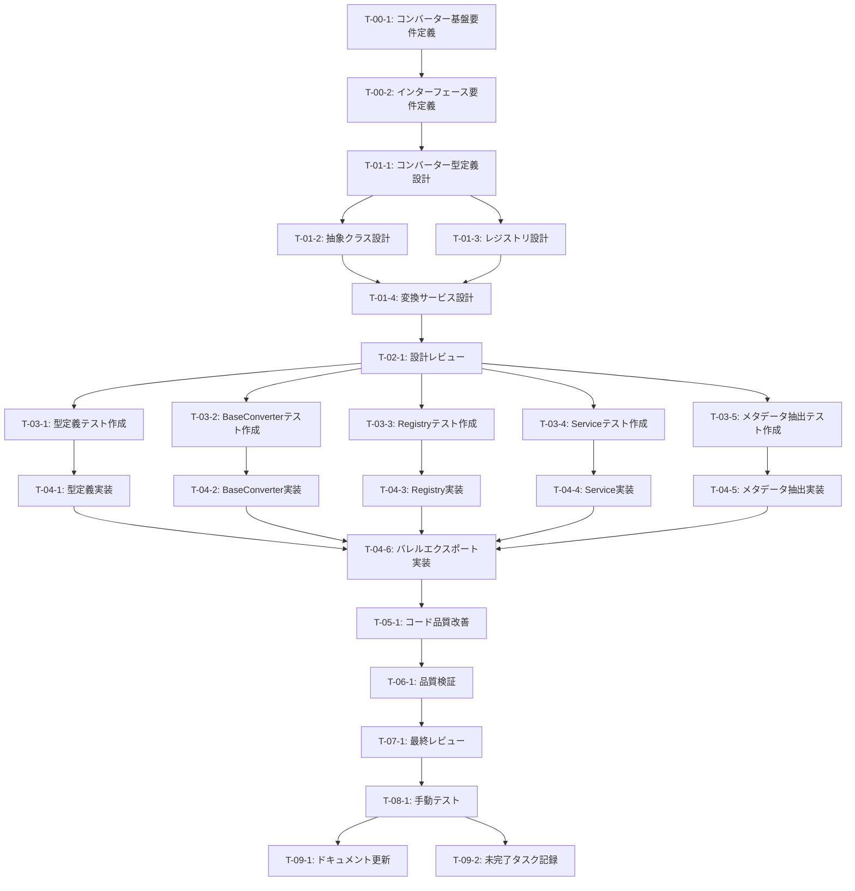

# ファイル変換基盤・インターフェース - タスク実行仕様書

## ユーザーからの元の指示

```
CONV-02-01: ファイル変換基盤・インターフェース

ファイル変換処理の基盤となるインターフェース、抽象クラス、レジストリを実装する。
各種コンバーター（CONV-02-02, CONV-02-03）の共通基盤となる。
```

## メタ情報

| 項目         | 内容                               |
| ------------ | ---------------------------------- |
| タスクID     | CONV-02-01                         |
| タスク名     | ファイル変換基盤・インターフェース |
| 分類         | 新規機能実装                       |
| 対象機能     | RAGシステム - ファイル変換基盤     |
| 優先度       | 高                                 |
| 見積もり規模 | 中規模                             |
| ステータス   | 未実施                             |
| 発見元       | システム要件定義                   |
| 発見日       | 2025-12-20                         |

---

## タスク概要

### 目的

RAGシステムにおけるファイル変換処理の共通基盤を確立し、拡張可能で保守性の高いコンバーターアーキテクチャを構築する。これにより、今後追加される様々なファイル形式のコンバーター実装が統一されたインターフェースで提供され、システム全体の品質と開発効率が向上する。

### 背景

RAGシステムでは多様なファイル形式（テキスト、Markdown、PDF、画像等）を統一的に処理する必要がある。各コンバーターがバラバラの実装になると、以下の問題が発生する：

- エラーハンドリングの一貫性欠如
- テストの困難さ
- 新しいコンバーター追加時の学習コスト増大
- パフォーマンス最適化の困難さ

共通基盤を先に構築することで、これらの問題を予防し、今後のコンバーター実装（CONV-02-02, CONV-02-03）がスムーズに進む。

### 最終ゴール

- 拡張可能なコンバーターインターフェースの確立
- エラーハンドリングとパフォーマンス管理を含む抽象基底クラスの実装
- 優先度ベースのコンバーター選択機能を持つレジストリの実装
- タイムアウト・同時実行制御を持つ変換サービスの実装
- テキストからメタデータを抽出するユーティリティの実装
- 80%以上のテストカバレッジ達成

### 成果物一覧

| 種別         | 成果物                       | 配置先                                                          |
| ------------ | ---------------------------- | --------------------------------------------------------------- |
| 機能         | コンバーター型定義           | `packages/shared/src/services/conversion/types.ts`              |
| 機能         | 抽象コンバータークラス       | `packages/shared/src/services/conversion/base-converter.ts`     |
| 機能         | コンバーターレジストリ       | `packages/shared/src/services/conversion/converter-registry.ts` |
| 機能         | 変換サービス                 | `packages/shared/src/services/conversion/conversion-service.ts` |
| 機能         | メタデータ抽出ユーティリティ | `packages/shared/src/services/conversion/metadata-extractor.ts` |
| 機能         | バレルエクスポート           | `packages/shared/src/services/conversion/index.ts`              |
| テスト       | 単体テスト                   | `packages/shared/src/services/conversion/__tests__/`            |
| ドキュメント | API仕様書                    | `docs/30-workflows/conversion-base/api-specification.md`        |

---

## 参照ファイル

本仕様書のコマンド・エージェント・スキル選定は以下を参照：

- `docs/00-requirements/master_system_design.md` - システム要件
- `.claude/commands/ai/command_list.md` - /ai:コマンド定義
- `.claude/agents/agent_list.md` - エージェント定義
- `.claude/skills/skill_list.md` - スキル定義

---

## タスク分解サマリー

| ID     | フェーズ | サブタスク名             | 責務                                   | 依存           |
| ------ | -------- | ------------------------ | -------------------------------------- | -------------- |
| T-00-1 | Phase 0  | コンバーター基盤要件定義 | 変換基盤の機能要件・非機能要件を明確化 | なし           |
| T-00-2 | Phase 0  | インターフェース要件定義 | IConverter、型定義の仕様を明確化       | T-00-1         |
| T-01-1 | Phase 1  | コンバーター型定義設計   | ConverterInput/Output等の型設計        | T-00-2         |
| T-01-2 | Phase 1  | 抽象クラス設計           | BaseConverterの構造設計                | T-01-1         |
| T-01-3 | Phase 1  | レジストリ設計           | ConverterRegistryの設計                | T-01-1         |
| T-01-4 | Phase 1  | 変換サービス設計         | ConversionServiceの設計                | T-01-2, T-01-3 |
| T-02-1 | Phase 2  | 設計レビュー             | アーキテクチャ・ドメインモデル検証     | T-01-4         |
| T-03-1 | Phase 3  | 型定義テスト作成         | 型定義の妥当性テスト作成               | T-02-1         |
| T-03-2 | Phase 3  | BaseConverterテスト作成  | 抽象クラスのテスト作成                 | T-02-1         |
| T-03-3 | Phase 3  | Registryテスト作成       | レジストリのテスト作成                 | T-02-1         |
| T-03-4 | Phase 3  | Serviceテスト作成        | 変換サービスのテスト作成               | T-02-1         |
| T-03-5 | Phase 3  | メタデータ抽出テスト作成 | メタデータ抽出のテスト作成             | T-02-1         |
| T-04-1 | Phase 4  | 型定義実装               | types.ts実装                           | T-03-1         |
| T-04-2 | Phase 4  | BaseConverter実装        | base-converter.ts実装                  | T-03-2         |
| T-04-3 | Phase 4  | Registry実装             | converter-registry.ts実装              | T-03-3         |
| T-04-4 | Phase 4  | Service実装              | conversion-service.ts実装              | T-03-4         |
| T-04-5 | Phase 4  | メタデータ抽出実装       | metadata-extractor.ts実装              | T-03-5         |
| T-04-6 | Phase 4  | バレルエクスポート実装   | index.ts実装                           | T-04-1～T-04-5 |
| T-05-1 | Phase 5  | コード品質改善           | リファクタリング実施                   | T-04-6         |
| T-06-1 | Phase 6  | 品質検証                 | テスト・Lint・型チェック実行           | T-05-1         |
| T-07-1 | Phase 7  | 最終レビュー             | コード品質・アーキテクチャ検証         | T-06-1         |
| T-08-1 | Phase 8  | 手動テスト               | 実環境での動作確認                     | T-07-1         |
| T-09-1 | Phase 9  | ドキュメント更新         | システムドキュメント更新               | T-08-1         |
| T-09-2 | Phase 9  | 未完了タスク記録         | 追加タスク・改善点の記録               | T-08-1         |

**総サブタスク数**: 24個

---

## 実行フロー図



---

## Phase 0: 要件定義

### T-00-1: コンバーター基盤要件定義

#### 目的

ファイル変換基盤として必要な機能要件・非機能要件を包括的に定義し、後続の設計・実装の指針とする。

#### 背景

様々なファイル形式を統一的に扱うため、拡張性・保守性・パフォーマンスを考慮した基盤が必要。要件が不明確だと設計が迷走し、後戻りが発生する。

#### 責務（単一責務）

変換基盤の全体要件（機能要件・非機能要件）を明文化する

#### Claude Code スラッシュコマンド

> ⚠️ 以下はターミナルコマンドではなく、Claude Code内で実行するスラッシュコマンドです

```
/ai:gather-requirements --scope "ファイル変換基盤" --output "docs/30-workflows/conversion-base/requirements-foundation.md"
```

- **参照**: `.claude/commands/ai/command_list.md`

#### 使用エージェント

- **エージェント**: .claude/agents/req-analyst.md
- **選定理由**: 要件分析の専門家として、機能要件・非機能要件の包括的な定義が可能
- **参照**: `.claude/agents/agent_list.md`

#### 活用スキル

| スキル名                                                       | 活用方法                           |
| -------------------------------------------------------------- | ---------------------------------- |
| .claude/skills/functional-non-functional-requirements/SKILL.md | 機能要件と非機能要件の体系的な整理 |
| .claude/skills/acceptance-criteria-writing/SKILL.md            | 受け入れ基準の明確化               |

- **参照**: `.claude/skills/skill_list.md`

#### 成果物

| 成果物     | パス                                                           | 内容                               |
| ---------- | -------------------------------------------------------------- | ---------------------------------- |
| 要件定義書 | `docs/30-workflows/conversion-base/requirements-foundation.md` | 機能要件・非機能要件・受け入れ基準 |

#### 完了条件

- [ ] 機能要件が列挙されている
- [ ] 非機能要件（パフォーマンス、拡張性、保守性）が定義されている
- [ ] 受け入れ基準が検証可能な形で記述されている
- [ ] 依存タスク（CONV-01, CONV-03-02）との整合性が確認されている

#### 依存関係

- **前提**: なし
- **後続**: T-00-2

---

### T-00-2: インターフェース要件定義

#### 目的

IConverter、ConverterInput/Output等の主要インターフェースの仕様を明確化し、設計の指針とする。

#### 背景

T-00-1で定義した全体要件を、具体的なインターフェース仕様に落とし込む必要がある。インターフェースが不明確だと実装者が独自解釈してしまい、一貫性が失われる。

#### 責務（単一責務）

主要インターフェース（IConverter、型定義）の詳細仕様を定義する

#### Claude Code スラッシュコマンド

> ⚠️ 以下はターミナルコマンドではなく、Claude Code内で実行するスラッシュコマンドです

```
/ai:write-spec --target "IConverter, ConverterInput, ConverterOutput" --output "docs/30-workflows/conversion-base/requirements-interface.md"
```

- **参照**: `.claude/commands/ai/command_list.md`

#### 使用エージェント

- **エージェント**: .claude/agents/schema-def.md
- **選定理由**: TypeScript型定義とインターフェース設計の専門性を持つ
- **参照**: `.claude/agents/agent_list.md`

#### 活用スキル

| スキル名                                      | 活用方法                           |
| --------------------------------------------- | ---------------------------------- |
| .claude/skills/interface-segregation/SKILL.md | インターフェース分離の原則適用     |
| .claude/skills/type-safety-patterns/SKILL.md  | 型安全性を確保する設計パターン適用 |

- **参照**: `.claude/skills/skill_list.md`

#### 成果物

| 成果物                 | パス                                                          | 内容                   |
| ---------------------- | ------------------------------------------------------------- | ---------------------- |
| インターフェース仕様書 | `docs/30-workflows/conversion-base/requirements-interface.md` | IConverter等の詳細仕様 |

#### 完了条件

- [ ] IConverterインターフェースの各メソッドが定義されている
- [ ] ConverterInput/Outputの型仕様が明確である
- [ ] エラーハンドリングの方針が記載されている
- [ ] 拡張性を考慮した設計指針が示されている

#### 依存関係

- **前提**: T-00-1
- **後続**: T-01-1

---

## Phase 1: 設計

### T-01-1: コンバーター型定義設計

#### 目的

ConverterInput、ConverterOutput、ConverterOptions等の型定義を詳細設計し、型安全性を確保する。

#### 背景

T-00-2で定義したインターフェース仕様を、実装可能な具体的な型定義に落とし込む。TypeScriptの型システムを活用し、コンパイル時にエラーを検出できるようにする。

#### 責務（単一責務）

types.tsに含まれる全型定義の詳細設計

#### Claude Code スラッシュコマンド

> ⚠️ 以下はターミナルコマンドではなく、Claude Code内で実行するスラッシュコマンドです

```
# # /ai:design-types (手動設計推奨) (手動設計推奨) --module "conversion" --output "docs/30-workflows/conversion-base/design-types.md"
```

- **参照**: `.claude/commands/ai/command_list.md`

#### 使用エージェント

- **エージェント**: .claude/agents/schema-def.md
- **選定理由**: TypeScript型定義の専門家として、厳密な型設計が可能
- **参照**: `.claude/agents/agent_list.md`

#### 活用スキル

| スキル名                                     | 活用方法                              |
| -------------------------------------------- | ------------------------------------- |
| .claude/skills/type-safety-patterns/SKILL.md | 型安全性確保のパターン適用            |
| .claude/skills/zod-validation/SKILL.md       | Zodによるランタイムバリデーション設計 |

- **参照**: `.claude/skills/skill_list.md`

#### 成果物

| 成果物       | パス                                                | 内容               |
| ------------ | --------------------------------------------------- | ------------------ |
| 型定義設計書 | `docs/30-workflows/conversion-base/design-types.md` | 全型定義の詳細設計 |

#### 完了条件

- [ ] ConverterInput/Output/Optionsの詳細設計が完了
- [ ] IConverterインターフェースの設計が完了
- [ ] ConverterMetadataの設計が完了
- [ ] Result型との統合方針が明確

#### 依存関係

- **前提**: T-00-2
- **後続**: T-01-2, T-01-3

---

### T-01-2: 抽象クラス設計

#### 目的

BaseConverterクラスの構造を設計し、共通処理（前処理・後処理・エラーハンドリング）を抽象化する。

#### 背景

各コンバーターで共通する処理を抽象クラスに集約することで、DRY原則を実現し、実装の一貫性を確保する。

#### 責務（単一責務）

BaseConverterクラスの構造設計

#### Claude Code スラッシュコマンド

> ⚠️ 以下はターミナルコマンドではなく、Claude Code内で実行するスラッシュコマンドです

```
# # /ai:design-abstract-class (手動設計推奨) (手動設計推奨) --name "BaseConverter" --output "docs/30-workflows/conversion-base/design-base-converter.md"
```

- **参照**: `.claude/commands/ai/command_list.md`

#### 使用エージェント

- **エージェント**: .claude/agents/arch-police.md
- **選定理由**: クリーンアーキテクチャの原則に基づいた抽象クラス設計が可能
- **参照**: `.claude/agents/agent_list.md`

#### 活用スキル

| スキル名                                              | 活用方法                           |
| ----------------------------------------------------- | ---------------------------------- |
| .claude/skills/clean-architecture-principles/SKILL.md | クリーンアーキテクチャ原則の適用   |
| .claude/skills/solid-principles/SKILL.md              | SOLID原則（特にOCP、LSP）の適用    |
| .claude/skills/factory-patterns/SKILL.md              | テンプレートメソッドパターンの適用 |

- **参照**: `.claude/skills/skill_list.md`

#### 成果物

| 成果物           | パス                                                         | 内容                    |
| ---------------- | ------------------------------------------------------------ | ----------------------- |
| 抽象クラス設計書 | `docs/30-workflows/conversion-base/design-base-converter.md` | BaseConverterの詳細設計 |

#### 完了条件

- [ ] テンプレートメソッドパターンが適用されている
- [ ] 前処理・後処理のフックポイントが設計されている
- [ ] エラーハンドリングの共通処理が設計されている
- [ ] サブクラスで実装すべき抽象メソッドが明確

#### 依存関係

- **前提**: T-01-1
- **後続**: T-01-4

---

### T-01-3: レジストリ設計

#### 目的

ConverterRegistryの設計を行い、コンバーターの登録・検索・優先度管理の仕組みを確立する。

#### 背景

複数のコンバーターを管理し、MIMEタイプに応じて最適なコンバーターを選択する仕組みが必要。

#### 責務（単一責務）

ConverterRegistryクラスの構造設計

#### Claude Code スラッシュコマンド

> ⚠️ 以下はターミナルコマンドではなく、Claude Code内で実行するスラッシュコマンドです

```
# # /ai:design-registry (手動設計推奨) (手動設計推奨) --name "ConverterRegistry" --output "docs/30-workflows/conversion-base/design-registry.md"
```

- **参照**: `.claude/commands/ai/command_list.md`

#### 使用エージェント

- **エージェント**: .claude/agents/logic-dev.md
- **選定理由**: ビジネスロジック（優先度管理、検索アルゴリズム）の設計が得意
- **参照**: `.claude/agents/agent_list.md`

#### 活用スキル

| スキル名                                   | 活用方法                 |
| ------------------------------------------ | ------------------------ |
| .claude/skills/repository-pattern/SKILL.md | リポジトリパターンの適用 |
| .claude/skills/factory-patterns/SKILL.md   | ファクトリパターンの適用 |

- **参照**: `.claude/skills/skill_list.md`

#### 成果物

| 成果物           | パス                                                   | 内容                        |
| ---------------- | ------------------------------------------------------ | --------------------------- |
| レジストリ設計書 | `docs/30-workflows/conversion-base/design-registry.md` | ConverterRegistryの詳細設計 |

#### 完了条件

- [ ] コンバーター登録・登録解除の仕組みが設計されている
- [ ] 優先度ベースの選択アルゴリズムが設計されている
- [ ] MIMEタイプによる検索機能が設計されている
- [ ] グローバルインスタンスとテスト用インスタンスの使い分けが明確

#### 依存関係

- **前提**: T-01-1
- **後続**: T-01-4

---

### T-01-4: 変換サービス設計

#### 目的

ConversionServiceの設計を行い、タイムアウト・同時実行制御・バッチ変換等の高度な機能を確立する。

#### 背景

BaseConverterとRegistryを統合し、実際の変換処理を統括するサービスレイヤーが必要。パフォーマンスと信頼性を確保するための制御機能も必須。

#### 責務（単一責務）

ConversionServiceクラスの構造設計

#### Claude Code スラッシュコマンド

> ⚠️ 以下はターミナルコマンドではなく、Claude Code内で実行するスラッシュコマンドです

```
# # /ai:design-service (手動設計推奨) (手動設計推奨) --name "ConversionService" --output "docs/30-workflows/conversion-base/design-service.md"
```

- **参照**: `.claude/commands/ai/command_list.md`

#### 使用エージェント

- **エージェント**: .claude/agents/logic-dev.md
- **選定理由**: アプリケーションサービスレイヤーの設計とビジネスロジックの統合が得意
- **参照**: `.claude/agents/agent_list.md`

#### 活用スキル

| スキル名                                              | 活用方法                         |
| ----------------------------------------------------- | -------------------------------- |
| .claude/skills/clean-architecture-principles/SKILL.md | アプリケーションサービス層の設計 |
| .claude/skills/transaction-management/SKILL.md        | タイムアウト・同時実行制御の設計 |

- **参照**: `.claude/skills/skill_list.md`

#### 成果物

| 成果物         | パス                                                  | 内容                        |
| -------------- | ----------------------------------------------------- | --------------------------- |
| サービス設計書 | `docs/30-workflows/conversion-base/design-service.md` | ConversionServiceの詳細設計 |

#### 完了条件

- [ ] タイムアウト機能が設計されている
- [ ] 同時実行数制限が設計されている
- [ ] バッチ変換機能が設計されている
- [ ] レジストリとの連携方法が明確

#### 依存関係

- **前提**: T-01-2, T-01-3
- **後続**: T-02-1

---

## Phase 2: 設計レビューゲート

### T-02-1: 設計レビュー

#### 目的

実装開始前に要件・設計の妥当性を複数エージェントで検証し、アーキテクチャ品質を担保する。

#### 背景

設計段階での問題発見は実装後の修正コストを大幅に削減する。特にインフラ的な基盤コードは後からの変更が困難なため、事前検証が重要。

#### レビュー参加エージェント

| エージェント                     | レビュー観点         | 選定理由                             |
| -------------------------------- | -------------------- | ------------------------------------ |
| .claude/agents/arch-police.md    | アーキテクチャ整合性 | クリーンアーキテクチャ原則の遵守確認 |
| .claude/agents/domain-modeler.md | ドメインモデル妥当性 | 変換ドメインの概念整合性確認         |
| .claude/agents/req-analyst.md    | 要件充足性           | 要件漏れ・矛盾の確認                 |

- **参照**: `.claude/agents/agent_list.md`

#### レビューチェックリスト

**アーキテクチャ整合性** (.claude/agents/arch-police.md)

- [ ] レイヤー間の依存関係が適切か（DIP遵守）
- [ ] 抽象と具象の分離が明確か
- [ ] クリーンアーキテクチャ原則に違反していないか
- [ ] 既存のRAGアーキテクチャとの整合性があるか

**ドメインモデル妥当性** (.claude/agents/domain-modeler.md)

- [ ] ユビキタス言語が適切に使用されているか
- [ ] エンティティと値オブジェクトの境界が適切か
- [ ] ドメインルールが正しく表現されているか
- [ ] 将来の拡張（新しいファイル形式）に対応可能か

**要件充足性** (.claude/agents/req-analyst.md)

- [ ] 機能要件がすべて設計に反映されているか
- [ ] 非機能要件（パフォーマンス、拡張性）が考慮されているか
- [ ] 受け入れ基準が検証可能か
- [ ] 依存タスク（CONV-03-02）との整合性があるか

#### レビュー結果

- **判定**: （実施時に記入）
- **指摘事項**: （実施時に記入）
- **対応方針**: （実施時に記入）

#### 戻り先決定（MAJORの場合）

| 問題の種類           | 戻り先              |
| -------------------- | ------------------- |
| 要件の不明確さ・矛盾 | Phase 0（要件定義） |
| 設計の問題           | Phase 1（設計）     |
| 両方の問題           | Phase 0（要件定義） |

#### 完了条件

- [ ] 全レビュー観点でチェックリストが完了
- [ ] 指摘事項が記録されている
- [ ] MAJOR以上の問題がない、またはすべて解決済み

#### 依存関係

- **前提**: T-01-4
- **後続**: T-03-1～T-03-5

---

## Phase 3: テスト作成 (TDD: Red)

### T-03-1: 型定義テスト作成

#### 目的

types.tsの型定義が期待通りに機能することを検証するテストを作成する。

#### 背景

TypeScriptの型システムを活用し、コンパイル時に型エラーが検出されることを確認する。型定義の妥当性を保証することで、後続の実装品質が向上する。

#### 責務（単一責務）

型定義の妥当性検証テスト作成

#### Claude Code スラッシュコマンド

> ⚠️ 以下はターミナルコマンドではなく、Claude Code内で実行するスラッシュコマンドです

```
/ai:generate-unit-tests --target "types.ts" --test-type "type-validation" --output "packages/shared/src/services/conversion/__tests__/types.test.ts"
```

- **参照**: `.claude/commands/ai/command_list.md`

#### 使用エージェント

- **エージェント**: .claude/agents/unit-tester.md
- **選定理由**: ユニットテストの専門家として、型定義テストのベストプラクティスを適用可能
- **参照**: `.claude/agents/agent_list.md`

#### 活用スキル

| スキル名                                     | 活用方法           |
| -------------------------------------------- | ------------------ |
| .claude/skills/tdd-principles/SKILL.md       | TDDサイクルの実践  |
| .claude/skills/test-data-management/SKILL.md | テストデータの設計 |

- **参照**: `.claude/skills/skill_list.md`

#### 成果物

| 成果物       | パス                                                              | 内容                 |
| ------------ | ----------------------------------------------------------------- | -------------------- |
| 型定義テスト | `packages/shared/src/services/conversion/__tests__/types.test.ts` | 型定義の妥当性テスト |

#### TDD検証: Red状態確認

```bash
pnpm --filter @repo/shared test types.test.ts
```

- [ ] テストが失敗することを確認（Red状態）

#### 完了条件

- [ ] ConverterInput/Outputの型テストが作成されている
- [ ] IConverterインターフェースの型テストが作成されている
- [ ] 不正な型が弾かれることを確認するテストがある
- [ ] テストが失敗する（Red状態）

#### 依存関係

- **前提**: T-02-1
- **後続**: T-04-1

---

### T-03-2: BaseConverterテスト作成

#### 目的

BaseConverterクラスの抽象メソッド・テンプレートメソッドが期待通りに機能することを検証するテストを作成する。

#### 背景

抽象クラスの共通処理（前処理・後処理・エラーハンドリング）が正しく動作することを保証する。

#### 責務（単一責務）

BaseConverterクラスのテスト作成

#### Claude Code スラッシュコマンド

> ⚠️ 以下はターミナルコマンドではなく、Claude Code内で実行するスラッシュコマンドです

```
/ai:generate-unit-tests --target "base-converter.ts" --output "packages/shared/src/services/conversion/__tests__/base-converter.test.ts"
```

- **参照**: `.claude/commands/ai/command_list.md`

#### 使用エージェント

- **エージェント**: .claude/agents/unit-tester.md
- **選定理由**: 抽象クラスのテスト戦略（モック・スタブ）に精通
- **参照**: `.claude/agents/agent_list.md`

#### 活用スキル

| スキル名                                        | 活用方法             |
| ----------------------------------------------- | -------------------- |
| .claude/skills/tdd-principles/SKILL.md          | TDDサイクルの実践    |
| .claude/skills/test-doubles/SKILL.md            | モック・スタブの活用 |
| .claude/skills/boundary-value-analysis/SKILL.md | 境界値テスト設計     |

- **参照**: `.claude/skills/skill_list.md`

#### 成果物

| 成果物              | パス                                                                       | 内容             |
| ------------------- | -------------------------------------------------------------------------- | ---------------- |
| BaseConverterテスト | `packages/shared/src/services/conversion/__tests__/base-converter.test.ts` | 抽象クラステスト |

#### TDD検証: Red状態確認

```bash
pnpm --filter @repo/shared test base-converter.test.ts
```

- [ ] テストが失敗することを確認（Red状態）

#### 完了条件

- [ ] テンプレートメソッドの動作テストが作成されている
- [ ] 前処理・後処理フックのテストが作成されている
- [ ] エラーハンドリングのテストが作成されている
- [ ] テストが失敗する（Red状態）

#### 依存関係

- **前提**: T-02-1
- **後続**: T-04-2

---

### T-03-3: Registryテスト作成

#### 目的

ConverterRegistryの登録・検索・優先度管理が期待通りに機能することを検証するテストを作成する。

#### 背景

複数コンバーターの管理と適切な選択が、RAGシステムの信頼性の鍵となる。

#### 責務（単一責務）

ConverterRegistryクラスのテスト作成

#### Claude Code スラッシュコマンド

> ⚠️ 以下はターミナルコマンドではなく、Claude Code内で実行するスラッシュコマンドです

```
/ai:generate-unit-tests --target "converter-registry.ts" --output "packages/shared/src/services/conversion/__tests__/converter-registry.test.ts"
```

- **参照**: `.claude/commands/ai/command_list.md`

#### 使用エージェント

- **エージェント**: .claude/agents/unit-tester.md
- **選定理由**: リポジトリパターンのテスト戦略に精通
- **参照**: `.claude/agents/agent_list.md`

#### 活用スキル

| スキル名                                     | 活用方法          |
| -------------------------------------------- | ----------------- |
| .claude/skills/tdd-principles/SKILL.md       | TDDサイクルの実践 |
| .claude/skills/test-data-management/SKILL.md | テストデータ管理  |

- **参照**: `.claude/skills/skill_list.md`

#### 成果物

| 成果物         | パス                                                                           | 内容             |
| -------------- | ------------------------------------------------------------------------------ | ---------------- |
| Registryテスト | `packages/shared/src/services/conversion/__tests__/converter-registry.test.ts` | レジストリテスト |

#### TDD検証: Red状態確認

```bash
pnpm --filter @repo/shared test converter-registry.test.ts
```

- [ ] テストが失敗することを確認（Red状態）

#### 完了条件

- [ ] 登録・登録解除のテストが作成されている
- [ ] 優先度ベース選択のテストが作成されている
- [ ] MIMEタイプ検索のテストが作成されている
- [ ] テストが失敗する（Red状態）

#### 依存関係

- **前提**: T-02-1
- **後続**: T-04-3

---

### T-03-4: Serviceテスト作成

#### 目的

ConversionServiceのタイムアウト・同時実行制御・バッチ変換が期待通りに機能することを検証するテストを作成する。

#### 背景

サービスレイヤーの複雑なロジックを保証し、システムの信頼性を確保する。

#### 責務（単一責務）

ConversionServiceクラスのテスト作成

#### Claude Code スラッシュコマンド

> ⚠️ 以下はターミナルコマンドではなく、Claude Code内で実行するスラッシュコマンドです

```
/ai:generate-unit-tests --target "conversion-service.ts" --output "packages/shared/src/services/conversion/__tests__/conversion-service.test.ts"
```

- **参照**: `.claude/commands/ai/command_list.md`

#### 使用エージェント

- **エージェント**: .claude/agents/unit-tester.md
- **選定理由**: サービスレイヤーの複雑なテストケース設計が可能
- **参照**: `.claude/agents/agent_list.md`

#### 活用スキル

| スキル名                                        | 活用方法                               |
| ----------------------------------------------- | -------------------------------------- |
| .claude/skills/tdd-principles/SKILL.md          | TDDサイクルの実践                      |
| .claude/skills/test-doubles/SKILL.md            | モック・スタブの活用                   |
| .claude/skills/boundary-value-analysis/SKILL.md | タイムアウト・同時実行数の境界値テスト |

- **参照**: `.claude/skills/skill_list.md`

#### 成果物

| 成果物        | パス                                                                           | 内容           |
| ------------- | ------------------------------------------------------------------------------ | -------------- |
| Serviceテスト | `packages/shared/src/services/conversion/__tests__/conversion-service.test.ts` | サービステスト |

#### TDD検証: Red状態確認

```bash
pnpm --filter @repo/shared test conversion-service.test.ts
```

- [ ] テストが失敗することを確認（Red状態）

#### 完了条件

- [ ] タイムアウトのテストが作成されている
- [ ] 同時実行数制限のテストが作成されている
- [ ] バッチ変換のテストが作成されている
- [ ] テストが失敗する（Red状態）

#### 依存関係

- **前提**: T-02-1
- **後続**: T-04-4

---

### T-03-5: メタデータ抽出テスト作成

#### 目的

MetadataExtractorがテキストから適切にメタデータを抽出することを検証するテストを作成する。

#### 背景

メタデータの品質はRAG検索の精度に直結するため、抽出ロジックの正確性を保証する。

#### 責務（単一責務）

MetadataExtractorのテスト作成

#### Claude Code スラッシュコマンド

> ⚠️ 以下はターミナルコマンドではなく、Claude Code内で実行するスラッシュコマンドです

```
/ai:generate-unit-tests --target "metadata-extractor.ts" --output "packages/shared/src/services/conversion/__tests__/metadata-extractor.test.ts"
```

- **参照**: `.claude/commands/ai/command_list.md`

#### 使用エージェント

- **エージェント**: .claude/agents/unit-tester.md
- **選定理由**: テキスト処理ロジックのテストケース設計が可能
- **参照**: `.claude/agents/agent_list.md`

#### 活用スキル

| スキル名                                        | 活用方法                           |
| ----------------------------------------------- | ---------------------------------- |
| .claude/skills/tdd-principles/SKILL.md          | TDDサイクルの実践                  |
| .claude/skills/boundary-value-analysis/SKILL.md | テキスト長・特殊文字の境界値テスト |

- **参照**: `.claude/skills/skill_list.md`

#### 成果物

| 成果物               | パス                                                                           | 内容                 |
| -------------------- | ------------------------------------------------------------------------------ | -------------------- |
| メタデータ抽出テスト | `packages/shared/src/services/conversion/__tests__/metadata-extractor.test.ts` | メタデータ抽出テスト |

#### TDD検証: Red状態確認

```bash
pnpm --filter @repo/shared test metadata-extractor.test.ts
```

- [ ] テストが失敗することを確認（Red状態）

#### 完了条件

- [ ] タイトル抽出のテストが作成されている
- [ ] 見出し抽出のテストが作成されている
- [ ] 言語検出のテストが作成されている
- [ ] テストが失敗する（Red状態）

#### 依存関係

- **前提**: T-02-1
- **後続**: T-04-5

---

## Phase 4: 実装 (TDD: Green)

### T-04-1: 型定義実装

#### 目的

types.tsを実装し、T-03-1のテストを成功させる。

#### 背景

型定義が実装されることで、後続の実装で型安全性が確保される。

#### 責務（単一責務）

types.tsの実装

#### Claude Code スラッシュコマンド

> ⚠️ 以下はターミナルコマンドではなく、Claude Code内で実行するスラッシュコマンドです

```
/ai:implement-business-logic --target "packages/shared/src/services/conversion/types.ts" --design "docs/30-workflows/conversion-base/design-types.md"
```

- **参照**: `.claude/commands/ai/command_list.md`

#### 使用エージェント

- **エージェント**: .claude/agents/schema-def.md
- **選定理由**: TypeScript型定義実装の専門家
- **参照**: `.claude/agents/agent_list.md`

#### 活用スキル

| スキル名                                     | 活用方法                   |
| -------------------------------------------- | -------------------------- |
| .claude/skills/type-safety-patterns/SKILL.md | 型安全性確保のパターン実装 |

- **参照**: `.claude/skills/skill_list.md`

#### 成果物

| 成果物 | パス                                               | 内容         |
| ------ | -------------------------------------------------- | ------------ |
| 型定義 | `packages/shared/src/services/conversion/types.ts` | 全型定義実装 |

#### TDD検証: Green状態確認

```bash
pnpm --filter @repo/shared test types.test.ts
```

- [ ] テストが成功することを確認（Green状態）

#### 完了条件

- [ ] ConverterInput/Outputが実装されている
- [ ] IConverterインターフェースが実装されている
- [ ] ConverterMetadataが実装されている
- [ ] テストが成功する（Green状態）

#### 依存関係

- **前提**: T-03-1
- **後続**: T-04-6

---

### T-04-2: BaseConverter実装

#### 目的

base-converter.tsを実装し、T-03-2のテストを成功させる。

#### 背景

抽象クラスが実装されることで、各コンバーターの実装が統一される。

#### 責務（単一責務）

base-converter.tsの実装

#### Claude Code スラッシュコマンド

> ⚠️ 以下はターミナルコマンドではなく、Claude Code内で実行するスラッシュコマンドです

```
/ai:implement-business-logic --target "packages/shared/src/services/conversion/base-converter.ts" --design "docs/30-workflows/conversion-base/design-base-converter.md"
```

- **参照**: `.claude/commands/ai/command_list.md`

#### 使用エージェント

- **エージェント**: .claude/agents/logic-dev.md
- **選定理由**: 抽象クラス実装とテンプレートメソッドパターンの実装が得意
- **参照**: `.claude/agents/agent_list.md`

#### 活用スキル

| スキル名                                              | 活用方法                           |
| ----------------------------------------------------- | ---------------------------------- |
| .claude/skills/clean-architecture-principles/SKILL.md | クリーンアーキテクチャ原則の実装   |
| .claude/skills/solid-principles/SKILL.md              | SOLID原則の実装                    |
| .claude/skills/factory-patterns/SKILL.md              | テンプレートメソッドパターンの実装 |

- **参照**: `.claude/skills/skill_list.md`

#### 成果物

| 成果物           | パス                                                        | 内容              |
| ---------------- | ----------------------------------------------------------- | ----------------- |
| 抽象コンバーター | `packages/shared/src/services/conversion/base-converter.ts` | BaseConverter実装 |

#### TDD検証: Green状態確認

```bash
pnpm --filter @repo/shared test base-converter.test.ts
```

- [ ] テストが成功することを確認（Green状態）

#### 完了条件

- [ ] テンプレートメソッドが実装されている
- [ ] 前処理・後処理フックが実装されている
- [ ] エラーハンドリングが実装されている
- [ ] テストが成功する（Green状態）

#### 依存関係

- **前提**: T-03-2
- **後続**: T-04-6

---

### T-04-3: Registry実装

#### 目的

converter-registry.tsを実装し、T-03-3のテストを成功させる。

#### 背景

レジストリが実装されることで、コンバーターの管理と選択が可能になる。

#### 責務（単一責務）

converter-registry.tsの実装

#### Claude Code スラッシュコマンド

> ⚠️ 以下はターミナルコマンドではなく、Claude Code内で実行するスラッシュコマンドです

```
/ai:implement-business-logic --target "packages/shared/src/services/conversion/converter-registry.ts" --design "docs/30-workflows/conversion-base/design-registry.md"
```

- **参照**: `.claude/commands/ai/command_list.md`

#### 使用エージェント

- **エージェント**: .claude/agents/logic-dev.md
- **選定理由**: リポジトリパターンとファクトリパターンの実装が得意
- **参照**: `.claude/agents/agent_list.md`

#### 活用スキル

| スキル名                                   | 活用方法                 |
| ------------------------------------------ | ------------------------ |
| .claude/skills/repository-pattern/SKILL.md | リポジトリパターンの実装 |
| .claude/skills/factory-patterns/SKILL.md   | ファクトリパターンの実装 |

- **参照**: `.claude/skills/skill_list.md`

#### 成果物

| 成果物     | パス                                                            | 内容                  |
| ---------- | --------------------------------------------------------------- | --------------------- |
| レジストリ | `packages/shared/src/services/conversion/converter-registry.ts` | ConverterRegistry実装 |

#### TDD検証: Green状態確認

```bash
pnpm --filter @repo/shared test converter-registry.test.ts
```

- [ ] テストが成功することを確認（Green状態）

#### 完了条件

- [ ] 登録・登録解除が実装されている
- [ ] 優先度ベース選択が実装されている
- [ ] MIMEタイプ検索が実装されている
- [ ] テストが成功する（Green状態）

#### 依存関係

- **前提**: T-03-3
- **後続**: T-04-6

---

### T-04-4: Service実装

#### 目的

conversion-service.tsを実装し、T-03-4のテストを成功させる。

#### 背景

サービスレイヤーが実装されることで、エンドツーエンドの変換処理が可能になる。

#### 責務（単一責務）

conversion-service.tsの実装

#### Claude Code スラッシュコマンド

> ⚠️ 以下はターミナルコマンドではなく、Claude Code内で実行するスラッシュコマンドです

```
/ai:implement-business-logic --target "packages/shared/src/services/conversion/conversion-service.ts" --design "docs/30-workflows/conversion-base/design-service.md"
```

- **参照**: `.claude/commands/ai/command_list.md`

#### 使用エージェント

- **エージェント**: .claude/agents/logic-dev.md
- **選定理由**: アプリケーションサービスレイヤーの実装が得意
- **参照**: `.claude/agents/agent_list.md`

#### 活用スキル

| スキル名                                              | 活用方法                         |
| ----------------------------------------------------- | -------------------------------- |
| .claude/skills/clean-architecture-principles/SKILL.md | サービスレイヤーの実装           |
| .claude/skills/transaction-management/SKILL.md        | タイムアウト・同時実行制御の実装 |

- **参照**: `.claude/skills/skill_list.md`

#### 成果物

| 成果物       | パス                                                            | 内容                  |
| ------------ | --------------------------------------------------------------- | --------------------- |
| 変換サービス | `packages/shared/src/services/conversion/conversion-service.ts` | ConversionService実装 |

#### TDD検証: Green状態確認

```bash
pnpm --filter @repo/shared test conversion-service.test.ts
```

- [ ] テストが成功することを確認（Green状態）

#### 完了条件

- [ ] タイムアウト機能が実装されている
- [ ] 同時実行数制限が実装されている
- [ ] バッチ変換が実装されている
- [ ] テストが成功する（Green状態）

#### 依存関係

- **前提**: T-03-4
- **後続**: T-04-6

---

### T-04-5: メタデータ抽出実装

#### 目的

metadata-extractor.tsを実装し、T-03-5のテストを成功させる。

#### 背景

メタデータ抽出が実装されることで、RAG検索の品質が向上する。

#### 責務（単一責務）

metadata-extractor.tsの実装

#### Claude Code スラッシュコマンド

> ⚠️ 以下はターミナルコマンドではなく、Claude Code内で実行するスラッシュコマンドです

```
/ai:implement-business-logic --target "packages/shared/src/services/conversion/metadata-extractor.ts"
```

- **参照**: `.claude/commands/ai/command_list.md`

#### 使用エージェント

- **エージェント**: .claude/agents/logic-dev.md
- **選定理由**: テキスト処理ロジックの実装が得意
- **参照**: `.claude/agents/agent_list.md`

#### 活用スキル

| スキル名                                     | 活用方法                 |
| -------------------------------------------- | ------------------------ |
| .claude/skills/clean-code-practices/SKILL.md | クリーンコード原則の実装 |

- **参照**: `.claude/skills/skill_list.md`

#### 成果物

| 成果物         | パス                                                            | 内容                  |
| -------------- | --------------------------------------------------------------- | --------------------- |
| メタデータ抽出 | `packages/shared/src/services/conversion/metadata-extractor.ts` | MetadataExtractor実装 |

#### TDD検証: Green状態確認

```bash
pnpm --filter @repo/shared test metadata-extractor.test.ts
```

- [ ] テストが成功することを確認（Green状態）

#### 完了条件

- [ ] タイトル抽出が実装されている
- [ ] 見出し抽出が実装されている
- [ ] 言語検出が実装されている
- [ ] テストが成功する（Green状態）

#### 依存関係

- **前提**: T-03-5
- **後続**: T-04-6

---

### T-04-6: バレルエクスポート実装

#### 目的

index.tsを実装し、変換基盤モジュールのエクスポートを統一する。

#### 背景

バレルエクスポートにより、他モジュールからのインポートが簡潔になる。

#### 責務（単一責務）

index.tsの実装

#### Claude Code スラッシュコマンド

> ⚠️ 以下はターミナルコマンドではなく、Claude Code内で実行するスラッシュコマンドです

```
# /ai:create-barrel-export (手動作成推奨) --target "packages/shared/src/services/conversion/"
```

- **参照**: `.claude/commands/ai/command_list.md`

#### 使用エージェント

- **エージェント**: .claude/agents/logic-dev.md
- **選定理由**: モジュール構成の整理が得意
- **参照**: `.claude/agents/agent_list.md`

#### 活用スキル

| スキル名                                              | 活用方法             |
| ----------------------------------------------------- | -------------------- |
| .claude/skills/clean-architecture-principles/SKILL.md | モジュール境界の整理 |

- **参照**: `.claude/skills/skill_list.md`

#### 成果物

| 成果物             | パス                                               | 内容             |
| ------------------ | -------------------------------------------------- | ---------------- |
| バレルエクスポート | `packages/shared/src/services/conversion/index.ts` | 統一エクスポート |

#### TDD検証: Green状態確認

```bash
pnpm --filter @repo/shared test
```

- [ ] すべてのテストが成功することを確認（Green状態）

#### 完了条件

- [ ] すべての公開APIがエクスポートされている
- [ ] インポート文が簡潔になっている
- [ ] テストが成功する（Green状態）

#### 依存関係

- **前提**: T-04-1～T-04-5
- **後続**: T-05-1

---

## Phase 5: リファクタリング (TDD: Refactor)

### T-05-1: コード品質改善

#### 目的

実装したコードをリファクタリングし、可読性・保守性を向上させる。

#### 背景

動作するコードを、より理解しやすく変更しやすいコードに改善する。

#### 責務（単一責務）

変換基盤コード全体のリファクタリング

#### Claude Code スラッシュコマンド

> ⚠️ 以下はターミナルコマンドではなく、Claude Code内で実行するスラッシュコマンドです

```
/ai:refactor --target "packages/shared/src/services/conversion/" --focus "readability,maintainability"
```

- **参照**: `.claude/commands/ai/command_list.md`

#### 使用エージェント

- **エージェント**: .claude/agents/code-quality.md
- **選定理由**: リファクタリングとコード品質改善の専門家
- **参照**: `.claude/agents/agent_list.md`

#### 活用スキル

| スキル名                                       | 活用方法                       |
| ---------------------------------------------- | ------------------------------ |
| .claude/skills/refactoring-techniques/SKILL.md | リファクタリングパターンの適用 |
| .claude/skills/clean-code-practices/SKILL.md   | クリーンコード原則の適用       |
| .claude/skills/code-smell-detection/SKILL.md   | コードスメルの検出と除去       |

- **参照**: `.claude/skills/skill_list.md`

#### 成果物

| 成果物                     | パス                                       | 内容               |
| -------------------------- | ------------------------------------------ | ------------------ |
| リファクタリング後のコード | `packages/shared/src/services/conversion/` | 品質改善済みコード |

#### TDD検証: 継続Green確認

```bash
pnpm --filter @repo/shared test
```

- [ ] リファクタリング後もテストが成功することを確認

#### 完了条件

- [ ] 重複コードが削減されている
- [ ] 命名が明確になっている
- [ ] 関数・クラスの責務が明確になっている
- [ ] テストが継続成功する

#### 依存関係

- **前提**: T-04-6
- **後続**: T-06-1

---

## Phase 6: 品質保証

### T-06-1: 品質検証

#### 目的

定義された品質基準をすべて満たすことを検証する。

#### 背景

実装の品質を客観的に測定し、次フェーズへの移行条件を満たすことを確認する。

#### 責務（単一責務）

品質ゲートの全項目検証

#### Claude Code スラッシュコマンド

> ⚠️ 以下はターミナルコマンドではなく、Claude Code内で実行するスラッシュコマンドです

```
/ai:code-review-complete packages/shared/src/services/conversion/
```

- **参照**: `.claude/commands/ai/command_list.md`

#### 使用エージェント

- **エージェント**: .claude/agents/code-quality.md
- **選定理由**: 品質検証の専門家として、包括的な品質評価が可能
- **参照**: `.claude/agents/agent_list.md`

#### 活用スキル

| スキル名                                     | 活用方法                   |
| -------------------------------------------- | -------------------------- |
| code-quality                                 | コード品質メトリクスの測定 |
| .claude/skills/test-data-management/SKILL.md | テストカバレッジの測定     |

- **参照**: `.claude/skills/skill_list.md`

#### 成果物

| 成果物       | パス                                                  | 内容         |
| ------------ | ----------------------------------------------------- | ------------ |
| 品質レポート | `docs/30-workflows/conversion-base/quality-report.md` | 品質検証結果 |

#### 完了条件

- [ ] 全テスト成功
- [ ] Lintエラーなし
- [ ] 型エラーなし
- [ ] テストカバレッジ80%以上

#### 依存関係

- **前提**: T-05-1
- **後続**: T-07-1

---

## 品質ゲートチェックリスト

### 機能検証

- [ ] 全ユニットテスト成功
- [ ] 全統合テスト成功（該当する場合）

### コード品質

- [ ] Lintエラーなし
- [ ] 型エラーなし
- [ ] コードフォーマット適用済み

### テスト網羅性

- [ ] テストカバレッジ80%以上達成

### セキュリティ

- [ ] 脆弱性スキャン完了
- [ ] 重大な脆弱性なし

---

## Phase 7: 最終レビューゲート

### T-07-1: 最終レビュー

#### 目的

実装完了後、全体的な品質・整合性を多角的に検証し、本番投入前の最終確認を行う。

#### 背景

Phase 6の自動検証では検出できない設計判断やベストプラクティス違反を確認する。

#### レビュー参加エージェント

| エージェント                   | レビュー観点       | 選定理由                                   |
| ------------------------------ | ------------------ | ------------------------------------------ |
| .claude/agents/code-quality.md | コード品質         | コーディング規約・可読性・保守性の確認     |
| .claude/agents/arch-police.md  | アーキテクチャ遵守 | クリーンアーキテクチャ原則の遵守確認       |
| .claude/agents/unit-tester.md  | テスト品質         | テストカバレッジ・テストケースの妥当性確認 |
| .claude/agents/sec-auditor.md  | セキュリティ       | セキュリティベストプラクティスの確認       |

- **参照**: `.claude/agents/agent_list.md`

#### レビューチェックリスト

**コード品質** (.claude/agents/code-quality.md)

- [ ] コーディング規約に準拠しているか
- [ ] 可読性が確保されているか
- [ ] 適切なエラーハンドリングが実装されているか
- [ ] 過度な複雑性がないか

**アーキテクチャ遵守** (.claude/agents/arch-police.md)

- [ ] 実装がアーキテクチャ設計に従っているか
- [ ] レイヤー間の依存関係が適切か
- [ ] SOLID原則に準拠しているか

**テスト品質** (.claude/agents/unit-tester.md)

- [ ] テストカバレッジが十分か（80%以上）
- [ ] テストケースが適切に設計されているか
- [ ] 境界値・異常系のテストがあるか
- [ ] テストの可読性・保守性が確保されているか

**セキュリティ** (.claude/agents/sec-auditor.md)

- [ ] 入力検証・サニタイズが適切に実装されているか
- [ ] エラーメッセージから機密情報が漏洩しないか

#### 未完了タスク指示書作成（該当する場合）

レビューで発見された課題に対して、最適なエージェントを動的に選定し、指示書を作成する。

##### 発見された課題と担当エージェント

（実施時に記入）

##### 指示書作成フロー

1. 各担当エージェントが課題に対する指示書を作成
2. .claude/agents/spec-writer.mdが指示書の品質を検証
3. 品質基準を満たさない場合は担当エージェントが修正

##### 指示書出力先

`docs/30-workflows/unassigned-task/`

#### レビュー結果

- **判定**: （実施時に記入）
- **指摘事項**: （実施時に記入）
- **対応方針**: （実施時に記入）
- **未完了タスク数**: （実施時に記入）件

#### 戻り先決定（MAJOR/CRITICALの場合）

| 問題の種類       | 戻り先                      |
| ---------------- | --------------------------- |
| 要件の問題       | Phase 0（要件定義）         |
| 設計の問題       | Phase 1（設計）             |
| テスト設計の問題 | Phase 3（テスト作成）       |
| 実装の問題       | Phase 4（実装）             |
| コード品質の問題 | Phase 5（リファクタリング） |

#### エスカレーション条件

- 戻り先の判断が困難な場合
- 複数フェーズにまたがる問題の場合
- 要件自体の見直しが必要な場合

#### 完了条件

- [ ] 全レビュー観点でチェックリストが完了
- [ ] 指摘事項が記録されている
- [ ] MAJOR以上の問題がない、またはすべて解決済み
- [ ] 未完了タスクが適切に記録されている

#### 依存関係

- **前提**: T-06-1
- **後続**: T-08-1

---

## Phase 8: 手動テスト検証

### T-08-1: 手動テスト

#### 目的

自動テストでは検証できない実環境での動作を手動で確認し、ユーザー視点での品質を担保する。

#### 背景

単体テストはロジックの正しさを検証するが、実際の統合環境での動作確認も必要。

#### テスト分類

機能テスト

#### 使用エージェント

- **エージェント**: .claude/agents/unit-tester.md
- **選定理由**: テストケース設計とテスト実行の専門家
- **参照**: `.claude/agents/agent_list.md`

#### 手動テストケース

| No  | カテゴリ | テスト項目       | 前提条件                       | 操作手順                                                                 | 期待結果                        | 実行結果 | 備考 |
| --- | -------- | ---------------- | ------------------------------ | ------------------------------------------------------------------------ | ------------------------------- | -------- | ---- |
| 1   | 機能     | コンバーター登録 | レジストリインスタンス作成済み | 1. モックコンバーターを作成<br>2. register()で登録                       | 登録成功、size=1                |          |      |
| 2   | 機能     | 優先度順選択     | 複数コンバーター登録済み       | 1. 異なる優先度のコンバーターを複数登録<br>2. findConverter()で検索      | 最高優先度のコンバーターが返る  |          |      |
| 3   | 機能     | タイムアウト動作 | ConversionService作成済み      | 1. 長時間実行するモックコンバーター作成<br>2. 短いタイムアウトで変換実行 | タイムアウトエラーが返る        |          |      |
| 4   | 機能     | 同時実行制御     | ConversionService作成済み      | 1. maxConcurrentConversions=2で設定<br>2. 3件同時に変換実行              | 3件目がエラーまたは待機         |          |      |
| 5   | 異常系   | 未登録MIMEタイプ | レジストリインスタンス作成済み | 1. 登録されていないMIMEタイプで検索                                      | CONVERTER_NOT_FOUNDエラーが返る |          |      |

#### テスト実行手順

1. `pnpm --filter @repo/shared build` で変換基盤をビルド
2. Node.js REPLまたはテストスクリプトで各テストケースを実行
3. 結果を「実行結果」列に記録
4. 不具合発見時は詳細を「備考」列に記録

#### 成果物

| 成果物         | パス                                                      | 内容               |
| -------------- | --------------------------------------------------------- | ------------------ |
| 手動テスト結果 | `docs/30-workflows/conversion-base/manual-test-result.md` | 手動テスト実行結果 |

#### 完了条件

- [ ] すべての手動テストケースが実行済み
- [ ] すべてのテストケースがPASS（または既知の問題として記録）
- [ ] 発見された不具合が修正済みまたは未完了タスクとして記録済み

#### 依存関係

- **前提**: T-07-1
- **後続**: T-09-1, T-09-2

---

## Phase 9: ドキュメント更新・未完了タスク記録

### T-09-1: システムドキュメント更新

#### 目的

実装した変換基盤の内容をシステム要件ドキュメントに反映する。

#### 前提条件

- [ ] Phase 6の品質ゲートをすべて通過
- [ ] Phase 7の最終レビューゲートを通過
- [ ] Phase 8の手動テストが完了
- [ ] すべてのテストが成功

---

#### サブタスク 9.1: システムドキュメント更新

##### 更新対象ドキュメント

- `docs/00-requirements/05-architecture.md` - コンバーター基盤の追加
- `docs/00-requirements/06-core-interfaces.md` - IConverter等のインターフェース追加
- `docs/00-requirements/07-error-handling.md` - 変換エラーコードの追加

##### Claude Code スラッシュコマンド

> ⚠️ 以下はターミナルコマンドではなく、Claude Code内で実行するスラッシュコマンドです

```
/ai:update-all-docs
```

- **参照**: `.claude/commands/ai/command_list.md`

##### 使用エージェント

- **エージェント**: .claude/agents/spec-writer.md
- **選定理由**: 技術仕様書の更新に精通
- **参照**: `.claude/agents/agent_list.md`

##### 更新原則

- 概要のみ記載（詳細な実装説明は不要）
- システム構築に必要十分な情報のみ追記
- 既存ドキュメントの構造・フォーマットを維持
- Single Source of Truth原則を遵守

---

#### サブタスク 9.2: 未完了タスク・追加タスク記録

##### 出力先

`docs/30-workflows/unassigned-task/`

##### 記録対象タスク一覧

（Phase 7レビューで発見された未完了タスク、Phase 8で発見された改善点を記載）

##### ファイル命名規則

- 要件系: `requirements-{{機能領域}}.md`
- 改善系: `task-{{改善領域}}-improvements.md`

##### Claude Code スラッシュコマンド

> ⚠️ 以下はターミナルコマンドではなく、Claude Code内で実行するスラッシュコマンドです

```
# /ai:create-task-spec (手動作成推奨) --from-review "docs/30-workflows/conversion-base/final-review.md"
```

- **参照**: `.claude/commands/ai/command_list.md`

##### 使用エージェント

- **エージェント**: .claude/agents/spec-writer.md
- **選定理由**: タスク指示書作成の専門家
- **参照**: `.claude/agents/agent_list.md`

##### 活用スキル

| スキル名                                            | 活用方法         |
| --------------------------------------------------- | ---------------- |
| .claude/skills/acceptance-criteria-writing/SKILL.md | 完了条件の明確化 |

- **参照**: `.claude/skills/skill_list.md`

##### 指示書としての品質基準

生成されるタスク指示書は以下を満たすこと：

**Why（なぜ必要か）**

- [ ] 背景が明確に記述されている
- [ ] 問題点・課題が具体的に説明されている
- [ ] 放置した場合の影響が記載されている

**What（何を達成するか）**

- [ ] 目的が明確に定義されている
- [ ] 最終ゴールが具体的に記述されている
- [ ] スコープ（含む/含まない）が明記されている
- [ ] 成果物が一覧化されている

**How（どのように実行するか）**

- [ ] 前提条件が明記されている
- [ ] 依存タスクが特定されている
- [ ] 必要な知識・スキルが記載されている
- [ ] 推奨アプローチが説明されている

**実行手順**

- [ ] フェーズ構成が明確である
- [ ] 各フェーズにClaude Codeスラッシュコマンド（/ai:xxx形式）が記載されている
- [ ] 使用エージェント・スキルが選定されている
- [ ] 各フェーズの成果物・完了条件が定義されている

**検証・完了**

- [ ] 完了条件チェックリストがある
- [ ] テストケース/検証方法が記載されている
- [ ] リスクと対策が検討されている

---

#### 完了条件

- [ ] システムドキュメントが更新されている
- [ ] 未完了タスクが適切に記録されている
- [ ] すべての指示書が品質基準を満たしている

---

## リスクと対策

| リスク                         | 影響度 | 発生確率 | 対策                                   | 対応サブタスク |
| ------------------------------ | ------ | -------- | -------------------------------------- | -------------- |
| 依存タスク（CONV-03-02）の遅延 | 高     | 中       | 型定義を仮定して先行実装、後で調整     | T-01-1         |
| パフォーマンス要件未達         | 中     | 低       | 早期プロファイリングとボトルネック特定 | T-04-4         |
| テストカバレッジ不足           | 中     | 中       | Phase 3でテスト設計を十分に行う        | T-03-1～T-03-5 |
| レビュー指摘による大幅手戻り   | 高     | 低       | Phase 2で早期検証を徹底                | T-02-1         |

---

## 前提条件

- CONV-01（ファイル選択機能）が完了していること
- CONV-03-02（ファイル・変換スキーマ定義）が完了していること
- packages/shared/src/types/rag/ に基本型定義が存在すること
- pnpm環境が整っていること

---

## 備考

### 技術的制約

- TypeScript 5.x の型システムを最大限活用
- Result型によるエラーハンドリングを徹底
- クリーンアーキテクチャの原則に準拠

### 参考資料

- `docs/00-requirements/master_system_design.md`
- `docs/00-requirements/05-architecture.md`
- CONV-02-02, CONV-02-03タスク（後続実装の参考）
