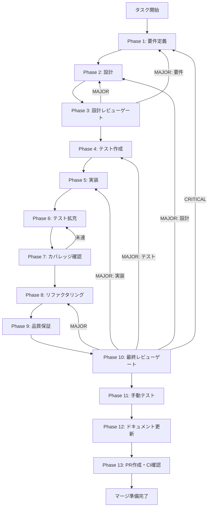

# corrective-rag - タスク実行仕様書

## ユーザーからの元の指示

```
Corrective RAG (CRAG) を実装し、検索結果の関連性を評価・補正する。
低品質な検索結果を検出し、追加検索やWeb検索でコンテキストを補強する自己修正RAGパイプライン。

参照: /docs/30-workflows/unassigned-task/task-07-06-corrective-rag.md
```

## メタ情報

| 項目         | 内容                                   |
| ------------ | -------------------------------------- |
| タスクID     | CONV-07-06                             |
| タスク名     | corrective-rag                         |
| 分類         | 要件                                   |
| 対象機能     | HybridRAG検索エンジン - Corrective RAG |
| 親タスク     | CONV-07 (HybridRAG検索エンジン)        |
| 依存タスク   | CONV-07-05 (RRF Fusion + Reranking)    |
| 優先度       | 高                                     |
| 見積もり規模 | 中規模（0.5日）                        |
| ステータス   | 未実施                                 |
| 作成日       | 2026-01-16                             |

---

## タスク概要

### 目的

Corrective RAG (CRAG) を実装し、HybridRAG検索パイプラインにおける検索結果の品質を自動評価・補正する機能を提供する。

### 背景

HybridRAG検索エンジン（Keyword/Semantic/Graph検索 + RRF Fusion + Reranking）の最終段階として、検索結果の品質を評価し、必要に応じて補正を行うCRAGが必要。CRAG論文に基づく3段階評価（Correct/Incorrect/Ambiguous）により、低品質な検索結果を検出し、追加検索やWeb検索で補強する自己修正メカニズムを実現する。

### 最終ゴール

1. `RelevanceEvaluator`クラスによるLLMベースの関連性評価が動作する
2. `CorrectiveRAG`クラスによる3段階アクション（Correct/Incorrect/Ambiguous）が正しく実行される
3. Web検索による補強機能（オプション）が動作する
4. Knowledge Refinementによる低品質結果のフィルタリングが動作する
5. 全テストがパスし、カバレッジ基準（Line 80%+）を達成する

### 成果物一覧

| 種別         | 成果物                   | 配置先                                                            |
| ------------ | ------------------------ | ----------------------------------------------------------------- |
| 機能         | RelevanceEvaluator       | `packages/shared/src/services/search/crag/relevance-evaluator.ts` |
| 機能         | CorrectiveRAG            | `packages/shared/src/services/search/crag/corrective-rag.ts`      |
| 機能         | 型定義・インターフェース | `packages/shared/src/services/search/crag/types.ts`               |
| テスト       | ユニットテスト           | `packages/shared/src/services/search/crag/__tests__/*.test.ts`    |
| ドキュメント | Phase別成果物            | `outputs/phase-*/`                                                |
| PR           | GitHub Pull Request      | GitHub UI                                                         |

---

## 参照ファイル

本仕様書のコマンド選定は以下を参照：

- `docs/00-requirements/master_system_design.md` - システム要件
- `.claude/skills/aiworkflow-requirements/references/` - システム仕様
- `docs/30-workflows/unassigned-task/task-07-06-corrective-rag.md` - 元タスク指示書

---

## タスク分解サマリー

| ID     | フェーズ | サブタスク名                      | 責務                                 | 依存 |
| ------ | -------- | --------------------------------- | ------------------------------------ | ---- |
| T-01-1 | Phase 1  | 要件抽出・受け入れ基準定義        | CRAG機能要件の明確化                 | -    |
| T-02-1 | Phase 2  | アーキテクチャ設計                | RelevanceEvaluator/CorrectiveRAG設計 | T-01 |
| T-03-1 | Phase 3  | 設計レビューゲート                | 要件・設計の妥当性検証               | T-02 |
| T-04-1 | Phase 4  | テスト作成（TDD: Red）            | 失敗するテストを先に作成             | T-03 |
| T-05-1 | Phase 5  | 実装（TDD: Green）                | テストを通す最小実装                 | T-04 |
| T-06-1 | Phase 6  | テスト拡充                        | カバレッジ向上・統合テスト追加       | T-05 |
| T-07-1 | Phase 7  | カバレッジ確認                    | 基準達成の検証                       | T-06 |
| T-08-1 | Phase 8  | リファクタリング（TDD: Refactor） | コード品質改善                       | T-07 |
| T-09-1 | Phase 9  | 品質保証                          | 静的解析・セキュリティ確認           | T-08 |
| T-10-1 | Phase 10 | 最終レビューゲート                | 全体品質・整合性検証                 | T-09 |
| T-11-1 | Phase 11 | 手動テスト                        | UX・実環境動作確認                   | T-10 |
| T-12-1 | Phase 12 | ドキュメント更新                  | 仕様反映・実装ガイド作成             | T-11 |
| T-13-1 | Phase 13 | PR作成                            | コミット・PR・CI確認                 | T-12 |

**総サブタスク数**: 13個

---

## 実行フロー図



---

## Phase一覧

| Phase | 名称               | 仕様書                                                 | ステータス |
| ----- | ------------------ | ------------------------------------------------------ | ---------- |
| 1     | 要件定義           | [phase-1-requirements.md](phase-1-requirements.md)     | 未実施     |
| 2     | 設計               | [phase-2-design.md](phase-2-design.md)                 | 未実施     |
| 3     | 設計レビューゲート | [phase-3-design-review.md](phase-3-design-review.md)   | 未実施     |
| 4     | テスト作成         | [phase-4-test-creation.md](phase-4-test-creation.md)   | 未実施     |
| 5     | 実装               | [phase-5-implementation.md](phase-5-implementation.md) | 未実施     |
| 6     | テスト拡充         | [phase-6-test-expansion.md](phase-6-test-expansion.md) | 未実施     |
| 7     | カバレッジ確認     | [phase-7-coverage-check.md](phase-7-coverage-check.md) | 未実施     |
| 8     | リファクタリング   | [phase-8-refactoring.md](phase-8-refactoring.md)       | 未実施     |
| 9     | 品質保証           | [phase-9-quality.md](phase-9-quality.md)               | 未実施     |
| 10    | 最終レビューゲート | [phase-10-final-review.md](phase-10-final-review.md)   | 未実施     |
| 11    | 手動テスト         | [phase-11-manual-test.md](phase-11-manual-test.md)     | 未実施     |
| 12    | ドキュメント更新   | [phase-12-documentation.md](phase-12-documentation.md) | 未実施     |
| 13    | PR作成             | [phase-13-pr-creation.md](phase-13-pr-creation.md)     | 未実施     |

---

## テストカバレッジ目標

### ユニットテスト

| 指標              | 最低基準 | 推奨基準 |
| ----------------- | -------- | -------- |
| Line Coverage     | 80%      | 90%      |
| Branch Coverage   | 60%      | 70%      |
| Function Coverage | 80%      | 90%      |

### 結合テスト

| 指標                         | 目標 |
| ---------------------------- | ---- |
| APIエンドポイント            | 100% |
| モジュール間インターフェース | 100% |
| 正常系シナリオ               | 100% |
| 異常系シナリオ               | 80%+ |
| 外部連携ポイント             | 100% |

---

## 統合テスト連携（Phase 1〜11で必須）

各Phaseで以下の統合テスト連携アクションを実施すること:

| Phase | 統合テスト連携アクション                                     |
| ----- | ------------------------------------------------------------ |
| 1     | 接続要件（LLM API/ISearchStrategy/IWebSearcher）を要件に明記 |
| 2     | 統合ポイント/契約（ILLMClient・IWebSearcher）を設計に反映    |
| 3     | 統合テスト観点のレビューゲートを実施                         |
| 4     | 統合テストシナリオを全カテゴリで作成                         |
| 5     | LLM連携・外部サービス接続の実装とテスト支援コード整備        |
| 6     | 統合テストの拡充（全カテゴリのカバレッジ向上）               |
| 7     | 統合テストの再実行とゲート判定                               |
| 8     | リファクタ後の統合テスト継続成功を確認                       |
| 9     | 品質保証で統合テスト結果を確認                               |
| 10    | 最終レビューで統合テスト結果を確認                           |
| 11    | 手動統合テスト（LLM応答/Web検索連携）を確認                  |

---

## Phase完了時の必須アクション

**各Phase完了時に以下を必ず実行すること:**

1. **タスク100%実行**: Phase内で指定された全タスクを完全に実行
2. **成果物確認**: 全ての必須成果物が生成されていることを検証
3. **実行記録**: 実行タスクの結果を記録
4. **artifacts.json更新**: Phase完了ステータスを更新
5. **Phase末端の実行確認**: 各タスクを100%実行し、各タスクを完遂した旨を必ず明記

```bash
# Phase完了時の検証コマンド
node .claude/skills/task-specification-creator/scripts/validate-phase-output.mjs docs/30-workflows/corrective-rag --phase {{PHASE_NUMBER}}

# Phase完了・成果物登録
node .claude/skills/task-specification-creator/scripts/complete-phase.mjs \
  --workflow docs/30-workflows/corrective-rag --phase {{PHASE_NUMBER}} --artifacts "..."
```

---

## CRAGアクション決定フロー

```
検索結果
    ↓
関連性評価 (LLM)
    ↓
┌─────────────────┬─────────────────┬─────────────────┐
│ overall > 0.7   │ 0.3 < overall   │ overall < 0.3   │
│                 │     < 0.7       │                 │
│   CORRECT       │   AMBIGUOUS     │   INCORRECT     │
│                 │                 │                 │
│ そのまま使用    │ フィルタ +      │ 破棄 +          │
│ (オプション:    │ Knowledge       │ Web検索で       │
│  Refinement)    │ Refinement +    │ 補強            │
│                 │ (オプション:    │                 │
│                 │  Web補強)       │                 │
└─────────────────┴─────────────────┴─────────────────┘
```

---

## 関連性評価の閾値

| 閾値設定            | デフォルト | 説明                          |
| ------------------- | ---------- | ----------------------------- |
| correctThreshold    | 0.7        | これ以上で"correct"判定       |
| incorrectThreshold  | 0.3        | これ以下で"incorrect"判定     |
| ambiguousFilter     | 0.4        | ambiguous時の結果フィルタ閾値 |
| minResultsBeforeWeb | 3          | Web検索を行う前の最小結果数   |

---

## 使用方法

1. Phase 1から順次実行
2. 各Phase仕様書の指示に従ってタスクを実行
3. Phase完了時は必ずartifacts.jsonを更新
4. Phase 13でPR作成（ユーザー許可必須）
