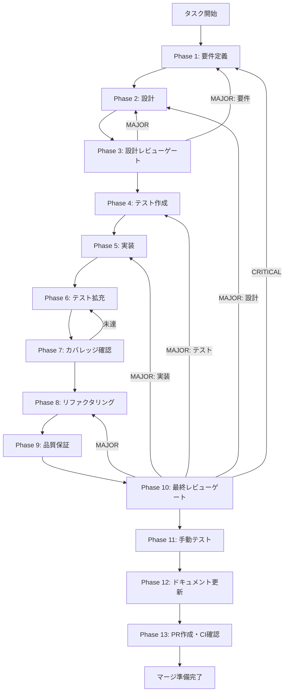

# custom-environment-ui - タスク実行仕様書

## ユーザーからの元の指示

```
カスタム実行環境UI機能を実装する。エージェントが生成した成果物（HTMLスライド、コード、ドキュメント等）をリアルタイムでプレビュー・検証するための専用実行環境を提供する。
```

## メタ情報

| 項目         | 内容               |
| ------------ | ------------------ |
| タスクID     | AGENT-006          |
| タスク名     | カスタム実行環境UI |
| 分類         | 要件               |
| 対象機能     | エージェント機能   |
| 優先度       | 中                 |
| 見積もり規模 | 大規模             |
| ステータス   | 未実施             |
| 作成日       | 2026-01-13         |

---

## 依存関係と並行実行

### 依存関係マップ

```
task-agent-01-dashboard-foundation.md (AGENT-001)
    │
    ├──► task-agent-02-skill-management-ui.md (AGENT-002)
    │
    └──► task-agent-03-skill-management-backend.md (AGENT-003)
              │
              ├──► task-agent-04-execution-ui.md (AGENT-004)
              │
              └──► task-agent-05-claude-code-integration.md (AGENT-005)
                        │
                        ├──► task-agent-06-custom-environment-ui.md (AGENT-006/本タスク)
                        │
                        └──► task-agent-07-environment-backend.md (AGENT-007) ※本タスクと並行可能
```

### 本タスクの位置づけ

| 項目                     | 内容                                                                   |
| ------------------------ | ---------------------------------------------------------------------- |
| 直接依存                 | AGENT-004（エージェント実行UI）, AGENT-005（Claude Code統合）          |
| 並行実行可能             | AGENT-007（実行環境管理バックエンド）※バックエンドはモックで並行開発可 |
| 本タスク完了後に開始可能 | なし（最終タスク）                                                     |

---

## タスク概要

### 目的

スキルの種類に応じたカスタム実行環境（HTMLプレビュー、Markdownプレビュー等）を提供し、エージェントの出力結果をリアルタイムで確認できるようにする。

### 背景

エージェントが生成した成果物（HTMLスライド、コード、ドキュメント等）をリアルタイムでプレビュー・検証するための専用実行環境が必要。例えば、HTMLスライド作成スキルを使用した場合、生成されたHTMLをその場でプレビューできる環境が求められる。

現状の問題点:

- 生成されたHTMLをプレビューする機能がない
- スキルごとに異なる実行環境（HTML、Markdown、コード実行等）を提供する仕組みがない
- エージェントの出力結果を視覚的に確認する手段がチャット表示のみ

### 最終ゴール

- スキル設定に基づいて適切な実行環境が自動選択される
- HTMLプレビュー環境でHTMLコンテンツを表示できる
- プレビューがリアルタイムで更新される
- プレビューとチャットが分割表示される
- 将来的な環境拡張が容易な設計

### 成果物一覧

| 種別         | 成果物                                             | 配置先                                                                       |
| ------------ | -------------------------------------------------- | ---------------------------------------------------------------------------- |
| 機能         | ExecutionEnvironmentコンテナ                       | `apps/desktop/src/renderer/components/organisms/ExecutionEnvironment/`       |
| 機能         | HTMLPreviewEnvironment                             | `apps/desktop/src/renderer/components/organisms/HTMLPreviewEnvironment/`     |
| 機能         | MarkdownPreviewEnvironment                         | `apps/desktop/src/renderer/components/organisms/MarkdownPreviewEnvironment/` |
| 機能         | EnvironmentSelector                                | `apps/desktop/src/renderer/components/molecules/EnvironmentSelector/`        |
| 機能         | SplitLayout                                        | `apps/desktop/src/renderer/components/organisms/SplitLayout/`                |
| 機能         | AgentExecutionView更新                             | `apps/desktop/src/renderer/views/AgentExecutionView/`                        |
| 型定義       | EnvironmentType, EnvironmentConfig, PreviewContent | `packages/shared/src/types/agent.ts`                                         |
| テスト       | コンポーネントテスト                               | `apps/desktop/src/renderer/components/**/*.test.tsx`                         |
| ドキュメント | 各Phase成果物                                      | `outputs/phase-*/`                                                           |
| PR           | GitHub Pull Request                                | GitHub UI                                                                    |

---

## 参照ファイル

本仕様書の実装は以下を参照:

- `docs/00-requirements/master_system_design.md` - システム要件
- `.claude/skills/aiworkflow-requirements/references/` - システム仕様

### システム仕様（aiworkflow-requirements）

> 実装前に必ず以下のシステム仕様を確認し、既存設計との整合性を確保してください。

| 参照資料               | パス                                                                         | 内容                         |
| ---------------------- | ---------------------------------------------------------------------------- | ---------------------------- |
| UIコンポーネントガイド | `.claude/skills/aiworkflow-requirements/references/ui-ux-components.md`      | Atomic Design、Apple HIG準拠 |
| Electronセキュリティ   | `.claude/skills/aiworkflow-requirements/references/security-api-electron.md` | CSP、iframe sandbox設定      |
| Agent SDK仕様          | `.claude/skills/aiworkflow-requirements/references/interfaces-agent-sdk.md`  | agentSlice拡張、IPC通信      |
| アーキテクチャパターン | `.claude/skills/aiworkflow-requirements/references/architecture-patterns.md` | Zustand Sliceパターン        |

---

## タスク分解サマリー

| ID     | フェーズ | サブタスク名       | 責務                                     | 依存 |
| ------ | -------- | ------------------ | ---------------------------------------- | ---- |
| T-01-1 | Phase 1  | 要件定義           | 機能・非機能要件の抽出、受け入れ基準定義 | -    |
| T-02-1 | Phase 2  | 設計               | アーキテクチャ設計、セキュリティ設計     | T-01 |
| T-03-1 | Phase 3  | 設計レビューゲート | セキュリティ・設計レビュー               | T-02 |
| T-04-1 | Phase 4  | テスト作成         | TDD: Red（失敗するテスト作成）           | T-03 |
| T-05-1 | Phase 5  | 実装               | TDD: Green（テストを通す実装）           | T-04 |
| T-06-1 | Phase 6  | テスト拡充         | カバレッジ目標達成のテスト追加           | T-05 |
| T-07-1 | Phase 7  | カバレッジ確認     | カバレッジ目標検証                       | T-06 |
| T-08-1 | Phase 8  | リファクタリング   | TDD: Refactor（品質改善）                | T-07 |
| T-09-1 | Phase 9  | 品質保証           | 静的解析・セキュリティ・性能             | T-08 |
| T-10-1 | Phase 10 | 最終レビューゲート | 全体品質・整合性検証                     | T-09 |
| T-11-1 | Phase 11 | 手動テスト         | UX・実環境動作確認                       | T-10 |
| T-12-1 | Phase 12 | ドキュメント更新   | 実装ガイド・仕様更新・未タスク検出       | T-11 |
| T-13-1 | Phase 13 | PR作成             | コミット・PR作成・CI確認                 | T-12 |

**総サブタスク数**: 13個

---

## 実行フロー図



---

## Phase一覧

| Phase | 名称               | 仕様書                                                 | ステータス |
| ----- | ------------------ | ------------------------------------------------------ | ---------- |
| 1     | 要件定義           | [phase-1-requirements.md](phase-1-requirements.md)     | 未実施     |
| 2     | 設計               | [phase-2-design.md](phase-2-design.md)                 | 未実施     |
| 3     | 設計レビューゲート | [phase-3-design-review.md](phase-3-design-review.md)   | 未実施     |
| 4     | テスト作成         | [phase-4-test-creation.md](phase-4-test-creation.md)   | 未実施     |
| 5     | 実装               | [phase-5-implementation.md](phase-5-implementation.md) | 未実施     |
| 6     | テスト拡充         | [phase-6-test-expansion.md](phase-6-test-expansion.md) | 未実施     |
| 7     | カバレッジ確認     | [phase-7-coverage-check.md](phase-7-coverage-check.md) | 未実施     |
| 8     | リファクタリング   | [phase-8-refactoring.md](phase-8-refactoring.md)       | 未実施     |
| 9     | 品質保証           | [phase-9-quality.md](phase-9-quality.md)               | 未実施     |
| 10    | 最終レビューゲート | [phase-10-final-review.md](phase-10-final-review.md)   | 未実施     |
| 11    | 手動テスト         | [phase-11-manual-test.md](phase-11-manual-test.md)     | 未実施     |
| 12    | ドキュメント更新   | [phase-12-documentation.md](phase-12-documentation.md) | 未実施     |
| 13    | PR作成             | [phase-13-pr-creation.md](phase-13-pr-creation.md)     | 未実施     |

---

## テストカバレッジ目標

### ユニットテスト

| 指標              | 最低基準 | 推奨基準 |
| ----------------- | -------- | -------- |
| Line Coverage     | 80%      | 90%      |
| Branch Coverage   | 60%      | 70%      |
| Function Coverage | 80%      | 90%      |

### 結合テスト

| 指標                         | 目標 |
| ---------------------------- | ---- |
| APIエンドポイント            | 100% |
| モジュール間インターフェース | 100% |
| 正常系シナリオ               | 100% |
| 異常系シナリオ               | 80%+ |
| 外部連携ポイント             | 100% |

---

## 統合テスト連携（Phase 1〜11で必須）

各Phaseで以下の統合テスト連携アクションを実施すること:

| Phase | 統合テスト連携アクション                                           |
| ----- | ------------------------------------------------------------------ |
| 1     | 接続要件（Renderer↔Main IPC、環境切り替え）を要件に明記            |
| 2     | 統合ポイント/契約（agentSlice拡張、IPC通信）を設計に反映           |
| 3     | 統合テスト観点（セキュリティ・状態管理）のレビューゲートを実施     |
| 4     | 統合テストシナリオを全カテゴリで作成（iframe sandbox、状態同期等） |
| 5     | コンポーネント間接続の実装とテスト支援コード整備                   |
| 6     | 統合テストの拡充（全カテゴリのカバレッジ向上）                     |
| 7     | 統合テストの再実行とゲート判定                                     |
| 8     | リファクタ後の統合テスト継続成功を確認                             |
| 9     | 品質保証で統合テスト結果を確認                                     |
| 10    | 最終レビューで統合テスト結果を確認                                 |
| 11    | 手動統合テスト（UI/プレビュー接続）を確認                          |

---

## Phase完了時の必須アクション

**各Phase完了時に以下を必ず実行すること:**

1. **タスク100%実行**: Phase内で指定された全タスクを完全に実行
2. **成果物確認**: 全ての必須成果物が生成されていることを検証
3. **実行記録**: 実行タスクの結果を記録
4. **artifacts.json更新**: Phase完了ステータスを更新
5. **Phase末端の実行確認**: 各タスクを100%実行し、各タスクを完遂した旨を必ず明記

```bash
# Phase完了時の検証コマンド
node .claude/skills/task-specification-creator/scripts/validate-phase-output.mjs docs/30-workflows/custom-environment-ui --phase {{PHASE_NUMBER}}

# Phase完了・成果物登録
node .claude/skills/task-specification-creator/scripts/complete-phase.mjs \
  --workflow docs/30-workflows/custom-environment-ui --phase {{PHASE_NUMBER}} --artifacts "..."
```

---

## セキュリティ要件

本タスクはiframe内でユーザー生成コンテンツを表示するため、以下のセキュリティ対策が必須:

### iframe sandbox設定

| 設定                 | 推奨値 | 理由                     |
| -------------------- | ------ | ------------------------ |
| allow-same-origin    | 有効   | CSSが動作するために必要  |
| allow-scripts        | 無効   | スクリプト実行を禁止     |
| allow-popups         | 無効   | ポップアップ禁止         |
| allow-top-navigation | 無効   | トップナビゲーション禁止 |

### Content Security Policy

```
default-src 'self';
script-src 'none';
style-src 'self' 'unsafe-inline';
img-src 'self' data: https:;
```

### XSS対策

- 親ウィンドウへのアクセスを制限
- アラート・リダイレクトを抑制
- ユーザー入力のサニタイズ

---

## スコープ

### 含むもの

- ExecutionEnvironmentコンテナコンポーネント
- HTMLPreviewEnvironmentコンポーネント
- MarkdownPreviewEnvironmentコンポーネント（基本実装）
- 環境切り替えロジック
- 分割レイアウト（チャット + プレビュー）
- 環境設定のスキルメタデータ定義
- agentSlice拡張（previewContent, selectedEnvironment, splitRatio）

### 含まないもの

- コード実行環境（サンドボックス必要、将来タスク）
- ターミナルエミュレータ（将来タスク）
- バックエンド実行環境管理（別タスク: AGENT-007）

---

## 関連ドキュメント

| ドキュメント                 | パス                                                                            |
| ---------------------------- | ------------------------------------------------------------------------------- |
| 元のタスク指示書             | `docs/30-workflows/unassigned-task/task-agent-06-custom-environment-ui.md`      |
| Agent Execution UI実装ガイド | `docs/30-workflows/agent-execution-ui/outputs/phase-12/implementation-guide.md` |
| Agent SDK仕様                | `.claude/skills/aiworkflow-requirements/references/interfaces-agent-sdk.md`     |
| UIコンポーネントガイド       | `.claude/skills/aiworkflow-requirements/references/ui-ux-components.md`         |
| Electronセキュリティ         | `.claude/skills/aiworkflow-requirements/references/security-api-electron.md`    |
