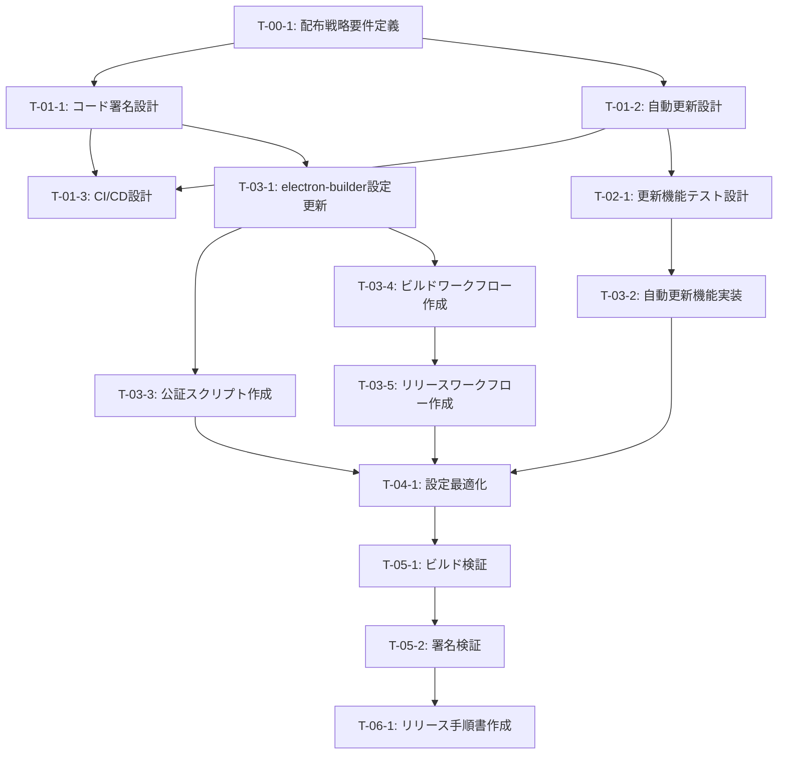

# Electronデスクトップアプリデプロイ - タスク実行仕様書

## ユーザーからの元の指示

```
デスクトップアプリに関しては、どのようにしてデプロイしたらいいのかというところが不明なので、
その辺の最新の情報をリサーチ機能を使って教えてほしいです。
```

---

## タスク概要

### 目的

AIWorkflowOrchestratorのElectronデスクトップアプリケーションを、
macOS、Windows、Linux向けにビルド・配布するための設定と手順を確立する。

### 背景

- 現在のプロジェクトには`apps/desktop`にElectronアプリが存在
- electron-builder v26.0.0がすでに設定済み
- 配布方法（直接ダウンロード、ストア配布、自動更新）を決定する必要がある
- コード署名と公証（macOS）の設定が必要

### 最終ゴール

- macOS（Intel/Apple Silicon）、Windows、Linuxでビルド可能
- コード署名が設定されている（macOS: 公証対応、Windows: SmartScreen対応）
- 自動更新機能（electron-updater）が実装されている
- CI/CD（GitHub Actions）で自動ビルド＆リリースが設定されている

### 成果物一覧

| 種別         | 成果物                   | 配置先                                 |
| ------------ | ------------------------ | -------------------------------------- |
| 設定         | electron-builder設定更新 | apps/desktop/electron-builder.yml      |
| 実装         | 自動更新機能             | apps/desktop/src/main/updater.ts       |
| CI/CD        | ビルドワークフロー       | .github/workflows/build-electron.yml   |
| CI/CD        | リリースワークフロー     | .github/workflows/release-electron.yml |
| ドキュメント | リリース手順書           | docs/deployment/electron-release.md    |

---

## 参照ファイル

本仕様書のコマンド・エージェント・スキル選定は以下を参照：

- `docs/00-requirements/master_system_design.md` - システム要件
- `.claude/commands/command_list.md` - コマンド定義
- `.claude/agents/agent_list.md` - エージェント定義
- `.claude/skills/skill_list.md` - スキル定義
- `apps/desktop/electron-builder.yml` - 現在のビルド設定

---

## 現在の設定状況

### 既存のelectron-builder.yml

```yaml
appId: com.aiworkflow.orchestrator
productName: AI Workflow Orchestrator
directories:
  buildResources: resources
  output: dist
files:
  - out/**/*
  - "!**/*.map"
asarUnpack:
  - resources/**
  - node_modules/better-sqlite3/**
mac:
  category: public.app-category.productivity
  artifactName: ${productName}-${version}-${arch}.${ext}
  target:
    - target: dmg
      arch: [x64, arm64]
    - target: zip
      arch: [x64, arm64]
win:
  target:
    - target: nsis
      arch: [x64]
    - target: zip
      arch: [x64]
nsis:
  oneClick: false
  allowToChangeInstallationDirectory: true
linux:
  target: [AppImage, deb]
  category: Utility
publish:
  provider: github
  releaseType: draft
```

---

## Electronデスクトップアプリ配布ガイド（リサーチ結果）

### 1. コード署名

#### 1.1 macOSコード署名と公証（Notarization）

**必要なもの:**

- Apple Developer Program（$99/年）
- Developer ID Application証明書
- App-specific password（2FA用）

**証明書の取得:**

1. [Apple Developer](https://developer.apple.com/) にログイン
2. Certificates, IDs & Profiles → Certificates
3. 「Developer ID Application」証明書を作成
4. キーチェーンにインストール

**CI/CD用の環境変数:**

```bash
# 証明書をBase64エンコード
base64 -i developer_id_application.p12 -o cert.txt

# GitHub Secretsに設定
CSC_LINK=<base64エンコードされた証明書>
CSC_KEY_PASSWORD=<証明書のパスワード>
APPLE_ID=<Apple Developer ID メール>
APPLE_APP_SPECIFIC_PASSWORD=<App-specific password>
APPLE_TEAM_ID=<Team ID>
```

**electron-builder設定:**

```yaml
mac:
  hardenedRuntime: true
  gatekeeperAssess: false
  entitlements: build/entitlements.mac.plist
  entitlementsInherit: build/entitlements.mac.plist
afterSign: scripts/notarize.js
```

**公証スクリプト (scripts/notarize.js):**

```javascript
const { notarize } = require("@electron/notarize");

exports.default = async function notarizing(context) {
  const { electronPlatformName, appOutDir } = context;
  if (electronPlatformName !== "darwin") return;

  const appName = context.packager.appInfo.productFilename;

  return await notarize({
    tool: "notarytool",
    appPath: `${appOutDir}/${appName}.app`,
    appleId: process.env.APPLE_ID,
    appleIdPassword: process.env.APPLE_APP_SPECIFIC_PASSWORD,
    teamId: process.env.APPLE_TEAM_ID,
  });
};
```

#### 1.2 Windowsコード署名

**2025年推奨オプション:**

1. **Azure Trusted Signing（推奨）**
   - クラウドベース、最も安価
   - SmartScreen警告を即座に解消
   - 米国/カナダの企業・個人開発者向け

2. **DigiCert KeyLocker**
   - クラウドベース署名
   - EV証明書対応

3. **従来のEV証明書**
   - 物理HSMが必要
   - 高コスト（年$400-500）

**electron-builder設定（Azure Trusted Signing）:**

```yaml
win:
  sign: scripts/sign-windows.js
  signingHashAlgorithms: [sha256]
```

#### 1.3 Linux

- コード署名は不要
- Snapcraft Storeはアカウントのみ必要

---

### 2. 自動更新（electron-updater）

#### 2.1 インストール

```bash
# electron-updaterをdesktopパッケージに追加
pnpm --filter @repo/desktop add electron-updater

# 公証用パッケージ（macOS用）
pnpm --filter @repo/desktop add -D @electron/notarize
```

#### 2.2 メインプロセス実装

```typescript
// apps/desktop/src/main/updater.ts
import { autoUpdater } from "electron-updater";
import log from "electron-log";

// ログ設定
autoUpdater.logger = log;
log.transports.file.level = "info";

// 自動ダウンロード無効（ユーザー確認のため）
autoUpdater.autoDownload = false;

export function initAutoUpdater() {
  // 更新確認
  autoUpdater.checkForUpdates();

  // イベントハンドラ
  autoUpdater.on("checking-for-update", () => {
    log.info("Checking for update...");
  });

  autoUpdater.on("update-available", (info) => {
    log.info("Update available:", info.version);
    // UIに通知して、ユーザーの許可を得てダウンロード
  });

  autoUpdater.on("update-not-available", () => {
    log.info("Update not available");
  });

  autoUpdater.on("download-progress", (progress) => {
    log.info(`Download progress: ${progress.percent}%`);
  });

  autoUpdater.on("update-downloaded", () => {
    log.info("Update downloaded");
    // ユーザーに再起動を促す
  });

  autoUpdater.on("error", (err) => {
    log.error("Update error:", err);
  });
}

export function downloadUpdate() {
  autoUpdater.downloadUpdate();
}

export function installUpdate() {
  autoUpdater.quitAndInstall();
}
```

#### 2.3 electron-builder publish設定

```yaml
publish:
  provider: github
  owner: your-username
  repo: AIWorkflowOrchestrator
  releaseType: draft # または release
```

---

### 3. 配布プラットフォーム

#### 3.1 直接ダウンロード（GitHub Releases）- 推奨

**メリット:**

- ストア手数料なし
- 即座のリリース（審査なし）
- 自動更新との統合が容易

**設定:**

```yaml
# electron-builder.yml
publish:
  provider: github
  releaseType: draft
```

**リリースプロセス:**

1. バージョン更新:

   ```bash
   # パッチバージョン（バグ修正）
   cd apps/desktop && pnpm version patch

   # マイナーバージョン（機能追加）
   cd apps/desktop && pnpm version minor

   # メジャーバージョン（破壊的変更）
   cd apps/desktop && pnpm version major
   ```

2. タグプッシュ: `git push --tags`
3. GitHub Actionsが自動ビルド
4. Draftリリースを確認→公開

#### 3.2 Mac App Store（オプション）

**追加要件:**

- MAS用Electronビルド
- App Sandbox対応
- Apple Distribution証明書

**注意点:**

- 機能制限（サンドボックス）
- 審査に時間がかかる
- 30%の手数料

#### 3.3 Microsoft Store（オプション）

**追加要件:**

- AppXパッケージ
- Microsoft Developerアカウント

**設定:**

```yaml
win:
  target:
    - target: appx
      arch: [x64]
```

#### 3.4 Linux配布

**Snap Store:**

```yaml
linux:
  target:
    - target: snap
      arch: [x64]
```

**Flatpak:**

```yaml
linux:
  target:
    - target: flatpak
      arch: [x64]
```

---

### 4. CI/CD（GitHub Actions）

#### 4.1 マルチプラットフォームビルドワークフロー

```yaml
# .github/workflows/build-electron.yml
name: Build Electron App

on:
  push:
    branches: [main, develop]
  pull_request:
    branches: [main]

jobs:
  build:
    strategy:
      matrix:
        include:
          - os: macos-latest
            platform: mac
          - os: macos-14 # Apple Silicon
            platform: mac
          - os: ubuntu-latest
            platform: linux
          - os: windows-latest
            platform: win

    runs-on: ${{ matrix.os }}

    steps:
      - uses: actions/checkout@v4

      - name: Setup Node.js
        uses: actions/setup-node@v4
        with:
          node-version: "22"

      - name: Setup pnpm
        uses: pnpm/action-setup@v3
        with:
          version: 10

      - name: Install dependencies
        run: pnpm install

      - name: Build shared package
        run: pnpm --filter @repo/shared build

      - name: Build Electron app
        run: pnpm --filter @repo/desktop build

      - name: Package (without signing)
        run: pnpm --filter @repo/desktop package
        env:
          CSC_IDENTITY_AUTO_DISCOVERY: false # 署名スキップ（PRビルド用）

      - name: Upload artifacts
        uses: actions/upload-artifact@v4
        with:
          name: ${{ matrix.platform }}-build
          path: apps/desktop/dist/*
```

#### 4.2 リリースワークフロー

```yaml
# .github/workflows/release-electron.yml
name: Release Electron App

on:
  push:
    tags:
      - "v*"

jobs:
  release:
    strategy:
      matrix:
        include:
          - os: macos-latest
            platform: mac
            arch: x64
          - os: macos-14
            platform: mac
            arch: arm64
          - os: ubuntu-latest
            platform: linux
            arch: x64
          - os: windows-latest
            platform: win
            arch: x64

    runs-on: ${{ matrix.os }}

    steps:
      - uses: actions/checkout@v4

      - name: Setup Node.js
        uses: actions/setup-node@v4
        with:
          node-version: "22"

      - name: Setup pnpm
        uses: pnpm/action-setup@v3
        with:
          version: 10

      - name: Install dependencies
        run: pnpm install

      - name: Build shared package
        run: pnpm --filter @repo/shared build

      - name: Build Electron app
        run: pnpm --filter @repo/desktop build

      - name: Package and Publish
        run: pnpm --filter @repo/desktop package
        env:
          GH_TOKEN: ${{ secrets.GITHUB_TOKEN }}
          # macOS signing
          CSC_LINK: ${{ secrets.CSC_LINK }}
          CSC_KEY_PASSWORD: ${{ secrets.CSC_KEY_PASSWORD }}
          APPLE_ID: ${{ secrets.APPLE_ID }}
          APPLE_APP_SPECIFIC_PASSWORD: ${{ secrets.APPLE_APP_SPECIFIC_PASSWORD }}
          APPLE_TEAM_ID: ${{ secrets.APPLE_TEAM_ID }}
          # Windows signing (if configured)
          # WIN_CSC_LINK: ${{ secrets.WIN_CSC_LINK }}
          # WIN_CSC_KEY_PASSWORD: ${{ secrets.WIN_CSC_KEY_PASSWORD }}
```

---

### 5. リリースチェックリスト

#### 事前準備

- [ ] Apple Developer Program加入（macOS用）
- [ ] コード署名証明書取得
- [ ] GitHub Secretsに証明書・パスワード設定
- [ ] electron-updater実装

#### リリース時

1. [ ] `package.json`のバージョン更新
2. [ ] CHANGELOG更新
3. [ ] タグ作成＆プッシュ: `git tag v1.0.0 && git push --tags`
4. [ ] GitHub Actionsでビルド完了を確認
5. [ ] Draft Releaseの内容確認
6. [ ] Release公開

#### リリース後

- [ ] 各プラットフォームでダウンロード確認
- [ ] 自動更新動作確認
- [ ] コード署名確認（SmartScreen、Gatekeeper）

---

## タスク分解サマリー

| ID     | フェーズ         | サブタスク名             | 責務             | 依存           |
| ------ | ---------------- | ------------------------ | ---------------- | -------------- |
| T-00-1 | 要件定義         | 配布戦略要件定義         | 配布方法の決定   | なし           |
| T-01-1 | 設計             | コード署名設計           | 証明書管理設計   | T-00-1         |
| T-01-2 | 設計             | 自動更新設計             | 更新機能設計     | T-00-1         |
| T-01-3 | 設計             | CI/CD設計                | ワークフロー設計 | T-01-1, T-01-2 |
| T-02-1 | テスト作成       | 更新機能テスト設計       | テスト計画       | T-01-2         |
| T-03-1 | 実装             | electron-builder設定更新 | ビルド設定       | T-01-1         |
| T-03-2 | 実装             | 自動更新機能実装         | 更新機能         | T-02-1         |
| T-03-3 | 実装             | 公証スクリプト作成       | macOS公証        | T-03-1         |
| T-03-4 | 実装             | ビルドワークフロー作成   | CI/CD            | T-03-1         |
| T-03-5 | 実装             | リリースワークフロー作成 | CI/CD            | T-03-4         |
| T-04-1 | リファクタリング | 設定最適化               | 品質改善         | T-03-5         |
| T-05-1 | 品質保証         | ビルド検証               | 動作確認         | T-04-1         |
| T-05-2 | 品質保証         | 署名検証                 | セキュリティ確認 | T-05-1         |
| T-06-1 | ドキュメント     | リリース手順書作成       | 文書化           | T-05-2         |

**総サブタスク数**: 14個

---

## 実行フロー図



---

## Phase 0: 要件定義

### T-00-1: 配布戦略要件定義

#### 目的

Electronデスクトップアプリの配布方法と対象プラットフォームを決定する。

#### 背景

配布方法によってコード署名要件、コスト、リリースプロセスが異なる。

#### 責務（単一責務）

配布戦略の決定と要件整理

#### 実行コマンド

```bash
/sc:brainstorm Electronアプリ配布戦略
```

#### 使用エージェント

- **エージェント**: requirements-analyst
- **選定理由**: 要件抽出と構造化分析に特化
- **参照**: `.claude/agents/agent_list.md`

#### 成果物

| 成果物     | パス                                                  | 内容         |
| ---------- | ----------------------------------------------------- | ------------ |
| 要件定義書 | docs/30-workflows/deployment/electron-requirements.md | 配布戦略要件 |

#### 完了条件

- [ ] 対象プラットフォームが決定されている
- [ ] 配布方法（直接/ストア）が決定されている
- [ ] コード署名の要否が明確化されている
- [ ] 自動更新の要否が決定されている

---

## Phase 1: 設計

### T-01-1: コード署名設計

#### 目的

macOSとWindowsのコード署名プロセスを設計する。

#### 責務（単一責務）

コード署名に必要な証明書管理と署名プロセスの設計

#### 実行コマンド

```bash
/ai:secure-electron-app signing
```

#### 使用エージェント

- **エージェント**: security-engineer
- **選定理由**: セキュリティ設定に特化
- **参照**: `.claude/agents/agent_list.md`

#### 成果物

| 成果物     | パス                                                | 内容             |
| ---------- | --------------------------------------------------- | ---------------- |
| 署名設計書 | docs/30-workflows/deployment/code-signing-design.md | 署名プロセス設計 |

#### 完了条件

- [ ] macOS署名プロセスが設計されている
- [ ] Windows署名プロセスが設計されている
- [ ] 証明書管理方法が定義されている
- [ ] CI/CDでの署名方法が設計されている

### T-01-2: 自動更新設計

#### 目的

electron-updaterを使用した自動更新機能を設計する。

#### 責務（単一責務）

自動更新メカニズムの設計

#### 実行コマンド

```bash
/ai:setup-electron-updater --provider github
```

#### 成果物

| 成果物     | パス                                               | 内容         |
| ---------- | -------------------------------------------------- | ------------ |
| 更新設計書 | docs/30-workflows/deployment/auto-update-design.md | 自動更新設計 |

#### 完了条件

- [ ] 更新チェックフローが設計されている
- [ ] ダウンロード＆インストールフローが設計されている
- [ ] UIへの通知方法が設計されている
- [ ] ロールバック戦略が定義されている

---

## Phase 3: 実装

### T-03-1: electron-builder設定更新

#### 目的

現在のelectron-builder.ymlをコード署名と公証に対応させる。

#### 責務（単一責務）

electron-builder設定の更新

#### 実行コマンド

```bash
/ai:build-electron-app all
```

#### 成果物

| 成果物             | パス                                      | 内容                 |
| ------------------ | ----------------------------------------- | -------------------- |
| 設定ファイル       | apps/desktop/electron-builder.yml         | 更新されたビルド設定 |
| エンタイトルメント | apps/desktop/build/entitlements.mac.plist | macOS権限設定        |

#### 完了条件

- [ ] macOS署名設定が追加されている
- [ ] Windows署名設定が追加されている
- [ ] 公証設定が追加されている
- [ ] publish設定が正しく設定されている

### T-03-2: 自動更新機能実装

#### 目的

electron-updaterを使用した自動更新機能を実装する。

#### 責務（単一責務）

自動更新機能のコード実装

#### 実行コマンド

```bash
/ai:setup-electron-updater --provider github
```

#### 成果物

| 成果物         | パス                             | 内容         |
| -------------- | -------------------------------- | ------------ |
| 更新モジュール | apps/desktop/src/main/updater.ts | 自動更新実装 |

#### TDD検証: Green状態確認

```bash
pnpm --filter @repo/desktop test:run
```

- [ ] テストが成功することを確認（Green状態）

#### 完了条件

- [ ] 更新チェック機能が実装されている
- [ ] ダウンロード機能が実装されている
- [ ] インストール機能が実装されている
- [ ] エラーハンドリングが実装されている

### T-03-4: ビルドワークフロー作成

#### 目的

PR/pushごとにElectronアプリをビルドするGitHub Actionsワークフローを作成する。

#### 責務（単一責務）

ビルドCI/CDの実装

#### 実行コマンド

```bash
/ai:create-ci-workflow build
```

#### 成果物

| 成果物       | パス                                 | 内容               |
| ------------ | ------------------------------------ | ------------------ |
| ワークフロー | .github/workflows/build-electron.yml | ビルドワークフロー |

#### 完了条件

- [ ] macOS（Intel/Apple Silicon）ビルドが設定されている
- [ ] Windowsビルドが設定されている
- [ ] Linuxビルドが設定されている
- [ ] アーティファクトアップロードが設定されている

### T-03-5: リリースワークフロー作成

#### 目的

タグプッシュでリリースを作成するGitHub Actionsワークフローを作成する。

#### 責務（単一責務）

リリースCI/CDの実装

#### 実行コマンド

```bash
/ai:release-electron-app workflow
```

#### 成果物

| 成果物       | パス                                   | 内容                 |
| ------------ | -------------------------------------- | -------------------- |
| ワークフロー | .github/workflows/release-electron.yml | リリースワークフロー |

#### 完了条件

- [ ] タグトリガーが設定されている
- [ ] コード署名が設定されている
- [ ] GitHub Releases連携が設定されている
- [ ] 全プラットフォームのビルドが設定されている

---

## 品質ゲートチェックリスト

### 機能検証

- [ ] 全プラットフォームでビルド成功
- [ ] 各プラットフォームでインストール＆起動確認
- [ ] 自動更新機能の動作確認

### コード品質

- [ ] Lintエラーなし
- [ ] 型エラーなし
- [ ] テスト成功

### セキュリティ

- [ ] macOS: Gatekeeperを通過
- [ ] Windows: SmartScreen警告なし
- [ ] 証明書がGitHub Secretsに安全に保存

---

## 前提条件

- apps/desktopにElectronアプリが存在
- electron-builder v26.0.0がインストール済み
- GitHubリポジトリが存在
- Node.js 22.x、pnpm 10.x環境

---

## 備考

### コスト概算（2025年時点）

| 項目                    | コスト      | 備考                     |
| ----------------------- | ----------- | ------------------------ |
| Apple Developer Program | $99/年      | macOS署名・公証に必須    |
| Azure Trusted Signing   | ~$10/月     | Windows署名（推奨）      |
| EV証明書（従来方式）    | $400-500/年 | Windows署名（代替）      |
| GitHub Actions          | 無料〜      | パブリックリポジトリ無料 |

### 推奨配布戦略

1. **初期フェーズ**: GitHub Releases（直接ダウンロード）
2. **成長フェーズ**: + Mac App Store / Microsoft Store
3. **エンタープライズ**: MDM配布対応

### 参考資料

- [Electron Distribution Overview](https://www.electronjs.org/docs/latest/tutorial/distribution-overview)
- [Code Signing | Electron](https://www.electronjs.org/docs/latest/tutorial/code-signing)
- [Auto Update | electron-builder](https://www.electron.build/auto-update.html)
- [electron-builder GitHub](https://github.com/electron-userland/electron-builder)
- [Azure Trusted Signing](https://azure.microsoft.com/en-us/products/trusted-signing/)
