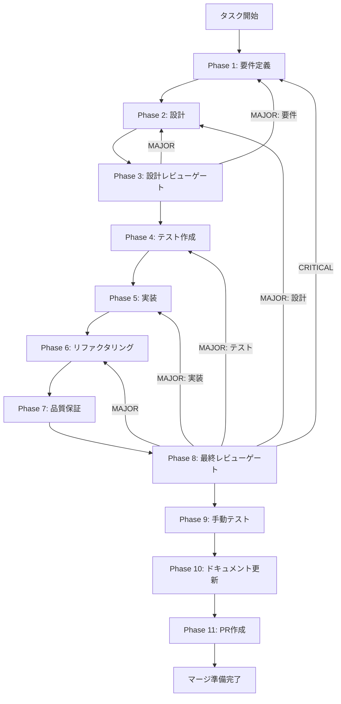

# DiskANN ベクトルインデックス設定 - タスク実行仕様書

## ユーザーからの元の指示

```
埋め込みベクトルを保存し、高速なベクトル類似度検索を可能にするテーブルとインデックスを定義する。
セマンティック検索基盤となる。
```

## メタ情報

| 項目         | 内容                                        |
| ------------ | ------------------------------------------- |
| タスクID     | CONV-04-04                                  |
| Worktreeパス | `.worktrees/task-20260104-165509-wt1`       |
| ブランチ名   | `task-20260104-165509-wt1`                  |
| タスク名     | DiskANN ベクトルインデックス設定            |
| 分類         | 要件                                        |
| 対象機能     | ベクトル検索・セマンティック検索基盤        |
| 優先度       | 高                                          |
| 見積もり規模 | 中規模（0.5日）                             |
| ステータス   | 進行中（Phase 10完了）                      |
| 作成日       | 2026-01-04                                  |
| 依存タスク   | CONV-04-03 (content_chunks テーブル + FTS5) |

---

## タスク概要

### 目的

埋め込みベクトルを保存し、高速なベクトル類似度検索を可能にするテーブルとインデックスを定義する。セマンティック検索基盤となる。

### 背景

libSQLは2024年にベクトル検索機能を追加。DiskANNベースの近似最近傍探索（ANN）をサポートしており、これを活用してRAGシステムのセマンティック検索を実現する。

### 最終ゴール

- `embeddings` テーブルが Drizzle スキーマで定義されている
- ベクトルインデックス作成/削除/再構築が動作する
- コサイン類似度検索・ユークリッド距離検索・内積検索が実装されている
- Float32Array ⇔ Blob 変換が実装されている
- バッチ挿入（100件単位）が実装されている
- 全テストがパス、型エラーなし、ESLint警告なし

### 成果物一覧

| 種別             | 成果物                   | 配置先                                                               |
| ---------------- | ------------------------ | -------------------------------------------------------------------- |
| スキーマ         | embeddingsテーブル定義   | `packages/shared/src/db/schema/embeddings.ts`                        |
| インデックス     | ベクトルインデックス管理 | `packages/shared/src/db/schema/vector-index.ts`                      |
| クエリ           | ベクトル検索クエリ       | `packages/shared/src/db/queries/vector-search.ts`                    |
| リレーション     | リレーション更新         | `packages/shared/src/db/schema/relations.ts`                         |
| マイグレーション | マイグレーションSQL      | `packages/shared/src/db/migrations/0006_create_embeddings_table.sql` |
| テスト           | 単体テスト               | `packages/shared/src/db/schema/__tests__/embeddings.test.ts`         |
| ドキュメント     | Phase別仕様書            | `docs/30-workflows/diskann-vector-index/`                            |

---

## 参照ファイル

本仕様書は以下を参照:

- `docs/30-workflows/unassigned-task/task-04-04-diskann-vector-index.md` - 元タスク仕様
- `docs/00-requirements/master_system_design.md` - システム要件
- `.claude/skills/task-specification-creator/SKILL.md` - スキル定義
- [libSQL Vector Search Documentation](https://github.com/libsql/libsql/blob/main/libsql-sqlite3/doc/vector_search.md)
- [Turso Native Vector Search](https://turso.tech/blog/turso-native-vector-search-now-in-beta)

---

## タスク分解サマリー

| ID     | フェーズ | サブタスク名       | 責務                                       | 依存 |
| ------ | -------- | ------------------ | ------------------------------------------ | ---- |
| T-01-1 | Phase 1  | 要件定義           | 機能要件・非機能要件の明確化               | -    |
| T-02-1 | Phase 2  | 設計               | スキーマ設計・API設計・インデックス設計    | T-01 |
| T-03-1 | Phase 3  | 設計レビューゲート | 要件・設計の妥当性検証                     | T-02 |
| T-04-1 | Phase 4  | テスト作成（Red）  | 失敗するテストを作成                       | T-03 |
| T-05-1 | Phase 5  | 実装（Green）      | テストを通す最小限の実装                   | T-04 |
| T-06-1 | Phase 6  | リファクタリング   | 品質改善                                   | T-05 |
| T-07-1 | Phase 7  | 品質保証           | 静的解析・セキュリティ・パフォーマンス検証 | T-06 |
| T-08-1 | Phase 8  | 最終レビューゲート | 全体品質・整合性検証                       | T-07 |
| T-09-1 | Phase 9  | 手動テスト検証     | UX・実環境動作確認                         | T-08 |
| T-10-1 | Phase 10 | ドキュメント更新   | 仕様書・APIドキュメント更新                | T-09 |
| T-11-1 | Phase 11 | PR作成             | コミット・PR・CI確認                       | T-10 |

**総サブタスク数**: 11個

---

## 実行フロー図



---

## Phase一覧

| Phase | ファイル                       | 説明                  | ステータス |
| ----- | ------------------------------ | --------------------- | ---------- |
| 1     | `phase-1-requirements.md`      | 要件定義              | 完了       |
| 2     | `phase-2-design.md`            | 設計                  | 完了       |
| 3     | `phase-3-design-review.md`     | 設計レビューゲート    | 完了       |
| 4     | `phase-4-test-creation.md`     | テスト作成（TDD Red） | 完了       |
| 5     | `phase-5-implementation.md`    | 実装（TDD Green）     | 完了       |
| 6     | `phase-6-refactoring.md`       | リファクタリング      | 完了       |
| 7     | `phase-7-quality-assurance.md` | 品質保証              | 完了       |
| 8     | `phase-8-final-review.md`      | 最終レビューゲート    | 完了       |
| 9     | `phase-9-manual-test.md`       | 手動テスト検証        | 完了       |
| 10    | `phase-10-documentation.md`    | ドキュメント更新      | 未実施     |
| 11    | `phase-11-pr-creation.md`      | PR作成                | 未実施     |

---

## 依存関係

### このタスクが依存するもの

| タスクID   | タスク名                       | 状態 |
| ---------- | ------------------------------ | ---- |
| CONV-04-03 | content_chunks テーブル + FTS5 | 完了 |

### このタスクに依存するもの

| タスクID   | タスク名                   | 状態   |
| ---------- | -------------------------- | ------ |
| CONV-06-02 | 埋め込みプロバイダー抽象化 | 未実施 |
| CONV-07-03 | ベクトル検索戦略 (DiskANN) | 未実施 |

---

## パフォーマンス指標

| データ規模       | 検索時間（目標） | インデックス使用 |
| ---------------- | ---------------- | ---------------- |
| < 10,000件       | < 50ms           | 不要             |
| 10,000-100,000件 | < 100ms          | 推奨             |
| > 100,000件      | < 200ms          | 必須             |

---

## 備考

- libSQLのベクトル機能は比較的新しく、APIが変更される可能性がある
- 本番環境ではTurso（libSQLのマネージドサービス）の使用を推奨
- 1536次元（OpenAI text-embedding-3-small）を想定しているが、設定で変更可能
- 大規模データセットでは、インデックス構築に時間がかかる場合がある
- `vector_distance_cos`、`vector_distance_l2`、`vector_dot` はlibSQL固有の関数
